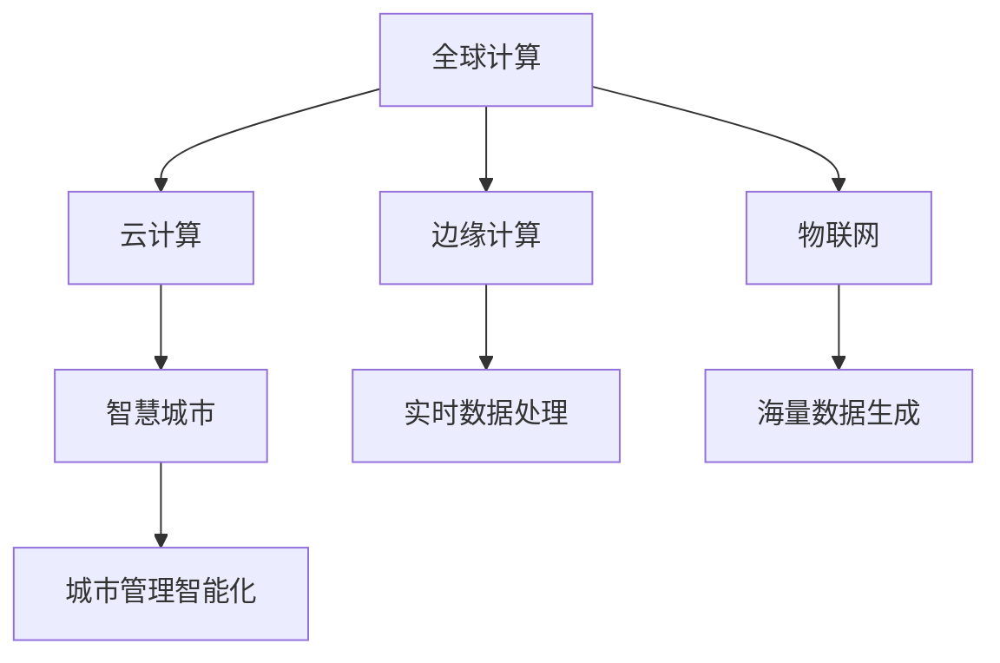

                 

# 连接全球智慧：人类计算的全球影响力

> 关键词：全球计算、人工智能、大数据、云计算、数字鸿沟、智慧城市、边缘计算、物联网

## 1. 背景介绍

### 1.1 问题由来

在全球化的今天，人类社会正处于一场空前的技术革命中。从互联网、物联网、人工智能、大数据，到云计算、边缘计算、区块链，这些技术的深度融合，正在以我们无法想象的速度，改变着人类的生产、生活方式。

这场技术革命不仅推动了经济的快速发展，也带来了全球智慧的快速聚集和扩散。通过数据互联、算法协同，我们得以连接全球的智慧，共同解决人类面临的各种问题。而在这其中，计算技术的作用不容忽视。它不仅是各种新技术的基础设施，也是连接全球智慧的关键纽带。

### 1.2 问题核心关键点

理解人类计算的全球影响力，需从以下几个核心关键点着手：

- **全球计算框架的演进**：从早期的集中式计算，到分布式计算、云计算、边缘计算，以及最新的物联网计算，计算框架不断演进，为全球智慧的聚合和传递提供了可能。
- **数据存储与处理的挑战**：海量数据的生成和处理，带来了存储、传输、计算的巨大挑战。如何在全球范围内高效地存储和处理这些数据，是全球智慧得以实现的前提。
- **算法与计算的协同**：算法不仅是数据处理的工具，也是智慧生成的引擎。如何设计高效、普适的算法，才能使智慧在全球范围内被广泛应用。
- **云计算与边缘计算的结合**：云计算提供了强大的计算能力，而边缘计算则能够高效地处理实时数据，这两者的结合，将带来新的智慧应用场景。
- **物联网与5G的融合**：物联网设备生成的海量数据，需要通过5G网络实时传输到云端进行处理，才能发挥其真正的智慧价值。
- **数字鸿沟的跨越**：如何跨越数字鸿沟，让更多人享有全球智慧带来的红利，是全球计算面临的重要课题。

这些关键点相互交织，共同构成了人类计算的全球影响力，并推动了全球智慧的实现和发展。

### 1.3 问题研究意义

在全球计算框架的推动下，人类社会正进入一个全新的智慧时代。理解并研究人类计算的全球影响力，不仅有助于揭示技术的演进规律，也为我们如何利用这些技术解决实际问题提供了重要参考。

- **技术创新**：理解全球计算的演进趋势，有助于我们把握技术发展脉络，促进新技术的创新。
- **产业升级**：探索全球智慧的实现途径，有助于推动传统产业的数字化、智能化转型。
- **社会公平**：通过技术普及和应用，缩小数字鸿沟，促进社会公平和共享发展。
- **环境影响**：研究全球计算对环境的影响，有助于实现绿色计算，推动可持续发展。
- **安全保障**：在全球智慧应用中，确保数据和算法的安全性，保护用户隐私。

## 2. 核心概念与联系

### 2.1 核心概念概述

为更好地理解人类计算的全球影响力，本节将介绍几个密切相关的核心概念：

- **全球计算**：全球计算框架的演进，包括从早期的集中式计算到分布式计算、云计算、边缘计算，以及最新的物联网计算。
- **云计算**：利用互联网提供按需计算服务，能够处理海量数据，支持全球智慧的存储和处理。
- **边缘计算**：将计算资源部署在网络边缘节点上，实现实时数据处理，提升计算效率。
- **物联网**：通过传感器、智能设备等，生成海量数据，是全球智慧的重要来源。
- **数字鸿沟**：全球范围内技术接入和应用的差距，是全球智慧普及的重要挑战。
- **智慧城市**：利用计算技术，实现城市管理的智能化，提高城市运行效率。

这些核心概念之间的逻辑关系可以通过以下Mermaid流程图来展示：



这个流程图展示了大计算框架下的主要技术组件及其之间的关系：

1. 全球计算框架由集中式、分布式、云计算、边缘计算等技术组成，支撑智慧城市的运行。
2. 云计算和边缘计算通过实时数据处理，保障了智慧城市的智能化运行。
3. 物联网设备生成海量数据，是智慧城市的基础。
4. 智慧城市通过各类计算技术，实现了高效的城市管理。

## 3. 核心算法原理 & 具体操作步骤
### 3.1 算法原理概述

全球计算的演进带来了计算能力的快速提升和数据的快速汇聚，也推动了人工智能、大数据等技术的发展。通过人工智能算法，可以从海量数据中提取出有价值的智慧，并应用于各个领域。以下以基于云计算和边缘计算的智慧城市为例，详细阐述其算法原理和具体操作步骤。

### 3.2 算法步骤详解

#### 3.2.1 数据收集与预处理

智慧城市的数据收集主要包括以下几个方面：

1. **传感器数据**：通过各类传感器，收集环境温度、湿度、空气质量等环境数据。
2. **视频监控数据**：利用摄像头，记录城市交通、公共安全等信息。
3. **智能设备数据**：如智能路灯、智能停车系统等，生成实时状态数据。
4. **社会数据**：如公交出行、网络流量、社交媒体等信息。

数据收集完成后，需要进行预处理：

- **数据清洗**：去除噪声数据，填补缺失值，确保数据质量。
- **数据标注**：对数据进行标注，以便后续的机器学习处理。
- **数据集成**：将不同来源的数据进行统一和整合，形成一个全局数据视图。

#### 3.2.2 特征工程与模型训练

在数据预处理的基础上，进行特征工程：

- **特征提取**：从原始数据中提取有用的特征，如温度、湿度、交通流量等。
- **特征变换**：对提取出的特征进行标准化、归一化等处理，以便更好地训练模型。

接下来进行模型训练：

1. **选择合适的算法**：如决策树、随机森林、支持向量机等。
2. **划分训练集和测试集**：将数据集划分为训练集和测试集，用于模型训练和验证。
3. **模型训练**：使用训练集训练模型，并通过交叉验证等方法优化模型参数。

#### 3.2.3 模型部署与实时监控

模型训练完成后，需要部署到智慧城市的各个节点，进行实时监控：

1. **部署云平台**：将训练好的模型部署到云端，以便实时调用。
2. **部署边缘计算**：在城市的关键节点，如交通灯、停车场等，部署边缘计算节点，实时处理数据。
3. **实时监控**：通过传感器、智能设备等，实时采集数据，并传回云端进行处理。
4. **结果反馈**：将处理结果实时反馈给各个节点，以便进行进一步的优化。

### 3.3 算法优缺点

基于云计算和边缘计算的智慧城市，具有以下优点：

1. **处理能力强**：云计算提供了强大的计算能力，能够处理海量数据。
2. **实时性高**：边缘计算能够快速处理实时数据，满足智慧城市对实时性的要求。
3. **可扩展性好**：能够根据需求动态扩展计算资源，适应智慧城市的发展变化。

但同时，也存在一些缺点：

1. **数据安全**：海量数据的存储和处理，带来了数据安全的挑战。
2. **网络延迟**：数据从边缘节点传输到云端，需要时间，可能影响实时性。
3. **系统复杂度**：涉及多种计算框架和硬件设备，系统设计和管理复杂。

### 3.4 算法应用领域

基于云计算和边缘计算的智慧城市，已经在交通管理、环境监测、公共安全等多个领域得到了广泛应用，成为智慧城市建设的重要技术支撑。

1. **智能交通系统**：利用摄像头、传感器等设备，实时监测交通流量、车辆状态，优化交通信号灯控制，减少拥堵。
2. **环境监测系统**：通过传感器监测空气质量、水质、噪音等，实时反馈给城市管理者，制定环保政策。
3. **公共安全系统**：利用视频监控设备，实时监控公共场所，防范安全事件，提升城市安全水平。
4. **能源管理系统**：通过智能电表、智能照明设备，实时监测能源使用情况，优化能源分配，降低能耗。
5. **智慧医疗系统**：通过物联网设备，实时监测患者健康数据，提供远程医疗服务，提升医疗效率。

## 4. 数学模型和公式 & 详细讲解 & 举例说明

### 4.1 数学模型构建

智慧城市的计算模型可以抽象为一个输入-输出系统，其中输入为环境数据、社会数据等，输出为智慧决策、预警信息等。假设输入数据为 $X$，智慧模型为 $F$，输出数据为 $Y$，则智慧城市的计算模型可以表示为：

$$
Y = F(X)
$$

智慧模型的目标是找到最优的映射关系 $F$，使得输出 $Y$ 尽可能地符合实际情况。

### 4.2 公式推导过程

以智能交通系统为例，计算模型的建立和推导如下：

假设输入数据为 $X = \{x_i\}_{i=1}^N$，其中 $x_i$ 表示某一时刻的交通流量、车速、天气等数据。智慧模型为 $F$，输出数据为 $Y = \{y_i\}_{i=1}^N$，其中 $y_i$ 表示交通信号灯的控制状态。

定义智慧模型的目标函数为：

$$
\mathcal{L}(F) = \frac{1}{N} \sum_{i=1}^N \ell(y_i, F(x_i))
$$

其中 $\ell(y_i, F(x_i))$ 为模型在单个样本上的损失函数。通常选择均方误差（MSE）、交叉熵（CE）等损失函数。

通过最小化目标函数 $\mathcal{L}(F)$，可以得到最优的智慧模型 $F^*$。具体推导过程如下：

$$
F^* = \mathop{\arg\min}_{F} \mathcal{L}(F)
$$

在实际应用中，通常使用梯度下降等优化算法进行求解。

### 4.3 案例分析与讲解

以下以智能交通系统的模型训练为例，详细讲解计算模型的建立和应用过程。

1. **数据收集**：从摄像头、传感器等设备中收集交通流量、车速、天气等信息。
2. **数据预处理**：清洗噪声数据，填补缺失值，将数据标准化。
3. **特征工程**：提取交通流量、车速、天气等特征，作为模型输入。
4. **模型训练**：使用决策树、随机森林等算法，训练智慧模型。
5. **模型部署**：将训练好的模型部署到交通信号灯节点，实时处理数据。
6. **结果反馈**：将处理结果实时反馈给交通信号灯，优化信号控制策略。

通过上述步骤，可以实现智能交通系统的高效运行，提高城市交通效率。

## 5. 项目实践：代码实例和详细解释说明

### 5.1 开发环境搭建

在进行智慧城市项目开发前，我们需要准备好开发环境。以下是使用Python进行TensorFlow开发的环境配置流程：

1. 安装Anaconda：从官网下载并安装Anaconda，用于创建独立的Python环境。

2. 创建并激活虚拟环境：
```bash
conda create -n tf-env python=3.8 
conda activate tf-env
```

3. 安装TensorFlow：从官网获取对应的安装命令。例如：
```bash
pip install tensorflow==2.5
```

4. 安装各类工具包：
```bash
pip install numpy pandas scikit-learn matplotlib tqdm jupyter notebook ipython
```

完成上述步骤后，即可在`tf-env`环境中开始智慧城市项目的开发。

### 5.2 源代码详细实现

下面我们以智慧交通系统为例，给出使用TensorFlow进行模型开发的PyTorch代码实现。

首先，定义智慧模型的数据处理函数：

```python
import tensorflow as tf
from tensorflow.keras import layers

class TrafficModel(tf.keras.Model):
    def __init__(self, input_shape):
        super(TrafficModel, self).__init__()
        self.layers = [
            layers.Dense(128, activation='relu'),
            layers.Dense(128, activation='relu'),
            layers.Dense(1, activation='sigmoid')
        ]
        
    def call(self, x):
        for layer in self.layers:
            x = layer(x)
        return x
```

然后，定义模型和优化器：

```python
model = TrafficModel(input_shape)
optimizer = tf.keras.optimizers.Adam(learning_rate=0.001)
```

接着，定义训练和评估函数：

```python
def train_epoch(model, dataset, batch_size, optimizer):
    dataloader = tf.data.Dataset.from_tensor_slices(dataset).shuffle(10000).batch(batch_size)
    model.compile(optimizer=optimizer, loss='mse')
    model.fit(dataloader, epochs=10, validation_split=0.2)
    
def evaluate(model, dataset, batch_size):
    dataloader = tf.data.Dataset.from_tensor_slices(dataset).shuffle(10000).batch(batch_size)
    model.evaluate(dataloader)
```

最后，启动训练流程并在测试集上评估：

```python
train_dataset = ...
dev_dataset = ...
test_dataset = ...

train_epoch(model, train_dataset, 64, optimizer)
evaluate(model, dev_dataset, 64)
evaluate(model, test_dataset, 64)
```

以上就是使用TensorFlow进行智慧交通系统微调的完整代码实现。可以看到，TensorFlow的Keras API使得模型开发变得简洁高效。

### 5.3 代码解读与分析

让我们再详细解读一下关键代码的实现细节：

**TrafficModel类**：
- `__init__`方法：初始化模型结构，包括三个全连接层。
- `call`方法：实现模型的前向传播，每个层依次处理输入数据。

**train_epoch和evaluate函数**：
- `train_epoch`函数：定义训练循环，对数据集进行批处理，使用Adam优化器进行模型训练，并在验证集上评估性能。
- `evaluate`函数：对测试集进行评估，输出模型损失。

**训练流程**：
- 定义总epoch数和batch size，开始循环迭代
- 每个epoch内，先在训练集上训练，输出平均损失
- 在验证集上评估，输出训练集、验证集的性能
- 所有epoch结束后，在测试集上评估，给出最终测试结果

可以看到，TensorFlow Keras的简洁API使得模型开发变得非常直观。开发者可以将更多精力放在模型设计和数据处理上，而不必过多关注底层实现细节。

## 6. 实际应用场景

### 6.1 智能交通系统

基于云计算和边缘计算的智慧交通系统，已经在全球许多城市得到广泛应用。它通过实时监测和处理交通数据，优化交通信号控制，提升了交通效率，减少了拥堵。

具体而言，智慧交通系统可以包括以下几个部分：

1. **交通监测设备**：如摄像头、传感器等，实时监测交通流量、车速、天气等数据。
2. **数据采集与传输**：通过无线网络将数据实时传输到云端。
3. **智慧模型**：利用深度学习算法，如卷积神经网络（CNN）、循环神经网络（RNN）等，对交通数据进行建模和预测。
4. **交通信号控制**：根据预测结果，动态调整交通信号灯的控制策略，优化交通流量。
5. **实时监控与反馈**：将处理结果实时反馈给交通信号灯，实现自适应控制。

通过智慧交通系统，可以实现交通流量的大数据分析和实时监控，为城市交通管理提供强有力的支撑。

### 6.2 智慧能源管理系统

智慧能源管理系统通过物联网设备，实时监测能源使用情况，优化能源分配，降低能耗。

具体而言，智慧能源管理系统可以包括以下几个部分：

1. **能源监测设备**：如智能电表、智能照明设备等，实时监测能源使用情况。
2. **数据采集与传输**：通过无线网络将数据实时传输到云端。
3. **智慧模型**：利用机器学习算法，如支持向量机（SVM）、随机森林（Random Forest）等，对能源使用数据进行建模和预测。
4. **能源优化**：根据预测结果，动态调整能源分配策略，优化能源使用。
5. **实时监控与反馈**：将处理结果实时反馈给能源管理系统，实现自适应控制。

通过智慧能源管理系统，可以实现能源使用的智能化管理，提升能源利用效率，促进绿色可持续发展。

### 6.3 智慧医疗系统

智慧医疗系统通过物联网设备，实时监测患者健康数据，提供远程医疗服务，提升医疗效率。

具体而言，智慧医疗系统可以包括以下几个部分：

1. **健康监测设备**：如智能手环、智能血压计等，实时监测患者健康数据。
2. **数据采集与传输**：通过无线网络将数据实时传输到云端。
3. **智慧模型**：利用深度学习算法，如卷积神经网络（CNN）、循环神经网络（RNN）等，对健康数据进行建模和预测。
4. **远程医疗服务**：根据预测结果，提供个性化的健康建议和治疗方案。
5. **实时监控与反馈**：将处理结果实时反馈给患者，实现自适应控制。

通过智慧医疗系统，可以实现健康数据的实时监测和分析，提供个性化的医疗服务，提升医疗效率，改善患者健康状况。

### 6.4 未来应用展望

随着计算技术的不断发展，基于云计算和边缘计算的智慧应用将不断涌现，为全球智慧的实现提供更多可能。

1. **5G与物联网的融合**：5G网络的高带宽、低延迟特性，将进一步推动物联网设备的发展，带来更多的智慧应用场景。
2. **边缘计算的普及**：边缘计算将实时处理海量数据，提高计算效率，降低网络延迟。
3. **智慧城市的扩展**：智慧城市的应用将从交通、能源、医疗等，扩展到更多领域，如教育、旅游、环保等。
4. **全球计算框架的演进**：云计算、边缘计算、物联网等技术将进一步融合，形成更加强大、灵活的全球计算框架。
5. **绿色计算与可持续发展**：智慧计算将注重绿色环保，推动可持续发展，减少能源消耗和环境污染。

未来，智慧计算将在各个领域发挥更大的作用，推动全球智慧的进一步实现。

## 7. 工具和资源推荐
### 7.1 学习资源推荐

为了帮助开发者系统掌握智慧城市的技术基础和应用方法，这里推荐一些优质的学习资源：

1. **《智慧城市技术与应用》系列博文**：由智慧城市领域专家撰写，全面介绍了智慧城市的基本概念、技术架构和应用案例。

2. **智慧城市公开课**：国内知名大学的公开课，系统讲解智慧城市的技术基础和设计思路，适合入门学习。

3. **《智慧城市概论》书籍**：全面介绍智慧城市的发展历程、技术架构和应用案例，适合深入学习。

4. **智慧城市开源项目**：全球知名的智慧城市开源项目，提供了丰富的代码和文档，适合学习和实践。

5. **智慧城市联盟**：行业内的学术组织和研究机构，定期发布智慧城市的最新研究成果和技术动态。

通过对这些资源的学习实践，相信你一定能够快速掌握智慧城市的技术框架和应用方法，并用于解决实际的智慧问题。

### 7.2 开发工具推荐

高效的开发离不开优秀的工具支持。以下是几款用于智慧城市开发常用的工具：

1. **TensorFlow**：开源的机器学习框架，提供强大的计算图和分布式训练能力，适合处理复杂的数据和模型。
2. **TensorFlow Serving**：提供模型部署和推理服务，支持大规模模型的实时调用。
3. **Kubernetes**：开源的容器编排工具，支持智慧城市的集群管理和资源调度。
4. **OpenStack**：开源的云计算平台，提供虚拟化、存储、网络等基础设施服务。
5. **AWS、Google Cloud、阿里云**：全球主流的云计算平台，提供丰富的云计算服务和工具。

合理利用这些工具，可以显著提升智慧城市项目的开发效率，加快创新迭代的步伐。

### 7.3 相关论文推荐

智慧城市和计算技术的发展源于学界的持续研究。以下是几篇奠基性的相关论文，推荐阅读：

1. **《智慧城市的概念、体系架构与关键技术》**：全面介绍智慧城市的概念、体系架构和技术实现方法。
2. **《基于云计算的智慧城市关键技术研究》**：研究智慧城市中云计算的应用，探讨云计算对智慧城市的影响。
3. **《物联网与智慧城市：技术、应用与未来》**：探讨物联网与智慧城市的融合，研究物联网对智慧城市的影响。
4. **《智慧医疗的计算技术架构与关键技术》**：研究智慧医疗的计算技术架构，探讨计算技术在智慧医疗中的应用。
5. **《智慧能源管理的计算技术研究》**：研究智慧能源管理的计算技术，探讨计算技术在能源管理中的应用。

这些论文代表了大智慧技术的发展脉络，通过学习这些前沿成果，可以帮助研究者把握学科前进方向，激发更多的创新灵感。

## 8. 总结：未来发展趋势与挑战

### 8.1 总结

本文对基于云计算和边缘计算的智慧城市进行全面系统的介绍。首先阐述了智慧城市的背景和核心关键点，明确了智慧城市在各个领域的应用价值。其次，从原理到实践，详细讲解了智慧城市的数据收集、特征工程、模型训练、模型部署等关键步骤，给出了智慧城市项目开发的完整代码实例。同时，本文还广泛探讨了智慧城市在智能交通、智慧能源、智慧医疗等多个行业领域的应用前景，展示了智慧城市技术的广阔前景。

通过本文的系统梳理，可以看到，基于云计算和边缘计算的智慧城市正在成为智慧时代的重要基础设施，极大地推动了各行业的发展和变革。未来，伴随智慧计算技术的不断演进，智慧城市必将在更多领域得到应用，为全球智慧的实现提供更多可能。

### 8.2 未来发展趋势

展望未来，智慧计算的发展将呈现以下几个趋势：

1. **智慧计算的普及**：智慧计算将不断普及到各个领域，推动智慧应用的广泛发展。
2. **5G与物联网的融合**：5G网络的高带宽、低延迟特性，将进一步推动物联网设备的发展，带来更多的智慧应用场景。
3. **边缘计算的普及**：边缘计算将实时处理海量数据，提高计算效率，降低网络延迟。
4. **智慧城市的扩展**：智慧城市的应用将从交通、能源、医疗等，扩展到更多领域，如教育、旅游、环保等。
5. **全球计算框架的演进**：云计算、边缘计算、物联网等技术将进一步融合，形成更加强大、灵活的全球计算框架。
6. **绿色计算与可持续发展**：智慧计算将注重绿色环保，推动可持续发展，减少能源消耗和环境污染。

以上趋势凸显了智慧计算技术的广阔前景，这些方向的探索发展，必将进一步推动智慧城市的建设，为人类社会的智能化转型提供更多可能。

### 8.3 面临的挑战

尽管智慧计算技术已经取得了瞩目成就，但在迈向更加智能化、普适化应用的过程中，仍面临诸多挑战：

1. **数据安全与隐私**：海量数据的存储和处理，带来了数据安全和隐私保护的问题。如何确保数据的安全和隐私，将是智慧计算面临的重要课题。
2. **计算资源消耗**：海量数据的处理和分析，需要强大的计算资源，但同时也会带来资源消耗和成本问题。如何平衡计算资源和成本，将是智慧计算技术发展的重要挑战。
3. **算法复杂度**：智慧计算中涉及的算法复杂度较高，需要更多的理论和实验验证。如何设计高效、可解释的算法，将是智慧计算技术发展的关键。
4. **系统复杂度**：智慧计算涉及多种技术架构和基础设施，系统设计和管理复杂。如何构建简单、高效、可靠的系统，将是智慧计算技术发展的方向。
5. **跨领域融合**：智慧计算需要与多个领域的知识和技术进行融合，如医疗、能源、交通等。如何实现跨领域协同，将智慧计算技术应用到更多领域，将是智慧计算技术发展的重点。

这些挑战需要全球智慧的技术社区共同努力，不断创新和突破，才能推动智慧计算技术的不断进步。

### 8.4 研究展望

面对智慧计算技术面临的挑战，未来的研究需要在以下几个方面寻求新的突破：

1. **智慧计算基础设施的升级**：升级智慧计算基础设施，提升计算资源和数据处理能力。
2. **智慧计算算法的设计**：设计高效、可解释、跨领域的智慧计算算法，提升智慧计算的普适性和可用性。
3. **智慧计算框架的优化**：优化智慧计算框架，提高系统设计和管理的效率，降低资源消耗。
4. **智慧计算安全保障**：研究智慧计算安全保障技术，确保数据和算法的安全性，保护用户隐私。
5. **智慧计算的跨领域应用**：研究智慧计算跨领域应用的场景和方法，推动智慧计算技术的广泛应用。

这些研究方向的探索，将推动智慧计算技术的发展，为构建更加智能、普适、可持续的智慧社会提供更多可能。相信在全球智慧社区的共同努力下，智慧计算技术必将在未来取得更多突破，推动全球智慧的不断实现和发展。

## 9. 附录：常见问题与解答

**Q1：智慧城市建设需要哪些关键技术？**

A: 智慧城市建设需要以下关键技术：

1. **物联网技术**：通过传感器、智能设备等，实时采集城市数据，提供实时监测能力。
2. **云计算技术**：利用云计算平台，存储和处理海量数据，提供强大的计算能力。
3. **边缘计算技术**：在城市关键节点，实时处理数据，提升计算效率，降低网络延迟。
4. **大数据技术**：利用大数据技术，进行数据挖掘和分析，发现数据中的智慧。
5. **人工智能技术**：利用人工智能算法，进行数据建模和预测，提供智慧决策支持。

**Q2：智慧城市建设过程中，如何处理数据安全和隐私问题？**

A: 智慧城市建设过程中，数据安全和隐私保护是一个重要课题。以下是一些处理数据安全和隐私问题的建议：

1. **数据加密**：对存储和传输的数据进行加密处理，确保数据安全。
2. **访问控制**：采用严格的访问控制机制，确保只有授权用户才能访问数据。
3. **匿名化处理**：对数据进行匿名化处理，保护个人隐私。
4. **安全审计**：建立安全审计机制，及时发现和修复安全漏洞。
5. **法律合规**：遵守相关法律法规，确保数据处理符合法律要求。

**Q3：智慧城市建设过程中，如何确保计算资源的高效利用？**

A: 智慧城市建设过程中，计算资源的高效利用是一个重要课题。以下是一些确保计算资源高效利用的建议：

1. **资源优化**：采用资源优化技术，如梯度积累、混合精度训练等，减少计算资源消耗。
2. **模型压缩**：采用模型压缩技术，减小模型大小，提升计算效率。
3. **分布式计算**：利用分布式计算技术，分散计算负载，提升计算能力。
4. **缓存技术**：采用缓存技术，提高数据读取效率，减少计算延迟。
5. **自动调优**：利用自动调优技术，动态调整计算资源，优化计算效率。

这些技术手段将帮助智慧城市实现高效、经济的计算资源利用。

**Q4：智慧城市建设过程中，如何确保算法的可解释性和可审计性？**

A: 智慧城市建设过程中，算法的可解释性和可审计性是一个重要课题。以下是一些确保算法可解释性和可审计性的建议：

1. **模型透明**：采用透明的算法模型，便于用户理解和解释。
2. **可解释模型**：选择可解释的算法模型，如决策树、线性回归等，便于用户理解和解释。
3. **结果可视化**：对算法结果进行可视化展示，便于用户理解和解释。
4. **模型审查**：定期审查算法模型，发现和修正错误。
5. **责任明确**：明确算法的责任主体，确保算法的可审计性。

这些技术手段将帮助智慧城市实现算法的可解释性和可审计性，提升系统的可信度和用户满意度。

**Q5：智慧城市建设过程中，如何确保系统的安全性和稳定性？**

A: 智慧城市建设过程中，系统的安全性和稳定性是一个重要课题。以下是一些确保系统安全性和稳定性的建议：

1. **安全防护**：采用安全防护技术，如访问鉴权、数据脱敏等，确保系统安全。
2. **异常检测**：建立异常检测机制，及时发现和修复系统漏洞。
3. **备份和恢复**：定期备份系统数据，确保系统故障后的快速恢复。
4. **冗余设计**：设计冗余系统架构，确保系统的高可用性。
5. **自动监控**：建立自动监控机制，及时发现和处理系统问题。

这些技术手段将帮助智慧城市实现系统的安全性和稳定性，提升系统的可靠性和用户体验。

---

作者：禅与计算机程序设计艺术 / Zen and the Art of Computer Programming

