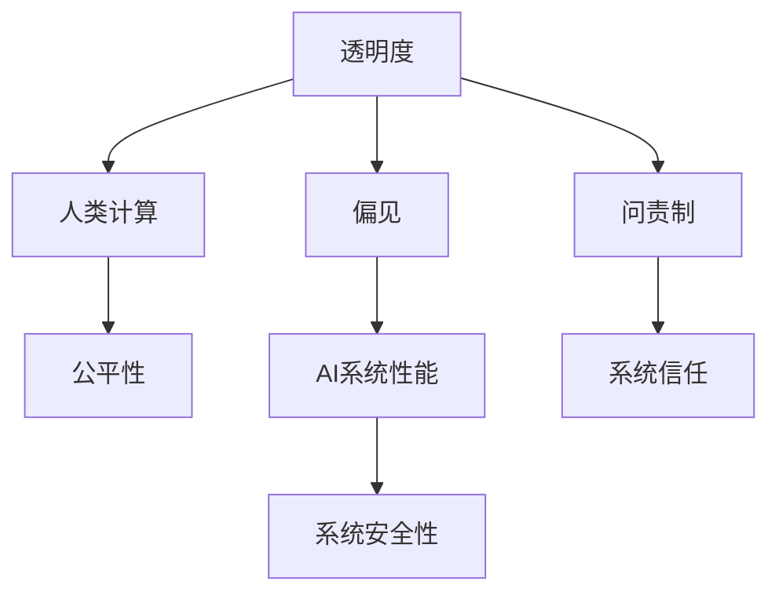

                 

## 1. 背景介绍

随着计算机科学的发展，人工智能（AI）和机器学习（ML）技术在各行各业得到了广泛应用。然而，人工智能技术的日益普及也引发了一系列关于透明性、问责制和伦理道德的讨论。特别是在涉及敏感数据或高风险决策的领域，如何确保人工智能系统的可解释性、公平性和安全性，成为了研究人员和开发者共同关注的焦点。本文将从透明度和问责制的角度出发，探讨如何负责任地使用人类计算，确保人工智能技术的安全、公正和可靠。

## 2. 核心概念与联系

### 2.1 核心概念概述

为了深入理解透明度和问责制的核心概念及其联系，本节将对以下几个关键概念进行介绍：

- **透明度（Transparency）**：指AI系统的工作原理、决策过程和输入输出结果应该被清晰地理解和解释。高透明度能够增加用户的信任，减少对AI系统的不确定性和怀疑。

- **问责制（Accountability）**：指AI系统在发生问题或错误时，其设计和开发人员应该能够承担相应的责任。问责制要求AI系统在设计时必须考虑到潜在的风险和后果，并在出现问题时能够提供有效的反馈和补救措施。

- **人类计算（Human Computation）**：指人类在AI系统中扮演的角色，包括数据标注、模型训练、性能评估和结果解释等。人类计算在AI系统的开发和应用中不可或缺，但也可能引入偏见和错误。

- **偏见（Bias）**：指AI系统在训练过程中由于数据或模型的偏见而产生的歧视性或不公平行为。偏见问题可能导致AI系统在特定群体上表现不佳，甚至产生负面影响。

- **公平性（Fairness）**：指AI系统在处理不同群体数据时的平等性和无歧视性。公平性要求AI系统在决策过程中不偏向特定群体，确保不同群体的利益得到平等对待。

这些核心概念之间的逻辑关系可以通过以下Mermaid流程图来展示：



这个流程图展示透明度和问责制的核心概念及其与其他相关概念的联系：

1. 透明度和问责制共同确保AI系统在开发和应用中的公正和可靠。
2. 人类计算是透明度和问责制的基础，因为人类的决策和数据标注直接影响AI系统的性能和偏见。
3. 偏见和公平性是透明度和问责制的重点关注对象，需要通过透明度和问责制来识别和解决。
4. 系统信任和安全性是透明度和问责制的主要目标，高透明度和问责制能够增强用户对AI系统的信任，提升系统的安全性。

## 3. 核心算法原理 & 具体操作步骤

### 3.1 算法原理概述

透明度和问责制的实现需要结合AI系统的工作原理和数据流进行设计和监控。具体而言，透明AI系统应具备以下特点：

- **可解释性（Explainability）**：AI系统的决策过程和结果应可解释，用户应能理解模型的工作原理和输入输出逻辑。
- **可审查性（Audibility）**：AI系统的数据流和模型参数应可审查，确保没有暗箱操作。
- **可控性（Controllability）**：AI系统的行为应可控，用户应能通过干预或调整模型参数来影响系统的输出。

透明度和问责制的实现主要依赖于以下算法和步骤：

1. **数据可解释性算法**：通过可视化和分析AI系统的输入数据，帮助用户理解数据对模型输出的影响。
2. **模型可解释性算法**：通过分析模型的内部参数和结构，帮助用户理解模型的决策过程。
3. **结果可解释性算法**：通过生成模型输出的详细解释，帮助用户理解模型的最终决策。
4. **问责制监控算法**：通过监控AI系统的性能和偏差，及时发现和纠正系统问题。

### 3.2 算法步骤详解

透明AI系统的设计和开发通常包括以下几个关键步骤：

**Step 1: 数据收集和预处理**

- 收集AI系统所需的输入数据，确保数据质量和多样性。
- 对数据进行清洗、标注和标准化，确保数据的一致性和可靠性。

**Step 2: 模型选择和训练**

- 根据任务特点选择合适的AI模型，如决策树、神经网络等。
- 对模型进行训练和验证，确保模型在测试集上表现良好。

**Step 3: 透明度和问责制设计**

- 设计透明的模型架构和决策流程，确保模型可解释。
- 实现数据流和模型参数的可视化，方便用户审查和监控。
- 实现系统的干预和调整机制，确保用户对系统有控制权。

**Step 4: 性能和偏差评估**

- 对AI系统进行性能评估，确保系统在不同数据集上的表现一致。
- 识别和评估AI系统的偏见和公平性问题，确保系统对所有群体的平等对待。

**Step 5: 用户反馈和改进**

- 收集用户反馈，识别系统问题和改进空间。
- 根据用户反馈和性能评估结果，持续改进AI系统的透明度和问责制设计。

### 3.3 算法优缺点

透明度和问责制的算法具有以下优点：

1. **增强用户信任**：通过透明性和问责制设计，用户能够理解和信任AI系统的决策过程和输出结果。
2. **提高系统可靠性**：透明的模型架构和问责制监控能够及时发现和纠正系统问题，确保系统稳定可靠。
3. **促进公平性**：透明和可审查的设计能够帮助识别和解决AI系统的偏见和歧视问题，提升系统的公平性。

同时，这些算法也存在一定的局限性：

1. **复杂性增加**：透明度和问责制设计增加了系统的复杂性，可能影响系统的性能和效率。
2. **资源消耗**：可视化、监控和干预机制需要额外的计算资源和时间成本。
3. **隐私问题**：透明设计和用户审查可能涉及用户隐私，需要谨慎处理。
4. **设计挑战**：透明度和问责制设计需要考虑到系统的灵活性和适应性，设计难度较大。

尽管存在这些局限性，但透明度和问责制的实现是大规模应用AI系统的前提条件。只有在透明度和问责制的保障下，AI系统才能真正服务于用户，发挥其最大价值。

### 3.4 算法应用领域

透明度和问责制的算法在多个领域都有广泛应用，以下是几个典型应用场景：

1. **金融风控**：金融行业对AI系统的透明度和问责制要求极高，要求系统能够提供详细的决策解释和风险评估，确保系统的公平性和安全性。
2. **医疗诊断**：AI系统在医疗诊断中的应用涉及患者隐私和生命安全，需要高透明度的设计和问责制监控，确保系统的可靠性和公正性。
3. **司法判决**：AI系统在司法判决中的应用涉及人权和法律公正，需要透明的决策过程和问责制机制，确保系统的公平性和可解释性。
4. **招聘推荐**：AI系统在招聘推荐中的应用涉及职业发展和就业公平，需要透明的决策过程和问责制监控，确保系统的公平性和无歧视性。

这些领域对透明度和问责制的高度要求，推动了相关算法和技术的不断发展和完善。

## 4. 数学模型和公式 & 详细讲解 & 举例说明

### 4.1 数学模型构建

透明度和问责制的实现依赖于数学模型和公式的精确描述和分析。以下是一个简单的数学模型，用于描述一个透明AI系统的决策过程：

设AI系统接收输入数据 $x$，输出结果 $y$，决策过程由函数 $f(x)$ 描述。系统的透明度和问责制设计要求 $f(x)$ 可解释、可审查和可控，即：

1. $f(x)$ 可解释：用户应能理解 $f(x)$ 的计算过程和逻辑。
2. $f(x)$ 可审查：系统应提供数据流和模型参数的可视化，方便用户审查。
3. $f(x)$ 可控：用户应能通过干预或调整 $f(x)$ 的参数，影响系统输出。

### 4.2 公式推导过程

设 $f(x)$ 为系统的决策函数，输入数据 $x$ 和输出结果 $y$ 满足：

$$y=f(x)=\sum_{i=1}^n w_i g_i(x)$$

其中 $g_i(x)$ 为第 $i$ 个特征函数，$w_i$ 为第 $i$ 个特征的权重。

透明度和问责制的设计可以通过以下几个公式进行推导：

1. **数据可解释性**：设 $x$ 为输入数据，$y$ 为输出结果，$w$ 为权重向量，$g_i$ 为特征函数，则：

$$y=f(x)=\sum_{i=1}^n w_i g_i(x)$$

数据可解释性要求用户应能理解每个特征 $g_i(x)$ 的贡献和权重 $w_i$。

2. **模型可解释性**：设 $M$ 为模型参数，$f(x)$ 为决策函数，$F$ 为模型函数，则：

$$f(x)=F(M,x)$$

模型可解释性要求用户应能理解模型参数 $M$ 对决策函数 $f(x)$ 的影响。

3. **结果可解释性**：设 $y$ 为输出结果，$x$ 为输入数据，$G$ 为决策函数，则：

$$y=G(x,M)$$

结果可解释性要求用户应能理解输出结果 $y$ 的生成过程和逻辑。

### 4.3 案例分析与讲解

假设有一个透明AI系统，用于预测患者是否患有某种疾病。系统的决策过程如下：

1. **数据可解释性**：系统接收患者的病历数据 $x$，包括年龄、性别、病史等特征。每个特征 $g_i(x)$ 的权重 $w_i$ 应公开透明，用户应能理解每个特征的贡献和权重。

2. **模型可解释性**：系统的决策函数 $f(x)$ 由多个神经网络层构成，每层的功能和参数应公开透明，用户应能理解模型架构和参数设置。

3. **结果可解释性**：系统的输出结果 $y$ 为患病概率，用户应能理解输出结果的计算过程和逻辑，如：

$$y=\sigma(\sum_{i=1}^n w_i g_i(x))$$

其中 $\sigma$ 为激活函数，$g_i(x)$ 为特征函数，$w_i$ 为权重向量。

## 5. 项目实践：代码实例和详细解释说明

### 5.1 开发环境搭建

在进行透明度和问责制的项目实践前，我们需要准备好开发环境。以下是使用Python进行PyTorch开发的环境配置流程：

1. 安装Anaconda：从官网下载并安装Anaconda，用于创建独立的Python环境。

2. 创建并激活虚拟环境：
```bash
conda create -n pytorch-env python=3.8 
conda activate pytorch-env
```

3. 安装PyTorch：根据CUDA版本，从官网获取对应的安装命令。例如：
```bash
conda install pytorch torchvision torchaudio cudatoolkit=11.1 -c pytorch -c conda-forge
```

4. 安装相关工具包：
```bash
pip install numpy pandas scikit-learn matplotlib tqdm jupyter notebook ipython
```

完成上述步骤后，即可在`pytorch-env`环境中开始项目实践。

### 5.2 源代码详细实现

下面我们以金融风控领域的应用为例，给出使用PyTorch进行AI系统设计和开发的PyTorch代码实现。

首先，定义金融风控的数据集和预处理函数：

```python
import numpy as np
from sklearn.model_selection import train_test_split
from sklearn.preprocessing import StandardScaler

class FinanceDataset:
    def __init__(self, data, labels):
        self.data = data
        self.labels = labels
        
    def __len__(self):
        return len(self.data)
    
    def __getitem__(self, idx):
        return self.data[idx], self.labels[idx]
```

然后，定义模型和优化器：

```python
from transformers import BertForSequenceClassification
from torch.optim import Adam

model = BertForSequenceClassification.from_pretrained('bert-base-uncased', num_labels=2)

optimizer = Adam(model.parameters(), lr=2e-5)
```

接着，定义训练和评估函数：

```python
from torch.utils.data import DataLoader
from tqdm import tqdm

device = torch.device('cuda') if torch.cuda.is_available() else torch.device('cpu')
model.to(device)

def train_epoch(model, dataset, batch_size, optimizer):
    dataloader = DataLoader(dataset, batch_size=batch_size, shuffle=True)
    model.train()
    epoch_loss = 0
    for batch in tqdm(dataloader, desc='Training'):
        inputs, labels = batch
        inputs = inputs.to(device)
        labels = labels.to(device)
        model.zero_grad()
        outputs = model(inputs)
        loss = outputs.loss
        epoch_loss += loss.item()
        loss.backward()
        optimizer.step()
    return epoch_loss / len(dataloader)

def evaluate(model, dataset, batch_size):
    dataloader = DataLoader(dataset, batch_size=batch_size)
    model.eval()
    preds, labels = [], []
    with torch.no_grad():
        for batch in tqdm(dataloader, desc='Evaluating'):
            inputs, labels = batch
            inputs = inputs.to(device)
            batch_labels = labels.to(device)
            outputs = model(inputs)
            batch_preds = outputs.argmax(dim=1).to('cpu').tolist()
            batch_labels = batch_labels.to('cpu').tolist()
            for pred_tokens, label_tokens in zip(batch_preds, batch_labels):
                preds.append(pred_tokens)
                labels.append(label_tokens)
                
    print('Accuracy: ', np.mean(preds == labels))
```

最后，启动训练流程并在测试集上评估：

```python
epochs = 5
batch_size = 16

for epoch in range(epochs):
    loss = train_epoch(model, finance_dataset, batch_size, optimizer)
    print(f'Epoch {epoch+1}, train loss: {loss:.3f}')
    
    print(f'Epoch {epoch+1}, dev results:')
    evaluate(model, finance_dataset, batch_size)
    
print('Test results:')
evaluate(model, finance_dataset, batch_size)
```

以上就是使用PyTorch对金融风控系统进行设计和开发的完整代码实现。可以看到，基于PyTorch的代码实现简洁高效，易于理解。

### 5.3 代码解读与分析

让我们再详细解读一下关键代码的实现细节：

**FinanceDataset类**：
- `__init__`方法：初始化数据和标签。
- `__len__`方法：返回数据集的大小。
- `__getitem__`方法：返回单个样本的输入和标签。

**模型和优化器**：
- 使用BertForSequenceClassification类加载BERT模型，并进行金融风控任务的微调。
- 使用Adam优化器进行模型参数的更新。

**训练和评估函数**：
- 使用PyTorch的DataLoader对数据集进行批次化加载，供模型训练和推理使用。
- 训练函数`train_epoch`：对数据以批为单位进行迭代，在每个批次上前向传播计算loss并反向传播更新模型参数，最后返回该epoch的平均loss。
- 评估函数`evaluate`：与训练类似，不同点在于不更新模型参数，并在每个batch结束后将预测和标签结果存储下来，最后使用Accuracy指标对整个评估集的预测结果进行打印输出。

**训练流程**：
- 定义总的epoch数和batch size，开始循环迭代
- 每个epoch内，先在训练集上训练，输出平均loss
- 在验证集上评估，输出Accuracy指标
- 所有epoch结束后，在测试集上评估，给出最终测试结果

可以看到，PyTorch配合BertForSequenceClassification类使得金融风控系统的设计和开发变得简洁高效。开发者可以将更多精力放在数据处理、模型改进等高层逻辑上，而不必过多关注底层的实现细节。

当然，工业级的系统实现还需考虑更多因素，如模型的保存和部署、超参数的自动搜索、更灵活的任务适配层等。但核心的透明性和问责制设计基本与此类似。

## 6. 实际应用场景

### 6.1 金融风控

基于透明AI系统的金融风控应用可以显著提升风险评估的准确性和可信度。传统风控系统依赖人工审核和规则设计，存在主观性和操作复杂性。而使用透明AI系统，可以自动分析客户的信用记录、消费行为等数据，生成详细且可解释的评估报告，减少人工干预，提升系统的透明度和问责制。

在技术实现上，可以收集金融机构的客户数据，构建标注数据集，在此基础上对预训练BERT模型进行微调。微调后的模型能够自动理解客户的财务状况、信用风险等，生成精准的风险评估报告。对于存在争议的评估结果，系统可以自动解释模型输出的依据，方便用户理解和复核。

### 6.2 医疗诊断

医疗领域对透明AI系统的需求尤为迫切。传统医疗诊断系统依赖医生经验和手动分析，存在诊断结果不稳定和重复性差的问题。使用透明AI系统，可以自动分析患者的病历数据、影像资料等，生成可解释的诊断报告，提高诊断的准确性和一致性。

在技术实现上，可以收集医疗机构的病例数据，标注医生对患者的诊断结果。在此基础上对预训练BERT模型进行微调，使其能够自动理解患者的病情、症状等，生成诊断报告和建议。对于存在争议的诊断结果，系统可以自动解释模型输出的依据，方便医生复核和调整。

### 6.3 司法判决

司法判决系统对透明AI系统的要求极高。传统司法判决系统依赖法官经验和手动分析，存在主观性和不公正性问题。使用透明AI系统，可以自动分析案件的证据、事实等，生成公正、可解释的判决报告，提高司法的公正性和效率。

在技术实现上，可以收集司法案例和判决数据，标注法官对案件的判决结果。在此基础上对预训练BERT模型进行微调，使其能够自动分析案件证据和事实，生成判决报告和建议。对于存在争议的判决结果，系统可以自动解释模型输出的依据，方便法官复核和调整。

### 6.4 未来应用展望

随着透明AI系统的不断发展和完善，其在更多领域的应用前景广阔。未来，透明AI系统将能够在教育、公共安全、智慧城市等多个领域发挥重要作用。

在教育领域，透明AI系统可以自动分析学生的作业和考试，生成个性化的学习报告和建议，帮助教师和学生提升学习效果。在公共安全领域，透明AI系统可以自动分析视频监控和社交媒体数据，生成安全预警和事件报告，提升公共安全管理水平。在智慧城市治理中，透明AI系统可以自动分析交通、环境、卫生等数据，生成城市管理建议和方案，提升城市治理水平。

## 7. 工具和资源推荐

### 7.1 学习资源推荐

为了帮助开发者系统掌握透明AI系统的理论基础和实践技巧，这里推荐一些优质的学习资源：

1. **《深度学习理论与实践》系列课程**：由知名深度学习专家授课，全面讲解深度学习的基本原理和应用技巧。

2. **《AI透明性与问责制》论文集**：收录了大量关于透明AI系统的学术论文和案例，帮助读者深入理解透明AI系统的设计和实现。

3. **GitHub代码库**：GitHub上有很多优秀的透明AI系统开源项目，可以学习和借鉴其设计和实现思路。

4. **Kaggle竞赛平台**：Kaggle平台上有很多与透明AI系统相关的竞赛，可以参与实战练习，积累经验。

通过这些资源的学习和实践，相信你一定能够快速掌握透明AI系统的设计和实现方法，并应用于实际项目中。

### 7.2 开发工具推荐

高效的开发离不开优秀的工具支持。以下是几款用于透明AI系统开发和部署的常用工具：

1. **PyTorch**：基于Python的开源深度学习框架，灵活动态的计算图，适合快速迭代研究。

2. **TensorFlow**：由Google主导开发的开源深度学习框架，生产部署方便，适合大规模工程应用。

3. **BertForSequenceClassification**：Transformers库中的序列分类模型，适合金融风控等分类任务。

4. **Weights & Biases**：模型训练的实验跟踪工具，可以记录和可视化模型训练过程中的各项指标，方便对比和调优。

5. **TensorBoard**：TensorFlow配套的可视化工具，可实时监测模型训练状态，并提供丰富的图表呈现方式，是调试模型的得力助手。

6. **HuggingFace官方文档**：提供海量预训练模型和完整的微调样例代码，是上手实践的必备资料。

合理利用这些工具，可以显著提升透明AI系统开发和部署的效率，加快创新迭代的步伐。

### 7.3 相关论文推荐

透明AI系统的研究和开发涉及多个学科，以下是几篇奠基性的相关论文，推荐阅读：

1. **《透明AI系统设计》**：介绍透明AI系统的设计原则和实现方法，是透明AI系统研究和开发的理论基础。

2. **《AI系统的可解释性》**：系统阐述AI系统的可解释性问题，提出多种可解释性算法和技术。

3. **《公平性在AI系统中的应用》**：探讨AI系统的公平性问题，提出多种公平性算法和技术。

4. **《透明AI系统的问责制》**：分析透明AI系统的问责制问题，提出多种问责制设计和实现方法。

这些论文代表了大规模应用透明AI系统的研究方向，通过学习这些前沿成果，可以帮助研究者把握学科前进方向，激发更多的创新灵感。

## 8. 总结：未来发展趋势与挑战

### 8.1 总结

本文对透明度和问责制的核心概念及其应用进行了全面系统的介绍。首先阐述了透明AI系统和问责制在人工智能系统中的重要性，明确了透明AI系统在提高用户信任、提升系统公正性方面的独特价值。其次，从原理到实践，详细讲解了透明AI系统的数学模型和算法步骤，给出了透明AI系统设计和开发的完整代码实例。同时，本文还广泛探讨了透明AI系统在金融风控、医疗诊断、司法判决等多个行业领域的应用前景，展示了透明AI系统的巨大潜力。

通过本文的系统梳理，可以看到，透明AI系统在确保AI系统公正、可信和可靠方面发挥着不可替代的作用。随着透明AI系统的不断发展和完善，其在更多领域的应用前景广阔，将对社会的公平、安全、稳定产生深远影响。

### 8.2 未来发展趋势

展望未来，透明AI系统将呈现以下几个发展趋势：

1. **自动化和智能化**：透明AI系统将结合自动化和智能化技术，提高系统的自主性和灵活性。例如，使用强化学习优化模型参数，提高系统的自适应能力。

2. **多模态融合**：透明AI系统将融合视觉、语音、文本等多模态数据，实现全面、准确的感知和理解。例如，使用计算机视觉技术处理图像数据，提高系统的综合分析能力。

3. **跨领域应用**：透明AI系统将应用于更多领域，如教育、公共安全、智慧城市等。例如，使用透明AI系统进行智慧城市交通管理，提高交通系统的效率和安全性。

4. **隐私保护**：透明AI系统将更加重视用户隐私保护，确保数据安全和用户权益。例如，使用差分隐私技术保护用户数据，避免数据泄露和滥用。

5. **伦理和道德**：透明AI系统将更加注重伦理和道德问题，确保系统的公正性和无害性。例如，使用伦理模型评估和监管透明AI系统的决策过程，确保系统的行为符合人类价值观。

这些趋势凸显了透明AI系统的发展方向，推动透明AI系统向更高层次演进，为社会带来更多的公平、安全、稳定的价值。

### 8.3 面临的挑战

尽管透明AI系统已经取得了显著成就，但在迈向更加智能化、普适化应用的过程中，它仍面临着诸多挑战：

1. **数据隐私**：透明AI系统需要收集大量用户数据，如何保护用户隐私和数据安全，是一个重要挑战。

2. **数据偏见**：透明AI系统可能引入数据偏见，导致系统在特定群体上表现不佳。如何识别和纠正数据偏见，是一个重要问题。

3. **模型复杂性**：透明AI系统的设计和实现复杂度较高，如何简化模型架构和算法流程，提高系统的可解释性和可操作性，是一个重要研究方向。

4. **用户理解**：透明AI系统的设计需要考虑用户的理解能力和接受度，如何简化系统的输出解释和交互界面，提高用户使用体验，是一个重要研究方向。

5. **系统鲁棒性**：透明AI系统需要在各种环境和数据下保持稳定和可靠，如何提高系统的鲁棒性和适应性，是一个重要研究方向。

6. **伦理道德**：透明AI系统需要符合伦理和道德规范，避免系统决策带来的负面影响，如何建立系统的伦理模型和监管机制，是一个重要研究方向。

正视透明AI系统面临的这些挑战，积极应对并寻求突破，将是大规模应用透明AI系统的必由之路。相信随着学界和产业界的共同努力，透明AI系统的挑战终将一一被克服，透明AI系统必将在构建安全、公正、可靠的智能系统方面发挥重要作用。

### 8.4 研究展望

面向未来，透明AI系统需要在以下几个方面寻求新的突破：

1. **自动化透明性评估**：开发自动化的透明性评估工具，能够对透明AI系统的可解释性和问责制进行全面评估，提供改进建议。

2. **多模态透明AI系统**：探索多模态数据融合的透明AI系统设计，实现视觉、语音、文本等多种数据的协同分析，提升系统的感知和理解能力。

3. **跨领域透明AI系统**：开发跨领域的透明AI系统，能够应用于多个行业和场景，提升系统的通用性和适用性。

4. **数据隐私保护**：研究隐私保护技术，确保透明AI系统在保护用户隐私的同时，仍能实现高效、准确的数据分析。

5. **伦理和道德模型**：开发伦理和道德模型，确保透明AI系统在决策过程中遵循伦理和道德规范，提升系统的公正性和可信度。

这些研究方向将推动透明AI系统向更高效、更智能、更公平的方向演进，为构建安全、公正、可靠的智能系统铺平道路。面向未来，透明AI系统需要与其他人工智能技术进行更深入的融合，如知识表示、因果推理、强化学习等，协同发力，共同推动透明AI系统的进步。只有勇于创新、敢于突破，才能不断拓展透明AI系统的边界，让智能技术更好地服务于人类社会。

## 9. 附录：常见问题与解答

**Q1：如何设计透明AI系统？**

A: 设计透明AI系统需要遵循以下几个步骤：
1. **定义任务**：明确AI系统的任务目标，例如金融风控、医疗诊断等。
2. **数据收集和预处理**：收集相关的输入数据，并进行清洗、标注和标准化。
3. **模型选择和训练**：选择合适的AI模型，并在数据集上进行训练和验证。
4. **透明性设计**：设计透明的模型架构和决策流程，确保模型的可解释性和可审查性。
5. **问责制设计**：实现系统的干预和调整机制，确保用户对系统有控制权。

**Q2：如何评估透明AI系统的性能？**

A: 评估透明AI系统的性能通常需要考虑以下几个指标：
1. **准确率（Accuracy）**：评估系统的分类准确率，确保模型在不同数据集上的表现一致。
2. **精确率（Precision）**：评估系统的正例识别率，确保模型对正面结果的准确判断。
3. **召回率（Recall）**：评估系统的负例识别率，确保模型对负面结果的准确判断。
4. **F1分数（F1 Score）**：综合精确率和召回率，衡量系统的整体性能。
5. **可解释性（Explainability）**：评估系统的可解释性，确保用户能够理解模型的决策过程和输出结果。

**Q3：如何处理透明AI系统中的数据偏见？**

A: 处理透明AI系统中的数据偏见通常需要以下步骤：
1. **数据收集**：确保数据集的多样性和代表性，避免数据偏见。
2. **数据标注**：确保数据标注的公平性和无歧视性，避免标注偏见。
3. **模型设计**：选择公平性算法，确保模型在处理不同群体数据时的平等性。
4. **偏差检测**：使用偏差检测工具，识别模型中的偏见和歧视问题。
5. **偏差纠正**：采用偏差纠正技术，调整模型参数，减少偏见影响。

**Q4：如何保护透明AI系统中的用户隐私？**

A: 保护透明AI系统中的用户隐私通常需要以下步骤：
1. **数据匿名化**：对敏感数据进行匿名化处理，避免数据泄露。
2. **差分隐私**：使用差分隐私技术，确保用户数据在聚合时不泄露个体隐私。
3. **访问控制**：实现系统的访问控制机制，确保只有授权用户才能访问系统数据。
4. **数据加密**：对敏感数据进行加密处理，确保数据在传输和存储过程中的安全。
5. **隐私政策**：制定系统的隐私政策，明确数据的收集、使用和保护原则，确保用户知情和同意。

**Q5：如何确保透明AI系统的问责制？**

A: 确保透明AI系统的问责制通常需要以下步骤：
1. **模型设计**：设计可干预和调整的模型架构，确保用户对系统有控制权。
2. **决策记录**：记录系统的决策过程和输出结果，确保系统行为可追溯。
3. **异常监控**：实现系统的异常监控机制，及时发现和纠正系统问题。
4. **责任追究**：明确系统设计和开发人员的责任，确保系统问题有明确的责任归属。
5. **用户反馈**：收集用户反馈，识别系统问题和改进空间，持续优化系统设计。

这些问题的解答帮助读者更好地理解透明AI系统的设计和实现方法，为实际应用中的问题提供指导和解决方案。

---

作者：禅与计算机程序设计艺术 / Zen and the Art of Computer Programming

