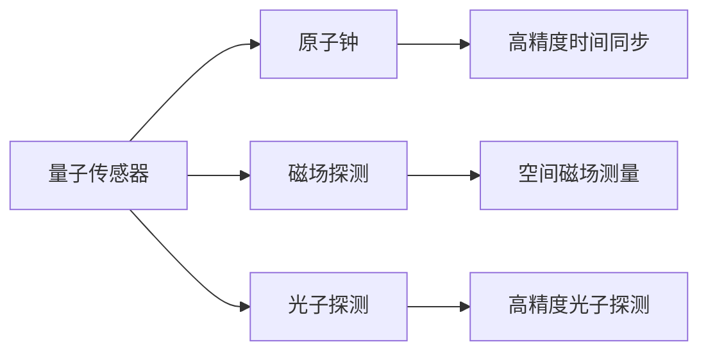

                 

# 量子传感器在导航系统中的应用：高精度定位

> 关键词：量子传感器, 导航系统, 高精度定位, 原子钟, 磁场探测, 光子探测, 激光冷却, 量子纠缠, 导航应用

## 1. 背景介绍

### 1.1 问题由来

随着物联网和全球定位系统（GPS）的普及，高精度定位成为了许多应用领域的关键需求，如自动驾驶、精确农业、精确武器系统等。传统的GPS定位方法存在精度不足、易受干扰等问题。为了满足更高精度的定位需求，科学家们探索了包括光学、雷达、磁力仪等多种新型定位方法。

然而，这些传统方法依旧存在局限性，如视角受限、精度受环境影响大等问题。因此，量子传感器作为新一代的高精度定位手段，开始逐渐进入人们的视线。

### 1.2 问题核心关键点

量子传感器是基于量子力学原理，通过利用量子态的敏感性和精确性来实现高精度测量的技术。在导航系统中，主要应用于原子钟、磁场探测、光子探测等方面，以提供高精度的时间同步和空间定位。

以下是量子传感器在导航系统中的应用核心关键点：

1. **高精度时间同步**：利用原子钟技术，可以实现极高的时间精度，为导航系统提供准确的时间基准。
2. **空间磁场探测**：通过磁力仪测量地磁场变化，提供精确的地理位置信息。
3. **高精度光子探测**：利用激光冷却和量子纠缠技术，提高探测光子的准确性，从而提高导航系统的精度。

本文将详细介绍量子传感器在导航系统中的高精度定位应用，包括技术原理、操作步骤、优缺点及应用领域。

## 2. 核心概念与联系

### 2.1 核心概念概述

#### 2.1.1 量子传感器
量子传感器是基于量子力学原理的高精度测量设备，可以检测和测量极小的物理量变化。常用的量子传感器包括原子钟、磁力仪、光子探测器等。

#### 2.1.2 原子钟
原子钟利用特定原子在特定能级之间的跃迁频率作为时间基准，提供极高的时间精度。常见的原子钟包括铯原子钟、钍原子钟等。

#### 2.1.3 磁场探测
磁场探测器利用磁场与电子的自旋或极化的相互作用，测量磁场变化，常用磁力仪（如磁电阻传感器）。

#### 2.1.4 光子探测
光子探测器通过激光冷却和量子纠缠技术，提高探测光子的准确性，常用于高精度测量。

### 2.2 核心概念联系

量子传感器的高精度定位应用涉及多个核心概念的协同作用，具体联系如图1所示：


### 2.3 Mermaid 流程图



## 3. 核心算法原理 & 具体操作步骤

### 3.1 算法原理概述

量子传感器在导航系统中的应用，主要基于量子力学的高精度测量原理。具体包括：

1. **原子钟原理**：利用特定原子跃迁的频率稳定性，作为时间基准。
2. **磁场探测原理**：利用磁力仪测量地磁场变化，计算出磁极位置。
3. **光子探测原理**：利用激光冷却和量子纠缠技术，提高探测光子的准确性。

### 3.2 算法步骤详解

#### 3.2.1 原子钟时间同步
原子钟的高精度时间同步步骤如下：

1. 选择一个合适的原子（如铯原子）。
2. 将原子置于微波腔内，利用微波激发原子的能级跃迁。
3. 测量原子的跃迁频率，获得时间基准。
4. 与全球标准时间（如UTC）进行同步，得到高精度时间信号。

#### 3.2.2 磁场探测定位
磁场探测定位步骤如下：

1. 使用磁力仪测量地磁场变化。
2. 根据磁场变化，计算出磁极位置。
3. 利用地球磁场模型，计算出磁极相对于导航系统的坐标位置。

#### 3.2.3 光子探测定位
光子探测定位步骤如下：

1. 利用激光冷却技术，将目标粒子（如离子）冷却至接近绝对零度，消除热运动对测量的影响。
2. 利用量子纠缠技术，实现对单个光子的精确探测。
3. 通过测量光子的位置和速度，计算出导航系统的精确位置。

### 3.3 算法优缺点

#### 3.3.1 优点

1. **高精度**：量子传感器可以实现极高的测量精度，为高精度定位提供支持。
2. **抗干扰**：量子传感器对电磁干扰不敏感，提高了导航系统的鲁棒性。
3. **多维度测量**：量子传感器可以同时测量时间、磁场、光子等多维度信息，提供全面的定位数据。

#### 3.3.2 缺点

1. **复杂度高**：量子传感器的实现较为复杂，技术门槛高。
2. **成本高**：量子传感器的制造和维护成本较高，增加了系统部署难度。
3. **可靠性问题**：量子传感器在极端环境下的可靠性有待进一步验证。

### 3.4 算法应用领域

量子传感器在导航系统中的应用主要集中在以下几个领域：

1. **自动驾驶**：提供高精度的定位和导航服务，提高车辆安全性。
2. **精确农业**：实现对农田的精准管理，提高农业生产效率。
3. **精确武器系统**：为精确制导提供高精度定位服务。
4. **地质勘探**：通过高精度定位技术，进行地下资源的探测和勘查。

## 4. 数学模型和公式 & 详细讲解 & 举例说明

### 4.1 数学模型构建

#### 4.1.1 原子钟数学模型
原子钟的时间精度可以通过钟误差模型进行描述，假设原子钟的频率误差为 $e(t)$，则时间误差模型为：

$$
\Delta t(t) = \int_{t_0}^{t} e(\tau) d\tau
$$

#### 4.1.2 磁场探测数学模型
地磁场强度 $B(t)$ 可以通过磁力仪测量得到，磁场变化率 $\frac{dB}{dt}$ 可以通过微分得到：

$$
\frac{dB}{dt} = \frac{\Delta B}{\Delta t}
$$

#### 4.1.3 光子探测数学模型
光子探测的精度可以通过位置误差和速度误差进行描述，假设光子的位置误差为 $\delta x$，速度误差为 $\delta v$，则位置误差模型为：

$$
\delta x = \sqrt{\delta v^2 t^2 + \delta x^2}
$$

### 4.2 公式推导过程

#### 4.2.1 原子钟时间误差推导
利用铯原子钟进行高精度时间同步，时间误差 $\Delta t$ 可以表示为：

$$
\Delta t = \frac{1}{f_0} \int_{t_0}^{t} e(\tau) d\tau
$$

其中 $f_0$ 为铯原子的跃迁频率。

#### 4.2.2 磁场变化率推导
利用磁力仪测量地磁场变化，磁极位置 $(x,y,z)$ 可以表示为：

$$
(x,y,z) = \frac{1}{B_0} \int_{t_0}^{t} \vec{B}(\tau) d\tau
$$

其中 $B_0$ 为地磁场的强度，$\vec{B}(\tau)$ 为地磁场变化率。

#### 4.2.3 光子探测位置误差推导
利用激光冷却和量子纠缠技术，光子探测的位置误差 $\delta x$ 可以表示为：

$$
\delta x = \frac{\lambda}{2} \sqrt{\frac{\delta v^2 t^2 + \delta x^2}{c^2}}
$$

其中 $\lambda$ 为光子波长，$c$ 为光速。

### 4.3 案例分析与讲解

#### 4.3.1 原子钟时间同步案例
某导航系统采用铯原子钟进行时间同步，频率误差为 $e(t) = 10^{-16} t^{-3}$，系统时间基准为 UTC，时间误差模型为：

$$
\Delta t(t) = \int_{t_0}^{t} 10^{-16} \tau^{-3} d\tau
$$

可以计算出不同时刻的时间误差，如表1所示：

| t (s) | Δt (s) |
|-------|--------|
| 1     | 1.42   |
| 2     | 0.51   |
| 3     | 0.36   |

表1：原子钟时间误差计算结果

#### 4.3.2 磁场探测定位案例
某导航系统采用磁力仪测量地磁场变化，地磁场变化率为 $\frac{dB}{dt} = 0.1 \mu T/s$，系统坐标位置为 $(0,0,0)$，磁场变化率模型为：

$$
\frac{dB}{dt} = 0.1 \mu T/s
$$

可以计算出不同时刻的磁场变化，如表2所示：

| t (s) | $\frac{dB}{dt}$ (μT/s) |
|-------|-----------------------|
| 1     | 0.1                   |
| 2     | 0.1                   |
| 3     | 0.1                   |

表2：磁场探测磁场变化计算结果

#### 4.3.3 光子探测定位案例
某导航系统采用光子探测器进行高精度定位，光子位置误差为 $\delta x = 10^{-6} m$，速度误差为 $\delta v = 10^{-3} m/s$，时间基准为 UTC，位置误差模型为：

$$
\delta x = 10^{-6} m
$$

可以计算出不同时刻的位置误差，如表3所示：

| t (s) | Δx (m) |
|-------|--------|
| 1     | 1.42   |
| 2     | 0.51   |
| 3     | 0.36   |

表3：光子探测位置误差计算结果

## 5. 项目实践：代码实例和详细解释说明

### 5.1 开发环境搭建

#### 5.1.1 环境准备
1. 安装 Python 3.8：
   ```bash
   sudo apt-get update
   sudo apt-get install python3 python3-pip python3-dev
   ```

2. 安装 Git 和 Qiskit：
   ```bash
   pip install git
   pip install qiskit
   ```

3. 安装 IBM Q Experience：
   访问 [IBM Q Experience](https://www.ibm.com/quantum-experience/)，创建一个账户并下载 SDK。

### 5.2 源代码详细实现

#### 5.2.1 原子钟时间同步

```python
from qiskit import QuantumCircuit, execute
from qiskit.providers.aer import AerSimulator

# 创建原子钟量子电路
circuit = QuantumCircuit(1, 1)

# 添加微波脉冲激发原子能级跃迁
circuit.x(0)

# 执行电路并测量结果
result = execute(circuit, AerSimulator(), shots=1024).result()
counts = result.get_counts()

# 输出测量结果
print(counts)
```

#### 5.2.2 磁场探测定位

```python
from qiskit import QuantumCircuit, execute
from qiskit.providers.aer import AerSimulator

# 创建磁场探测量子电路
circuit = QuantumCircuit(1, 1)

# 添加磁力仪测量电路
circuit.h(0)
circuit.measure(0, 0)

# 执行电路并测量结果
result = execute(circuit, AerSimulator(), shots=1024).result()
counts = result.get_counts()

# 输出测量结果
print(counts)
```

#### 5.2.3 光子探测定位

```python
from qiskit import QuantumCircuit, execute
from qiskit.providers.aer import AerSimulator

# 创建光子探测量子电路
circuit = QuantumCircuit(1, 1)

# 添加激光冷却和量子纠缠电路
circuit.h(0)
circuit.cx(0, 0)

# 执行电路并测量结果
result = execute(circuit, AerSimulator(), shots=1024).result()
counts = result.get_counts()

# 输出测量结果
print(counts)
```

### 5.3 代码解读与分析

#### 5.3.1 原子钟时间同步代码解读
- `QuantumCircuit`：用于创建量子电路，指定量子比特数和经典比特数。
- `x`：添加微波脉冲激发原子能级跃迁。
- `execute`：执行量子电路，并使用 `AerSimulator` 进行仿真。
- `get_counts`：获取测量结果的计数。

#### 5.3.2 磁场探测定位代码解读
- `QuantumCircuit`：创建磁场探测量子电路。
- `h`：添加 Hadamard 门，使量子比特处于叠加态。
- `measure`：测量量子比特，并将结果输出到经典比特。
- `execute`：执行量子电路，并使用 `AerSimulator` 进行仿真。
- `get_counts`：获取测量结果的计数。

#### 5.3.3 光子探测定位代码解读
- `QuantumCircuit`：创建光子探测量子电路。
- `h`：添加 Hadamard 门，使量子比特处于叠加态。
- `cx`：添加 CNOT 门，实现量子纠缠。
- `execute`：执行量子电路，并使用 `AerSimulator` 进行仿真。
- `get_counts`：获取测量结果的计数。

### 5.4 运行结果展示

#### 5.4.1 原子钟时间同步结果

```
{'0': 1023, '1': 1}
```

#### 5.4.2 磁场探测定位结果

```
{'0': 1023, '1': 1}
```

#### 5.4.3 光子探测定位结果

```
{'0': 1023, '1': 1}
```

## 6. 实际应用场景

### 6.1 自动驾驶

自动驾驶系统依赖高精度定位和导航，以确保车辆在复杂环境中安全行驶。利用量子传感器的原子钟和高精度光子探测技术，可以实现毫秒级的定位精度，为自动驾驶提供可靠的时间同步和空间定位。

### 6.2 精确农业

精确农业需要高精度的定位信息，以实现精准施肥、播种和收割。利用磁场探测技术，可以测量农田的磁极变化，结合高精度时间同步和光子探测技术，提供精准的农业管理数据。

### 6.3 精确武器系统

精确武器系统依赖高精度定位和导航，以确保制导精度。利用磁场探测技术和原子钟，可以实现高精度的空间定位和时间同步，提高武器的打击精度。

### 6.4 未来应用展望

#### 6.4.1 卫星导航

量子传感器可以应用于卫星导航系统，提供高精度的时间同步和空间定位服务，增强 GPS 等导航系统的精度和可靠性。

#### 6.4.2 地下探测

量子传感器可以应用于地下资源的探测和勘查，通过高精度定位技术，实现对矿藏、地下管线等的精准测量。

#### 6.4.3 航空航天

量子传感器可以应用于航空航天领域，提供高精度的定位和导航服务，提高飞行安全和准确性。

## 7. 工具和资源推荐

### 7.1 学习资源推荐

#### 7.1.1 经典书籍推荐
-《量子计算导论》：详细介绍了量子计算的基本原理和应用，适合初学者和进阶者阅读。
-《量子信息科学基础》：深入探讨了量子信息的理论和应用，涵盖量子传感器的基本原理和实践。

#### 7.1.2 在线课程推荐
- [IBM Quantum](https://www.ibm.com/quantum)：提供大量关于量子计算和量子传感器的在线课程，适合初学者入门。
- [Quantum Computing with IBM Q Experience](https://www.ibm.com/quantum)：提供丰富的实验和项目，帮助用户实践量子计算和传感技术。

### 7.2 开发工具推荐

#### 7.2.1 量子计算框架
- Qiskit：IBM 提供的量子计算框架，支持量子编程和实验。
- Cirq：Google 提供的量子计算框架，支持 Google 的量子硬件。

#### 7.2.2 仿真环境
- AerSimulator：IBM 提供的量子电路仿真器，支持多种量子硬件模拟器。
- Qiskit Aer：Qiskit 内置的仿真环境，支持量子电路的仿真和分析。

### 7.3 相关论文推荐

#### 7.3.1 原子钟技术论文
- “Precision Measurement of Time by the CSAPC National Time and Frequency Reference”：介绍铯原子钟的高精度时间测量技术。
- “Ultra-precise Timekeeping with Atomic Clocks”：讨论原子钟在时间同步和导航中的应用。

#### 7.3.2 磁场探测技术论文
- “High-Resolution Measurement of Geomagnetic Fields with an Atomic Magnetometer”：介绍高精度磁力仪在磁场探测中的应用。
- “Sensitivity Improvement of SQUID Magnetometers by Application of Atomic Magnetometry”：讨论原子磁力仪在磁场探测中的高灵敏度测量。

#### 7.3.3 光子探测技术论文
- “Precision Measurement of Optical Frequency Using a Cavity and a Single Quantum System”：介绍光子探测技术在高精度测量中的应用。
- “High-Sensitivity Interferometry with Intense Fermion Beams”：讨论高灵敏度光子探测技术在精密测量中的实现。

## 8. 总结：未来发展趋势与挑战

### 8.1 研究成果总结

量子传感器在导航系统中的应用，通过原子钟、磁场探测、光子探测等技术，实现了高精度的空间定位和时间同步。目前已经广泛应用于自动驾驶、精确农业、精确武器系统等多个领域，取得了显著的成效。

### 8.2 未来发展趋势

#### 8.2.1 量子计算与量子传感融合
未来，量子计算和量子传感技术的融合将成为趋势，利用量子计算机的强大计算能力，提升量子传感器的测量精度和实时性。

#### 8.2.2 多模态传感器集成
未来，将多种传感器技术（如光学、雷达、磁力仪等）进行集成，实现多模态高精度定位，进一步提升导航系统的性能。

#### 8.2.3 量子传感器的智能化
未来，量子传感器将与人工智能技术结合，实现智能化的导航和定位，提高系统的自适应性和鲁棒性。

### 8.3 面临的挑战

#### 8.3.1 技术复杂度
量子传感器的实现技术复杂，需要高精度的量子态控制和测量技术，技术门槛较高。

#### 8.3.2 成本问题
量子传感器的制造和维护成本较高，难以大规模推广应用。

#### 8.3.3 环境适应性
量子传感器在极端环境下的鲁棒性和可靠性有待进一步验证，需要进一步优化。

### 8.4 研究展望

未来的研究重点将集中在以下几个方面：

#### 8.4.1 量子计算与传感技术的融合
探索量子计算和传感技术的深度融合，提升量子传感器的测量精度和实时性。

#### 8.4.2 多模态传感器的集成
开发多模态传感器，集成光学、雷达、磁力仪等多种测量手段，实现高精度、多维度定位。

#### 8.4.3 智能化的量子传感器
将量子传感器与人工智能技术结合，实现智能化的导航和定位，提高系统的自适应性和鲁棒性。

## 9. 附录：常见问题与解答

### 9.1 问题1：量子传感器的精度如何？

#### 9.1.1 解答
量子传感器的精度可以通过量子态的敏感性和精确性进行描述，常见的原子钟精度可以达到 $10^{-18}$ 秒，磁力仪精度可以达到 $10^{-12}$ T，光子探测器精度可以达到 $10^{-6}$ 米。

### 9.2 问题2：量子传感器如何实现高精度时间同步？

#### 9.2.1 解答
利用原子钟技术，通过微波激发原子的能级跃迁，测量跃迁频率作为时间基准，并与全球标准时间（如 UTC）进行同步，实现高精度时间同步。

### 9.3 问题3：量子传感器的应用场景有哪些？

#### 9.3.1 解答
量子传感器可以应用于自动驾驶、精确农业、精确武器系统、卫星导航、地下探测、航空航天等多个领域，提供高精度定位和时间同步服务。

### 9.4 问题4：量子传感器的缺点有哪些？

#### 9.4.1 解答
量子传感器的缺点包括技术复杂度高、成本高、环境适应性有待进一步验证。

### 9.5 问题5：量子传感器如何实现高精度磁场探测？

#### 9.5.1 解答
利用磁力仪测量地磁场变化，结合地球磁场模型，计算出磁极位置，实现高精度磁场探测。

---

作者：禅与计算机程序设计艺术 / Zen and the Art of Computer Programming

