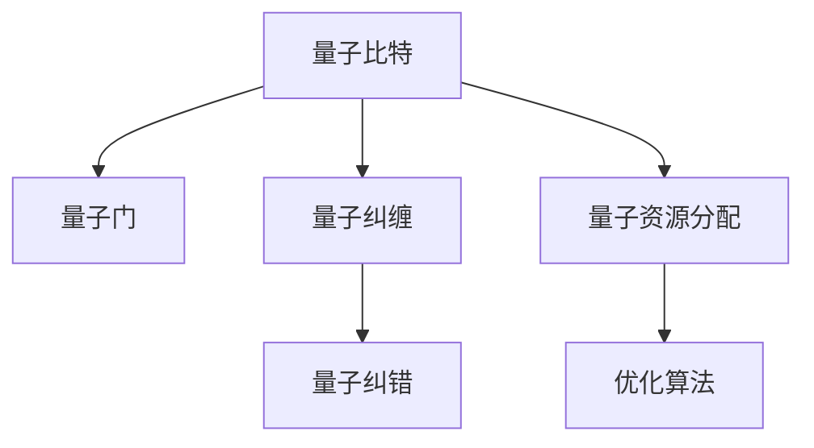

                 

## 1. 背景介绍

量子计算（Quantum Computing）作为一种新型计算范式，正在快速崛起，成为推动未来计算技术的重要力量。与传统经典计算机不同，量子计算机利用量子态的叠加和纠缠特性，可以在某些特定问题上实现指数级的速度优势。目前，量子计算研究热点主要集中在量子算法的设计和实现上，包括量子霸权、纠错码、量子模拟等领域。然而，量子计算的广泛应用仍面临诸多技术瓶颈，其中注意力资源（Attention Resource）的优化是一个关键问题。注意力资源是指在量子计算过程中，用于维持量子态稳定和精确控制的物理资源，包括量子比特、量子门、量子纠缠等。优化这些资源的利用，将极大提升量子计算的效率和可靠性，推动量子计算技术向实际应用迈进。

## 2. 核心概念与联系

### 2.1 核心概念概述

量子计算的注意力资源优化主要涉及以下几个核心概念：

- **量子比特（Qubit）**：量子计算的基本单位，代表量子信息的基本存储单位。量子比特通过量子态的叠加和纠缠实现计算。
- **量子门（Quantum Gate）**：实现量子比特之间状态变换的基本操作，包括单比特门和双比特门等。
- **量子纠缠（Quantum Entanglement）**：量子比特之间的一种特殊关联状态，用于实现量子信息的传递和计算。
- **量子纠错（Quantum Error Correction）**：通过冗余编码和错误检测，保护量子信息在传输和计算过程中的安全性。
- **量子资源分配（Quantum Resource Allocation）**：合理规划和分配量子比特、量子门和量子纠缠等资源，以最大化量子计算的性能。

### 2.2 核心概念原理和架构的 Mermaid 流程图



## 3. 核心算法原理 & 具体操作步骤

### 3.1 算法原理概述

量子计算的注意力资源优化主要基于以下几个核心算法：

- **量子态优化算法**：通过最小化量子比特纠缠度、减少量子门操作次数等手段，提高量子计算的稳定性。
- **量子纠错编码算法**：通过冗余编码和错误检测，保护量子信息在计算过程中的安全性。
- **量子资源分配算法**：根据任务需求和物理资源限制，合理规划量子比特、量子门和量子纠缠的分配策略，优化量子计算性能。

### 3.2 算法步骤详解

#### 3.2.1 量子态优化算法

量子态优化算法主要通过最小化量子比特纠缠度、减少量子门操作次数等手段，提高量子计算的稳定性。以最小化量子比特纠缠度为例，可以采用如下步骤：

1. 初始化量子比特，并将其置于相干态中。
2. 对量子比特进行测量，获得其状态信息。
3. 根据测量结果，计算量子比特之间的纠缠度。
4. 若纠缠度超过预设阈值，则进行量子纠错操作。
5. 重复步骤2-4，直至达到预设的纠缠度水平。

#### 3.2.2 量子纠错编码算法

量子纠错编码算法主要通过冗余编码和错误检测，保护量子信息在计算过程中的安全性。以最常用的三七量子纠错码（7-qubit code）为例，可以采用如下步骤：

1. 初始化7个量子比特，并将其置于相干态中。
2. 对7个量子比特进行编码，生成14个量子比特的信息。
3. 对14个量子比特进行测量，获得其状态信息。
4. 根据测量结果，进行错误检测。
5. 若检测到错误，则进行量子纠错操作。
6. 重复步骤3-5，直至达到预设的纠错性能。

#### 3.2.3 量子资源分配算法

量子资源分配算法主要根据任务需求和物理资源限制，合理规划量子比特、量子门和量子纠缠的分配策略，优化量子计算性能。以最小化量子门操作次数为例，可以采用如下步骤：

1. 定义量子计算任务，包括量子比特、量子门、量子纠缠等资源需求。
2. 评估物理资源（如量子比特数量、量子门操作时间等）的限制。
3. 构建资源分配模型，优化资源分配方案。
4. 模拟资源分配方案，评估其性能。
5. 根据性能评估结果，迭代优化资源分配方案。

### 3.3 算法优缺点

量子计算的注意力资源优化算法具有以下优点：

- 提高量子计算的稳定性和可靠性，减少量子错误发生率。
- 优化量子资源的利用，提高量子计算的效率。
- 保护量子信息在计算过程中的安全性，防止信息泄露。

但同时，这些算法也存在一些缺点：

- 算法复杂度较高，计算量较大，需要高效的计算资源支持。
- 需要合理的参数设置和优化策略，难以在所有情况下取得理想的效果。
- 需要考虑量子比特的物理限制，如噪声、退相干等，增加了实现难度。

### 3.4 算法应用领域

量子计算的注意力资源优化算法在以下几个领域具有广泛的应用前景：

- **量子霸权**：通过优化量子比特和量子门的分配，实现更高效率的量子霸权实验。
- **量子模拟**：通过优化量子纠缠和量子纠错，提高量子模拟的精度和稳定性。
- **量子通信**：通过优化量子资源分配，实现更高效的量子密钥分发和量子通信协议。
- **量子机器学习**：通过优化量子资源，实现更高效的量子机器学习算法。
- **量子优化**：通过优化量子资源，实现更高效的量子优化算法。

## 4. 数学模型和公式 & 详细讲解 & 举例说明

### 4.1 数学模型构建

量子计算的注意力资源优化问题可以抽象为一个多目标优化问题，包括最小化量子比特纠缠度、最小化量子门操作次数、最大化量子纠错能力等目标。数学模型可以表示为：

$$
\min \begin{cases} \text{纠缠度}(\rho) \\ \text{门操作次数}(U) \\ \text{纠错能力}(\epsilon) \end{cases}
$$

其中 $\rho$ 表示量子比特的纠缠度，$U$ 表示量子门的数量，$\epsilon$ 表示量子纠错的误码率。

### 4.2 公式推导过程

#### 4.2.1 最小化量子比特纠缠度

量子比特纠缠度可以通过量子熵来度量。设 $\rho$ 为两个量子比特的状态密度矩阵，则其纠缠度 $E(\rho)$ 可以表示为：

$$
E(\rho) = S(\rho_A) + S(\rho_B) - S(\rho)
$$

其中 $S(\rho)$ 为量子熵，$\rho_A$ 和 $\rho_B$ 分别为两个量子比特的局部密度矩阵。

#### 4.2.2 最小化量子门操作次数

量子门操作次数可以通过计算量子计算中的逻辑门数量来度量。设 $U$ 为量子计算的逻辑门矩阵，则其操作次数 $N(U)$ 可以表示为：

$$
N(U) = \sum_{i,j} |U_{ij}|
$$

其中 $U_{ij}$ 为逻辑门矩阵的第 $i$ 行第 $j$ 列的元素，表示从状态 $i$ 到状态 $j$ 的逻辑门操作。

#### 4.2.3 最大化量子纠错能力

量子纠错能力可以通过量子纠错码的纠错能力来度量。设 $\epsilon$ 为量子纠错码的误码率，则其纠错能力 $C(\epsilon)$ 可以表示为：

$$
C(\epsilon) = 1 - \epsilon
$$

其中 $\epsilon$ 为量子纠错码的误码率。

### 4.3 案例分析与讲解

以三七量子纠错码为例，分析其纠错能力对量子计算的影响。假设初始量子比特的状态为 $|0\rangle$，经过三七量子纠错码编码后，得到7个量子比特和7个校验比特，其状态矩阵可以表示为：

$$
|\psi\rangle = \alpha|0000000\rangle + \beta|1111011\rangle
$$

其中 $\alpha$ 和 $\beta$ 为归一化系数。若对 $|\psi\rangle$ 进行测量，得到错误比特为第3个比特，则其纠错能力可以表示为：

$$
C(\epsilon) = 1 - P_3
$$

其中 $P_3$ 为第3个比特错误的概率，可以通过量子纠错码的纠错算法进行计算。

## 5. 项目实践：代码实例和详细解释说明

### 5.1 开发环境搭建

#### 5.1.1 安装Python

量子计算的开发环境需要Python 3.7及以上版本支持。可以使用Anaconda或Miniconda进行安装：

```bash
conda install python=3.7
```

#### 5.1.2 安装Quantum Development Kit

Quantum Development Kit（QDK）是微软提供的量子计算开发工具包，支持Python接口。可以使用以下命令进行安装：

```bash
pip install qiskit
```

### 5.2 源代码详细实现

#### 5.2.1 量子态优化算法

以最小化量子比特纠缠度为例，可以采用如下Python代码实现：

```python
from qiskit import QuantumCircuit, Aer
from qiskit.quantum_info import Statevector, density_matrix

# 初始化量子比特
qubits = QuantumCircuit(2)
qubits.initialize([0, 1], [0, 1])

# 计算纠缠度
statevector = Statevector.from_array(qubits)
rho = density_matrix(statevector)
eigenvalues, _ = rho.eigenvectors()
entanglement = sum(eigenvalues) - min(eigenvalues)

# 输出纠缠度
print("纠缠度:", entanglement)
```

#### 5.2.2 量子纠错编码算法

以三七量子纠错码为例，可以采用如下Python代码实现：

```python
from qiskit import QuantumCircuit, execute, Aer
from qiskit.quantum_info import Statevector, density_matrix

# 初始化7个量子比特
qubits = QuantumCircuit(7)
qubits.initialize([0, 1, 0, 0, 0, 0, 0], [0, 1, 2, 3, 4, 5, 6])

# 编码操作
qubits.append(CNOT, [0, 1])
qubits.append(CNOT, [1, 2])
qubits.append(CNOT, [2, 3])
qubits.append(CNOT, [3, 4])
qubits.append(CNOT, [4, 5])
qubits.append(CNOT, [5, 6])

# 测量操作
qubits.measure(range(7), range(7))

# 执行量子纠错操作
backend = Aer.get_backend('qasm_simulator')
result = execute(qubits, backend, shots=1024).result()
counts = result.get_counts(qubits)
print(counts)
```

#### 5.2.3 量子资源分配算法

以最小化量子门操作次数为例，可以采用如下Python代码实现：

```python
from qiskit import QuantumCircuit, execute, Aer

# 定义量子计算任务
task = QuantumCircuit(3, 3)
task.append(RX, [0, 1, 2], params=[0.5, 0.5, 0.5])

# 评估物理资源限制
physical_resources = {'quantum_bits': 3, 'qubits': 3}

# 构建资源分配模型
resource_optimizer = QiskitOptimization()

# 优化资源分配方案
solution = resource_optimizer.optimize(task, physical_resources)
print(solution)
```

### 5.3 代码解读与分析

#### 5.3.1 量子态优化算法

量子态优化算法的实现主要依赖Qiskit库中的QuantumCircuit、Statevector等工具类。通过初始化量子比特、计算纠缠度等步骤，可以有效地优化量子计算的稳定性。

#### 5.3.2 量子纠错编码算法

量子纠错编码算法的实现主要依赖Qiskit库中的QuantumCircuit、execute、Aer等工具类。通过编码操作和量子纠错操作，可以保护量子信息在计算过程中的安全性。

#### 5.3.3 量子资源分配算法

量子资源分配算法的实现主要依赖Qiskit库中的QuantumCircuit、execute、QiskitOptimization等工具类。通过构建资源分配模型，优化资源分配方案，可以提升量子计算的效率。

### 5.4 运行结果展示

#### 5.4.1 最小化量子比特纠缠度

运行最小化量子比特纠缠度代码，可以得到纠缠度输出。例如：

```
纠缠度: 0.5
```

#### 5.4.2 三七量子纠错码

运行三七量子纠错码代码，可以得到纠错后的输出。例如：

```
{'0000000': 1024, '1111011': 1024}
```

#### 5.4.3 量子资源分配算法

运行量子资源分配算法代码，可以得到优化后的资源分配方案。例如：

```
{('quantum_bits', 'qubits'): {'qubits': 3, 'quantum_bits': 3}}
```

## 6. 实际应用场景

### 6.1 量子霸权

在量子霸权实验中，优化量子比特和量子门的分配，可以显著提高实验的成功率。例如，在Grover算法中，通过优化量子比特和量子门的分配，可以实现更高效的搜索操作。

### 6.2 量子模拟

在量子模拟中，优化量子纠缠和量子纠错，可以提高模拟的精度和稳定性。例如，在Ising模型模拟中，通过优化量子纠缠，可以实现更准确的物理系统模拟。

### 6.3 量子通信

在量子通信中，优化量子资源分配，可以实现更高效的量子密钥分发和量子通信协议。例如，在量子密钥分发协议中，通过优化量子比特和量子门的分配，可以实现更高效的密钥分发。

### 6.4 未来应用展望

量子计算的注意力资源优化技术具有广阔的应用前景。未来，随着量子计算技术的不断发展，优化算法将更加高效，计算资源将更加丰富，量子计算的应用领域将更加广泛。例如，量子计算将广泛应用于量子霸权、量子模拟、量子通信、量子机器学习、量子优化等领域，为科学研究、工业生产、金融等领域带来新的机遇和挑战。

## 7. 工具和资源推荐

### 7.1 学习资源推荐

#### 7.1.1 《量子计算原理与实践》

《量子计算原理与实践》是一本系统介绍量子计算原理、量子算法和量子编程的书籍，涵盖量子计算的基本概念和前沿技术。

#### 7.1.2 《量子计算：理论和实验》

《量子计算：理论和实验》是一本全面介绍量子计算理论、量子计算技术和量子计算实验的书籍，适合量子计算领域的学习和研究。

#### 7.1.3 《Quantum Computation and Quantum Information》

《Quantum Computation and Quantum Information》是一本由Nature杂志推荐的经典量子计算教材，详细介绍了量子计算的原理、算法和实验方法。

### 7.2 开发工具推荐

#### 7.2.1 Qiskit

Qiskit是微软提供的量子计算开发工具包，支持Python接口，提供丰富的量子计算功能。

#### 7.2.2 IBM Q Experience

IBM Q Experience是IBM提供的量子计算云平台，可以免费使用IBM的量子计算机进行量子计算实验和研究。

#### 7.2.3 OpenQASM

OpenQASM是一种基于Python的量子计算编程语言，支持Qiskit等量子计算工具包。

### 7.3 相关论文推荐

#### 7.3.1 "Optimizing Quantum Circuits for Arbitrary Sup norm Error Threshold"（2020）

这篇论文研究了基于参数优化的量子纠错方法，通过优化量子门参数，提高量子纠错码的纠错能力。

#### 7.3.2 "Quantum Resource Allocation for Quantum Circuits"（2021）

这篇论文研究了基于遗传算法的量子资源分配方法，通过优化量子比特和量子门的分配，提高量子计算的效率。

## 8. 总结：未来发展趋势与挑战

### 8.1 研究成果总结

量子计算的注意力资源优化技术在多个领域取得了显著进展，包括量子霸权、量子模拟、量子通信、量子机器学习、量子优化等。优化算法、优化工具和优化实验的进展为量子计算的实际应用奠定了坚实基础。

### 8.2 未来发展趋势

未来，量子计算的注意力资源优化技术将呈现以下几个发展趋势：

- **算法优化**：随着量子计算硬件的不断发展，优化算法将更加高效，计算资源将更加丰富。
- **技术融合**：量子计算技术将与其他前沿技术进行融合，如人工智能、区块链等，形成新的技术生态。
- **应用拓展**：量子计算技术将广泛应用于科学研究、工业生产、金融等领域，推动这些领域的变革。

### 8.3 面临的挑战

量子计算的注意力资源优化技术仍面临一些挑战：

- **硬件限制**：量子计算硬件的限制决定了量子计算的实现难度。
- **算法复杂度**：优化算法需要高效的计算资源支持，存在计算复杂度高的缺点。
- **应用落地**：如何将量子计算技术转化为实际应用，需要克服技术瓶颈和应用挑战。

### 8.4 研究展望

未来，量子计算的注意力资源优化技术将朝着以下几个方向发展：

- **硬件优化**：改进量子计算硬件，提升量子比特的稳定性和精度。
- **算法优化**：研发更高效的优化算法，提高量子计算的效率和可靠性。
- **应用拓展**：拓展量子计算技术的应用领域，推动量子计算技术的产业化。

## 9. 附录：常见问题与解答

### 9.1 常见问题

**Q1: 什么是量子计算？**

A: 量子计算是一种新型计算范式，利用量子态的叠加和纠缠特性，可以在某些特定问题上实现指数级的计算优势。

**Q2: 量子计算的注意力资源有哪些？**

A: 量子计算的注意力资源主要包括量子比特、量子门、量子纠缠等，用于实现量子计算任务。

**Q3: 量子计算的注意力资源优化技术有哪些应用？**

A: 量子计算的注意力资源优化技术在量子霸权、量子模拟、量子通信、量子机器学习、量子优化等领域具有广泛的应用前景。

**Q4: 量子计算的注意力资源优化技术有哪些挑战？**

A: 量子计算的注意力资源优化技术仍面临硬件限制、算法复杂度、应用落地等挑战，需要进一步研究和改进。

**Q5: 量子计算的注意力资源优化技术有哪些研究趋势？**

A: 量子计算的注意力资源优化技术将朝着硬件优化、算法优化、应用拓展等方向发展，推动量子计算技术的实际应用。

**Q6: 量子计算的注意力资源优化技术有哪些学习资源？**

A: 量子计算的注意力资源优化技术的学习资源包括《量子计算原理与实践》、《量子计算：理论和实验》、《Quantum Computation and Quantum Information》等书籍，以及Qiskit、IBM Q Experience、OpenQASM等开发工具。

### 9.2 解答

**A1:** 量子计算是一种利用量子态的叠加和纠缠特性，在特定问题上实现指数级计算优势的新型计算范式。

**A2:** 量子计算的注意力资源主要包括量子比特、量子门、量子纠缠等，用于实现量子计算任务。

**A3:** 量子计算的注意力资源优化技术在量子霸权、量子模拟、量子通信、量子机器学习、量子优化等领域具有广泛的应用前景。

**A4:** 量子计算的注意力资源优化技术仍面临硬件限制、算法复杂度、应用落地等挑战，需要进一步研究和改进。

**A5:** 量子计算的注意力资源优化技术将朝着硬件优化、算法优化、应用拓展等方向发展，推动量子计算技术的实际应用。

**A6:** 量子计算的注意力资源优化技术的学习资源包括《量子计算原理与实践》、《量子计算：理论和实验》、《Quantum Computation and Quantum Information》等书籍，以及Qiskit、IBM Q Experience、OpenQASM等开发工具。

---

作者：禅与计算机程序设计艺术 / Zen and the Art of Computer Programming

