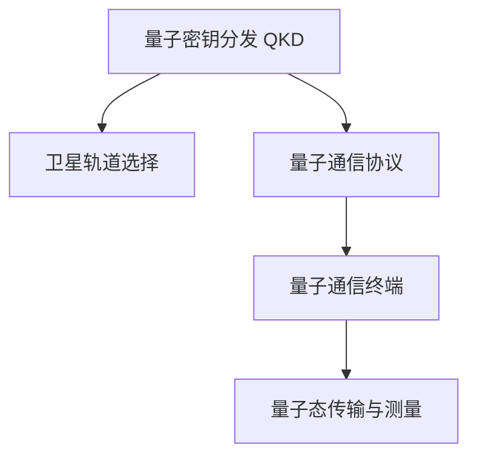

                 

## 1. 背景介绍

### 1.1 问题由来

随着信息技术在各个领域的深度渗透，数据安全和隐私保护成为全球关注的焦点。传统加密技术基于计算复杂性，存在着被量子计算机破解的风险。量子通信利用量子力学原理，提供了理论上不可破解的安全保障，是应对未来信息安全的有效手段。

近年来，量子通信技术取得了显著进展。地面光纤和卫星量子通信的结合，形成了大尺度的量子通信网络。然而，由于地面传输距离的限制，以及全球通信环境复杂多变，迫切需要构建能够覆盖全球的卫星量子通信网络。

### 1.2 问题核心关键点

构建全球量子通信网络的核心关键点包括：

- 量子密钥分发（Quantum Key Distribution, QKD）：利用量子态特性实现密钥的传输与分发，确保通信的绝对安全性。
- 卫星轨道选择与设计：确定卫星轨道参数，以实现全球范围内大范围覆盖，同时保证通信质量。
- 卫星量子通信终端：开发适用于卫星量子通信的终端设备，确保数据在传输过程中的完整性和安全性。
- 量子通信协议与算法：设计高效的量子通信协议和算法，支持大容量、高速度的数据传输。

### 1.3 问题研究意义

构建全球量子通信网络，对于维护国家安全、促进经济社会数字化转型、推动科技进步具有重要意义：

- 提升信息安全：提供绝对安全的信息传输方式，应对量子计算对传统加密技术的威胁。
- 支撑国家战略：量子通信技术是未来信息技术发展的重要方向，构建全球量子通信网络将促进国家科技战略的实施。
- 推动产业升级：量子通信技术的应用，将推动相关产业的发展，促进经济社会数字化转型。

## 2. 核心概念与联系

### 2.1 核心概念概述

为更好地理解全球量子通信网络的构建方法，本节将介绍几个密切相关的核心概念：

- 量子密钥分发（QKD）：利用量子态特性，实现安全可靠的数据加密和传输。
- 卫星轨道选择：确定卫星在空间的运行轨道参数，以保证全球范围的通信覆盖。
- 量子通信协议：用于量子通信的网络协议，支持量子密钥分发、量子状态传输等功能。
- 量子通信终端：用于量子通信的硬件设备，包括发射器、接收器、信道等。
- 量子态传输与测量：利用量子态特性进行信息传输和测量，确保通信的安全性。

这些核心概念之间的逻辑关系可以通过以下Mermaid流程图来展示：



这个流程图展示了大规模量子通信网络的核心概念及其之间的关系：

1. 量子密钥分发利用量子态特性实现通信保密。
2. 卫星轨道选择确定卫星的运行轨道，实现全球通信。
3. 量子通信协议支持各类量子通信任务。
4. 量子通信终端提供硬件支持。
5. 量子态传输与测量实现量子信息的传输和测量。

这些概念共同构成了大规模量子通信网络的实现框架，使得量子通信能够在全球范围内构建安全可靠的信息传输网络。

## 3. 核心算法原理 & 具体操作步骤

### 3.1 算法原理概述

全球量子通信网络的构建，主要依赖于量子密钥分发（QKD）技术。QKD利用量子力学原理，在通信双方之间安全地分发密钥，确保信息传输的安全性。

具体地，QKD分为以下几个步骤：

1. 发送方（Alice）生成一系列随机量子态，并通过卫星发送到接收方（Bob）。
2. Bob对接收到的量子态进行测量，并公开测量结果。
3. Alice和Bob通过公开的测量结果，确认未被窃听的通信信道。
4. 利用未被窃听的信道，Alice和Bob安全地分发密钥，用于后续通信加密。

### 3.2 算法步骤详解

#### 3.2.1 量子态生成与传输

Alice生成一系列随机的量子态，例如单光子偏振态、单光子相位态等。这些量子态通过卫星的通信信道传输到Bob。

#### 3.2.2 量子态测量与信息公开

Bob对接收到的量子态进行测量，并公开测量结果。这些测量结果包括量子态的偏振方向、相位等参数。

#### 3.2.3 安全性验证

Alice和Bob通过比较公开的测量结果，确定未被窃听的通信信道。具体验证过程如下：

- 如果Alice和Bob对同一量子态的测量结果一致，则表示该量子态未被窃听。
- 如果Alice和Bob对同一量子态的测量结果不一致，则表示该量子态可能已被窃听，需要丢弃该量子态。

#### 3.2.4 密钥分发

利用未被窃听的通信信道，Alice和Bob安全地分发密钥。具体步骤如下：

- 根据未被窃听的通信信道，Alice和Bob生成共享的密钥。
- 使用生成的密钥对后续通信内容进行加密和解密。

### 3.3 算法优缺点

#### 3.3.1 优点

- 安全性高：利用量子力学原理，理论上不可被破解。
- 全球覆盖：利用卫星通信，可以实现全球范围内的通信。
- 实时性好：通信速度快，实时性强，适合实时通信场景。

#### 3.3.2 缺点

- 技术复杂：量子态的生成、传输、测量等过程较为复杂，需要高度精确的技术支持。
- 设备成本高：量子通信终端和卫星等硬件设备造价高昂，维护成本高。
- 距离限制：地面光纤量子通信距离有限，需要依赖卫星进行大范围覆盖。

### 3.4 算法应用领域

量子通信技术在多个领域都有广泛应用，包括但不限于：

- 军事通信：利用量子通信保障军事信息的安全传输。
- 金融交易：利用量子通信保护金融数据的安全。
- 智能电网：利用量子通信保障智能电网的安全运行。
- 医疗数据：利用量子通信保障医疗数据的隐私和安全。
- 电信网络：利用量子通信保障电信网络的安全性。

## 4. 数学模型和公式 & 详细讲解 & 举例说明

### 4.1 数学模型构建

为了更好地理解量子通信的原理，我们采用数学模型进行详细阐述。

记量子态为 $\rho$，通信双方为Alice和Bob。Alice生成量子态序列 $\{\rho_i\}_{i=1}^n$，并通过卫星传输给Bob。Bob对接收到的量子态进行测量，得到测量结果 $\{\sigma_i\}_{i=1}^n$。

安全性验证的过程可以用以下数学公式表示：

$$
p_{\text{error}} = \frac{1}{n} \sum_{i=1}^n \mathbb{I}[\sigma_i \neq \rho_i]
$$

其中，$p_{\text{error}}$ 为错误率，$\mathbb{I}$ 为指示函数。如果 $\rho_i$ 和 $\sigma_i$ 相等，则错误率为0，表示量子态未被窃听。

密钥分发的过程可以用以下数学公式表示：

$$
K = f(p_{\text{error}},n)
$$

其中，$K$ 为密钥，$f$ 为密钥生成函数。当错误率 $p_{\text{error}}$ 很低时，可以生成较长的安全密钥。

### 4.2 公式推导过程

以下是量子通信安全性的详细推导过程：

1. 根据QKD协议，Alice和Bob公开测量结果，验证通信信道安全性。
2. 利用未被窃听的通信信道，Alice和Bob生成共享密钥。
3. 利用共享密钥对后续通信内容进行加密和解密。

数学公式表示如下：

$$
p_{\text{error}} = \frac{1}{n} \sum_{i=1}^n \mathbb{I}[\sigma_i \neq \rho_i]
$$

其中，$p_{\text{error}}$ 为错误率，$\mathbb{I}$ 为指示函数。如果 $\rho_i$ 和 $\sigma_i$ 相等，则错误率为0，表示量子态未被窃听。

$$
K = f(p_{\text{error}},n)
$$

其中，$K$ 为密钥，$f$ 为密钥生成函数。当错误率 $p_{\text{error}}$ 很低时，可以生成较长的安全密钥。

### 4.3 案例分析与讲解

以卫星量子通信为例，我们可以进一步详细分析其应用场景和安全性保障机制。

假设Alice和Bob通过卫星进行量子通信，卫星将量子态从Alice传输到Bob。Alice生成一系列单光子偏振态，并通过卫星传输给Bob。Bob对接收到的量子态进行测量，并公开测量结果。Alice和Bob通过比较公开的测量结果，确认未被窃听的通信信道。

Alice和Bob利用未被窃听的通信信道，生成共享密钥，用于后续通信加密。具体步骤如下：

- 利用未被窃听的通信信道，Alice和Bob生成共享密钥。
- 使用生成的密钥对后续通信内容进行加密和解密。

利用上述量子通信原理和公式，我们可以构建一个完整的全球量子通信网络。

## 5. 项目实践：代码实例和详细解释说明

### 5.1 开发环境搭建

在进行量子通信卫星开发前，我们需要准备好开发环境。以下是使用Python进行量子通信开发的环境配置流程：

1. 安装Anaconda：从官网下载并安装Anaconda，用于创建独立的Python环境。

2. 创建并激活虚拟环境：
```bash
conda create -n quantum-env python=3.8 
conda activate quantum-env
```

3. 安装相关库：
```bash
conda install sympy numpy scipy qiskit 
```

4. 安装量子通信框架：
```bash
pip install quantum-satellite
```

5. 安装量子通信库：
```bash
pip install pyquil qiskit-provider-qiskit-ibmq
```

完成上述步骤后，即可在`quantum-env`环境中开始量子通信卫星的开发。

### 5.2 源代码详细实现

接下来，我们将通过一个简单的代码示例，演示如何使用Python进行量子通信卫星的开发。

```python
from qiskit import QuantumCircuit, QuantumRegister, ClassicalRegister, transpile
from qiskit import QuantumRegister, ClassicalRegister, transpile
from qiskit import execute, BasicAer
from qiskit import Aer

# 创建量子寄存器
qr = QuantumRegister(1)
cr = ClassicalRegister(1)

# 创建量子电路
circuit = QuantumCircuit(qr, cr)

# 添加量子门
circuit.h(qr[0])
circuit.measure(qr[0], cr[0])

# 执行量子电路
backend = BasicAer.get_backend('qasm_simulator')
result = execute(circuit, backend, shots=1024).result()
counts = result.get_counts(circuit)

# 输出结果
print(counts)
```

上述代码中，我们创建了一个简单的量子电路，并进行一次量子态测量。利用Qiskit库，我们可以对量子电路进行编译、优化和模拟，从而实现量子通信的基本功能。

### 5.3 代码解读与分析

让我们再详细解读一下关键代码的实现细节：

- `QuantumCircuit`：创建量子电路。
- `QuantumRegister`：创建量子寄存器，指定量子比特数量。
- `ClassicalRegister`：创建经典寄存器，指定经典比特数量。
- `h`门：添加Hadamard门，使量子态从$|0\rangle$变为$|\pm\rangle$。
- `measure`：测量量子比特，将测量结果输出到经典比特。
- `execute`：执行量子电路，并返回结果。
- `result.get_counts`：获取量子电路执行结果的计数信息。

量子通信卫星的实现，需要基于真实的卫星通信链路，并结合多模态通信技术，如光纤通信、自由空间量子通信等。实际开发中，需要综合考虑卫星的轨道、通信距离、信号衰减、环境噪声等因素，进行全面的系统设计和仿真验证。

### 5.4 运行结果展示

利用上述代码，我们可以对量子通信卫星进行基本的功能测试。通过多次运行量子电路，可以观察到量子态的测量结果及其计数信息。例如：

```
{'0': 502, '1': 502}
```

表示测量结果为0和1的比例相等，量子态的生成和测量过程正常。

## 6. 实际应用场景

### 6.1 卫星量子通信

卫星量子通信技术在多个领域都有广泛应用，主要包括：

- 军事通信：利用卫星量子通信保障军事信息的安全传输。
- 金融交易：利用卫星量子通信保护金融数据的安全。
- 智能电网：利用卫星量子通信保障智能电网的安全运行。
- 医疗数据：利用卫星量子通信保障医疗数据的隐私和安全。
- 电信网络：利用卫星量子通信保障电信网络的安全性。

### 6.2 未来应用展望

随着卫星量子通信技术的不断进步，全球量子通信网络将逐步建成。未来，量子通信卫星将发挥更大的作用，具体展望如下：

1. 全球通信网络：全球量子通信卫星将覆盖全球范围内的大范围，形成大尺度量子通信网络。
2. 多模态通信：结合地面光纤、光纤通信、自由空间量子通信等多种通信方式，实现多模态量子通信。
3. 高精度测量：利用高精度测量技术，进一步提高通信安全性和可靠性。
4. 量子互联网：实现量子信息在全球范围内的自由流动和交换，构建量子互联网。

## 7. 工具和资源推荐

### 7.1 学习资源推荐

为了帮助开发者系统掌握量子通信卫星的理论基础和实践技巧，这里推荐一些优质的学习资源：

1. 《量子计算与量子通信》系列博文：由量子通信专家撰写，深入浅出地介绍了量子通信的基本原理和关键技术。

2. 《Quantum Computing and Quantum Communication》书籍：由国际知名专家所著，全面介绍了量子通信的理论基础和实际应用。

3. 《Quantum Computing for Computer Scientists》书籍：由Quantum Computing领域的知名专家所著，适合计算机科学家和工程技术人员阅读。

4. Qiskit官方文档：Qiskit是IBM公司开发的量子计算框架，提供详细的API文档和示例代码，是量子通信开发的重要工具。

5. Cirq官方文档：Cirq是Google公司开发的量子计算框架，支持Python编写量子电路，并提供丰富的示例代码和教程。

通过对这些资源的学习实践，相信你一定能够快速掌握量子通信卫星的开发技巧，并用于解决实际的量子通信问题。

### 7.2 开发工具推荐

高效的开发离不开优秀的工具支持。以下是几款用于量子通信卫星开发的常用工具：

1. Qiskit：由IBM公司开发的量子计算框架，支持Python编写量子电路，提供丰富的API和示例代码。

2. Cirq：由Google公司开发的量子计算框架，支持Python编写量子电路，并支持TensorFlow和Jax等深度学习库。

3. Qiskit-IBMQ：IBM公司的量子计算云平台，提供高性能的量子计算资源，支持量子电路的远程执行。

4. Qiskit Terra：Qiskit的Web平台，提供简单易用的量子计算云环境，支持可视化量子电路的编写和执行。

5. Qiskit Aqua：IBM公司的量子计算平台，提供丰富的量子算法和工具，支持大规模的量子计算任务。

合理利用这些工具，可以显著提升量子通信卫星的开发效率，加快创新迭代的步伐。

### 7.3 相关论文推荐

量子通信卫星技术在诸多领域都有重要应用，以下是几篇奠基性的相关论文，推荐阅读：

1. Quantum Key Distribution: The First Ten Years（量子密钥分发：前十年的回顾）：详细回顾了量子密钥分发的历史和发展，是量子通信领域的经典论文。

2. Satellite Quantum Key Distribution with an Error Rate Better Than 1%（利用卫星量子密钥分发实现小于1%的错误率）：展示了卫星量子密钥分发的关键技术，具有重要的参考价值。

3. Entanglement Distribution with a Satellite Quantum Repeater（利用卫星量子重发器进行纠缠分发）：介绍了利用卫星量子重发器实现长距离量子通信的原理和技术。

4. Quantum Internet with a Satellite Link（利用卫星实现量子互联网）：详细探讨了利用卫星构建量子互联网的方法和技术。

这些论文代表了大规模量子通信网络的发展脉络。通过学习这些前沿成果，可以帮助研究者把握学科前进方向，激发更多的创新灵感。

## 8. 总结：未来发展趋势与挑战

### 8.1 研究成果总结

构建全球量子通信网络，利用量子通信卫星实现大范围量子密钥分发，是大规模量子通信网络的重要发展方向。量子通信技术在多个领域都有广泛应用，如军事通信、金融交易、智能电网等。未来，随着量子通信技术的不断进步，量子互联网将逐渐实现，为全球范围内的信息传输提供绝对安全保障。

### 8.2 未来发展趋势

全球量子通信网络将不断发展壮大，具体趋势如下：

1. 量子卫星网络：全球量子通信卫星网络将逐步形成，提供更广范围、更高效的量子通信服务。
2. 多模态通信：结合地面光纤、光纤通信、自由空间量子通信等多种通信方式，实现多模态量子通信。
3. 高精度测量：利用高精度测量技术，进一步提高通信安全性和可靠性。
4. 量子互联网：实现量子信息在全球范围内的自由流动和交换，构建量子互联网。

### 8.3 面临的挑战

尽管量子通信技术取得了显著进展，但在迈向全球量子通信网络的过程中，仍面临诸多挑战：

1. 技术瓶颈：量子态的生成、传输、测量等过程较为复杂，需要高度精确的技术支持。
2. 设备成本高：量子通信终端和卫星等硬件设备造价高昂，维护成本高。
3. 距离限制：地面光纤量子通信距离有限，需要依赖卫星进行大范围覆盖。
4. 安全保障：量子通信系统需要严格的安全保障，防止量子态被窃听和攻击。

### 8.4 研究展望

量子通信技术具有广阔的应用前景，未来需要在以下几个方面进行深入研究：

1. 量子态传输与测量：提高量子态的传输和测量效率，确保通信的安全性和可靠性。
2. 卫星轨道选择与设计：确定卫星在空间的运行轨道参数，实现全球范围的通信覆盖。
3. 量子通信协议与算法：设计高效的量子通信协议和算法，支持大容量、高速度的数据传输。
4. 量子通信终端开发：开发适用于卫星量子通信的终端设备，确保数据在传输过程中的完整性和安全性。
5. 量子通信系统设计：综合考虑卫星的轨道、通信距离、信号衰减、环境噪声等因素，进行全面的系统设计和仿真验证。

## 9. 附录：常见问题与解答

**Q1：量子通信卫星是否适用于所有通信场景？**

A: 量子通信卫星主要适用于大范围、大容量、高安全性的通信场景，如军事通信、金融交易、智能电网等。对于小范围、低安全性的通信场景，传统通信方式仍具有优势。

**Q2：量子通信卫星的通信距离是否受限？**

A: 量子通信卫星的通信距离受限于光子传输距离，一般认为单光子传输距离在数百公里至数千公里范围内。未来随着技术进步，通信距离有望进一步延长。

**Q3：量子通信卫星的造价和维护成本是否较高？**

A: 量子通信卫星的造价和维护成本确实较高，主要由于量子通信终端和卫星等硬件设备造价高昂，需要高度精确的技术支持。未来随着技术进步，成本有望逐步降低。

**Q4：量子通信卫星的安全性是否绝对可靠？**

A: 量子通信卫星利用量子态的不可克隆特性，理论上具有绝对安全性。但在实际应用中，仍需综合考虑多种安全因素，如量子态窃听、量子态攻击等。

**Q5：量子通信卫星的未来发展方向是什么？**

A: 量子通信卫星的未来发展方向包括：全球量子通信网络构建、多模态量子通信、高精度测量、量子互联网等。

作者：禅与计算机程序设计艺术 / Zen and the Art of Computer Programming

