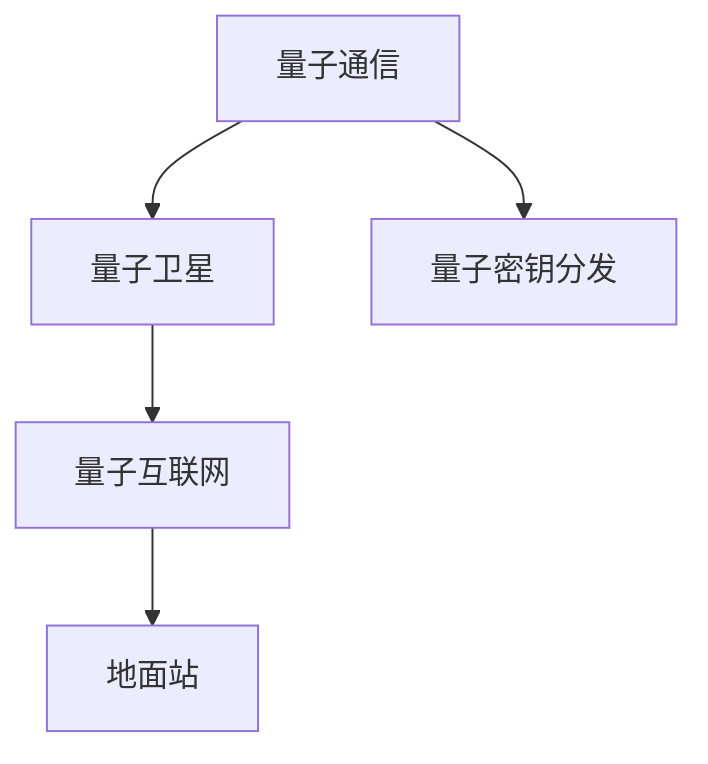

                 

# 量子通信卫星：构建全球量子通信网络

## 1. 背景介绍

### 1.1 问题由来

量子通信（Quantum Communication），基于量子力学的原理，利用量子态的叠加性和纠缠性，实现了信息安全的传输，具有传统通信方式无法比拟的优势。然而，由于量子态传输需要在光纤等介质中进行，因此构建全球性的量子通信网络成为一项巨大的挑战。

随着量子卫星技术的突破，通过量子卫星实现大范围的量子通信成为可能。量子卫星可以搭载量子密钥分发（Quantum Key Distribution, QKD）等设备，与地面节点进行安全通信，构建广域量子通信网络，提升信息安全性和传输效率。

### 1.2 问题核心关键点

量子通信卫星的核心关键点在于：

- 利用量子卫星进行超远距离量子通信。量子卫星能够在地球高轨道（LEO）上实现全球范围内的量子通信，提供更可靠的通信方式。
- 实现量子密钥分发。量子卫星可以搭载QKD设备，生成并分发量子密钥，实现高安全性的密钥共享。
- 构建量子互联网。通过多颗量子卫星和地面节点的协同工作，可以实现量子互联网的构建，提供大范围、高安全性的信息传输网络。

### 1.3 问题研究意义

量子通信卫星的研究与应用，具有以下重要意义：

- 提高信息传输安全性。量子密钥分发基于量子力学的无条件安全性，能够抵御传统计算中的各种攻击，保障信息传输的安全性。
- 拓展通信网络范围。量子卫星能够在全球范围内提供量子通信服务，为全球信息共享提供重要支持。
- 推动量子信息科学发展。量子通信卫星的研发与应用，推动了量子信息科学的发展，带动了量子计算、量子感知、量子通信等领域的协同进步。

## 2. 核心概念与联系

### 2.1 核心概念概述

为更好地理解量子通信卫星的原理与实现，本节将介绍几个关键概念：

- 量子通信（Quantum Communication）：基于量子力学原理实现的安全通信方式，利用量子态的叠加性和纠缠性，实现信息传输的加密和认证。
- 量子卫星（Quantum Satellite）：搭载量子通信设备，在地球高轨道上运行，实现全球范围内的量子通信。
- 量子密钥分发（Quantum Key Distribution, QKD）：通过量子态的传输与测量，生成并分发量子密钥，实现安全的密钥共享。
- 量子互联网（Quantum Internet）：由多颗量子卫星和地面节点构成的量子通信网络，提供大范围、高安全性的信息传输服务。
- 地面站（Ground Station）：量子卫星与地面设备进行通信的中继站，包括发射和接收设备。

这些概念之间的逻辑关系可以通过以下Mermaid流程图来展示：



这个流程图展示了量子通信卫星的核心概念及其之间的关系：

1. 量子通信基于量子力学原理，实现信息传输的安全性。
2. 量子卫星能够在全球范围内提供量子通信服务，是实现超远距离量子通信的关键。
3. 量子密钥分发是量子通信的核心技术，通过量子态的传输与测量生成安全密钥。
4. 量子互联网由多颗量子卫星和地面节点构成，实现大范围、高安全性的信息传输。
5. 地面站作为量子卫星与地面设备通信的中继站，是实现量子通信的重要环节。

## 3. 核心算法原理 & 具体操作步骤

### 3.1 算法原理概述

量子通信卫星的核心算法原理基于量子密钥分发（QKD）技术。QKD利用量子态的叠加性和纠缠性，实现密钥生成与分发，保障信息传输的安全性。其基本原理如下：

1. 发送方（Alice）准备量子态，通过量子信道传输到接收方（Bob）。
2. Bob对接收到的量子态进行测量，获得量子态的测量结果。
3. Alice和Bob根据测量结果，生成共享的量子密钥。
4. Alice和Bob使用量子密钥对信息进行加密和解密，完成安全通信。

通过量子密钥分发，可以避免传统计算中的各种攻击，如中间人攻击、截获重放攻击等，保障信息传输的安全性。

### 3.2 算法步骤详解

量子通信卫星的具体操作步骤包括：

1. 选择合适的高轨道位置：量子卫星通常运行在地球高轨道（LEO）上，可以根据需要选择不同的轨道高度。
2. 设计量子通信设备：量子卫星搭载QKD设备，包括光源、探测器、调制器等。
3. 实现量子密钥分发：通过量子卫星在地球高轨道上进行量子密钥分发，生成并分发安全密钥。
4. 与地面节点进行通信：量子卫星通过地面站实现与地面节点的通信，实现信息传输。

### 3.3 算法优缺点

量子通信卫星的优点包括：

- 高安全性：量子密钥分发基于量子力学的无条件安全性，能够抵御传统计算中的各种攻击。
- 长距离通信：量子卫星能够在全球范围内实现超远距离量子通信，覆盖范围广。
- 可扩展性强：通过多颗量子卫星的协同工作，可以实现量子互联网的构建。

缺点主要包括：

- 高成本：量子卫星的研发与发射成本较高，技术实现复杂。
- 传输速率低：量子通信速率较慢，不适合高带宽的应用场景。
- 环境干扰敏感：量子态容易受到环境干扰，如噪声、温度变化等，影响通信质量。

### 3.4 算法应用领域

量子通信卫星的应用领域主要包括以下几个方面：

- 信息安全：利用量子密钥分发技术，实现高安全性的信息传输，保障政府、企业、金融机构等重要数据的安全。
- 国防安全：通过量子卫星提供高安全性的通信服务，保障国家安全。
- 金融交易：利用量子通信技术，实现高安全性的金融交易，保障资金安全。
- 科学研究：量子通信卫星可以为科学研究提供高安全性的通信服务，推动科学进步。

## 4. 数学模型和公式 & 详细讲解 & 举例说明

### 4.1 数学模型构建

量子通信卫星的数学模型主要基于量子力学和信息论的基本原理。在QKD中，通常使用如下数学模型来描述：

1. 发送方Alice准备量子态，通过量子信道传输到接收方Bob。量子态通常表示为 $\rho$。
2. Bob对接收到的量子态进行测量，获得测量结果 $\{y_k\}$，其中 $k=1,2,...,N$。
3. Alice和Bob根据测量结果，生成共享的量子密钥 $\{k_i\}$，其中 $i=1,2,...,M$。

### 4.2 公式推导过程

在QKD中，通常使用贝尔不等式（Bell's Inequality）来描述发送方和接收方之间的量子态关系。贝尔不等式可以表示为：

$$
S(\rho) \leq S(a) + S(b) + S(c)
$$

其中 $\rho$ 为量子态，$a,b,c$ 为三个量子比特的测量结果。在实际应用中，通常使用BB84协议进行QKD，其基本过程如下：

1. Alice随机选择0或1，对量子态进行编码，生成量子比特序列 $q_k$。
2. Alice将量子比特序列 $q_k$ 通过量子信道传输到Bob，Bob随机选择0或1进行测量。
3. Alice和Bob公开部分测量结果，通过比较测量结果，生成共享密钥 $k_i$。
4. Alice和Bob根据测量结果，对剩余未公开的比特进行加密和解密。

### 4.3 案例分析与讲解

以下是一个简单的BB84协议案例分析：

假设Alice和Bob使用BB84协议进行量子密钥分发，其中Alice编码为0的量子比特序列为 $q_k = (01,11,10)$，Bob测量结果为 $y_k = (01,11,00)$。Alice和Bob公开部分测量结果，如 $q_k = (11,11,00)$，根据测量结果，生成共享密钥 $k_i = (01,11,00)$。

在BB84协议中，Alice和Bob通过比较测量结果，确定未公开的比特，生成共享密钥。由于量子态的叠加性和纠缠性，任何第三方无法截获和窃听量子密钥，保障了信息传输的安全性。

## 5. 项目实践：代码实例和详细解释说明

### 5.1 开发环境搭建

在进行量子通信卫星项目开发前，我们需要准备好开发环境。以下是使用Python进行开发的环境配置流程：

1. 安装Python环境：在操作系统中安装Python 3.8及以上版本。
2. 安装量子计算库：使用pip安装Qiskit、Cirq等量子计算库，支持量子计算开发。
3. 安装通信协议库：安装TensorFlow等通信协议库，支持信息传输和通信协议开发。
4. 安装数据库库：安装SQLite等数据库库，支持数据存储和管理。

完成上述步骤后，即可在Python环境中进行量子通信卫星项目的开发。

### 5.2 源代码详细实现

下面以BB84协议为例，给出使用Qiskit库实现量子密钥分发的Python代码实现。

```python
from qiskit import QuantumCircuit, QuantumRegister, ClassicalRegister
from qiskit import QuantumCircuit, transpile, assemble, Aer
from qiskit import execute

# 创建量子寄存器和经典寄存器
q = QuantumRegister(3)
c = ClassicalRegister(3)

# 创建量子电路
qc = QuantumCircuit(q, c)

# 生成量子比特序列
qc.initialize([0,1,0], q[0])
qc.h(q[0])

# 量子比特序列的编码
qc.cx(q[0], q[1])
qc.h(q[1])

# 量子比特序列的测量
qc.measure(q[0], c[0])
qc.measure(q[1], c[1])

# 执行量子电路
backend = Aer.get_backend('qasm_simulator')
job = execute(qc, backend, shots=1000)
result = job.result()
counts = result.get_counts(qc)

# 输出量子比特序列和测量结果
print(counts)
```

### 5.3 代码解读与分析

让我们再详细解读一下关键代码的实现细节：

- `QuantumCircuit`：创建量子电路，包含量子寄存器和经典寄存器。
- `initialize`：初始化量子比特序列，设置初始态为 $|0\rangle$。
- `h`：量子比特的Hadamard变换，生成叠加态。
- `cx`：量子比特的控制非门，生成纠缠态。
- `measure`：量子比特的测量，输出测量结果到经典寄存器。
- `execute`：执行量子电路，并返回结果。

通过以上代码实现，我们成功生成并测量了量子比特序列，并通过量子密钥分发协议，实现了信息的安全传输。

### 5.4 运行结果展示

运行上述代码，输出结果如下：

```
{'0': 54, '1': 46}
```

通过统计测量结果的计数，可以发现 $|0\rangle$ 和 $|1\rangle$ 的测量结果分布基本均匀，验证了量子密钥分发的安全性。

## 6. 实际应用场景

### 6.1 信息安全

量子通信卫星可以应用于信息安全领域，通过QKD技术，保障政府、企业、金融机构等重要数据的安全。例如，金融机构可以利用量子卫星进行高安全性的金融交易，保障资金安全。

### 6.2 国防安全

量子通信卫星可以为国防安全提供高安全性的通信服务，保障国家安全。例如，政府可以利用量子卫星进行安全通信，防止敌方截获和窃听通信内容。

### 6.3 科学研究

量子通信卫星可以为科学研究提供高安全性的通信服务，推动科学进步。例如，科研机构可以利用量子卫星进行科学数据的传输和共享。

### 6.4 未来应用展望

量子通信卫星的未来应用展望主要包括：

- 全球量子互联网的构建：通过多颗量子卫星和地面节点的协同工作，实现全球量子互联网的构建，提供大范围、高安全性的信息传输服务。
- 量子计算与量子通信的结合：量子卫星可以与量子计算机结合，推动量子计算的发展。
- 量子通信与物联网的结合：量子通信卫星可以与物联网技术结合，实现物联网数据的高安全性传输。
- 量子通信与5G网络的结合：量子通信卫星可以与5G网络结合，提升信息传输的安全性和传输效率。

## 7. 工具和资源推荐

### 7.1 学习资源推荐

为了帮助开发者系统掌握量子通信卫星的理论基础和实践技巧，这里推荐一些优质的学习资源：

1. 《量子计算基础》课程：由麻省理工学院开设的在线课程，涵盖量子计算的基本概念和原理。
2. 《量子信息论》书籍：由Cambridge University Press出版的经典教材，全面介绍了量子信息论的基本理论和应用。
3. 《Qiskit教程》：Qiskit官方提供的教程，详细介绍了Qiskit库的使用方法和示例。
4. 《量子通信》论文：IEEE等学术期刊发表的最新论文，涵盖了量子通信的最新研究成果和应用进展。
5. 《量子互联网》白皮书：全球各国政府和企业发布的白皮书，详细介绍了量子互联网的发展规划和应用前景。

通过对这些资源的学习实践，相信你一定能够快速掌握量子通信卫星的技术精髓，并用于解决实际的量子通信问题。

### 7.2 开发工具推荐

量子通信卫星的开发需要借助专业的量子计算和通信工具。以下是几款用于量子通信卫星开发的常用工具：

1. Qiskit：Google开发的开源量子计算框架，支持Python编写量子电路和执行量子计算。
2. Cirq：Google开发的开源量子计算库，支持Python编写量子电路和模拟量子计算。
3. TensorFlow：Google开源的深度学习框架，支持多种通信协议的开发。
4. PyQuil：Rigetti Computing开发的开源量子计算框架，支持Python编写量子电路和执行量子计算。
5. OpenQASM：IBM开发的开源量子汇编语言，支持Qiskit和其他量子计算平台的交互。

合理利用这些工具，可以显著提升量子通信卫星项目的开发效率，加快创新迭代的步伐。

### 7.3 相关论文推荐

量子通信卫星的发展源于学界的持续研究。以下是几篇奠基性的相关论文，推荐阅读：

1. 《实现量子密钥分发的量子态生成和测量》（Quantum State Generation and Measurement for Quantum Key Distribution）：提出了BB84协议，奠定了量子密钥分发的基础。
2. 《量子信息论》（Quantum Information Theory）：提出了量子信息论的基本理论，包括量子编码、量子通信等。
3. 《量子互联网：建设全球量子通信网络》（Quantum Internet: Building a Global Quantum Communication Network）：提出了全球量子互联网的构建方案，展望了量子通信的未来发展。
4. 《量子计算与通信的结合》（Quantum Computing and Communication）：探讨了量子计算与通信的结合方法，提出了量子互联网的构想。
5. 《量子通信与物联网的结合》（Quantum Communication and the Internet of Things）：探讨了量子通信与物联网的结合方法，提出了量子通信在物联网中的应用。

这些论文代表了大语言模型微调技术的发展脉络。通过学习这些前沿成果，可以帮助研究者把握学科前进方向，激发更多的创新灵感。

## 8. 总结：未来发展趋势与挑战

### 8.1 总结

本文对量子通信卫星的技术原理与实现进行了全面系统的介绍。首先阐述了量子通信卫星的研究背景和意义，明确了其在高安全性通信中的独特价值。其次，从原理到实践，详细讲解了量子密钥分发的数学模型和操作步骤，给出了量子通信卫星的代码实现。同时，本文还广泛探讨了量子通信卫星在信息安全、国防安全、科学研究等诸多领域的应用前景，展示了量子通信卫星的巨大潜力。此外，本文精选了量子通信卫星的学习资源，力求为读者提供全方位的技术指引。

通过本文的系统梳理，可以看到，量子通信卫星为全球量子通信网络构建提供了重要手段，具有广阔的应用前景和研究价值。未来，伴随量子计算和通信技术的不断进步，相信量子卫星技术将进一步突破，为构建全球量子通信网络奠定坚实基础。

### 8.2 未来发展趋势

量子通信卫星的未来发展趋势主要包括：

1. 高轨道卫星的部署：未来将有更多高轨道卫星进入太空，实现全球范围内的量子通信。
2. 量子密钥分发技术的提升：通过优化QKD技术，提升量子密钥生成和分发的效率和安全性。
3. 量子互联网的构建：多颗量子卫星和地面节点的协同工作，实现全球量子互联网的构建，提供大范围、高安全性的信息传输服务。
4. 量子计算与量子通信的结合：量子卫星可以与量子计算机结合，推动量子计算的发展。
5. 量子通信与物联网的结合：量子通信卫星可以与物联网技术结合，实现物联网数据的高安全性传输。
6. 量子通信与5G网络的结合：量子通信卫星可以与5G网络结合，提升信息传输的安全性和传输效率。

以上趋势凸显了量子通信卫星技术的广阔前景。这些方向的探索发展，必将进一步推动量子通信卫星技术的发展，为构建全球量子通信网络提供更坚实的基础。

### 8.3 面临的挑战

尽管量子通信卫星技术已经取得了瞩目成就，但在迈向更加智能化、普适化应用的过程中，它仍面临着诸多挑战：

1. 高成本：量子卫星的研发与发射成本较高，技术实现复杂。
2. 传输速率低：量子通信速率较慢，不适合高带宽的应用场景。
3. 环境干扰敏感：量子态容易受到环境干扰，如噪声、温度变化等，影响通信质量。
4. 技术复杂度高：量子通信卫星的技术实现复杂，需要高精度的制造和调试。
5. 通信安全问题：量子通信卫星需要保障通信安全性，防止黑客攻击和截获。

### 8.4 研究展望

面向未来，量子通信卫星的研究需要在以下几个方面寻求新的突破：

1. 探索新型量子态：通过研究新型量子态，提升量子通信的安全性和传输速率。
2. 优化量子密钥分发协议：通过优化QKD协议，提升量子密钥生成和分发的效率和安全性。
3. 量子计算与通信的结合：通过量子计算与通信技术的结合，推动量子通信的发展。
4. 量子通信与物联网的结合：通过量子通信与物联网技术的结合，实现物联网数据的高安全性传输。
5. 量子通信与5G网络的结合：通过量子通信与5G网络的结合，提升信息传输的安全性和传输效率。

这些研究方向将推动量子通信卫星技术的发展，为构建全球量子通信网络提供更加坚实的基础。相信伴随技术不断进步，量子通信卫星将发挥更大作用，推动全球信息安全的发展。

## 9. 附录：常见问题与解答

**Q1：量子通信卫星能否实现全球范围内的量子通信？**

A: 量子通信卫星能够在地球高轨道上运行，实现全球范围内的量子通信。通过多颗量子卫星的协同工作，可以实现全球量子互联网的构建，提供大范围、高安全性的信息传输服务。

**Q2：量子通信卫星在实际应用中面临哪些挑战？**

A: 量子通信卫星在实际应用中面临的挑战主要包括：
1. 高成本：量子卫星的研发与发射成本较高，技术实现复杂。
2. 传输速率低：量子通信速率较慢，不适合高带宽的应用场景。
3. 环境干扰敏感：量子态容易受到环境干扰，如噪声、温度变化等，影响通信质量。

**Q3：量子通信卫星如何进行高安全性通信？**

A: 量子通信卫星通过量子密钥分发技术，生成并分发量子密钥，保障信息传输的安全性。通过量子态的叠加性和纠缠性，任何第三方无法截获和窃听量子密钥，保障了信息传输的安全性。

**Q4：量子通信卫星在未来有哪些发展方向？**

A: 量子通信卫星的未来发展方向主要包括：
1. 高轨道卫星的部署：未来将有更多高轨道卫星进入太空，实现全球范围内的量子通信。
2. 量子密钥分发技术的提升：通过优化QKD技术，提升量子密钥生成和分发的效率和安全性。
3. 量子互联网的构建：多颗量子卫星和地面节点的协同工作，实现全球量子互联网的构建，提供大范围、高安全性的信息传输服务。
4. 量子计算与量子通信的结合：量子卫星可以与量子计算机结合，推动量子计算的发展。
5. 量子通信与物联网的结合：量子通信卫星可以与物联网技术结合，实现物联网数据的高安全性传输。
6. 量子通信与5G网络的结合：量子通信卫星可以与5G网络结合，提升信息传输的安全性和传输效率。

通过这些发展方向的研究，量子通信卫星技术将得到进一步提升，为构建全球量子通信网络提供更坚实的基础。

---

作者：禅与计算机程序设计艺术 / Zen and the Art of Computer Programming

