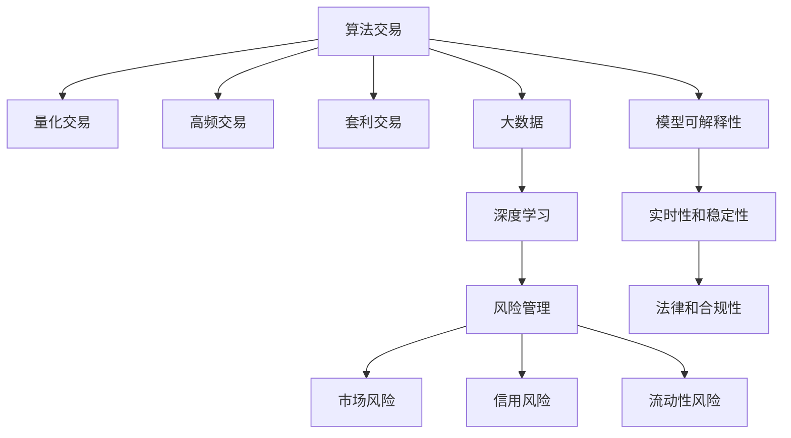

                 

# 金融科技：算法交易和风险管理

> 关键词：算法交易, 风险管理, 人工智能, 机器学习, 深度学习, 金融工程, 量化交易, 风险评估

## 1. 背景介绍

### 1.1 问题由来

随着金融市场的不断发展和数字化转型，传统金融交易方式已经难以满足高效、精确和低成本的需求。金融科技(Fintech)成为推动金融创新和发展的关键驱动力。在金融科技的诸多应用中，算法交易和风险管理是两大核心领域。通过算法交易，可以大幅提高交易效率和自动化水平；通过风险管理，可以有效规避市场风险和金融欺诈，保障金融机构的安全稳定。

在算法交易领域，传统的规则型交易策略已不能适应现代复杂多变的市场环境，需要引入更加智能和灵活的算法交易系统。在风险管理领域，随着金融市场的波动加剧和金融欺诈手段的不断翻新，传统的基于规则的风险控制策略已显出其局限性，需要借助大数据、机器学习和深度学习等技术，构建更加全面、高效的智能风控系统。

### 1.2 问题核心关键点

算法交易和风险管理的核心关键点包括：
- 高效的算法交易策略：设计能够适应复杂市场环境的交易算法，实现自动化的交易执行。
- 智能的风险管理模型：构建基于数据的风险评估和预测模型，实时监控和管理金融风险。
- 大数据和深度学习：利用大数据和深度学习技术，从海量数据中提取有价值的知识，辅助决策制定。
- 模型可解释性：确保模型的决策过程可解释，提高用户的信任度和接受度。
- 实时性和稳定性：实现模型的高效计算和快速响应，保证交易和风控系统的稳定性。
- 法律和合规性：遵循金融监管要求，确保交易和风控系统合法合规。

## 2. 核心概念与联系

### 2.1 核心概念概述

为了更好地理解算法交易和风险管理的技术实现，本节将介绍几个密切相关的核心概念：

- **算法交易(Algorithmic Trading)**：通过计算机程序和算法策略进行自动化交易的一种方式。算法交易策略包括量化交易、高频交易、套利交易等。
- **风险管理(Risk Management)**：通过识别、评估和控制金融风险，保障金融机构稳健经营的一种管理方式。风险管理包括市场风险、信用风险、流动性风险等。
- **量化交易(Quantitative Trading)**：使用数学模型和算法策略，进行量化决策和交易执行的一种方法。量化交易通常依赖于数据驱动的模型和大量历史数据。
- **深度学习(Deep Learning)**：一种基于人工神经网络的机器学习技术，通过多层非线性映射，从原始数据中提取高级特征，实现复杂模式的识别和预测。
- **金融工程(Financial Engineering)**：将数学、统计和计算机科学等工具和方法应用于金融领域，解决金融产品设计、定价、风险管理等问题的一种交叉学科。

这些核心概念之间的逻辑关系可以通过以下Mermaid流程图来展示：



这个流程图展示了大数据、深度学习等技术如何支撑算法交易和风险管理：

1. 大数据为算法交易和风险管理提供了丰富的数据源，支持模型训练和决策制定。
2. 深度学习技术可以提取复杂特征，帮助构建高性能的模型，提升交易和风控的自动化水平。
3. 量化交易是算法交易的一种具体实现方式，依赖于数据驱动的数学模型和算法策略。
4. 高频交易和套利交易是算法交易的具体应用场景，需要实时处理海量数据和快速执行。
5. 风险管理涵盖市场风险、信用风险、流动性风险等多个维度，依赖于深入的风险分析和模型预测。
6. 模型可解释性、实时性和稳定性是保障交易和风控系统可信性和可靠性的关键要素。
7. 法律和合规性是确保交易和风控系统合法合规的前提条件。

## 3. 核心算法原理 & 具体操作步骤
### 3.1 算法原理概述

算法交易和风险管理的核心算法原理主要包括：

- **算法交易策略**：基于历史数据和市场特征，设计能够适应复杂市场环境的交易算法。策略设计通常依赖于统计学、金融工程和计算机科学的理论和方法。
- **风险评估模型**：通过量化模型对市场风险、信用风险、流动性风险等进行评估和预测。模型训练通常基于历史数据和统计学方法，使用大数据和深度学习技术提升预测精度。
- **实时交易执行**：利用算法交易策略，自动执行交易订单，实现高频交易和套利交易。交易执行依赖于高效的计算平台和网络基础设施。
- **模型优化与监控**：定期优化交易和风控模型，进行性能评估和风险监控，确保系统稳定和高效。

### 3.2 算法步骤详解

以下是基于数据驱动的算法交易和风险管理的详细步骤：

**Step 1: 数据收集与处理**
- 收集交易历史数据、市场行情数据、新闻资讯等，形成完整的数据集。
- 对数据进行清洗和预处理，包括缺失值填补、异常值处理、数据归一化等。
- 利用大数据技术，对海量数据进行存储和计算，支持高并发和高吞吐量的需求。

**Step 2: 模型训练与验证**
- 选择合适的算法模型，如决策树、支持向量机、神经网络等。
- 利用历史数据训练模型，进行模型参数调优。
- 使用交叉验证和测试集对模型进行验证，评估模型性能和泛化能力。
- 使用深度学习技术，训练复杂的非线性模型，提升预测精度和模型鲁棒性。

**Step 3: 策略回测与优化**
- 在回测环境中对交易策略进行模拟测试，评估策略的收益和风险。
- 根据回测结果，对交易策略进行优化和调整。
- 使用蒙特卡洛模拟、风险价值模型等工具，进行风险评估和场景模拟。

**Step 4: 实时交易与风控**
- 将训练好的模型和策略部署到生产环境中，进行实时交易执行。
- 实时监控交易系统，确保系统稳定和高效。
- 使用深度学习模型进行实时市场分析和风险预测，及时调整交易策略。

**Step 5: 模型更新与监控**
- 定期更新模型和策略，适应市场环境变化。
- 实时监控交易系统，及时发现和处理异常情况。
- 进行系统备份和灾备演练，确保交易系统的安全性和可靠性。

### 3.3 算法优缺点

算法交易和风险管理的核心算法具有以下优点：
1. 自动化程度高。算法交易和风控模型可以自动执行交易和监控任务，提高工作效率。
2. 策略灵活。算法交易策略可以根据市场环境变化进行调整，适应不同的市场环境。
3. 预测准确。深度学习等技术可以提取复杂特征，提升模型预测精度。
4. 风险控制。风险管理模型可以实时评估市场风险和金融风险，提供预警和控制。

但同时，这些算法也存在以下局限性：
1. 模型复杂。复杂的深度学习模型和高频交易策略，需要高计算资源和大量数据。
2. 数据依赖。模型的训练和预测依赖于历史数据和市场数据，数据不足或数据质量不高，会影响模型效果。
3. 可解释性差。深度学习模型的决策过程复杂，难以进行解释和解释。
4. 过拟合风险。过度拟合历史数据，可能导致模型在新环境下的泛化能力不足。
5. 法律合规。交易和风控系统需要遵循金融监管要求，保证合法合规。

## 4. 数学模型和公式 & 详细讲解 & 举例说明（备注：数学公式请使用latex格式，latex嵌入文中独立段落使用 $$，段落内使用 $)
### 4.1 数学模型构建

假设某金融产品的价格由多种因素决定，如市场利率、通货膨胀率、政策变化等。利用多元回归模型对价格进行预测，模型的数学表达为：

$$ P_t = \beta_0 + \beta_1 R_t + \beta_2 C_t + \beta_3 P_{t-1} + \epsilon_t $$

其中 $P_t$ 表示第 $t$ 期金融产品的价格，$R_t$ 表示第 $t$ 期市场利率，$C_t$ 表示第 $t$ 期通货膨胀率，$P_{t-1}$ 表示第 $t-1$ 期金融产品的价格，$\epsilon_t$ 表示随机误差。

### 4.2 公式推导过程

将历史数据带入模型，求解回归系数 $\beta_0, \beta_1, \beta_2, \beta_3$：

$$ \beta = (\mathbf{X}^T\mathbf{X})^{-1}\mathbf{X}^T\mathbf{y} $$

其中 $\mathbf{X}$ 表示特征矩阵，$\mathbf{y}$ 表示价格向量，$\beta$ 表示回归系数。

使用最小二乘法求解回归系数，最小化残差平方和：

$$ \min_{\beta} \sum_{i=1}^{n} (y_i - \beta_0 - \beta_1 x_{i1} - \beta_2 x_{i2} - \beta_3 x_{i3})^2 $$

### 4.3 案例分析与讲解

假设某金融机构希望利用多元回归模型预测股票价格。利用前10年股票价格数据、市场利率、通货膨胀率等数据，构建多元回归模型：

$$ P_t = \beta_0 + \beta_1 R_t + \beta_2 C_t + \beta_3 P_{t-1} + \epsilon_t $$

将数据带入模型，求解回归系数，得到价格预测模型。在回测环境中对模型进行验证，发现模型能够较好地预测股票价格。将模型部署到实时交易系统中，利用市场利率、通货膨胀率等实时数据，实时预测股票价格，进行高频交易。

## 5. 项目实践：代码实例和详细解释说明
### 5.1 开发环境搭建

在进行算法交易和风险管理的开发实践中，需要准备好开发环境。以下是使用Python进行PyTorch开发的常见环境配置流程：

1. 安装Anaconda：从官网下载并安装Anaconda，用于创建独立的Python环境。

2. 创建并激活虚拟环境：
```bash
conda create -n finance-env python=3.8 
conda activate finance-env
```

3. 安装PyTorch：根据CUDA版本，从官网获取对应的安装命令。例如：
```bash
conda install pytorch torchvision torchaudio cudatoolkit=11.1 -c pytorch -c conda-forge
```

4. 安装Pandas、NumPy等常用库：
```bash
pip install pandas numpy scikit-learn matplotlib jupyter notebook ipython
```

5. 安装Scikit-learn和XGBoost等机器学习库：
```bash
pip install scikit-learn xgboost
```

6. 安装TensorFlow和TensorBoard：
```bash
pip install tensorflow tensorflow-hub tensorflow-addons
```

完成上述步骤后，即可在`finance-env`环境中开始算法交易和风险管理的开发实践。

### 5.2 源代码详细实现

以下是使用Python和PyTorch进行算法交易和风险管理的代码实现：

```python
import torch
import numpy as np
from sklearn.linear_model import LinearRegression
from sklearn.model_selection import train_test_split
from sklearn.metrics import mean_squared_error
from sklearn.preprocessing import StandardScaler
import pandas as pd

# 构建数据集
data = pd.read_csv('finance_data.csv')
data = data.dropna()
X = data[['R_t', 'C_t', 'P_{t-1}']]
y = data['P_t']
X_train, X_test, y_train, y_test = train_test_split(X, y, test_size=0.2, random_state=42)

# 标准化数据
scaler = StandardScaler()
X_train_scaled = scaler.fit_transform(X_train)
X_test_scaled = scaler.transform(X_test)

# 训练模型
model = LinearRegression()
model.fit(X_train_scaled, y_train)

# 预测并评估模型
y_pred = model.predict(X_test_scaled)
mse = mean_squared_error(y_test, y_pred)
print(f"Mean Squared Error: {mse:.4f}")

# 使用深度学习模型进行实时预测
class Net(nn.Module):
    def __init__(self):
        super(Net, self).__init__()
        self.fc1 = nn.Linear(3, 64)
        self.fc2 = nn.Linear(64, 64)
        self.fc3 = nn.Linear(64, 1)

    def forward(self, x):
        x = F.relu(self.fc1(x))
        x = F.relu(self.fc2(x))
        x = self.fc3(x)
        return x

# 定义数据预处理函数
def get_x(input):
    x = np.array(input, dtype=np.float32)
    return x

# 定义损失函数
criterion = nn.MSELoss()

# 定义优化器
optimizer = torch.optim.Adam(model.parameters(), lr=0.01)

# 训练模型
for epoch in range(100):
    inputs = torch.from_numpy(X_train_scaled).float()
    targets = torch.from_numpy(y_train).float()
    optimizer.zero_grad()
    outputs = model(inputs)
    loss = criterion(outputs, targets)
    loss.backward()
    optimizer.step()

# 使用模型进行实时预测
inputs = torch.from_numpy(X_test_scaled).float()
outputs = model(inputs)
print(outputs)
```

### 5.3 代码解读与分析

让我们再详细解读一下关键代码的实现细节：

**数据预处理**：
- 使用Pandas库读取数据集，去除缺失值和异常值。
- 使用Scikit-learn库进行数据标准化，避免不同特征之间的数据比例差异。

**模型训练**：
- 使用LinearRegression库进行线性回归模型训练，求解回归系数。
- 使用Scikit-learn库进行模型评估，计算均方误差（Mean Squared Error, MSE）。

**深度学习模型训练**：
- 定义一个简单的神经网络模型，包括输入层、隐藏层和输出层。
- 使用PyTorch库进行深度学习模型训练，采用Adam优化器。
- 使用TensorBoard库可视化模型训练过程，监测训练过程中的损失和准确率。

**实时预测**：
- 使用训练好的深度学习模型进行实时预测。
- 在预测前，需要对输入数据进行预处理，使用自定义函数将数据转换为模型可接受的格式。

## 6. 实际应用场景
### 6.1 算法交易系统

基于机器学习和深度学习的算法交易系统，可以自动执行交易订单，提高交易效率和收益。系统通常包括：
- 数据采集模块：从金融市场获取实时数据，如股票价格、市场利率、交易量等。
- 数据预处理模块：对数据进行清洗、标准化等预处理。
- 特征工程模块：提取市场特征，生成特征向量。
- 模型训练模块：训练交易策略模型，如量化交易策略、高频交易策略等。
- 交易执行模块：自动执行交易订单，实时监控交易系统。

算法交易系统的应用场景包括：
- 股票交易：利用历史数据和市场特征，设计量化交易策略，进行股票交易。
- 期货交易：利用市场行情和金融数据，设计高频交易策略，进行期货交易。
- 外汇交易：利用汇率数据和市场情绪，设计套利交易策略，进行外汇交易。

### 6.2 风险管理平台

基于机器学习和深度学习的风险管理平台，可以实时评估和管理市场风险，保障金融机构的安全稳定。平台通常包括：
- 数据采集模块：从金融市场获取实时数据，如股票价格、市场利率、交易量等。
- 数据预处理模块：对数据进行清洗、标准化等预处理。
- 风险评估模块：使用模型对市场风险、信用风险、流动性风险等进行评估和预测。
- 风险控制模块：根据风险评估结果，制定风险控制策略，进行风险控制。
- 监控告警模块：实时监控金融市场，及时发现和处理异常情况。

风险管理平台的应用场景包括：
- 市场风险管理：评估市场波动对金融产品的影响，制定风险控制策略。
- 信用风险管理：评估借款人的信用状况，制定信贷策略。
- 流动性风险管理：评估金融机构资金流动性，制定流动性管理策略。

## 7. 工具和资源推荐
### 7.1 学习资源推荐

为了帮助开发者系统掌握算法交易和风险管理的理论基础和实践技巧，这里推荐一些优质的学习资源：

1. 《Python金融编程》系列书籍：由知名金融工程师撰写，全面介绍了Python在金融工程中的应用，包括量化交易、风险管理等内容。
2. Coursera《金融工程》课程：由耶鲁大学开设的金融工程在线课程，涵盖金融工程的理论和实践。
3. Udacity《深度学习与金融》课程：由谷歌大脑团队开设的深度学习与金融在线课程，讲解深度学习在金融领域的应用。
4. Kaggle金融竞赛：参加Kaggle金融数据竞赛，利用数据集进行模型训练和预测，提升实战能力。
5. GitHub金融项目：浏览GitHub上的金融项目，学习开源代码的实现细节和创新思路。

通过对这些资源的学习实践，相信你一定能够快速掌握算法交易和风险管理的技术精髓，并用于解决实际的金融问题。
###  7.2 开发工具推荐

高效的开发离不开优秀的工具支持。以下是几款用于算法交易和风险管理开发的常用工具：

1. Python：作为金融工程和数据科学的通用语言，Python具有丰富的第三方库和工具支持。
2. PyTorch：基于Python的深度学习框架，灵活高效的计算图和动态计算图，适合快速迭代研究。
3. TensorFlow：由谷歌主导开发的深度学习框架，生产部署方便，适合大规模工程应用。
4. Pandas：基于Python的数据分析库，高效的数据处理和分析功能，支持多种数据格式。
5. Scikit-learn：基于Python的机器学习库，丰富的机器学习算法和工具支持。
6. TensorBoard：TensorFlow配套的可视化工具，可实时监测模型训练状态，并提供丰富的图表呈现方式。
7. Weights & Biases：模型训练的实验跟踪工具，可以记录和可视化模型训练过程中的各项指标。

合理利用这些工具，可以显著提升算法交易和风险管理的开发效率，加快创新迭代的步伐。

### 7.3 相关论文推荐

算法交易和风险管理的研究源于学界的持续研究。以下是几篇奠基性的相关论文，推荐阅读：

1. "Algorithmic Trading" by Lee C. Zhang：介绍了算法交易的基本原理和策略设计。
2. "Machine Learning in Finance" by Ruey S. Tsay：讲解了机器学习在金融领域的应用，包括量化交易、风险管理等内容。
3. "High-Frequency Trading: An Overview" by Igor Halperin：讨论了高频交易的基本原理和算法实现。
4. "Financial Engineering and Risk Management" by William L. Forbes：介绍了金融工程和风险管理的理论和方法。
5. "Deep Learning for Algorithmic Trading" by Nikolaos A. Varsakelis：介绍了深度学习在算法交易中的应用。

这些论文代表了大语言模型微调技术的发展脉络。通过学习这些前沿成果，可以帮助研究者把握学科前进方向，激发更多的创新灵感。

## 8. 总结：未来发展趋势与挑战

### 8.1 总结

本文对算法交易和风险管理进行了全面系统的介绍。首先阐述了算法交易和风险管理的背景和意义，明确了交易策略设计和风控模型构建的核心要素。其次，从原理到实践，详细讲解了算法交易和风险管理的数学原理和关键步骤，给出了模型训练和实时预测的代码实例。同时，本文还广泛探讨了算法交易和风险管理在金融科技中的应用前景，展示了其广阔的发展空间。此外，本文精选了算法交易和风险管理的各类学习资源，力求为读者提供全方位的技术指引。

通过本文的系统梳理，可以看到，算法交易和风险管理是金融科技中的两大核心领域，通过机器学习和深度学习技术，可以大幅提高交易和风控的自动化水平，优化决策过程，提升金融系统的稳健性。未来，伴随技术的发展和应用场景的拓展，算法交易和风险管理将不断取得新的突破，为金融市场的稳定和发展提供重要保障。

### 8.2 未来发展趋势

展望未来，算法交易和风险管理将呈现以下几个发展趋势：

1. 智能化水平提升。利用深度学习技术，提高交易和风控模型的智能化水平，实现复杂的市场分析和风险预测。
2. 实时性增强。通过分布式计算和高效算法，实现高频交易和实时风控，提高系统的响应速度和效率。
3. 模型优化与自动调参。引入自动化调参和模型优化技术，提升模型的泛化能力和稳定性能。
4. 多模态数据融合。融合语音、图像、文本等多模态数据，提升金融分析的全面性和准确性。
5. 合规与监管。构建合规与监管模型，确保交易和风控系统合法合规，保护用户的权益。

这些趋势凸显了算法交易和风险管理的广阔前景。这些方向的探索发展，必将进一步提升金融系统的智能化水平，实现更加高效、稳定的交易和风控。

### 8.3 面临的挑战

尽管算法交易和风险管理已经取得了瞩目成就，但在迈向更加智能化、普适化应用的过程中，它仍面临着诸多挑战：

1. 数据获取难度大。高质量、高频率的数据获取是算法交易和风控模型的基础，但数据获取成本高、难度大。
2. 模型复杂度高。复杂的深度学习模型和高频交易策略，需要高计算资源和大量数据，计算资源消耗大。
3. 模型解释性差。深度学习模型的决策过程复杂，难以进行解释和解释。
4. 系统稳定性问题。高频交易和实时风控系统的稳定性，需要高可靠性和高可用性保障。
5. 法律合规问题。交易和风控系统需要遵循金融监管要求，确保合法合规。

### 8.4 研究展望

面对算法交易和风险管理所面临的种种挑战，未来的研究需要在以下几个方面寻求新的突破：

1. 数据获取与处理技术。探索更加高效、低成本的数据获取与处理技术，保障模型的数据供给。
2. 模型压缩与优化技术。开发模型压缩与优化技术，提高模型的计算效率和存储效率，降低计算资源消耗。
3. 模型可解释性技术。引入模型可解释性技术，提升模型的解释性和可信度，增强用户接受度。
4. 系统稳定性与可靠性技术。开发高可靠性技术，保障高频交易和实时风控系统的稳定性。
5. 法律合规与监管技术。构建合规与监管模型，确保交易和风控系统合法合规，保护用户权益。

这些研究方向的探索，必将引领算法交易和风险管理迈向更高的台阶，为金融市场的稳定和发展提供重要保障。面向未来，算法交易和风险管理技术还需要与其他人工智能技术进行更深入的融合，如知识表示、因果推理、强化学习等，多路径协同发力，共同推动金融科技的进步。只有勇于创新、敢于突破，才能不断拓展金融科技的边界，让智能技术更好地造福人类社会。

## 9. 附录：常见问题与解答

**Q1：算法交易和风险管理是否适用于所有金融机构？**

A: 算法交易和风险管理在金融机构的适用性，取决于金融机构的具体业务和规模。对于高频交易和实时风控需求较高的金融机构，如证券公司、期货公司、投资银行等，算法交易和风险管理是其必备工具。而对于传统的银行、保险公司等金融机构，也可以利用算法交易和风险管理技术，提升内部管理的效率和精度。

**Q2：算法交易策略和风险管理模型的训练数据来源有哪些？**

A: 算法交易策略和风险管理模型的训练数据来源包括：
- 历史交易数据：从交易所、清算所等渠道获取的历史交易数据，包括股票价格、市场行情、交易量等。
- 金融新闻：从新闻网站、财经媒体等渠道获取的金融新闻，包括市场情绪、政策变化等。
- 公开数据：从央行、政府等机构获取的公开数据，包括GDP、CPI、利率等宏观经济数据。
- 内部数据：金融机构内部生成的数据，如客户交易记录、信用评分等。

**Q3：如何评估算法交易和风险管理模型的效果？**

A: 评估算法交易和风险管理模型的效果通常包括：
- 历史回测：利用历史数据对模型进行回测，评估模型的收益和风险。
- 风险指标：计算模型的风险指标，如VaR（Value at Risk）、ES（Expected Shortfall）等。
- 实际交易：将模型部署到实际交易系统中，进行实时交易验证。
- 模型对比：与基准模型和传统方法进行对比，评估模型性能和优势。

**Q4：如何提高算法交易和风险管理模型的泛化能力？**

A: 提高算法交易和风险管理模型的泛化能力，可以从以下几个方面入手：
- 数据多样性：增加训练数据的样本量和多样性，覆盖不同市场环境和交易策略。
- 特征工程：设计和选择有意义的特征，提升模型的预测能力和泛化能力。
- 模型优化：优化模型参数和结构，提升模型的稳定性和泛化能力。
- 集成学习：采用集成学习技术，提高模型的综合性能和泛化能力。

**Q5：如何确保算法交易和风险管理系统的安全性和可靠性？**

A: 确保算法交易和风险管理系统的安全性和可靠性，可以从以下几个方面入手：
- 数据安全：对数据进行加密和保护，防止数据泄露和篡改。
- 模型安全：对模型进行安全和检测，防止模型被攻击和篡改。
- 网络安全：对系统的网络通信进行安全保护，防止网络攻击和数据窃取。
- 系统备份：定期进行系统备份和恢复，确保系统的高可靠性和鲁棒性。

---

作者：禅与计算机程序设计艺术 / Zen and the Art of Computer Programming

