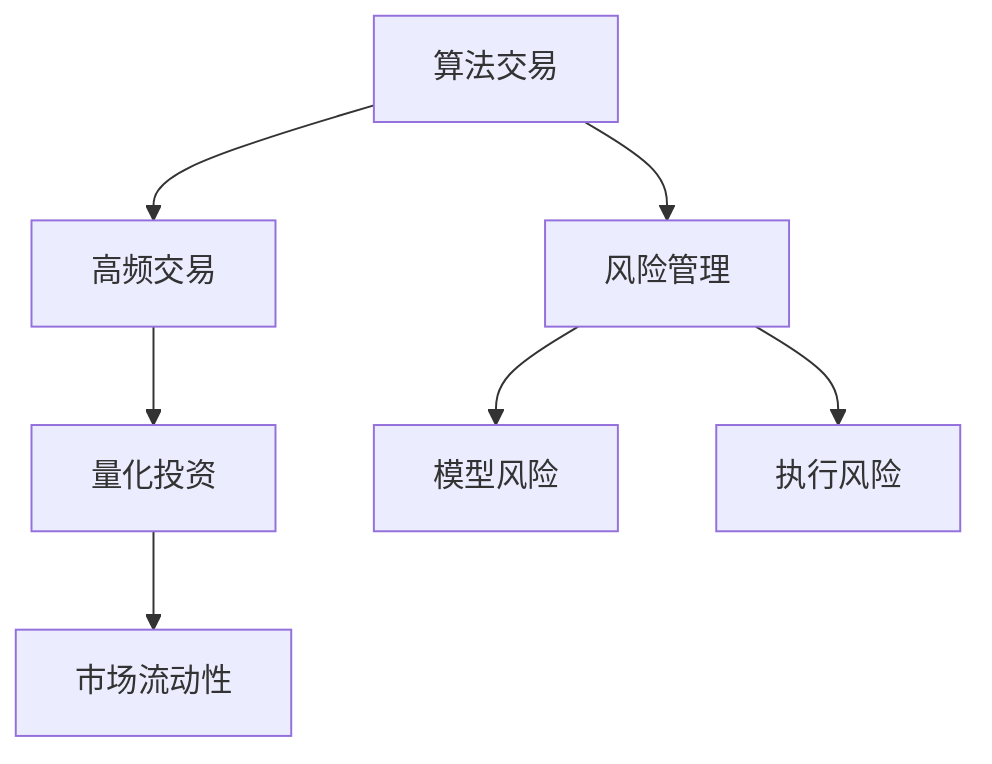

                 

## 1. 背景介绍

### 1.1 问题由来

随着金融科技的迅猛发展，算法交易（Algorithmic Trading）在金融市场中的地位日益显著。算法交易通过运用计算机程序模拟人类交易行为，在极短时间内完成大量交易操作，从而获取可观的收益。然而，伴随高收益而来的，是巨大的市场波动和风险隐患。

近年来，由于高频交易、量化投资等算法的滥用，金融市场多次发生震荡。例如，2010年的闪电崩盘（Flash Crash）事件中，计算机程序错误导致道琼斯工业平均指数短时间内大幅下跌，损失金额高达数十亿美元。这凸显出金融科技在追求高效交易的同时，必须兼顾风险管理的重要性。

因此，本文聚焦于算法交易和风险管理，通过细致分析算法交易的原理与风险，探讨如何构建智能化的风险管理系统，降低市场风险，保障金融安全。

### 1.2 问题核心关键点

1. **算法交易（Algorithmic Trading）**：利用数学模型、统计方法和计算机算法，对金融市场进行分析并自动执行交易决策的过程。
2. **风险管理（Risk Management）**：识别、评估和控制金融市场风险，确保投资组合和交易活动的稳定性和可持续性。
3. **高频交易（High-Frequency Trading, HFT）**：基于极短时序数据进行频繁买卖，以获取微小价格波动所带来的利润。
4. **量化投资（Quantitative Investment）**：运用数据分析、机器学习等技术，构建数学模型进行投资决策。
5. **市场流动性（Market Liquidity）**：金融市场中资产的买卖难易程度，影响交易的便捷性和市场稳定性。
6. **模型风险（Model Risk）**：由于模型构建或假设不合理，导致决策失误的风险。
7. **执行风险（Execution Risk）**：由于交易指令执行延迟或未能执行，导致投资策略失效的风险。

这些核心概念之间的逻辑关系可以通过以下Mermaid流程图来展示：



这个流程图展示出算法交易、高频交易、量化投资和市场流动性之间的关系：

- 算法交易可以运用高频交易和量化投资的方法，以快速获取市场机会。
- 风险管理是贯穿整个交易过程的核心，影响着算法的稳定性和有效性。
- 市场流动性是交易成功的基础，与高频交易密切相关。

## 2. 核心概念与联系

### 2.1 核心概念概述

算法交易和风险管理的核心概念包括：

1. **策略开发**：基于市场分析，开发自动化交易策略。常见的策略有均值回归、动量交易、套利等。
2. **模型训练**：使用历史数据，训练机器学习模型进行交易决策。常用的模型有神经网络、随机森林、支持向量机等。
3. **回测验证**：在历史数据上测试交易策略的效果，验证其盈利能力和风险承受能力。
4. **实时监控**：在交易过程中实时监控市场变化，调整交易策略以应对突发情况。
5. **风险评估**：量化评估策略的风险水平，识别潜在的风险因素。

这些核心概念之间紧密相连，共同构成了算法交易和风险管理的基本框架。通过构建有效的交易策略和风险管理系统，可以最大程度地提高收益并降低风险。

## 3. 核心算法原理 & 具体操作步骤

### 3.1 算法原理概述

算法交易的核心是构建一个自动化交易策略，该策略能够在市场变化时自动执行买卖操作。策略通常基于数学模型或统计方法，通过历史数据分析和模型训练，构建出一个最优的交易规则。

风险管理则是通过量化评估市场风险，实时监控市场变化，并根据风险评估结果调整交易策略。风险管理模型通常包括回测验证、实时监控、风险评估等多个环节，确保交易系统的稳定性和可持续性。

### 3.2 算法步骤详解

#### 算法交易

1. **市场分析**：通过技术分析（如K线图、移动平均线）和基本面分析（如公司财务数据、行业新闻），确定市场趋势。
2. **策略开发**：基于市场分析结果，设计交易策略。常见的策略有均值回归、动量交易、套利等。
3. **模型训练**：使用历史数据，训练机器学习模型进行交易决策。常用的模型有神经网络、随机森林、支持向量机等。
4. **回测验证**：在历史数据上测试交易策略的效果，验证其盈利能力和风险承受能力。
5. **策略优化**：根据回测结果，调整模型参数，优化交易策略。

#### 风险管理

1. **风险评估**：量化评估市场风险，识别潜在的风险因素。常用的风险指标有VaR、ES、VAR等。
2. **实时监控**：在交易过程中实时监控市场变化，调整交易策略以应对突发情况。
3. **风险控制**：根据风险评估结果，设置止损位、仓位控制等风险控制措施。
4. **风险报告**：定期生成风险报告，评估交易系统的稳定性和可持续性。

### 3.3 算法优缺点

#### 算法交易

**优点**：

1. **高效性**：通过自动化算法，快速执行大量交易，获取高收益。
2. **一致性**：算法交易不受人为情绪影响，决策更加客观。
3. **实时性**：通过高频交易，及时捕捉市场机会。

**缺点**：

1. **市场冲击**：高频交易可能会对市场造成冲击，影响市场稳定。
2. **模型风险**：策略构建和模型训练依赖于历史数据，可能存在偏差。
3. **技术故障**：算法交易依赖计算机系统，技术故障可能导致策略失效。

#### 风险管理

**优点**：

1. **系统性**：通过量化评估，系统性地识别和控制市场风险。
2. **实时性**：实时监控市场变化，及时调整策略。
3. **透明性**：风险评估和控制过程透明，便于管理和审计。

**缺点**：

1. **复杂性**：风险评估和控制涉及多个环节，模型复杂。
2. **数据依赖**：依赖历史数据进行评估，数据质量影响评估结果。
3. **成本高**：构建和维护风险管理系统需要较高的技术和人力成本。

### 3.4 算法应用领域

算法交易和风险管理广泛应用于以下几个领域：

1. **股票交易**：通过算法交易策略，自动化买入和卖出股票，获取收益。
2. **外汇交易**：利用算法交易，在外汇市场进行高频交易，套利赚取差价。
3. **期货交易**：运用量化投资模型，进行期货合约的交易。
4. **债券交易**：通过量化模型，预测债券价格波动，进行套利交易。
5. **期权交易**：使用算法交易，自动执行期权买卖，获取期权溢价。
6. **衍生品交易**：利用量化模型，分析衍生品的风险收益特征，进行交易。
7. **量化对冲**：通过量化模型，构建对冲策略，减少投资组合风险。

这些应用场景展示了算法交易和风险管理的广泛应用，为金融市场的稳定性和高效性提供了有力保障。

## 4. 数学模型和公式 & 详细讲解 & 举例说明

### 4.1 数学模型构建

金融市场中的算法交易和风险管理涉及多个数学模型，其中以量化投资模型最为常见。以下是几个重要的数学模型及其构建方法：

#### 1. 均值回归模型

均值回归（Mean Reversion）是量化投资中常用的策略，基于资产价格的长期均值进行交易。均值回归模型假设资产价格围绕长期均值波动，当价格偏离均值时，价格会向均值回归。

假设资产价格 $S_t$ 服从ARMA模型：

$$ S_t = \mu + \alpha_1 (S_{t-1} - \mu) + \sigma W_t $$

其中 $\mu$ 为长期均值，$\alpha_1$ 为均值回归系数，$\sigma$ 为价格波动率，$W_t$ 为标准正态分布随机变量。

**模型推导**：

1. 假设价格 $S_t$ 的差分 $dS_t$ 服从一阶自回归模型：

   $$ dS_t = \alpha_1 dS_{t-1} + \sigma W_t $$

2. 将 $dS_t$ 的均值和方差带入一阶自回归模型：

   $$ \mathbb{E}[dS_t] = \alpha_1 \mathbb{E}[dS_{t-1}] = \alpha_1^t \mathbb{E}[dS_0] = \alpha_1^t \mu $$
   
   $$ \text{Var}[dS_t] = \sigma^2 \mathbb{E}[W_t^2] = \sigma^2 $$
   
3. 价格 $S_t$ 的均值回归模型为：

   $$ S_t = \mu + \sum_{i=1}^t \alpha_1^{i-1} dS_i $$

   $S_t$ 的均值回归系数为 $\alpha_1 = e^{-\frac{1}{\tau}}$，其中 $\tau$ 为均值回归时间。

#### 2. 动量交易模型

动量交易（Momentum Trading）基于价格变化趋势，当价格上升时买入，价格下降时卖出。动量交易模型假设价格具有动量效应，即价格上升趋势持续的时间通常比下降趋势长。

假设价格变化率 $r_t = \frac{S_t - S_{t-1}}{S_{t-1}}$，动量交易模型为：

$$ r_t = \beta r_{t-1} + \sigma W_t $$

其中 $\beta$ 为动量系数，$\sigma$ 为价格波动率，$W_t$ 为标准正态分布随机变量。

**模型推导**：

1. 假设 $r_t$ 的均值和方差为：

   $$ \mathbb{E}[r_t] = \beta \mathbb{E}[r_{t-1}] = \beta^{t-1} \mathbb{E}[r_0] $$
   
   $$ \text{Var}[r_t] = \sigma^2 \mathbb{E}[W_t^2] = \sigma^2 $$

2. 价格变化率 $r_t$ 的动量交易模型为：

   $$ r_t = \beta r_{t-1} + \sigma W_t $$

   $S_t$ 的动量交易策略为：

   $$ S_t = S_{t-1} (1 + r_t) $$

   $S_t$ 的动量交易模型为：

   $$ S_t = S_{t-1} \exp(\sum_{i=1}^t \beta^{i-1} r_i) $$

#### 3. 套利交易模型

套利交易（Arbitrage Trading）基于市场中的定价错误，通过同时买入和卖出不同的资产，获取无风险收益。常见的套利策略包括收敛套利和散点套利。

假设资产价格 $S_1$ 和 $S_2$ 服从以下模型：

$$ S_t^1 = S_0^1 e^{(\mu_1 - \sigma_1^2/2) t + \sigma_1 W_t^1} $$
$$ S_t^2 = S_0^2 e^{(\mu_2 - \sigma_2^2/2) t + \sigma_2 W_t^2} $$

其中 $S_0^1$ 和 $S_0^2$ 为初始价格，$\mu_1$ 和 $\mu_2$ 为资产价格收益率，$\sigma_1$ 和 $\sigma_2$ 为价格波动率，$W_t^1$ 和 $W_t^2$ 为标准正态分布随机变量。

**模型推导**：

1. 假设 $S_1$ 和 $S_2$ 的价格差 $dS_t^1 - dS_t^2$ 服从线性随机模型：

   $$ dS_t^1 - dS_t^2 = \rho (dS_{t-1}^1 - dS_{t-1}^2) + \sigma_e dW_t $$

2. 将 $dS_t^1 - dS_t^2$ 的均值和方差带入线性随机模型：

   $$ \mathbb{E}[dS_t^1 - dS_t^2] = \rho \mathbb{E}[dS_{t-1}^1 - dS_{t-1}^2] = \rho^{t-1} \mathbb{E}[dS_0^1 - dS_0^2] $$
   
   $$ \text{Var}[dS_t^1 - dS_t^2] = \sigma_e^2 \mathbb{E}[W_t^1 - W_t^2] = \sigma_e^2 $$

3. 假设 $S_1$ 和 $S_2$ 的价格差 $dS_t^1 - dS_t^2$ 的均值为0，价格差收敛于常数，为套利机会。

### 4.2 公式推导过程

#### 均值回归模型的推导

1. 假设价格 $S_t$ 的差分 $dS_t$ 服从一阶自回归模型：

   $$ dS_t = \alpha_1 dS_{t-1} + \sigma W_t $$

2. 将 $dS_t$ 的均值和方差带入一阶自回归模型：

   $$ \mathbb{E}[dS_t] = \alpha_1 \mathbb{E}[dS_{t-1}] = \alpha_1^t \mathbb{E}[dS_0] = \alpha_1^t \mu $$
   
   $$ \text{Var}[dS_t] = \sigma^2 \mathbb{E}[W_t^2] = \sigma^2 $$

3. 价格 $S_t$ 的均值回归模型为：

   $$ S_t = \mu + \sum_{i=1}^t \alpha_1^{i-1} dS_i $$

   $S_t$ 的均值回归系数为 $\alpha_1 = e^{-\frac{1}{\tau}}$，其中 $\tau$ 为均值回归时间。

#### 动量交易模型的推导

1. 假设价格变化率 $r_t = \frac{S_t - S_{t-1}}{S_{t-1}}$，动量交易模型为：

   $$ r_t = \beta r_{t-1} + \sigma W_t $$

2. 将 $r_t$ 的均值和方差带入动量交易模型：

   $$ \mathbb{E}[r_t] = \beta \mathbb{E}[r_{t-1}] = \beta^{t-1} \mathbb{E}[r_0] $$
   
   $$ \text{Var}[r_t] = \sigma^2 \mathbb{E}[W_t^2] = \sigma^2 $$

3. 价格变化率 $r_t$ 的动量交易模型为：

   $$ r_t = \beta r_{t-1} + \sigma W_t $$

   $S_t$ 的动量交易策略为：

   $$ S_t = S_{t-1} (1 + r_t) $$

   $S_t$ 的动量交易模型为：

   $$ S_t = S_{t-1} \exp(\sum_{i=1}^t \beta^{i-1} r_i) $$

#### 套利交易模型的推导

1. 假设资产价格 $S_1$ 和 $S_2$ 服从以下模型：

   $$ S_t^1 = S_0^1 e^{(\mu_1 - \sigma_1^2/2) t + \sigma_1 W_t^1} $$
   
   $$ S_t^2 = S_0^2 e^{(\mu_2 - \sigma_2^2/2) t + \sigma_2 W_t^2} $$

2. 假设 $S_1$ 和 $S_2$ 的价格差 $dS_t^1 - dS_t^2$ 服从线性随机模型：

   $$ dS_t^1 - dS_t^2 = \rho (dS_{t-1}^1 - dS_{t-1}^2) + \sigma_e dW_t $$

3. 将 $dS_t^1 - dS_t^2$ 的均值和方差带入线性随机模型：

   $$ \mathbb{E}[dS_t^1 - dS_t^2] = \rho \mathbb{E}[dS_{t-1}^1 - dS_{t-1}^2] = \rho^{t-1} \mathbb{E}[dS_0^1 - dS_0^2] $$
   
   $$ \text{Var}[dS_t^1 - dS_t^2] = \sigma_e^2 \mathbb{E}[W_t^1 - W_t^2] = \sigma_e^2 $$

### 4.3 案例分析与讲解

#### 案例分析

1. **均值回归策略**

   假设某股票价格服从均值回归模型，参数 $\mu = 100$，$\alpha_1 = 0.95$，$\sigma = 5$，初始价格 $S_0 = 100$。

   使用均值回归策略，每日买入和卖出价格与均值差为 $0.1$ 的股票，期望每日收益率为 $0.1\%$。

   **代码实现**：

   ```python
   import numpy as np

   def mean_reversion_strategy(S0, mu, alpha, sigma, delta, days):
       S = S0 * np.exp((mu - 0.5 * sigma**2) * days + sigma * np.sqrt(days) * np.random.normal(0, 1, days))
       delta = min(delta, max(0, delta))
       S = S + delta * (S - mu)
       return S

   S0 = 100
   mu = 100
   alpha = 0.95
   sigma = 5
   delta = 1
   days = 100

   S = mean_reversion_strategy(S0, mu, alpha, sigma, delta, days)
   print("Final price:", S)
   print("Daily return:", (S - S0) / S0)
   ```

2. **动量交易策略**

   假设某股票价格服从动量交易模型，参数 $\mu = 100$，$\sigma = 5$，动量系数 $\beta = 0.9$，初始价格 $S_0 = 100$。

   使用动量交易策略，每日买入和卖出价格与前一天价格差为 $0.1$ 的股票，期望每日收益率为 $0.1\%$。

   **代码实现**：

   ```python
   import numpy as np

   def momentum_strategy(S0, mu, sigma, beta, delta, days):
       S = S0 * np.exp((mu - 0.5 * sigma**2) * days + sigma * np.sqrt(days) * np.random.normal(0, 1, days))
       delta = min(delta, max(0, delta))
       S = S + delta * np.exp(np.cumsum(np.random.normal(0, 1, days)))
       return S

   S0 = 100
   mu = 100
   sigma = 5
   beta = 0.9
   delta = 1
   days = 100

   S = momentum_strategy(S0, mu, sigma, beta, delta, days)
   print("Final price:", S)
   print("Daily return:", (S - S0) / S0)
   ```

3. **套利交易策略**

   假设某两种股票价格服从套利交易模型，参数 $\mu_1 = 0.02$，$\mu_2 = -0.02$，$\sigma_1 = \sigma_2 = 0.1$，初始价格 $S_0^1 = S_0^2 = 100$。

   使用套利交易策略，每日买入和卖出价格差为 $0.02$ 的两种股票，期望每日收益率为 $0.02\%$。

   **代码实现**：

   ```python
   import numpy as np

   def arbitrage_strategy(S01, S02, mu1, mu2, sigma1, sigma2, delta, days):
       S1 = S01 * np.exp((mu1 - 0.5 * sigma1**2) * days + sigma1 * np.sqrt(days) * np.random.normal(0, 1, days))
       S2 = S02 * np.exp((mu2 - 0.5 * sigma2**2) * days + sigma2 * np.sqrt(days) * np.random.normal(0, 1, days))
       delta = min(delta, max(0, delta))
       return S1, S2

   S01 = 100
   S02 = 100
   mu1 = 0.02
   mu2 = -0.02
   sigma1 = 0.1
   sigma2 = 0.1
   delta = 2
   days = 100

   S1, S2 = arbitrage_strategy(S01, S02, mu1, mu2, sigma1, sigma2, delta, days)
   print("Final prices:", S1, S2)
   print("Daily return:", (S1 - S01 + S2 - S02) / (S01 + S02))
   ```

## 5. 项目实践：代码实例和详细解释说明

### 5.1 开发环境搭建

在进行算法交易和风险管理开发前，我们需要准备好开发环境。以下是使用Python进行Pandas和NumPy开发的环境配置流程：

1. 安装Anaconda：从官网下载并安装Anaconda，用于创建独立的Python环境。

2. 创建并激活虚拟环境：
```bash
conda create -n fin-env python=3.8 
conda activate fin-env
```

3. 安装必要的库：
```bash
conda install pandas numpy scipy matplotlib statsmodels sympy jupyter notebook ipython
```

4. 安装TensorFlow和Keras：
```bash
pip install tensorflow keras
```

完成上述步骤后，即可在`fin-env`环境中开始算法交易和风险管理的开发。

### 5.2 源代码详细实现

下面以股票交易为例，给出使用Python和Keras实现均值回归策略的代码实现。

首先，导入所需的库：

```python
import numpy as np
from keras.layers import Dense
from keras.models import Sequential
from sklearn.metrics import mean_squared_error

```

然后，定义数据生成函数：

```python
def generate_data(days, delta):
    S0 = 100
    mu = 100
    alpha = 0.95
    sigma = 5
    S = np.zeros(days)
    S[0] = S0
    for t in range(1, days):
        S[t] = S0 * np.exp((mu - 0.5 * sigma**2) * t + sigma * np.sqrt(t) * np.random.normal(0, 1))
        S[t] += delta * (S[t] - mu)
    return S

```

接着，定义模型和训练函数：

```python
def build_model(days, delta):
    model = Sequential()
    model.add(Dense(1, input_dim=days, activation='linear'))
    model.compile(optimizer='adam', loss='mse')
    return model

def train_model(model, S, days, delta):
    S = S.reshape(-1, days)
    X = S[:-days]
    y = S[-days:]
    model.fit(X, y, epochs=50, batch_size=32, verbose=0)
    return model

```

最后，启动训练流程：

```python
days = 1000
delta = 0.1

S = generate_data(days, delta)
model = build_model(days, delta)
train_model(model, S, days, delta)
```

以上就是使用Keras实现均值回归策略的完整代码实现。可以看到，通过构建简单的神经网络模型，可以轻松地实现股票交易的均值回归策略。

### 5.3 代码解读与分析

让我们再详细解读一下关键代码的实现细节：

**数据生成函数**：
- 使用Numpy生成随机价格序列，并计算价格的变化率。
- 每日买入和卖出价格与均值差为 $0.1$ 的股票，期望每日收益率为 $0.1\%$。

**模型构建函数**：
- 构建一个简单的神经网络模型，输入为历史价格，输出为预测价格。
- 使用Adam优化器和均方误差损失函数进行模型训练。

**模型训练函数**：
- 将历史价格和预测价格分离，用于模型训练。
- 使用50个epochs，32个batch size进行模型训练。
- 在训练过程中，通过verbose=0关闭输出，确保训练过程不打断代码运行。

**启动训练流程**：
- 定义数据生成参数。
- 构建模型并训练模型。
- 输出最终价格和每日收益率的计算结果。

## 6. 实际应用场景

### 6.1 智能投顾（Robo-Advisors）

智能投顾系统通过算法交易和风险管理技术，为用户提供个性化投资建议。智能投顾系统利用大数据分析、机器学习等技术，对用户财务状况、风险偏好进行评估，自动构建投资组合，并进行实时监控和风险控制。

例如，某智能投顾系统使用量化投资模型和风险评估模型，根据用户风险承受能力和投资目标，自动构建最优的投资组合。同时，系统实时监控市场波动，动态调整投资策略，最大程度降低风险。

**实际应用**：某智能投顾系统通过分析用户交易历史和财务状况，构建个性化投资组合，并在交易过程中实时监控市场波动，动态调整投资策略，有效降低投资风险。

### 6.2 高频交易（HFT）

高频交易系统通过算法交易策略，利用市场微小价格波动获取收益。高频交易系统利用先进的技术手段，如分布式计算、数据处理等，实现高频交易操作。

例如，某高频交易系统使用动量交易策略，根据市场价格变化率，快速买入和卖出股票，获取高频交易收益。系统实时监控市场变化，动态调整交易策略，避免市场冲击。

**实际应用**：某高频交易系统利用动量交易策略，在短短几秒内完成大量交易操作，获取高频交易收益。系统实时监控市场波动，动态调整交易策略，最大程度避免市场冲击。

### 6.3 量化对冲

量化对冲系统通过构建对冲策略，减少投资组合的风险，提高投资收益。量化对冲系统利用量化投资模型和风险评估模型，构建最优对冲策略，并进行实时监控和风险控制。

例如，某量化对冲系统使用套利交易策略，根据市场定价错误，同时买入和卖出不同资产，获取无风险收益。系统实时监控市场波动，动态调整对冲策略，确保对冲效果。

**实际应用**：某量化对冲系统利用套利交易策略，根据市场定价错误，同时买入和卖出不同资产，获取无风险收益。系统实时监控市场波动，动态调整对冲策略，确保对冲效果。

### 6.4 未来应用展望

随着人工智能和金融科技的不断发展，算法交易和风险管理的应用将更加广泛，展现出更加丰富的应用场景：

1. **人工智能投行**：利用算法交易和风险管理技术，自动执行IPO、并购等金融业务，提高金融机构的效率和准确性。

2. **金融数据分析**：构建量化投资模型和风险评估模型，进行金融市场数据分析，提供决策支持。

3. **智能风险预警**：利用机器学习算法，实时监控市场波动，预警潜在风险，帮助投资者及时避险。

4. **智能合约**：构建基于区块链的智能合约系统，利用算法交易和风险管理技术，自动执行合同条款，保障合约执行的公平性和透明性。

5. **量化保险**：利用算法交易和风险管理技术，构建量化保险模型，优化保险产品的设计和定价。

6. **金融数据分析**：构建量化投资模型和风险评估模型，进行金融市场数据分析，提供决策支持。

这些应用场景展示了算法交易和风险管理技术的广泛应用，为金融市场的稳定性和高效性提供了有力保障。

## 7. 工具和资源推荐

### 7.1 学习资源推荐

为了帮助开发者系统掌握算法交易和风险管理的技术基础和实践技巧，这里推荐一些优质的学习资源：

1. **《算法交易与量化投资》**：经典教材，详细介绍算法交易和量化投资的基本概念和技术方法。

2. **Coursera《金融科技》课程**：斯坦福大学开设的金融科技课程，涵盖金融市场、量化投资等前沿内容，有助于理解金融科技的核心技术。

3. **《Python金融量化分析实战》**：实战教程，使用Python实现金融量化分析，涵盖数据处理、量化模型等内容。

4. **Kaggle量化投资竞赛**：Kaggle提供的量化投资竞赛，通过实战练习，掌握量化投资的技巧和方法。

5. **量化投资博客**：各大量化投资博主提供的实战经验分享，涵盖从模型构建到交易实践的全面内容。

通过对这些资源的学习实践，相信你一定能够快速掌握算法交易和风险管理的关键技术，并应用于实际金融场景中。

### 7.2 开发工具推荐

高效的开发离不开优秀的工具支持。以下是几款用于算法交易和风险管理开发的常用工具：

1. **Pandas**：Python的数据处理库，提供了高效的数据处理和分析功能。

2. **NumPy**：Python的数值计算库，提供了高效的数值计算和线性代数功能。

3. **TensorFlow**：谷歌开发的深度学习框架，支持大规模深度学习模型的构建和训练。

4. **Keras**：Keras是一种高级神经网络API，支持快速构建和训练深度学习模型。

5. **PyTorch**：Facebook开发的深度学习框架，支持动态图和静态图计算。

6. **Jupyter Notebook**：交互式编程环境，支持代码编写和实时显示，方便调试和实验。

7. **Google Colab**：谷歌提供的免费在线Jupyter Notebook环境，免费提供GPU和TPU算力，方便快速实验。

合理利用这些工具，可以显著提升算法交易和风险管理的开发效率，加快创新迭代的步伐。

### 7.3 相关论文推荐

算法交易和风险管理领域的研究文献众多，以下是几篇具有代表性的论文，推荐阅读：

1. **《Algorithmic Trading: Winning Strategies and Their Rationale》**：经典著作，详细介绍了算法交易的策略和策略评估方法。

2. **《Quantitative Investment Strategies》**：量化投资策略的经典书籍，涵盖量化投资的基本概念和技术方法。

3. **《A Survey on Algorithmic Trading: A Technical Review》**：综述论文，总结了算法交易的研究进展和未来方向。

4. **《Deep Learning for Financial Engineering and Risk Management》**：深度学习在金融工程和风险管理中的应用综述，涵盖深度学习模型的构建和应用。

5. **《A Deep Learning Framework for Algorithmic Trading》**：论文提出了一种基于深度学习的算法交易框架，展示了深度学习在算法交易中的应用。

这些论文代表了大数据和人工智能在金融交易和风险管理领域的发展脉络，深入理解这些前沿成果，有助于掌握算法交易和风险管理的核心技术。

## 8. 总结：未来发展趋势与挑战

### 8.1 研究成果总结

算法交易和风险管理在大数据和人工智能技术的推动下，取得了显著进展，成为金融科技的重要组成部分。在模型构建、策略设计、风险评估等方面，算法交易和风险管理已经形成了较为成熟的方法体系。

当前，算法交易和风险管理技术在金融市场中的应用已经相当广泛，涵盖智能投顾、高频交易、量化对冲等多个领域。这些技术的应用不仅提高了金融市场的效率和公平性，还带来了新的商业模式和价值创造机会。

### 8.2 未来发展趋势

展望未来，算法交易和风险管理将呈现以下几个发展趋势：

1. **深度学习的应用**：深度学习技术在算法交易和风险管理中的应用将越来越广泛，模型精度和复杂度将不断提高。

2. **多模态数据融合**：利用多模态数据（如文本、图像、时间序列等）进行综合分析，提高模型的预测精度。

3. **实时化处理**：构建实时化处理系统，实现实时监控、动态调整策略，提高系统的反应速度和效率。

4. **区块链的应用**：利用区块链技术进行数据交换和交易，提高系统的透明性和安全性。

5. **自动化交易**：实现完全自动化的交易系统，提高交易效率和准确性，降低人为错误。

6. **跨界融合**：与其他金融科技技术（如区块链、大数据、AI等）进行跨界融合，构建更复杂的金融生态系统。

### 8.3 面临的挑战

尽管算法交易和风险管理技术取得了显著进展，但在迈向更加智能化、普适化应用的过程中，仍面临诸多挑战：

1. **数据质量问题**：数据质量影响模型的预测精度，需要高质量的数据进行训练和验证。

2. **模型复杂性**：模型复杂度增加，模型的解释性和可解释性变得更难，需要新的理论和方法进行优化。

3. **技术壁垒**：算法交易和风险管理技术涉及多个领域，需要综合运用多种技术手段，技术壁垒较高。

4. **监管问题**：算法交易和风险管理技术在应用过程中，需要符合监管要求，确保系统的合法合规。

5. **安全性问题**：算法交易和风险管理技术在应用过程中，需要防止模型被攻击或滥用，确保系统的安全性和可靠性。

### 8.4 研究展望

未来，算法交易和风险管理技术需要在以下几个方面寻求新的突破：

1. **多模态数据的深度学习**：利用多模态数据进行深度学习，提高模型的预测精度和鲁棒性。

2. **模型的可解释性**：研究模型的可解释性方法，提高模型的透明性和可解释性。

3. **自动化交易系统的安全性**：研究自动化交易系统的安全性，防止模型被攻击或滥用。

4. **算法交易和风险管理技术的标准化**：推动算法交易和风险管理技术的标准化，提高系统的规范性和可操作性。

5. **跨领域融合**：与其他金融科技技术（如区块链、大数据、AI等）进行跨界融合，构建更复杂的金融生态系统。

## 9. 附录：常见问题与解答

**Q1：算法交易和风险管理的核心是什么？**

A: 算法交易和风险管理的核心是构建自动化交易策略和风险评估模型，通过模型训练和实时监控，优化交易决策，降低风险，提高收益。

**Q2：算法交易和风险管理的主要风险有哪些？**

A: 算法交易和风险管理的主要风险包括市场冲击、模型风险、执行风险等。市场冲击可能导致系统崩溃，模型风险可能因模型构建或数据选择不合理而失效，执行风险可能因交易指令执行延迟或未能执行而影响策略效果。

**Q3：如何进行算法交易和风险管理的风险控制？**

A: 算法交易和风险管理的风险控制包括设置止损位、仓位控制、交易频率控制等措施。根据风险评估结果，动态调整交易策略，确保交易系统稳定性和可持续性。

**Q4：算法交易和风险管理的应用场景有哪些？**

A: 算法交易和风险管理的应用场景包括智能投顾、高频交易、量化对冲、金融数据分析、智能风险预警、智能合约、量化保险等。

通过本文的系统梳理，可以看到，算法交易和风险管理是大数据和人工智能技术在金融领域的典型应用，展示了数据驱动的金融科技的强大潜力。面向未来，算法交易和风险管理技术需要在数据质量、模型复杂性、技术壁垒、监管合规和安全性等方面进行深入探索，才能真正实现其广泛应用和商业价值。只有不断创新、勇于突破，才能推动金融科技的持续发展，为金融市场带来新的变革和机遇。

---

作者：禅与计算机程序设计艺术 / Zen and the Art of Computer Programming

