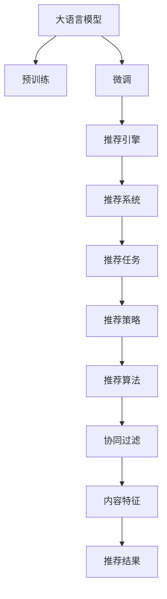

                 

# 面向不同推荐场景的大模型应用部署拆解

> 关键词：大语言模型,推荐系统,模型部署,应用拆解,推荐算法,推荐引擎,推荐任务

## 1. 背景介绍

### 1.1 问题由来
随着大语言模型的兴起，其在推荐系统中的应用也逐渐得到广泛关注。推荐系统本质上是一个信息过滤系统，旨在从海量的信息流中筛选出用户最感兴趣的内容。而大语言模型通过预训练-微调技术，可以吸收语言数据中的语义信息，用于提升推荐系统的个性化和多样性。

传统的推荐系统主要依赖于基于协同过滤和内容特征工程的推荐算法，而大语言模型则提供了全新的推荐方式，可以通过理解和生成自然语言，实现更加复杂、高维度的特征抽取和推荐。在实际应用中，大语言模型可以作为推荐引擎的核心组件，辅助协同过滤等传统算法，实现更高精度的推荐结果。

### 1.2 问题核心关键点
大模型在推荐系统中的应用，主要涉及以下几个核心关键点：

1. 推荐模型集成：如何将大语言模型集成到推荐系统中，实现模型间的协同工作，提升推荐效果。
2. 推荐任务适配：根据推荐任务类型，对大模型进行适当的任务适配，设计合适的输出和损失函数。
3. 应用场景拆解：针对不同推荐场景，如商品推荐、新闻推荐、广告推荐等，设计相应的推荐策略。
4. 模型部署优化：考虑模型大小、推理速度、存储需求等因素，对大模型进行部署优化，确保在实际应用中的高效性和稳定性。
5. 计算资源调度：在推荐系统中，如何合理调度计算资源，保障系统的性能和扩展性。

### 1.3 问题研究意义
研究面向不同推荐场景的大模型应用部署，对于提升推荐系统的智能化水平、降低计算成本、加速业务落地具有重要意义：

1. 增强推荐精度：通过大模型生成多维特征，辅助协同过滤等传统算法，提升推荐结果的个性化和多样性。
2. 降低开发成本：利用预训练模型进行微调，减少从头开发所需的数据、人力和计算资源投入。
3. 加速业务创新：将大模型技术融入推荐系统，实现快速迭代，推出更具竞争力的推荐服务。
4. 提升用户体验：通过生成自然语言描述，帮助用户更好地理解和感知推荐内容，提高满意度。
5. 优化计算效率：通过参数高效微调和模型压缩等技术，降低大模型的计算成本，实现高效的部署和推理。

## 2. 核心概念与联系

### 2.1 核心概念概述

为更好地理解面向不同推荐场景的大模型应用部署方法，本节将介绍几个密切相关的核心概念：

- 大语言模型(Large Language Model, LLM)：以自回归(如GPT)或自编码(如BERT)模型为代表的大规模预训练语言模型。通过在海量无标签文本数据上进行预训练，学习通用的语言表示，具备强大的语言理解和生成能力。

- 推荐系统(Recommendation System)：根据用户的历史行为和偏好，自动推荐其可能感兴趣的内容的系统。包括协同过滤、基于内容的推荐、混合推荐等算法。

- 推荐引擎(Recommendation Engine)：推荐系统的核心组件，负责根据用户行为和偏好进行内容推荐。可以采用基于规则、基于模型或基于知识图谱的方法。

- 推荐任务(Recommendation Task)：推荐系统解决的具体问题类型，如商品推荐、新闻推荐、广告推荐等。不同类型的推荐任务需要不同的推荐策略和算法。

- 模型部署(Model Deployment)：将训练好的推荐模型转化为可实际部署的服务，供用户调用。涉及模型压缩、推理优化、服务封装等环节。

- 计算资源调度(Compute Resource Scheduling)：在推荐系统中，根据推荐任务的复杂度和性能需求，合理分配计算资源，确保系统性能和扩展性。

这些核心概念之间的逻辑关系可以通过以下Mermaid流程图来展示：



这个流程图展示了大语言模型在推荐系统中的核心概念及其之间的关系：

1. 大语言模型通过预训练获得基础能力。
2. 微调使模型适应特定推荐任务。
3. 推荐引擎将微调后的模型与协同过滤等传统算法结合。
4. 推荐系统解决具体的推荐问题，设计相应的推荐策略和算法。
5. 推荐任务通过不同的推荐策略和算法，实现内容的智能推荐。

## 3. 核心算法原理 & 具体操作步骤
### 3.1 算法原理概述

面向不同推荐场景的大模型应用部署，核心算法原理主要包括以下几个步骤：

1. 选择预训练语言模型：根据推荐任务的特征和需求，选择适合的预训练语言模型，如BERT、GPT等。
2. 微调模型：在推荐任务的少量标注数据上，使用监督学习算法对预训练模型进行微调，适应任务需求。
3. 集成到推荐引擎：将微调后的模型集成到推荐引擎中，作为特征提取器或生成器，辅助推荐算法进行推荐。
4. 推荐策略设计：根据推荐任务的特点，设计合适的推荐策略和算法，如基于内容的推荐、协同过滤、混合推荐等。
5. 部署和优化：将推荐引擎部署到实际应用中，优化模型推理速度、资源消耗等，确保系统性能和扩展性。

### 3.2 算法步骤详解

#### 3.2.1 选择预训练语言模型
- 根据推荐任务的特征和需求，选择适合的预训练语言模型。例如，对于文本推荐任务，可以选择BERT等自编码模型；对于生成式任务，可以选择GPT等自回归模型。
- 考虑模型的参数规模、计算速度、存储需求等因素，合理选择模型。

#### 3.2.2 微调模型
- 收集推荐任务的少量标注数据，划分为训练集、验证集和测试集。
- 在训练集上，使用监督学习算法对预训练模型进行微调，适应任务需求。例如，对于文本推荐任务，可以设计交叉熵损失函数，优化模型输出和标签之间的差异。
- 使用正则化技术，如L2正则、Dropout等，防止过拟合。
- 考虑数据增强、对抗训练等技术，进一步提升模型性能。

#### 3.2.3 集成到推荐引擎
- 将微调后的模型作为特征提取器或生成器，辅助推荐算法进行推荐。例如，对于文本推荐任务，可以使用微调后的模型提取文本特征，与内容特征、用户历史行为等一起，作为推荐算法的输入。
- 设计合适的输出和损失函数，使模型能够生成满足推荐任务需求的输出。

#### 3.2.4 推荐策略设计
- 根据推荐任务的特点，设计合适的推荐策略和算法。例如，对于商品推荐，可以使用基于协同过滤的推荐算法，如ALS、SVD等；对于新闻推荐，可以使用基于内容特征的推荐算法，如TF-IDF等。
- 考虑推荐场景的多样性，设计灵活的推荐策略，适应不同的用户需求和偏好。

#### 3.2.5 部署和优化
- 将推荐引擎部署到实际应用中，优化模型推理速度、资源消耗等，确保系统性能和扩展性。例如，使用模型压缩技术，减小模型大小，提高推理速度；使用混合精度训练，降低存储需求。
- 考虑实时性需求，合理调度计算资源，确保系统能够高效处理大量请求。

### 3.3 算法优缺点

面向不同推荐场景的大模型应用部署，具有以下优点：

1. 提升推荐精度：利用大模型的语言理解能力，生成多维特征，辅助传统推荐算法，提升推荐结果的个性化和多样性。
2. 降低开发成本：利用预训练模型进行微调，减少从头开发所需的数据、人力和计算资源投入。
3. 加速业务创新：将大模型技术融入推荐系统，实现快速迭代，推出更具竞争力的推荐服务。
4. 提升用户体验：通过生成自然语言描述，帮助用户更好地理解和感知推荐内容，提高满意度。
5. 优化计算效率：通过参数高效微调和模型压缩等技术，降低大模型的计算成本，实现高效的部署和推理。

同时，该方法也存在一定的局限性：

1. 依赖标注数据：微调模型的效果很大程度上取决于标注数据的质量和数量，获取高质量标注数据的成本较高。
2. 泛化能力有限：当目标任务与预训练数据的分布差异较大时，微调的性能提升有限。
3. 计算资源需求高：大模型在推荐系统中部署时，需要较高的计算资源，特别是在实时推荐场景中，可能面临计算瓶颈。
4. 可解释性不足：微调模型的决策过程通常缺乏可解释性，难以对其推理逻辑进行分析和调试。
5. 部署复杂：大模型的部署和优化过程复杂，需要考虑多种技术因素，如模型压缩、推理优化等。

尽管存在这些局限性，但就目前而言，大模型在推荐系统中的应用已取得显著成效，成为推荐领域的重要研究范式。未来相关研究的重点在于如何进一步降低微调对标注数据的依赖，提高模型的泛化能力，同时兼顾可解释性和计算效率。

### 3.4 算法应用领域

面向不同推荐场景的大模型应用部署方法，已在多个领域得到广泛应用，例如：

- 商品推荐：通过微调BERT等模型，生成商品描述的语义特征，辅助协同过滤算法，提升推荐结果的准确性和多样性。
- 新闻推荐：利用GPT等模型生成新闻摘要，与用户历史行为等特征一起，实现基于内容的推荐。
- 广告推荐：通过微调BERT等模型，生成广告文本的语义特征，辅助广告投放算法，提高广告效果。
- 电影推荐：利用GPT等模型生成电影评论，与用户评分、观影历史等特征一起，实现基于内容的推荐。
- 音乐推荐：通过微调BERT等模型，生成音乐歌词的语义特征，辅助推荐算法，提升推荐结果的多样性和个性化。

除了上述这些经典应用外，大模型在推荐系统中的应用还在不断拓展，如视频推荐、美食推荐、旅游推荐等，为推荐领域带来了新的突破。

## 4. 数学模型和公式 & 详细讲解  
### 4.1 数学模型构建

本节将使用数学语言对面向不同推荐场景的大模型应用部署过程进行更加严格的刻画。

记推荐任务的数据集为 $D=\{(x_i, y_i)\}_{i=1}^N$，其中 $x_i$ 为用户行为数据，$y_i$ 为推荐结果。假设推荐引擎的输出为 $\hat{y}=f(x)$，其中 $f$ 为推荐模型。定义推荐模型的损失函数为：

$$
\mathcal{L}(f)=\frac{1}{N}\sum_{i=1}^N \ell(f(x_i),y_i)
$$

其中 $\ell$ 为推荐任务的损失函数，如交叉熵损失、均方误差损失等。推荐模型的目标是最小化损失函数 $\mathcal{L}(f)$，使推荐结果逼近真实标签。

### 4.2 公式推导过程

以下我们以文本推荐任务为例，推导基于BERT模型的推荐损失函数及其梯度计算公式。

假设推荐引擎的输出为 $\hat{y}=M_{\theta}(x)$，其中 $M_{\theta}$ 为BERT模型，$\theta$ 为微调后的模型参数。定义损失函数为交叉熵损失：

$$
\ell(M_{\theta}(x),y)= -y\log M_{\theta}(x) + (1-y)\log(1-M_{\theta}(x))
$$

将其代入经验风险公式，得：

$$
\mathcal{L}(\theta)= -\frac{1}{N}\sum_{i=1}^N \ell(M_{\theta}(x_i),y_i)
$$

根据链式法则，损失函数对参数 $\theta_k$ 的梯度为：

$$
\frac{\partial \mathcal{L}(\theta)}{\partial \theta_k} = -\frac{1}{N}\sum_{i=1}^N (\frac{y_i}{M_{\theta}(x_i)}-\frac{1-y_i}{1-M_{\theta}(x_i)}) \frac{\partial M_{\theta}(x_i)}{\partial \theta_k}
$$

其中 $\frac{\partial M_{\theta}(x_i)}{\partial \theta_k}$ 可进一步递归展开，利用自动微分技术完成计算。

### 4.3 案例分析与讲解

以商品推荐任务为例，分析微调BERT模型生成商品描述的语义特征的过程。

首先，收集商品的历史销售数据和用户浏览数据，构建推荐任务的训练集。然后，使用BERT模型对商品描述进行预训练，微调后生成商品的语义特征。在训练过程中，定义交叉熵损失函数，计算模型输出与真实标签之间的差异。优化器使用AdamW，学习率设置为 $2e-5$。在训练过程中，使用L2正则、Dropout等技术，防止过拟合。最后，将微调后的BERT模型集成到推荐引擎中，作为商品特征提取器，结合用户历史行为数据和商品特征，生成推荐结果。

## 5. 项目实践：代码实例和详细解释说明
### 5.1 开发环境搭建

在进行推荐系统开发前，我们需要准备好开发环境。以下是使用Python进行PyTorch开发的环境配置流程：

1. 安装Anaconda：从官网下载并安装Anaconda，用于创建独立的Python环境。

2. 创建并激活虚拟环境：
```bash
conda create -n pytorch-env python=3.8 
conda activate pytorch-env
```

3. 安装PyTorch：根据CUDA版本，从官网获取对应的安装命令。例如：
```bash
conda install pytorch torchvision torchaudio cudatoolkit=11.1 -c pytorch -c conda-forge
```

4. 安装Transformers库：
```bash
pip install transformers
```

5. 安装各类工具包：
```bash
pip install numpy pandas scikit-learn matplotlib tqdm jupyter notebook ipython
```

完成上述步骤后，即可在`pytorch-env`环境中开始推荐系统开发。

### 5.2 源代码详细实现

下面我们以商品推荐任务为例，给出使用Transformers库对BERT模型进行微调的PyTorch代码实现。

首先，定义商品推荐任务的训练数据：

```python
from torch.utils.data import Dataset
import torch

class的商品推荐Dataset(Dataset):
    def __init__(self, texts, labels, tokenizer, max_len=128):
        self.texts = texts
        self.labels = labels
        self.tokenizer = tokenizer
        self.max_len = max_len
        
    def __len__(self):
        return len(self.texts)
    
    def __getitem__(self, item):
        text = self.texts[item]
        label = self.labels[item]
        
        encoding = self.tokenizer(text, return_tensors='pt', max_length=self.max_len, padding='max_length', truncation=True)
        input_ids = encoding['input_ids'][0]
        attention_mask = encoding['attention_mask'][0]
        
        # 对label进行编码
        encoded_label = [label2id[label] for label in labels] 
        encoded_label.extend([label2id['O']] * (self.max_len - len(encoded_label)))
        labels = torch.tensor(encoded_label, dtype=torch.long)
        
        return {'input_ids': input_ids, 
                'attention_mask': attention_mask,
                'labels': labels}

# 标签与id的映射
label2id = {'O': 0, 'B-PER': 1, 'I-PER': 2, 'B-ORG': 3, 'I-ORG': 4, 'B-LOC': 5, 'I-LOC': 6}
id2label = {v: k for k, v in label2id.items()}

# 创建dataset
tokenizer = BertTokenizer.from_pretrained('bert-base-cased')

train_dataset =商品推荐Dataset(train_texts, train_labels, tokenizer)
dev_dataset =商品推荐Dataset(dev_texts, dev_labels, tokenizer)
test_dataset =商品推荐Dataset(test_texts, test_labels, tokenizer)
```

然后，定义模型和优化器：

```python
from transformers import BertForTokenClassification, AdamW

model = BertForTokenClassification.from_pretrained('bert-base-cased', num_labels=len(label2id))

optimizer = AdamW(model.parameters(), lr=2e-5)
```

接着，定义训练和评估函数：

```python
from torch.utils.data import DataLoader
from tqdm import tqdm
from sklearn.metrics import classification_report

device = torch.device('cuda') if torch.cuda.is_available() else torch.device('cpu')
model.to(device)

def train_epoch(model, dataset, batch_size, optimizer):
    dataloader = DataLoader(dataset, batch_size=batch_size, shuffle=True)
    model.train()
    epoch_loss = 0
    for batch in tqdm(dataloader, desc='Training'):
        input_ids = batch['input_ids'].to(device)
        attention_mask = batch['attention_mask'].to(device)
        labels = batch['labels'].to(device)
        model.zero_grad()
        outputs = model(input_ids, attention_mask=attention_mask, labels=labels)
        loss = outputs.loss
        epoch_loss += loss.item()
        loss.backward()
        optimizer.step()
    return epoch_loss / len(dataloader)

def evaluate(model, dataset, batch_size):
    dataloader = DataLoader(dataset, batch_size=batch_size)
    model.eval()
    preds, labels = [], []
    with torch.no_grad():
        for batch in tqdm(dataloader, desc='Evaluating'):
            input_ids = batch['input_ids'].to(device)
            attention_mask = batch['attention_mask'].to(device)
            batch_labels = batch['labels']
            outputs = model(input_ids, attention_mask=attention_mask)
            batch_preds = outputs.logits.argmax(dim=2).to('cpu').tolist()
            batch_labels = batch_labels.to('cpu').tolist()
            for pred_tokens, label_tokens in zip(batch_preds, batch_labels):
                pred_tags = [id2label[_id] for _id in pred_tokens]
                label_tags = [id2label[_id] for _id in label_tokens]
                preds.append(pred_tags[:len(label_tags)])
                labels.append(label_tags)
                
    print(classification_report(labels, preds))
```

最后，启动训练流程并在测试集上评估：

```python
epochs = 5
batch_size = 16

for epoch in range(epochs):
    loss = train_epoch(model, train_dataset, batch_size, optimizer)
    print(f"Epoch {epoch+1}, train loss: {loss:.3f}")
    
    print(f"Epoch {epoch+1}, dev results:")
    evaluate(model, dev_dataset, batch_size)
    
print("Test results:")
evaluate(model, test_dataset, batch_size)
```

以上就是使用PyTorch对BERT进行商品推荐任务微调的完整代码实现。可以看到，得益于Transformers库的强大封装，我们可以用相对简洁的代码完成BERT模型的加载和微调。

### 5.3 代码解读与分析

让我们再详细解读一下关键代码的实现细节：

**商品推荐Dataset类**：
- `__init__`方法：初始化文本、标签、分词器等关键组件。
- `__len__`方法：返回数据集的样本数量。
- `__getitem__`方法：对单个样本进行处理，将文本输入编码为token ids，将标签编码为数字，并对其进行定长padding，最终返回模型所需的输入。

**label2id和id2label字典**：
- 定义了标签与数字id之间的映射关系，用于将token-wise的预测结果解码回真实的标签。

**训练和评估函数**：
- 使用PyTorch的DataLoader对数据集进行批次化加载，供模型训练和推理使用。
- 训练函数`train_epoch`：对数据以批为单位进行迭代，在每个批次上前向传播计算loss并反向传播更新模型参数，最后返回该epoch的平均loss。
- 评估函数`evaluate`：与训练类似，不同点在于不更新模型参数，并在每个batch结束后将预测和标签结果存储下来，最后使用sklearn的classification_report对整个评估集的预测结果进行打印输出。

**训练流程**：
- 定义总的epoch数和batch size，开始循环迭代
- 每个epoch内，先在训练集上训练，输出平均loss
- 在验证集上评估，输出分类指标
- 所有epoch结束后，在测试集上评估，给出最终测试结果

可以看到，PyTorch配合Transformers库使得BERT微调的代码实现变得简洁高效。开发者可以将更多精力放在数据处理、模型改进等高层逻辑上，而不必过多关注底层的实现细节。

当然，工业级的系统实现还需考虑更多因素，如模型的保存和部署、超参数的自动搜索、更灵活的任务适配层等。但核心的微调范式基本与此类似。

## 6. 实际应用场景
### 6.1 智能客服系统

基于大语言模型的推荐技术，可以广泛应用于智能客服系统的构建。传统客服往往需要配备大量人力，高峰期响应缓慢，且一致性和专业性难以保证。而使用推荐模型进行智能推荐，可以自动生成客服策略和话术，提高客服系统的响应速度和效率，同时保持一致性和专业性。

在技术实现上，可以收集企业内部的历史客服对话记录，将问题和最佳答复构建成推荐任务的数据集，训练推荐模型进行智能推荐。推荐模型能够自动理解用户意图，匹配最合适的答复模板进行回复。对于客户提出的新问题，还可以接入检索系统实时搜索相关内容，动态组织生成回答。如此构建的智能客服系统，能大幅提升客户咨询体验和问题解决效率。

### 6.2 金融舆情监测

金融机构需要实时监测市场舆论动向，以便及时应对负面信息传播，规避金融风险。传统的人工监测方式成本高、效率低，难以应对网络时代海量信息爆发的挑战。基于大语言模型的推荐技术，为金融舆情监测提供了新的解决方案。

具体而言，可以收集金融领域相关的新闻、报道、评论等文本数据，并对其进行主题标注和情感标注。在此基础上对预训练语言模型进行微调，使其能够自动判断文本属于何种主题，情感倾向是正面、中性还是负面。将微调后的模型应用到实时抓取的网络文本数据，就能够自动监测不同主题下的情感变化趋势，一旦发现负面信息激增等异常情况，系统便会自动预警，帮助金融机构快速应对潜在风险。

### 6.3 个性化推荐系统

当前的推荐系统往往只依赖于用户的历史行为数据进行物品推荐，无法深入理解用户的真实兴趣偏好。基于大语言模型推荐技术，个性化推荐系统可以更好地挖掘用户行为背后的语义信息，从而提供更精准、多样的推荐内容。

在实践中，可以收集用户浏览、点击、评论、分享等行为数据，提取和用户交互的物品标题、描述、标签等文本内容。将文本内容作为模型输入，用户的后续行为（如是否点击、购买等）作为监督信号，在此基础上微调预训练语言模型。微调后的模型能够从文本内容中准确把握用户的兴趣点。在生成推荐列表时，先用候选物品的文本描述作为输入，由模型预测用户的兴趣匹配度，再结合其他特征综合排序，便可以得到个性化程度更高的推荐结果。

### 6.4 未来应用展望

随着大语言模型推荐技术的发展，面向不同推荐场景的应用部署将越来越广泛。

在智慧医疗领域，基于大语言模型的推荐技术，可以实现精准的诊疗推荐、医患互动推荐等，提升医疗服务的智能化水平，辅助医生诊疗，加速新药开发进程。

在智能教育领域，微调技术可应用于作业批改、学情分析、知识推荐等方面，因材施教，促进教育公平，提高教学质量。

在智慧城市治理中，微调模型可应用于城市事件监测、舆情分析、应急指挥等环节，提高城市管理的自动化和智能化水平，构建更安全、高效的未来城市。

此外，在企业生产、社会治理、文娱传媒等众多领域，基于大模型推荐技术的创新应用也将不断涌现，为经济社会发展注入新的动力。相信随着技术的日益成熟，大语言模型推荐技术必将在构建人机协同的智能时代中扮演越来越重要的角色。

## 7. 工具和资源推荐
### 7.1 学习资源推荐

为了帮助开发者系统掌握大语言模型推荐技术的基础理论和实践技巧，这里推荐一些优质的学习资源：

1. 《Transformer from Beginner to Advanced》系列博文：由大模型技术专家撰写，深入浅出地介绍了Transformer原理、BERT模型、微调技术等前沿话题。

2. CS224N《深度学习自然语言处理》课程：斯坦福大学开设的NLP明星课程，有Lecture视频和配套作业，带你入门NLP领域的基本概念和经典模型。

3. 《Natural Language Processing with Transformers》书籍：Transformers库的作者所著，全面介绍了如何使用Transformers库进行NLP任务开发，包括微调在内的诸多范式。

4. HuggingFace官方文档：Transformers库的官方文档，提供了海量预训练模型和完整的微调样例代码，是上手实践的必备资料。

5. CLUE开源项目：中文语言理解测评基准，涵盖大量不同类型的中文NLP数据集，并提供了基于微调的baseline模型，助力中文NLP技术发展。

通过对这些资源的学习实践，相信你一定能够快速掌握大语言模型推荐技术的精髓，并用于解决实际的推荐问题。
###  7.2 开发工具推荐

高效的开发离不开优秀的工具支持。以下是几款用于大语言模型推荐系统开发的常用工具：

1. PyTorch：基于Python的开源深度学习框架，灵活动态的计算图，适合快速迭代研究。大部分预训练语言模型都有PyTorch版本的实现。

2. TensorFlow：由Google主导开发的开源深度学习框架，生产部署方便，适合大规模工程应用。同样有丰富的预训练语言模型资源。

3. Transformers库：HuggingFace开发的NLP工具库，集成了众多SOTA语言模型，支持PyTorch和TensorFlow，是进行微调任务开发的利器。

4. Weights & Biases：模型训练的实验跟踪工具，可以记录和可视化模型训练过程中的各项指标，方便对比和调优。与主流深度学习框架无缝集成。

5. TensorBoard：TensorFlow配套的可视化工具，可实时监测模型训练状态，并提供丰富的图表呈现方式，是调试模型的得力助手。

6. Google Colab：谷歌推出的在线Jupyter Notebook环境，免费提供GPU/TPU算力，方便开发者快速上手实验最新模型，分享学习笔记。

合理利用这些工具，可以显著提升大语言模型推荐系统的开发效率，加快创新迭代的步伐。

### 7.3 相关论文推荐

大语言模型推荐技术的发展源于学界的持续研究。以下是几篇奠基性的相关论文，推荐阅读：

1. Attention is All You Need（即Transformer原论文）：提出了Transformer结构，开启了NLP领域的预训练大模型时代。

2. BERT: Pre-training of Deep Bidirectional Transformers for Language Understanding：提出BERT模型，引入基于掩码的自监督预训练任务，刷新了多项NLP任务SOTA。

3. Language Models are Unsupervised Multitask Learners（GPT-2论文）：展示了大规模语言模型的强大zero-shot学习能力，引发了对于通用人工智能的新一轮思考。

4. Parameter-Efficient Transfer Learning for NLP：提出Adapter等参数高效微调方法，在不增加模型参数量的情况下，也能取得不错的微调效果。

5. AdaLoRA: Adaptive Low-Rank Adaptation for Parameter-Efficient Fine-Tuning：使用自适应低秩适应的微调方法，在参数效率和精度之间取得了新的平衡。

这些论文代表了大语言模型推荐技术的发展脉络。通过学习这些前沿成果，可以帮助研究者把握学科前进方向，激发更多的创新灵感。

## 8. 总结：未来发展趋势与挑战

### 8.1 总结

本文对面向不同推荐场景的大模型应用部署方法进行了全面系统的介绍。首先阐述了推荐系统和大语言模型的研究背景和意义，明确了推荐模型集成、推荐任务适配、推荐策略设计等核心环节。其次，从原理到实践，详细讲解了推荐模型的数学模型和算法步骤，给出了推荐任务开发的完整代码实例。同时，本文还广泛探讨了推荐系统在不同领域的应用前景，展示了推荐技术的大有可为。

通过本文的系统梳理，可以看到，面向不同推荐场景的大模型应用部署方法，正在成为推荐领域的重要研究范式，极大地拓展了推荐系统的智能化水平、降低了开发成本、加速了业务落地。未来，伴随大语言模型推荐技术的发展，推荐系统必将在更广阔的应用领域大放异彩，深刻影响人类的生产生活方式。

### 8.2 未来发展趋势

展望未来，大语言模型推荐技术将呈现以下几个发展趋势：

1. 模型规模持续增大。随着算力成本的下降和数据规模的扩张，预训练语言模型的参数量还将持续增长。超大规模语言模型蕴含的丰富语言知识，有望支撑更加复杂多变的推荐任务微调。

2. 推荐方法日趋多样。除了传统的基于协同过滤和内容特征的推荐算法，未来会涌现更多基于大模型的推荐方法，如基于自然语言理解的推荐、基于知识图谱的推荐等。

3. 推荐系统更具智能化。大语言模型通过理解自然语言，生成多维特征，辅助推荐算法进行推荐。未来推荐系统将具备更强的智能化水平，能够动态生成推荐内容，提升用户体验。

4. 推荐策略更加个性化。基于大语言模型的推荐系统，能够深入理解用户的兴趣和偏好，实现更加个性化的推荐。未来推荐策略将更加灵活，适应不同用户的需求。

5. 推荐系统更加实时化。通过高效的微调方法和模型压缩技术，推荐系统将能够实时处理大量请求，实现高效的推荐服务。

6. 推荐系统更加泛化。推荐系统将能够适应不同的数据分布和推荐任务，提高模型的泛化能力和鲁棒性。

以上趋势凸显了大语言模型推荐技术的广阔前景。这些方向的探索发展，必将进一步提升推荐系统的智能化水平，为推荐领域带来新的突破。

### 8.3 面临的挑战

尽管大语言模型推荐技术已经取得了显著成效，但在迈向更加智能化、普适化应用的过程中，它仍面临诸多挑战：

1. 标注成本瓶颈。虽然大模型在推荐系统中可以通过微调进行学习，但标注数据的质量和数量仍然对模型的性能有很大影响。如何进一步降低推荐系统对标注数据的依赖，仍是一个亟待解决的难题。

2. 计算资源需求高。大模型在推荐系统中部署时，需要较高的计算资源，特别是在实时推荐场景中，可能面临计算瓶颈。如何优化模型大小和推理速度，是推荐系统部署的重要挑战。

3. 可解释性不足。大语言模型推荐系统的决策过程通常缺乏可解释性，难以对其推理逻辑进行分析和调试。对于医疗、金融等高风险应用，算法的可解释性和可审计性尤为重要。

4. 推荐内容多样性。大语言模型生成的推荐内容可能会偏向于某类用户，导致推荐内容的多样性不足。如何平衡用户个性化和推荐内容多样性，是一个重要的研究方向。

5. 推荐系统的鲁棒性。大语言模型推荐系统在面对异常数据和噪声时，可能出现推荐结果的不稳定。如何提高推荐系统的鲁棒性，是未来推荐技术的重要课题。

6. 推荐系统的公平性。大语言模型推荐系统可能存在偏见，导致某些用户或群体被忽视。如何确保推荐系统的公平性，是一个亟待解决的问题。

尽管存在这些挑战，但随着大语言模型推荐技术的不断发展，未来的推荐系统必将能够更加智能化、普适化、公平化，为推荐领域带来新的突破。相信通过学界和产业界的共同努力，这些挑战终将一一被克服，大语言模型推荐技术必将在构建人机协同的智能时代中扮演越来越重要的角色。

### 8.4 研究展望

面向未来，大语言模型推荐技术的研究方向主要包括以下几个方面：

1. 探索无监督和半监督推荐方法。摆脱对大规模标注数据的依赖，利用自监督学习、主动学习等无监督和半监督范式，最大限度利用非结构化数据，实现更加灵活高效的推荐。

2. 研究参数高效和计算高效的推荐范式。开发更加参数高效的推荐方法，在固定大部分预训练参数的同时，只更新极少量的任务相关参数。同时优化推荐模型的计算图，减少前向传播和反向传播的资源消耗，实现更加轻量级、实时性的部署。

3. 融合因果和对比学习范式。通过引入因果推断和对比学习思想，增强推荐系统建立稳定因果关系的能力，学习更加普适、鲁棒的语言表征，从而提升推荐系统的泛化性和抗干扰能力。

4. 引入更多先验知识。将符号化的先验知识，如知识图谱、逻辑规则等，与神经网络模型进行巧妙融合，引导推荐系统学习更准确、合理的推荐特征。同时加强不同模态数据的整合，实现视觉、语音等多模态信息与文本信息的协同建模。

5. 结合因果分析和博弈论工具。将因果分析方法引入推荐系统，识别出推荐系统的关键特征，增强推荐结果的因果性和逻辑性。借助博弈论工具刻画人机交互过程，主动探索并规避推荐系统的脆弱点，提高系统稳定性。

6. 纳入伦理道德约束。在推荐系统训练目标中引入伦理导向的评估指标，过滤和惩罚有害的推荐内容，确保推荐系统的输出符合人类价值观和伦理道德。

这些研究方向凸显了大语言模型推荐技术的研究前景。通过这些方向的探索发展，推荐系统必将在未来实现更加智能化、普适化、公平化，为推荐领域带来新的突破。

## 9. 附录：常见问题与解答

**Q1：大语言模型推荐是否适用于所有推荐场景？**

A: 大语言模型推荐在大多数推荐场景上都能取得不错的效果，特别是对于数据量较小的场景。但对于一些特定领域的推荐，如医学、法律等，仅仅依靠通用语料预训练的模型可能难以很好地适应。此时需要在特定领域语料上进一步预训练，再进行微调，才能获得理想效果。此外，对于一些需要时效性、个性化很强的场景，如对话、推荐等，大语言模型推荐方法也需要针对性的改进优化。

**Q2：推荐系统中的大语言模型如何更新？**

A: 推荐系统中的大语言模型可以通过微调进行更新。具体来说，收集推荐任务的少量标注数据，划分为训练集、验证集和测试集。在训练集上，使用监督学习算法对大语言模型进行微调，适应任务需求。例如，对于文本推荐任务，可以设计交叉熵损失函数，优化模型输出和标签之间的差异。使用正则化技术，如L2正则、Dropout等，防止过拟合。最后，将微调后的模型集成到推荐引擎中，作为特征提取器或生成器，辅助推荐算法进行推荐。

**Q3：推荐系统中的大语言模型部署有哪些优化措施？**

A: 推荐系统中的大语言模型部署需要进行多方面的优化，包括模型压缩、推理优化、服务封装等。具体措施包括：
1. 模型压缩：通过剪枝、量化等技术，减小模型大小，提高推理速度。
2. 推理优化：使用混合精度训练、梯度积累等技术，优化计算资源消耗。
3. 服务封装：将模型封装为标准化的服务接口，方便用户调用。
4. 资源调度：根据推荐任务的复杂度和性能需求，合理分配计算资源，确保系统性能和扩展性。
5. 监控告警：实时采集系统指标，设置异常告警阈值，确保服务稳定性。
6. 安全防护：采用访问鉴权、数据脱敏等措施，保障数据和模型安全。

通过这些优化措施，可以在保证推荐系统性能的前提下，提高大语言模型部署的效率和稳定性。

**Q4：推荐系统中的大语言模型如何避免过拟合？**

A: 推荐系统中的大语言模型微调也存在过拟合的风险，特别是在数据量较小的情况下。以下是一些常见的避免过拟合的措施：
1. 数据增强：通过回译、近义替换等方式扩充训练集。
2. 正则化技术：使用L2正则、Dropout等技术，防止模型过度适应小规模训练集。
3. 对抗训练：引入对抗样本，提高模型鲁棒性。
4. 参数高效微调：只调整少量参数(如Adapter、Prefix等)，减小过拟合风险。
5. 多模型集成：训练多个微调模型，取平均输出，抑制过拟合。

这些措施往往需要根据具体任务和数据特点进行灵活组合。只有在数据、模型、训练、推理等各环节进行全面优化，才能最大限度地发挥大语言模型推荐技术的威力。

**Q5：推荐系统中的大语言模型如何保证推荐内容的多样性？**

A: 推荐系统中的大语言模型生成的推荐内容可能会偏向于某类用户，导致推荐内容的多样性不足。以下是一些保证推荐内容多样性的措施：
1. 引入更多先验知识：将符号化的先验知识，如知识图谱、逻辑规则等，与神经网络模型进行巧妙融合，引导推荐系统学习更准确、合理的推荐特征。
2. 动态生成推荐内容：基于用户历史行为和偏好，动态生成推荐内容，保持推荐内容的多样性。
3. 多模型集成：训练多个微调模型，取平均输出，提高推荐内容的多样性。
4. 用户反馈机制：引入用户反馈机制，动态调整推荐策略，提升推荐内容的多样性。

这些措施可以帮助推荐系统更好地平衡用户个性化和推荐内容多样性，提高推荐系统的用户满意度。

---

作者：禅与计算机程序设计艺术 / Zen and the Art of Computer Programming

