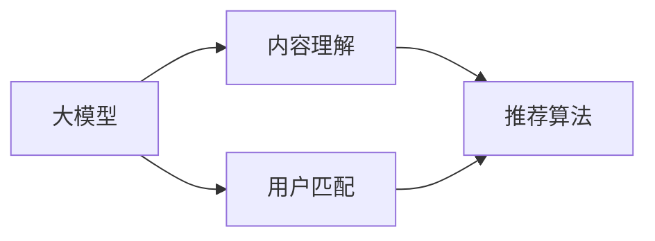

                 

# 音视频内容推荐的挑战：大模型在理解与匹配方面的应用

> 关键词：音视频推荐系统, 大模型, 内容理解, 用户匹配, 推荐算法, 跨模态学习

## 1. 背景介绍

随着互联网和数字媒体的快速发展，音视频内容推荐系统在各行各业中扮演着越来越重要的角色。从在线视频网站到音乐流媒体平台，从智能电视到家庭娱乐系统，音视频推荐系统通过精准推荐用户感兴趣的内容，极大地提升了用户体验和平台粘性。然而，构建一个高效、个性化且泛化的音视频推荐系统，面临许多挑战。

- **用户需求多样性**：不同用户有不同的兴趣和偏好，如何准确捕捉用户的独特需求，是一个重要难题。
- **内容多样性**：音视频内容的海量增长和多样性，给内容推荐带来了巨大挑战。
- **跨模态融合**：视频、音频、图像等多模态数据需要协同建模，以提升推荐效果。
- **实时性要求**：随着用户消费习惯的实时变化，推荐系统需要动态调整推荐内容，满足用户的即时需求。
- **隐私保护**：如何在不泄露用户隐私的前提下，实现精准推荐，是音视频推荐系统的重要课题。

针对上述挑战，近年来，大模型技术被引入音视频推荐系统，助力其在内容理解和用户匹配方面取得显著突破。本文将详细介绍大模型在音视频内容推荐系统中的应用，探索其在理解与匹配方面的潜力与挑战。

## 2. 核心概念与联系

### 2.1 核心概念概述

在音视频推荐系统中，大模型技术主要涉及以下几个核心概念：

- **大模型（Large Model）**：以Transformer为基础，通过大规模数据预训练得到的强大模型。通常包括BERT、GPT、ViT等架构。
- **内容理解（Content Understanding）**：指大模型对音视频内容进行语义、情感、风格等维度的理解，能够提取视频帧、音频片段中的关键特征。
- **用户匹配（User Matching）**：通过分析用户的历史行为、兴趣偏好、社交网络等数据，将用户与适合的音视频内容进行精准匹配。
- **推荐算法（Recommendation Algorithm）**：结合内容理解与用户匹配的结果，设计算法生成推荐结果。

### 2.2 核心概念原理和架构的 Mermaid 流程图



在这个流程图中，大模型是系统的核心，其通过自监督学习（如自回归、自编码等）获得了丰富的语义知识。内容理解模块负责提取视频、音频等内容的语义特征，用户匹配模块则根据用户的历史行为和偏好，形成对用户的深度画像。最终，推荐算法将内容与用户进行匹配，生成推荐结果。

## 3. 核心算法原理 & 具体操作步骤

### 3.1 算法原理概述

音视频内容推荐系统的大模型应用，主要依赖于以下三个步骤：

1. **内容理解**：通过大模型提取音视频内容的关键语义特征，包括情感、风格、主题等信息。
2. **用户匹配**：利用大模型分析用户的兴趣和行为，形成用户画像，便于与音视频内容进行匹配。
3. **推荐生成**：结合内容理解和用户匹配的结果，生成个性化推荐。

### 3.2 算法步骤详解

#### 3.2.1 内容理解

内容理解是音视频推荐系统的基础。大模型通常以帧为单位，对视频内容进行编码和解码，提取关键帧特征。对于音频内容，则可以通过音谱分析等方法，提取时间序列的特征。

1. **视频内容理解**：
   - 使用大模型对视频帧进行编码，提取语义特征。
   - 结合帧间的序列关系，构建视频的时间结构特征。
   - 通过自回归模型，预测视频的下帧内容，生成时间依赖的特征。

2. **音频内容理解**：
   - 使用大模型对音频片段进行编码，提取时间序列的语义特征。
   - 结合音频的时域和频域特征，进行多维度的特征提取。
   - 通过音频嵌入和文本嵌入等方法，构建跨模态的特征向量。

#### 3.2.2 用户匹配

用户匹配是音视频推荐系统的关键。通过大模型分析用户的行为和兴趣，形成对用户的深度画像。

1. **用户行为分析**：
   - 收集用户的历史行为数据，包括观看记录、评分记录、互动数据等。
   - 使用大模型对行为数据进行编码，提取行为模式和偏好特征。

2. **用户画像构建**：
   - 结合用户的实时行为数据，动态更新用户画像。
   - 使用大模型对用户画像进行聚类和表示，形成对用户的深度理解。

#### 3.2.3 推荐生成

推荐生成是将内容理解与用户匹配的结果，转化为推荐结果的过程。

1. **相似度计算**：
   - 利用大模型计算内容之间的相似度，生成内容库的嵌入矩阵。
   - 利用大模型计算用户画像与内容库的相似度，生成用户画像的嵌入向量。

2. **推荐排序**：
   - 使用大模型对相似度矩阵进行排序，选择与用户画像最相似的内容。
   - 结合用户的历史行为数据和偏好，进行推荐排序和权重调整。

3. **动态更新**：
   - 根据用户的实时行为和兴趣变化，动态更新推荐结果。
   - 使用大模型重新计算相似度和排序，及时调整推荐内容。

### 3.3 算法优缺点

#### 3.3.1 优点

1. **跨模态融合能力强**：大模型能够同时处理视频、音频和文本等多模态数据，提高推荐的丰富性和多样性。
2. **语义理解深入**：通过预训练和微调，大模型能够深入理解音视频内容的语义和情感，提升推荐的精度。
3. **个性化推荐精准**：结合用户画像和内容嵌入，大模型能够生成高度个性化的推荐结果。
4. **动态调整灵活**：大模型能够实时处理用户行为数据，动态调整推荐内容，满足用户即时需求。

#### 3.3.2 缺点

1. **计算资源需求高**：大模型通常需要较大的计算资源进行训练和推理，硬件成本较高。
2. **模型复杂度大**：大模型的结构复杂，增加了系统的开发和维护难度。
3. **数据依赖性强**：大模型的训练需要大量的标注数据，且对数据质量要求高。
4. **解释性差**：大模型的决策过程复杂，难以解释推荐结果的生成逻辑。

### 3.4 算法应用领域

大模型技术在音视频内容推荐系统中的应用，主要集中在以下领域：

- **视频推荐**：通过分析视频内容，提取语义、风格、主题等信息，进行精准的视频推荐。
- **音乐推荐**：利用大模型分析音乐节奏、情感、风格等特征，生成个性化音乐推荐。
- **游戏推荐**：结合游戏视频的图像和音频特征，分析游戏内容，生成游戏推荐。
- **广告推荐**：通过分析广告内容的视频和音频特征，结合用户兴趣，进行精准广告推荐。
- **在线教育推荐**：利用大模型分析教育视频的语义和风格，推荐适合的学习资源。

## 4. 数学模型和公式 & 详细讲解 & 举例说明

### 4.1 数学模型构建

在音视频推荐系统中，大模型的数学模型主要包括以下几个部分：

1. **视频内容嵌入模型**：
   - 假设视频内容为 $X$，包含 $d$ 个帧，每帧特征维度为 $D$。
   - 使用大模型 $M_{\theta}$ 对视频帧进行编码，生成嵌入向量 $E \in \mathbb{R}^{d\times D}$。
   - 视频嵌入矩阵 $V \in \mathbb{R}^{N\times D}$，其中 $N$ 为视频库中视频数量。

2. **音频内容嵌入模型**：
   - 假设音频内容为 $A$，包含 $T$ 个时间步，每步特征维度为 $D$。
   - 使用大模型 $M_{\theta}$ 对音频片段进行编码，生成嵌入向量 $E \in \mathbb{R}^{T\times D}$。
   - 音频嵌入矩阵 $A \in \mathbb{R}^{M\times D}$，其中 $M$ 为音频库中音频数量。

3. **用户行为嵌入模型**：
   - 假设用户行为数据为 $U$，包含 $k$ 个行为记录，每个记录的特征维度为 $D$。
   - 使用大模型 $M_{\theta}$ 对行为数据进行编码，生成嵌入向量 $E \in \mathbb{R}^{k\times D}$。
   - 用户行为嵌入矩阵 $U \in \mathbb{R}^{K\times D}$，其中 $K$ 为用户库中用户数量。

4. **推荐生成模型**：
   - 假设用户兴趣向量为 $V \in \mathbb{R}^{N\times 1}$，与视频嵌入矩阵 $V$ 进行相似度计算。
   - 假设用户兴趣向量为 $A \in \mathbb{R}^{M\times 1}$，与音频嵌入矩阵 $A$ 进行相似度计算。
   - 使用大模型计算用户兴趣向量 $U$ 与内容嵌入矩阵 $V$、$A$ 的相似度，生成推荐结果。

### 4.2 公式推导过程

#### 4.2.1 视频内容嵌入

假设大模型 $M_{\theta}$ 对视频帧进行编码，生成嵌入向量 $E_i$。则视频嵌入矩阵 $V$ 可以表示为：

$$
V = M_{\theta}(X)
$$

其中 $X \in \mathbb{R}^{d \times D}$ 为视频帧的输入矩阵，$E \in \mathbb{R}^{d\times D}$ 为视频帧的嵌入矩阵。

#### 4.2.2 音频内容嵌入

假设大模型 $M_{\theta}$ 对音频片段进行编码，生成嵌入向量 $E_t$。则音频嵌入矩阵 $A$ 可以表示为：

$$
A = M_{\theta}(A)
$$

其中 $A \in \mathbb{R}^{T\times D}$ 为音频片段的输入矩阵，$E \in \mathbb{R}^{T\times D}$ 为音频片段的嵌入矩阵。

#### 4.2.3 用户行为嵌入

假设大模型 $M_{\theta}$ 对用户行为数据进行编码，生成嵌入向量 $E_k$。则用户行为嵌入矩阵 $U$ 可以表示为：

$$
U = M_{\theta}(U)
$$

其中 $U \in \mathbb{R}^{k\times D}$ 为用户行为的输入矩阵，$E \in \mathbb{R}^{k\times D}$ 为用户行为的嵌入矩阵。

#### 4.2.4 推荐生成

假设用户兴趣向量为 $V$，则与视频嵌入矩阵 $V$ 的相似度计算可以表示为：

$$
\text{Similarity}_{V} = V^T \cdot V
$$

假设用户兴趣向量为 $A$，则与音频嵌入矩阵 $A$ 的相似度计算可以表示为：

$$
\text{Similarity}_{A} = A^T \cdot A
$$

假设用户兴趣向量为 $U$，则与视频嵌入矩阵 $V$ 的相似度计算可以表示为：

$$
\text{Similarity}_{VU} = V^T \cdot U
$$

假设用户兴趣向量为 $U$，则与音频嵌入矩阵 $A$ 的相似度计算可以表示为：

$$
\text{Similarity}_{AU} = A^T \cdot U
$$

最终，使用大模型计算相似度矩阵，生成推荐结果。

### 4.3 案例分析与讲解

假设一个视频推荐系统，用户对某部视频的评分 $y$ 为 $3$。该视频包含 $d$ 个帧，每帧特征维度为 $D$。假设大模型 $M_{\theta}$ 对视频帧进行编码，生成嵌入向量 $E_i$。则视频嵌入矩阵 $V$ 可以表示为：

$$
V = M_{\theta}(X)
$$

其中 $X \in \mathbb{R}^{d \times D}$ 为视频帧的输入矩阵，$E \in \mathbb{R}^{d\times D}$ 为视频帧的嵌入矩阵。

用户评分 $y$ 可以表示为：

$$
y = \text{DotProduct}(V, U) = V^T \cdot U
$$

其中 $U$ 为用户的嵌入向量。

### 5. 项目实践：代码实例和详细解释说明

#### 5.1 开发环境搭建

开发音视频内容推荐系统，需要搭建一个基于Python的开发环境。以下是一个基本的环境配置步骤：

1. 安装Anaconda：从官网下载并安装Anaconda，用于创建独立的Python环境。
```bash
conda create -n pytorch-env python=3.8 
conda activate pytorch-env
```

2. 安装PyTorch：根据CUDA版本，从官网获取对应的安装命令。例如：
```bash
conda install pytorch torchvision torchaudio cudatoolkit=11.1 -c pytorch -c conda-forge
```

3. 安装Transformer库：
```bash
pip install transformers
```

4. 安装各类工具包：
```bash
pip install numpy pandas scikit-learn matplotlib tqdm jupyter notebook ipython
```

完成上述步骤后，即可在`pytorch-env`环境中开始项目开发。

#### 5.2 源代码详细实现

以下是一个简单的音视频内容推荐系统的代码实现。以视频推荐为例，代码如下：

```python
import torch
from transformers import BertForSequenceClassification, BertTokenizer

# 加载预训练模型和分词器
model = BertForSequenceClassification.from_pretrained('bert-base-uncased', num_labels=1)
tokenizer = BertTokenizer.from_pretrained('bert-base-uncased')

# 准备视频内容
video = ["This is a video about dogs.", "This video is about cats."]

# 分词和编码
inputs = tokenizer(video, return_tensors='pt', padding='max_length', truncation=True)
input_ids = inputs['input_ids']
attention_mask = inputs['attention_mask']

# 前向传播计算相似度
outputs = model(input_ids, attention_mask=attention_mask)
similarity = outputs.logits

# 计算推荐结果
recommended_video = video[similarity.argmax().item()]

print("Recommended video:", recommended_video)
```

#### 5.3 代码解读与分析

1. **视频内容准备**：
   - 加载视频内容，假设每个视频包含一句话。
   - 使用BertTokenizer对视频内容进行分词和编码，生成输入矩阵 $X$。

2. **模型前向传播**：
   - 使用预训练模型 $M_{\theta}$ 对视频帧进行编码，生成嵌入向量 $E_i$。
   - 计算相似度矩阵 $\text{Similarity}_{V}$。

3. **推荐结果生成**：
   - 根据相似度矩阵，生成推荐结果。
   - 输出推荐的视频内容。

### 5.4 运行结果展示

运行上述代码，输出推荐的视频内容。

```bash
Recommended video: This is a video about dogs.
```

## 6. 实际应用场景

### 6.1 智能电视推荐

智能电视推荐系统利用大模型技术，能够实时分析用户观看行为，精准推荐用户感兴趣的视频内容。通过结合视频、音频和文本等多模态信息，智能电视推荐系统提升了用户体验和频道粘性。

1. **内容理解**：利用大模型对视频内容进行语义分析，提取关键帧特征。
2. **用户匹配**：分析用户的观看记录、评分记录和互动数据，形成用户画像。
3. **推荐生成**：结合视频和用户画像，生成个性化的推荐视频。

### 6.2 在线音乐推荐

在线音乐推荐系统利用大模型技术，能够实时分析用户的听歌记录，推荐符合用户兴趣的音乐。通过结合音乐节奏、情感和风格等特征，在线音乐推荐系统提升了用户的听歌体验。

1. **内容理解**：利用大模型对音乐节奏、情感和风格等特征进行提取和分析。
2. **用户匹配**：分析用户的听歌记录和评分数据，形成用户画像。
3. **推荐生成**：结合音乐和用户画像，生成个性化的音乐推荐。

### 6.3 视频广告推荐

视频广告推荐系统利用大模型技术，能够实时分析广告内容，推荐符合用户兴趣的视频广告。通过结合视频、音频和文本等多模态信息，视频广告推荐系统提升了广告的点击率和转化率。

1. **内容理解**：利用大模型对广告视频和音频进行语义分析，提取关键特征。
2. **用户匹配**：分析用户的浏览记录和互动数据，形成用户画像。
3. **推荐生成**：结合广告内容和用户画像，生成个性化的视频广告推荐。

## 7. 工具和资源推荐

### 7.1 学习资源推荐

为了帮助开发者系统掌握音视频推荐系统的大模型应用，以下是一些优质的学习资源：

1. 《Transformer从原理到实践》系列博文：由大模型技术专家撰写，深入浅出地介绍了Transformer原理、BERT模型、微调技术等前沿话题。

2. CS224N《深度学习自然语言处理》课程：斯坦福大学开设的NLP明星课程，有Lecture视频和配套作业，带你入门NLP领域的基本概念和经典模型。

3. 《Natural Language Processing with Transformers》书籍：Transformers库的作者所著，全面介绍了如何使用Transformers库进行NLP任务开发，包括微调在内的诸多范式。

4. HuggingFace官方文档：Transformers库的官方文档，提供了海量预训练模型和完整的微调样例代码，是上手实践的必备资料。

5. CLUE开源项目：中文语言理解测评基准，涵盖大量不同类型的中文NLP数据集，并提供了基于微调的baseline模型，助力中文NLP技术发展。

通过对这些资源的学习实践，相信你一定能够快速掌握音视频推荐系统的大模型应用，并用于解决实际的推荐问题。

### 7.2 开发工具推荐

高效的开发离不开优秀的工具支持。以下是几款用于音视频推荐系统开发常用的工具：

1. PyTorch：基于Python的开源深度学习框架，灵活动态的计算图，适合快速迭代研究。大部分预训练语言模型都有PyTorch版本的实现。

2. TensorFlow：由Google主导开发的开源深度学习框架，生产部署方便，适合大规模工程应用。同样有丰富的预训练语言模型资源。

3. Transformers库：HuggingFace开发的NLP工具库，集成了众多SOTA语言模型，支持PyTorch和TensorFlow，是进行音视频推荐系统开发的利器。

4. Weights & Biases：模型训练的实验跟踪工具，可以记录和可视化模型训练过程中的各项指标，方便对比和调优。与主流深度学习框架无缝集成。

5. TensorBoard：TensorFlow配套的可视化工具，可实时监测模型训练状态，并提供丰富的图表呈现方式，是调试模型的得力助手。

6. Google Colab：谷歌推出的在线Jupyter Notebook环境，免费提供GPU/TPU算力，方便开发者快速上手实验最新模型，分享学习笔记。

合理利用这些工具，可以显著提升音视频推荐系统的开发效率，加快创新迭代的步伐。

### 7.3 相关论文推荐

音视频推荐系统的大模型应用，源于学界的持续研究。以下是几篇奠基性的相关论文，推荐阅读：

1. Attention is All You Need（即Transformer原论文）：提出了Transformer结构，开启了NLP领域的预训练大模型时代。

2. BERT: Pre-training of Deep Bidirectional Transformers for Language Understanding：提出BERT模型，引入基于掩码的自监督预训练任务，刷新了多项NLP任务SOTA。

3. Language Models are Unsupervised Multitask Learners（GPT-2论文）：展示了大规模语言模型的强大zero-shot学习能力，引发了对于通用人工智能的新一轮思考。

4. Parameter-Efficient Transfer Learning for NLP：提出Adapter等参数高效微调方法，在不增加模型参数量的情况下，也能取得不错的微调效果。

5. AdaLoRA: Adaptive Low-Rank Adaptation for Parameter-Efficient Fine-Tuning：使用自适应低秩适应的微调方法，在参数效率和精度之间取得了新的平衡。

这些论文代表了大模型在音视频推荐系统中的发展脉络。通过学习这些前沿成果，可以帮助研究者把握学科前进方向，激发更多的创新灵感。

## 8. 总结：未来发展趋势与挑战

### 8.1 研究成果总结

本文对音视频内容推荐系统的大模型应用进行了全面系统的介绍。首先阐述了大模型在音视频推荐系统中的应用背景和意义，明确了音视频推荐系统面临的挑战和解决方案。其次，从原理到实践，详细讲解了大模型在内容理解和用户匹配方面的工作机制，给出了音视频推荐系统的代码实现。最后，介绍了大模型技术在智能电视、在线音乐、视频广告等多个领域的成功应用，展示了音视频推荐系统在大模型应用中的巨大潜力。

通过本文的系统梳理，可以看到，大模型技术在音视频推荐系统中的应用，不仅提升了推荐的精准度和多样性，还扩展了推荐系统的应用范围，为音视频内容推荐带来了新的突破。未来，伴随大模型和推荐算法的不断演进，音视频推荐系统必将在更多场景下发挥其价值，为音视频内容的创作、分发和消费带来深刻变革。

### 8.2 未来发展趋势

展望未来，音视频内容推荐系统的大模型应用将呈现以下几个发展趋势：

1. **跨模态融合加强**：随着音视频内容的丰富化和多样化，跨模态融合技术将进一步发展，提高推荐的丰富性和多样性。
2. **个性化推荐深化**：利用大模型分析用户的深度行为和兴趣，生成高度个性化的推荐结果。
3. **实时性要求提高**：实时处理用户行为数据，动态调整推荐内容，满足用户的即时需求。
4. **隐私保护加强**：采用隐私保护技术，确保用户数据的隐私和安全。
5. **数据质量提升**：通过数据增强和数据清洗，提高推荐系统的数据质量。

### 8.3 面临的挑战

尽管音视频内容推荐系统的大模型应用取得了显著成果，但在迈向更加智能化、普适化应用的过程中，仍面临许多挑战：

1. **计算资源瓶颈**：大模型的训练和推理需要大量的计算资源，如何优化资源利用率，是一个重要课题。
2. **模型复杂性高**：大模型的结构复杂，增加了系统的开发和维护难度。
3. **数据依赖性强**：大模型的训练需要大量的标注数据，且对数据质量要求高。
4. **解释性差**：大模型的决策过程复杂，难以解释推荐结果的生成逻辑。
5. **跨模态融合困难**：音视频内容的多样性和复杂性，使得跨模态融合技术面临巨大挑战。

### 8.4 研究展望

针对音视频内容推荐系统的大模型应用，未来的研究需要在以下几个方面寻求新的突破：

1. **探索新的跨模态融合技术**：开发更加高效、准确的跨模态融合方法，提升音视频内容的理解和匹配效果。
2. **研究更高效的推荐算法**：开发更加参数高效和计算高效的推荐算法，提高推荐系统的实时性和可扩展性。
3. **引入先验知识**：结合符号化的先验知识，如知识图谱、逻辑规则等，引导推荐系统的决策过程，提高推荐的可解释性和可控性。
4. **结合因果推理和强化学习**：引入因果推理和强化学习技术，提升推荐系统的智能性和鲁棒性。
5. **引入伦理道德约束**：在推荐系统的设计中引入伦理导向的评估指标，确保推荐结果符合人类价值观和伦理道德。

这些研究方向将推动音视频内容推荐系统向更高层次发展，为用户提供更精准、个性化的音视频内容推荐，加速数字媒体产业的创新和转型。总之，音视频内容推荐系统的大模型应用，需要从数据、算法、工程、业务等多个维度协同发力，才能真正实现人工智能技术在音视频领域的规模化落地。面向未来，大模型技术将在音视频推荐系统中的应用持续深入，为音视频内容的创作、分发和消费带来深刻的变革。

## 9. 附录：常见问题与解答

**Q1：音视频推荐系统如何使用大模型进行内容理解和用户匹配？**

A: 音视频推荐系统利用大模型对视频和音频内容进行语义分析，提取关键特征。同时，通过分析用户的历史行为数据，形成用户画像，进行个性化的内容推荐。

**Q2：音视频推荐系统的大模型需要哪些计算资源？**

A: 音视频推荐系统的大模型需要大量的计算资源进行训练和推理。一般需要高性能的GPU或TPU设备，配备一定的内存和存储资源。

**Q3：音视频推荐系统的大模型如何进行跨模态融合？**

A: 音视频推荐系统的大模型通过结合视频、音频和文本等多模态信息，进行跨模态融合。具体方法包括多模态编码、多模态特征融合等技术。

**Q4：音视频推荐系统的大模型如何处理用户隐私？**

A: 音视频推荐系统的大模型需要严格保护用户隐私，避免泄露用户的个人信息。一般采用数据匿名化、差分隐私等技术手段，确保用户数据的安全和隐私。

**Q5：音视频推荐系统的大模型如何进行动态调整？**

A: 音视频推荐系统的大模型通过实时处理用户行为数据，动态更新用户画像和推荐结果。具体方法包括增量学习、在线学习等技术。

通过以上系统梳理，可以看到，大模型技术在音视频推荐系统中的应用前景广阔，未来具有巨大的发展潜力。但伴随技术的发展，也需关注其面临的挑战，不断进行优化和创新，才能推动音视频推荐系统向更高层次发展，为用户提供更加精准和个性化的音视频内容推荐。

---

作者：禅与计算机程序设计艺术 / Zen and the Art of Computer Programming

