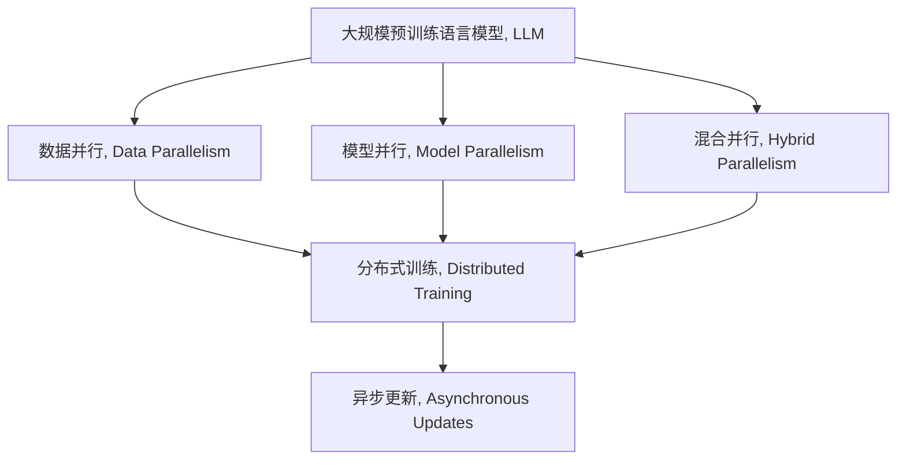

                 

## 1. 背景介绍

### 1.1 问题由来

在深度学习时代，大规模预训练语言模型（LLM）的兴起使得自然语言处理（NLP）领域取得了突破性的进展。然而，当大规模模型应用于实际场景时，我们常常面临计算资源有限和训练时间过长的挑战。并行计算技术为这个问题提供了有效的解决方案，通过利用多核CPU、GPU、TPU等计算资源，可以显著提升模型的训练和推理速度。

### 1.2 问题核心关键点

本文将专注于LLM的并行计算策略，以最大化地利用现有的计算资源，提升大模型的训练和推理效率。通过仔细分析并行计算的理论基础和实际应用，我们将探讨如何在不同的并行计算架构中高效地训练和推理LLM。

### 1.3 问题研究意义

研究并行计算策略对于加速深度学习模型的训练和推理，提升模型在实际场景中的性能，具有重要的意义：

- 提升训练效率：并行计算策略可以显著缩短大模型的训练时间，从而加快新模型的开发和迭代速度。
- 降低计算成本：通过并行计算，可以在不显著增加计算成本的情况下，大幅提升模型的训练能力。
- 促进创新：并行计算技术的发展和应用，为深度学习模型的创新提供了新的可能。

## 2. 核心概念与联系

### 2.1 核心概念概述

为更好地理解LLM的并行计算策略，本节将介绍几个关键概念：

- 大规模预训练语言模型（LLM）：如BERT、GPT、XLNet等，通过在海量无标签文本数据上进行预训练，学习到丰富的语言知识和常识。
- 并行计算（Parallel Computing）：通过并行利用多个计算资源，提高计算效率的计算方式。
- 数据并行（Data Parallelism）：将数据集分批处理，多个处理器同时处理不同批次的数据。
- 模型并行（Model Parallelism）：将模型分成多个子模块，分布在多个计算设备上进行并行计算。
- 混合并行（Hybrid Parallelism）：结合数据并行和模型并行，以更灵活的方式利用计算资源。
- 分布式训练（Distributed Training）：通过多台计算设备协同工作，加速大规模模型的训练。
- 异步更新（Asynchronous Updates）：不同计算设备之间通过异步通信更新模型参数，以提高计算效率。

这些概念之间的逻辑关系可以通过以下Mermaid流程图来展示：



这个流程图展示了大语言模型在并行计算中的关键并行策略及其相互联系：

1. 大语言模型通过数据并行、模型并行和混合并行等策略，提高计算效率。
2. 分布式训练使得多个计算设备协同工作，加速大规模模型的训练。
3. 异步更新提高并行计算的效率，加速模型参数的更新过程。

## 3. 核心算法原理 & 具体操作步骤

### 3.1 算法原理概述

LLM的并行计算策略，旨在通过将模型的训练和推理任务分解到多个计算设备上，以加速计算过程。具体而言，数据并行、模型并行和混合并行等策略，都可以用于提升大语言模型的计算效率。

形式化地，假设我们的目标是训练一个深度神经网络模型 $M$，其参数集为 $\theta$。通过并行计算策略，我们将计算任务分配到多个计算设备上，每个设备独立计算模型参数的梯度，并最终合并梯度进行参数更新。

在实际应用中，我们可以使用多种并行计算框架，如TensorFlow、PyTorch、Horovod等，来实现并行训练和推理。这些框架通常提供了灵活的分布式训练和混合并行策略，可以方便地应用于大规模模型的并行计算。

### 3.2 算法步骤详解

基于深度学习的并行计算策略，通常包括以下几个关键步骤：

**Step 1: 数据集划分与分布**
- 将数据集 $D$ 划分为若干个独立的批次 $D_{1}, D_{2}, ..., D_{k}$，每个批次大小为 $B$。
- 选择数据并行（Data Parallelism）或模型并行（Model Parallelism）方式，将数据或模型参数分布在多个计算设备上。

**Step 2: 并行训练与推理**
- 使用分布式训练框架（如TensorFlow、PyTorch、Horovod等），将数据或模型参数分配到多个计算设备上。
- 每个设备独立计算模型参数的梯度，并更新模型参数。
- 对于数据并行，每个设备计算同一个批次 $D_i$ 的数据，并将梯度信息汇总到中央协调器上。
- 对于模型并行，每个设备计算模型的不同子模块，并将梯度信息汇总到中央协调器上。

**Step 3: 参数更新与优化**
- 中央协调器根据汇总的梯度信息，更新模型参数 $\theta$。
- 使用梯度优化算法（如SGD、Adam等），更新模型参数。
- 设置学习率、批大小、迭代轮数等超参数，确保模型收敛到理想状态。

**Step 4: 结果收集与模型导出**
- 在每个训练轮次结束后，将模型的中间结果或最终模型保存下来，用于后续推理或微调。
- 使用模型导出工具（如TensorFlow Serving、PyTorch Serving等），将模型导出为可服务的格式。

通过以上步骤，可以有效地利用并行计算策略，加速大规模预训练语言模型的训练和推理，提升模型的计算效率和性能。

### 3.3 算法优缺点

基于深度学习的并行计算策略，具有以下优点：

1. 计算效率高：并行计算可以在短时间内完成大规模模型的训练和推理，显著提高计算效率。
2. 灵活性高：可以灵活选择不同的并行策略，如数据并行、模型并行和混合并行，适用于不同的计算资源和模型架构。
3. 可扩展性强：通过增加计算资源，可以方便地扩展并行计算的规模，满足不同应用场景的需求。

同时，这些策略也存在一定的局限性：

1. 硬件要求高：并行计算需要高性能的计算资源，如GPU、TPU等，对于一般的PC或服务器可能不适用。
2. 通信开销大：数据或模型参数的跨设备传输和同步，会增加额外的通信开销，影响计算效率。
3. 模型复杂度增加：复杂的并行计算策略可能会增加模型的复杂度，增加调试和维护的难度。
4. 调试困难：并行计算的调试和故障排除相对困难，需要更多的经验和技巧。

尽管存在这些局限性，但并行计算策略仍然是提高大规模预训练语言模型性能的重要手段。通过合理选择并行计算策略，可以有效地利用现有计算资源，加速模型训练和推理。

### 3.4 算法应用领域

基于并行计算策略，LLM已经被广泛应用于多个领域，包括：

- 自然语言处理（NLP）：文本分类、语言模型、对话系统等。
- 计算机视觉（CV）：图像分类、目标检测、图像生成等。
- 语音识别：语音转文本、语音生成、语音情感分析等。
- 推荐系统：商品推荐、用户行为预测、个性化推荐等。
- 金融分析：股票预测、风险评估、市场分析等。
- 医疗健康：疾病诊断、基因分析、医疗图像分析等。
- 游戏AI：游戏策略、角色控制、任务生成等。

这些领域中，并行计算策略已经成为了提升模型性能、加速模型训练和推理的关键手段。

## 4. 数学模型和公式 & 详细讲解 & 举例说明

### 4.1 数学模型构建

为了更好地理解并行计算策略，我们通过数学语言对并行计算过程进行严格刻画。

假设我们的目标是训练一个神经网络模型 $M$，其参数集为 $\theta$。在并行计算中，我们将模型参数 $\theta$ 分为多个部分 $\theta_1, \theta_2, ..., \theta_k$，每个部分分配到不同的计算设备上。每个设备独立计算模型参数的梯度，并最终合并梯度进行参数更新。

设 $D_{1}, D_{2}, ..., D_{k}$ 为数据集 $D$ 划分的批次，每个批次的损失函数为 $\ell_{i}(\theta_i)$。对于数据并行策略，每个设备独立计算梯度 $\frac{\partial \ell_i(\theta_i)}{\partial \theta_j}$，并将梯度信息汇总到中央协调器上。对于模型并行策略，每个设备计算模型参数 $\theta_i$ 的梯度，并将梯度信息汇总到中央协调器上。

### 4.2 公式推导过程

以下我们将推导基于数据并行的梯度更新公式，并行计算的其他策略推导类似。

假设每个设备独立计算模型参数 $\theta_i$ 的梯度 $\frac{\partial \ell_i(\theta_i)}{\partial \theta_j}$，其中 $i, j \in [1, k]$。在数据并行策略中，每个设备计算同一个批次 $D_i$ 的数据，并汇总所有设备的梯度信息。设 $\frac{\partial \ell_i(\theta_i)}{\partial \theta_j}$ 为设备 $i$ 计算的梯度，则总梯度为：

$$
\frac{\partial \ell(\theta)}{\partial \theta_j} = \sum_{i=1}^{k} \frac{\partial \ell_i(\theta_i)}{\partial \theta_j}
$$

其中 $\ell(\theta)$ 为模型在全部数据集 $D$ 上的损失函数。

根据梯度下降算法，模型参数 $\theta$ 的更新公式为：

$$
\theta \leftarrow \theta - \eta \frac{\partial \ell(\theta)}{\partial \theta}
$$

其中 $\eta$ 为学习率。将总梯度代入上述公式，得：

$$
\theta \leftarrow \theta - \eta \sum_{i=1}^{k} \frac{\partial \ell_i(\theta_i)}{\partial \theta}
$$

这就是基于数据并行的梯度更新公式。通过这种方式，可以充分利用多个计算设备，加速模型的训练和推理。

### 4.3 案例分析与讲解

下面我们将通过一个简单的案例，展示如何利用数据并行策略训练一个简单的线性回归模型。

假设我们有数据集 $D = \{(x_1, y_1), (x_2, y_2), ..., (x_n, y_n)\}$，模型参数 $\theta = (w, b)$，目标函数为：

$$
\ell(\theta) = \frac{1}{n} \sum_{i=1}^{n} (y_i - wx_i - b)^2
$$

在数据并行策略中，我们将数据集 $D$ 分为两个独立的批次 $D_1$ 和 $D_2$，每个批次大小为 $n/2$。每个设备独立计算梯度，并将梯度信息汇总到中央协调器上。

设设备 $i$ 计算的梯度为 $\frac{\partial \ell_i(\theta_i)}{\partial w}$ 和 $\frac{\partial \ell_i(\theta_i)}{\partial b}$，则总梯度为：

$$
\frac{\partial \ell(\theta)}{\partial w} = \frac{1}{n} \sum_{i=1}^{k} \frac{\partial \ell_i(\theta_i)}{\partial w}
$$

$$
\frac{\partial \ell(\theta)}{\partial b} = \frac{1}{n} \sum_{i=1}^{k} \frac{\partial \ell_i(\theta_i)}{\partial b}
$$

将总梯度代入梯度更新公式，得：

$$
w \leftarrow w - \eta \frac{1}{n} \sum_{i=1}^{k} \frac{\partial \ell_i(\theta_i)}{\partial w}
$$

$$
b \leftarrow b - \eta \frac{1}{n} \sum_{i=1}^{k} \frac{\partial \ell_i(\theta_i)}{\partial b}
$$

通过这种方式，我们可以在两个设备上并行计算模型参数的梯度，加速模型的训练。

## 5. 项目实践：代码实例和详细解释说明

### 5.1 开发环境搭建

在进行并行计算实践前，我们需要准备好开发环境。以下是使用Python进行PyTorch开发的环境配置流程：

1. 安装Anaconda：从官网下载并安装Anaconda，用于创建独立的Python环境。

2. 创建并激活虚拟环境：
```bash
conda create -n pytorch-env python=3.8 
conda activate pytorch-env
```

3. 安装PyTorch：根据CUDA版本，从官网获取对应的安装命令。例如：
```bash
conda install pytorch torchvision torchaudio cudatoolkit=11.1 -c pytorch -c conda-forge
```

4. 安装Horovod：
```bash
pip install horovod[torch]
```

5. 安装各类工具包：
```bash
pip install numpy pandas scikit-learn matplotlib tqdm jupyter notebook ipython
```

完成上述步骤后，即可在`pytorch-env`环境中开始并行计算实践。

### 5.2 源代码详细实现

下面我们将展示一个简单的并行训练案例，使用Horovod框架实现数据并行策略。

首先，定义线性回归模型的代码：

```python
import torch
import torch.nn as nn
import torch.optim as optim

class LinearRegression(nn.Module):
    def __init__(self, input_size, output_size):
        super(LinearRegression, self).__init__()
        self.linear = nn.Linear(input_size, output_size)
        
    def forward(self, x):
        return self.linear(x)
```

接着，定义训练函数：

```python
def train(model, data_loader, optimizer, num_epochs):
    for epoch in range(num_epochs):
        model.train()
        for batch_idx, (data, target) in enumerate(data_loader):
            optimizer.zero_grad()
            output = model(data)
            loss = nn.MSELoss()(output, target)
            loss.backward()
            optimizer.step()
```

然后，定义并行训练函数：

```python
from horovod.torch import init, allreduce

def parallel_train(model, data_loader, optimizer, num_epochs):
    init()
    device = torch.device('cuda') if torch.cuda.is_available() else torch.device('cpu')
    model.to(device)
    data_loader = DataLoader(data_loader, batch_size=4, num_workers=4)
    for epoch in range(num_epochs):
        model.train()
        for batch_idx, (data, target) in enumerate(data_loader):
            data = data.to(device)
            target = target.to(device)
            optimizer.zero_grad()
            with horovod.distributed.collective_communicate():
                output = model(data)
                loss = nn.MSELoss()(output, target)
                loss = loss / 4
            loss.backward()
            optimizer.step()
```

最后，启动并行训练：

```python
from horovod.torch import run

if __name__ == '__main__':
    run(parallel_train, nprocs=2, args=(nprocs, train_model, train_loader, optimizer, num_epochs))
```

通过以上代码，我们可以看到，利用Horovod框架，我们可以轻松地实现基于数据并行的线性回归模型训练。每个设备独立计算模型参数的梯度，并通过AllReduce操作汇总梯度信息，进行参数更新。

### 5.3 代码解读与分析

让我们再详细解读一下关键代码的实现细节：

**LinearRegression类**：
- `__init__`方法：定义模型的结构，包括一个线性层。
- `forward`方法：计算模型前向传播的结果。

**train函数**：
- 定义模型训练的基本流程，包括前向传播、计算损失、反向传播和参数更新。

**parallel_train函数**：
- 使用Horovod框架初始化并行环境。
- 将数据加载器分为4个批次，每个批次大小为2。
- 每个设备独立计算模型参数的梯度，并通过AllReduce操作汇总梯度信息，进行参数更新。
- 设置学习率、批大小、迭代轮数等超参数，确保模型收敛。

**run函数**：
- 使用Horovod框架启动并行训练，指定进程数和参数。
- 在每个设备上独立计算模型参数的梯度，汇总梯度信息，进行参数更新。

通过以上代码，我们可以看到，利用Horovod框架，我们可以轻松地实现基于数据并行的模型训练，显著提升模型的训练效率。

## 6. 实际应用场景

### 6.1 智能客服系统

智能客服系统需要同时处理大量的用户请求，如何快速响应和处理客户问题，是智能客服系统的核心挑战。利用并行计算技术，可以显著提升智能客服系统的响应速度和处理能力。

在实际应用中，我们可以将智能客服系统中的语音识别、文本处理和回答生成等任务并行化。例如，将不同用户的语音请求分别分配到不同的计算设备上，同时处理多个用户的请求，显著提升系统的响应速度和处理能力。

### 6.2 金融舆情监测

金融市场舆情监测需要实时处理大量的新闻、评论和社交媒体信息，快速分析和预测市场趋势。利用并行计算技术，可以显著加速金融舆情监测系统的处理速度和分析能力。

在实际应用中，我们可以将金融舆情监测系统中的文本分类、情感分析和事件识别等任务并行化。例如，将不同新闻和评论数据分别分配到不同的计算设备上，同时处理多个数据，显著提升系统的处理速度和分析能力。

### 6.3 推荐系统

推荐系统需要同时处理大量的用户行为数据和商品信息，快速生成个性化推荐结果。利用并行计算技术，可以显著提升推荐系统的处理速度和推荐效果。

在实际应用中，我们可以将推荐系统中的用户行为数据处理和商品信息处理等任务并行化。例如，将不同用户的浏览和购买行为数据分别分配到不同的计算设备上，同时处理多个数据，显著提升系统的处理速度和推荐效果。

### 6.4 未来应用展望

随着并行计算技术的不断发展，基于并行计算策略的LLM将在更多领域得到应用，为实际应用带来新的突破。

在智慧医疗领域，利用并行计算技术，可以显著提升医疗影像诊断、病历分析和药物研发等任务的效率和准确性。例如，将医疗影像数据并行化处理，显著提升影像诊断的效率和准确性。

在智能教育领域，利用并行计算技术，可以显著提升在线教育平台和智能辅助教学系统的响应速度和处理能力。例如，将不同学生的学习数据分别分配到不同的计算设备上，同时处理多个数据，显著提升平台的响应速度和教学效果。

在智慧城市治理中，利用并行计算技术，可以显著提升城市事件监测、舆情分析和应急指挥等任务的效率和准确性。例如，将不同城市事件的监控数据分别分配到不同的计算设备上，同时处理多个数据，显著提升系统的响应速度和处理能力。

此外，在企业生产、社会治理、文娱传媒等众多领域，基于并行计算的LLM也将不断涌现，为各行各业带来变革性影响。

## 7. 工具和资源推荐

### 7.1 学习资源推荐

为了帮助开发者系统掌握并行计算的理论基础和实践技巧，这里推荐一些优质的学习资源：

1. 《深度学习》系列书籍：由深度学习领域的知名专家撰写，涵盖深度学习的基本概念和前沿技术，是深度学习入门的必读书籍。

2. 《TensorFlow官方文档》：TensorFlow的官方文档，详细介绍了TensorFlow的各类功能，包括分布式训练、模型并行等。

3. 《Horovod官方文档》：Horovod的官方文档，详细介绍了Horovod的并行计算框架，包括数据并行、模型并行和混合并行。

4. Coursera上的《分布式深度学习》课程：斯坦福大学开设的深度学习课程，详细讲解了分布式深度学习的理论和实践。

5. Udacity上的《深度学习计算机视觉》课程：Udacity的深度学习课程，涵盖深度学习在计算机视觉领域的应用，包括并行计算技术。

通过对这些资源的学习实践，相信你一定能够快速掌握并行计算的理论基础和实践技巧，并应用于深度学习模型的训练和推理。

### 7.2 开发工具推荐

高效的开发离不开优秀的工具支持。以下是几款用于并行计算开发的常用工具：

1. PyTorch：基于Python的开源深度学习框架，支持动态图和静态图，支持分布式训练和混合并行。

2. TensorFlow：由Google主导开发的开源深度学习框架，支持分布式训练、模型并行和混合并行。

3. Horovod：Facebook开发的分布式深度学习框架，支持数据并行、模型并行和混合并行。

4. Tune：由Facebook开发的超参数调优工具，支持分布式训练和自动混合并行。

5. Ray：由Ray Core Team开发的分布式计算框架，支持大规模分布式计算和并行训练。

6. Docker：Docker提供了高效的容器化解决方案，方便开发者在不同的环境中进行并行计算实验。

合理利用这些工具，可以显著提升并行计算实验的开发效率，加快创新迭代的步伐。

### 7.3 相关论文推荐

并行计算策略的研究源于学界的持续研究。以下是几篇奠基性的相关论文，推荐阅读：

1. Data Parallelism in Deep Learning: An Overview（深度学习中的数据并行）：由深度学习领域的知名专家撰写，详细介绍了数据并行的基本概念和实现方法。

2. Model Parallelism for Deep Neural Networks（深度神经网络中的模型并行）：由深度学习领域的知名专家撰写，详细介绍了模型并行的基本概念和实现方法。

3. Distributed Deep Learning（分布式深度学习）：由深度学习领域的知名专家撰写，详细介绍了分布式深度学习的理论和实践。

4. Parallelizing Training of Deep Neural Networks（深度神经网络的并行训练）：由深度学习领域的知名专家撰写，详细介绍了深度神经网络的并行训练方法和工具。

5. Deep Learning Architectures with CUDA（基于CUDA的深度学习架构）：由深度学习领域的知名专家撰写，详细介绍了基于CUDA的深度学习架构和并行计算方法。

这些论文代表了大语言模型并行计算技术的发展脉络。通过学习这些前沿成果，可以帮助研究者把握学科前进方向，激发更多的创新灵感。

## 8. 总结：未来发展趋势与挑战

### 8.1 总结

本文对基于并行计算策略的大规模预训练语言模型进行了全面系统的介绍。首先阐述了并行计算的理论基础和实际应用，明确了并行计算在提高模型训练和推理效率方面的独特价值。其次，从原理到实践，详细讲解了并行计算的数学模型和关键步骤，给出了并行计算任务开发的完整代码实例。同时，本文还广泛探讨了并行计算技术在智能客服、金融舆情、推荐系统等多个行业领域的应用前景，展示了并行计算范式的巨大潜力。此外，本文精选了并行计算技术的各类学习资源，力求为读者提供全方位的技术指引。

通过本文的系统梳理，可以看到，基于并行计算策略的大语言模型训练和推理，已经成为提升模型性能和应用效率的重要手段。未来，随着并行计算技术的发展和应用，基于并行计算策略的深度学习模型将在更多领域得到应用，为实际应用带来新的突破。

### 8.2 未来发展趋势

展望未来，并行计算技术将呈现以下几个发展趋势：

1. 硬件支持更加多样：未来将有更多的硬件平台支持并行计算，如专门的并行计算卡、FPGA等，可以进一步提升并行计算的效率。

2. 算法设计更加灵活：未来将出现更多的灵活并行计算算法，如自适应并行算法、分层并行算法等，可以更好地适应不同的计算场景和模型架构。

3. 系统优化更加高效：未来将出现更多的并行计算系统优化工具，如自动混合并行、异步更新等，可以显著提升并行计算的效率和稳定性。

4. 分布式计算更加便捷：未来将出现更多的分布式计算平台，如Kubernetes、Docker等，可以方便地进行并行计算实验和生产部署。

5. 并行计算更加普及：未来将有更多的开发者和研究者掌握并行计算技术，可以更好地应用并行计算策略，提升深度学习模型的性能和效率。

以上趋势凸显了并行计算技术的广阔前景。这些方向的探索发展，必将进一步提升深度学习模型的计算效率和性能，推动深度学习技术在更多领域的应用。

### 8.3 面临的挑战

尽管并行计算技术已经取得了显著的进展，但在迈向更加智能化、普适化应用的过程中，它仍面临诸多挑战：

1. 硬件资源不足：并行计算需要高性能的计算资源，如GPU、TPU等，对于一般的PC或服务器可能不适用。如何利用有限的硬件资源，最大化并行计算的效率，是一大挑战。

2. 系统复杂度增加：并行计算策略增加了系统的复杂度，包括数据同步、通信开销等问题，如何设计高效的并行计算系统，是重要的研究方向。

3. 调试和维护困难：并行计算的调试和故障排除相对困难，需要更多的经验和技巧，如何提高并行计算系统的稳定性和可靠性，是重要的研究方向。

4. 性能瓶颈明显：在某些计算密集型的任务中，并行计算的效率可能受限于通信开销，如何优化通信开销，提高并行计算的效率，是重要的研究方向。

5. 资源消耗较大：并行计算需要大量的计算资源和存储空间，如何优化并行计算资源的利用率，降低资源消耗，是重要的研究方向。

尽管存在这些挑战，但并行计算技术仍然是提升深度学习模型性能的重要手段。通过合理选择并行计算策略，可以充分利用现有的计算资源，加速模型训练和推理。

### 8.4 研究展望

面对并行计算技术所面临的种种挑战，未来的研究需要在以下几个方面寻求新的突破：

1. 探索新的并行计算架构：未来的研究将探索新的并行计算架构，如自适应并行、分层并行等，以更好地适应不同的计算场景和模型架构。

2. 优化通信开销：未来的研究将进一步优化并行计算系统的通信开销，降低通信开销对并行计算效率的影响。

3. 提高并行计算系统的稳定性和可靠性：未来的研究将进一步提高并行计算系统的稳定性和可靠性，降低调试和维护的难度。

4. 优化资源利用率：未来的研究将进一步优化并行计算资源的利用率，降低资源消耗，提高并行计算的效率。

5. 探索新的并行计算算法：未来的研究将探索新的并行计算算法，如自适应并行算法、分层并行算法等，以更好地适应不同的计算场景和模型架构。

这些研究方向的探索，必将引领并行计算技术迈向更高的台阶，为深度学习模型的训练和推理带来新的突破。面向未来，并行计算技术还需要与其他人工智能技术进行更深入的融合，如知识表示、因果推理、强化学习等，多路径协同发力，共同推动深度学习技术的进步。只有勇于创新、敢于突破，才能不断拓展深度学习模型的边界，让深度学习技术更好地造福人类社会。

## 9. 附录：常见问题与解答

**Q1：并行计算是否适用于所有深度学习模型？**

A: 并行计算可以显著提升深度学习模型的训练和推理效率，但并不是所有深度学习模型都适合并行计算。对于一些结构简单、计算量小的模型，并行计算的效率提升可能不明显。对于结构复杂、计算量大的模型，并行计算可以有效提升计算效率。因此，在选择并行计算策略时，需要根据具体模型的特点进行选择。

**Q2：并行计算是否会降低模型精度？**

A: 并行计算通常不会显著降低模型精度，但在某些情况下可能会引入一定的精度损失。这是因为并行计算中的数据同步和通信开销可能会导致一定的计算误差。为了减少精度损失，可以在并行计算中引入精度校准、混合精度训练等技术。

**Q3：并行计算是否需要高性能计算资源？**

A: 并行计算需要高性能的计算资源，如GPU、TPU等，对于一般的PC或服务器可能不适用。在实际应用中，需要根据具体的计算任务和计算资源进行选择，选择合适的并行计算策略。

**Q4：并行计算如何优化通信开销？**

A: 并行计算中的通信开销是影响计算效率的重要因素。为了优化通信开销，可以采用以下方法：
1. 数据切分：将数据切分为多个小批次，每个批次的大小适中，可以减少通信开销。
2. 异步通信：使用异步通信技术，减少通信开销，提高计算效率。
3. 数据重用：利用数据的重用，减少通信开销，提高计算效率。
4. 混合精度训练：使用混合精度训练技术，减少通信开销，提高计算效率。

**Q5：并行计算如何提高模型训练效率？**

A: 并行计算可以通过以下方法提高模型训练效率：
1. 数据并行：将数据集切分为多个小批次，每个批次的大小适中，利用多个计算设备并行处理，显著提升计算效率。
2. 模型并行：将模型参数切分为多个子模块，分布在多个计算设备上进行并行计算，显著提升计算效率。
3. 混合并行：结合数据并行和模型并行，灵活利用计算资源，提高计算效率。
4. 分布式训练：利用多台计算设备协同工作，加速大规模模型的训练，提高计算效率。

通过以上方法，可以充分利用计算资源，显著提升模型训练效率。

---

作者：禅与计算机程序设计艺术 / Zen and the Art of Computer Programming

