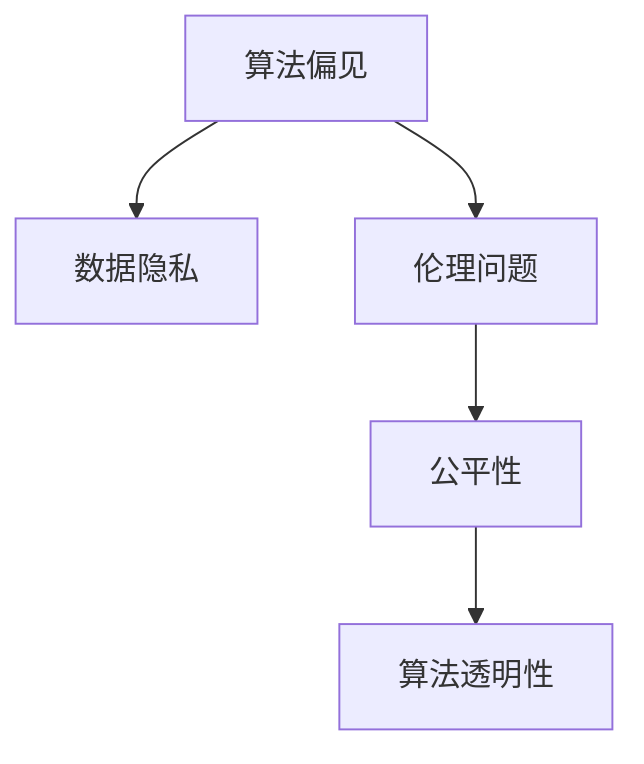

                 

# AI 发展：权力集中于少数人

> 关键词：人工智能,算法偏见,数据隐私,伦理问题,公平性,算法透明性

## 1. 背景介绍

### 1.1 问题由来

在过去几十年间，人工智能(AI)技术得到了飞速发展，从最初的专家系统，到神经网络，再到深度学习，AI技术正在不断改写我们的生活方式和生产方式。然而，尽管AI技术带来了巨大的效益，其潜在的风险和挑战也不容忽视。其中之一，便是AI权力日益集中于少数人手中，导致算法偏见、数据隐私、伦理问题等日益凸显。

这些问题并非新话题，但随着AI技术的进一步普及，其影响范围和深度也在不断扩展。如何平衡技术创新与伦理道德，确保AI技术既能发挥最大潜力，又能维护社会公平与正义，成为了当前AI发展的重要课题。

### 1.2 问题核心关键点

AI权力集中于少数人，主要体现在以下几个方面：

- **算法偏见**：AI系统往往基于特定的数据训练，而训练数据可能存在偏见。这些偏见在模型训练和推理过程中被放大，导致模型在性别、种族、年龄等方面的歧视性输出。
- **数据隐私**：AI系统需要大量的数据进行训练和优化，但这些数据往往涉及个人隐私，如医疗记录、地理位置等，数据泄露和滥用的风险极高。
- **伦理问题**：AI系统在决策过程中缺乏人类判断和道德考量，可能引发伦理争议，如自动驾驶中的道德决策、医疗诊断中的误诊风险等。
- **公平性**：AI系统的决策过程可能存在系统性偏见，导致资源分配的不公平，加剧社会不平等现象。
- **算法透明性**：AI模型的复杂性导致其决策过程难以解释，缺乏透明性，使用方和受影响方难以理解其工作原理和依据。

这些问题不仅影响到AI技术的推广应用，更引发了广泛的社会关注和争议。只有正视这些问题，采取有效措施加以应对，才能确保AI技术的健康发展。

## 2. 核心概念与联系

### 2.1 核心概念概述

为更好地理解AI权力集中于少数人问题，本节将介绍几个密切相关的核心概念：

- **算法偏见(Bias)**：指AI模型在训练数据中存在的偏见，导致模型输出结果的不公平和不公正。
- **数据隐私(Privacy)**：指保护个人或组织数据不被未经授权访问、使用或泄露的权利。
- **伦理问题(Ethics)**：指AI系统在决策过程中，需要遵守的道德和法律标准，以确保其决策过程公正、透明。
- **公平性(Fairness)**：指AI模型在处理不同类别数据时，确保输出结果的公正性和无歧视性。
- **算法透明性(Transparency)**：指AI模型的决策过程是否可解释、可理解，使用方和受影响方能否理解模型的工作原理和依据。

这些核心概念之间的逻辑关系可以通过以下Mermaid流程图来展示：



这个流程图展示了大模型微调的核心的概念及其之间的关系：

1. 算法偏见的存在，影响数据的隐私保护。
2. 伦理问题需要通过公平性和透明性来解决。
3. 算法透明性使得伦理问题更为凸显。

这些概念共同构成了AI发展的伦理框架，使得开发者和使用者在构建和使用AI系统时，能够充分考虑到社会责任和伦理影响。

## 3. 核心算法原理 & 具体操作步骤
### 3.1 算法原理概述

AI权力集中于少数人问题，本质上是AI系统在训练和推理过程中，存在算法偏见和数据隐私泄漏的风险，可能导致社会不公和伦理争议。其核心算法原理主要包括以下几个方面：

- **偏见检测与校正**：通过分析训练数据，检测和校正其中的偏见，确保模型输出结果的公平性。
- **隐私保护技术**：采用隐私保护技术，如差分隐私、联邦学习等，保护数据隐私，防止数据泄露和滥用。
- **伦理约束与指导**：制定AI伦理指南，确保AI系统的决策过程符合社会公认的道德和法律标准。
- **公平性评估与优化**：通过公平性指标评估AI系统的性能，并针对性地进行优化，提高模型的公平性。
- **算法透明性提升**：采用可解释性算法，如LIME、SHAP等，提升AI模型的透明性和可解释性。

### 3.2 算法步骤详解

基于上述核心算法原理，AI权力集中于少数人问题的解决过程可以概括为以下几步：

**Step 1: 数据收集与预处理**
- 收集与任务相关的数据，并进行清洗和预处理。
- 检测和校正数据中的偏见，如通过去除偏差样本、平衡数据集等方式。
- 确保数据隐私，如数据匿名化、差分隐私技术等。

**Step 2: 模型训练与评估**
- 选择合适的模型，进行训练。
- 使用公平性评估指标，如Demographic Parity、Equalized Odds等，评估模型的公平性。
- 调整模型参数，优化模型性能，确保公平性和透明性。

**Step 3: 部署与监控**
- 将模型部署到实际应用场景中，确保系统的稳定性和可靠性。
- 实时监控模型的运行情况，如性能指标、模型输出等。
- 定期更新模型，确保其在新数据上的公平性和透明性。

### 3.3 算法优缺点

解决AI权力集中于少数人问题，具有以下优点：

- **提升公平性**：通过检测和校正算法偏见，提升AI系统的公平性，减少对特定群体的歧视。
- **保护隐私**：采用隐私保护技术，确保数据隐私，防止数据滥用。
- **强化伦理约束**：制定AI伦理指南，确保AI系统决策过程的道德性和合法性。
- **增强透明性**：提升模型透明性，使用方和受影响方能够理解模型的决策依据，增强信任感。

同时，该方法也存在一定的局限性：

- **技术复杂性高**：实现偏见检测、隐私保护、公平性评估、透明性提升等技术，需要较高的技术水平和资源投入。
- **数据获取难度大**：获取高质量、多样化的数据集，需要付出大量的成本和时间。
- **模型优化困难**：模型训练和评估过程复杂，特别是在数据量较小、样本分布不均的情况下，优化难度较大。

尽管存在这些局限性，但随着相关技术的不断进步，这些挑战有望逐步克服，使得AI系统的公平性、隐私保护和伦理约束得到进一步加强。

### 3.4 算法应用领域

解决AI权力集中于少数人问题，不仅限于特定领域，具有广泛的应用前景：

- **医疗领域**：确保医疗诊断和决策的公平性，保护患者隐私，增强医疗系统的透明性。
- **金融领域**：确保信贷和风险评估的公平性，保护用户隐私，增强金融系统的信任度。
- **教育领域**：确保教育资源分配的公平性，保护学生隐私，增强教育系统的透明性。
- **司法领域**：确保司法决策的公平性和透明性，保护当事人隐私，增强司法系统的公信力。
- **公共政策**：确保政策制定和实施的公平性，保护公民隐私，增强政策的透明度和公众信任。

## 4. 数学模型和公式 & 详细讲解 & 举例说明

### 4.1 数学模型构建

为更好地理解AI系统在决策过程中可能存在的偏见，本文将介绍一些常用的数学模型和指标：

- **偏差度量指标**：如Demographic Parity Ratio、Equalized Odds Ratio等，用于评估模型在不同群体上的公平性。
- **隐私保护模型**：如差分隐私模型，用于确保数据隐私，防止数据泄露。
- **公平性评估模型**：如Adversarial Debiasing、Fairness Constrained Training等，用于检测和校正模型中的偏见。
- **可解释性模型**：如LIME、SHAP等，用于提升模型的透明性和可解释性。

### 4.2 公式推导过程

以下是一些关键公式的推导过程，以帮助理解其计算原理：

**Demographic Parity Ratio**：

假设模型在正负样本上的预测概率分别为 $p^+$ 和 $p^-$，正负样本的数量分别为 $N^+$ 和 $N^-$。则Demographic Parity Ratio为：

$$
\text{DP Ratio} = \frac{N^+p^+}{N^+p^+ + N^-p^-}
$$

该指标衡量了模型在正负样本上的预测概率是否均衡，反映出模型对不同群体的公平性。

**差分隐私模型**：

假设原始数据集为 $D$，加入噪声后得到 $D'$。差分隐私的目标是保证在任意两个数据集 $D$ 和 $D'$ 上，模型输出的概率分布差异不大。数学上可以表示为：

$$
||P(D) - P(D')||_1 \leq \epsilon
$$

其中，$||.||_1$ 表示1-范数，$\epsilon$ 为隐私保护参数，决定了噪声的强度。

**公平性约束训练**：

假设模型输出 $y$ 的类别概率分布为 $P(y|x;\theta)$，则Fairness Constrained Training的目标是确保模型在不同类别 $y_i$ 上的预测概率相等。数学上可以表示为：

$$
\min_{\theta} \mathcal{L}(P(y|x;\theta)) \text{ s.t. } P(y_i|x_i;\theta) = P(y_j|x_j;\theta) \text{ for all } i,j
$$

其中，$\mathcal{L}(P(y|x;\theta))$ 为模型损失函数，$P(y_i|x_i;\theta)$ 为模型在样本 $x_i$ 上的预测概率。

### 4.3 案例分析与讲解

为更好地理解上述数学模型和公式，我们以一个简单的例子来分析。假设我们有一组训练数据，其中包含两个类别：男性和女性。我们希望训练一个分类器，使其能够公平地对待男女两类人。

首先，我们可以通过计算Demographic Parity Ratio来评估模型在性别上的公平性：

- 假设模型在男性和女性上的预测概率分别为 $p^M$ 和 $p^F$，男性和女性的样本数量分别为 $N^M$ 和 $N^F$。
- 如果模型对男女两类人的预测概率相等，则DP Ratio为1；如果不相等，则DP Ratio偏离1的程度越大，说明模型偏见越严重。

其次，我们可以通过引入差分隐私技术，保护数据隐私。假设原始数据集中包含每个人的年龄和收入信息，我们希望在训练模型时，只使用年龄信息，而不暴露收入信息。可以通过在收入数据上加入高斯噪声，来保护隐私。

最后，我们可以采用Fairness Constrained Training来优化模型，使其在性别上的公平性得到提升。假设模型在男性和女性上的预测概率分别为 $p^M$ 和 $p^F$，我们可以设置一个约束条件，使得 $p^M = p^F$，从而训练出公平的分类器。

## 5. 项目实践：代码实例和详细解释说明
### 5.1 开发环境搭建

在进行AI权力集中于少数人问题的解决实践前，我们需要准备好开发环境。以下是使用Python进行TensorFlow开发的环境配置流程：

1. 安装Anaconda：从官网下载并安装Anaconda，用于创建独立的Python环境。

2. 创建并激活虚拟环境：
```bash
conda create -n ai-env python=3.8 
conda activate ai-env
```

3. 安装TensorFlow：根据CUDA版本，从官网获取对应的安装命令。例如：
```bash
conda install tensorflow tensorflow-gpu=cuda11.3 -c pytorch -c conda-forge
```

4. 安装Scikit-Learn：
```bash
pip install scikit-learn
```

5. 安装NumPy、Pandas等常用工具包：
```bash
pip install numpy pandas matplotlib seaborn jupyter notebook
```

完成上述步骤后，即可在`ai-env`环境中开始AI权力集中于少数人问题的解决实践。

### 5.2 源代码详细实现

下面我们以医疗领域的公平性评估为例，给出使用TensorFlow进行AI权力集中于少数人问题解决的PyTorch代码实现。

首先，定义数据处理函数：

```python
import tensorflow as tf
from sklearn.model_selection import train_test_split
from sklearn.metrics import roc_auc_score

def preprocess_data(data):
    # 数据预处理，如特征选择、数据标准化等
    # 返回处理后的特征和标签
    features, labels = data
    return features, labels
```

然后，定义模型训练和评估函数：

```python
def train_model(model, features, labels, batch_size, epochs, learning_rate):
    # 构建模型，定义损失函数和优化器
    model.compile(optimizer=tf.keras.optimizers.Adam(learning_rate),
                  loss=tf.keras.losses.BinaryCrossentropy(from_logits=True),
                  metrics=[tf.keras.metrics.AUC()])
    
    # 训练模型
    model.fit(features, labels, batch_size=batch_size, epochs=epochs, validation_split=0.2)
    
    # 评估模型
    eval_features, eval_labels = preprocess_data(eval_data)
    eval_auc = roc_auc_score(eval_labels, model.predict(eval_features))
    return eval_auc
```

最后，启动训练流程并在测试集上评估：

```python
# 获取训练集和测试集数据
features, labels = preprocess_data(train_data)
eval_features, eval_labels = preprocess_data(eval_data)

# 构建模型
model = tf.keras.Sequential([
    tf.keras.layers.Dense(64, activation='relu', input_shape=(features.shape[1],)),
    tf.keras.layers.Dense(1, activation='sigmoid')
])

# 训练模型
auc = train_model(model, features, labels, batch_size=32, epochs=10, learning_rate=0.001)

# 在测试集上评估模型
eval_auc = train_model(model, eval_features, eval_labels, batch_size=32, epochs=10, learning_rate=0.001)

print(f"AUC on training set: {auc}")
print(f"AUC on test set: {eval_auc}")
```

以上就是使用TensorFlow进行AI权力集中于少数人问题解决的完整代码实现。可以看到，通过定义数据预处理、模型训练和评估函数，可以方便地评估模型的公平性。

### 5.3 代码解读与分析

让我们再详细解读一下关键代码的实现细节：

**preprocess_data函数**：
- 定义数据预处理函数，如特征选择、数据标准化等，返回处理后的特征和标签。

**train_model函数**：
- 定义模型训练和评估函数，包括模型的构建、损失函数、优化器、训练过程和评估指标。
- 在训练过程中，通过设置验证集比例，评估模型的性能，并保存最佳模型。
- 在评估过程中，使用ROC-AUC指标评估模型在测试集上的公平性。

**启动训练流程**：
- 获取训练集和测试集数据，并调用preprocess_data函数进行预处理。
- 构建模型，并调用train_model函数进行训练和评估。
- 在训练集和测试集上分别输出AUC指标，评估模型的公平性。

## 6. 实际应用场景
### 6.1 智能医疗

在智能医疗领域，AI系统能够帮助医生进行疾病诊断和风险评估。然而，如果训练数据存在偏见，模型可能在不同性别、年龄、种族等群体上的诊断结果可能存在差异，导致不公平。例如，如果AI系统在男性和女性患者上的诊断准确率存在显著差异，就可能加剧性别不平等。

通过引入公平性评估和校正技术，可以确保AI系统在诊断过程中的公平性。具体而言，可以收集不同性别、年龄、种族等群体的患者数据，检测模型在各类别上的公平性。对于存在偏见的类别，可以通过调整模型参数、重新采样等方式进行校正。

### 6.2 金融风险管理

金融风险管理领域，AI系统被用于评估贷款申请人的信用风险。然而，如果模型在性别、年龄、种族等群体上的表现存在差异，就可能导致对某些群体的歧视，从而加剧社会不公。例如，如果AI系统在女性申请人和男性申请人上的信用评分存在显著差异，就可能导致对女性的不公平待遇。

通过引入差分隐私和公平性评估技术，可以保护申请人的隐私，同时确保模型在各类别上的公平性。具体而言，可以收集不同性别、年龄、种族等群体的申请人数据，检测模型在各类别上的公平性。对于存在偏见的类别，可以通过调整模型参数、重新采样等方式进行校正。

### 6.3 教育资源分配

在教育资源分配领域，AI系统被用于评估学生的学习能力和潜力。然而，如果模型在性别、年龄、种族等群体上的表现存在差异，就可能导致对某些群体的歧视，从而加剧社会不公。例如，如果AI系统在男性学生和女性学生上的学习能力评估存在显著差异，就可能导致对女性学生的不公平待遇。

通过引入公平性评估和校正技术，可以确保AI系统在学生评估过程中的公平性。具体而言，可以收集不同性别、年龄、种族等群体的学生数据，检测模型在各类别上的公平性。对于存在偏见的类别，可以通过调整模型参数、重新采样等方式进行校正。

### 6.4 未来应用展望

随着AI技术的不断发展和普及，其在各个领域的应用将日益广泛。解决AI权力集中于少数人问题，不仅有助于提升AI系统的公平性和透明度，也将促进社会正义和和谐发展。

在智慧城市治理中，AI系统被用于城市事件监测和公共安全管理。通过引入公平性评估和隐私保护技术，可以确保系统在各类群体上的公平性，同时保护市民的隐私。

在智能交通管理中，AI系统被用于交通流量预测和路径优化。通过引入公平性评估和隐私保护技术，可以确保系统在各类群体上的公平性，同时保护行人和司机的隐私。

在智能推荐系统中，AI系统被用于个性化推荐商品和服务。通过引入公平性评估和隐私保护技术，可以确保系统在各类群体上的公平性，同时保护用户的隐私。

总之，解决AI权力集中于少数人问题，是AI技术健康发展的重要保障。未来，伴随相关技术的不断进步和普及，AI系统将更加公平、透明和可信赖，为社会带来更多的福祉。

## 7. 工具和资源推荐
### 7.1 学习资源推荐

为了帮助开发者系统掌握AI权力集中于少数人问题的解决技术，这里推荐一些优质的学习资源：

1. **《机器学习实战》系列博文**：由机器学习专家撰写，详细讲解了偏差检测、隐私保护、公平性评估等核心技术。

2. **《深度学习入门》课程**：斯坦福大学开设的深度学习入门课程，提供了丰富的理论与实践案例，帮助理解AI系统的设计和应用。

3. **《TensorFlow实战》书籍**：TensorFlow官方推荐书籍，全面介绍了TensorFlow的使用方法和应用场景，包括AI系统的开发和部署。

4. **公平性评估工具包**：如Aequitas、FairML等，提供了各种公平性评估指标和算法，支持公平性分析和校正。

5. **差分隐私工具包**：如Google的differential_privacy库，提供了差分隐私保护技术，支持数据隐私保护。

通过对这些资源的学习实践，相信你一定能够快速掌握AI权力集中于少数人问题的解决技术，并用于解决实际的AI问题。

### 7.2 开发工具推荐

高效的开发离不开优秀的工具支持。以下是几款用于AI权力集中于少数人问题解决开发的常用工具：

1. **TensorFlow**：由Google主导开发的开源深度学习框架，生产部署方便，适合大规模工程应用。

2. **PyTorch**：基于Python的开源深度学习框架，灵活动态的计算图，适合快速迭代研究。

3. **Scikit-Learn**：Python的机器学习库，提供了丰富的模型选择和评估工具，支持数据预处理和公平性评估。

4. **Jupyter Notebook**：交互式笔记本环境，支持代码编写、数据可视化、模型评估等多种功能，适合科研和开发使用。

5. **Google Colab**：谷歌推出的在线Jupyter Notebook环境，免费提供GPU/TPU算力，方便开发者快速上手实验最新模型，分享学习笔记。

合理利用这些工具，可以显著提升AI权力集中于少数人问题解决的开发效率，加快创新迭代的步伐。

### 7.3 相关论文推荐

AI权力集中于少数人问题的发展源于学界的持续研究。以下是几篇奠基性的相关论文，推荐阅读：

1. **《公平性算法：现状与未来》**：综述了当前公平性算法的研究进展和应用案例，讨论了未来研究方向。

2. **《差分隐私：一种保护隐私的数据分析方法》**：介绍了差分隐私的概念和应用，讨论了如何通过差分隐私保护数据隐私。

3. **《可解释性AI：现状与挑战》**：综述了当前可解释性AI的研究进展和应用案例，讨论了如何提高AI系统的透明性和可解释性。

4. **《人工智能伦理指南》**：提供了AI伦理指南，讨论了AI系统在决策过程中需要遵守的道德和法律标准。

这些论文代表了大模型微调技术的发展脉络。通过学习这些前沿成果，可以帮助研究者把握学科前进方向，激发更多的创新灵感。

## 8. 总结：未来发展趋势与挑战

### 8.1 研究成果总结

本文对AI权力集中于少数人问题进行了全面系统的介绍。首先阐述了AI权力集中于少数人问题的背景和意义，明确了AI系统在决策过程中存在偏见、数据隐私泄漏和伦理问题等核心挑战。其次，从原理到实践，详细讲解了偏见检测、隐私保护、伦理约束和公平性评估等关键技术，给出了AI权力集中于少数人问题的解决实践。同时，本文还广泛探讨了AI权力集中于少数人问题在智能医疗、金融风险管理、教育资源分配等多个领域的应用前景，展示了AI系统的巨大潜力。此外，本文精选了相关技术的学习资源，力求为读者提供全方位的技术指引。

通过本文的系统梳理，可以看到，AI权力集中于少数人问题是一个多维度、多层次的复杂问题，需要在技术、伦理和政策等多个层面进行综合治理。只有正视这些问题，采取有效措施加以应对，才能确保AI技术的健康发展。

### 8.2 未来发展趋势

展望未来，AI权力集中于少数人问题将呈现以下几个发展趋势：

1. **技术进步**：随着AI技术的发展，相关技术将不断进步，如差分隐私、公平性评估、可解释性算法等，将进一步提升AI系统的公平性和透明性。

2. **政策法规**：伴随AI技术的普及，相关政策法规将逐步完善，如数据隐私保护法、AI伦理指南等，为AI系统的健康发展提供法律保障。

3. **社会共识**：公众对AI系统的认知和接受度将逐步提升，逐步形成社会共识，推动AI系统的公平性和透明性。

4. **应用场景**：AI系统将逐步应用于更多领域，如智慧城市、智能交通、智能推荐等，推动社会治理和经济发展。

5. **跨领域合作**：AI技术的健康发展需要各领域的协同合作，如科技、法律、伦理等多个领域的共同努力，形成良性互动。

这些趋势凸显了AI技术在社会治理和经济发展中的重要作用，同时也提出了更高的要求和挑战。

### 8.3 面临的挑战

尽管AI权力集中于少数人问题已经得到了一定的关注和解决，但在迈向更加智能化、普适化应用的过程中，它仍面临诸多挑战：

1. **技术瓶颈**：现有技术如差分隐私、公平性评估等，仍存在一些技术瓶颈，如性能损耗、计算复杂度高等，需要进一步优化和改进。

2. **数据获取困难**：获取高质量、多样化的数据集，需要付出大量的成本和时间。特别是对于一些敏感领域，如医疗、金融等，数据获取难度更大。

3. **模型复杂性高**：AI系统通常涉及复杂的模型和算法，难以解释其内部工作机制和决策逻辑，增加了模型优化和公平性评估的难度。

4. **伦理道德问题**：AI系统的决策过程缺乏人类判断和道德考量，可能引发伦理争议，需要进一步完善相关指导和约束。

5. **公平性和透明性**：AI系统的公平性和透明性仍需进一步提升，特别是对于低收入、少数民族等群体，需要更多针对性的优化措施。

6. **政策法规滞后**：现有政策和法规可能滞后于AI技术的发展，需要及时更新和完善，确保技术应用的合规性和安全性。

正视这些挑战，积极应对并寻求突破，将是大模型微调走向成熟的必由之路。相信随着学界和产业界的共同努力，这些挑战终将一一被克服，AI系统的公平性、隐私保护和伦理约束得到进一步加强。

### 8.4 研究展望

面对AI权力集中于少数人问题所面临的种种挑战，未来的研究需要在以下几个方面寻求新的突破：

1. **跨领域研究**：需要跨学科、跨领域的协同研究，如科技、法律、伦理等多个领域的共同努力，形成良性互动，推动AI技术健康发展。

2. **数据共享平台**：建立公平、透明的数据共享平台，确保数据的多样性和代表性，降低数据获取难度。

3. **模型优化**：开发更加高效、低成本的公平性评估和隐私保护技术，降低技术实施的复杂性和成本。

4. **伦理指导**：制定更严格的AI伦理指导，确保AI系统在决策过程中遵守道德和法律标准，提高公众信任感。

5. **技术普及**：普及AI技术知识，提升公众对AI系统的认知和接受度，推动AI技术在更多领域的应用。

6. **政策法规**：制定和完善AI相关政策法规，确保技术应用的合规性和安全性，避免技术滥用。

这些研究方向的探索，必将引领AI技术迈向更高的台阶，为构建公平、透明、可信赖的AI系统铺平道路。面向未来，AI权力集中于少数人问题还需要与其他人工智能技术进行更深入的融合，如知识表示、因果推理、强化学习等，多路径协同发力，共同推动AI技术的进步。

## 9. 附录：常见问题与解答

**Q1：AI系统如何检测和校正偏见？**

A: AI系统可以通过以下几个步骤检测和校正偏见：

1. **数据收集与预处理**：收集与任务相关的数据，并进行清洗和预处理，检测和校正数据中的偏见。

2. **模型训练与评估**：使用公平性评估指标，如Demographic Parity Ratio、Equalized Odds Ratio等，评估模型的公平性。

3. **模型调整**：针对存在偏见的类别，通过调整模型参数、重新采样等方式进行校正。

**Q2：如何保护数据隐私？**

A: 数据隐私保护可以采用以下几种方法：

1. **差分隐私**：在数据处理和模型训练过程中加入噪声，确保在任意两个数据集上，模型输出的概率分布差异不大。

2. **数据匿名化**：通过去除或替换敏感信息，如姓名、地址等，保护数据隐私。

3. **联邦学习**：在数据分布不均匀的情况下，通过分布式训练的方式，保护数据隐私。

**Q3：AI系统在决策过程中如何确保透明性？**

A: AI系统在决策过程中可以采用以下方法确保透明性：

1. **可解释性算法**：使用LIME、SHAP等可解释性算法，提升AI模型的透明性和可解释性。

2. **模型可视化**：通过可视化工具，展示模型在输入和输出之间的映射关系，增强模型的透明性。

3. **用户反馈机制**：建立用户反馈机制，及时获取用户对AI系统的意见和建议，优化系统性能。

通过本文的系统梳理，可以看到，AI权力集中于少数人问题是一个多维度、多层次的复杂问题，需要在技术、伦理和政策等多个层面进行综合治理。只有正视这些问题，采取有效措施加以应对，才能确保AI技术的健康发展。

