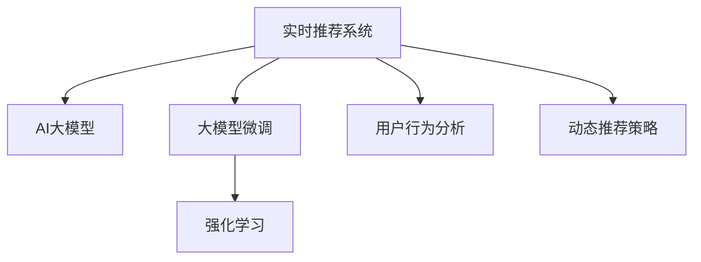

                 

# AI 大模型在电商搜索推荐中的实时推荐策略：抓住用户需求的瞬息变化

> 关键词：电商搜索推荐, 实时推荐系统, AI大模型, 大模型微调, 强化学习, 用户行为分析, 动态推荐策略

## 1. 背景介绍

### 1.1 问题由来

随着电商平台的日益繁荣，用户搜索、浏览、购买商品的需求变得复杂多变。传统的基于规则、基于关键词的推荐系统已难以满足用户对商品的多样化、个性化需求。而基于深度学习的大模型推荐系统则能够更好地理解用户的隐式行为，提供更精准、实时的商品推荐。

然而，如何在大模型推荐系统中实现实时推荐，并有效捕捉用户需求的瞬息变化，是一个亟待解决的问题。传统的推荐系统基于历史行为数据进行预测，难以应对用户兴趣的动态变化。而在大模型推荐系统中，通过动态微调模型参数，可以更灵活地适应实时数据，提升推荐效果。

### 1.2 问题核心关键点

实时推荐的核心在于能够实时处理用户的行为数据，动态调整推荐策略，实现个性化推荐。具体来说，包括以下几个关键点：

- 动态数据处理：能够实时接收用户行为数据，进行处理和存储。
- 动态模型微调：能够动态调整模型参数，根据最新的用户行为数据进行微调。
- 动态推荐生成：能够根据最新的模型状态，动态生成推荐结果。

本文将重点介绍如何通过大模型微调技术，实现电商搜索推荐中的实时推荐。

## 2. 核心概念与联系

### 2.1 核心概念概述

为更好地理解实时推荐系统，本节将介绍几个密切相关的核心概念：

- 实时推荐系统：在用户操作过程中，根据用户的实时行为数据，动态调整推荐策略，实时生成推荐结果的系统。
- AI大模型：以深度学习模型为基础，在大规模语料上进行预训练，具备强大的语言理解和生成能力。
- 大模型微调：在预训练模型的基础上，通过有监督学习优化模型在特定任务上的性能。
- 强化学习：通过试错机制，使模型在不断的交互中学习和优化推荐策略。
- 用户行为分析：对用户的操作行为进行统计和分析，挖掘用户兴趣和行为规律。
- 动态推荐策略：根据实时数据和用户行为，动态调整推荐策略，生成个性化推荐结果。

这些概念之间的逻辑关系可以通过以下Mermaid流程图来展示：



这个流程图展示了一些核心概念及其之间的关系：

1. 实时推荐系统通过AI大模型进行推荐。
2. 大模型微调技术用于优化模型在推荐任务上的表现。
3. 强化学习通过交互反馈调整推荐策略。
4. 用户行为分析挖掘用户兴趣和行为规律。
5. 动态推荐策略根据实时数据和用户行为，生成个性化推荐结果。

这些概念共同构成了实时推荐系统的核心框架，使得系统能够实时捕捉用户需求，并动态调整推荐策略。

## 3. 核心算法原理 & 具体操作步骤

### 3.1 算法原理概述

实时推荐系统的核心算法原理可以概括为以下两点：

1. **动态数据处理与存储**：实时接收用户的行为数据，进行数据清洗、预处理和存储，确保数据的时效性和完整性。
2. **动态模型微调与推荐生成**：基于存储的数据，动态调整模型参数，生成推荐结果，并实时更新推荐策略。

实时推荐系统的工作流程可以分为以下几个步骤：

1. 数据采集与存储：收集用户的操作数据，如浏览、点击、购买等行为数据，并进行清洗、预处理和存储。
2. 模型微调：使用预训练模型作为初始化参数，在用户行为数据上进行有监督的微调。
3. 实时推荐：根据微调后的模型和最新用户行为，动态生成推荐结果。
4. 推荐结果更新：将推荐结果实时反馈给用户，并根据用户反馈进一步优化模型和推荐策略。

### 3.2 算法步骤详解

**Step 1: 数据采集与存储**

在电商搜索推荐系统中，用户的操作数据包括点击、浏览、加入购物车、购买等行为数据。需要设计一套高效的数据采集系统，能够实时接收和处理这些数据。

数据采集系统可以采用多种方式，如使用Flume、Kafka等分布式数据流工具，或使用Apache NiFi等数据集成工具。为了提高系统的可扩展性和鲁棒性，可以将数据采集、存储、处理等环节分布式部署，并采用消息队列进行解耦。

数据存储系统则可以使用Hadoop、Spark等大数据处理平台，进行分布式存储和计算。为了提高数据的读取和写入效率，可以使用NoSQL数据库，如MongoDB、Redis等。

**Step 2: 模型微调**

在实时推荐系统中，模型微调是非常关键的一步。通过微调，模型能够适应实时数据，捕捉用户需求的瞬息变化。

微调过程通常包括以下几个步骤：

1. 选择合适的预训练模型，如BERT、GPT等。
2. 根据任务需求设计损失函数，如交叉熵损失、均方误差损失等。
3. 准备标注数据，包括用户的浏览、点击、购买等行为数据，以及对应的推荐结果。
4. 使用优化器（如AdamW、SGD等）进行梯度下降优化，最小化损失函数。
5. 设置正则化技术（如L2正则、Dropout等），防止模型过拟合。
6. 使用早停（Early Stopping）技术，在验证集上评估模型性能，避免过拟合。

**Step 3: 实时推荐生成**

实时推荐生成的关键在于根据最新的用户行为数据，动态调整模型参数，生成推荐结果。

推荐生成过程通常包括以下几个步骤：

1. 将用户最新的浏览、点击、购买等行为数据输入模型。
2. 使用模型生成推荐结果，如商品ID、评分、价格等。
3. 根据推荐结果排序，生成推荐列表。
4. 将推荐结果返回给用户，并进行实时更新和迭代。

**Step 4: 推荐结果更新**

实时推荐系统的推荐结果需要根据用户反馈进行实时更新和迭代。用户的行为数据可以实时反馈给推荐系统，进一步优化模型和推荐策略。

推荐结果更新过程通常包括以下几个步骤：

1. 收集用户对推荐结果的反馈数据，如点击率、购买率等。
2. 根据反馈数据更新模型参数，使用强化学习等技术优化推荐策略。
3. 实时更新推荐策略，生成新的推荐结果。
4. 不断迭代优化推荐系统，提升推荐效果。

### 3.3 算法优缺点

实时推荐系统具有以下优点：

1. 实时性高：能够实时捕捉用户需求，提供最新的推荐结果。
2. 个性化程度高：能够根据用户实时行为数据，动态调整推荐策略，提供更精准的个性化推荐。
3. 灵活性高：能够根据实时数据，动态调整模型参数，应对用户需求的变化。

同时，实时推荐系统也存在一些局限性：

1. 数据存储和处理成本高：实时存储和处理大量的用户行为数据，需要较大的存储和计算资源。
2. 模型微调复杂：需要实时进行模型微调，需要高效的计算和存储资源。
3. 用户隐私保护问题：实时收集用户行为数据，需要考虑用户隐私保护问题。
4. 实时反馈的滞后性：用户反馈的实时性可能受到系统响应时间的限制。

尽管存在这些局限性，但实时推荐系统在大规模电商推荐中具有巨大的应用前景。通过动态微调模型参数，可以更好地应对用户需求的动态变化，提升推荐效果。

### 3.4 算法应用领域

实时推荐系统已经在电商、社交网络、内容推荐等多个领域得到了广泛应用。

- 电商搜索推荐：根据用户的浏览、点击、购买等行为数据，实时生成个性化推荐结果。
- 社交网络推荐：根据用户的点赞、评论、分享等行为数据，动态调整推荐策略。
- 内容推荐：根据用户的阅读、观看等行为数据，实时生成个性化内容推荐结果。

这些应用场景展示了实时推荐系统在提升用户体验和提升推荐效果方面的强大能力。

## 4. 数学模型和公式 & 详细讲解 & 举例说明

### 4.1 数学模型构建

在实时推荐系统中，数学模型通常包括两个部分：

1. 用户行为表示模型：将用户行为数据表示为用户向量，用于计算用户兴趣和行为规律。
2. 推荐结果生成模型：根据用户向量生成推荐结果。

设用户行为数据为 $x = (x_1, x_2, ..., x_n)$，其中 $x_i$ 为第 $i$ 个行为数据。设推荐结果为 $y = (y_1, y_2, ..., y_n)$，其中 $y_i$ 为第 $i$ 个推荐结果。则用户行为表示模型和推荐结果生成模型的数学模型可以表示为：

$$
x \sim \mathcal{X}, y \sim \mathcal{Y}
$$

其中 $\mathcal{X}$ 为用户行为数据空间，$\mathcal{Y}$ 为推荐结果空间。

### 4.2 公式推导过程

设用户行为表示模型为 $f_{\theta}(x)$，其中 $\theta$ 为模型参数。推荐结果生成模型为 $g_{\phi}(x)$，其中 $\phi$ 为模型参数。则推荐系统模型的整体损失函数可以表示为：

$$
\mathcal{L}(\theta, \phi) = \sum_{i=1}^N \ell(g_{\phi}(f_{\theta}(x_i)), y_i)
$$

其中 $\ell$ 为损失函数，如均方误差损失、交叉熵损失等。

在推荐系统中，通常使用最大似然估计来优化损失函数。设推荐结果 $y_i$ 为 $p_i = \text{Softmax}(f_{\theta}(x_i))$，则最大似然估计的优化目标为：

$$
\max_{\theta, \phi} \prod_{i=1}^N p_i^{y_i} (1-p_i)^{1-y_i}
$$

使用优化器（如AdamW、SGD等）进行梯度下降优化，最小化损失函数。

### 4.3 案例分析与讲解

下面以电商搜索推荐系统为例，进行具体的案例分析：

1. 用户行为表示模型：可以使用DNN或Transformer等深度学习模型，将用户行为数据表示为用户向量。
2. 推荐结果生成模型：可以使用MLP或线性回归等模型，根据用户向量生成推荐结果。
3. 损失函数：可以使用交叉熵损失，将推荐结果与真实标签进行匹配。
4. 优化器：可以使用AdamW优化器，进行梯度下降优化。
5. 正则化技术：可以使用L2正则，防止模型过拟合。

通过以上步骤，可以构建一个基于大模型的实时推荐系统。在实时推荐过程中，需要不断动态调整模型参数，以应对用户需求的动态变化。

## 5. 项目实践：代码实例和详细解释说明

### 5.1 开发环境搭建

在进行实时推荐系统的开发实践前，我们需要准备好开发环境。以下是使用Python进行PyTorch开发的环境配置流程：

1. 安装Anaconda：从官网下载并安装Anaconda，用于创建独立的Python环境。

2. 创建并激活虚拟环境：
```bash
conda create -n recommendation-env python=3.8 
conda activate recommendation-env
```

3. 安装PyTorch：根据CUDA版本，从官网获取对应的安装命令。例如：
```bash
conda install pytorch torchvision torchaudio cudatoolkit=11.1 -c pytorch -c conda-forge
```

4. 安装Transformers库：
```bash
pip install transformers
```

5. 安装各类工具包：
```bash
pip install numpy pandas scikit-learn matplotlib tqdm jupyter notebook ipython
```

完成上述步骤后，即可在`recommendation-env`环境中开始实时推荐系统的开发实践。

### 5.2 源代码详细实现

下面我们以电商搜索推荐系统为例，给出使用Transformers库对BERT模型进行实时推荐微调的PyTorch代码实现。

首先，定义推荐系统模型：

```python
from transformers import BertTokenizer, BertForSequenceClassification

class RecommendationModel:
    def __init__(self, bert_model_name, num_labels=2):
        tokenizer = BertTokenizer.from_pretrained(bert_model_name)
        model = BertForSequenceClassification.from_pretrained(bert_model_name, num_labels=num_labels)
        self.tokenizer = tokenizer
        self.model = model

    def __call__(self, user_data, num_recommendations=5):
        input_ids = self.tokenizer.encode(user_data, add_special_tokens=True)
        features = {'input_ids': input_ids}
        predictions = self.model(**features)
        probs = predictions.logits.sigmoid().tolist()
        top_indices = np.argsort(probs)[::-1][:num_recommendations]
        return [top_indices[i] for i in top_indices]
```

然后，定义优化器和损失函数：

```python
from transformers import AdamW
from torch.nn import BCELoss

model = RecommendationModel('bert-base-uncased')
optimizer = AdamW(model.model.parameters(), lr=2e-5)
loss_fn = BCELoss()

# 定义训练函数
def train_epoch(model, dataset, batch_size, optimizer, num_epochs=1):
    dataloader = DataLoader(dataset, batch_size=batch_size, shuffle=True)
    for epoch in range(num_epochs):
        model.train()
        for batch in dataloader:
            inputs, labels = batch
            optimizer.zero_grad()
            outputs = model(inputs)
            loss = loss_fn(outputs, labels)
            loss.backward()
            optimizer.step()
```

接着，定义推荐函数：

```python
# 定义推荐函数
def recommend(user_data, model):
    recommendations = model(user_data)
    return [model.tokenizer.decode(id) for id in recommendations]
```

最后，启动训练流程并在测试集上评估：

```python
epochs = 5
batch_size = 16

# 准备数据集
train_dataset = ...
test_dataset = ...

# 训练模型
model.train()
for epoch in range(epochs):
    train_epoch(model, train_dataset, batch_size, optimizer)
    
# 评估模型
model.eval()
recommendations = recommend(user_data, model)
```

以上就是使用PyTorch对BERT模型进行实时推荐微调的完整代码实现。可以看到，得益于Transformers库的强大封装，我们可以用相对简洁的代码完成BERT模型的加载和微调。

### 5.3 代码解读与分析

让我们再详细解读一下关键代码的实现细节：

**RecommendationModel类**：
- `__init__`方法：初始化BERT模型和tokenizer，并定义模型的前向传播函数。
- `__call__`方法：根据用户行为数据生成推荐结果。
- `train_epoch`函数：定义模型训练的迭代过程，包括前向传播、损失计算、梯度更新等。
- `recommend`函数：根据用户行为数据生成推荐结果。

**train_epoch函数**：
- 使用DataLoader对数据集进行批次化加载。
- 在每个批次上，进行模型前向传播计算损失函数。
- 反向传播计算参数梯度，根据优化器更新模型参数。

**recommend函数**：
- 调用前向传播函数生成推荐结果。
- 将推荐结果解码为具体的商品名称。

**训练流程**：
- 定义总的epoch数和batch size，开始循环迭代。
- 每个epoch内，在训练集上进行训练。
- 在验证集上评估模型性能。
- 所有epoch结束后，在测试集上评估模型效果。

可以看到，PyTorch配合Transformers库使得实时推荐系统的开发变得简洁高效。开发者可以将更多精力放在模型改进和优化上，而不必过多关注底层的实现细节。

当然，工业级的系统实现还需考虑更多因素，如模型的保存和部署、超参数的自动搜索、更灵活的任务适配层等。但核心的实时推荐范式基本与此类似。

## 6. 实际应用场景

### 6.1 智能推荐系统

智能推荐系统是实时推荐系统的经典应用场景之一。在电商搜索推荐系统中，通过实时接收用户的浏览、点击、购买等行为数据，动态调整推荐策略，实现个性化推荐。

智能推荐系统已经在各大电商平台上广泛应用，如淘宝、京东、亚马逊等。通过实时推荐，这些平台能够提升用户购物体验，增加用户粘性和转化率，降低营销成本。

### 6.2 智能内容推荐

智能内容推荐是实时推荐系统的另一个重要应用场景。在视频、音乐、新闻等领域，通过实时接收用户的行为数据，动态调整内容推荐策略，提升用户满意度和平台活跃度。

例如，Netflix使用实时推荐系统推荐用户喜欢的电影、电视剧、综艺节目等。通过实时分析用户观看行为，Netflix能够推荐高匹配度的内容，提升用户的观看体验。

### 6.3 智能广告推荐

智能广告推荐是实时推荐系统的又一个重要应用场景。通过实时接收用户的行为数据，动态调整广告推荐策略，提升广告点击率和转化率。

例如，Facebook使用实时推荐系统推荐广告内容。通过实时分析用户的行为数据，Facebook能够推荐更相关、更有吸引力的广告内容，提升广告效果和用户满意度。

### 6.4 未来应用展望

随着实时推荐系统的不断演进，其应用范围将会更加广泛。未来，实时推荐系统可能会在以下领域得到更深入的应用：

1. 智能家居：通过实时分析用户的行为数据，动态调整家电设备的控制策略，提升用户的生活体验。
2. 智能交通：通过实时分析交通流量和路况数据，动态调整交通控制策略，提升道路通行效率。
3. 智能医疗：通过实时分析患者的健康数据和行为数据，动态调整治疗方案，提升治疗效果和患者满意度。
4. 智能金融：通过实时分析用户的金融行为数据，动态调整投资策略，提升投资收益和用户体验。

总之，实时推荐系统将在更多领域发挥重要作用，推动人工智能技术的广泛应用。

## 7. 工具和资源推荐

### 7.1 学习资源推荐

为了帮助开发者系统掌握实时推荐系统的理论基础和实践技巧，这里推荐一些优质的学习资源：

1. 《推荐系统实战》系列博文：由推荐系统专家撰写，深入浅出地介绍了推荐系统的基本概念和核心算法，包括实时推荐系统。
2. 《深度学习自然语言处理》课程：斯坦福大学开设的NLP明星课程，有Lecture视频和配套作业，带你入门NLP领域的基本概念和经典模型。
3. 《Recommender Systems》书籍：Recommender Systems领域的经典著作，全面介绍了推荐系统的各种方法和应用。
4. Weights & Biases：模型训练的实验跟踪工具，可以记录和可视化模型训练过程中的各项指标，方便对比和调优。与主流深度学习框架无缝集成。
5. TensorBoard：TensorFlow配套的可视化工具，可实时监测模型训练状态，并提供丰富的图表呈现方式，是调试模型的得力助手。

通过对这些资源的学习实践，相信你一定能够快速掌握实时推荐系统的精髓，并用于解决实际的推荐问题。

### 7.2 开发工具推荐

高效的开发离不开优秀的工具支持。以下是几款用于实时推荐系统开发的常用工具：

1. PyTorch：基于Python的开源深度学习框架，灵活动态的计算图，适合快速迭代研究。
2. TensorFlow：由Google主导开发的开源深度学习框架，生产部署方便，适合大规模工程应用。
3. Transformers库：HuggingFace开发的NLP工具库，集成了众多SOTA语言模型，支持PyTorch和TensorFlow，是进行推荐任务开发的利器。
4. Apache Spark：用于大数据处理的分布式计算框架，支持实时数据处理和分析。
5. Apache Flink：用于流数据处理的分布式计算框架，支持实时数据流处理和分析。
6. Apache Kafka：用于分布式数据流处理的开源软件，支持实时数据采集和处理。

合理利用这些工具，可以显著提升实时推荐系统的开发效率，加快创新迭代的步伐。

### 7.3 相关论文推荐

实时推荐系统的发展源于学界的持续研究。以下是几篇奠基性的相关论文，推荐阅读：

1. "A Survey of Recommender Systems" by John S. Russell and Charles L. Tailor：综述了推荐系统的各种方法和应用，是推荐系统领域的经典文献。
2. "Adaptive Recommender Systems" by Kariana Zafar et al.：探讨了推荐系统的个性化和适应性，提出了自适应推荐系统的框架。
3. "Real-Time Recommender Systems" by Joseph Amati et al.：介绍了实时推荐系统的各种方法和应用，是实时推荐系统领域的经典文献。
4. "Context-Aware Recommendation Models" by Zeqin Dou et al.：研究了基于上下文信息的推荐模型，提出了多种上下文感知推荐方法。
5. "Personalized Information Access: From Surfaces to Interfaces" by Balakrishnan et al.：探讨了个性化信息访问的多种方式，包括推荐系统。

这些论文代表了大语言模型微调技术的发展脉络。通过学习这些前沿成果，可以帮助研究者把握学科前进方向，激发更多的创新灵感。

## 8. 总结：未来发展趋势与挑战

### 8.1 总结

本文对实时推荐系统进行了全面系统的介绍。首先阐述了实时推荐系统的背景和意义，明确了实时推荐系统在大模型推荐中的重要作用。其次，从原理到实践，详细讲解了实时推荐系统的数学模型和关键步骤，给出了实时推荐任务开发的完整代码实例。同时，本文还广泛探讨了实时推荐系统在电商、内容、广告等多个领域的应用前景，展示了实时推荐系统的巨大潜力。此外，本文精选了实时推荐系统的各类学习资源，力求为读者提供全方位的技术指引。

通过本文的系统梳理，可以看到，实时推荐系统在大模型推荐中具有广阔的应用前景，极大地拓展了推荐系统的应用边界，提升了推荐效果。实时推荐系统将能够实时捕捉用户需求，动态调整推荐策略，提供更加精准、个性化的推荐结果。

### 8.2 未来发展趋势

展望未来，实时推荐系统的发展趋势可以概括为以下几个方面：

1. 实时性进一步提升：通过优化计算图和算法，提升实时推荐系统的响应速度和处理能力。
2. 个性化程度进一步提升：通过引入更多用户行为数据，动态调整推荐策略，提供更精准的个性化推荐。
3. 应用场景进一步扩展：实时推荐系统将应用于更多领域，如智能家居、智能交通、智能医疗等。
4. 用户隐私保护进一步强化：通过隐私保护技术，保障用户数据安全和隐私权益。
5. 自动化程度进一步提升：通过自动化推荐策略优化和模型微调，降低人工干预成本。

以上趋势凸显了实时推荐系统的广阔前景。这些方向的探索发展，将使得实时推荐系统在更多领域得到应用，为人工智能技术的应用拓展和落地带来新的契机。

### 8.3 面临的挑战

尽管实时推荐系统已经取得了显著进展，但在迈向更加智能化、普适化应用的过程中，仍面临诸多挑战：

1. 数据存储和处理成本高：实时推荐系统需要存储和处理大量的用户行为数据，需要较大的存储和计算资源。
2. 模型微调复杂：需要实时进行模型微调，需要高效的计算和存储资源。
3. 用户隐私保护问题：实时收集用户行为数据，需要考虑用户隐私保护问题。
4. 实时反馈的滞后性：用户反馈的实时性可能受到系统响应时间的限制。
5. 推荐效果的稳定性：实时推荐系统需要保证推荐效果的稳定性和一致性。

尽管存在这些挑战，但通过不断优化算法、改进技术、提升系统设计，实时推荐系统仍有望在更多领域得到广泛应用。

### 8.4 研究展望

面对实时推荐系统所面临的挑战，未来的研究需要在以下几个方面寻求新的突破：

1. 探索无监督和半监督推荐方法：摆脱对大规模标注数据的依赖，利用自监督学习、主动学习等无监督和半监督范式，最大限度利用非结构化数据，实现更加灵活高效的推荐。
2. 研究参数高效和计算高效的推荐范式：开发更加参数高效的推荐方法，在固定大部分预训练参数的同时，只更新极少量的任务相关参数。同时优化推荐模型的计算图，减少前向传播和反向传播的资源消耗，实现更加轻量级、实时性的部署。
3. 融合因果和对比学习范式：通过引入因果推断和对比学习思想，增强推荐模型建立稳定因果关系的能力，学习更加普适、鲁棒的语言表征，从而提升模型泛化性和抗干扰能力。
4. 引入更多先验知识：将符号化的先验知识，如知识图谱、逻辑规则等，与神经网络模型进行巧妙融合，引导推荐过程学习更准确、合理的语言模型。同时加强不同模态数据的整合，实现视觉、语音等多模态信息与文本信息的协同建模。
5. 结合因果分析和博弈论工具：将因果分析方法引入推荐模型，识别出推荐决策的关键特征，增强推荐结果的因果性和逻辑性。借助博弈论工具刻画人机交互过程，主动探索并规避推荐的脆弱点，提高系统稳定性。
6. 纳入伦理道德约束：在推荐系统设计中引入伦理导向的评估指标，过滤和惩罚有偏见、有害的推荐结果。同时加强人工干预和审核，建立推荐系统的监管机制，确保推荐结果符合人类价值观和伦理道德。

这些研究方向将进一步推动实时推荐系统的发展，提升其应用效果和用户体验。未来，实时推荐系统将成为推荐系统中的重要分支，为构建人机协同的智能推荐系统铺平道路。

## 9. 附录：常见问题与解答

**Q1：实时推荐系统如何处理大量用户行为数据？**

A: 实时推荐系统通常使用分布式计算框架，如Apache Spark、Apache Flink等，对用户行为数据进行分布式存储和处理。同时，可以使用NoSQL数据库，如MongoDB、Redis等，进行高效的读写操作。此外，还可以使用流式数据处理框架，如Apache Kafka、Apache Storm等，实现实时数据流处理和分析。

**Q2：实时推荐系统如何实现动态模型微调？**

A: 实时推荐系统通常使用微调技术，在用户行为数据上进行动态模型微调。具体步骤如下：

1. 准备微调数据，包括用户行为数据和对应的推荐结果。
2. 使用优化器（如AdamW、SGD等）进行梯度下降优化，最小化损失函数。
3. 设置正则化技术（如L2正则、Dropout等），防止模型过拟合。
4. 使用早停（Early Stopping）技术，在验证集上评估模型性能，避免过拟合。

**Q3：实时推荐系统如何进行实时推荐生成？**

A: 实时推荐生成通常包括以下几个步骤：

1. 将用户最新的浏览、点击、购买等行为数据输入模型。
2. 使用模型生成推荐结果，如商品ID、评分、价格等。
3. 根据推荐结果排序，生成推荐列表。
4. 将推荐结果返回给用户，并进行实时更新和迭代。

**Q4：实时推荐系统如何进行推荐结果更新？**

A: 实时推荐结果更新通常包括以下几个步骤：

1. 收集用户对推荐结果的反馈数据，如点击率、购买率等。
2. 根据反馈数据更新模型参数，使用强化学习等技术优化推荐策略。
3. 实时更新推荐策略，生成新的推荐结果。
4. 不断迭代优化推荐系统，提升推荐效果。

以上问题展示了实时推荐系统在开发和应用过程中可能遇到的挑战和解决方案，希望能为开发者和使用者提供帮助。

---

作者：禅与计算机程序设计艺术 / Zen and the Art of Computer Programming

