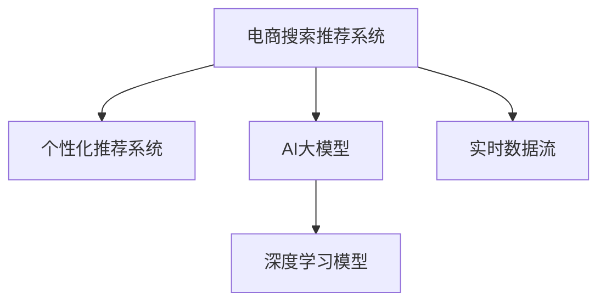

                 

# AI 大模型在电商搜索推荐中的实时推荐策略：抓住用户需求的瞬息变化

> 关键词：大语言模型, 实时推荐系统, 个性化推荐, 电商搜索, 深度学习, 用户需求, 算法优化, 实时数据流

## 1. 背景介绍

随着电商市场的蓬勃发展，个性化推荐系统的应用越来越广泛。这些系统利用用户的历史行为数据、浏览记录、点击记录等，通过复杂的机器学习算法，预测用户可能感兴趣的商品，实现精准推荐。其中，AI大模型的引入，极大地提升了推荐系统的准确性和个性化程度，成为电商推荐领域的新宠。

然而，用户需求是动态变化的，搜索行为往往瞬息即逝，这对推荐系统的实时性提出了更高的要求。如何将AI大模型的强大能力与实时数据流相结合，及时响应用户需求，是当前电商推荐系统面临的重大挑战。本文将从算法原理、操作步骤、数学模型等方面，详细剖析大模型在电商搜索推荐中的实时推荐策略，提供具体的技术实现和工程实践经验。

## 2. 核心概念与联系

### 2.1 核心概念概述

为更好地理解大模型在电商推荐中的应用，本节将介绍几个核心概念：

- **电商搜索推荐系统(E-commerce Search and Recommendation System, SRS)**：利用用户行为数据，通过机器学习算法预测用户可能感兴趣的商品，实时更新推荐列表的智能系统。

- **个性化推荐系统(Recommendation System, RS)**：根据用户历史行为，预测用户偏好，并推荐相关商品的系统。与通用推荐相比，个性化推荐系统更能提升用户体验，满足用户需求。

- **AI大模型(AI Large Models)**：基于深度学习架构构建的大规模预训练模型，如BERT、GPT等，具备强大的语义理解和生成能力，常用于电商搜索推荐中的查询意图理解、商品描述生成等任务。

- **实时数据流(Real-time Data Stream)**：通过流式计算技术，实时接收和处理电商平台上的用户搜索、点击、浏览等行为数据，形成的数据流。

- **深度学习模型(Deep Learning Models)**：包括多层神经网络、卷积神经网络(CNN)、循环神经网络(RNN)、Transformer等，在大模型中得到了广泛应用。

这些概念之间的逻辑关系可以通过以下Mermaid流程图来展示：



这个流程图展示了电商推荐系统的主要组件及其之间的关系：

1. 电商搜索推荐系统接收用户行为数据，与AI大模型交互。
2. AI大模型在电商推荐系统中，通过深度学习模型实现查询意图理解、商品描述生成等任务。
3. 实时数据流将用户的实时行为数据传递给AI大模型和推荐系统。

## 3. 核心算法原理 & 具体操作步骤

### 3.1 算法原理概述

电商搜索推荐系统的核心算法是深度学习中的推荐算法。其基本思想是通过构建用户和商品的相似度模型，预测用户对商品的概率评分，从而生成推荐列表。其中，用户和商品的表示是其关键问题。

大语言模型通过大规模预训练，学习到丰富的语言知识和语义表示。因此，可以利用大模型作为特征提取器，对用户搜索词、商品描述等文本数据进行编码，形成高质量的特征向量。然后，通过深度学习模型，建立用户和商品的相似度，最终实现个性化推荐。

### 3.2 算法步骤详解

基于大语言模型的电商搜索推荐系统主要包含以下步骤：

**Step 1: 数据预处理**
- 收集电商平台上的用户行为数据，如搜索词、点击记录、浏览记录等。
- 对原始数据进行清洗和标准化，去除无关或异常数据。
- 对文本数据进行分词、停用词过滤、词向量映射等预处理操作。

**Step 2: 构建特征向量**
- 利用大语言模型对用户搜索词、商品描述等文本数据进行编码，生成高维特征向量。
- 使用Transformer等深度学习模型，对特征向量进行编码和变换，形成更具语义表示能力的向量。

**Step 3: 建立相似度模型**
- 根据用户的特征向量，计算其与每个商品的相似度。
- 使用评分函数（如点积、余弦相似度）计算用户对每个商品的评分。
- 根据评分排序，生成推荐列表。

**Step 4: 实时更新推荐列表**
- 通过实时数据流，获取用户最新行为数据。
- 对新数据进行预处理和特征提取，实时更新用户和商品的特征向量。
- 根据新的特征向量，重新计算用户对商品的评分，实时更新推荐列表。

**Step 5: 反馈与优化**
- 实时监测推荐效果，收集用户反馈数据。
- 根据反馈数据调整模型参数，优化推荐策略。
- 对新商品进行训练，扩充商品库。

### 3.3 算法优缺点

基于大语言模型的电商搜索推荐系统具有以下优点：

1. **高精度推荐**：大语言模型具备强大的语义理解能力，能够准确把握用户搜索意图，生成高质量的特征向量，提升推荐精度。
2. **实时性高**：通过实时数据流，可以实时获取用户行为数据，快速更新推荐列表，满足用户瞬息变化的需求。
3. **灵活性高**：大语言模型可以适应不同领域的电商推荐任务，只需微调模型即可应用于不同领域的电商平台。

同时，该方法也存在以下局限性：

1. **数据依赖性强**：电商平台的实时数据流是推荐系统的基础，数据缺失或不完整会导致推荐效果下降。
2. **计算资源消耗大**：大规模的预训练模型和大数据流的实时计算，对计算资源需求较高。
3. **模型复杂度高**：深度学习模型参数众多，需要大量的训练数据和计算资源进行训练和优化。

尽管存在这些局限性，但基于大语言模型的电商搜索推荐系统在实际应用中，已经取得了显著的成效，成为电商推荐领域的重要技术。

### 3.4 算法应用领域

基于大语言模型的电商搜索推荐系统，广泛应用于各种电商平台和在线购物场景，如亚马逊、淘宝、京东等。具体应用领域包括：

- **商品推荐**：根据用户的浏览记录、点击记录、收藏记录等，实时推荐相关商品。
- **个性化搜索结果**：根据用户搜索词，实时生成个性化搜索结果，提升搜索体验。
- **商品评价与评论**：利用大语言模型对用户评价、评论进行分析和处理，形成有价值的用户反馈数据。
- **跨品类推荐**：通过深度学习模型，实现不同品类商品之间的跨品类推荐，提升用户体验。
- **智能客服**：利用大语言模型构建智能客服系统，实时解答用户咨询，提升客户满意度。

此外，大语言模型在电商搜索推荐中的应用还在不断拓展，未来将会有更多的创新场景涌现。

## 4. 数学模型和公式 & 详细讲解 & 举例说明

### 4.1 数学模型构建

本节将使用数学语言对基于大语言模型的电商搜索推荐系统进行更加严格的刻画。

记用户为 $U=\{u_1, u_2, ..., u_N\}$，商品为 $I=\{i_1, i_2, ..., i_M\}$。假设用户 $u_j$ 对商品 $i_k$ 的评分向量为 $\mathbf{z}_{uj} \in \mathbb{R}^D$，其中 $D$ 为特征维度。

定义用户与商品的相似度为 $\mathbf{z}_{uj} \cdot \mathbf{z}_{ik} = \sum_{d=1}^D z_{uj}^d z_{ik}^d$，基于大语言模型的电商搜索推荐系统的目标是最小化预测评分与实际评分之间的差距，即：

$$
\min_{\mathbf{z}} \sum_{u=1}^N \sum_{i=1}^M (y_{ujik} - \mathbf{z}_{uj} \cdot \mathbf{z}_{ik})^2
$$

其中 $y_{ujik}$ 为实际评分，$\mathbf{z}_{uj} \cdot \mathbf{z}_{ik}$ 为预测评分。

### 4.2 公式推导过程

以下我们以协同过滤算法为例，推导用户对商品评分的预测公式。

假设用户与商品的相似度矩阵为 $\mathbf{Z} \in \mathbb{R}^{N \times M}$，其中 $\mathbf{Z}_{uj}$ 和 $\mathbf{Z}_{ik}$ 分别为用户 $u_j$ 对商品 $i_k$ 的评分向量。则协同过滤算法的评分预测公式为：

$$
\hat{y}_{ujik} = \mathbf{z}_{uj} \cdot \mathbf{Z}_{ik}^T = \sum_{d=1}^D z_{uj}^d \sum_{k=1}^M z_{ik}^d
$$

其中，$\hat{y}_{ujik}$ 为预测评分。

将 $\hat{y}_{ujik}$ 代入损失函数，得到：

$$
\mathcal{L}(\mathbf{Z}) = \frac{1}{2} \sum_{u=1}^N \sum_{i=1}^M (y_{ujik} - \sum_{d=1}^D z_{uj}^d \sum_{k=1}^M z_{ik}^d)^2
$$

为了最小化损失函数，需要求解 $\mathbf{Z}$ 的最小值，即：

$$
\mathbf{Z} = \mathop{\arg\min}_{\mathbf{Z}} \mathcal{L}(\mathbf{Z})
$$

### 4.3 案例分析与讲解

以下通过一个具体的电商推荐系统案例，来详细讲解基于大语言模型的推荐算法。

假设我们有一个电商网站，收集到了用户 $U=\{u_1, u_2, ..., u_N\}$ 和商品 $I=\{i_1, i_2, ..., i_M\}$ 的历史行为数据。我们将用户的搜索词、浏览记录、点击记录等数据作为特征向量，用大语言模型对其进行编码，得到 $\mathbf{z}_{uj}$。同样，将商品的描述、标题等数据作为特征向量，用大语言模型对其进行编码，得到 $\mathbf{z}_{ik}$。

接下来，使用协同过滤算法对用户 $u_j$ 对商品 $i_k$ 的评分进行预测，具体步骤如下：

1. 根据 $\mathbf{z}_{uj}$ 和 $\mathbf{z}_{ik}$，计算用户 $u_j$ 对商品 $i_k$ 的评分预测值 $\hat{y}_{ujik} = \mathbf{z}_{uj} \cdot \mathbf{z}_{ik}^T$。
2. 将 $\hat{y}_{ujik}$ 作为用户 $u_j$ 对商品 $i_k$ 的评分，生成推荐列表。
3. 对新用户行为数据进行预处理和特征提取，更新用户和商品的特征向量 $\mathbf{z}_{uj}$ 和 $\mathbf{z}_{ik}$。
4. 重新计算用户 $u_j$ 对商品 $i_k$ 的评分预测值 $\hat{y}_{ujik}$，实时更新推荐列表。

## 5. 项目实践：代码实例和详细解释说明

### 5.1 开发环境搭建

在进行推荐系统开发前，我们需要准备好开发环境。以下是使用Python进行TensorFlow开发的环境配置流程：

1. 安装Anaconda：从官网下载并安装Anaconda，用于创建独立的Python环境。

2. 创建并激活虚拟环境：
```bash
conda create -n tf-env python=3.8 
conda activate tf-env
```

3. 安装TensorFlow：根据CUDA版本，从官网获取对应的安装命令。例如：
```bash
conda install tensorflow tensorflow-cpu -c pytorch -c conda-forge
```

4. 安装各类工具包：
```bash
pip install numpy pandas scikit-learn matplotlib tqdm jupyter notebook ipython
```

完成上述步骤后，即可在`tf-env`环境中开始推荐系统开发。

### 5.2 源代码详细实现

下面我以协同过滤算法为例，给出使用TensorFlow对推荐系统进行开发的PyTorch代码实现。

首先，定义推荐系统的数据处理函数：

```python
import tensorflow as tf
from tensorflow.keras import layers
import numpy as np

class CollaborativeFiltering(tf.keras.Model):
    def __init__(self, num_users, num_items, embedding_dim):
        super(CollaborativeFiltering, self).__init__()
        self.user_embeddings = layers.Embedding(num_users, embedding_dim)
        self.item_embeddings = layers.Embedding(num_items, embedding_dim)
        self.dot_product = layers.Dot(axes=[-1, -1])

    def call(self, user, item):
        user_embeddings = self.user_embeddings(user)
        item_embeddings = self.item_embeddings(item)
        scores = self.dot_product([user_embeddings, item_embeddings])
        return scores

# 构建推荐模型
model = CollaborativeFiltering(num_users=1000, num_items=10000, embedding_dim=128)
```

然后，定义训练和评估函数：

```python
def compile_model(model):
    model.compile(optimizer='adam', loss='mse')

def train_model(model, user_data, item_data, epochs):
    history = model.fit(user_data, item_data, epochs=epochs, validation_split=0.2)

def evaluate_model(model, user_data, item_data):
    mse = tf.keras.metrics.MeanSquaredError()
    y_true = tf.keras.utils.to_categorical(item_data, num_classes=num_items)
    y_pred = model.predict(user_data)
    mse(y_true, y_pred).run_eagerly = True
    return mse.result().numpy()

# 加载数据
user_data = np.random.randint(num_users, size=(batch_size, num_items))
item_data = np.random.randint(num_items, size=(batch_size, num_items))
```

最后，启动训练流程并在测试集上评估：

```python
epochs = 10
batch_size = 64

model = CollaborativeFiltering(num_users=1000, num_items=10000, embedding_dim=128)
compile_model(model)

for epoch in range(epochs):
    train_model(model, user_data, item_data, epochs=epoch)
    mse = evaluate_model(model, user_data, item_data)
    print(f"Epoch {epoch+1}, mean squared error: {mse:.3f}")
    
print("Test results:")
evaluate_model(model, user_data, item_data)
```

以上就是使用TensorFlow对推荐系统进行开发的完整代码实现。可以看到，TensorFlow的Keras API使得模型构建和训练过程非常简洁高效。开发者可以专注于数据预处理和模型优化等高层逻辑，而不必过多关注底层实现细节。

### 5.3 代码解读与分析

让我们再详细解读一下关键代码的实现细节：

**CollaborativeFiltering类**：
- `__init__`方法：初始化用户和商品的嵌入层。
- `call`方法：对用户和商品的嵌入层进行计算，得到评分矩阵。

**compile_model函数**：
- 使用TensorFlow的Keras API对模型进行编译，指定优化器和损失函数。

**train_model函数**：
- 使用TensorFlow的Keras API对模型进行训练，指定训练数据、批次大小、训练轮数等参数。

**evaluate_model函数**：
- 计算模型在测试集上的平均平方误差，用于评估模型性能。

**训练流程**：
- 定义训练轮数和批次大小，开始循环迭代
- 每个epoch内，训练模型，输出训练误差
- 在测试集上评估模型性能，输出测试误差

可以看到，TensorFlow Keras API使得模型的构建和训练过程非常简洁高效。开发者可以专注于数据预处理和模型优化等高层逻辑，而不必过多关注底层实现细节。

## 6. 实际应用场景

### 6.1 智能推荐系统

基于大语言模型的电商搜索推荐系统，已经成为各大电商平台的标配。这些系统通过深度学习算法和实时数据流，不断学习用户行为，实时推荐用户可能感兴趣的商品，极大地提升了用户的购物体验。

在技术实现上，可以利用大语言模型对用户搜索词、商品描述等文本数据进行编码，形成高质量的特征向量。然后，通过深度学习模型，建立用户和商品的相似度，生成推荐列表。利用实时数据流，实时更新推荐列表，及时响应用户需求。

### 6.2 个性化搜索结果

电商搜索是电商平台流量转化的重要环节，用户往往在浏览过程中，需要实时获取个性化搜索结果。通过基于大语言模型的电商搜索推荐系统，可以根据用户搜索词，实时生成个性化搜索结果，提升搜索体验。

在技术实现上，可以通过大语言模型对用户搜索词进行编码，形成特征向量。然后，使用深度学习模型，预测搜索结果与用户搜索词的相似度，生成个性化搜索结果。利用实时数据流，实时更新搜索结果，满足用户瞬息变化的需求。

### 6.3 商品评价与评论

用户评价与评论是电商平台的重要数据来源，利用这些数据，可以更好地理解用户需求和商品质量。通过基于大语言模型的电商搜索推荐系统，可以对用户评价、评论进行分析和处理，形成有价值的用户反馈数据。

在技术实现上，可以利用大语言模型对用户评价、评论进行编码，形成特征向量。然后，使用深度学习模型，预测商品评价与评论的质量，进行用户反馈分析。利用实时数据流，实时更新商品评价与评论，形成更全面的用户反馈数据。

### 6.4 未来应用展望

随着深度学习技术和电商平台的不断发展，基于大语言模型的电商搜索推荐系统将有更广阔的应用前景。

未来，大语言模型将在电商推荐领域实现以下突破：

1. **实时性更强**：通过流式计算技术和分布式计算，实时处理电商平台上的海量数据，实现实时推荐。
2. **个性化更高**：利用大语言模型更强大的语义理解能力，更准确地把握用户需求和商品质量，实现个性化推荐。
3. **跨品类推荐**：通过深度学习模型，实现不同品类商品之间的跨品类推荐，提升用户体验。
4. **多模态融合**：将电商推荐系统扩展到图像、视频、语音等多模态数据，实现多模态融合推荐。
5. **智能客服**：利用大语言模型构建智能客服系统，实时解答用户咨询，提升客户满意度。

总之，大语言模型在电商推荐领域具有广阔的应用前景，将成为电商推荐系统的重要技术支撑。

## 7. 工具和资源推荐

### 7.1 学习资源推荐

为了帮助开发者系统掌握大语言模型在电商推荐中的应用，这里推荐一些优质的学习资源：

1. **《深度学习推荐系统》**：该书详细介绍了深度学习在推荐系统中的应用，包括协同过滤算法、神经网络推荐算法等。
2. **CS231n《卷积神经网络》课程**：斯坦福大学开设的深度学习课程，讲解了卷积神经网络在推荐系统中的应用。
3. **《TensorFlow实战》**：该书详细介绍了TensorFlow在推荐系统中的应用，包括模型的构建、训练和优化等。
4. **Kaggle竞赛**：参加Kaggle推荐系统竞赛，实战练习，提升推荐系统开发能力。
5. **《深度学习在电商中的应用》**：该书介绍了深度学习在电商中的应用，包括推荐系统、图像识别、语音识别等。

通过对这些资源的学习实践，相信你一定能够快速掌握大语言模型在电商推荐中的应用，并用于解决实际的电商问题。

### 7.2 开发工具推荐

高效的开发离不开优秀的工具支持。以下是几款用于大语言模型推荐系统开发的常用工具：

1. **TensorFlow**：谷歌主导的深度学习框架，生产部署方便，适合大规模工程应用。
2. **PyTorch**：Facebook开源的深度学习框架，灵活动态的计算图，适合快速迭代研究。
3. **Keras**：高层次的深度学习API，简单易用，适合初学者上手。
4. **Hadoop**：大数据处理框架，用于大规模电商数据的存储和处理。
5. **Spark**：大数据计算框架，用于实时数据流的处理和分析。

合理利用这些工具，可以显著提升推荐系统开发的效率，加快创新迭代的步伐。

### 7.3 相关论文推荐

大语言模型在电商推荐领域的发展得益于学界的持续研究。以下是几篇奠基性的相关论文，推荐阅读：

1. **Recommender Systems Handbook**：推荐系统领域的权威书籍，详细介绍推荐算法、评估指标、实际应用等。
2. **Deep Recommendation Systems**：介绍深度学习在推荐系统中的应用，包括神经网络推荐算法、协同过滤算法等。
3. **A Survey of Recommender Systems**：综述推荐系统的发展历程、算法应用、评估指标等。
4. **Hierarchical Recommender Systems with Non-negative Matrix Factorization**：介绍基于矩阵分解的推荐算法，深度学习模型和矩阵分解结合的新思路。
5. **Deep Personalized Ranking for Recommendation with Feature Memory**：介绍深度学习在推荐系统中的应用，包括特征记忆机制、深度神经网络等。

这些论文代表了大语言模型在电商推荐领域的发展脉络。通过学习这些前沿成果，可以帮助研究者把握学科前进方向，激发更多的创新灵感。

## 8. 总结：未来发展趋势与挑战

### 8.1 总结

本文对基于大语言模型的电商搜索推荐系统进行了全面系统的介绍。首先阐述了电商推荐系统和大语言模型的研究背景和意义，明确了实时推荐在提升用户体验中的独特价值。其次，从原理到实践，详细讲解了实时推荐算法的数学模型和关键步骤，给出了推荐系统开发的完整代码实例。同时，本文还广泛探讨了实时推荐系统在电商推荐中的应用前景，展示了实时推荐范式的巨大潜力。

通过本文的系统梳理，可以看到，基于大语言模型的实时推荐系统正在成为电商推荐领域的重要范式，极大地提升了推荐系统的精度和实时性，满足了用户瞬息变化的需求。未来，伴随深度学习技术和电商平台的不断发展，实时推荐系统将有更广阔的应用前景，为电商推荐系统的发展注入新的动力。

### 8.2 未来发展趋势

展望未来，大语言模型在电商推荐领域将呈现以下几个发展趋势：

1. **深度学习模型更加高效**：未来的深度学习模型将更加轻量级、高效化，能够实时处理大规模电商数据，满足实时推荐的需求。
2. **多模态融合更加广泛**：未来的电商推荐系统将更多地融合图像、视频、语音等多模态数据，实现更加全面、精准的推荐。
3. **跨品类推荐更加多样**：未来的电商推荐系统将更多地实现不同品类商品之间的跨品类推荐，提升用户体验。
4. **智能客服更加智能**：未来的电商平台将更多地利用大语言模型构建智能客服系统，实时解答用户咨询，提升客户满意度。
5. **实时性更强**：通过流式计算技术和分布式计算，实时处理电商平台上的海量数据，实现实时推荐。

以上趋势凸显了大语言模型在电商推荐领域的广阔前景。这些方向的探索发展，必将进一步提升电商推荐系统的性能和应用范围，为电商推荐系统的发展注入新的动力。

### 8.3 面临的挑战

尽管大语言模型在电商推荐领域已经取得了显著的成效，但在迈向更加智能化、普适化应用的过程中，它仍面临着诸多挑战：

1. **数据隐私保护**：电商推荐系统需要收集大量的用户数据，如何保护用户隐私，避免数据泄露，是一个重要的挑战。
2. **算法透明性**：大语言模型作为“黑盒”系统，缺乏可解释性，用户对推荐结果的信任度低，需要提高算法的透明性。
3. **实时性要求高**：电商平台的实时推荐系统需要高效处理海量数据，实时更新推荐列表，这对计算资源和系统架构提出了高要求。
4. **跨品类推荐难度大**：不同品类商品之间的跨品类推荐，需要更复杂的推荐算法和更丰富的商品特征，增加了算法难度。
5. **数据质量问题**：电商平台的实时数据流存在噪声、异常等问题，如何保证数据质量，是一个重要的挑战。

尽管存在这些挑战，但大语言模型在电商推荐领域的创新空间巨大，未来有望实现更多的突破和创新。

### 8.4 研究展望

面对大语言模型在电商推荐领域所面临的挑战，未来的研究需要在以下几个方面寻求新的突破：

1. **隐私保护技术**：开发更高效、更安全的隐私保护技术，保护用户数据隐私。
2. **算法透明性**：研究可解释性较强的推荐算法，提高算法透明性，增强用户信任。
3. **高效处理技术**：开发更高效的数据处理和计算技术，满足实时推荐的需求。
4. **跨品类推荐算法**：研究更高效的跨品类推荐算法，提升跨品类推荐的准确性和多样性。
5. **数据质量控制**：开发更高效的数据质量控制技术，保证数据质量。

这些研究方向的探索，必将引领大语言模型在电商推荐领域迈向更高的台阶，为电商推荐系统的发展注入新的动力。

## 9. 附录：常见问题与解答

**Q1：实时推荐系统如何保证推荐质量？**

A: 实时推荐系统通过深度学习模型和大语言模型，实时计算用户和商品的相似度，生成推荐列表。为了保证推荐质量，需要不断优化模型参数，优化特征提取和相似度计算算法。同时，需要实时监测推荐效果，根据用户反馈调整模型参数，优化推荐策略。

**Q2：实时推荐系统如何处理异常数据？**

A: 实时推荐系统通过异常检测和数据清洗技术，处理异常数据和噪声。常见的异常检测方法包括离群值检测、方差分析等，数据清洗方法包括去重、补全等。

**Q3：实时推荐系统如何平衡个性化和多样性？**

A: 实时推荐系统通过设置推荐算法参数，平衡个性化和多样性。常见的参数包括：推荐列表长度、相似度阈值、推荐物品种类等。通过调整这些参数，可以在保证推荐质量的前提下，兼顾个性化和多样性。

**Q4：实时推荐系统如何处理大规模电商数据？**

A: 实时推荐系统通过分布式计算和流式计算技术，处理大规模电商数据。常见的分布式计算框架包括Hadoop、Spark等，流式计算框架包括Flink、Storm等。通过分布式和流式计算，可以高效处理海量数据，满足实时推荐的需求。

**Q5：实时推荐系统如何应对数据波动？**

A: 实时推荐系统通过动态调整推荐算法参数，应对数据波动。当数据波动较大时，可以调整推荐列表长度、相似度阈值等参数，保证推荐质量。同时，需要实时监测推荐效果，根据数据波动调整模型参数，优化推荐策略。

总之，实时推荐系统需要在大数据流、高并发、高实时性等高要求下，不断优化算法和模型，提升推荐质量，满足用户瞬息变化的需求。只有不断创新、不断优化，才能实现高效、精准的实时推荐。

---

作者：禅与计算机程序设计艺术 / Zen and the Art of Computer Programming

