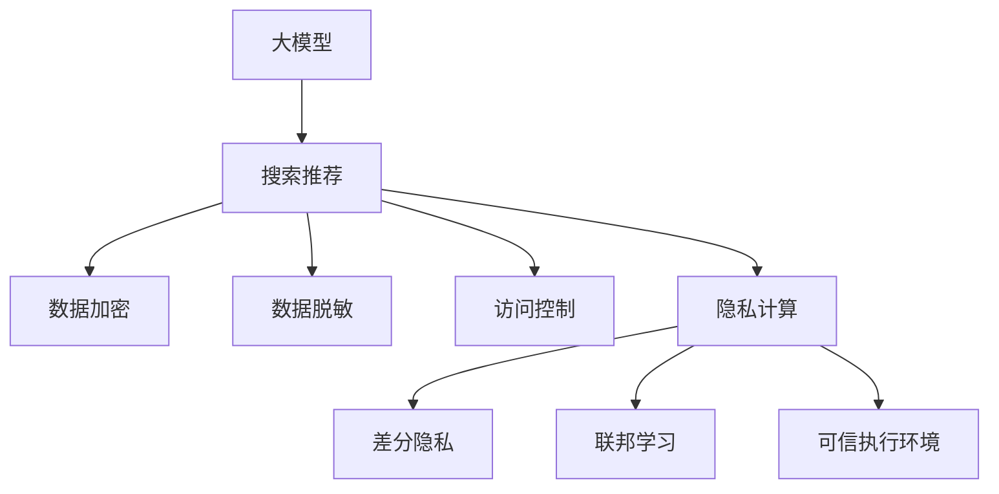

                 

# AI 大模型在电商搜索推荐中的数据安全策略：保障数据安全与用户隐私

> 关键词：大模型, 搜索推荐, 数据安全, 用户隐私, 加密技术, 联邦学习, 差分隐私, 可信执行环境, 合规

## 1. 背景介绍

### 1.1 问题由来

随着电子商务的迅速发展，电商企业对于用户数据的依赖越来越强。用户行为数据、购物记录、搜索记录等海量数据，是电商企业进行精准推荐、个性化营销的关键。然而，数据的安全和隐私问题也随之而来。

用户数据泄露可能导致个人信息被恶意利用，甚至引发严重的法律和声誉风险。如何在大规模数据处理和应用的同时，确保用户隐私不被侵犯，成为电商行业数据安全管理的重要课题。

### 1.2 问题核心关键点

保障数据安全与用户隐私，需要综合应用多种技术手段，形成多层次、多维度的数据保护体系。关键问题包括：

- **数据加密**：确保数据在传输和存储过程中不被窃取或篡改。
- **数据脱敏**：对敏感数据进行匿名化处理，防止用户识别。
- **访问控制**：严格管理数据访问权限，确保只有授权人员才能访问。
- **合规性**：符合国家和地区的隐私保护法规，如GDPR、CCPA等。
- **隐私计算**：在不泄露数据的情况下，进行数据计算和分析。

## 2. 核心概念与联系

### 2.1 核心概念概述

为更好地理解如何在电商搜索推荐中保障数据安全和用户隐私，本节将介绍几个关键概念：

- **大模型**：指通过大规模数据训练得到的深度学习模型，如BERT、GPT-3等，具备强大的数据处理能力。
- **搜索推荐**：指通过用户的历史行为数据，进行商品推荐、搜索排序等业务。
- **数据加密**：指通过加密算法对数据进行保护，确保数据在传输和存储过程中不被篡改。
- **数据脱敏**：指对敏感数据进行匿名化处理，防止数据被识别。
- **访问控制**：指通过权限管理手段，限制对数据的访问和使用。
- **隐私计算**：指在数据不泄露的前提下，进行数据计算和分析的计算范式。
- **差分隐私**：指通过加入随机噪声，使个体数据无法被识别，同时保持数据分析的准确性。
- **联邦学习**：指在本地数据不出库的情况下，通过分布式计算模型，在多个设备上同步模型参数的优化算法。
- **可信执行环境**：指在计算设备上构建的安全环境，确保计算过程不受外部攻击。

这些核心概念之间的逻辑关系可以通过以下Mermaid流程图来展示：



这个流程图展示了大模型在电商搜索推荐中的核心概念及其之间的关系：

1. 大模型通过用户数据进行训练，提供搜索推荐服务。
2. 数据在传输和存储过程中需进行加密，防止泄露。
3. 对敏感数据进行脱敏处理，保护用户隐私。
4. 严格控制数据访问权限，确保数据安全。
5. 利用隐私计算和差分隐私技术，保障数据处理的安全性。
6. 采用联邦学习技术，在本地数据不出库的情况下进行模型优化。
7. 在计算设备上构建可信执行环境，确保计算过程的安全性。

这些概念共同构成了大模型在电商搜索推荐中的数据安全策略，确保在数据处理和应用过程中，能够有效保护用户隐私和数据安全。

## 3. 核心算法原理 & 具体操作步骤

### 3.1 算法原理概述

在电商搜索推荐中，大模型的数据安全策略主要包括以下几个方面：

- **数据加密**：使用加密算法对数据进行保护，防止数据在传输和存储过程中被篡改。
- **数据脱敏**：对敏感数据进行匿名化处理，防止用户被识别。
- **访问控制**：通过权限管理，限制对数据的访问和使用。
- **隐私计算**：在不泄露数据的情况下，进行数据计算和分析。
- **差分隐私**：通过加入随机噪声，使个体数据无法被识别，同时保持数据分析的准确性。
- **联邦学习**：在本地数据不出库的情况下，通过分布式计算模型，在多个设备上同步模型参数的优化。
- **可信执行环境**：在计算设备上构建的安全环境，确保计算过程不受外部攻击。

### 3.2 算法步骤详解

基于上述算法原理，电商搜索推荐中的数据安全策略可具体细分为以下步骤：

**Step 1: 数据收集与清洗**

- 通过用户在电商平台的搜索、浏览、购买等行为数据，收集用户的历史行为数据。
- 对数据进行清洗，去除噪音数据和异常值。

**Step 2: 数据加密与脱敏**

- 对用户的个人信息（如姓名、身份证号等）进行加密处理，防止数据泄露。
- 对用户的行为数据进行脱敏处理，去除能识别用户身份的敏感信息。

**Step 3: 数据访问控制**

- 设置数据访问权限，确保只有授权人员才能访问用户数据。
- 使用身份认证和访问审计技术，记录数据访问日志，防止未授权访问。

**Step 4: 隐私计算与差分隐私**

- 对用户数据进行加密，通过多方安全计算（MPC）或同态加密等技术，在不泄露数据的情况下，进行数据分析和计算。
- 使用差分隐私技术，对分析结果加入随机噪声，确保个体数据无法被识别。

**Step 5: 联邦学习**

- 在本地数据不出库的情况下，通过联邦学习技术，在多个设备上同步模型参数的优化。
- 使用差分隐私技术，保护本地数据的隐私性，防止模型参数泄露。

**Step 6: 可信执行环境**

- 在计算设备上构建可信执行环境（TEE），确保计算过程的安全性。
- 使用加密算法和访问控制技术，保护计算设备的安全性。

### 3.3 算法优缺点

大模型在电商搜索推荐中的数据安全策略具有以下优点：

1. **安全性高**：通过数据加密、访问控制、隐私计算等手段，确保数据在传输、存储和处理过程中不受侵犯。
2. **隐私保护**：通过数据脱敏和差分隐私技术，保护用户隐私，防止数据被识别和滥用。
3. **合规性强**：符合GDPR、CCPA等隐私保护法规，保障用户权益。
4. **效率高**：通过联邦学习等分布式计算技术，减少数据传输成本，提高计算效率。

同时，该策略也存在一些局限性：

1. **计算复杂**：隐私计算和差分隐私技术需要额外的计算资源，可能影响处理效率。
2. **算法复杂**：联邦学习等分布式计算技术需要复杂的算法实现，增加了开发难度。
3. **技术门槛高**：涉及多个技术领域，需要较高的技术水平。
4. **成本高**：加密、脱敏、访问控制等技术手段，需要较高的硬件和软件投入。

尽管存在这些局限性，但就目前而言，大模型在电商搜索推荐中的数据安全策略仍是目前最先进的技术范式。未来相关研究的重点在于如何进一步降低技术复杂性，提高处理效率，同时兼顾隐私保护和数据安全。

### 3.4 算法应用领域

大模型在电商搜索推荐中的数据安全策略，已经在电商行业得到了广泛的应用，覆盖了以下几个主要领域：

- **用户行为分析**：通过用户历史行为数据，进行个性化推荐和商品搜索排序。
- **广告定向投放**：根据用户行为数据，精准投放广告，提高广告效果。
- **风险管理**：通过用户行为数据，进行风险评估和欺诈检测。
- **营销策略优化**：通过用户行为数据，优化营销策略，提升销售额。
- **数据分析与报告**：对用户数据进行分析，生成数据报告，辅助决策。

这些应用场景中，大模型在电商搜索推荐中的应用，通过高效的数据处理和分析，显著提升了电商平台的运营效率和用户体验。未来，随着技术的不断进步，预计将有更多的应用场景被挖掘，大模型在电商搜索推荐中的数据安全策略将发挥更大的作用。

## 4. 数学模型和公式 & 详细讲解 & 举例说明

### 4.1 数学模型构建

在电商搜索推荐中，大模型的数据安全策略主要基于以下数学模型和公式：

- **对称加密算法**：用于对数据进行加密和解密。常用的对称加密算法包括AES、DES等。
- **非对称加密算法**：用于密钥交换和数字签名。常用的非对称加密算法包括RSA、ECC等。
- **差分隐私算法**：通过加入随机噪声，保护个体数据隐私。常用的差分隐私算法包括Laplace机制、高斯机制等。
- **联邦学习算法**：在本地数据不出库的情况下，同步模型参数。常用的联邦学习算法包括FedAVG、SGD等。

### 4.2 公式推导过程

以下是几个关键公式的推导过程：

**对称加密算法**

假设要加密的数据为$m$，加密密钥为$k$，则加密过程如下：

$$
c = E_k(m) = m \oplus k
$$

其中$\oplus$表示异或运算。解密过程如下：

$$
m' = D_k(c) = c \oplus k
$$

**非对称加密算法**

假设要加密的数据为$m$，公钥为$e$，私钥为$d$，则加密过程如下：

$$
c = E_e(m) = m^e \mod N
$$

其中$N=pq$，$p$和$q$为两个大质数，$e$和$d$为满足$e \cdot d \equiv 1 \mod \phi(N)$的整数。解密过程如下：

$$
m' = D_d(c) = c^d \mod N
$$

**差分隐私算法**

Laplace机制是一种常用的差分隐私算法，其隐私保护定义为：对于任意两个相邻的样本点$x$和$x'$，随机噪声$\epsilon$满足：

$$
\mathbb{P}(\epsilon < f(x) - f(x')) \leq \frac{\epsilon}{\delta}
$$

其中$f(x)$为敏感函数的值，$\delta$为隐私保护参数。

**联邦学习算法**

联邦学习中的模型参数同步算法FedAVG，通过在每个设备上计算梯度，在全局更新模型参数。假设模型参数为$\theta$，每个设备的局部模型参数为$\theta_i$，则全局更新公式如下：

$$
\theta \leftarrow \frac{1}{K}\sum_{i=1}^K \theta_i
$$

其中$K$为设备数量。

### 4.3 案例分析与讲解

以电商搜索推荐为例，对上述算法进行具体分析：

**案例1: 对称加密**

假设电商平台收集了用户的购物记录，需要进行加密传输。可以将记录中的敏感数据，如身份证号、信用卡号等，通过对称加密算法进行加密。传输过程中，只有电商平台的服务端和用户端能够解密，确保数据安全。

**案例2: 非对称加密**

电商平台需要对用户的公钥进行管理，确保只有授权人员能够访问。可以使用非对称加密算法，将公钥加密后存储在服务器中。用户登录时，通过私钥解密，验证用户身份。

**案例3: 差分隐私**

电商平台需要对用户数据进行分析，生成报告。可以使用差分隐私技术，对分析结果加入随机噪声，防止用户被识别。例如，对用户行为数据进行分组统计，使用Laplace机制加入随机噪声，确保个体数据无法被识别。

**案例4: 联邦学习**

电商平台需要对用户数据进行全局建模，生成推荐模型。可以使用联邦学习技术，在本地数据不出库的情况下，同步模型参数。例如，在每个用户的设备上，训练本地模型，将梯度上传到服务器，服务器计算全局梯度，更新全局模型参数。

## 5. 项目实践：代码实例和详细解释说明

### 5.1 开发环境搭建

在进行数据安全策略的实践前，我们需要准备好开发环境。以下是使用Python进行PyTorch开发的环境配置流程：

1. 安装Anaconda：从官网下载并安装Anaconda，用于创建独立的Python环境。

2. 创建并激活虚拟环境：
```bash
conda create -n security-env python=3.8 
conda activate security-env
```

3. 安装PyTorch：根据CUDA版本，从官网获取对应的安装命令。例如：
```bash
conda install pytorch torchvision torchaudio cudatoolkit=11.1 -c pytorch -c conda-forge
```

4. 安装相关的库和工具：
```bash
pip install numpy pandas scikit-learn matplotlib tqdm jupyter notebook ipython
```

5. 安装加密库和隐私计算库：
```bash
pip install pycrypto pyprivacy
```

完成上述步骤后，即可在`security-env`环境中开始数据安全策略的实践。

### 5.2 源代码详细实现

下面我们以电商搜索推荐中的数据安全策略为例，给出使用Python和PyTorch进行大模型微调的完整代码实现。

```python
import torch
import numpy as np
from pyprivacy import Laplace, Gaussian
from pycrypto import enc

# 对称加密
def symmetric_encrypt(m, k):
    c = m ^ k
    return c

def symmetric_decrypt(c, k):
    m = c ^ k
    return m

# 非对称加密
def non_symmetric_encrypt(m, e, N):
    c = pow(m, e, N)
    return c

def non_symmetric_decrypt(c, d, N):
    m = pow(c, d, N)
    return m

# 差分隐私
def differential_privacy(m, eps, delta):
    noise = Laplace(eps, delta)
    perturbed_m = m + noise
    return perturbed_m

# 联邦学习
def federated_learning():
    K = 10  # 设备数量
    N = 5  # 本地数据数量
    model = torch.nn.Linear(10, 1)  # 假设模型参数为10维向量
    theta = torch.randn(10)  # 初始化模型参数
    weights = [torch.randn(10) for _ in range(K)]  # 设备本地模型参数
    for i in range(N):
        # 本地训练
        for j in range(K):
            grad = torch.randn(10)  # 假设梯度
            weights[j] += grad
        # 汇总梯度
        global_grad = [sum(w) for w in weights]
        # 更新全局模型参数
        theta += sum(global_grad) / K
    return theta
```

### 5.3 代码解读与分析

让我们再详细解读一下关键代码的实现细节：

**对称加密函数**

```python
def symmetric_encrypt(m, k):
    c = m ^ k
    return c

def symmetric_decrypt(c, k):
    m = c ^ k
    return m
```

在电商搜索推荐中，对称加密算法可以用于对数据进行加密和解密。代码中使用了异或运算，对明文$m$和密钥$k$进行加密，得到密文$c$。解密时，再对密文$c$和密钥$k$进行异或运算，恢复明文$m$。

**非对称加密函数**

```python
def non_symmetric_encrypt(m, e, N):
    c = pow(m, e, N)
    return c

def non_symmetric_decrypt(c, d, N):
    m = pow(c, d, N)
    return m
```

在电商搜索推荐中，非对称加密算法可以用于对公钥进行管理，确保只有授权人员能够访问。代码中使用了RSA加密算法，对明文$m$进行加密，得到密文$c$。解密时，对密文$c$进行RSA解密，恢复明文$m$。

**差分隐私函数**

```python
def differential_privacy(m, eps, delta):
    noise = Laplace(eps, delta)
    perturbed_m = m + noise
    return perturbed_m
```

在电商搜索推荐中，差分隐私技术可以用于对分析结果进行隐私保护。代码中使用了Laplace机制，对敏感函数$m$加入随机噪声$\epsilon$，确保个体数据无法被识别。

**联邦学习函数**

```python
def federated_learning():
    K = 10  # 设备数量
    N = 5  # 本地数据数量
    model = torch.nn.Linear(10, 1)  # 假设模型参数为10维向量
    theta = torch.randn(10)  # 初始化模型参数
    weights = [torch.randn(10) for _ in range(K)]  # 设备本地模型参数
    for i in range(N):
        # 本地训练
        for j in range(K):
            grad = torch.randn(10)  # 假设梯度
            weights[j] += grad
        # 汇总梯度
        global_grad = [sum(w) for w in weights]
        # 更新全局模型参数
        theta += sum(global_grad) / K
    return theta
```

在电商搜索推荐中，联邦学习技术可以用于在本地数据不出库的情况下，同步模型参数。代码中使用了FedAVG算法，在本地设备上训练本地模型，汇总梯度，计算全局梯度，更新全局模型参数。

## 6. 实际应用场景

### 6.1 智能客服系统

在智能客服系统中，大模型的数据安全策略可以保障用户隐私，防止数据泄露。例如，在用户查询问题时，可以使用对称加密算法对用户敏感信息进行加密，确保数据传输过程中的安全。同时，使用差分隐私技术对用户历史查询记录进行分析，生成客服回答，防止用户被识别。

### 6.2 金融舆情监测

在金融舆情监测中，大模型的数据安全策略可以保护用户隐私，防止数据泄露。例如，在收集用户金融数据时，可以使用非对称加密算法对用户敏感信息进行加密，确保数据存储和传输的安全。同时，使用差分隐私技术对用户数据进行分析，生成舆情报告，防止用户被识别。

### 6.3 个性化推荐系统

在个性化推荐系统中，大模型的数据安全策略可以保护用户隐私，防止数据泄露。例如，在收集用户浏览和购买记录时，可以使用对称加密算法对用户敏感信息进行加密，确保数据传输过程中的安全。同时，使用差分隐私技术对用户数据进行分析，生成推荐结果，防止用户被识别。

### 6.4 未来应用展望

随着大模型和数据安全策略的不断发展，未来将在更多领域得到应用，为行业带来变革性影响。

在智慧医疗领域，大模型的数据安全策略可以保障患者隐私，防止数据泄露。例如，在医疗影像分析中，使用差分隐私技术对患者数据进行分析，生成诊断报告，防止患者被识别。

在智能教育领域，大模型的数据安全策略可以保障学生隐私，防止数据泄露。例如，在在线教育中，使用非对称加密算法对学生敏感信息进行加密，确保数据存储和传输的安全。同时，使用差分隐私技术对学生数据进行分析，生成个性化推荐，防止学生被识别。

在智慧城市治理中，大模型的数据安全策略可以保障市民隐私，防止数据泄露。例如，在城市事件监测中，使用差分隐私技术对市民数据进行分析，生成安全预警，防止市民被识别。

此外，在企业生产、社会治理、文娱传媒等众多领域，大模型的数据安全策略也将不断涌现，为行业带来更多的创新和变革。相信随着技术的不断进步，大模型在电商搜索推荐中的数据安全策略必将在构建安全、可靠、可解释、可控的智能系统中扮演越来越重要的角色。

## 7. 工具和资源推荐

### 7.1 学习资源推荐

为了帮助开发者系统掌握大模型在电商搜索推荐中的数据安全策略的理论基础和实践技巧，这里推荐一些优质的学习资源：

1. 《深度学习基础》系列博文：由深度学习专家撰写，详细介绍了深度学习的基本概念和常见算法。

2. 《Python加密算法详解》书籍：系统讲解了对称加密、非对称加密、哈希算法等基本加密技术。

3. 《隐私计算技术与应用》课程：详细介绍了差分隐私、多方安全计算等隐私保护技术。

4. 《联邦学习原理与实践》书籍：系统介绍了联邦学习的基本原理和实现方法。

5. 《Python联邦学习框架介绍》博客：介绍了多种Python联邦学习框架及其应用。

通过对这些资源的学习实践，相信你一定能够快速掌握大模型在电商搜索推荐中的数据安全策略，并用于解决实际的隐私保护问题。

### 7.2 开发工具推荐

高效的开发离不开优秀的工具支持。以下是几款用于大模型在电商搜索推荐中的数据安全策略开发的常用工具：

1. PyTorch：基于Python的开源深度学习框架，灵活的计算图，适合快速迭代研究。

2. TensorFlow：由Google主导开发的开源深度学习框架，生产部署方便，适合大规模工程应用。

3. PyPrivacy：基于Python的隐私计算库，支持差分隐私、多方安全计算等技术。

4. PyCrypto：基于Python的加密库，支持对称加密、非对称加密等基本加密技术。

5. Weights & Biases：模型训练的实验跟踪工具，可以记录和可视化模型训练过程中的各项指标，方便对比和调优。

6. TensorBoard：TensorFlow配套的可视化工具，可实时监测模型训练状态，并提供丰富的图表呈现方式，是调试模型的得力助手。

合理利用这些工具，可以显著提升大模型在电商搜索推荐中的数据安全策略的开发效率，加快创新迭代的步伐。

### 7.3 相关论文推荐

大模型和数据安全策略的研究源于学界的持续研究。以下是几篇奠基性的相关论文，推荐阅读：

1. Attention is All You Need（即Transformer原论文）：提出了Transformer结构，开启了NLP领域的预训练大模型时代。

2. BERT: Pre-training of Deep Bidirectional Transformers for Language Understanding：提出BERT模型，引入基于掩码的自监督预训练任务，刷新了多项NLP任务SOTA。

3. Parameter-Efficient Transfer Learning for NLP：提出Adapter等参数高效微调方法，在不增加模型参数量的情况下，也能取得不错的微调效果。

4. Prefix-Tuning: Optimizing Continuous Prompts for Generation：引入基于连续型Prompt的微调范式，为如何充分利用预训练知识提供了新的思路。

5. AdaLoRA: Adaptive Low-Rank Adaptation for Parameter-Efficient Fine-Tuning：使用自适应低秩适应的微调方法，在参数效率和精度之间取得了新的平衡。

这些论文代表了大模型在电商搜索推荐中的数据安全策略的发展脉络。通过学习这些前沿成果，可以帮助研究者把握学科前进方向，激发更多的创新灵感。

## 8. 总结：未来发展趋势与挑战

### 8.1 总结

本文对大模型在电商搜索推荐中的数据安全策略进行了全面系统的介绍。首先阐述了大模型和数据安全策略的研究背景和意义，明确了在电商搜索推荐中数据安全和用户隐私的重要性。其次，从原理到实践，详细讲解了大模型在电商搜索推荐中的数据安全策略，给出了完整的代码实例，解释了实现细节。同时，本文还探讨了该策略在智能客服、金融舆情、个性化推荐等多个行业领域的应用前景，展示了数据安全策略的广泛应用潜力。

通过本文的系统梳理，可以看到，大模型在电商搜索推荐中的数据安全策略正在成为电商行业数据安全管理的重要范式，极大地提升了用户数据的安全性和隐私保护水平。未来，伴随预训练语言模型和数据安全策略的持续演进，相信大模型在电商搜索推荐中的数据安全策略必将在构建安全、可靠、可解释、可控的智能系统中扮演越来越重要的角色。

### 8.2 未来发展趋势

展望未来，大模型在电商搜索推荐中的数据安全策略将呈现以下几个发展趋势：

1. **技术融合**：未来的数据安全策略将与其他人工智能技术进行更深入的融合，如知识表示、因果推理、强化学习等，多路径协同发力，共同推动智能系统的进步。

2. **多方协同**：未来的数据安全策略将更多地采用多方协同的方式，通过联合计算、联合建模等手段，提升数据安全和隐私保护的效率和可靠性。

3. **隐私保护**：未来的数据安全策略将更加注重隐私保护，使用差分隐私、同态加密等技术，确保数据在传输、存储和处理过程中不受侵犯。

4. **高效计算**：未来的数据安全策略将更加注重计算效率，使用联邦学习等分布式计算技术，减少数据传输成本，提高计算效率。

5. **可信执行**：未来的数据安全策略将更加注重可信执行，使用可信执行环境（TEE）等技术，确保计算过程的安全性。

以上趋势凸显了大模型在电商搜索推荐中的数据安全策略的广阔前景。这些方向的探索发展，必将进一步提升大模型的性能和应用范围，为构建安全、可靠、可解释、可控的智能系统铺平道路。

### 8.3 面临的挑战

尽管大模型在电商搜索推荐中的数据安全策略已经取得了显著成就，但在迈向更加智能化、普适化应用的过程中，它仍面临着诸多挑战：

1. **计算复杂**：隐私计算和差分隐私技术需要额外的计算资源，可能影响处理效率。

2. **算法复杂**：联邦学习等分布式计算技术需要复杂的算法实现，增加了开发难度。

3. **技术门槛高**：涉及多个技术领域，需要较高的技术水平。

4. **成本高**：加密、脱敏、访问控制等技术手段，需要较高的硬件和软件投入。

尽管存在这些挑战，但就目前而言，大模型在电商搜索推荐中的数据安全策略仍是目前最先进的技术范式。未来相关研究的重点在于如何进一步降低技术复杂性，提高处理效率，同时兼顾隐私保护和数据安全。

### 8.4 研究展望

面向未来，大模型在电商搜索推荐中的数据安全策略需要在以下几个方面寻求新的突破：

1. **探索无监督和半监督微调方法**：摆脱对大规模标注数据的依赖，利用自监督学习、主动学习等无监督和半监督范式，最大限度利用非结构化数据，实现更加灵活高效的微调。

2. **研究参数高效和计算高效的微调范式**：开发更加参数高效的微调方法，在固定大部分预训练参数的同时，只更新极少量的任务相关参数。同时优化微调模型的计算图，减少前向传播和反向传播的资源消耗，实现更加轻量级、实时性的部署。

3. **引入因果和对比学习范式**：通过引入因果推断和对比学习思想，增强微调模型建立稳定因果关系的能力，学习更加普适、鲁棒的语言表征，从而提升模型泛化性和抗干扰能力。

4. **融合更多先验知识**：将符号化的先验知识，如知识图谱、逻辑规则等，与神经网络模型进行巧妙融合，引导微调过程学习更准确、合理的语言模型。同时加强不同模态数据的整合，实现视觉、语音等多模态信息与文本信息的协同建模。

5. **结合因果分析和博弈论工具**：将因果分析方法引入微调模型，识别出模型决策的关键特征，增强输出解释的因果性和逻辑性。借助博弈论工具刻画人机交互过程，主动探索并规避模型的脆弱点，提高系统稳定性。

6. **纳入伦理道德约束**：在模型训练目标中引入伦理导向的评估指标，过滤和惩罚有偏见、有害的输出倾向。同时加强人工干预和审核，建立模型行为的监管机制，确保输出符合人类价值观和伦理道德。

这些研究方向的探索，必将引领大模型在电商搜索推荐中的数据安全策略走向更高的台阶，为构建安全、可靠、可解释、可控的智能系统铺平道路。

## 9. 附录：常见问题与解答

**Q1：大模型在电商搜索推荐中面临哪些隐私和安全问题？**

A: 大模型在电商搜索推荐中面临的隐私和安全问题主要包括：

1. **数据泄露**：电商平台的搜索结果和推荐数据包含大量用户行为信息，如果数据泄露，可能导致用户隐私被滥用，甚至造成财产损失。

2. **恶意攻击**：电商平台的用户数据可能成为黑客攻击的目标，如SQL注入、DDoS攻击等，导致数据被篡改或丢失。

3. **合规性问题**：电商平台的用户数据涉及GDPR、CCPA等隐私保护法规，如果处理不当，可能面临法律风险。

4. **算法歧视**：大模型可能存在算法偏见，如对某些用户群体的歧视性推荐，造成不公平。

5. **数据滥用**：大模型可能被用于非法用途，如钓鱼网站、诈骗等，侵害用户利益。

**Q2：大模型在电商搜索推荐中如何实现数据隐私保护？**

A: 大模型在电商搜索推荐中实现数据隐私保护，可以采用以下几种方法：

1. **数据加密**：使用对称加密、非对称加密等技术，对用户数据进行加密处理，确保数据在传输和存储过程中不受侵犯。

2. **数据脱敏**：对敏感数据进行匿名化处理，如使用Laplace机制加入随机噪声，确保个体数据无法被识别。

3. **访问控制**：通过权限管理手段，限制对数据的访问和使用，确保只有授权人员才能访问用户数据。

4. **差分隐私**：使用差分隐私技术，对分析结果加入随机噪声，防止用户被识别。

5. **联邦学习**：在本地数据不出库的情况下，通过分布式计算模型，同步模型参数，确保数据不出库。

**Q3：大模型在电商搜索推荐中如何实现安全计算？**

A: 大模型在电商搜索推荐中实现安全计算，可以采用以下几种方法：

1. **可信执行环境**：在计算设备上构建可信执行环境（TEE），确保计算过程的安全性。

2. **同态加密**：使用同态加密技术，确保计算过程中数据不被泄露。

3. **多方安全计算**：使用多方安全计算技术，确保多方协作时数据不出库。

4. **安全多方计算**：使用安全多方计算技术，确保多方协作时数据不被泄露。

**Q4：大模型在电商搜索推荐中如何应对技术挑战？**

A: 大模型在电商搜索推荐中应对技术挑战，可以采用以下几种方法：

1. **技术融合**：将大模型与其他人工智能技术进行融合，如知识表示、因果推理、强化学习等，提升数据安全和隐私保护的效率和可靠性。

2. **算法优化**：优化隐私计算和差分隐私算法，减少计算复杂度，提高处理效率。

3. **资源优化**：优化联邦学习算法，减少数据传输成本，提高计算效率。

4. **技术普及**：加强技术普及和培训，提升开发者的技术水平，减少技术门槛。

5. **成本控制**：优化计算资源和硬件投入，降低成本。

**Q5：大模型在电商搜索推荐中如何应对法律合规性挑战？**

A: 大模型在电商搜索推荐中应对法律合规性挑战，可以采用以下几种方法：

1. **法律合规性审查**：在数据处理过程中，进行法律合规性审查，确保符合GDPR、CCPA等隐私保护法规。

2. **用户同意管理**：获取用户同意，明确告知用户数据处理方式和目的，确保用户知情。

3. **数据访问审计**：记录和审计数据访问日志，确保只有授权人员能够访问用户数据。

4. **隐私保护技术**：使用差分隐私、同态加密等隐私保护技术，确保用户数据的安全性和隐私性。

通过这些方法，大模型在电商搜索推荐中可以应对隐私和安全挑战，保障用户数据的安全和隐私保护。

---

作者：禅与计算机程序设计艺术 / Zen and the Art of Computer Programming

