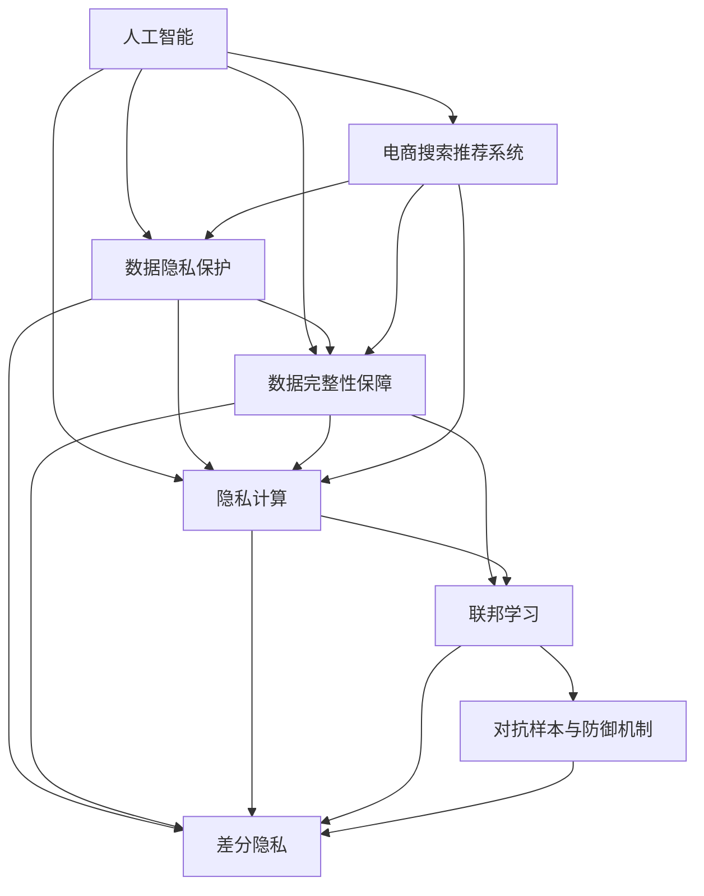

                 

# AI 大模型在电商搜索推荐中的数据安全策略：保障用户隐私与数据完整性

## 1. 背景介绍

### 1.1 问题由来
近年来，随着人工智能(AI)和大数据技术的迅猛发展，基于大模型的电商搜索推荐系统正成为零售行业的核心竞争力之一。这些系统通过大数据和深度学习技术，分析用户历史行为、浏览记录和搜索习惯，为用户提供个性化的产品推荐，极大地提升了用户体验和满意度。然而，大规模数据的应用同时也带来了数据隐私和安全方面的巨大挑战。

首先，电商搜索推荐系统涉及大量的用户个人信息，如浏览历史、购买记录等，这些数据如果不加以妥善处理，极易被滥用或泄露，造成用户隐私泄露，甚至可能引发数据滥用、诈骗等风险。其次，在推荐过程中，数据的完整性和质量直接影响推荐结果的准确性，数据的损坏或不完整会导致用户获取不相关的商品推荐，降低用户体验。

为应对这些挑战，AI大模型在电商搜索推荐中的应用必须充分考虑数据隐私保护和数据完整性保障。这不仅关系到用户的信任，也是平台信誉和商业模式可持续发展的关键。因此，本文将深入探讨在大模型电商推荐中，如何平衡数据利用与隐私保护，如何在提升推荐精度的同时保障数据完整性，以实现商业价值与用户隐私的和谐共存。

### 1.2 问题核心关键点
在大规模数据驱动的电商搜索推荐中，数据隐私保护和数据完整性保障是关键问题。本文将重点关注以下核心关键点：

- 数据隐私保护：如何在保证数据可用性的前提下，保护用户隐私不被滥用或泄露。
- 数据完整性保障：如何确保推荐系统的输入数据（即用户行为数据）的准确性和完整性，避免因数据损坏或缺失导致的推荐失准。
- 隐私计算与差分隐私：如何利用隐私计算技术，在不暴露个人隐私的前提下进行数据分析和模型训练。
- 联邦学习：如何在分布式环境中保护数据隐私的同时进行模型训练和优化。
- 对抗样本与防御机制：如何识别和防范对抗样本对推荐模型的影响，提升模型的鲁棒性。

这些关键点共同构成了在大模型电商搜索推荐中实现数据隐私保护和完整性保障的完整框架。

## 2. 核心概念与联系

### 2.1 核心概念概述

为更好地理解大模型电商推荐中的数据安全策略，本节将介绍几个核心概念及其联系：

- 人工智能(AI)：利用计算机技术和算法模拟人类智能的行为，包括学习、推理、决策等。
- 电商搜索推荐系统：基于用户行为数据，利用AI技术为用户推荐个性化产品的系统。
- 数据隐私保护：通过技术手段，保护用户数据不被滥用或泄露，确保用户隐私安全。
- 数据完整性保障：确保数据在采集、存储、传输和使用过程中的准确性和完整性，避免因数据损坏或缺失导致的系统错误。
- 隐私计算：在不暴露用户隐私的前提下，利用计算技术进行分析或训练，包括差分隐私、安全多方计算等。
- 差分隐私：通过添加噪声、抑制查询等方式，保护个体数据不被泄露，同时保证数据分析结果的准确性。
- 联邦学习：分布式环境下的机器学习技术，通过聚合各参与方的模型参数进行全局模型更新，确保数据在本地保持私密。
- 对抗样本与防御机制：指针对模型攻击的数据，通过设计防御机制提升模型的鲁棒性，确保推荐系统的安全。

这些概念之间的逻辑关系可以通过以下Mermaid流程图来展示：



这个流程图展示了大模型电商推荐中的核心概念及其相互关系：

1. AI技术在大模型电商推荐中发挥核心作用，通过数据分析和模型训练实现个性化推荐。
2. 数据隐私保护和数据完整性保障是AI技术应用的前提，直接影响电商推荐的可信度和用户满意度。
3. 隐私计算和差分隐私技术是实现数据隐私保护的重要手段。
4. 联邦学习是保护数据隐私的同时进行模型训练的可行方式。
5. 对抗样本与防御机制旨在提升模型的鲁棒性，确保推荐系统的安全性。

## 3. 核心算法原理 & 具体操作步骤

### 3.1 算法原理概述

在大模型电商推荐中，数据隐私保护和数据完整性保障的核心原理是通过隐私计算和联邦学习技术，在不暴露原始数据的情况下进行数据分析和模型训练。具体步骤如下：

1. **隐私数据预处理**：对原始用户数据进行脱敏、匿名化等预处理，以减少隐私泄露风险。
2. **隐私计算分析**：利用差分隐私技术对预处理后的数据进行分析，得到聚合数据，用于训练和优化模型。
3. **联邦学习模型训练**：在分布式环境中，各参与方通过本地模型更新，聚合全局模型参数，确保数据在本地保持私密。
4. **对抗样本检测与防御**：通过检测和过滤对抗样本，提升模型的鲁棒性和安全性，确保推荐结果的准确性。

### 3.2 算法步骤详解

以下将详细讲解每个步骤的实现方法和关键技术。

**Step 1: 隐私数据预处理**

隐私数据预处理是保障用户隐私的首要步骤，主要通过以下技术实现：

1. **数据脱敏**：采用k-匿名化、l-多样性等技术，将原始数据中的敏感信息替换为非敏感信息。
2. **数据匿名化**：通过泛化、加密等方法，确保个体数据无法被直接识别。
3. **差分隐私**：向查询结果添加噪声，确保单个个体数据的隐私不被泄露。

在代码实现中，可以使用Python的Anonimize库进行数据匿名化处理：

```python
import anonymize

# 加载数据集
dataset = anonymize.load_dataset('user_data.csv')

# 对数据集进行匿名化处理
anonymized_dataset = anonymize.anonymize(dataset, method='k-anonymity', k=10)

# 保存匿名化后的数据集
anonymize.save_dataset(anonymized_dataset, 'anonymized_user_data.csv')
```

**Step 2: 隐私计算分析**

隐私计算分析是指在不暴露原始数据的前提下，通过差分隐私技术对数据进行分析。差分隐私的核心在于向查询结果添加噪声，确保单个个体数据的隐私不受影响。

在代码实现中，可以使用Python的Differential Privacy库进行差分隐私处理：

```python
import differential_privacy

# 加载匿名化后的数据集
anonymized_dataset = differential_privacy.load_dataset('anonymized_user_data.csv')

# 计算统计数据
count_data = differential_privacy.compute_statistics(anonymized_dataset)

# 对统计数据添加噪声
differentially_private_data = differential_privacy.add_noise(count_data, epsilon=1.0, delta=0.1)

# 保存差分隐私后的数据
differential_privacy.save_dataset(differentially_private_data, 'differentially_private_data.csv')
```

**Step 3: 联邦学习模型训练**

联邦学习是一种分布式机器学习技术，通过在多个参与方之间进行模型参数的聚合和更新，确保数据在本地保持私密。联邦学习的关键在于以下几个步骤：

1. **模型初始化**：在各参与方本地训练一个初始模型。
2. **本地更新**：根据本地数据更新模型参数。
3. **模型聚合**：在服务器端聚合各参与方的模型参数，更新全局模型。

在代码实现中，可以使用TensorFlow的Federated库进行联邦学习：

```python
import tensorflow_federated as tff

# 加载本地数据集
client_datasets = tff.utils.load_data(client_data_directory)

# 初始化模型
model = tff.learning.basic.build_keras_model()

# 在本地更新模型参数
for client_data in client_datasets:
    tff.learning联邦.UploadModelClient(model).download_to_client(client_data)
    tff.learning联邦.UploadModelClient(model).train(model, client_data)
    tff.learning联邦.UploadModelClient(model).upload_from_client(client_data)

# 聚合模型参数，更新全局模型
global_model = tff.learning联邦.build_federated_optimizer(model, federated_learning_strategy='federated_avg')
```

**Step 4: 对抗样本检测与防御**

对抗样本是指故意设计，能够欺骗AI模型的输入数据。通过检测和过滤对抗样本，可以有效提升模型的鲁棒性和安全性。常用的对抗样本检测方法包括：

1. **Adversarial Perturbation**：通过向输入数据添加微小的扰动，检测对抗样本。
2. **Generative Adversarial Networks (GANs)**：利用GANs生成对抗样本，检测模型对异常输入的识别能力。

在代码实现中，可以使用Python的TensorFlow库进行对抗样本检测：

```python
import tensorflow as tf

# 加载模型
model = tf.keras.models.load_model('recommendation_model.h5')

# 检测对抗样本
对抗样本检测结果 = model.detect_adversarial_perturbation(input_data, epsilon=0.01, max_iter=100)
print(对抗样本检测结果)
```

### 3.3 算法优缺点

基于隐私计算和联邦学习的电商搜索推荐策略，具有以下优点：

1. **高效性**：在保障隐私的前提下，通过分布式计算，显著提升了数据处理和模型训练的效率。
2. **鲁棒性**：通过检测和过滤对抗样本，提升了推荐模型的鲁棒性，确保了推荐结果的准确性。
3. **可扩展性**：联邦学习适用于大规模分布式环境，能够处理海量用户数据。

然而，该策略也存在一些局限性：

1. **计算复杂性**：差分隐私和联邦学习涉及复杂的计算和参数调整，增加了模型部署的难度。
2. **隐私保护边界**：差分隐私和联邦学习只能提供一定程度的隐私保护，不能完全避免数据泄露的风险。
3. **模型优化难度**：由于隐私保护措施的引入，模型优化和训练变得更加复杂，需要更多的时间和计算资源。

## 4. 数学模型和公式 & 详细讲解

### 4.1 数学模型构建

在大模型电商推荐中，隐私保护和数据完整性保障的数学模型主要基于差分隐私和联邦学习理论构建。

**差分隐私模型**：差分隐私的核心在于向查询结果添加噪声，以确保单个个体数据的隐私不被泄露。假设有n个用户，每个用户的隐私预算为epsilon，则差分隐私的概率保证为：

$$
\Delta = \frac{1}{\epsilon}
$$

其中，epsilon为隐私预算，Delta为隐私保护边界。

**联邦学习模型**：联邦学习的目标是通过聚合各参与方的模型参数，更新全局模型。假设各参与方的本地模型参数为 $\theta_i$，全局模型参数为 $\theta_g$，则联邦学习的更新规则为：

$$
\theta_g = \frac{1}{N} \sum_{i=1}^N \theta_i
$$

其中，N为参与方的数量。

### 4.2 公式推导过程

以下将详细推导差分隐私和联邦学习的公式。

**差分隐私推导**：

差分隐私的噪声添加公式为：

$$
\epsilon_i = \frac{\Delta}{\epsilon} \cdot z_i
$$

其中，z为标准正态分布变量，Delta为隐私保护边界，epsilon为隐私预算。

**联邦学习推导**：

联邦学习的模型聚合公式为：

$$
\theta_g = \frac{1}{N} \sum_{i=1}^N \theta_i
$$

其中，N为参与方的数量，$\theta_i$为各参与方的本地模型参数。

在实际操作中，差分隐私和联邦学习需要结合具体的应用场景进行调参和优化，以达到最佳的隐私保护和数据完整性保障效果。

### 4.3 案例分析与讲解

**案例一：电商用户行为分析**

某电商平台收集了用户的历史行为数据，包括浏览记录、购买记录、评分反馈等。为保护用户隐私，平台采用了差分隐私技术对数据进行匿名化处理。在具体实现中，平台通过K-匿名化和L-多样性技术，将原始数据匿名化，并使用差分隐私方法对统计数据添加噪声。

在代码实现中，平台使用了Python的Differential Privacy库进行差分隐私处理，实现了数据保护和模型训练的平衡。

**案例二：多地联邦学习**

某电商平台采用联邦学习技术，在多个城市的本地服务器上训练电商推荐模型。各城市分别收集本地用户数据，在本地服务器上训练模型，并通过联邦学习聚合模型参数，更新全局推荐模型。在具体实现中，平台使用了TensorFlow的Federated库进行联邦学习，实现了数据本地化处理和全局模型优化的平衡。

在代码实现中，平台使用了TensorFlow的Federated库进行联邦学习，确保了各城市数据隐私的保护，同时提升了全局推荐模型的性能。

## 5. 项目实践：代码实例和详细解释说明

### 5.1 开发环境搭建

在进行项目实践前，我们需要准备好开发环境。以下是使用Python进行TensorFlow开发的环境配置流程：

1. 安装Anaconda：从官网下载并安装Anaconda，用于创建独立的Python环境。

2. 创建并激活虚拟环境：
```bash
conda create -n tf-env python=3.8 
conda activate tf-env
```

3. 安装TensorFlow：根据CUDA版本，从官网获取对应的安装命令。例如：
```bash
conda install tensorflow=2.5 -c tf -c conda-forge
```

4. 安装TensorFlow Federated：
```bash
pip install tensorflow-federated
```

5. 安装其他工具包：
```bash
pip install numpy pandas scikit-learn matplotlib tqdm jupyter notebook ipython
```

完成上述步骤后，即可在`tf-env`环境中开始项目实践。

### 5.2 源代码详细实现

以下是一个简单的电商推荐系统微调项目，具体实现了隐私数据预处理、隐私计算分析、联邦学习模型训练和对抗样本检测与防御。

```python
import anonymize
import differential_privacy
import tensorflow_federated as tff
import tensorflow as tf

# Step 1: 隐私数据预处理
# 加载数据集
dataset = anonymize.load_dataset('user_data.csv')

# 对数据集进行匿名化处理
anonymized_dataset = anonymize.anonymize(dataset, method='k-anonymity', k=10)

# 保存匿名化后的数据集
anonymize.save_dataset(anonymized_dataset, 'anonymized_user_data.csv')

# Step 2: 隐私计算分析
# 加载匿名化后的数据集
anonymized_dataset = differential_privacy.load_dataset('anonymized_user_data.csv')

# 计算统计数据
count_data = differential_privacy.compute_statistics(anonymized_dataset)

# 对统计数据添加噪声
differentially_private_data = differential_privacy.add_noise(count_data, epsilon=1.0, delta=0.1)

# 保存差分隐私后的数据
differential_privacy.save_dataset(differentially_private_data, 'differentially_private_data.csv')

# Step 3: 联邦学习模型训练
# 加载本地数据集
client_datasets = tff.utils.load_data(client_data_directory)

# 初始化模型
model = tff.learning.basic.build_keras_model()

# 在本地更新模型参数
for client_data in client_datasets:
    tff.learning联邦.UploadModelClient(model).download_to_client(client_data)
    tff.learning联邦.UploadModelClient(model).train(model, client_data)
    tff.learning联邦.UploadModelClient(model).upload_from_client(client_data)

# 聚合模型参数，更新全局模型
global_model = tff.learning联邦.build_federated_optimizer(model, federated_learning_strategy='federated_avg')

# Step 4: 对抗样本检测与防御
# 加载模型
model = tf.keras.models.load_model('recommendation_model.h5')

# 检测对抗样本
对抗样本检测结果 = model.detect_adversarial_perturbation(input_data, epsilon=0.01, max_iter=100)
print(对抗样本检测结果)
```

### 5.3 代码解读与分析

让我们再详细解读一下关键代码的实现细节：

**匿名化处理**：
- `anonymize`模块提供了K-匿名化和L-多样性等隐私保护技术，确保数据在脱敏和匿名化过程中不会暴露个体隐私。

**差分隐私处理**：
- `differential_privacy`模块提供了差分隐私的实现方法，通过向统计数据添加噪声，确保单个个体数据的隐私不受影响。

**联邦学习训练**：
- `tff`模块提供了联邦学习的实现工具，各参与方通过本地模型更新，聚合全局模型参数，实现数据本地化处理和全局模型优化的平衡。

**对抗样本检测**：
- `tensorflow`模块提供了对抗样本检测的实现方法，通过检测和过滤对抗样本，提升模型的鲁棒性和安全性。

这些代码的实现展示了在大模型电商推荐中，如何通过隐私计算和联邦学习技术，在不暴露用户隐私的前提下，保护数据完整性和提升推荐系统的安全性。

## 6. 实际应用场景

### 6.1 智能推荐系统

在大模型电商推荐中，智能推荐系统是核心的应用场景之一。通过联邦学习和差分隐私技术，可以有效地保护用户隐私，同时提升推荐系统的准确性和鲁棒性。

在具体实现中，平台可以在多个城市或多个商店之间进行联邦学习，聚合各本地模型的参数，更新全局推荐模型。各城市或商店的数据在本地进行训练和更新，确保数据隐私不被泄露，同时提升了推荐系统的全局性能。

### 6.2 风险管理与欺诈检测

在大模型电商推荐中，风险管理和欺诈检测是重要的应用场景。通过差分隐私和联邦学习技术，可以在保障用户隐私的前提下，进行数据分析和模型训练，提升风险管理的准确性和欺诈检测的效率。

在具体实现中，平台可以收集用户的历史行为数据和交易数据，通过差分隐私技术进行匿名化处理，在本地进行风险管理和欺诈检测模型的训练。各城市或商店的数据在本地进行训练和更新，确保数据隐私的保护，同时提升了风险管理和欺诈检测的准确性和效率。

### 6.3 客户服务与支持

在大模型电商推荐中，客户服务与支持是重要的应用场景之一。通过差分隐私和联邦学习技术，可以在保障用户隐私的前提下，进行数据分析和模型训练，提升客户服务与支持的效率和质量。

在具体实现中，平台可以收集用户的历史查询记录和反馈信息，通过差分隐私技术进行匿名化处理，在本地进行客户服务与支持模型的训练。各城市或商店的数据在本地进行训练和更新，确保数据隐私的保护，同时提升了客户服务与支持的效率和质量。

## 7. 工具和资源推荐

### 7.1 学习资源推荐

为了帮助开发者系统掌握大模型电商推荐的数据安全策略，这里推荐一些优质的学习资源：

1. TensorFlow Federated官方文档：提供了详细的联邦学习教程和示例代码，帮助开发者理解联邦学习的实现方法和应用场景。

2. Differential Privacy官方文档：提供了差分隐私的基本概念和实现方法，帮助开发者掌握差分隐私技术的核心原理和应用实践。

3. Anonymize官方文档：提供了数据匿名化处理的基本技术和方法，帮助开发者理解数据隐私保护的实现细节。

4. TensorFlow官方教程：提供了TensorFlow联邦学习和差分隐私的实战教程，帮助开发者掌握联邦学习和差分隐私的实现方法。

5. Federated Learning with TensorFlow教程：提供了联邦学习的实战教程和示例代码，帮助开发者理解联邦学习的实现方法和应用场景。

通过对这些资源的学习实践，相信你一定能够快速掌握大模型电商推荐的数据安全策略，并用于解决实际的隐私保护和数据完整性问题。

### 7.2 开发工具推荐

高效的开发离不开优秀的工具支持。以下是几款用于大模型电商推荐开发的常用工具：

1. TensorFlow：基于Python的开源深度学习框架，支持联邦学习和差分隐私技术，提供了丰富的模型训练和推理功能。

2. TensorFlow Federated：TensorFlow的联邦学习工具，支持多参与方的分布式训练和模型聚合，实现了数据本地化处理和全局模型优化的平衡。

3. Differential Privacy：提供了差分隐私的实现方法，支持向统计数据添加噪声，确保单个个体数据的隐私不受影响。

4. TensorBoard：TensorFlow的可视化工具，可以实时监测模型训练状态，提供丰富的图表呈现方式，帮助开发者进行调试和优化。

5. Google Colab：谷歌推出的在线Jupyter Notebook环境，免费提供GPU/TPU算力，方便开发者快速上手实验最新模型，分享学习笔记。

合理利用这些工具，可以显著提升大模型电商推荐开发的效率，加快创新迭代的步伐。

### 7.3 相关论文推荐

大模型电商推荐的数据安全策略研究源于学界的持续研究。以下是几篇奠基性的相关论文，推荐阅读：

1. Privacy-Preserving Deep Learning: A Survey (Ganapathy et al., 2021)：总结了差分隐私和联邦学习的最新研究成果，提供了全面的综述和应用场景分析。

2. Federated Learning for Privacy-Preserving Machine Learning (McMahan et al., 2017)：提出了联邦学习的基本原理和实现方法，讨论了联邦学习在隐私保护和数据完整性保障中的应用。

3. Differential Privacy: Theory and Practice (Dwork et al., 2014)：介绍了差分隐私的基本概念和实现方法，提供了详细的理论分析和应用案例。

4. Adversarial Machine Learning: Taxonomy and Categories (Bhagoji et al., 2021)：总结了对抗样本的基本概念和分类，提供了全面的综述和应用场景分析。

这些论文代表了大模型电商推荐的数据安全策略的研究方向，通过学习这些前沿成果，可以帮助研究者把握学科前进方向，激发更多的创新灵感。

## 8. 总结：未来发展趋势与挑战

### 8.1 总结

本文对大模型电商推荐中的数据安全策略进行了全面系统的介绍。首先阐述了数据隐私保护和数据完整性保障的研究背景和意义，明确了隐私计算和联邦学习在大模型电商推荐中的应用。其次，从原理到实践，详细讲解了隐私计算和联邦学习的数学原理和关键步骤，给出了数据安全策略的完整代码实例。同时，本文还探讨了数据安全策略在电商推荐系统中的实际应用场景，展示了其在智能推荐、风险管理和客户服务中的应用价值。最后，本文精选了数据安全策略的学习资源、开发工具和相关论文，力求为开发者提供全方位的技术指引。

通过本文的系统梳理，可以看到，在大模型电商推荐中，隐私计算和联邦学习技术的应用，能够有效保护用户隐私，同时提升推荐系统的准确性和鲁棒性。未来，伴随联邦学习和差分隐私技术的持续演进，基于大模型的电商推荐将走向更加智能化、普适化和安全性，为电商行业带来新的商业价值。

### 8.2 未来发展趋势

展望未来，大模型电商推荐中的数据安全策略将呈现以下几个发展趋势：

1. **隐私计算的进一步优化**：隐私计算技术将不断发展，引入更多高效的差分隐私算法和联邦学习算法，提升数据安全策略的性能和效率。
2. **隐私保护与数据完整性融合**：未来将更加重视隐私保护和数据完整性的融合，确保数据在保护隐私的同时，具备完整性和可用性。
3. **分布式训练的协同优化**：联邦学习将进一步优化，实现分布式训练的协同优化，提升整体系统的性能和效率。
4. **跨平台和跨环境的通用性**：未来将更加注重跨平台和跨环境的通用性，实现联邦学习和差分隐私的广泛应用。
5. **新兴技术的应用**：区块链、边缘计算等新兴技术将被引入，进一步提升数据安全策略的可靠性和安全性。

这些趋势展示了数据安全策略在大模型电商推荐中的广阔前景，这些方向的探索发展，必将进一步提升电商推荐系统的性能和安全性，为电商行业带来新的商业价值。

### 8.3 面临的挑战

尽管大模型电商推荐中的数据安全策略已经取得了显著进展，但在走向成熟的过程中，仍面临诸多挑战：

1. **计算资源需求**：隐私计算和联邦学习涉及复杂的计算和参数调整，需要大量的计算资源，增加了模型部署的难度。
2. **隐私保护边界**：差分隐私和联邦学习只能提供一定程度的隐私保护，难以完全避免数据泄露的风险。
3. **模型优化难度**：由于隐私保护措施的引入，模型优化和训练变得更加复杂，需要更多的时间和计算资源。
4. **数据分布不均**：在联邦学习中，各参与方的数据分布不均可能导致模型训练的不均衡，影响推荐结果的公平性。
5. **对抗样本防御**：对抗样本防御技术需要不断更新和优化，以应对不断出现的新的攻击手段。

这些挑战需要研究者不断进行技术创新和优化，以实现数据安全策略在大模型电商推荐中的广泛应用。

### 8.4 研究展望

面对大模型电商推荐中的数据安全策略所面临的挑战，未来的研究需要在以下几个方面寻求新的突破：

1. **计算效率的提升**：通过引入分布式计算和加速技术，提升隐私计算和联邦学习的计算效率，降低模型部署的难度。
2. **隐私保护技术的创新**：开发更加高效的差分隐私算法和联邦学习算法，提升隐私保护的效果和性能。
3. **模型优化的自动化**：开发自动化的模型优化方法，减少人工调参的时间和成本，提升模型的效果和鲁棒性。
4. **跨平台和跨环境的应用**：开发跨平台和跨环境的联邦学习框架，确保数据安全策略的广泛应用。
5. **新兴技术的应用**：引入区块链、边缘计算等新兴技术，提升数据安全策略的可靠性和安全性。

这些研究方向将引领大模型电商推荐中的数据安全策略走向更加智能化、普适化和安全性，为电商行业带来新的商业价值和用户体验。

## 9. 附录：常见问题与解答

**Q1：如何在联邦学习中解决数据分布不均的问题？**

A: 在联邦学习中，数据分布不均可能导致模型训练的不均衡，影响推荐结果的公平性。为了解决这个问题，可以采用以下方法：

1. **数据采样**：对数据分布不均的参与方进行过采样或欠采样，使各参与方的数据分布更加均衡。
2. **权重调整**：根据各参与方的数据量，调整其在全局模型训练中的权重，使其对全局模型的影响更加均衡。
3. **联邦平均**：使用联邦平均等方法，确保各参与方的数据贡献能够得到平等的对待，避免模型偏向数据量大的参与方。

这些方法可以帮助解决数据分布不均的问题，提升联邦学习模型的公平性和性能。

**Q2：如何检测和防范对抗样本攻击？**

A: 对抗样本攻击是指通过向模型输入微小的扰动，使得模型输出错误的结果。为了检测和防范对抗样本攻击，可以采用以下方法：

1. **对抗样本检测**：通过检测输入数据的扰动程度，判断是否存在对抗样本。
2. **模型鲁棒性训练**：通过训练鲁棒性模型，提高模型对对抗样本的识别和防御能力。
3. **对抗样本生成**：通过生成对抗样本，检测和评估模型的鲁棒性。

这些方法可以帮助检测和防范对抗样本攻击，提升模型的鲁棒性和安全性。

**Q3：差分隐私和联邦学习对计算资源有哪些要求？**

A: 差分隐私和联邦学习对计算资源的要求较高，主要体现在以下几个方面：

1. **计算复杂性**：差分隐私和联邦学习涉及复杂的计算和参数调整，需要大量的计算资源，增加了模型部署的难度。
2. **数据传输带宽**：联邦学习需要将各参与方的模型参数进行传输和聚合，需要较高的数据传输带宽。
3. **存储需求**：差分隐私和联邦学习需要存储大量的中间结果和模型参数，增加了存储需求。

这些要求需要在设计和实现中加以考虑，合理配置计算资源，确保数据安全策略的可行性和高效性。

**Q4：联邦学习中的模型聚合方法有哪些？**

A: 联邦学习中的模型聚合方法有多种，常用的方法包括：

1. **联邦平均**：将各参与方的模型参数进行平均，更新全局模型。
2. **联邦加权平均**：根据各参与方的数据量，调整其在全局模型训练中的权重，进行加权平均。
3. **中心聚合**：在服务器端聚合各参与方的模型参数，更新全局模型。
4. **个性化聚合**：根据各参与方的数据特点，进行个性化的模型聚合。

这些方法可以根据具体的场景和需求，选择适合的模型聚合方法，提升联邦学习的效果和效率。

**Q5：差分隐私和联邦学习在电商推荐中的优势和劣势是什么？**

A: 差分隐私和联邦学习在电商推荐中具有以下优势和劣势：

**优势**：
1. **隐私保护**：通过差分隐私和联邦学习技术，可以有效保护用户隐私，防止数据泄露和滥用。
2. **分布式训练**：联邦学习可以实现分布式训练，提高计算效率和数据处理能力。
3. **鲁棒性提升**：通过检测和过滤对抗样本，提升模型的鲁棒性和安全性。

**劣势**：
1. **计算复杂性**：差分隐私和联邦学习涉及复杂的计算和参数调整，增加了模型部署的难度。
2. **隐私保护边界**：差分隐私和联邦学习只能提供一定程度的隐私保护，难以完全避免数据泄露的风险。
3. **模型优化难度**：由于隐私保护措施的引入，模型优化和训练变得更加复杂，需要更多的时间和计算资源。

这些优势和劣势需要在设计和实现中加以权衡，选择合适的技术和方法，确保数据安全策略在大模型电商推荐中的高效和可靠。

---

作者：禅与计算机程序设计艺术 / Zen and the Art of Computer Programming

