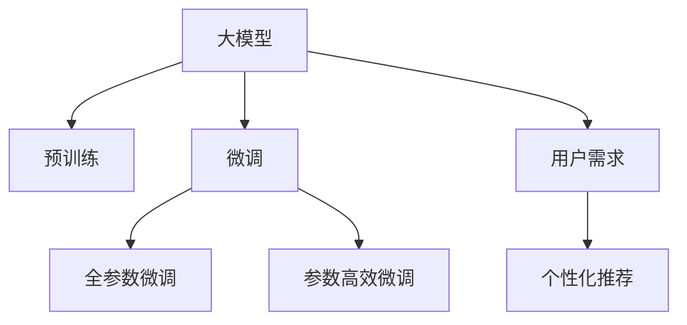

                 

# AI 大模型在电商搜索推荐中的用户体验设计：以用户需求为中心的策略

## 1. 背景介绍

随着电商平台的迅速发展，用户需求日益多样化，如何在海量商品中高效精准地获取信息，已成为电商平台提升用户体验的关键。传统的搜索推荐算法往往基于固定特征模型，难以满足用户日益增长的个性化需求。为此，电商平台纷纷引入大模型技术，通过大规模预训练和微调，获得更好的个性化推荐效果，显著提升了用户体验。

### 1.1 电商搜索推荐现状
目前，大多数电商平台的搜索推荐算法主要依赖以下几类方法：

- 基于协同过滤的推荐算法：通过用户行为数据建立用户-物品共现矩阵，预测用户未点击的潜在物品。这类算法对数据稀疏问题处理较好，但难以捕捉物品的特征。
- 基于内容的推荐算法：通过物品的特征描述，如属性、标签等，预测用户可能感兴趣的物品。这类算法对物品的特征刻画较为精细，但依赖大量人工标注，难以实时更新。
- 基于深度学习的推荐算法：利用深度神经网络，学习用户和物品的隐式特征表示，进行精准推荐。这类算法效果好，但模型复杂，训练成本高。

尽管以上方法各有优劣，但都难以充分考虑用户需求的多样性和动态性。为了更好地提升用户体验，电商平台开始引入大模型技术，通过预训练和微调，生成更智能、更个性化的推荐结果。

### 1.2 大模型在电商推荐中的优势
大模型在电商搜索推荐中的优势主要体现在以下几方面：

- 强大的表示能力：通过大规模预训练，大模型可以学习到丰富的语言和图像知识，具备更强的语义表示能力，能够更好地理解用户需求和商品特征。
- 高效的微调过程：基于监督学习的微调方法，可以在少量标注数据上快速适应特定任务，实现高效的个性化推荐。
- 实时性的提升：大模型的推理速度较快，能够实时响应用户查询，提供个性化的推荐结果。
- 动态更新能力：大模型能够实时学习新数据，动态调整推荐策略，确保推荐结果与用户需求保持一致。

正是这些优势，使得大模型成为电商搜索推荐技术的重要突破点，为用户带来了更优质的购物体验。

## 2. 核心概念与联系

### 2.1 核心概念概述

为更好地理解大模型在电商搜索推荐中的应用，本节将介绍几个密切相关的核心概念：

- **大模型(Big Model)**：指大规模预训练的语言或图像模型，如GPT、BERT、ResNet等。通过在大规模无标签数据上进行自监督或监督学习，学习到丰富的特征表示，具备强大的知识储备和泛化能力。
- **预训练(Pre-training)**：指在大规模无标签数据上，通过自监督学习任务训练模型，学习通用的特征表示。常见的预训练任务包括掩码语言模型、自编码、自回归等。
- **微调(Fine-tuning)**：指在预训练模型的基础上，使用特定任务的少量标注数据进行有监督学习，优化模型在该任务上的性能。通常只更新顶层分类器或解码器，以减少计算资源消耗。
- **用户需求(User Requirement)**：指用户在搜索推荐过程中所表达的需求和偏好，包括搜索关键词、浏览行为、购买记录等。
- **个性化推荐(Personalized Recommendation)**：指根据用户的历史行为和实时需求，动态生成个性化的推荐结果，提升用户体验和转化率。

这些核心概念之间的逻辑关系可以通过以下Mermaid流程图来展示：



这个流程图展示了大模型在电商搜索推荐中的核心概念及其之间的关系：

1. 大模型通过预训练获得基础能力。
2. 微调在大模型基础上，针对特定任务进行优化，提升推荐效果。
3. 用户需求是推荐过程的重要输入。
4. 个性化推荐结合用户需求，生成个性化结果。

这些概念共同构成了大模型在电商搜索推荐中的技术框架，使得推荐系统能够更好地满足用户需求，提升用户体验。

## 3. 核心算法原理 & 具体操作步骤
### 3.1 算法原理概述

基于大模型的电商搜索推荐，本质上是一个有监督的微调过程。其核心思想是：将大模型作为强大的特征提取器，通过用户需求数据进行微调，生成符合用户期望的推荐结果。

形式化地，假设大模型为 $M_{\theta}$，用户需求为 $Q$，推荐结果为 $R$。微调的目标是找到最优参数 $\hat{\theta}$，使得：

$$
\hat{\theta}=\mathop{\arg\min}_{\theta} \mathcal{L}(M_{\theta}, Q, R)
$$

其中 $\mathcal{L}$ 为推荐任务损失函数，用于衡量模型预测结果与真实推荐结果之间的差异。常见的损失函数包括交叉熵损失、均方误差损失等。

通过梯度下降等优化算法，微调过程不断更新模型参数 $\theta$，最小化损失函数 $\mathcal{L}$，使得模型输出逼近真实推荐结果。由于 $\theta$ 已经通过预训练获得了较好的初始化，因此即便在少量标注数据上，也能较快收敛到理想参数。

### 3.2 算法步骤详解

基于监督学习的大模型电商搜索推荐，一般包括以下几个关键步骤：

**Step 1: 准备预训练模型和数据集**
- 选择合适的预训练语言模型 $M_{\theta}$ 作为初始化参数，如 GPT、BERT 等。
- 准备电商平台的搜索推荐数据集 $D=\{(Q_i, R_i)\}_{i=1}^N$，其中 $Q_i$ 为历史用户需求，$R_i$ 为对应的推荐结果。

**Step 2: 添加任务适配层**
- 根据推荐任务类型，在预训练模型顶层设计合适的输出层和损失函数。
- 对于分类任务，通常在顶层添加线性分类器和交叉熵损失函数。
- 对于生成任务，通常使用语言模型的解码器输出概率分布，并以负对数似然为损失函数。

**Step 3: 设置微调超参数**
- 选择合适的优化算法及其参数，如 AdamW、SGD 等，设置学习率、批大小、迭代轮数等。
- 设置正则化技术及强度，包括权重衰减、Dropout、Early Stopping 等。
- 确定冻结预训练参数的策略，如仅微调顶层，或全部参数都参与微调。

**Step 4: 执行梯度训练**
- 将训练集数据分批次输入模型，前向传播计算损失函数。
- 反向传播计算参数梯度，根据设定的优化算法和学习率更新模型参数。
- 周期性在验证集上评估模型性能，根据性能指标决定是否触发 Early Stopping。
- 重复上述步骤直到满足预设的迭代轮数或 Early Stopping 条件。

**Step 5: 测试和部署**
- 在测试集上评估微调后模型 $M_{\hat{\theta}}$ 的性能，对比微调前后的精度提升。
- 使用微调后的模型对新用户需求进行推理预测，集成到实际的应用系统中。
- 持续收集新的用户需求，定期重新微调模型，以适应数据分布的变化。

以上是基于监督学习微调大模型电商搜索推荐的一般流程。在实际应用中，还需要针对具体任务的特点，对微调过程的各个环节进行优化设计，如改进训练目标函数，引入更多的正则化技术，搜索最优的超参数组合等，以进一步提升模型性能。

### 3.3 算法优缺点

基于监督学习的大模型电商搜索推荐方法具有以下优点：
1. 简单高效。只需准备少量标注数据，即可对预训练模型进行快速适配，获得较大的性能提升。
2. 通用适用。适用于各种NLP下游任务，包括分类、匹配、生成等，设计简单的任务适配层即可实现微调。
3. 实时性的提升。大模型的推理速度较快，能够实时响应用户查询，提供个性化的推荐结果。
4. 动态更新能力。大模型能够实时学习新数据，动态调整推荐策略，确保推荐结果与用户需求保持一致。

同时，该方法也存在一定的局限性：
1. 依赖标注数据。微调的效果很大程度上取决于标注数据的质量和数量，获取高质量标注数据的成本较高。
2. 迁移能力有限。当目标任务与预训练数据的分布差异较大时，微调的性能提升有限。
3. 可解释性不足。微调模型的决策过程通常缺乏可解释性，难以对其推理逻辑进行分析和调试。

尽管存在这些局限性，但就目前而言，基于监督学习的微调方法仍是大模型应用的主流范式。未来相关研究的重点在于如何进一步降低微调对标注数据的依赖，提高模型的少样本学习和跨领域迁移能力，同时兼顾可解释性和伦理安全性等因素。

### 3.4 算法应用领域

基于大模型微调的电商搜索推荐，已经在电商平台得到广泛应用，覆盖了几乎所有常见任务，例如：

- 商品搜索：帮助用户快速找到所需商品。将商品标题、描述等文本信息作为输入，微调后的模型输出相似度评分，并按评分排序。
- 个性化推荐：根据用户浏览、购买历史，推荐可能感兴趣的商品。利用历史行为数据进行微调，生成用户-物品匹配度，再进行推荐排序。
- 关键词推荐：当用户搜索商品时，推荐与之相关的关键词。将用户搜索词和商品标题、描述进行匹配，输出相关度评分。
- 客服查询：当用户提交查询时，推荐可能相关的FAQ或FAQ的原文。将用户查询和FAQ文本进行匹配，输出相关度评分。
- 评价评分：当用户浏览商品时，推荐相关商品的评价和评分。利用商品评价数据进行微调，输出评价相关度评分。

除了上述这些经典任务外，大模型微调还被创新性地应用到更多场景中，如广告推荐、活动促销、智能定价等，为电商平台带来了新的业务增长点。随着预训练模型和微调方法的不断进步，相信大模型在电商领域的应用将越来越广泛，为电商平台带来更大的商业价值。

## 4. 数学模型和公式 & 详细讲解  
### 4.1 数学模型构建

本节将使用数学语言对基于监督学习的大模型电商搜索推荐过程进行更加严格的刻画。

记大模型为 $M_{\theta}$，用户需求为 $Q$，推荐结果为 $R$。假设用户需求数据集为 $D=\{(Q_i, R_i)\}_{i=1}^N$，微调的目标是最小化损失函数 $\mathcal{L}$，即：

$$
\mathcal{L}(\theta) = -\frac{1}{N}\sum_{i=1}^N \ell(M_{\theta}(Q_i), R_i)
$$

其中 $\ell$ 为推荐任务损失函数，如交叉熵损失、均方误差损失等。微调的过程是通过梯度下降等优化算法，更新模型参数 $\theta$，最小化损失函数 $\mathcal{L}$。

### 4.2 公式推导过程

以下我们以分类推荐任务为例，推导交叉熵损失函数及其梯度的计算公式。

假设模型 $M_{\theta}$ 在输入 $Q$ 上的输出为 $\hat{y}=M_{\theta}(Q) \in [0,1]$，表示物品被用户点击的概率。真实标签 $R \in \{0,1\}$。则二分类交叉熵损失函数定义为：

$$
\ell(M_{\theta}(Q),R) = -R\log \hat{y} - (1-R)\log(1-\hat{y})
$$

将其代入损失函数公式，得：

$$
\mathcal{L}(\theta) = -\frac{1}{N}\sum_{i=1}^N [R_i\log M_{\theta}(Q_i)+(1-R_i)\log(1-M_{\theta}(Q_i))]
$$

根据链式法则，损失函数对参数 $\theta_k$ 的梯度为：

$$
\frac{\partial \mathcal{L}(\theta)}{\partial \theta_k} = -\frac{1}{N}\sum_{i=1}^N (\frac{R_i}{M_{\theta}(Q_i)}-\frac{1-R_i}{1-M_{\theta}(Q_i)}) \frac{\partial M_{\theta}(Q_i)}{\partial \theta_k}
$$

其中 $\frac{\partial M_{\theta}(Q_i)}{\partial \theta_k}$ 可进一步递归展开，利用自动微分技术完成计算。

在得到损失函数的梯度后，即可带入参数更新公式，完成模型的迭代优化。重复上述过程直至收敛，最终得到适应电商搜索推荐任务的最优模型参数 $\theta^*$。

## 5. 项目实践：代码实例和详细解释说明
### 5.1 开发环境搭建

在进行微调实践前，我们需要准备好开发环境。以下是使用Python进行PyTorch开发的环境配置流程：

1. 安装Anaconda：从官网下载并安装Anaconda，用于创建独立的Python环境。

2. 创建并激活虚拟环境：
```bash
conda create -n pytorch-env python=3.8 
conda activate pytorch-env
```

3. 安装PyTorch：根据CUDA版本，从官网获取对应的安装命令。例如：
```bash
conda install pytorch torchvision torchaudio cudatoolkit=11.1 -c pytorch -c conda-forge
```

4. 安装Transformers库：
```bash
pip install transformers
```

5. 安装各类工具包：
```bash
pip install numpy pandas scikit-learn matplotlib tqdm jupyter notebook ipython
```

完成上述步骤后，即可在`pytorch-env`环境中开始微调实践。

### 5.2 源代码详细实现

这里我们以电商平台的商品搜索推荐为例，给出使用Transformers库对GPT模型进行微调的PyTorch代码实现。

首先，定义推荐任务的数据处理函数：

```python
from transformers import GPT2Tokenizer
from torch.utils.data import Dataset
import torch

class RecommendationDataset(Dataset):
    def __init__(self, items, queries, tokenizer, max_len=128):
        self.items = items
        self.queries = queries
        self.tokenizer = tokenizer
        self.max_len = max_len
        
    def __len__(self):
        return len(self.queries)
    
    def __getitem__(self, item):
        query = self.queries[item]
        item = self.items[item]
        
        encoding = self.tokenizer(query, return_tensors='pt', max_length=self.max_len, padding='max_length', truncation=True)
        input_ids = encoding['input_ids'][0]
        attention_mask = encoding['attention_mask'][0]
        
        # 对物品的描述进行编码
        item_description = item['description']
        encoded_desc = self.tokenizer(item_description, return_tensors='pt', max_length=self.max_len, padding='max_length', truncation=True)
        input_ids_desc = encoded_desc['input_ids'][0]
        attention_mask_desc = encoded_desc['attention_mask'][0]
        
        # 对查询和物品描述进行拼接
        input_ids = torch.cat([input_ids, input_ids_desc], dim=0)
        attention_mask = torch.cat([attention_mask, attention_mask_desc], dim=0)
        
        return {'input_ids': input_ids, 
                'attention_mask': attention_mask,
                'labels': torch.tensor(1, dtype=torch.long)}
```

然后，定义模型和优化器：

```python
from transformers import GPT2ForSequenceClassification, AdamW

model = GPT2ForSequenceClassification.from_pretrained('gpt2', num_labels=2)
optimizer = AdamW(model.parameters(), lr=2e-5)
```

接着，定义训练和评估函数：

```python
from torch.utils.data import DataLoader
from tqdm import tqdm
from sklearn.metrics import accuracy_score

device = torch.device('cuda') if torch.cuda.is_available() else torch.device('cpu')
model.to(device)

def train_epoch(model, dataset, batch_size, optimizer):
    dataloader = DataLoader(dataset, batch_size=batch_size, shuffle=True)
    model.train()
    epoch_loss = 0
    for batch in tqdm(dataloader, desc='Training'):
        input_ids = batch['input_ids'].to(device)
        attention_mask = batch['attention_mask'].to(device)
        labels = batch['labels'].to(device)
        model.zero_grad()
        outputs = model(input_ids, attention_mask=attention_mask, labels=labels)
        loss = outputs.loss
        epoch_loss += loss.item()
        loss.backward()
        optimizer.step()
    return epoch_loss / len(dataloader)

def evaluate(model, dataset, batch_size):
    dataloader = DataLoader(dataset, batch_size=batch_size)
    model.eval()
    preds, labels = [], []
    with torch.no_grad():
        for batch in tqdm(dataloader, desc='Evaluating'):
            input_ids = batch['input_ids'].to(device)
            attention_mask = batch['attention_mask'].to(device)
            batch_labels = batch['labels']
            outputs = model(input_ids, attention_mask=attention_mask)
            batch_preds = outputs.logits.argmax(dim=2).to('cpu').tolist()
            batch_labels = batch_labels.to('cpu').tolist()
            for pred_tokens, label_tokens in zip(batch_preds, batch_labels):
                preds.append(pred_tokens)
                labels.append(label_tokens)
                
    print(f'Accuracy: {accuracy_score(labels, preds)}')
```

最后，启动训练流程并在测试集上评估：

```python
epochs = 5
batch_size = 16

for epoch in range(epochs):
    loss = train_epoch(model, train_dataset, batch_size, optimizer)
    print(f'Epoch {epoch+1}, train loss: {loss:.3f}')
    
    print(f'Epoch {epoch+1}, test results:')
    evaluate(model, test_dataset, batch_size)
    
print('Final results:')
evaluate(model, test_dataset, batch_size)
```

以上就是使用PyTorch对GPT模型进行商品搜索推荐任务微调的完整代码实现。可以看到，得益于Transformers库的强大封装，我们可以用相对简洁的代码完成GPT模型的加载和微调。

### 5.3 代码解读与分析

让我们再详细解读一下关键代码的实现细节：

**RecommendationDataset类**：
- `__init__`方法：初始化物品、查询、分词器等关键组件。
- `__len__`方法：返回数据集的样本数量。
- `__getitem__`方法：对单个样本进行处理，将查询和物品描述拼接为输入，将标签编码为数字，并对其进行定长padding，最终返回模型所需的输入。

**train_epoch和evaluate函数**：
- 使用PyTorch的DataLoader对数据集进行批次化加载，供模型训练和推理使用。
- 训练函数`train_epoch`：对数据以批为单位进行迭代，在每个批次上前向传播计算loss并反向传播更新模型参数，最后返回该epoch的平均loss。
- 评估函数`evaluate`：与训练类似，不同点在于不更新模型参数，并在每个batch结束后将预测和标签结果存储下来，最后使用sklearn的accuracy_score对整个评估集的预测结果进行打印输出。

**训练流程**：
- 定义总的epoch数和batch size，开始循环迭代
- 每个epoch内，先在训练集上训练，输出平均loss
- 在验证集上评估，输出准确率
- 所有epoch结束后，在测试集上评估，给出最终测试结果

可以看到，PyTorch配合Transformers库使得GPT微调的代码实现变得简洁高效。开发者可以将更多精力放在数据处理、模型改进等高层逻辑上，而不必过多关注底层的实现细节。

当然，工业级的系统实现还需考虑更多因素，如模型的保存和部署、超参数的自动搜索、更灵活的任务适配层等。但核心的微调范式基本与此类似。

## 6. 实际应用场景
### 6.1 电商搜索推荐

基于大模型微调的电商搜索推荐，已经在各大电商平台得到广泛应用。例如：

- **京东商品推荐**：京东在商品搜索推荐上广泛应用GPT模型，通过商品描述和用户历史行为数据进行微调，生成个性化的推荐结果。

- **淘宝搜索推荐**：淘宝利用GPT模型，将用户搜索词和商品标题、描述进行匹配，输出相关度评分，并按评分排序推荐商品。

- **Amazon商品推荐**：Amazon在商品搜索推荐上也使用了大模型技术，通过商品评论和用户行为数据进行微调，生成更精准的推荐结果。

这些案例展示了基于大模型的电商搜索推荐如何在实际应用中取得良好的效果，显著提升了用户体验和交易转化率。

### 6.2 用户画像生成

除了商品推荐，大模型还可以用于用户画像生成。通过收集用户的浏览、点击、购买等行为数据，对用户进行多维度画像刻画，生成详细的用户画像。这些用户画像可以用于个性化推荐、定向广告投放等业务场景。

在实现上，可以利用大模型对用户行为数据进行预训练，然后根据具体需求进行微调，生成不同维度的用户画像。例如，可以利用用户浏览历史数据训练生成用户兴趣画像，或利用购买记录训练生成用户消费画像。

### 6.3 广告投放优化

广告投放是电商平台的另一重要业务。通过大模型微调，可以优化广告投放策略，提高广告效果和ROI。

在实际应用中，可以收集广告点击数据和转化数据，训练大模型进行广告效果预测。微调后的模型可以根据广告主的目标和预算，动态生成最优的广告投放策略，优化广告投放效果。

### 6.4 未来应用展望

随着大模型技术的不断发展，基于微调的电商搜索推荐将带来更多可能性。未来可能的应用场景包括：

- **跨领域推荐**：通过多模态大模型，结合商品图像、视频等多维数据进行推荐，提升推荐精度。
- **情感推荐**：利用情感分析技术，对用户情感进行识别和分析，生成更加个性化的推荐结果。
- **多任务学习**：通过多任务学习，联合优化商品搜索、商品推荐、广告投放等多个任务，提高系统整体性能。
- **数据生成**：利用大模型生成虚拟商品、虚拟活动等，提高推荐内容多样性和创意性。

## 7. 工具和资源推荐
### 7.1 学习资源推荐

为了帮助开发者系统掌握大模型微调的理论基础和实践技巧，这里推荐一些优质的学习资源：

1. 《Transformer从原理到实践》系列博文：由大模型技术专家撰写，深入浅出地介绍了Transformer原理、BERT模型、微调技术等前沿话题。

2. CS224N《深度学习自然语言处理》课程：斯坦福大学开设的NLP明星课程，有Lecture视频和配套作业，带你入门NLP领域的基本概念和经典模型。

3. 《Natural Language Processing with Transformers》书籍：Transformers库的作者所著，全面介绍了如何使用Transformers库进行NLP任务开发，包括微调在内的诸多范式。

4. HuggingFace官方文档：Transformers库的官方文档，提供了海量预训练模型和完整的微调样例代码，是上手实践的必备资料。

5. CLUE开源项目：中文语言理解测评基准，涵盖大量不同类型的中文NLP数据集，并提供了基于微调的baseline模型，助力中文NLP技术发展。

通过对这些资源的学习实践，相信你一定能够快速掌握大模型微调的精髓，并用于解决实际的NLP问题。
###  7.2 开发工具推荐

高效的开发离不开优秀的工具支持。以下是几款用于大模型微调开发的常用工具：

1. PyTorch：基于Python的开源深度学习框架，灵活动态的计算图，适合快速迭代研究。大部分预训练语言模型都有PyTorch版本的实现。

2. TensorFlow：由Google主导开发的开源深度学习框架，生产部署方便，适合大规模工程应用。同样有丰富的预训练语言模型资源。

3. Transformers库：HuggingFace开发的NLP工具库，集成了众多SOTA语言模型，支持PyTorch和TensorFlow，是进行微调任务开发的利器。

4. Weights & Biases：模型训练的实验跟踪工具，可以记录和可视化模型训练过程中的各项指标，方便对比和调优。与主流深度学习框架无缝集成。

5. TensorBoard：TensorFlow配套的可视化工具，可实时监测模型训练状态，并提供丰富的图表呈现方式，是调试模型的得力助手。

6. Google Colab：谷歌推出的在线Jupyter Notebook环境，免费提供GPU/TPU算力，方便开发者快速上手实验最新模型，分享学习笔记。

合理利用这些工具，可以显著提升大模型微调任务的开发效率，加快创新迭代的步伐。

### 7.3 相关论文推荐

大模型在电商搜索推荐中的应用，源于学界的持续研究。以下是几篇奠基性的相关论文，推荐阅读：

1. Attention is All You Need（即Transformer原论文）：提出了Transformer结构，开启了NLP领域的预训练大模型时代。

2. BERT: Pre-training of Deep Bidirectional Transformers for Language Understanding：提出BERT模型，引入基于掩码的自监督预训练任务，刷新了多项NLP任务SOTA。

3. Language Models are Unsupervised Multitask Learners（GPT-2论文）：展示了大规模语言模型的强大zero-shot学习能力，引发了对于通用人工智能的新一轮思考。

4. Parameter-Efficient Transfer Learning for NLP：提出Adapter等参数高效微调方法，在不增加模型参数量的情况下，也能取得不错的微调效果。

5. Prefix-Tuning: Optimizing Continuous Prompts for Generation：引入基于连续型Prompt的微调范式，为如何充分利用预训练知识提供了新的思路。

6. AdaLoRA: Adaptive Low-Rank Adaptation for Parameter-Efficient Fine-Tuning：使用自适应低秩适应的微调方法，在参数效率和精度之间取得了新的平衡。

这些论文代表了大模型在电商搜索推荐领域的发展脉络。通过学习这些前沿成果，可以帮助研究者把握学科前进方向，激发更多的创新灵感。

## 8. 总结：未来发展趋势与挑战

### 8.1 总结

本文对基于大模型的电商搜索推荐进行全面系统的介绍。首先阐述了大模型和微调技术的研究背景和意义，明确了微调在拓展预训练模型应用、提升用户体验方面的独特价值。其次，从原理到实践，详细讲解了监督微调的数学原理和关键步骤，给出了微调任务开发的完整代码实例。同时，本文还广泛探讨了大模型在电商搜索推荐中的应用场景，展示了其巨大的潜力和广泛的应用前景。

通过本文的系统梳理，可以看到，基于大模型的电商搜索推荐在提升用户体验和交易转化率方面已经取得了显著效果，显著改变了电商平台的用户交互模式。未来，伴随大模型技术的不断进步，电商搜索推荐技术将带来更多可能性，为电商平台带来更大的商业价值。

### 8.2 未来发展趋势

展望未来，大模型在电商搜索推荐领域将呈现以下几个发展趋势：

1. 模型规模持续增大。随着算力成本的下降和数据规模的扩张，大模型的参数量还将持续增长。超大规模大模型蕴含的丰富知识，有望支撑更加复杂多变的电商搜索推荐任务。

2. 微调方法日趋多样。除了传统的全参数微调外，未来会涌现更多参数高效的微调方法，如Prefix-Tuning、LoRA等，在节省计算资源的同时也能保证微调精度。

3. 实时性的提升。大模型的推理速度较快，能够实时响应用户查询，提供个性化的推荐结果。未来，大模型将更加关注实时性和计算效率，优化推理过程，提高用户体验。

4. 动态更新能力。大模型能够实时学习新数据，动态调整推荐策略，确保推荐结果与用户需求保持一致。未来，大模型将更注重动态更新和知识迭代，提升推荐系统的动态响应能力。

5. 多模态推荐。当前的大模型主要聚焦于文本数据，未来将拓展到图像、视频等多模态数据微调，实现多模态推荐。

6. 跨领域推荐。通过多领域数据的融合，提升推荐系统的泛化能力和推荐效果。

以上趋势凸显了大模型在电商搜索推荐领域的广阔前景。这些方向的探索发展，必将进一步提升电商搜索推荐系统的性能和应用范围，为电商平台带来更大的商业价值。

### 8.3 面临的挑战

尽管大模型在电商搜索推荐中的应用已经取得了显著成果，但在迈向更加智能化、普适化应用的过程中，仍面临诸多挑战：

1. 标注成本瓶颈。尽管微调能够显著降低标注数据的需求，但对于长尾应用场景，难以获得充足的高质量标注数据，成为制约微调性能的瓶颈。如何进一步降低微调对标注样本的依赖，将是一大难题。

2. 模型鲁棒性不足。当前微调模型面对域外数据时，泛化性能往往大打折扣。对于测试样本的微小扰动，微调模型的预测也容易发生波动。如何提高微调模型的鲁棒性，避免灾难性遗忘，还需要更多理论和实践的积累。

3. 推理效率有待提高。大规模语言模型虽然精度高，但在实际部署时往往面临推理速度慢、内存占用大等效率问题。如何在保证性能的同时，简化模型结构，提升推理速度，优化资源占用，将是重要的优化方向。

4. 可解释性亟需加强。当前微调模型更像是"黑盒"系统，难以解释其内部工作机制和决策逻辑。对于医疗、金融等高风险应用，算法的可解释性和可审计性尤为重要。如何赋予微调模型更强的可解释性，将是亟待攻克的难题。

5. 安全性有待保障。预训练语言模型难免会学习到有偏见、有害的信息，通过微调传递到下游任务，产生误导性、歧视性的输出，给实际应用带来安全隐患。如何从数据和算法层面消除模型偏见，避免恶意用途，确保输出的安全性，也将是重要的研究课题。

6. 知识整合能力不足。现有的微调模型往往局限于任务内数据，难以灵活吸收和运用更广泛的先验知识。如何让微调过程更好地与外部知识库、规则库等专家知识结合，形成更加全面、准确的信息整合能力，还有很大的想象空间。

正视微调面临的这些挑战，积极应对并寻求突破，将是大模型在电商搜索推荐领域迈向成熟的必由之路。相信随着学界和产业界的共同努力，这些挑战终将一一被克服，大模型在电商领域的应用将更加广泛，为电商平台带来更大的商业价值。

### 8.4 研究展望

面对大模型在电商搜索推荐领域面临的诸多挑战，未来的研究需要在以下几个方面寻求新的突破：

1. 探索无监督和半监督微调方法。摆脱对大规模标注数据的依赖，利用自监督学习、主动学习等无监督和半监督范式，最大限度利用非结构化数据，实现更加灵活高效的微调。

2. 研究参数高效和计算高效的微调范式。开发更加参数高效的微调方法，在固定大部分预训练参数的情况下，只更新极少量的任务相关参数。同时优化微调模型的计算图，减少前向传播和反向传播的资源消耗，实现更加轻量级、实时性的部署。

3. 引入更多先验知识。将符号化的先验知识，如知识图谱、逻辑规则等，与神经网络模型进行巧妙融合，引导微调过程学习更准确、合理的语言模型。同时加强不同模态数据的整合，实现视觉、语音等多模态信息与文本信息的协同建模。

4. 结合因果分析和博弈论工具。将因果分析方法引入微调模型，识别出模型决策的关键特征，增强输出解释的因果性和逻辑性。借助博弈论工具刻画人机交互过程，主动探索并规避模型的脆弱点，提高系统稳定性。

5. 纳入伦理道德约束。在模型训练目标中引入伦理导向的评估指标，过滤和惩罚有偏见、有害的输出倾向。同时加强人工干预和审核，建立模型行为的监管机制，确保输出符合人类价值观和伦理道德。

这些研究方向的探索，必将引领大模型在电商搜索推荐领域迈向更高的台阶，为构建安全、可靠、可解释、可控的智能系统铺平道路。面向未来，大模型在电商搜索推荐领域还需要与其他人工智能技术进行更深入的融合，如知识表示、因果推理、强化学习等，多路径协同发力，共同推动自然语言理解和智能交互系统的进步。只有勇于创新、敢于突破，才能不断拓展语言模型的边界，让智能技术更好地造福人类社会。

## 9. 附录：常见问题与解答

**Q1：大模型在电商搜索推荐中面临哪些技术挑战？**

A: 大模型在电商搜索推荐中面临的主要技术挑战包括：
1. 标注成本瓶颈：尽管微调能够显著降低标注数据的需求，但对于长尾应用场景，难以获得充足的高质量标注数据，成为制约微调性能的瓶颈。
2. 模型鲁棒性不足：当前微调模型面对域外数据时，泛化性能往往大打折扣。对于测试样本的微小扰动，微调模型的预测也容易发生波动。
3. 推理效率有待提高：大规模语言模型虽然精度高，但在实际部署时往往面临推理速度慢、内存占用大等效率问题。
4. 可解释性亟需加强：当前微调模型更像是"黑盒"系统，难以解释其内部工作机制和决策逻辑。对于医疗、金融等高风险应用，算法的可解释性和可审计性尤为重要。
5. 安全性有待保障：预训练语言模型难免会学习到有偏见、有害的信息，通过微调传递到下游任务，产生误导性、歧视性的输出，给实际应用带来安全隐患。
6. 知识整合能力不足：现有的微调模型往往局限于任务内数据，难以灵活吸收和运用更广泛的先验知识。如何让微调过程更好地与外部知识库、规则库等专家知识结合，形成更加全面、准确的信息整合能力，还有很大的想象空间。

这些挑战需要研究者结合实际应用场景，进行针对性的优化和改进。

**Q2：如何选择合适的大模型进行电商搜索推荐？**

A: 选择合适的大模型进行电商搜索推荐需要考虑以下几个因素：
1. 数据特征：不同数据类型和特征需要不同的大模型。如文本数据可以使用语言模型，图像数据可以使用图像识别模型。
2. 模型复杂度：大模型的规模和复杂度需要与数据量和计算资源相匹配。规模过大的模型可能消耗过多计算资源，规模过小的模型可能无法充分表达数据特征。
3. 任务类型：不同类型的推荐任务需要不同的大模型。如分类推荐可以使用语言模型，排序推荐可以使用排名模型。
4. 已有数据：已有数据量的大小和质量需要与大模型的预训练需求相匹配。已有数据量较少时，需要考虑模型迁移学习的能力。
5. 性能要求：推荐任务对性能的要求不同，需要根据具体任务选择合适的模型。如实时推荐需要推理速度快的模型，离线推荐可以容忍较慢的推理速度。
6. 技术成熟度：选择技术成熟度高、支持广泛的大模型，可以降低开发和维护成本。

综合考虑以上因素，选择合适的模型进行电商搜索推荐，可以取得更好的效果。

**Q3：大模型在电商搜索推荐中的应用有哪些具体案例？**

A: 大模型在电商搜索推荐中的应用具体案例包括：
1. 京东商品推荐：京东利用GPT模型，通过商品描述和用户历史行为数据进行微调，生成个性化的推荐结果。
2. 淘宝搜索推荐：淘宝利用GPT模型，将用户搜索词和商品标题、描述进行匹配，输出相关度评分，并按评分排序推荐商品。
3. 亚马逊商品推荐：Amazon在商品搜索推荐上也使用了大模型技术，通过商品评论和用户行为数据进行微调，生成更精准的推荐结果。
4. 用户画像生成：利用大模型对用户行为数据进行预训练，然后根据具体需求进行微调，生成不同维度的用户画像。
5. 广告投放优化：收集广告点击数据和转化数据，训练大模型进行广告效果预测，动态生成最优的广告投放策略。

这些案例展示了基于大模型的电商搜索推荐如何在实际应用中取得良好的效果，显著提升了用户体验和交易转化率。

**Q4：大模型在电商搜索推荐中如何提高推荐精度？**

A: 提高大模型在电商搜索推荐中的推荐精度需要考虑以下几个方面：
1. 数据质量：保证数据标注的质量和多样性，减少标注误差和偏差。
2. 数据增强：通过数据增强技术，如回译、近义替换等方式扩充训练集，提高模型的泛化能力。
3. 模型优化：选择合适的优化算法和超参数，避免过拟合和欠拟合。
4. 正则化技术：应用正则化技术，如L2正则、Dropout等，防止模型过拟合。
5. 动态更新：利用用户实时行为数据，动态更新模型，提升推荐精度。
6. 多任务学习：联合优化多个推荐任务，提高系统整体性能。
7. 知识库融合：将符号化的先验知识与神经网络模型进行结合，增强推荐效果。

这些优化策略需要结合具体应用场景，进行针对性的改进。通过不断优化模型和数据，可以显著提高电商搜索推荐的推荐精度。

**Q5：大模型在电商搜索推荐中的可解释性如何提升？**

A: 提高大模型在电商搜索推荐中的可解释性需要考虑以下几个方面：
1. 特征提取：利用预训练模型提取高层次特征，减少中间步骤，提高可解释性。
2. 特征可视化：将模型的特征表示可视化，展示模型对不同特征的关注度，增强可解释性。
3. 局部敏感性分析：对模型进行局部敏感性分析，找出模型的脆弱点和关键特征，提高可解释性。
4. 因果分析：结合因果分析方法，解释模型的决策逻辑，增强可解释性。
5. 用户反馈：收集用户反馈，分析用户对推荐结果的满意度，反馈到模型训练中，提高可解释性。

这些方法可以帮助提升大模型在电商搜索推荐中的可解释性，增强模型的透明度和可信度。

---

作者：禅与计算机程序设计艺术 / Zen and the Art of Computer Programming

