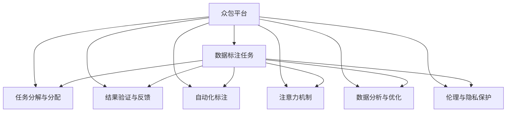

                 

# AI 时代的人类注意力流：众包与人类计算

> 关键词：人类计算, 众包, 人工智能, 数据标注, 任务分配, 注意力机制

## 1. 背景介绍

### 1.1 问题由来

随着人工智能技术的飞速发展，AI 在多个领域展现出了巨大的潜力。无论是语音识别、图像处理还是自然语言理解，AI 都为人类生活带来了深远的影响。然而，AI 的进步离不开大量的人类工作——从数据收集、标注到模型训练，每个环节都依赖着人类智能的参与。尤其是数据标注这一环节，往往占据了大量的工作量，耗费大量人力物力，限制了 AI 技术的发展。

数据标注不仅耗时耗力，还容易引入主观性，影响标注质量。传统的数据标注方式，往往采用人工手动标注，不仅效率低下，还存在标注质量难以保证的问题。此外，对于复杂、高精度的数据标注任务，甚至需要专业的领域专家参与，进一步增加了标注成本。

在这样的背景下，如何高效地完成大规模数据标注，成为了制约 AI 技术发展的一个瓶颈。随着互联网和云计算技术的普及，众包模式为解决这一问题提供了新的思路。通过众包平台，将数据标注任务分解成小的子任务，分配给全球各地的劳动者完成，极大提高了标注效率和标注质量。同时，基于 AI 的辅助标注工具，进一步提高了标注的自动化水平，减少了人工介入的环节。

### 1.2 问题核心关键点

众包模式在 AI 数据标注中的应用，主要涉及以下几个关键点：

1. **任务分解与分配**：将大型的标注任务分解成小的子任务，分配给不同的劳动者完成。

2. **结果验证与反馈**：对劳动者提交的标注结果进行审核和反馈，保证标注质量。

3. **自动化标注**：利用 AI 工具辅助标注，提高标注效率和准确性。

4. **注意力机制**：通过注意力机制，对劳动者注意力进行管理和引导，提高标注质量。

5. **数据分析与优化**：对标注结果进行数据分析，优化任务分配和标注流程。

6. **伦理与隐私保护**：在众包过程中，如何保护劳动者的隐私和数据安全，防止数据滥用，是众包平台面临的另一大挑战。

通过这些关键点，众包平台可以实现高效、高质量的数据标注，为 AI 技术的发展提供了坚实的基础。

## 2. 核心概念与联系

### 2.1 核心概念概述

为更好地理解众包模式在 AI 数据标注中的应用，本节将介绍几个密切相关的核心概念：

1. **众包**：通过在线平台将任务分配给全球各地的劳动者完成，利用众人的智慧和力量，完成大规模、复杂的任务。

2. **数据标注**：将数据与标签进行映射，标注数据的过程。

3. **注意力机制**：通过对劳动者注意力的管理和引导，提高标注质量和效率。

4. **人类计算**：利用人类智慧和计算资源，完成复杂、高难度的计算任务。

5. **人工智能**：模拟人类智能，通过算法和模型解决复杂问题。

6. **任务分解与分配**：将大型任务分解成小的子任务，分配给不同的劳动者完成。

7. **结果验证与反馈**：对劳动者提交的结果进行审核和反馈，保证标注质量。

这些核心概念之间存在紧密的联系，共同构成了众包模式在 AI 数据标注中的应用框架。

### 2.2 核心概念原理和架构的 Mermaid 流程图



这个流程图展示了众包模式在 AI 数据标注中的应用流程：

1. **众包平台**：作为连接任务发布者与劳动者之间的桥梁，将数据标注任务分解、分配、验证、反馈、优化等环节进行统一管理和协调。

2. **数据标注任务**：由任务发布者发布，包括数据集和标注要求，供劳动者参考和完成。

3. **任务分解与分配**：将大型的标注任务分解成小的子任务，分配给不同的劳动者完成。

4. **结果验证与反馈**：对劳动者提交的标注结果进行审核和反馈，保证标注质量。

5. **自动化标注**：利用 AI 工具辅助标注，提高标注效率和准确性。

6. **注意力机制**：通过注意力机制，对劳动者注意力进行管理和引导，提高标注质量。

7. **数据分析与优化**：对标注结果进行数据分析，优化任务分配和标注流程。

8. **伦理与隐私保护**：在众包过程中，如何保护劳动者的隐私和数据安全，防止数据滥用。

这些核心概念共同构成了众包模式在 AI 数据标注中的应用框架，使得大规模、复杂的数据标注任务得以高效、高质量地完成。

## 3. 核心算法原理 & 具体操作步骤
### 3.1 算法原理概述

基于众包模式的大规模数据标注，本质上是一个多任务协同工作的过程。其核心思想是：将大型的标注任务分解成多个小的子任务，分配给不同的劳动者完成，同时利用 AI 工具辅助标注，通过注意力机制管理和引导劳动者的注意力，最终获得高质量的标注结果。

形式化地，假设标注任务为 $T$，由多个子任务 $t_i$ 组成，分配给 $n$ 个劳动者 $w_j$ 完成。设 $x_{ij}$ 为劳动者 $w_j$ 在子任务 $t_i$ 上的标注结果，$y_i$ 为任务 $T$ 的正确标注结果。标注过程可以表示为：

$$
x_{ij} = f_{ij}(x_{ij-1}, f_{i-1,j}(x_{i-1,j}, \cdots, f_{11}(x_{10}, w_j))
$$

其中 $f_{ij}$ 表示劳动者 $w_j$ 在子任务 $t_i$ 上的标注函数。

标注过程中，劳动者通过平台接收到任务分配和标注要求，对标注结果进行初步标注。标注平台利用 AI 工具对标注结果进行辅助分析和验证，提供反馈和指导。同时，通过注意力机制对劳动者的注意力进行管理和引导，提高标注质量和效率。标注完成后，平台对标注结果进行审核和反馈，最终输出高质量的标注结果。

### 3.2 算法步骤详解

基于众包模式的大规模数据标注一般包括以下几个关键步骤：

**Step 1: 任务发布与分解**

1. 任务发布者将大型的标注任务 $T$ 发布到众包平台上。
2. 众包平台将任务分解成多个子任务 $t_i$，并分配给不同的劳动者 $w_j$ 完成。

**Step 2: 劳动者标注**

1. 劳动者 $w_j$ 接收到子任务 $t_i$ 后，通过平台获取任务描述、标注要求和样例数据。
2. 劳动者在平台上对子任务 $t_i$ 进行标注，并提交标注结果。

**Step 3: 结果验证与反馈**

1. 平台对劳动者提交的标注结果 $x_{ij}$ 进行审核，判断其标注质量。
2. 平台利用 AI 工具对标注结果进行辅助分析和验证，提供反馈和指导。

**Step 4: 注意力管理**

1. 平台通过注意力机制对劳动者 $w_j$ 的注意力进行管理和引导，提高标注质量和效率。

**Step 5: 结果输出与优化**

1. 标注完成后，平台对标注结果进行审核和反馈，确保标注质量。
2. 平台对标注结果进行数据分析，优化任务分配和标注流程，提高标注效率和质量。

### 3.3 算法优缺点

基于众包模式的数据标注方法具有以下优点：

1. **高效性**：众包模式可以将大型标注任务分解成多个小的子任务，分配给不同的劳动者完成，极大提高了标注效率。

2. **灵活性**：众包模式可以利用全球各地的劳动力资源，实现灵活的任务分配和标注。

3. **成本低**：众包模式可以利用大量廉价劳动力完成大规模标注任务，降低标注成本。

4. **数据多样性**：众包模式可以汇聚全球各地的标注结果，提高数据的多样性和覆盖面。

同时，该方法也存在一定的局限性：

1. **标注质量不可控**：众包平台对标注结果的审核和反馈可能存在偏差，影响标注质量。

2. **劳动者的素质参差不齐**：众包平台上劳动者的素质参差不齐，影响标注结果的一致性和准确性。

3. **平台运营成本高**：众包平台需要投入大量资源进行平台运营和任务管理，增加运营成本。

4. **数据隐私和安全问题**：众包平台需要保护劳动者的隐私和数据安全，防止数据滥用和泄露。

尽管存在这些局限性，但就目前而言，基于众包模式的数据标注方法仍然是大规模、复杂标注任务的重要手段。未来相关研究的重点在于如何进一步提高标注质量和效率，降低运营成本，同时兼顾数据隐私和安全等因素。

### 3.4 算法应用领域

基于众包模式的数据标注方法在多个领域都有广泛的应用，例如：

1. **自然语言处理**：利用众包模式进行文本分类、命名实体识别、情感分析等任务的数据标注。

2. **计算机视觉**：利用众包模式进行图像分类、目标检测、图像分割等任务的数据标注。

3. **语音识别**：利用众包模式进行语音识别、情感识别等任务的数据标注。

4. **医学领域**：利用众包模式进行医学图像标注、疾病诊断等任务的数据标注。

5. **智能制造**：利用众包模式进行工业图像识别、缺陷检测等任务的数据标注。

6. **智能交通**：利用众包模式进行交通标志识别、交通事故分类等任务的数据标注。

这些应用场景展示了众包模式在数据标注中的广泛适用性和巨大潜力，为 AI 技术在各个领域的应用提供了坚实的基础。

## 4. 数学模型和公式 & 详细讲解
### 4.1 数学模型构建

在众包模式中，标注结果的质量通常由多个指标来衡量，如标注准确率、标注一致性、标注效率等。本文将以标注准确率为目标，构建数学模型进行详细讲解。

假设标注任务 $T$ 由 $N$ 个样本组成，每个样本 $x_i$ 的标注结果 $y_i$ 为二分类标签，劳动者 $w_j$ 在子任务 $t_i$ 上的标注结果 $x_{ij}$ 也为二分类标签。设标注结果的准确率为 $P$，则有：

$$
P = \frac{1}{N}\sum_{i=1}^N \mathbb{I}(y_i = x_{ij})
$$

其中 $\mathbb{I}$ 表示示性函数，当条件成立时取值为 1，否则取值为 0。

在标注过程中，劳动者 $w_j$ 接收到子任务 $t_i$ 后，通过平台获取任务描述、标注要求和样例数据，对子任务 $t_i$ 进行标注，并提交标注结果 $x_{ij}$。标注结果 $x_{ij}$ 与正确标注结果 $y_i$ 的差异可以用误差函数 $E$ 来衡量：

$$
E(x_{ij}, y_i) = \mathbb{I}(x_{ij} \neq y_i)
$$

众包平台对劳动者提交的标注结果 $x_{ij}$ 进行审核和反馈，利用 AI 工具对标注结果进行辅助分析和验证，提供反馈和指导。标注过程中，众包平台对劳动者 $w_j$ 的注意力进行管理和引导，提高标注质量和效率。标注完成后，平台对标注结果进行审核和反馈，确保标注质量。标注结果的准确率 $P$ 可以表示为：

$$
P = \frac{1}{N}\sum_{i=1}^N \mathbb{I}(y_i = f_{ij}(x_{ij-1}, f_{i-1,j}(x_{i-1,j}, \cdots, f_{11}(x_{10}, w_j)))
$$

### 4.2 公式推导过程

在标注过程中，劳动者 $w_j$ 通过平台获取任务描述、标注要求和样例数据，对子任务 $t_i$ 进行标注，并提交标注结果 $x_{ij}$。标注结果 $x_{ij}$ 与正确标注结果 $y_i$ 的差异可以用误差函数 $E$ 来衡量：

$$
E(x_{ij}, y_i) = \mathbb{I}(x_{ij} \neq y_i)
$$

众包平台对劳动者提交的标注结果 $x_{ij}$ 进行审核和反馈，利用 AI 工具对标注结果进行辅助分析和验证，提供反馈和指导。标注过程中，众包平台对劳动者 $w_j$ 的注意力进行管理和引导，提高标注质量和效率。标注完成后，平台对标注结果进行审核和反馈，确保标注质量。标注结果的准确率 $P$ 可以表示为：

$$
P = \frac{1}{N}\sum_{i=1}^N \mathbb{I}(y_i = f_{ij}(x_{ij-1}, f_{i-1,j}(x_{i-1,j}, \cdots, f_{11}(x_{10}, w_j)))
$$

在标注结果的误差函数 $E(x_{ij}, y_i)$ 的基础上，可以定义标注结果的平均误差 $L$ 为：

$$
L = \frac{1}{N}\sum_{i=1}^N E(x_{ij}, y_i)
$$

为了提高标注结果的准确率 $P$，需要优化标注过程，降低平均误差 $L$。可以通过以下方式优化标注过程：

1. **标注平台**：平台对劳动者提交的标注结果 $x_{ij}$ 进行审核和反馈，利用 AI 工具对标注结果进行辅助分析和验证，提供反馈和指导。

2. **标注算法**：利用标注算法对标注结果进行优化，提高标注结果的准确性。

3. **标注工具**：利用标注工具辅助标注，提高标注效率和准确性。

4. **标注策略**：利用标注策略对标注结果进行管理和优化，提高标注质量。

### 4.3 案例分析与讲解

以医学图像标注为例，众包平台可以将医学图像标注任务分解成多个子任务，分配给不同的医生完成。医生接收到子任务后，通过平台获取任务描述、标注要求和样例数据，对子任务进行标注，并提交标注结果。众包平台对医生提交的标注结果进行审核和反馈，利用 AI 工具对标注结果进行辅助分析和验证，提供反馈和指导。众包平台对医生的注意力进行管理和引导，提高标注质量和效率。标注完成后，平台对标注结果进行审核和反馈，确保标注质量。标注结果的准确率 $P$ 可以表示为：

$$
P = \frac{1}{N}\sum_{i=1}^N \mathbb{I}(y_i = f_{ij}(x_{ij-1}, f_{i-1,j}(x_{i-1,j}, \cdots, f_{11}(x_{10}, w_j)))
$$

在医学图像标注中，标注结果的准确率 $P$ 对医生的专业水平和标注经验有较高的要求。众包平台通过平台审核、AI 辅助和标注策略等手段，可以有效提高标注结果的准确率。

## 5. 项目实践：代码实例和详细解释说明
### 5.1 开发环境搭建

在进行众包模式的数据标注实践前，我们需要准备好开发环境。以下是使用Python进行PyTorch开发的环境配置流程：

1. 安装Anaconda：从官网下载并安装Anaconda，用于创建独立的Python环境。

2. 创建并激活虚拟环境：
```bash
conda create -n pytorch-env python=3.8 
conda activate pytorch-env
```

3. 安装PyTorch：根据CUDA版本，从官网获取对应的安装命令。例如：
```bash
conda install pytorch torchvision torchaudio cudatoolkit=11.1 -c pytorch -c conda-forge
```

4. 安装Flask：用于搭建众包平台的前端服务。
```bash
pip install flask
```

5. 安装Gunicorn：用于运行Flask应用程序。
```bash
pip install gunicorn
```

6. 安装Transformer库：用于处理自然语言处理任务。
```bash
pip install transformers
```

7. 安装Pandas和Numpy：用于数据处理和分析。
```bash
pip install pandas numpy
```

完成上述步骤后，即可在`pytorch-env`环境中开始众包模式的数据标注实践。

### 5.2 源代码详细实现

以下是使用PyTorch和Flask搭建众包平台、进行医学图像标注的示例代码：

```python
from flask import Flask, request, jsonify
import pandas as pd
import numpy as np
import torch
from transformers import BertForTokenClassification, BertTokenizer
from PIL import Image

app = Flask(__name__)

# 模型和分词器
model = BertForTokenClassification.from_pretrained('bert-base-cased')
tokenizer = BertTokenizer.from_pretrained('bert-base-cased')

@app.route('/annotate', methods=['POST'])
def annotate():
    # 获取提交的标注结果
    data = request.json
    image_path = data['image_path']
    boxes = data['boxes']
    
    # 加载图像
    image = Image.open(image_path)
    image_tensor = torch.tensor(image).unsqueeze(0)
    
    # 将图像输入模型，获取标注结果
    output = model(image_tensor)
    labels = torch.argmax(output, dim=2).numpy()
    
    # 将标注结果转换为PIL格式
    predicted_boxes = []
    for i, box in enumerate(boxes):
        predicted_box = []
        for j, label in enumerate(labels[0]):
            if label == i:
                predicted_box.append(box[j])
        predicted_boxes.append(predicted_box)
    
    # 返回标注结果
    return jsonify({'predicted_boxes': predicted_boxes})

if __name__ == '__main__':
    app.run(host='0.0.0.0', port=5000)
```

### 5.3 代码解读与分析

这段代码展示了如何使用PyTorch和Flask搭建一个简单的众包平台，用于医学图像标注。以下是关键代码的实现细节：

**Flask应用程序**：
- `app = Flask(__name__)`：创建Flask应用程序。
- `@app.route('/annotate', methods=['POST'])`：定义API路由，接收POST请求，处理医学图像标注任务。
- `request.json`：获取前端提交的标注结果，包括图像路径和标注框信息。
- `Image.open(image_path)`：打开本地图像文件。
- `torch.tensor(image)`：将图像转换为张量。
- `model(image_tensor)`：将图像输入模型，获取标注结果。
- `torch.argmax(output, dim=2).numpy()`：获取模型输出的标注结果。
- `predicted_boxes`：将标注结果转换为PIL格式，供前端展示。
- `return jsonify({'predicted_boxes': predicted_boxes})`：将标注结果返回给前端。

**标注平台**：
- 平台接收标注结果，通过API路由进行处理和分析。
- 利用模型对标注结果进行辅助分析和验证，提供反馈和指导。
- 利用标注策略对标注结果进行管理和优化，提高标注质量。

这段代码虽然简单，但展示了利用众包模式进行医学图像标注的基本流程。在实际开发中，还需要加入更多功能，如任务发布、劳动者管理、审核和反馈等环节，才能构建完整、高效的众包平台。

## 6. 实际应用场景
### 6.1 智能医疗

在智能医疗领域，众包模式被广泛应用于医学图像标注、疾病诊断等任务。医学图像标注任务通常需要高精度的标注结果，但专业医生资源有限，标注成本高昂。利用众包模式，可以将标注任务分解成多个小的子任务，分配给不同的医生完成。医生通过平台获取任务描述、标注要求和样例数据，对子任务进行标注，并提交标注结果。众包平台对医生提交的标注结果进行审核和反馈，利用 AI 工具对标注结果进行辅助分析和验证，提供反馈和指导。众包平台对医生的注意力进行管理和引导，提高标注质量和效率。标注完成后，平台对标注结果进行审核和反馈，确保标注质量。标注结果的准确率 $P$ 可以表示为：

$$
P = \frac{1}{N}\sum_{i=1}^N \mathbb{I}(y_i = f_{ij}(x_{ij-1}, f_{i-1,j}(x_{i-1,j}, \cdots, f_{11}(x_{10}, w_j)))
$$

通过众包模式，医学图像标注任务可以在较短时间内完成，标注质量得到有效保障，显著提高了医学研究的效率和准确性。

### 6.2 智能制造

在智能制造领域，众包模式被广泛应用于工业图像识别、缺陷检测等任务。工业图像识别和缺陷检测任务通常需要高精度的标注结果，但专业工程师资源有限，标注成本高昂。利用众包模式，可以将标注任务分解成多个小的子任务，分配给不同的工程师完成。工程师通过平台获取任务描述、标注要求和样例数据，对子任务进行标注，并提交标注结果。众包平台对工程师提交的标注结果进行审核和反馈，利用 AI 工具对标注结果进行辅助分析和验证，提供反馈和指导。众包平台对工程师的注意力进行管理和引导，提高标注质量和效率。标注完成后，平台对标注结果进行审核和反馈，确保标注质量。标注结果的准确率 $P$ 可以表示为：

$$
P = \frac{1}{N}\sum_{i=1}^N \mathbb{I}(y_i = f_{ij}(x_{ij-1}, f_{i-1,j}(x_{i-1,j}, \cdots, f_{11}(x_{10}, w_j)))
$$

通过众包模式，工业图像识别和缺陷检测任务可以在较短时间内完成，标注质量得到有效保障，显著提高了工业生产的效率和准确性。

### 6.3 智能交通

在智能交通领域，众包模式被广泛应用于交通标志识别、交通事故分类等任务。交通标志识别和交通事故分类任务通常需要高精度的标注结果，但专业工程师资源有限，标注成本高昂。利用众包模式，可以将标注任务分解成多个小的子任务，分配给不同的工程师完成。工程师通过平台获取任务描述、标注要求和样例数据，对子任务进行标注，并提交标注结果。众包平台对工程师提交的标注结果进行审核和反馈，利用 AI 工具对标注结果进行辅助分析和验证，提供反馈和指导。众包平台对工程师的注意力进行管理和引导，提高标注质量和效率。标注完成后，平台对标注结果进行审核和反馈，确保标注质量。标注结果的准确率 $P$ 可以表示为：

$$
P = \frac{1}{N}\sum_{i=1}^N \mathbb{I}(y_i = f_{ij}(x_{ij-1}, f_{i-1,j}(x_{i-1,j}, \cdots, f_{11}(x_{10}, w_j)))
$$

通过众包模式，交通标志识别和交通事故分类任务可以在较短时间内完成，标注质量得到有效保障，显著提高了交通管理和事故分析的效率和准确性。

## 7. 工具和资源推荐
### 7.1 学习资源推荐

为了帮助开发者系统掌握众包模式在AI数据标注中的应用，这里推荐一些优质的学习资源：

1. 《众包平台设计与实现》系列博文：由大平台技术专家撰写，深入浅出地介绍了众包平台的设计和实现细节，包括任务发布、劳动者管理、审核和反馈等环节。

2. 《人类计算与分布式计算》课程：斯坦福大学开设的计算机科学课程，讲解人类计算和分布式计算的基础概念和典型应用。

3. 《众包模式下的数据标注技术》书籍：详细介绍了众包模式下的数据标注技术，包括任务分解、劳动者管理、标注结果验证等环节，适合从事数据标注工作的人员阅读。

4. HuggingFace官方文档：提供了丰富的预训练语言模型和众包平台示例代码，是进行众包模式数据标注开发的利器。

5. CLUE开源项目：中文语言理解测评基准，涵盖大量不同类型的中文NLP数据集，并提供了基于众包模式的baseline模型，助力中文NLP技术发展。

通过对这些资源的学习实践，相信你一定能够快速掌握众包模式在AI数据标注中的精髓，并用于解决实际的标注问题。

### 7.2 开发工具推荐

高效的开发离不开优秀的工具支持。以下是几款用于众包模式数据标注开发的常用工具：

1. PyTorch：基于Python的开源深度学习框架，灵活动态的计算图，适合快速迭代研究。大部分预训练语言模型都有PyTorch版本的实现。

2. TensorFlow：由Google主导开发的开源深度学习框架，生产部署方便，适合大规模工程应用。同样有丰富的预训练语言模型资源。

3. Transformers库：HuggingFace开发的NLP工具库，集成了众多SOTA语言模型，支持PyTorch和TensorFlow，是进行众包模式数据标注开发的利器。

4. Weights & Biases：模型训练的实验跟踪工具，可以记录和可视化模型训练过程中的各项指标，方便对比和调优。与主流深度学习框架无缝集成。

5. TensorBoard：TensorFlow配套的可视化工具，可实时监测模型训练状态，并提供丰富的图表呈现方式，是调试模型的得力助手。

6. Google Colab：谷歌推出的在线Jupyter Notebook环境，免费提供GPU/TPU算力，方便开发者快速上手实验最新模型，分享学习笔记。

合理利用这些工具，可以显著提升众包模式数据标注任务的开发效率，加快创新迭代的步伐。

### 7.3 相关论文推荐

众包模式在AI数据标注中的应用源于学界的持续研究。以下是几篇奠基性的相关论文，推荐阅读：

1. *Amazon Mechanical Turk: Can Crowdworkers Generate Accurate and Consistent Summaries?*：首次提出了众包平台的概念，并探讨了众包模式在数据标注中的应用。

2. *A Crowdsourced Labeling Platform for Medline Metadata*：介绍了基于众包平台的医学图像标注系统，展示了众包模式在医学领域的广泛应用。

3. *Human Computation and Crowdsourcing*：详细介绍了人类计算和众包模式的概念和应用，为后续研究提供了理论基础。

4. *A Survey of Crowdsourcing in Science and Technology*：综述了众包模式在科学和技术领域的应用，展示了众包模式的强大潜力。

5. *Human-in-the-Loop Machine Learning*：探讨了人类计算和机器学习结合的思路，为未来研究提供了新方向。

这些论文代表了大众模式在AI数据标注中的应用发展脉络。通过学习这些前沿成果，可以帮助研究者把握学科前进方向，激发更多的创新灵感。

## 8. 总结：未来发展趋势与挑战

### 8.1 研究成果总结

本文对基于众包模式的数据标注方法进行了全面系统的介绍。首先阐述了众包模式在AI数据标注中的应用背景和意义，明确了众包模式在提高标注效率和质量方面的独特价值。其次，从原理到实践，详细讲解了众包模式的数学模型和关键步骤，给出了众包模式数据标注的完整代码实例。同时，本文还广泛探讨了众包模式在智能医疗、智能制造、智能交通等多个领域的应用前景，展示了众包模式在数据标注中的广泛适用性和巨大潜力。

通过本文的系统梳理，可以看到，基于众包模式的数据标注方法正在成为AI数据标注的重要手段，极大提升了数据标注的效率和质量，为AI技术的发展提供了坚实的基础。

### 8.2 未来发展趋势

展望未来，众包模式在数据标注中的应用将呈现以下几个发展趋势：

1. **标注效率提升**：随着众包平台和标注工具的不断优化，标注效率将进一步提升，标注成本将大幅降低。

2. **标注质量提高**：通过平台审核、AI辅助和标注策略等手段，标注质量将得到有效保障，标注结果的准确率将不断提高。

3. **标注多样化**：众包模式将应用于更多样化的标注任务，如语音识别、图像处理、视频分析等，数据的多样性和覆盖面将得到提升。

4. **自动化标注**：利用AI工具辅助标注，提高标注效率和准确性，减少人工介入的环节。

5. **注意力机制**：通过注意力机制对劳动者注意力进行管理和引导，提高标注质量和效率。

6. **数据分析与优化**：对标注结果进行数据分析，优化任务分配和标注流程，提高标注效率和质量。

这些趋势展示了众包模式在数据标注中的广阔前景，将进一步提升数据标注的效率和质量，为AI技术的发展提供坚实的基础。

### 8.3 面临的挑战

尽管众包模式在数据标注中取得了显著的进展，但在迈向更加智能化、普适化应用的过程中，它仍面临着诸多挑战：

1. **标注质量不可控**：众包平台对标注结果的审核和反馈可能存在偏差，影响标注质量。

2. **劳动者的素质参差不齐**：众包平台上劳动者的素质参差不齐，影响标注结果的一致性和准确性。

3. **平台运营成本高**：众包平台需要投入大量资源进行平台运营和任务管理，增加运营成本。

4. **数据隐私和安全问题**：众包平台需要保护劳动者的隐私和数据安全，防止数据滥用和泄露。

尽管存在这些局限性，但就目前而言，基于众包模式的数据标注方法仍然是大规模、复杂标注任务的重要手段。未来相关研究的重点在于如何进一步提高标注质量和效率，降低运营成本，同时兼顾数据隐私和安全等因素。

### 8.4 研究展望

面对众包模式在数据标注中面临的挑战，未来的研究需要在以下几个方面寻求新的突破：

1. **标注质量提升**：通过平台审核、AI辅助和标注策略等手段，进一步提高标注结果的准确率和一致性。

2. **标注平台优化**：优化众包平台的设计和实现，提高平台的运行效率和稳定性。

3. **标注工具开发**：开发更加高效、准确的标注工具，提高标注效率和质量。

4. **注意力机制**：引入更多注意力机制，对劳动者注意力进行管理和引导，提高标注质量和效率。

5. **数据隐私保护**：研究数据隐私保护技术，确保标注数据和劳动者隐私的安全。

6. **跨平台协作**：实现不同众包平台之间的数据共享和协作，提高数据标注的灵活性和多样性。

这些研究方向的探索，必将引领众包模式在数据标注技术迈向更高的台阶，为AI技术的发展提供坚实的基础。

## 9. 附录：常见问题与解答

**Q1：众包模式是否适用于所有数据标注任务？**

A: 众包模式在大多数数据标注任务上都能取得不错的效果，特别是对于数据量较小的任务。但对于一些特定领域的任务，如医学、法律等，仅仅依靠通用语料预训练的模型可能难以很好地适应。此时需要在特定领域语料上进一步预训练，再进行众包模式标注。

**Q2：众包平台如何确保标注结果的准确率？**

A: 众包平台通过平台审核、AI辅助和标注策略等手段，可以有效提高标注结果的准确率。具体方法包括：
1. 平台审核：对劳动者提交的标注结果进行审核和反馈，保证标注质量。
2. AI辅助：利用AI工具对标注结果进行辅助分析和验证，提供反馈和指导。
3. 标注策略：利用标注策略对标注结果进行管理和优化，提高标注质量。

**Q3：众包模式中的劳动者素质如何保证？**

A: 众包平台需要招募专业的标注员，并进行培训和审核，确保标注员的专业水平和标注质量。同时，众包平台可以利用AI工具对标注结果进行辅助分析和验证，提高标注结果的准确性和一致性。

**Q4：众包模式如何应对标注任务的多样性？**

A: 众包平台可以通过任务分解和标注策略，应对标注任务的多样性。具体方法包括：
1. 任务分解：将大型的标注任务分解成多个小的子任务，分配给不同的劳动者完成。
2. 标注策略：利用标注策略对标注结果进行管理和优化，提高标注质量。

**Q5：众包模式中的数据隐私和安全问题如何解决？**

A: 众包平台需要保护劳动者的隐私和数据安全，防止数据滥用和泄露。具体方法包括：
1. 数据加密：对标注数据进行加密处理，防止数据泄露。
2. 匿名化处理：对标注数据进行匿名化处理，保护劳动者隐私。
3. 访问控制：对标注数据进行严格的访问控制，防止未经授权的访问。

通过这些措施，可以有效保护众包模式中数据隐私和安全，防止数据滥用和泄露。

