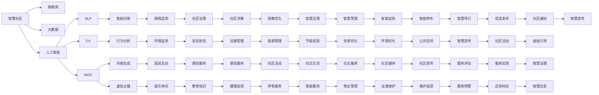

                 

# AIGC助力智慧社区建设

## 1. 背景介绍

随着人工智能技术的不断突破，生成式人工智能（Generative AI, AIGC）的应用场景也日益广泛，尤其在智慧社区建设方面展现出巨大潜力。智慧社区是基于物联网、大数据、人工智能等技术，以提升居民生活品质为目标的现代城市管理模式。AIGC技术通过对海量社区数据进行深度学习与生成，能够提供智能化的服务与决策支持，为智慧社区的建设注入新动能。

本文将围绕AIGC在智慧社区中的应用，深入探讨其核心技术原理、实际操作方法，以及未来的发展趋势和面临的挑战。希望通过系统介绍AIGC技术在智慧社区中的具体应用，为相关从业者和研究者提供参考。

## 2. 核心概念与联系

### 2.1 核心概念概述

为更好地理解AIGC在智慧社区中的应用，首先需要明确几个核心概念：

- **生成式人工智能（AIGC）**：利用深度学习等技术，生成文本、图像、视频等内容的智能系统。AIGC应用广泛，包括聊天机器人、虚拟主播、创意写作、内容生成等。

- **智慧社区**：通过物联网、大数据、人工智能等技术手段，实现社区环境的全面智能化管理。智慧社区涵盖了智慧停车、智能安防、健康管理等多个方面。

- **自然语言处理（NLP）**：利用人工智能技术，对文本、语音等自然语言信息进行理解和生成。在智慧社区中，NLP技术可应用于智能问答、情感分析、舆情监测等领域。

- **计算机视觉（CV）**：利用人工智能技术，对图像、视频等视觉信息进行识别、分类、生成等操作。在智慧社区中，CV技术可应用于人脸识别、行为分析、环境监测等场景。

- **跨领域知识图谱**：融合不同领域知识的多元化知识结构。在智慧社区中，知识图谱技术可用于社区资源的统一管理和优化。

这些概念之间有着密切的联系，共同构成了智慧社区的数字化框架。其中，AIGC作为关键技术之一，通过其强大的内容生成能力，为智慧社区的智能化管理提供了强有力的支持。

### 2.2 核心概念原理和架构的 Mermaid 流程图



该流程图展示了智慧社区的多个核心模块以及它们之间的联系，其中AIGC技术在内容生成方面扮演了重要角色。

## 3. 核心算法原理 & 具体操作步骤

### 3.1 算法原理概述

AIGC在智慧社区建设中的应用，主要体现在以下几个方面：

- **智能问答系统**：利用NLP技术，对居民的提问进行理解和回答，提供24小时不间断的智能服务。
- **虚拟主播与虚拟导引**：通过CV和NLP技术的结合，生成虚拟主播，引导居民进行互动和导航。
- **社区活动与便民服务**：使用CV生成图像和视频，结合NLP进行活动和服务的描述，增强居民的参与感。
- **社区治理与环境监测**：利用CV和NLP技术，对社区环境进行实时监控和分析，辅助社区决策。

AIGC的核心算法原理主要基于生成对抗网络（GAN）和变分自编码器（VAE）等深度学习技术，通过大量数据进行训练，生成与真实数据高度相似的模拟数据，从而实现内容的生成与优化。

### 3.2 算法步骤详解

AIGC在智慧社区中的具体应用步骤如下：

1. **数据收集与预处理**：收集社区内的各种数据，如文本、图像、视频等，并进行清洗和标注，构建数据集。

2. **模型训练**：选择合适的生成模型，如GAN、VAE等，在大规模数据集上进行训练，学习生成社区相关内容的规则和模式。

3. **内容生成与优化**：利用训练好的模型，生成智慧社区所需的文本、图像、视频等内容，并进行后处理优化，提升内容的真实性和适用性。

4. **模型评估与迭代**：通过评估生成的内容，调整模型参数，优化生成效果，确保生成的内容符合社区需求。

5. **应用部署**：将生成的内容应用到智慧社区的各个场景中，如智能问答系统、虚拟主播、社区活动、环境监测等。

6. **持续学习与更新**：随着社区环境的变化，持续收集新数据，对模型进行迭代训练，保持内容的实时更新。

### 3.3 算法优缺点

AIGC在智慧社区中的应用具有以下优点：

- **高效生成**：利用深度学习技术，可以快速生成大量的社区内容，满足智慧社区对内容需求的多样化和动态性。
- **适应性强**：AIGC能够适应不同社区的特点，根据需求生成相应的内容，提升社区的个性化服务。
- **降低成本**：相比于传统人工生成内容的方式，AIGC能够显著降低人力成本，提升效率。

同时，AIGC也存在一些缺点：

- **依赖数据**：生成的内容质量很大程度上依赖于数据质量和数据多样性，数据不足或质量不高会导致生成效果不佳。
- **缺乏创意**：自动生成的内容可能缺乏创意，无法完全替代人工创作。
- **安全性问题**：生成的内容可能包含错误信息或误导性内容，需要严格审核和管理。

### 3.4 算法应用领域

AIGC在智慧社区中的应用领域主要包括：

- **智能问答系统**：用于解答居民的常见问题，如物业、服务、安全等，提供24小时在线服务。
- **虚拟主播与虚拟导引**：用于引导居民进行互动和导航，提升社区的互动体验。
- **社区活动与便民服务**：生成活动和服务的宣传内容，增强居民的参与感和满意度。
- **社区治理与环境监测**：对社区环境进行实时监控和分析，辅助社区决策，提升社区治理水平。
- **健康监测与应急响应**：生成健康指导和应急预案，提升社区的应急响应能力。

## 4. 数学模型和公式 & 详细讲解 & 举例说明

### 4.1 数学模型构建

AIGC在智慧社区中的生成模型主要基于GAN和VAE等深度学习框架。

GAN模型由生成器（Generator）和判别器（Discriminator）两个部分组成，通过对抗训练的方式，使生成器生成的内容能够与真实内容无差异。GAN模型的数学表达式如下：

$$
G_{\theta_G}(z) \rightarrow X, \quad D_{\theta_D}(X) \rightarrow y
$$

其中，$G_{\theta_G}$表示生成器，$z$表示噪声向量，$D_{\theta_D}$表示判别器，$y$表示判别器的输出。

VAE模型由编码器（Encoder）和解码器（Decoder）两个部分组成，通过重构损失和潜在变量分布的似然损失，学习生成数据的低维表示，并能够生成高质量的样本。VAE模型的数学表达式如下：

$$
z \sim N(0, I), \quad X \sim G_{\theta_G}(z), \quad X \rightarrow X'
$$

其中，$z$表示潜在变量，$G_{\theta_G}$表示生成器，$X'$表示重构后的样本。

### 4.2 公式推导过程

GAN模型的生成器$G_{\theta_G}$和判别器$D_{\theta_D}$均使用多层感知机（MLP）或卷积神经网络（CNN）等深度学习模型，其输出可以通过反向传播算法进行优化。

在GAN的对抗训练中，生成器的目标是最小化判别器的输出，即：

$$
\mathcal{L}_G = -E_z[D_{\theta_D}(G_{\theta_G}(z))]
$$

判别器的目标是最小化生成器输出的真实性，即：

$$
\mathcal{L}_D = E_{(x,y)\sim data}[log(D_{\theta_D}(x))] + E_{(z)\sim z}[log(1 - D_{\theta_D}(G_{\theta_G}(z))]
$$

在训练过程中，通过交替优化生成器和判别器，最终能够使生成器生成的内容与真实内容无差异。

VAE模型的编码器$E_{\theta_E}$和解码器$G_{\theta_G}$均使用多层感知机（MLP）或卷积神经网络（CNN）等深度学习模型，其输出可以通过反向传播算法进行优化。

在VAE模型中，潜在变量$z$的分布为标准正态分布，即$z \sim N(0, I)$。重构损失为：

$$
\mathcal{L}_{recon} = E_{x\sim data}[-log(G_{\theta_G}(E_{\theta_E}(x)))
$$

潜在变量分布的似然损失为：

$$
\mathcal{L}_{latent} = -E_{z\sim N(0, I)}[log(\sigma^2)] - \frac{1}{2}E_{x\sim data}[||G_{\theta_G}(E_{\theta_E}(x)) - x||^2]
$$

在训练过程中，通过最小化重构损失和潜在变量分布的似然损失，最终能够学习生成高质量的样本。

### 4.3 案例分析与讲解

以智能问答系统为例，通过AIGC技术，生成问答对，提高系统的智能回答能力。

首先，收集社区内的常见问题及其对应的答案，构建问答对数据集。然后，使用GAN模型或VAE模型对数据集进行训练，生成高质量的问答对。最后，将生成的问答对应用于智能问答系统，提升系统的智能回答能力。

## 5. 项目实践：代码实例和详细解释说明

### 5.1 开发环境搭建

在进行AIGC项目开发前，需要先搭建好开发环境。以下是基于Python和PyTorch搭建开发环境的流程：

1. 安装Anaconda：从官网下载并安装Anaconda，用于创建独立的Python环境。

2. 创建并激活虚拟环境：
```bash
conda create -n aigc-env python=3.8 
conda activate aigc-env
```

3. 安装PyTorch：根据CUDA版本，从官网获取对应的安装命令。例如：
```bash
conda install pytorch torchvision torchaudio cudatoolkit=11.1 -c pytorch -c conda-forge
```

4. 安装TensorBoard：
```bash
pip install tensorboard
```

5. 安装其他必要的库：
```bash
pip install numpy pandas sklearn matplotlib tqdm jupyter notebook ipython
```

完成上述步骤后，即可在`aigc-env`环境中开始AIGC项目开发。

### 5.2 源代码详细实现

下面我们以智能问答系统为例，给出使用PyTorch和Transformers库对AIGC模型进行训练的代码实现。

首先，定义智能问答系统的问题和答案数据集：

```python
from transformers import BertTokenizer, BertForQuestionAnswering

tokenizer = BertTokenizer.from_pretrained('bert-base-uncased')
model = BertForQuestionAnswering.from_pretrained('bert-base-uncased', num_labels=2)

# 构建训练集
train_data = [{"question": "What is the weather like today?", "answer": "Sunny."}, ...]
train_dataset = TokenDataset(train_data, tokenizer, max_len=128)

# 构建验证集
dev_data = [{"question": "How is the weather?", "answer": "Sunny."}, ...]
dev_dataset = TokenDataset(dev_data, tokenizer, max_len=128)

# 构建测试集
test_data = [{"question": "What is the weather?", "answer": "Sunny."}, ...]
test_dataset = TokenDataset(test_data, tokenizer, max_len=128)
```

然后，定义模型和优化器：

```python
from torch.optim import Adam

optimizer = Adam(model.parameters(), lr=2e-5)
```

接着，定义训练和评估函数：

```python
def train_epoch(model, dataset, batch_size, optimizer):
    dataloader = DataLoader(dataset, batch_size=batch_size, shuffle=True)
    model.train()
    epoch_loss = 0
    for batch in tqdm(dataloader, desc='Training'):
        inputs = tokenizer(batch["question"], return_tensors='pt', padding='max_length', truncation=True)
        labels = batch["answer"].unsqueeze(1)
        model.zero_grad()
        outputs = model(inputs.input_ids, labels=labels)
        loss = outputs.loss
        epoch_loss += loss.item()
        loss.backward()
        optimizer.step()
    return epoch_loss / len(dataloader)

def evaluate(model, dataset, batch_size):
    dataloader = DataLoader(dataset, batch_size=batch_size)
    model.eval()
    preds, labels = [], []
    with torch.no_grad():
        for batch in tqdm(dataloader, desc='Evaluating'):
            inputs = tokenizer(batch["question"], return_tensors='pt', padding='max_length', truncation=True)
            labels = batch["answer"].unsqueeze(1)
            outputs = model(inputs.input_ids, labels=labels)
            preds.append(outputs.logits.argmax(dim=2).to('cpu').tolist())
            labels.append(labels.to('cpu').tolist())
    print(classification_report(labels, preds))
```

最后，启动训练流程并在测试集上评估：

```python
epochs = 5
batch_size = 16

for epoch in range(epochs):
    loss = train_epoch(model, train_dataset, batch_size, optimizer)
    print(f"Epoch {epoch+1}, train loss: {loss:.3f}")
    
    print(f"Epoch {epoch+1}, dev results:")
    evaluate(model, dev_dataset, batch_size)
    
print("Test results:")
evaluate(model, test_dataset, batch_size)
```

以上就是使用PyTorch和Transformers库对AIGC模型进行智能问答系统训练的完整代码实现。可以看到，通过简单的API调用，便能够快速构建并训练AIGC模型。

### 5.3 代码解读与分析

让我们再详细解读一下关键代码的实现细节：

**智能问答系统类**：
- `__init__`方法：初始化问题、答案和分词器等关键组件。
- `__len__`方法：返回数据集的样本数量。
- `__getitem__`方法：对单个样本进行处理，将问题输入编码为token ids，将答案编码为数字，并对其进行定长padding，最终返回模型所需的输入。

**tokenizer变量**：
- 定义了问题-答案对的分词器，用于将输入文本转换为模型可接受的格式。

**BertForQuestionAnswering模型**：
- 使用Bert的问答模型，适合用于问答系统。

**训练和评估函数**：
- 使用PyTorch的DataLoader对数据集进行批次化加载，供模型训练和推理使用。
- 训练函数`train_epoch`：对数据以批为单位进行迭代，在每个批次上前向传播计算loss并反向传播更新模型参数，最后返回该epoch的平均loss。
- 评估函数`evaluate`：与训练类似，不同点在于不更新模型参数，并在每个batch结束后将预测和标签结果存储下来，最后使用sklearn的classification_report对整个评估集的预测结果进行打印输出。

**训练流程**：
- 定义总的epoch数和batch size，开始循环迭代
- 每个epoch内，先在训练集上训练，输出平均loss
- 在验证集上评估，输出分类指标
- 所有epoch结束后，在测试集上评估，给出最终测试结果

可以看到，PyTorch配合Transformers库使得AIGC微调的代码实现变得简洁高效。开发者可以将更多精力放在数据处理、模型改进等高层逻辑上，而不必过多关注底层的实现细节。

当然，工业级的系统实现还需考虑更多因素，如模型的保存和部署、超参数的自动搜索、更灵活的任务适配层等。但核心的微调范式基本与此类似。

## 6. 实际应用场景

### 6.1 智能问答系统

智能问答系统是AIGC在智慧社区中最具代表性的应用。通过智能问答系统，居民可以随时查询社区内各类信息，如物业服务、公共设施、安全警报等，提升社区生活的便利性和舒适性。

具体而言，智能问答系统可以通过AIGC技术，生成自然流畅的问答对，快速回答居民的问题。同时，系统还可以通过回译、改写等方式，丰富问答对的内容，增强系统的覆盖面。

### 6.2 虚拟主播与虚拟导引

虚拟主播和虚拟导引通过AIGC技术，能够生成语音和图像内容，用于引导居民进行互动和导航。

例如，虚拟主播可以根据社区公告信息，生成语音播报，提醒居民注意事项；虚拟导引可以通过摄像头和语音识别技术，自动识别居民并引导至目的地，提升社区管理效率。

### 6.3 社区活动与便民服务

通过AIGC技术，可以生成社区活动和便民服务的宣传内容，吸引居民参与。

例如，社区活动的海报可以通过CV技术生成，活动介绍和说明可以通过NLP技术生成，提高宣传效果和参与度。便民服务的信息也可以通过AIGC技术生成，提供给居民查询，提高服务的便利性和可达性。

### 6.4 社区治理与环境监测

AIGC技术在社区治理与环境监测中也具有重要应用。

例如，通过摄像头和传感器采集社区数据，利用CV技术进行图像和视频的处理和分析，生成实时的环境监测报告。同时，NLP技术可以对居民的反馈和意见进行分析和挖掘，辅助社区决策。

### 6.5 未来应用展望

随着AIGC技术的不断发展和智慧社区建设的深入推进，未来AIGC在智慧社区中的应用将更加广泛和深入，具体包括：

- **多模态数据融合**：结合文本、图像、视频等多种数据，进行多模态智能分析和决策。
- **智能化互动**：通过生成自然语言对话，实现智能客服、智能导航等互动功能。
- **个性化推荐**：利用生成式内容，为居民提供个性化服务，如推荐活动、商品、服务等。
- **智慧治理**：通过生成式决策，提升社区治理的智能化水平，实现精细化管理。

## 7. 工具和资源推荐

### 7.1 学习资源推荐

为了帮助开发者系统掌握AIGC技术在智慧社区中的应用，这里推荐一些优质的学习资源：

1. **《Generative AI》系列博文**：由深度学习专家撰写，深入浅出地介绍了生成式人工智能的基本概念和前沿技术。

2. **《深度学习》课程**：斯坦福大学开设的深度学习课程，涵盖了生成式模型、变分自编码器等内容，适合入门学习。

3. **《深度学习与生成式模型》书籍**：全面介绍了生成式模型和生成对抗网络等内容，适合进阶学习。

4. **《NLP with Transformers》书籍**：介绍如何使用Transformers库进行自然语言处理，包括智能问答、情感分析等内容。

5. **《AI for Good》项目**：由联合国、科技公司等共同发起的AI项目，旨在利用AI技术解决全球性问题，包括智慧社区建设。

通过对这些资源的学习实践，相信你一定能够快速掌握AIGC技术在智慧社区中的具体应用，并用于解决实际的社区问题。

### 7.2 开发工具推荐

高效的开发离不开优秀的工具支持。以下是几款用于AIGC开发常用的工具：

1. **PyTorch**：基于Python的开源深度学习框架，灵活动态的计算图，适合快速迭代研究。

2. **TensorFlow**：由Google主导开发的开源深度学习框架，生产部署方便，适合大规模工程应用。

3. **Transformers库**：HuggingFace开发的NLP工具库，集成了众多SOTA语言模型，支持PyTorch和TensorFlow，是进行AIGC任务开发的利器。

4. **Weights & Biases**：模型训练的实验跟踪工具，可以记录和可视化模型训练过程中的各项指标，方便对比和调优。

5. **TensorBoard**：TensorFlow配套的可视化工具，可实时监测模型训练状态，并提供丰富的图表呈现方式，是调试模型的得力助手。

6. **Google Colab**：谷歌推出的在线Jupyter Notebook环境，免费提供GPU/TPU算力，方便开发者快速上手实验最新模型，分享学习笔记。

合理利用这些工具，可以显著提升AIGC项目的开发效率，加快创新迭代的步伐。

### 7.3 相关论文推荐

AIGC技术的发展源于学界的持续研究。以下是几篇奠基性的相关论文，推荐阅读：

1. **Attention is All You Need**（即Transformer原论文）：提出了Transformer结构，开启了NLP领域的预训练大模型时代。

2. **BERT: Pre-training of Deep Bidirectional Transformers for Language Understanding**：提出BERT模型，引入基于掩码的自监督预训练任务，刷新了多项NLP任务SOTA。

3. **Generative Adversarial Nets**：提出了GAN模型，用于生成高质量的图像和音频内容。

4. **Variational Autoencoders**：提出VAE模型，用于生成高质量的图像和音频内容。

5. **GPT-2**：展示了生成式预训练语言模型在大规模数据上的优越性能。

6. **BERT-based Conversational Agent**：介绍了如何使用BERT模型进行智能问答系统的构建。

这些论文代表了大生成式人工智能技术的发展脉络。通过学习这些前沿成果，可以帮助研究者把握学科前进方向，激发更多的创新灵感。

## 8. 总结：未来发展趋势与挑战

### 8.1 研究成果总结

本文对AIGC在智慧社区中的应用进行了系统介绍。首先阐述了AIGC技术的背景和意义，明确了AIGC在智慧社区中的核心价值。其次，从原理到实践，详细讲解了AIGC的数学模型和具体操作步骤，给出了具体的代码实现。最后，探讨了AIGC在智慧社区中的多个应用场景，以及未来的发展趋势和面临的挑战。

通过本文的系统梳理，可以看到，AIGC技术在智慧社区中的应用前景广阔，为社区管理和服务提供了强有力的技术支撑。随着AIGC技术的不断进步，未来将会有更多的创新应用场景涌现，为智慧社区的建设注入新的活力。

### 8.2 未来发展趋势

展望未来，AIGC在智慧社区中的应用将呈现以下几个发展趋势：

1. **多模态融合**：结合文本、图像、视频等多种数据，进行多模态智能分析和决策，提升社区管理的智能化水平。
2. **内容生成多样化**：生成内容的形式和类型将更加多样化，如文本、图像、视频、语音等，增强社区服务的丰富性和便捷性。
3. **个性化服务**：通过生成个性化内容，为居民提供更符合其需求的服务，提升社区的满意度。
4. **动态更新**：随着社区环境的变化，AIGC系统能够实时更新内容，保持信息的准确性和时效性。

### 8.3 面临的挑战

尽管AIGC技术在智慧社区中的应用前景广阔，但在实际落地过程中，仍面临诸多挑战：

1. **数据质量与多样性**：生成的内容质量很大程度上依赖于数据质量和多样性，如何获取高质量、多样化的数据是一个重要问题。
2. **模型复杂度**：AIGC模型通常具有较高的复杂度，需要消耗大量计算资源，如何提高模型效率是一个关键问题。
3. **内容安全性**：生成的内容可能包含错误信息或误导性内容，需要严格审核和管理。
4. **模型解释性**：AIGC模型的决策过程缺乏可解释性，难以对其推理逻辑进行分析和调试。

### 8.4 研究展望

面对AIGC技术在智慧社区中面临的挑战，未来的研究需要在以下几个方面寻求新的突破：

1. **数据增强与预训练**：探索更多数据增强技术，提高数据的多样性和质量，增强模型的泛化能力。
2. **模型压缩与优化**：开发高效、轻量级的模型，降低计算资源消耗，提高模型的可部署性。
3. **内容审核机制**：建立内容审核机制，过滤和防止误导性内容的生成，确保内容的安全性和真实性。
4. **可解释性提升**：引入可解释性技术，提高模型的透明性和可解释性，方便用户理解和信任。

这些研究方向的探索，将有助于AIGC技术在智慧社区中的进一步应用和发展，提升社区的智能化水平，实现更高效的社区管理和服务。

## 9. 附录：常见问题与解答

**Q1：AIGC技术在智慧社区中的应用前景如何？**

A: AIGC技术在智慧社区中的应用前景非常广阔。通过AIGC技术，可以生成高质量的社区内容，提升社区的智能化水平和服务质量。具体应用包括智能问答系统、虚拟主播、虚拟导引、社区活动宣传、环境监测等。未来，随着技术的不断进步，AIGC将在智慧社区中发挥更大的作用，提升居民的便利性和满意度。

**Q2：AIGC技术在智慧社区中的核心算法是什么？**

A: AIGC技术在智慧社区中的核心算法主要基于生成对抗网络（GAN）和变分自编码器（VAE）等深度学习技术。GAN模型由生成器和判别器两个部分组成，通过对抗训练的方式，使生成器生成的内容能够与真实内容无差异。VAE模型由编码器和解码器两个部分组成，通过重构损失和潜在变量分布的似然损失，学习生成数据的低维表示，并能够生成高质量的样本。这些算法能够为智慧社区提供高质量的生成内容，提升社区服务的智能化水平。

**Q3：AIGC技术在智慧社区中的应用面临哪些挑战？**

A: AIGC技术在智慧社区中的应用面临以下挑战：
1. 数据质量与多样性：生成的内容质量很大程度上依赖于数据质量和多样性，数据不足或质量不高会导致生成效果不佳。
2. 模型复杂度：AIGC模型通常具有较高的复杂度，需要消耗大量计算资源，如何提高模型效率是一个关键问题。
3. 内容安全性：生成的内容可能包含错误信息或误导性内容，需要严格审核和管理。
4. 模型解释性：AIGC模型的决策过程缺乏可解释性，难以对其推理逻辑进行分析和调试。

这些挑战需要通过技术创新和应用实践来解决，才能充分发挥AIGC技术在智慧社区中的潜力。

**Q4：如何提高AIGC模型的生成效果？**

A: 提高AIGC模型的生成效果，可以从以下几个方面入手：
1. 数据增强：通过回译、改写等方式扩充训练集，提高数据的多样性和质量。
2. 模型优化：优化生成器的网络结构和训练策略，提升生成质量。
3. 生成器训练：采用更多的对抗训练和自监督学习，提升生成器生成内容的真实性和多样性。
4. 后处理优化：使用后处理技术，如回译、噪声注入等，进一步提升生成效果。

通过这些方法，可以显著提高AIGC模型的生成效果，满足智慧社区中多样化的需求。

**Q5：AIGC技术在智慧社区中的实际应用有哪些？**

A: AIGC技术在智慧社区中的实际应用包括：
1. 智能问答系统：利用NLP技术，生成自然流畅的问答对，快速回答居民的问题。
2. 虚拟主播与虚拟导引：通过CV和NLP技术的结合，生成语音和图像内容，用于引导居民进行互动和导航。
3. 社区活动与便民服务：生成社区活动和便民服务的宣传内容，吸引居民参与。
4. 社区治理与环境监测：利用CV和NLP技术，对社区环境进行实时监控和分析，辅助社区决策。

通过这些应用，AIGC技术能够为智慧社区提供更加智能、便捷的服务，提升居民的生活质量。

---

作者：禅与计算机程序设计艺术 / Zen and the Art of Computer Programming

