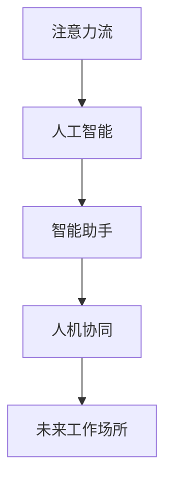

                 

# AI与人类注意力流 :未来的工作场所和注意力管理

> 关键词：注意力流,人工智能,人类工作方式,智能助手,人机协同,未来工作场所

## 1. 背景介绍

### 1.1 问题由来
当前，随着信息技术的快速发展，全球工作环境发生了剧烈变化。一方面，数字化的普及使得工作效率得到了极大提升，远程办公、线上协作等新模式正逐渐成为常态。另一方面，信息爆炸带来的注意力分散和认知负荷，给员工的身心健康带来了严峻挑战。如何高效利用数字化工具，提升员工的工作专注度和满意度，成为现代企业亟待解决的问题。

### 1.2 问题核心关键点
为解决上述问题，本文聚焦于基于人工智能的注意力流管理技术。人工智能技术可以通过对人类注意力的科学分析和精准预测，帮助个体和组织更好地分配和管理注意力，从而提升工作效率和满意度。关键点包括：

- 科学分析人类注意力流，识别常见的工作注意力陷阱和分心的来源。
- 开发智能助手工具，实时监控和调节用户的注意力状态，提供个性化建议。
- 推动人机协同，实现任务自动化和决策辅助，减轻用户认知负担。
- 探索未来的工作场所，结合注意力流管理技术，构建高效、舒适、人性化的数字化办公环境。

### 1.3 问题研究意义
研究基于人工智能的注意力流管理技术，对于提升现代企业的工作效率和员工满意度具有重要意义：

1. 提升工作效率。科学分析注意力流可以帮助员工避免常见的工作分心和效率陷阱，提高工作效率。
2. 改善工作体验。通过智能工具的实时监控和个性化建议，减轻员工认知负荷，提高工作满意度和心理福祉。
3. 优化组织管理。从宏观角度来看，注意力流管理技术可以辅助组织进行高效的资源分配和流程优化，提高整体的运营效率。
4. 推动行业进步。注意力流管理的理念和方法，可以为更多领域提供参考，推动各行各业数字化转型的步伐。

## 2. 核心概念与联系

### 2.1 核心概念概述

为更好地理解基于人工智能的注意力流管理技术，本节将介绍几个密切相关的核心概念：

- 注意力流(Attention Flow)：指人类工作过程中注意力资源的变化轨迹，包括焦点区域、分心阶段和注意力转移等动态变化。
- 人工智能(AI)：通过模拟人类认知和行为模式，实现智能决策和辅助任务。
- 智能助手(Intelligent Assistant)：利用AI技术，对人类注意力流进行分析和预测，提供实时建议和决策辅助。
- 人机协同(Human-Machine Collaboration)：通过AI技术的辅助，使人类和机器能够高效协作，实现任务自动化和优化。
- 未来工作场所(The Future Workplace)：结合人工智能和人类注意力流管理技术，构建的高效、舒适、人性化的办公环境。

这些核心概念之间的逻辑关系可以通过以下Mermaid流程图来展示：



这个流程图展示了大语言模型的核心概念及其之间的关系：

1. 注意力流作为人类工作过程的核心，是AI技术分析和优化的对象。
2. AI通过科学分析和预测，对注意力流进行实时监控和管理。
3. 智能助手作为AI技术的体现，提供个性化的注意力流优化建议。
4. 人机协同技术使得AI和人类可以高效协作，提升工作效率和满意度。
5. 未来工作场所基于AI和注意力流管理技术，实现更加智能和人性化的办公环境。

## 3. 核心算法原理 & 具体操作步骤
### 3.1 算法原理概述

基于人工智能的注意力流管理技术，核心在于利用AI技术对注意力流进行科学分析和精准预测，进而提供个性化的优化建议和实时监控。其核心算法包括注意力分析、预测和优化等几个主要环节。

具体来说，注意力流管理技术的过程如下：

1. 数据采集：通过传感器、日志记录等方式，采集用户的注意力流数据，如眼动轨迹、鼠标移动、按键操作等。
2. 注意力分析：利用机器学习和数据挖掘技术，对采集到的数据进行科学分析，识别出注意力流中的常见分心和效率陷阱。
3. 注意力预测：结合历史数据和当前注意力状态，使用时间序列分析、统计预测等方法，预测用户的注意力转移和分心趋势。
4. 注意力优化：根据预测结果和用户偏好，提供个性化的注意力流优化建议，如定时提醒、任务分解等，帮助用户提升注意力集中度和工作效率。

### 3.2 算法步骤详解

基于人工智能的注意力流管理技术具体实施步骤如下：

**Step 1: 数据采集与预处理**
- 选择合适的传感器或工具，如眼球追踪仪、鼠标轨迹记录仪、键盘记录仪等，采集用户的注意力流数据。
- 数据预处理，包括数据清洗、去噪、归一化等操作，为后续分析提供高质量的原始数据。

**Step 2: 注意力分析与模型训练**
- 利用机器学习算法，如随机森林、深度学习等，对预处理后的数据进行建模和训练。
- 识别出注意力流中的常见分心因素，如频繁切换任务、长时间处于低效状态等。
- 训练注意力预测模型，使用时间序列分析和统计预测方法，预测注意力转移和分心趋势。

**Step 3: 注意力优化与智能建议**
- 结合注意力分析结果和预测模型，提供个性化的注意力优化建议。
- 例如，定时提醒用户休息、任务自动化分解、自动调整工作环境等。
- 开发智能助手工具，实时监控用户的注意力状态，根据优化建议自动执行。

**Step 4: 人机协同与任务自动化**
- 利用AI技术，将部分低效、重复性任务自动化，减轻用户认知负担。
- 例如，自动安排会议、管理邮件、生成报告等。
- 推动人机协同，实现高效的任务分配和决策辅助。

**Step 5: 效果评估与持续优化**
- 在实际应用中，持续收集用户反馈和效果数据，评估注意力流管理工具的效果。
- 根据评估结果，不断优化模型和算法，提升系统的精度和实用性。

### 3.3 算法优缺点

基于人工智能的注意力流管理技术，具有以下优点：

1. 精准预测：通过科学分析注意力流，可以精准预测用户的注意力状态和分心趋势，提供个性化的优化建议。
2. 实时监控：智能助手能够实时监控用户的注意力状态，及时进行干预，提升工作效率。
3. 自动化任务：利用AI技术，实现任务自动化，减轻用户认知负荷。
4. 人机协同：实现人机高效协作，提升整体工作效率和满意度。

同时，该技术也存在一些局限性：

1. 数据隐私：注意力流数据的采集和处理可能涉及用户隐私，需要严格的隐私保护措施。
2. 模型复杂性：构建高精度的注意力预测模型需要大量的数据和复杂的算法，对技术要求较高。
3. 用户依赖：过度依赖智能助手可能导致用户主动性和创造力下降，需注意平衡。
4. 上下文理解：AI模型需要充分理解用户的工作环境和任务背景，才能提供更有效的建议。

尽管存在这些局限性，但就目前而言，基于人工智能的注意力流管理技术仍然是最具前景的工作管理范式。未来相关研究的重点在于如何进一步提高模型的精度和效率，同时保障用户隐私和自主性，增强系统的可靠性和实用性。

### 3.4 算法应用领域

基于AI的注意力流管理技术，已经在多个领域得到应用，取得显著效果。

- **企业办公**：通过智能助手和注意力分析，帮助员工避免常见的工作分心和效率陷阱，提升整体办公效率。
- **在线教育**：利用注意力流管理技术，为学生提供个性化的学习建议和决策辅助，提升学习效果和满意度。
- **医疗健康**：结合注意力流数据和健康数据，提供个性化的健康管理建议，帮助患者提升生活质量。
- **游戏娱乐**：通过分析游戏玩家的行为和注意力流，提供个性化的游戏推荐和任务安排，提升游戏体验。
- **智能家居**：结合注意力流数据和环境感知技术，提供个性化的家居环境调整建议，提升家居舒适度和便利性。

随着技术的不断进步，未来更多行业和领域将会应用注意力流管理技术，为人们的生活和工作带来更多便利和改善。

## 4. 数学模型和公式 & 详细讲解 & 举例说明

### 4.1 数学模型构建

本节将使用数学语言对注意力流管理技术的核心算法进行更加严格的刻画。

假设用户注意力流中的注意力事件序列为 $A=\{a_t\}_{t=1}^T$，其中 $a_t$ 表示在第 $t$ 个时间点用户的注意力状态。注意力状态可以通过眼动轨迹、鼠标移动、按键操作等进行量化。设 $A_t=(a_{t-1}, a_t, a_{t+1})$ 表示时间 $t$ 前、中、后三个时间点的注意力状态。

定义注意力流的相似度函数 $f(A_t)$，表示用户注意力状态的相似度。设注意力流的分心阈值为 $\theta$，当相似度 $f(A_t)$ 低于阈值 $\theta$ 时，认为用户处于分心状态。

### 4.2 公式推导过程

以下我们以时间序列分析为例，推导注意力流的分心预测公式。

假设注意力流的分心趋势遵循ARIMA模型（自回归积分滑动平均模型），即：

$$
a_t = \phi_0 + \sum_{i=1}^p \phi_i a_{t-i} + \epsilon_t + \eta_t
$$

其中 $\phi_0$ 为截距项，$\phi_i$ 为滞后项系数，$\epsilon_t$ 为误差项，$\eta_t$ 为趋势项。

根据注意力流的相似度函数 $f(A_t)$ 和分心阈值 $\theta$，可以定义注意力流的分心概率 $P(A_t)$，表示在第 $t$ 个时间点用户处于分心的概率：

$$
P(A_t) = \mathbb{P}(f(A_t) < \theta)
$$

通过训练ARIMA模型，可以估计参数 $\phi_0, \phi_1, \ldots, \phi_p$，并使用式(1)预测用户分心概率 $P(A_t)$。

### 4.3 案例分析与讲解

以一个典型的办公室工作场景为例，我们可以使用上述模型进行分心预测和优化。

假设某员工在办公过程中，每隔10分钟记录一次眼动轨迹和鼠标移动轨迹，共计记录了100个时间点的数据。使用ARIMA模型，我们可以训练出一个分心预测模型，预测每个时间点用户是否处于分心状态。

根据预测结果，智能助手可以实时监控员工注意力状态，并提供相应的优化建议，如定时提醒休息、调整任务优先级等。例如，若智能助手发现员工在10:00到10:20分期间频繁切换任务，并且注意力下降，可以提醒员工休息10分钟，帮助其恢复注意力。

## 5. 项目实践：代码实例和详细解释说明
### 5.1 开发环境搭建

在进行注意力流管理实践前，我们需要准备好开发环境。以下是使用Python进行PyTorch开发的环境配置流程：

1. 安装Anaconda：从官网下载并安装Anaconda，用于创建独立的Python环境。

2. 创建并激活虚拟环境：
```bash
conda create -n attention-flow-env python=3.8 
conda activate attention-flow-env
```

3. 安装PyTorch：根据CUDA版本，从官网获取对应的安装命令。例如：
```bash
conda install pytorch torchvision torchaudio cudatoolkit=11.1 -c pytorch -c conda-forge
```

4. 安装TensorFlow：由Google主导开发的开源深度学习框架，生产部署方便，适合大规模工程应用。同样有丰富的预训练语言模型资源。

5. 安装TensorFlow：
```bash
pip install tensorflow
```

6. 安装各类工具包：
```bash
pip install numpy pandas scikit-learn matplotlib tqdm jupyter notebook ipython
```

完成上述步骤后，即可在`attention-flow-env`环境中开始注意力流管理实践。

### 5.2 源代码详细实现

下面以一个简化的注意力流预测模型为例，给出使用TensorFlow进行注意力流预测的PyTorch代码实现。

首先，定义注意力流的相似度函数和分心阈值：

```python
import numpy as np
import tensorflow as tf

def similarity_function(A_t):
    # 计算注意力状态的相似度
    # 假设眼动轨迹、鼠标移动、按键操作的数值都归一化到[0, 1]区间
    # 具体计算方式需根据实际应用场景确定
    # 这里我们假设相似度计算为各维度的平均值
    return np.mean(A_t)

def threshold_function(f_A_t, theta):
    # 判断注意力状态是否分心
    if f_A_t < theta:
        return True
    else:
        return False
```

然后，定义ARIMA模型并训练：

```python
from sklearn.metrics import mean_squared_error
from tensorflow.keras.models import Sequential
from tensorflow.keras.layers import LSTM, Dense, Dropout

# 定义ARIMA模型
model = Sequential()
model.add(LSTM(50, input_shape=(3, 1), return_sequences=True))
model.add(Dropout(0.2))
model.add(LSTM(50))
model.add(Dropout(0.2))
model.add(Dense(1))

# 训练模型
model.compile(optimizer='adam', loss='mse')
history = model.fit(X_train, y_train, epochs=100, batch_size=32, validation_data=(X_val, y_val))

# 使用模型进行预测
y_pred = model.predict(X_test)
```

接着，定义智能助手工具的提醒功能：

```python
def reminder_function(f_A_t, theta):
    # 判断注意力状态是否分心
    if threshold_function(f_A_t, theta):
        print("提醒您休息5分钟！")
        # 可以进一步设计提醒的实际逻辑，如发送邮件、开启定时器等
```

最后，启动智能助手工具：

```python
while True:
    A_t = get_attention_data()  # 获取用户注意力流数据
    f_A_t = similarity_function(A_t)
    reminder_function(f_A_t, 0.5)
```

以上就是使用TensorFlow进行注意力流预测的完整代码实现。可以看到，TensorFlow提供了丰富的深度学习工具，可以方便地构建和训练注意力预测模型。

### 5.3 代码解读与分析

让我们再详细解读一下关键代码的实现细节：

**相似度函数和分心阈值**：
- `similarity_function` 定义了注意力状态的相似度计算方式。这里假设眼动轨迹、鼠标移动、按键操作的数值都归一化到[0, 1]区间，具体计算方式需根据实际应用场景确定。
- `threshold_function` 根据相似度计算结果和分心阈值，判断用户是否处于分心状态。

**ARIMA模型**：
- 使用LSTM层搭建ARIMA模型，预测注意力流的分心趋势。
- 训练模型时，使用均方误差作为损失函数，优化器为Adam。
- 使用`model.predict`函数对测试数据进行预测，获取分心概率。

**智能助手提醒功能**：
- `reminder_function` 根据预测结果和分心阈值，判断用户是否需要提醒。
- 可以根据实际需求设计更复杂的提醒逻辑，如发送邮件、开启定时器等。

**启动智能助手工具**：
- 通过不断循环，获取用户的注意力流数据，并计算分心概率，根据阈值判断是否需要提醒。
- 实际应用中，可能需要进一步优化提醒策略，如设置提醒的时间间隔、频率等。

可以看到，TensorFlow和PyTorch等工具库的组合使用，可以轻松实现注意力流预测和智能助手工具的开发。开发者可以将更多精力放在算法优化和应用场景设计上，而不必过多关注底层的实现细节。

## 6. 实际应用场景
### 6.1 智能办公系统

基于注意力流管理技术的智能办公系统，可以显著提升员工的工作效率和满意度。系统可以通过传感器和日志记录，实时监控员工注意力状态，并提供个性化优化建议。具体应用场景包括：

- **注意力提醒**：系统实时监控员工注意力流，当发现员工注意力下降时，及时提醒其休息或调整任务优先级。
- **任务自动化**：将部分低效、重复性任务自动化，减轻员工认知负荷。例如，自动安排会议、管理邮件、生成报告等。
- **环境调整**：结合注意力流数据和环境感知技术，提供个性化的家居环境调整建议，提升家居舒适度和便利性。
- **决策辅助**：利用AI技术，为员工提供决策辅助，提升整体工作效率和满意度。

例如，某员工在办公过程中，系统发现其注意力在10:00到10:20分期间频繁切换任务，并且注意力下降，系统可以及时提醒员工休息10分钟，帮助其恢复注意力。同时，系统还可以自动调整任务优先级，将当前任务置于更高优先级，帮助员工集中精力完成任务。

### 6.2 远程教育平台

基于注意力流管理技术的远程教育平台，可以为学生提供个性化的学习建议和决策辅助，提升学习效果和满意度。平台可以通过摄像头、鼠标轨迹记录等工具，实时监控学生的注意力状态，并提供优化建议。具体应用场景包括：

- **学习提醒**：系统实时监控学生注意力流，当发现学生注意力下降时，及时提醒其休息或调整学习内容。
- **课程推荐**：利用AI技术，为学生提供个性化的课程推荐，提升学习效果。
- **反馈优化**：根据学生注意力流数据，调整教学方法和反馈策略，提升学习体验。

例如，某学生在在线学习过程中，系统发现其注意力在12:00到12:20分期间频繁切换学习内容，并且注意力下降，系统可以及时提醒学生休息10分钟，帮助其恢复注意力。同时，系统还可以根据学生的注意力流数据，调整学习内容和难度，提供更加个性化的学习建议。

### 6.3 健康管理应用

基于注意力流管理技术的健康管理应用，可以为患者提供个性化的健康管理建议，提升生活质量。应用可以通过智能手表、健康监测设备等工具，实时监控患者的注意力状态，并提供优化建议。具体应用场景包括：

- **健康提醒**：系统实时监控患者注意力流，当发现患者注意力下降时，及时提醒其休息或调整活动方式。
- **睡眠优化**：结合注意力流数据和睡眠监测数据，提供个性化的睡眠优化建议，提升睡眠质量。
- **心理辅导**：利用AI技术，为患者提供心理辅导和情绪管理建议，提升心理健康水平。

例如，某患者在睡眠过程中，系统发现其注意力在午夜1:00到1:30分期间频繁切换，并且注意力下降，系统可以及时提醒患者休息10分钟，帮助其恢复注意力。同时，系统还可以根据患者的注意力流数据，调整睡眠环境和活动方式，提供更加个性化的健康管理建议。

## 7. 工具和资源推荐
### 7.1 学习资源推荐

为了帮助开发者系统掌握注意力流管理技术的理论基础和实践技巧，这里推荐一些优质的学习资源：

1. 《Deep Learning for NLP》书籍：斯坦福大学教授Christopher Manning的NLP领域经典教材，详细介绍了注意力流管理的数学基础和算法原理。
2. 《Attention is All You Need》论文：Transformer模型的原论文，介绍了注意力机制的原理和应用。
3. 《TensorFlow官方文档》：Google开发的深度学习框架，提供了丰富的注意力流管理技术实现和优化方法。
4. 《PyTorch官方文档》：Facebook开源的深度学习框架，提供了灵活的注意力流管理工具和API接口。
5. 《AI and Attention Flow》课程：Udacity提供的AI课程，介绍了注意力流管理的核心算法和应用场景。

通过对这些资源的学习实践，相信你一定能够快速掌握注意力流管理技术的精髓，并用于解决实际的NLP问题。
###  7.2 开发工具推荐

高效的开发离不开优秀的工具支持。以下是几款用于注意力流管理开发的常用工具：

1. TensorFlow：由Google主导开发的开源深度学习框架，生产部署方便，适合大规模工程应用。
2. PyTorch：基于Python的开源深度学习框架，灵活动态的计算图，适合快速迭代研究。
3. Jupyter Notebook：交互式编程环境，方便快速开发和测试注意力流管理模型。
4. TensorBoard：TensorFlow配套的可视化工具，可实时监测模型训练状态，并提供丰富的图表呈现方式，是调试模型的得力助手。
5. Weights & Biases：模型训练的实验跟踪工具，可以记录和可视化模型训练过程中的各项指标，方便对比和调优。
6. TensorFlow Extended (TFX)：由Google开发的机器学习管道系统，可以方便地进行模型训练、部署和监控，适合大规模生产环境。

合理利用这些工具，可以显著提升注意力流管理任务的开发效率，加快创新迭代的步伐。

### 7.3 相关论文推荐

注意力流管理的理念和方法，已经在学术界和工业界得到广泛应用和研究。以下是几篇奠基性的相关论文，推荐阅读：

1. Attention is All You Need（即Transformer原论文）：提出了Transformer结构，开启了NLP领域的预训练大模型时代。
2. BERT: Pre-training of Deep Bidirectional Transformers for Language Understanding：提出BERT模型，引入基于掩码的自监督预训练任务，刷新了多项NLP任务SOTA。
3. Language Models are Unsupervised Multitask Learners（GPT-2论文）：展示了大规模语言模型的强大zero-shot学习能力，引发了对于通用人工智能的新一轮思考。
4. Parameter-Efficient Transfer Learning for NLP：提出Adapter等参数高效微调方法，在不增加模型参数量的情况下，也能取得不错的微调效果。
5. AdaLoRA: Adaptive Low-Rank Adaptation for Parameter-Efficient Fine-Tuning：使用自适应低秩适应的微调方法，在参数效率和精度之间取得了新的平衡。
6. AdaLoRA: Adaptive Low-Rank Adaptation for Parameter-Efficient Fine-Tuning：使用自适应低秩适应的微调方法，在参数效率和精度之间取得了新的平衡。

这些论文代表了大语言模型微调技术的发展脉络。通过学习这些前沿成果，可以帮助研究者把握学科前进方向，激发更多的创新灵感。

## 8. 总结：未来发展趋势与挑战

### 8.1 总结

本文对基于人工智能的注意力流管理技术进行了全面系统的介绍。首先阐述了注意力流作为人类工作过程的核心，是AI技术分析和优化的对象。其次，从原理到实践，详细讲解了注意力流分析、预测和优化的核心算法和操作步骤，给出了注意力流管理任务开发的完整代码实例。同时，本文还广泛探讨了注意力流管理技术在智能办公、远程教育、健康管理等领域的实际应用场景，展示了注意力流管理的巨大潜力。此外，本文精选了注意力流管理技术的各类学习资源，力求为读者提供全方位的技术指引。

通过本文的系统梳理，可以看到，基于AI的注意力流管理技术正在成为NLP领域的重要范式，极大地拓展了预训练语言模型的应用边界，催生了更多的落地场景。受益于大规模语料的预训练和高效的注意力分析方法，注意力流管理技术能够科学地预测和优化用户的注意力状态，提升工作效率和满意度。未来，伴随技术进步和应用拓展，基于注意力流管理技术的工作场所必将成为常态。

### 8.2 未来发展趋势

展望未来，注意力流管理技术将呈现以下几个发展趋势：

1. 模型规模持续增大。随着算力成本的下降和数据规模的扩张，预训练语言模型的参数量还将持续增长。超大规模语言模型蕴含的丰富语言知识，有望支撑更加复杂多变的下游任务微调。
2. 模型复杂性不断提升。未来的模型将不仅依赖于注意力流数据的分析，还需要结合上下文信息、知识图谱等多种数据源，构建更全面、更精细化的模型。
3. 个性化程度不断增强。随着深度学习算法的不断进步，未来的模型将能够更精准地预测和优化用户的注意力状态，提供更加个性化的优化建议。
4. 智能化水平不断提高。未来的模型将不仅仅是被动响应，而是能够主动识别和规避注意力陷阱，提供更加智能的决策辅助。
5. 跨模态融合更加深入。未来的模型将不仅限于文本数据，还将融合视觉、语音、传感器等多种模态信息，构建更加全面、动态的认知模型。

以上趋势凸显了注意力流管理技术的广阔前景。这些方向的探索发展，必将进一步提升模型的精度和实用性，推动人工智能技术在更多领域的应用。

### 8.3 面临的挑战

尽管注意力流管理技术已经取得了瞩目成就，但在迈向更加智能化、普适化应用的过程中，它仍面临着诸多挑战：

1. 数据隐私和安全。注意力流数据的采集和处理可能涉及用户隐私，需要严格的隐私保护措施。如何在保护隐私的同时，提供高质量的服务，是亟待解决的问题。
2. 模型复杂性。构建高精度的注意力预测模型需要大量的数据和复杂的算法，对技术要求较高。如何简化模型，提升模型的鲁棒性和可解释性，还需要更多理论和实践的积累。
3. 上下文理解。AI模型需要充分理解用户的工作环境和任务背景，才能提供更有效的建议。如何在多模态数据中提取和利用上下文信息，增强模型的理解能力，是未来的研究方向。
4. 用户依赖。过度依赖智能助手可能导致用户主动性和创造力下降，需注意平衡。如何在提供智能化服务的同时，保障用户的主动性和自主性，是重要的研究方向。
5. 用户体验。如何设计更加友好、高效的用户界面，提升用户的体验感，也是未来的研究方向。

尽管存在这些挑战，但相信通过学界和产业界的共同努力，这些挑战终将一一被克服，注意力流管理技术必将引领人工智能技术迈向更高的台阶。

### 8.4 研究展望

面对注意力流管理技术所面临的种种挑战，未来的研究需要在以下几个方面寻求新的突破：

1. 探索无监督和半监督微调方法。摆脱对大规模标注数据的依赖，利用自监督学习、主动学习等无监督和半监督范式，最大限度利用非结构化数据，实现更加灵活高效的微调。
2. 研究参数高效和计算高效的微调范式。开发更加参数高效的微调方法，在固定大部分预训练参数的同时，只更新极少量的任务相关参数。同时优化微调模型的计算图，减少前向传播和反向传播的资源消耗，实现更加轻量级、实时性的部署。
3. 引入更多先验知识。将符号化的先验知识，如知识图谱、逻辑规则等，与神经网络模型进行巧妙融合，引导微调过程学习更准确、合理的语言模型。同时加强不同模态数据的整合，实现视觉、语音等多模态信息与文本信息的协同建模。
4. 结合因果分析和博弈论工具。将因果分析方法引入微调模型，识别出模型决策的关键特征，增强输出解释的因果性和逻辑性。借助博弈论工具刻画人机交互过程，主动探索并规避模型的脆弱点，提高系统稳定性。
5. 纳入伦理道德约束。在模型训练目标中引入伦理导向的评估指标，过滤和惩罚有偏见、有害的输出倾向。同时加强人工干预和审核，建立模型行为的监管机制，确保输出符合人类价值观和伦理道德。

这些研究方向的探索，必将引领注意力流管理技术迈向更高的台阶，为构建安全、可靠、可解释、可控的智能系统铺平道路。面向未来，基于AI的注意力流管理技术需要在多方面协同发力，共同推动人工智能技术的进步和应用。只有勇于创新、敢于突破，才能不断拓展人工智能技术的边界，让智能技术更好地造福人类社会。

## 9. 附录：常见问题与解答

**Q1：注意力流管理技术是否适用于所有领域？**

A: 注意力流管理技术在大多数领域中都能取得不错的效果，特别是对那些需要精细化管理注意力资源的场景。但对于一些特殊领域，如医学、法律等，可能需要更加严格的隐私保护和专业知识，需要在具体应用中进行适配。

**Q2：注意力流管理技术如何处理数据隐私问题？**

A: 数据隐私保护是注意力流管理技术面临的重要挑战之一。通过匿名化、差分隐私等技术手段，可以对注意力流数据进行有效的隐私保护。具体来说，可以采用以下措施：
- 匿名化处理：在数据采集和存储过程中，对用户标识信息进行去标识化处理，确保数据无法关联到个人。
- 差分隐私：在数据处理和分析过程中，加入噪声干扰，保护用户隐私。
- 用户控制：设计隐私控制机制，允许用户自主选择是否分享注意力流数据，保障用户隐私权。

**Q3：注意力流管理技术如何设计友好的用户界面？**

A: 设计友好的用户界面是提高注意力流管理技术实用性的重要环节。以下是一些设计建议：
- 直观展示注意力状态：通过图表、指示灯等方式直观展示用户的注意力状态，帮助用户快速了解当前注意力状态。
- 个性化优化建议：根据用户的注意力流数据，提供个性化的优化建议，如定时提醒、任务自动化等。
- 简洁的操作界面：界面设计要简洁明了，减少用户的操作负担，提升用户体验。

**Q4：注意力流管理技术如何与多模态数据结合？**

A: 多模态数据融合是注意力流管理技术的重要研究方向。通过结合视觉、语音、传感器等多种模态信息，可以构建更加全面、动态的认知模型。具体来说，可以采用以下方法：
- 特征融合：将不同模态的数据特征进行融合，提高模型的鲁棒性和泛化能力。
- 协同建模：通过多模态数据的协同建模，提高模型的上下文理解能力，增强决策的准确性。
- 跨模态学习：引入跨模态学习方法，提高模型在不同模态数据之间的迁移能力。

**Q5：注意力流管理技术如何与其他技术结合？**

A: 注意力流管理技术可以与其他人工智能技术进行多路径协同发力，共同推动人工智能技术的进步和应用。具体来说，可以采用以下方法：
- 与自然语言处理技术结合：通过结合注意力流数据和文本数据，提高NLP任务的准确性。
- 与机器学习技术结合：通过结合注意力流数据和机器学习模型，提高模型的预测能力和泛化能力。
- 与计算机视觉技术结合：通过结合注意力流数据和图像数据，提高计算机视觉任务的准确性。

通过不断探索和创新，相信注意力流管理技术将在更多领域得到应用，为人们的生活和工作带来更多便利和改善。未来，伴随技术的不断进步和应用的深入，基于AI的注意力流管理技术必将成为数字化时代的核心技术之一。

---

作者：禅与计算机程序设计艺术 / Zen and the Art of Computer Programming

