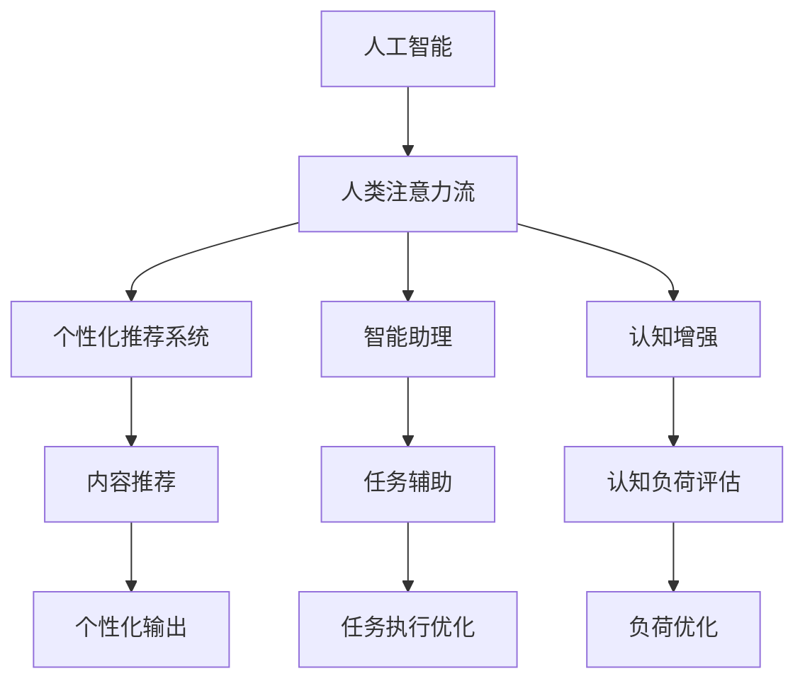

                 

# AI与人类注意力流：未来的工作和休闲

> 关键词：人工智能,人类注意力流,未来工作,休闲娱乐,人机交互,认知增强,注意力模型,智能推荐,泛在学习

## 1. 背景介绍

### 1.1 问题由来
随着人工智能技术的迅猛发展，AI已经深刻改变了人们的工作与生活方式。机器学习、深度学习、自然语言处理等技术的进步，让AI在自动化、智能化、个性化等方面展现出强大的潜力。而人机交互的焦点也从机器的自主性、智能性，转向了如何更好利用AI技术提升人类的工作效率和休闲体验。

### 1.2 问题核心关键点
人类注意力流研究聚焦于人类注意力在信息处理和认知过程中的动态变化。AI与人类注意力流的结合，旨在通过AI算法理解和预测人类的注意力机制，优化信息获取和处理过程，从而提升工作和休闲效率，减少信息过载和决策疲劳，让智能技术更为人性化。

AI与人类注意力流的结合主要体现在以下几个方面：
- **个性化推荐系统**：根据用户的注意力和偏好，智能推荐内容。
- **智能助理**：通过自然语言处理和机器学习，帮助用户进行信息整理、决策辅助等任务。
- **注意力引导**：利用注意力模型预测用户注意力，引导其注意力流向重要信息。
- **认知增强**：通过认知负荷评估和调整，优化任务执行路径，提升工作效率。

### 1.3 问题研究意义
AI与人类注意力流的结合，有助于实现以下目标：
1. **提升工作效能**：通过理解人类注意力流，优化任务执行策略，减少决策疲劳，提高工作效率。
2. **改善休闲体验**：个性化推荐和智能助理帮助用户发现和享受丰富的休闲内容。
3. **构建人机协同系统**：智能技术与人类注意力的协同，提升系统的智能化和人性化。
4. **推动人工智能普及**：让AI技术更加贴近用户需求，推动AI在更广泛领域的普及应用。

## 2. 核心概念与联系

### 2.1 核心概念概述

为了更好地理解AI与人类注意力流结合的理论基础和实际应用，本节将介绍几个关键概念：

- **人工智能（AI）**：利用计算机模拟人类智能行为的技术，包括感知、推理、学习等能力。
- **人类注意力流（Attention Flow）**：人类在处理信息时，注意力在不同任务和信息间动态转移的过程。
- **个性化推荐系统**：基于用户行为和偏好，智能推荐内容的技术。
- **智能助理**：利用自然语言处理和机器学习，帮助用户完成各种任务的技术。
- **认知增强**：通过认知负荷评估和任务优化，提升用户认知能力和工作效率的技术。

这些核心概念之间的逻辑关系可以通过以下Mermaid流程图来展示：



这个流程图展示了大语言模型的核心概念及其之间的关系：

1. 人工智能通过理解和预测人类注意力流，帮助设计个性化推荐、智能助理、认知增强等技术。
2. 个性化推荐系统根据用户注意力和偏好推荐内容，提供个性化服务。
3. 智能助理利用自然语言处理技术，帮助用户完成各种任务。
4. 认知增强技术评估用户认知负荷，优化任务执行策略，提升工作效率。

这些概念共同构成了AI与人类注意力流结合的理论框架，使其能够更好地应用于实际工作与休闲场景。

## 3. 核心算法原理 & 具体操作步骤
### 3.1 算法原理概述

AI与人类注意力流的结合，主要依赖于以下算法原理：

- **深度学习算法**：通过大规模数据训练深度神经网络，学习和预测人类注意力流的动态变化。
- **自然语言处理（NLP）**：理解和生成自然语言，实现人机自然交互。
- **推荐算法**：利用协同过滤、内容推荐等算法，根据用户历史行为和兴趣推荐内容。
- **认知负荷评估模型**：通过心理负荷模型评估用户认知负荷，优化任务执行策略。

### 3.2 算法步骤详解

AI与人类注意力流的结合通常包括以下几个关键步骤：

**Step 1: 数据收集与预处理**
- 收集用户的行为数据、认知负荷数据、注意力数据等，进行数据清洗和预处理。
- 将数据划分为训练集、验证集和测试集，准备用于后续模型训练和评估。

**Step 2: 模型设计与训练**
- 选择合适的深度学习模型和推荐算法，设计注意力预测、任务辅助、认知负荷评估等模块。
- 使用训练集数据训练模型，并通过验证集数据进行模型调优。
- 在测试集数据上评估模型的性能，确保其能够在实际应用中有效运作。

**Step 3: 模型部署与集成**
- 将训练好的模型部署到实际应用系统中。
- 集成个性化推荐系统、智能助理、认知增强等技术，形成一体化的人机交互系统。
- 不断收集用户反馈，迭代优化模型和系统。

**Step 4: 实时监控与优化**
- 实时监控系统运行状态，收集用户交互数据和系统性能指标。
- 根据用户行为和反馈，动态调整模型参数和任务执行策略。
- 定期评估系统性能，确保其持续优化和改进。

### 3.3 算法优缺点

AI与人类注意力流的结合具有以下优点：
1. **提升效率**：通过理解人类注意力流，优化任务执行策略，减少决策疲劳，提高工作效率。
2. **个性化服务**：个性化推荐和智能助理，提供定制化服务，提升用户体验。
3. **智能化决策**：利用认知增强技术，辅助用户进行决策，提升决策准确性。
4. **泛在学习**：将学习过程嵌入工作与休闲活动中，提升用户认知能力。

同时，该方法也存在一定的局限性：
1. **数据隐私**：用户行为和认知数据涉及隐私，需要严格保护。
2. **模型复杂性**：深度学习模型和推荐算法复杂，需要大量计算资源和数据。
3. **交互依赖**：依赖用户反馈和行为数据，难以应对非典型用户行为。
4. **泛化能力**：模型在特定数据集上训练，可能难以泛化到其他场景。
5. **系统集成**：需要高度集成化的人机交互设计，系统开发和维护成本较高。

尽管存在这些局限性，但就目前而言，AI与人类注意力流的结合仍是提升工作效率和休闲体验的重要手段。未来相关研究的重点在于如何进一步降低模型复杂性，提高泛化能力，同时兼顾数据隐私和系统集成。

### 3.4 算法应用领域

AI与人类注意力流的结合，已经在多个领域得到了广泛的应用，例如：

- **教育领域**：通过智能推荐系统和智能助理，提供个性化学习资源和辅导。
- **医疗领域**：利用认知增强技术，优化诊断和治疗方案。
- **商业领域**：通过个性化推荐和智能助理，提升销售和客户服务效率。
- **娱乐领域**：基于注意力预测，提供个性化的内容推荐和互动体验。
- **社交领域**：利用认知增强技术，优化社交网络和信息流。

除了上述这些经典领域外，AI与人类注意力流的结合还在更多场景中得到创新应用，如智能家居、智能交通、智慧城市等，为各行各业带来智能化和人性化体验。

## 4. 数学模型和公式 & 详细讲解 & 举例说明
### 4.1 数学模型构建

本节将使用数学语言对AI与人类注意力流结合的过程进行更加严格的刻画。

记用户行为数据为 $\mathbf{X} \in \mathbb{R}^{N \times d}$，其中 $N$ 为用户数，$d$ 为行为特征维度。注意力数据为 $\mathbf{A} \in \mathbb{R}^{N \times T}$，其中 $T$ 为时间步数。认知负荷数据为 $\mathbf{Y} \in \mathbb{R}^{N \times C}$，其中 $C$ 为认知负荷维度。

定义注意力预测模型为 $f_{\theta}(\mathbf{X}, \mathbf{A})$，认知负荷评估模型为 $g_{\theta}(\mathbf{X}, \mathbf{Y})$。模型的训练目标为最小化经验风险：

$$
\mathcal{L}(\theta) = \frac{1}{N}\sum_{i=1}^N \left[ \ell_f(\mathbf{X}_i, \mathbf{A}_i, f_{\theta}(\mathbf{X}_i, \mathbf{A}_i)) + \ell_g(\mathbf{X}_i, \mathbf{Y}_i, g_{\theta}(\mathbf{X}_i, \mathbf{Y}_i)) \right]
$$

其中 $\ell_f$ 和 $\ell_g$ 分别为注意力预测和认知负荷评估的损失函数。

### 4.2 公式推导过程

以下我们以注意力预测为例，推导深度学习模型的训练过程。

假设注意力预测模型 $f_{\theta}(\mathbf{X}, \mathbf{A}) = \mathbf{W}_h [\mathbf{X}, \mathbf{A}] + \mathbf{b}_h$，其中 $\mathbf{W}_h$ 和 $\mathbf{b}_h$ 为模型参数。

定义注意力预测任务的损失函数为均方误差：

$$
\ell_f(\mathbf{X}_i, \mathbf{A}_i, f_{\theta}(\mathbf{X}_i, \mathbf{A}_i)) = \frac{1}{T} \sum_{t=1}^T (\hat{a}_i^t - a_i^t)^2
$$

其中 $\hat{a}_i^t$ 为模型预测的注意力权重，$a_i^t$ 为真实注意力权重。

根据链式法则，注意力预测模型的梯度公式为：

$$
\frac{\partial \mathcal{L}(\theta)}{\partial \theta} = \frac{1}{N}\sum_{i=1}^N \left[ \frac{\partial \ell_f(\mathbf{X}_i, \mathbf{A}_i, f_{\theta}(\mathbf{X}_i, \mathbf{A}_i))}{\partial \theta} \right]
$$

具体计算时，需要先对注意力权重进行预测，然后计算梯度，更新模型参数。

## 5. 项目实践：代码实例和详细解释说明
### 5.1 开发环境搭建

在进行AI与人类注意力流结合的实践前，我们需要准备好开发环境。以下是使用Python进行TensorFlow开发的环境配置流程：

1. 安装Anaconda：从官网下载并安装Anaconda，用于创建独立的Python环境。

2. 创建并激活虚拟环境：
```bash
conda create -n tf-env python=3.8 
conda activate tf-env
```

3. 安装TensorFlow：根据CUDA版本，从官网获取对应的安装命令。例如：
```bash
pip install tensorflow
```

4. 安装各类工具包：
```bash
pip install numpy pandas scikit-learn matplotlib tqdm jupyter notebook ipython
```

完成上述步骤后，即可在`tf-env`环境中开始项目实践。

### 5.2 源代码详细实现

下面我们以注意力预测为例，给出使用TensorFlow和Keras实现注意力模型的PyTorch代码实现。

首先，定义注意力预测模型：

```python
import tensorflow as tf
from tensorflow.keras.layers import Dense, Input, concatenate
from tensorflow.keras.models import Model

def attention_predictor(input_shape, output_shape):
    input_tensor = Input(shape=input_shape)
    hidden_tensor = Dense(128, activation='relu')(input_tensor)
    hidden_tensor = Dense(64, activation='relu')(hidden_tensor)
    hidden_tensor = Dense(output_shape, activation='softmax')(hidden_tensor)
    model = Model(inputs=input_tensor, outputs=hidden_tensor)
    return model

input_shape = (10, 10) # 行为数据维度为10
output_shape = 5 # 注意力权重维度为5
model = attention_predictor(input_shape, output_shape)
model.summary()
```

然后，定义注意力预测任务的损失函数和优化器：

```python
from tensorflow.keras.losses import MeanSquaredError

loss = MeanSquaredError()
optimizer = tf.keras.optimizers.Adam(learning_rate=0.001)
```

接着，定义训练和评估函数：

```python
from tensorflow.keras.metrics import Mean, RootMeanSquaredError

def train_epoch(model, dataset, batch_size, optimizer):
    dataloader = tf.data.Dataset.from_tensor_slices(dataset).batch(batch_size)
    model.compile(optimizer=optimizer, loss=loss)
    model.fit(dataloader, epochs=10, verbose=1)

def evaluate(model, dataset, batch_size):
    dataloader = tf.data.Dataset.from_tensor_slices(dataset).batch(batch_size)
    model.evaluate(dataloader, verbose=0)
    metrics = model.metrics_names
    for metric in metrics:
        print(f"{metric}: {model.metrics()[metric][-1].numpy()}")
```

最后，启动训练流程并在测试集上评估：

```python
dataset = ... # 填充数据
train_epoch(model, dataset, batch_size=32, optimizer=optimizer)
evaluate(model, dataset, batch_size=32)
```

以上就是使用TensorFlow实现注意力预测模型的完整代码实现。可以看到，通过TensorFlow和Keras的封装，注意力模型的构建和训练过程变得简洁高效。

### 5.3 代码解读与分析

让我们再详细解读一下关键代码的实现细节：

**attention_predictor函数**：
- 定义输入层和多个隐藏层，最终输出预测的注意力权重。
- 使用Keras的Model类将输入和输出组合成完整的模型。
- 调用`summary`方法打印模型结构。

**train_epoch函数**：
- 将数据集转换为TensorFlow的Dataset对象，并设置批次大小。
- 使用`compile`方法指定优化器和损失函数。
- 调用`fit`方法进行模型训练，设置训练轮数和输出细节。

**evaluate函数**：
- 将数据集转换为TensorFlow的Dataset对象，并设置批次大小。
- 使用`evaluate`方法进行模型评估，打印各个评估指标。

**训练流程**：
- 定义模型、损失函数和优化器。
- 加载数据集，并调用`train_epoch`函数进行训练。
- 调用`evaluate`函数在测试集上评估模型性能。

可以看到，TensorFlow和Keras使得模型构建和训练过程变得更加简单和直观，开发者可以更专注于模型的设计和优化。

当然，工业级的系统实现还需考虑更多因素，如模型的保存和部署、超参数的自动搜索、更灵活的输入输出设计等。但核心的注意力预测模型基本与此类似。

## 6. 实际应用场景
### 6.1 教育领域

在教育领域，AI与人类注意力流的结合可以显著提升个性化学习体验和教学效果。智能推荐系统和智能助理可以动态推荐个性化学习资源和辅导，帮助学生高效学习。同时，认知增强技术可以评估学生的认知负荷，优化学习路径，提升学习效果。

### 6.2 医疗领域

在医疗领域，AI与人类注意力流的结合可以提升诊断和治疗的精准度。智能助理和推荐系统可以根据患者的历史记录和偏好，推荐最适合的诊疗方案。认知增强技术可以辅助医生进行复杂诊断，减少误诊风险。

### 6.3 商业领域

在商业领域，AI与人类注意力流的结合可以提升客户体验和服务效率。智能推荐系统可以根据用户的浏览和购买历史，推荐最适合的商品。智能助理可以解答客户咨询，提高服务满意度。

### 6.4 娱乐领域

在娱乐领域，AI与人类注意力流的结合可以提供个性化的内容推荐和互动体验。智能推荐系统可以根据用户的兴趣和行为，推荐最适合的内容。智能助理可以与用户进行互动，提供丰富的娱乐体验。

### 6.5 未来应用展望

随着AI与人类注意力流的结合不断深入，未来将会有更多创新应用场景：

- **智能家居**：AI可以根据用户的行为和注意力，智能调节家居环境，提升生活体验。
- **智能交通**：AI可以预测用户注意力和出行需求，优化交通管理，提升出行效率。
- **智慧城市**：AI可以理解城市运行中的注意力热点，优化资源分配和管理。

AI与人类注意力流的结合，将为各行各业带来更智能、更人性化的体验，推动智能化社会的建设。

## 7. 工具和资源推荐
### 7.1 学习资源推荐

为了帮助开发者系统掌握AI与人类注意力流结合的理论基础和实践技巧，这里推荐一些优质的学习资源：

1. **《深度学习基础》系列课程**：由深度学习领域的知名教授讲授，从理论到实践全面讲解深度学习的基本概念和技术。
2. **TensorFlow官方文档**：提供了丰富的API和教程，是TensorFlow应用的必备资源。
3. **《Python深度学习》书籍**：涵盖深度学习和TensorFlow的基础和进阶内容，适合各个层次的开发者。
4. **Kaggle平台**：提供了大量深度学习竞赛和实战案例，帮助开发者在实践中学习和提升。
5. **OpenAI的GitHub库**：包含多种深度学习框架的代码示例，适合学习和参考。

通过对这些资源的学习实践，相信你一定能够快速掌握AI与人类注意力流结合的精髓，并用于解决实际的AI问题。

### 7.2 开发工具推荐

高效的开发离不开优秀的工具支持。以下是几款用于AI与人类注意力流结合开发的常用工具：

1. **TensorFlow**：由Google主导开发的开源深度学习框架，生产部署方便，适合大规模工程应用。
2. **Keras**：基于TensorFlow的高级API，简单易用，适合快速迭代研究。
3. **PyTorch**：基于Python的开源深度学习框架，灵活动态的计算图，适合快速迭代研究。
4. **Scikit-learn**：Python的机器学习库，提供了多种经典算法的封装和应用示例。
5. **Jupyter Notebook**：开源的交互式编程环境，支持Python、R等多种语言，适合研究和开发。

合理利用这些工具，可以显著提升AI与人类注意力流结合的开发效率，加快创新迭代的步伐。

### 7.3 相关论文推荐

AI与人类注意力流的结合源于学界的持续研究。以下是几篇奠基性的相关论文，推荐阅读：

1. **《Deep Attention Model》**：提出注意力模型，用于解决机器翻译、语音识别等任务。
2. **《Attention is All You Need》**：提出Transformer模型，展示了注意力机制在处理序列数据中的强大能力。
3. **《Cognitive Load and Attention in Learning》**：研究认知负荷对注意力流的影响，提出认知增强技术。
4. **《Personalized Recommendation System》**：介绍推荐算法的基本原理和应用场景，包括协同过滤、基于内容的推荐等。
5. **《Interactive AI Systems》**：研究人机交互中的注意力机制，提出智能助理和推荐系统的设计思路。

这些论文代表了大语言模型微调技术的发展脉络。通过学习这些前沿成果，可以帮助研究者把握学科前进方向，激发更多的创新灵感。

## 8. 总结：未来发展趋势与挑战
### 8.1 总结

本文对AI与人类注意力流结合的方法进行了全面系统的介绍。首先阐述了AI与人类注意力流结合的研究背景和意义，明确了其对提升工作效率和休闲体验的独特价值。其次，从原理到实践，详细讲解了注意力预测、认知增强、个性化推荐等核心技术，给出了注意力模型的完整代码实现。同时，本文还广泛探讨了AI与人类注意力流结合在教育、医疗、商业、娱乐等多个领域的应用前景，展示了其广阔的应用潜力。此外，本文精选了AI与人类注意力流结合的各类学习资源，力求为读者提供全方位的技术指引。

通过本文的系统梳理，可以看到，AI与人类注意力流的结合正在成为提升工作效率和休闲体验的重要手段。AI技术在理解和预测人类注意力流方面的进展，使得个性化推荐、智能助理、认知增强等技术得以在实际应用中发挥作用。未来，伴随AI技术的不断进步和应用场景的拓展，AI与人类注意力流的结合将进一步提升人们的生产力和生活质量，推动人工智能技术的普及应用。

### 8.2 未来发展趋势

展望未来，AI与人类注意力流的结合将呈现以下几个发展趋势：

1. **技术成熟度提升**：随着深度学习模型的不断优化和创新，AI与人类注意力流的结合将更加精准和高效。
2. **应用场景多样化**：AI与人类注意力流的结合将扩展到更多行业和领域，提升各个场景的用户体验。
3. **多模态融合**：结合视觉、语音、触觉等多模态数据，提升AI对复杂环境的理解能力。
4. **交互方式自然化**：通过语音、手势等自然交互方式，提升人机协同的智能化水平。
5. **个性化和定制化**：利用AI对个体注意力的理解，提供更加个性化和定制化的服务。
6. **伦理和社会责任**：关注AI技术的伦理和社会影响，确保其对社会正面贡献。

这些趋势凸显了AI与人类注意力流结合的广阔前景。这些方向的探索发展，必将进一步提升AI与人类注意力流的结合水平，为构建智能、人性化的人工智能系统铺平道路。

### 8.3 面临的挑战

尽管AI与人类注意力流的结合已经取得了瞩目成就，但在迈向更加智能化、普适化应用的过程中，它仍面临着诸多挑战：

1. **数据隐私和安全**：用户行为和认知数据涉及隐私，需要严格保护。
2. **模型复杂性**：深度学习模型复杂，需要大量计算资源和数据。
3. **交互依赖**：依赖用户反馈和行为数据，难以应对非典型用户行为。
4. **泛化能力**：模型在特定数据集上训练，可能难以泛化到其他场景。
5. **系统集成**：需要高度集成化的人机交互设计，系统开发和维护成本较高。

尽管存在这些挑战，但AI与人类注意力流的结合已经展现出强大的应用潜力和市场前景。未来相关研究需要在以下几个方面寻求新的突破：

- **数据隐私保护**：开发更加高效和安全的隐私保护算法，保护用户数据隐私。
- **模型优化**：探索更轻量级的模型结构和算法，降低计算资源需求。
- **多模态融合**：结合视觉、语音、触觉等多模态数据，提升AI对复杂环境的理解能力。
- **交互方式自然化**：通过语音、手势等自然交互方式，提升人机协同的智能化水平。
- **个性化和定制化**：利用AI对个体注意力的理解，提供更加个性化和定制化的服务。
- **伦理和社会责任**：关注AI技术的伦理和社会影响，确保其对社会正面贡献。

这些研究方向和突破将进一步推动AI与人类注意力流的结合，实现更加智能、普适、人性化的AI应用。

### 8.4 研究展望

面对AI与人类注意力流结合所面临的种种挑战，未来的研究需要在以下几个方面寻求新的突破：

1. **数据隐私保护**：开发更加高效和安全的隐私保护算法，保护用户数据隐私。
2. **模型优化**：探索更轻量级的模型结构和算法，降低计算资源需求。
3. **多模态融合**：结合视觉、语音、触觉等多模态数据，提升AI对复杂环境的理解能力。
4. **交互方式自然化**：通过语音、手势等自然交互方式，提升人机协同的智能化水平。
5. **个性化和定制化**：利用AI对个体注意力的理解，提供更加个性化和定制化的服务。
6. **伦理和社会责任**：关注AI技术的伦理和社会影响，确保其对社会正面贡献。

这些研究方向和突破将进一步推动AI与人类注意力流的结合，实现更加智能、普适、人性化的AI应用。

## 9. 附录：常见问题与解答
### 9.1 Q1: AI与人类注意力流结合的原理是什么？
A: AI与人类注意力流的结合基于深度学习模型，通过理解人类注意力流动态变化，优化信息获取和处理过程。模型训练依赖于用户行为、认知负荷和注意力数据，通过最小化经验风险，学习预测注意力权重的最优参数。

### 9.2 Q2: AI与人类注意力流结合的实际应用场景有哪些？
A: AI与人类注意力流的结合已经应用于教育、医疗、商业、娱乐等多个领域。在教育领域，智能推荐系统和智能助理可以提升个性化学习体验和教学效果；在医疗领域，智能助理和推荐系统可以提升诊断和治疗的精准度；在商业领域，智能推荐系统可以提高客户体验和服务效率；在娱乐领域，智能推荐系统可以提供个性化的内容推荐和互动体验。

### 9.3 Q3: 如何优化AI与人类注意力流结合的模型性能？
A: 优化AI与人类注意力流结合的模型性能可以从以下几个方面入手：
1. 选择合适的深度学习模型和推荐算法，设计注意力预测、认知负荷评估等模块。
2. 使用大规模标注数据进行模型训练，提高模型的泛化能力。
3. 引入正则化技术和早停技术，避免过拟合。
4. 采用数据增强和对抗训练等技术，提高模型的鲁棒性。
5. 定期更新模型，适应数据分布的变化。

### 9.4 Q4: AI与人类注意力流结合对数据隐私和安全有哪些影响？
A: AI与人类注意力流结合对数据隐私和安全的影响主要体现在以下几个方面：
1. 用户行为和认知数据涉及隐私，需要严格保护。
2. 模型训练依赖大量数据，可能存在数据泄露风险。
3. 攻击者可能通过模型训练数据反向推断用户隐私信息。
4. 需要开发高效的数据保护算法和隐私保护技术，确保数据安全和隐私保护。

### 9.5 Q5: AI与人类注意力流结合的挑战和未来突破有哪些？
A: AI与人类注意力流结合的挑战主要包括数据隐私、模型复杂性、交互依赖、泛化能力不足、系统集成难度大等。未来突破可以从以下几个方面入手：
1. 开发更加高效和安全的隐私保护算法，保护用户数据隐私。
2. 探索更轻量级的模型结构和算法，降低计算资源需求。
3. 结合视觉、语音、触觉等多模态数据，提升AI对复杂环境的理解能力。
4. 通过语音、手势等自然交互方式，提升人机协同的智能化水平。
5. 利用AI对个体注意力的理解，提供更加个性化和定制化的服务。
6. 关注AI技术的伦理和社会影响，确保其对社会正面贡献。

---

作者：禅与计算机程序设计艺术 / Zen and the Art of Computer Programming

