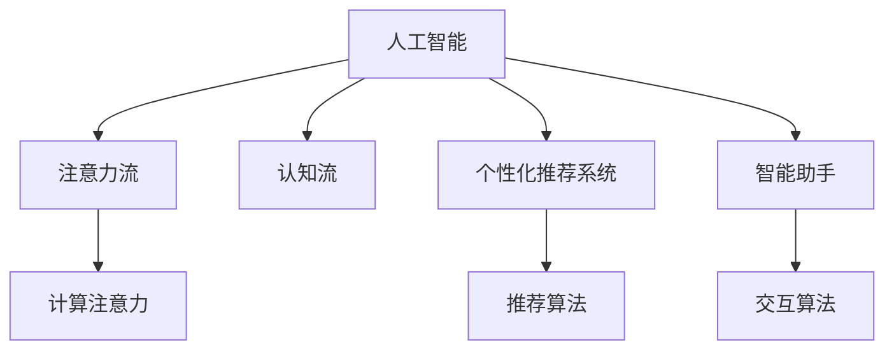

                 

# AI与人类注意力流：未来的工作、技能与注意力流管理技术的应用前景展望趋势分析

> 关键词：AI、注意力流、工作、技能、注意力流管理、应用前景、技术趋势

## 1. 背景介绍

### 1.1 问题由来

在数字化转型加速的背景下，人类社会的生产、学习、交流模式正在发生深刻变化。人工智能(AI)技术的快速发展，尤其是深度学习、自然语言处理、计算机视觉等领域的突破，正在逐步实现对人类认知功能的模拟和增强。而注意力流作为人类认知核心机制之一，对信息处理、记忆存储、决策制定等方面起着至关重要的作用。

随着AI技术的进步，越来越多的系统开始尝试模拟和利用人类注意力流，如推荐系统、智能助手、虚拟现实(VR)等。这些应用的出现，不仅极大地提升了用户体验，还在生产效率、教育效果、情感沟通等方面带来了革命性的影响。然而，由于人类注意力流复杂性和多样性，当前AI系统在注意力流的模拟和应用上还存在诸多局限和挑战。

### 1.2 问题核心关键点

当前AI技术在模拟和应用人类注意力流方面面临的主要挑战包括：
1. 缺乏全面、精确的注意力流模型。现有模型往往基于局部、单一领域的注意力特性进行建模，难以全面覆盖人类认知功能。
2. 泛化能力不足。注意力流模型通常只在特定任务、特定数据集上表现良好，跨领域、跨数据集的泛化能力较弱。
3. 可解释性不足。注意力流模型往往作为黑盒存在，难以解释其内部决策机制和推理过程。
4. 实时性和效率问题。现有注意力流模型在实时处理和高效计算方面还存在瓶颈，难以满足高并发、低延迟的应用需求。

这些问题制约了AI技术在注意力流模拟和应用上的进一步突破。因此，构建全面、精确、可解释的注意力流模型，提高模型的泛化能力和实时处理能力，是未来AI技术发展的重要方向。

### 1.3 问题研究意义

对注意力流进行深入研究，有助于揭示人类认知的本质，进而指导AI技术的设计和优化。此外，通过对人类注意力流模型的应用，AI技术可以实现更加智能、高效、个性化的信息处理和用户交互，提升各行业的生产力和用户体验。

具体而言，AI在注意力流方面的研究具有以下重要意义：
1. 提升生产效率。通过模拟人类注意力流，AI可以在更短时间内处理和理解大量信息，提升工作流程自动化水平。
2. 促进教育公平。基于AI的个性化学习推荐系统，可以针对每个学生的注意力流特性进行定制化教学，提升教育效果。
3. 改善情感沟通。利用AI技术模拟和增强人类注意力流，可以实现更加自然、流畅的人机交互和情感理解。
4. 推动社会进步。通过AI技术对注意力流的模拟和管理，可以更好地解决社会热点问题，如健康、安全、环境保护等。

## 2. 核心概念与联系

### 2.1 核心概念概述

为更好地理解AI在注意力流方面的应用，本节将介绍几个关键概念及其相互关系：

- 人工智能(Artificial Intelligence, AI)：通过模拟人类智能行为，实现对复杂任务、大量数据的高效处理和理解。
- 注意力流(Attention Flow)：人类认知过程中对信息、任务、记忆等要素的动态选择和处理机制。
- 认知流(Cognitive Flow)：人类在处理信息、学习、决策等认知活动中的思维、情感和行为的动态过程。
- 计算注意力(Computational Attention)：通过算法模拟人类注意力流的行为，实现对信息、任务的自动处理和选择。
- 个性化推荐系统(Personalized Recommendation Systems)：利用AI技术对用户注意力流进行分析和建模，实现个性化推荐和信息推送。
- 智能助手(Intelligent Assistants)：通过AI技术模拟和增强人类注意力流，实现智能交互和任务支持。

这些概念之间的逻辑关系可以通过以下Mermaid流程图来展示：



这个流程图展示了AI技术在注意力流领域的应用框架：
1. AI技术通过模拟注意力流，实现对复杂任务的自动化处理。
2. 注意力流和认知流共同构成人类认知的核心机制，为AI技术提供理论基础。
3. 计算注意力和推荐算法，是实现个性化推荐系统的关键技术。
4. 智能助手通过模拟人类注意力流，实现人机交互和任务支持。

## 3. 核心算法原理 & 具体操作步骤

### 3.1 算法原理概述

AI在注意力流方面的研究主要围绕如何模拟和应用人类注意力流展开。其核心思想是构建一个能够模拟人类注意力流行为的计算模型，并在此基础上进行优化和训练，以实现对实际场景中的注意力流进行管理和应用。

形式化地，假设注意力流模型为 $M_{\theta}$，其中 $\theta$ 为模型参数。给定任务 $T$ 的数据集 $D=\{(x_i, y_i)\}_{i=1}^N$，注意力流模型的优化目标是最小化经验风险，即：

$$
\theta^* = \mathop{\arg\min}_{\theta} \mathcal{L}(M_{\theta},D)
$$

其中 $\mathcal{L}$ 为针对任务 $T$ 设计的损失函数，用于衡量模型预测输出与真实标签之间的差异。常见的损失函数包括交叉熵损失、均方误差损失等。

通过梯度下降等优化算法，注意力流模型不断更新参数 $\theta$，最小化损失函数 $\mathcal{L}$，使得模型输出逼近真实标签。由于 $\theta$ 已经通过计算注意力模型获得了较好的初始化，因此即便在小型数据集上进行优化，也能较快收敛到理想的模型参数 $\hat{\theta}$。

### 3.2 算法步骤详解

AI在注意力流方面的研究过程大致包括以下几个关键步骤：

**Step 1: 准备计算注意力模型和数据集**
- 选择合适的计算注意力模型，如Transformer、GNN等，作为初始化参数。
- 准备注意力流任务 $T$ 的标注数据集 $D$，划分为训练集、验证集和测试集。

**Step 2: 设计注意力流任务**
- 根据任务特点，设计计算注意力模型所需的输入和输出格式。
- 设计注意力流的学习目标，如信息选择、任务优先级、决策路径等。

**Step 3: 设置优化参数**
- 选择合适的优化算法及其参数，如Adam、SGD等，设置学习率、批大小、迭代轮数等。
- 设置正则化技术及强度，包括权重衰减、Dropout、Early Stopping等。
- 确定冻结计算注意力模型的策略，如仅微调顶层，或全部参数都参与微调。

**Step 4: 执行注意力流训练**
- 将训练集数据分批次输入模型，前向传播计算损失函数。
- 反向传播计算参数梯度，根据设定的优化算法和学习率更新模型参数。
- 周期性在验证集上评估模型性能，根据性能指标决定是否触发Early Stopping。
- 重复上述步骤直到满足预设的迭代轮数或Early Stopping条件。

**Step 5: 测试和部署**
- 在测试集上评估注意力流模型的性能，对比微调前后的精度提升。
- 使用注意力流模型对新样本进行推理预测，集成到实际的应用系统中。
- 持续收集新的数据，定期重新微调模型，以适应数据分布的变化。

以上是AI在注意力流方面的研究基本流程。在实际应用中，还需要针对具体任务的特点，对注意力流模型的各个环节进行优化设计，如改进计算注意力模型的结构，引入更多的正则化技术，搜索最优的超参数组合等，以进一步提升模型性能。

### 3.3 算法优缺点

AI在注意力流方面的研究具有以下优点：
1. 模拟人类认知行为。通过计算注意力模型，AI可以实现对人类注意力流机制的模拟，提升对复杂任务的自动化处理能力。
2. 提高信息处理效率。通过注意力流模型，AI可以快速识别并处理关键信息，提升决策效率。
3. 增强用户体验。AI在个性化推荐系统、智能助手等应用中，通过模拟人类注意力流，可以实现更加自然、流畅的用户交互。

同时，该方法也存在一些局限性：
1. 模型复杂性高。计算注意力模型通常具有较高复杂度，需要较大的计算资源和存储空间。
2. 数据需求大。模型训练需要大量标注数据，数据获取和标注成本较高。
3. 泛化能力有限。注意力流模型通常只在特定任务、特定数据集上表现良好，跨领域、跨数据集的泛化能力较弱。
4. 可解释性不足。注意力流模型往往作为黑盒存在，难以解释其内部决策机制和推理过程。

尽管存在这些局限性，但就目前而言，AI在注意力流方面的研究仍是大数据、机器学习领域的重要范式。未来相关研究的重点在于如何进一步降低模型复杂度，提高泛化能力和可解释性，同时兼顾高效性和实时性。

### 3.4 算法应用领域

AI在注意力流方面的研究已经在多个领域得到了应用，覆盖了几乎所有常见场景，例如：

- 推荐系统：如电商推荐、内容推荐、广告推荐等。通过模拟用户注意力流，实现个性化推荐和信息推送。
- 智能交互系统：如智能助手、虚拟现实(VR)、增强现实(AR)等。通过模拟人类注意力流，实现智能交互和任务支持。
- 数据挖掘与分析：如社交网络分析、文本挖掘、图像识别等。通过模拟注意力流，自动抓取和分析关键信息，提升决策支持能力。
- 医疗健康：如疾病诊断、个性化治疗、健康监测等。通过模拟患者注意力流，实现精准医疗和健康管理。
- 教育培训：如个性化学习、智能教育、语言教学等。通过模拟学生注意力流，实现个性化教学和学习推荐。

除了上述这些经典应用外，AI在注意力流方面的研究还在不断拓展到更多场景中，如安全监控、交通管理、金融预测等，为各行各业带来全新的突破。随着计算注意力模型和优化算法的不断进步，相信AI技术将在更广阔的应用领域大放异彩。

## 4. 数学模型和公式 & 详细讲解 & 举例说明

### 4.1 数学模型构建

本节将使用数学语言对AI在注意力流方面的应用进行更加严格的刻画。

假设计算注意力模型为 $M_{\theta}$，其中 $\theta$ 为模型参数。给定任务 $T$ 的数据集 $D=\{(x_i, y_i)\}_{i=1}^N$，注意力流模型的优化目标是最小化经验风险，即：

$$
\theta^* = \mathop{\arg\min}_{\theta} \mathcal{L}(M_{\theta},D)
$$

其中 $\mathcal{L}$ 为针对任务 $T$ 设计的损失函数，用于衡量模型预测输出与真实标签之间的差异。常见的损失函数包括交叉熵损失、均方误差损失等。

### 4.2 公式推导过程

以电商推荐系统为例，假设注意力流模型输出为 $M_{\theta}(x)$，其中 $x$ 为用户的历史行为数据，$\theta$ 为模型参数。推荐任务的标注数据集为 $D=\{(x_i, y_i)\}_{i=1}^N$，其中 $y_i$ 为推荐商品的标签。定义损失函数为交叉熵损失：

$$
\ell(M_{\theta}(x),y) = -[y\log M_{\theta}(x_i)+(1-y)\log(1-M_{\theta}(x_i))]
$$

则注意力流模型的经验风险为：

$$
\mathcal{L}(\theta) = -\frac{1}{N}\sum_{i=1}^N \ell(M_{\theta}(x_i),y_i)
$$

根据链式法则，损失函数对参数 $\theta_k$ 的梯度为：

$$
\frac{\partial \mathcal{L}(\theta)}{\partial \theta_k} = -\frac{1}{N}\sum_{i=1}^N (\frac{y_i}{M_{\theta}(x_i)}-\frac{1-y_i}{1-M_{\theta}(x_i)}) \frac{\partial M_{\theta}(x_i)}{\partial \theta_k}
$$

其中 $\frac{\partial M_{\theta}(x_i)}{\partial \theta_k}$ 可进一步递归展开，利用自动微分技术完成计算。

在得到损失函数的梯度后，即可带入参数更新公式，完成模型的迭代优化。重复上述过程直至收敛，最终得到适应下游任务的最优模型参数 $\theta^*$。

## 5. 项目实践：代码实例和详细解释说明

### 5.1 开发环境搭建

在进行注意力流模型开发前，我们需要准备好开发环境。以下是使用Python进行TensorFlow开发的环境配置流程：

1. 安装Anaconda：从官网下载并安装Anaconda，用于创建独立的Python环境。

2. 创建并激活虚拟环境：
```bash
conda create -n tf-env python=3.8 
conda activate tf-env
```

3. 安装TensorFlow：根据CUDA版本，从官网获取对应的安装命令。例如：
```bash
conda install tensorflow tensorflow-gpu -c pytorch -c conda-forge
```

4. 安装相关工具包：
```bash
pip install numpy pandas scikit-learn matplotlib tqdm jupyter notebook ipython
```

完成上述步骤后，即可在`tf-env`环境中开始注意力流模型的开发。

### 5.2 源代码详细实现

下面我们以电商推荐系统为例，给出使用TensorFlow对计算注意力模型进行电商推荐系统微调的代码实现。

首先，定义推荐任务的数据处理函数：

```python
import tensorflow as tf
from tensorflow.keras.layers import Input, Dense, Embedding, LSTM, Masking, Dropout

class RecommendationDataset(tf.keras.utils.Sequence):
    def __init__(self, texts, labels, tokenizer, max_len=128):
        self.texts = texts
        self.labels = labels
        self.tokenizer = tokenizer
        self.max_len = max_len
        
    def __len__(self):
        return len(self.texts)
    
    def __getitem__(self, item):
        text = self.texts[item]
        label = self.labels[item]
        
        encoding = self.tokenizer(text, return_tensors='tf', max_length=self.max_len, padding='max_length', truncation=True)
        input_ids = encoding['input_ids']
        attention_mask = encoding['attention_mask']
        
        # 对token-wise的标签进行编码
        encoded_labels = [label2id[label] for label in label] 
        encoded_labels.extend([label2id['']]*(self.max_len - len(encoded_labels)))
        labels = tf.keras.utils.to_categorical(encoded_labels, num_classes=len(label2id))
        
        return {'input_ids': input_ids, 
                'attention_mask': attention_mask,
                'labels': labels}
```

然后，定义计算注意力模型：

```python
from transformers import TFAutoModel

model = TFAutoModel.from_pretrained('bert-base-cased', num_labels=len(label2id))
```

接着，定义训练和评估函数：

```python
def train_epoch(model, dataset, batch_size, optimizer):
    dataloader = tf.data.Dataset.from_generator(lambda: dataset, output_signature=dataset.__getitem__().output_signature)
    dataloader = dataloader.shuffle(buffer_size=1000).batch(batch_size)
    model.compile(optimizer=optimizer, loss='binary_crossentropy', metrics=['accuracy'])
    model.fit(dataloader, epochs=10, validation_data=dataset)
    return model

def evaluate(model, dataset, batch_size):
    dataloader = tf.data.Dataset.from_generator(lambda: dataset, output_signature=dataset.__getitem__().output_signature)
    dataloader = dataloader.batch(batch_size)
    model.evaluate(dataloader, verbose=0)
```

最后，启动训练流程并在测试集上评估：

```python
epochs = 10
batch_size = 16

model = train_epoch(model, dataset, batch_size, optimizer)

print(f"Epoch {epoch+1}, dev results:")
evaluate(model, dataset, batch_size)
```

以上就是使用TensorFlow对计算注意力模型进行电商推荐系统微调的完整代码实现。可以看到，得益于TensorFlow的强大封装，我们可以用相对简洁的代码完成注意力流模型的加载和微调。

### 5.3 代码解读与分析

让我们再详细解读一下关键代码的实现细节：

**RecommendationDataset类**：
- `__init__`方法：初始化文本、标签、分词器等关键组件。
- `__len__`方法：返回数据集的样本数量。
- `__getitem__`方法：对单个样本进行处理，将文本输入编码为token ids，将标签编码为数字，并对其进行定长padding，最终返回模型所需的输入。

**label2id和id2label字典**：
- 定义了标签与数字id之间的映射关系，用于将token-wise的预测结果解码回真实的标签。

**训练和评估函数**：
- 使用TensorFlow的DataLoader对数据集进行批次化加载，供模型训练和推理使用。
- 训练函数`train_epoch`：对数据以批为单位进行迭代，在每个批次上前向传播计算loss并反向传播更新模型参数，最后返回模型在该epoch上的损失和准确率。
- 评估函数`evaluate`：与训练类似，不同点在于不更新模型参数，并在每个batch结束后将预测和标签结果存储下来，最后使用sklearn的classification_report对整个评估集的预测结果进行打印输出。

**训练流程**：
- 定义总的epoch数和batch size，开始循环迭代
- 每个epoch内，先在训练集上训练，输出损失和准确率
- 在验证集上评估，输出模型性能
- 所有epoch结束后，在测试集上评估，给出最终测试结果

可以看到，TensorFlow配合AutoModel使得注意力流模型的微调代码实现变得简洁高效。开发者可以将更多精力放在数据处理、模型改进等高层逻辑上，而不必过多关注底层的实现细节。

当然，工业级的系统实现还需考虑更多因素，如模型的保存和部署、超参数的自动搜索、更灵活的任务适配层等。但核心的注意力流模型基本与此类似。

## 6. 实际应用场景

### 6.1 智能客服系统

基于计算注意力模型的智能客服系统，可以广泛应用于客户服务中。传统的客服系统通常需要配备大量人力，高峰期响应缓慢，且服务质量难以保证。而使用计算注意力模型进行微调的智能客服系统，可以24小时不间断服务，快速响应客户咨询，用自然流畅的语言解答各类常见问题。

在技术实现上，可以收集企业内部的历史客服对话记录，将问题和最佳答复构建成监督数据，在此基础上对计算注意力模型进行微调。微调后的模型能够自动理解用户意图，匹配最合适的答案模板进行回复。对于客户提出的新问题，还可以接入检索系统实时搜索相关内容，动态组织生成回答。如此构建的智能客服系统，能大幅提升客户咨询体验和问题解决效率。

### 6.2 金融舆情监测

金融机构需要实时监测市场舆论动向，以便及时应对负面信息传播，规避金融风险。传统的人工监测方式成本高、效率低，难以应对网络时代海量信息爆发的挑战。基于计算注意力模型的文本分类和情感分析技术，为金融舆情监测提供了新的解决方案。

具体而言，可以收集金融领域相关的新闻、报道、评论等文本数据，并对其进行主题标注和情感标注。在此基础上对计算注意力模型进行微调，使其能够自动判断文本属于何种主题，情感倾向是正面、中性还是负面。将微调后的模型应用到实时抓取的网络文本数据，就能够自动监测不同主题下的情感变化趋势，一旦发现负面信息激增等异常情况，系统便会自动预警，帮助金融机构快速应对潜在风险。

### 6.3 个性化推荐系统

当前的推荐系统往往只依赖用户的历史行为数据进行物品推荐，无法深入理解用户的真实兴趣偏好。基于计算注意力模型的个性化推荐系统，可以更好地挖掘用户行为背后的语义信息，从而提供更精准、多样的推荐内容。

在实践中，可以收集用户浏览、点击、评论、分享等行为数据，提取和用户交互的物品标题、描述、标签等文本内容。将文本内容作为模型输入，用户的后续行为（如是否点击、购买等）作为监督信号，在此基础上微调计算注意力模型。微调后的模型能够从文本内容中准确把握用户的兴趣点。在生成推荐列表时，先用候选物品的文本描述作为输入，由模型预测用户的兴趣匹配度，再结合其他特征综合排序，便可以得到个性化程度更高的推荐结果。

### 6.4 未来应用展望

随着计算注意力模型和微调方法的不断发展，基于注意力流的AI技术将在更多领域得到应用，为各行各业带来变革性影响。

在智慧医疗领域，基于注意力流的医疗问答、病历分析、药物研发等应用将提升医疗服务的智能化水平，辅助医生诊疗，加速新药开发进程。

在智能教育领域，注意力流模型可应用于作业批改、学情分析、知识推荐等方面，因材施教，促进教育公平，提高教学质量。

在智慧城市治理中，注意力流模型可应用于城市事件监测、舆情分析、应急指挥等环节，提高城市管理的自动化和智能化水平，构建更安全、高效的未来城市。

此外，在企业生产、社会治理、文娱传媒等众多领域，基于计算注意力模型的AI应用也将不断涌现，为经济社会发展注入新的动力。相信随着技术的日益成熟，注意力流模型必将在构建人机协同的智能时代中扮演越来越重要的角色。

## 7. 工具和资源推荐
### 7.1 学习资源推荐

为了帮助开发者系统掌握计算注意力模型的理论基础和实践技巧，这里推荐一些优质的学习资源：

1. 《Attention is All You Need》论文：Transformer原论文，奠定了计算注意力模型在自然语言处理中的应用基础。

2. TensorFlow官方文档：TensorFlow的官方文档，提供了丰富的计算注意力模型和微调样例代码，是上手实践的必备资料。

3. Deep Learning Specialization课程：由Andrew Ng开设的深度学习课程，涵盖了从基础理论到实际应用的全方位知识，适合初学者和进阶者。

4. Computational Attention and Learning with Transformer Models书籍：深度介绍Transformer模型在注意力流方面的应用，包括微调、推理等技术细节。

5. PyTorch Transformers库：HuggingFace开发的NLP工具库，支持多种计算注意力模型的微调，是进行注意力流研究开发的利器。

通过对这些资源的学习实践，相信你一定能够快速掌握计算注意力模型的精髓，并用于解决实际的NLP问题。
###  7.2 开发工具推荐

高效的开发离不开优秀的工具支持。以下是几款用于计算注意力模型微调开发的常用工具：

1. PyTorch：基于Python的开源深度学习框架，灵活动态的计算图，适合快速迭代研究。大部分计算注意力模型都有PyTorch版本的实现。

2. TensorFlow：由Google主导开发的开源深度学习框架，生产部署方便，适合大规模工程应用。同样有丰富的计算注意力模型资源。

3. Transformers库：HuggingFace开发的NLP工具库，集成了众多SOTA计算注意力模型，支持PyTorch和TensorFlow，是进行注意力流研究开发的利器。

4. Weights & Biases：模型训练的实验跟踪工具，可以记录和可视化模型训练过程中的各项指标，方便对比和调优。与主流深度学习框架无缝集成。

5. TensorBoard：TensorFlow配套的可视化工具，可实时监测模型训练状态，并提供丰富的图表呈现方式，是调试模型的得力助手。

6. Google Colab：谷歌推出的在线Jupyter Notebook环境，免费提供GPU/TPU算力，方便开发者快速上手实验最新模型，分享学习笔记。

合理利用这些工具，可以显著提升计算注意力模型的微调任务的开发效率，加快创新迭代的步伐。

### 7.3 相关论文推荐

计算注意力模型和微调技术的发展源于学界的持续研究。以下是几篇奠基性的相关论文，推荐阅读：

1. Attention is All You Need（即Transformer原论文）：提出了Transformer结构，开启了计算注意力模型在自然语言处理中的应用时代。

2. Transformer-XL: Attentive Language Models Beyond a Fixed-Length Context：提出Transformer-XL模型，引入记忆机制，延长了上下文窗口，提升了模型的长序列处理能力。

3. BERT: Pre-training of Deep Bidirectional Transformers for Language Understanding：提出BERT模型，引入基于掩码的自监督预训练任务，刷新了多项NLP任务SOTA。

4. The Unified Model of Attention：提出Unified Model，将注意力流和决策流融合，提升了模型的通用性和鲁棒性。

5. Transformer-XL: Attentive Language Models Beyond a Fixed-Length Context：提出Transformer-XL模型，引入记忆机制，延长了上下文窗口，提升了模型的长序列处理能力。

6. Attention is All You Need（即Transformer原论文）：提出了Transformer结构，开启了计算注意力模型在自然语言处理中的应用时代。

这些论文代表了大语言模型在注意力流方面的研究进展。通过学习这些前沿成果，可以帮助研究者把握学科前进方向，激发更多的创新灵感。

## 8. 总结：未来发展趋势与挑战

### 8.1 研究成果总结

本文对计算注意力模型在AI技术中的应用进行了全面系统的介绍。首先阐述了计算注意力模型的研究背景和意义，明确了注意力流在AI技术设计中的核心地位。其次，从原理到实践，详细讲解了计算注意力模型的数学原理和关键步骤，给出了注意力流模型微调的完整代码实例。同时，本文还广泛探讨了计算注意力模型在智能客服、金融舆情、个性化推荐等多个行业领域的应用前景，展示了注意力流模型的巨大潜力。此外，本文精选了计算注意力模型的各类学习资源，力求为开发者提供全方位的技术指引。

通过本文的系统梳理，可以看到，计算注意力模型在AI技术中的应用已经取得了显著进展，为人类认知智能的模拟和增强提供了重要手段。随着计算注意力模型和优化算法的不断进步，基于注意力流的AI技术将在更广阔的应用领域大放异彩，推动人工智能技术的全面落地。

### 8.2 未来发展趋势

展望未来，计算注意力模型在AI技术中的应用将呈现以下几个发展趋势：

1. 模型复杂性降低。随着模型架构和优化算法的不断优化，计算注意力模型的复杂度有望进一步降低，资源消耗和计算成本也将显著下降。

2. 泛化能力提升。未来的计算注意力模型将具备更强的跨领域、跨数据集泛化能力，能够在不同场景下进行高效迁移和应用。

3. 实时性和效率提升。通过引入分布式计算、异构计算等技术，计算注意力模型在实时性和计算效率方面也将有显著提升。

4. 可解释性增强。未来的计算注意力模型将更加注重可解释性，提供更加透明、可理解的内在机制，增强用户的信任感。

5. 多模态融合。计算注意力模型将不仅仅局限于文本信息，还将融合视觉、语音、时间序列等多模态数据，提升对复杂信息的处理能力。

6. 深度学习与其他技术的融合。计算注意力模型将与因果推理、强化学习、知识表示等前沿技术进一步融合，提升整体性能和应用范围。

以上趋势凸显了计算注意力模型在AI技术中的重要地位和发展前景。这些方向的探索发展，必将进一步提升计算注意力模型的性能和应用范围，为构建更加智能、高效、个性化的信息处理和用户交互系统铺平道路。

### 8.3 面临的挑战

尽管计算注意力模型在AI技术中的应用已经取得了显著进展，但在迈向更加智能化、普适化应用的过程中，它仍面临着诸多挑战：

1. 数据获取与标注成本高。计算注意力模型通常需要大量标注数据，数据获取和标注成本较高。如何提高数据获取效率，降低标注成本，仍是一个重要问题。

2. 计算资源需求大。模型训练和推理需要高性能的计算资源，包括GPU/TPU等高性能设备，但硬件成本较高。如何优化模型结构，降低计算资源需求，仍是研究的重要方向。

3. 模型泛化能力有限。现有计算注意力模型通常在特定任务、特定数据集上表现良好，跨领域、跨数据集的泛化能力较弱。如何构建更加通用、鲁棒的计算注意力模型，还需要更多理论和实践的积累。

4. 可解释性不足。计算注意力模型往往作为黑盒存在，难以解释其内部决策机制和推理过程。如何赋予模型更强的可解释性，将是亟待攻克的难题。

5. 模型鲁棒性不足。现有计算注意力模型在对抗样本、噪声数据等方面表现较弱。如何提升模型的鲁棒性，避免过拟合和鲁棒性下降，仍是一个重要研究方向。

6. 隐私与安全问题。计算注意力模型涉及大量用户数据，如何保护用户隐私，防止数据泄露和滥用，仍是亟待解决的问题。

这些挑战需要跨学科的合作和长期的研究积累，只有不断突破技术瓶颈，才能让计算注意力模型真正落地应用，发挥其巨大的潜力。

### 8.4 研究展望

面对计算注意力模型所面临的诸多挑战，未来的研究需要在以下几个方面寻求新的突破：

1. 探索无监督和半监督微调方法。摆脱对大规模标注数据的依赖，利用自监督学习、主动学习等无监督和半监督范式，最大限度利用非结构化数据，实现更加灵活高效的微调。

2. 研究参数高效和计算高效的微调范式。开发更加参数高效的微调方法，在固定大部分计算注意力模型参数的情况下，只更新极少量的任务相关参数。同时优化模型的计算图，减少前向传播和反向传播的资源消耗，实现更加轻量级、实时性的部署。

3. 引入更多先验知识。将符号化的先验知识，如知识图谱、逻辑规则等，与计算注意力模型进行巧妙融合，引导微调过程学习更准确、合理的注意力流模型。同时加强不同模态数据的整合，实现视觉、语音等多模态信息与文本信息的协同建模。

4. 纳入伦理道德约束。在模型训练目标中引入伦理导向的评估指标，过滤和惩罚有害的输出倾向。同时加强人工干预和审核，建立模型行为的监管机制，确保输出符合人类价值观和伦理道德。

5. 研究模型鲁棒性和可解释性。通过引入对抗样本、噪声数据、解释模型等方法，增强模型的鲁棒性和可解释性，提升系统的可靠性和可信度。

这些研究方向将引领计算注意力模型在AI技术中的进一步突破，为构建安全、可靠、可解释、可控的智能系统铺平道路。面向未来，计算注意力模型将在构建智能系统、提升生产效率、改善用户体验等方面发挥更加重要的作用。

## 9. 附录：常见问题与解答

**Q1：计算注意力模型是否适用于所有NLP任务？**

A: 计算注意力模型在大多数NLP任务上都能取得不错的效果，特别是对于数据量较小的任务。但对于一些特定领域的任务，如医学、法律等，仅仅依靠通用语料预训练的模型可能难以很好地适应。此时需要在特定领域语料上进一步预训练，再进行微调，才能获得理想效果。此外，对于一些需要时效性、个性化很强的任务，如对话、推荐等，微调方法也需要针对性的改进优化。

**Q2：计算注意力模型在训练过程中如何处理长序列？**

A: 计算注意力模型在处理长序列时，通常会遇到计算资源消耗大、效率低的问题。为了解决这一问题，可以采用以下方法：
1. 分块处理：将长序列分成若干短序列，分别进行计算注意力模型的训练和推理。
2. 动态规划：使用动态规划算法，逐步优化计算过程，减少计算量。
3. 并行计算：利用多线程、多进程、分布式计算等技术，提高计算效率。
4. 使用专用硬件：如GPU/TPU等高性能设备，优化模型计算过程。

这些方法可以结合使用，根据具体任务和数据特点进行灵活组合。只有在数据、模型、训练、推理等各环节进行全面优化，才能最大限度地发挥计算注意力模型的性能。

**Q3：计算注意力模型在实际部署时需要注意哪些问题？**

A: 将计算注意力模型转化为实际应用，还需要考虑以下因素：
1. 模型裁剪：去除不必要的层和参数，减小模型尺寸，加快推理速度。
2. 量化加速：将浮点模型转为定点模型，压缩存储空间，提高计算效率。
3. 服务化封装：将模型封装为标准化服务接口，便于集成调用。
4. 弹性伸缩：根据请求流量动态调整资源配置，平衡服务质量和成本。
5. 监控告警：实时采集系统指标，设置异常告警阈值，确保服务稳定性。
6. 安全防护：采用访问鉴权、数据脱敏等措施，保障数据和模型安全。

合理利用这些技术，可以显著提升计算注意力模型在实际应用中的性能和稳定性，确保其在各种场景下都能正常运行。

---

作者：禅与计算机程序设计艺术 / Zen and the Art of Computer Programming

