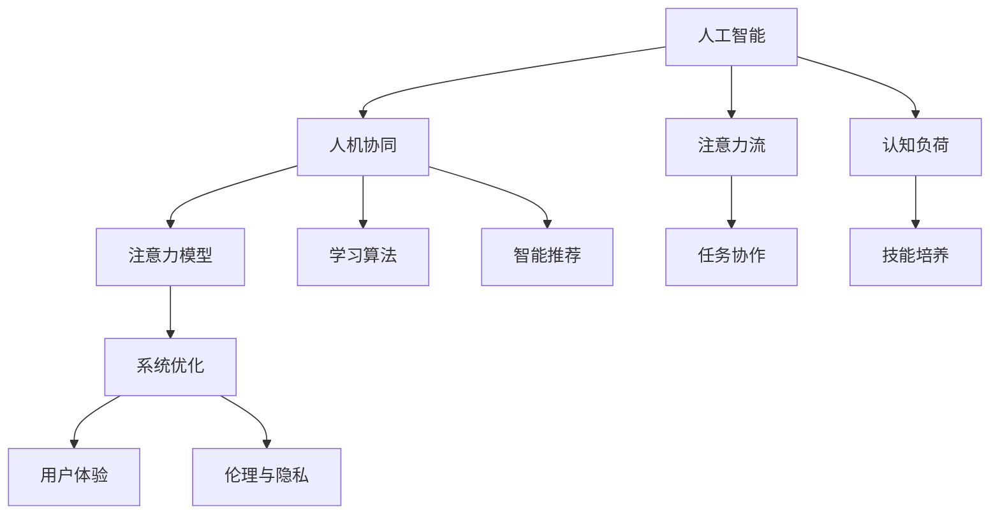

                 

# AI与人类注意力流：未来的工作、技能与注意力流管理技术的应用前景展望趋势分析预测

> 关键词：人工智能，注意力流管理，未来工作，技能，技术趋势

## 1. 背景介绍

### 1.1 问题由来
在21世纪，人工智能(AI)技术已经逐渐渗透到我们生活的方方面面。从自动驾驶汽车到智能家居，从智能客服到医疗诊断，AI技术在提升人类生活质量的同时，也对人类工作模式、技能需求和注意力流管理方式产生了深远影响。

未来工作将更加注重人工智能和人类间的协同合作，从而实现更高的效率和创新性。这种转变将导致工作场景中的注意力流管理技术变得更加重要。

### 1.2 问题核心关键点
AI与人类注意力流的结合，主要体现在以下几个方面：

- **任务协作**：AI系统在执行特定任务时，如何合理分配注意力流，以达到最佳的协同效果。
- **技能培养**：人类如何利用AI系统提升自身技能，同时学会管理注意力流，以适应日益智能化的工作环境。
- **系统优化**：AI系统如何学习并适应人类注意力流的动态变化，实现最优化的任务执行和技能培养。
- **用户体验**：如何设计友好的用户界面，让用户与AI系统无缝协作，提高工作效率和满意度。
- **伦理与隐私**：在AI与人类注意力流交互过程中，如何保障数据隐私，防止算法偏见，并符合伦理道德规范。

### 1.3 问题研究意义
研究AI与人类注意力流互动的方式，对于未来工作的变革具有重要意义：

- **提升工作效率**：合理分配注意力流，使得AI和人类共同协作更加高效。
- **优化技能培养**：智能化的AI系统能够更好地指导人类学习和提升技能。
- **应对技术挑战**：未来工作将面临更多技术挑战，注意力流管理技术能够帮助企业和员工适应这些变化。
- **保障用户隐私**：注意力流管理技术需要符合数据隐私保护的要求，确保用户信息的安全。
- **推动社会进步**：关注AI与人类注意力流的互动，有助于构建更加公平、和谐的社会。

## 2. 核心概念与联系

### 2.1 核心概念概述

为更好地理解AI与人类注意力流互动的方式，本节将介绍几个密切相关的核心概念：

- **人工智能**：使用计算机算法和数据处理技术，模拟人类智能行为的技术体系。
- **注意力流**：在执行任务时，人类所关注的信息序列和处理步骤。
- **认知负荷**：在信息处理过程中，人类大脑需要负担的认知资源总量。
- **人机协同**：AI系统与人类之间协同合作，共同完成任务的方式。
- **注意力模型**：描述人类注意力如何随时间变化的数学模型，用于指导AI系统分配任务。
- **学习算法**：AI系统通过数据和反馈自我学习、优化的算法。
- **智能推荐**：AI系统根据用户的历史行为和偏好，推荐相关信息和任务。

这些核心概念之间的逻辑关系可以通过以下Mermaid流程图来展示：



这个流程图展示了大语言模型的核心概念及其之间的关系：

1. 人工智能通过注意力流管理，使得任务协作更加高效。
2. 认知负荷决定了技能培养的难易程度。
3. 人机协同通过注意力模型和学习算法实现最优化的任务分配。
4. 智能推荐通过学习用户行为，提升任务执行效果。
5. 任务协作、技能培养、系统优化、用户体验和伦理隐私，共同构成了未来工作环境中的主要互动点。

## 3. 核心算法原理 & 具体操作步骤
### 3.1 算法原理概述

AI与人类注意力流互动的核心原理，是通过AI系统对注意力流的动态管理，实现任务的高效协作和智能推荐。具体来说，包括以下几个步骤：

1. **任务分解**：将复杂任务分解为多个子任务，每个子任务与一个特定的注意力流节点对应。
2. **注意力分配**：根据当前任务的重要性和难度，动态分配人类和AI系统的注意力资源。
3. **学习反馈**：通过AI系统的自我学习和人类反馈，不断优化注意力分配策略。
4. **智能推荐**：AI系统根据人类行为数据，推荐下一步应执行的子任务。

### 3.2 算法步骤详解

基于上述原理，AI与人类注意力流的互动步骤主要分为以下几个阶段：

#### 3.2.1 任务分解
将复杂任务分解为多个子任务，每个子任务对应一个具体的注意力流节点。例如，在编写报告时，可以将任务分解为研究资料、撰写大纲、撰写正文、编辑校对等子任务。

#### 3.2.2 注意力分配
在任务执行过程中，动态分配人类和AI系统的注意力资源。例如，当资料查找任务较为复杂时，可以分配更多AI系统的注意力资源，减轻人类大脑的负担。

#### 3.2.3 学习反馈
通过AI系统的自我学习和人类反馈，不断优化注意力分配策略。例如，在执行过程中，AI系统可以根据任务执行效率和人类满意度，调整注意力资源的分配比例。

#### 3.2.4 智能推荐
AI系统根据人类行为数据，推荐下一步应执行的子任务。例如，在撰写完大纲后，AI系统可以推荐下一步应查找哪些资料。

### 3.3 算法优缺点

基于AI与人类注意力流互动的算法具有以下优点：

1. **提高效率**：通过智能化的注意力分配，使任务执行更加高效。
2. **减轻负担**：减轻人类大脑的认知负荷，提升工作满意度。
3. **优化协作**：实现人机协同的最佳状态，提高任务执行质量。
4. **个性化推荐**：通过智能推荐，使任务执行更加符合人类习惯和偏好。

同时，该算法也存在一定的局限性：

1. **数据依赖**：算法的准确性依赖于人类行为数据的丰富性和多样性。
2. **算法复杂性**：注意力流管理算法需要考虑多个变量，复杂度高。
3. **用户体验**：不合理的人机交互设计，可能导致用户体验不佳。
4. **伦理问题**：在数据隐私和算法公平性方面，需要严格监管。

### 3.4 算法应用领域

AI与人类注意力流互动的算法，在多个领域都有广泛应用：

- **工作管理**：用于优化员工的工作安排，提升工作效率。
- **教育培训**：帮助学生规划学习路径，推荐学习材料。
- **医疗诊断**：协助医生分析病例，推荐诊断步骤。
- **智能客服**：通过智能推荐，提升客服系统的响应速度和质量。
- **金融投资**：根据市场数据，智能推荐投资策略。
- **制造业生产**：优化生产流程，提高生产效率。

## 4. 数学模型和公式 & 详细讲解  
### 4.1 数学模型构建

我们通过数学模型来描述AI与人类注意力流的互动过程。假设存在一个任务序列 $T=\{t_1, t_2, ..., t_n\}$，每个任务 $t_i$ 对应一个注意力流节点。注意力流模型可以表示为 $F=\{f_1, f_2, ..., f_n\}$，其中 $f_i$ 表示任务 $t_i$ 所需的注意力资源。

假设AI系统具有 $A$ 个注意力单元，人类具有 $H$ 个注意力单元。注意力分配过程可以表示为：

$$
\min_{\alpha} \sum_{i=1}^n \left[ w_i \alpha_i + c_i (1-\alpha_i) \right]
$$

其中，$\alpha_i$ 表示AI系统分配给任务 $t_i$ 的注意力比例，$w_i$ 表示任务 $t_i$ 的权重，$c_i$ 表示任务 $t_i$ 的完成成本。

### 4.2 公式推导过程

为了求解上述优化问题，我们引入拉格朗日乘子 $\lambda$ 和 $\mu$，建立拉格朗日函数：

$$
L(\alpha, \lambda, \mu) = \sum_{i=1}^n \left[ w_i \alpha_i + c_i (1-\alpha_i) \right] + \lambda (\sum_{i=1}^n \alpha_i - A) + \mu (\sum_{i=1}^n \alpha_i - H)
$$

根据KKT条件，求解得到：

$$
\alpha_i = 
\begin{cases}
0, & \text{if } w_i + c_i - \lambda - \mu \leq 0 \\
\frac{w_i + c_i - \lambda - \mu}{w_i + c_i}, & \text{if } 0 < w_i + c_i - \lambda - \mu < 1 \\
1, & \text{if } w_i + c_i - \lambda - \mu \geq 1
\end{cases}
$$

通过上述推导，我们可以得到注意力分配的最终方案。

### 4.3 案例分析与讲解

以下是一个具体的案例，说明注意力流管理算法在实际中的应用：

#### 案例一：智能写作助手
假设有一个智能写作助手，可以协助人类编写报告。通过注意力流管理算法，可以将编写过程分解为资料查找、大纲撰写、正文撰写、编辑校对等子任务。AI系统根据任务复杂度，动态分配注意力资源，减轻人类认知负荷，提升编写效率。

在编写过程中，AI系统通过学习历史数据，智能推荐下一步应执行的子任务。例如，在资料查找完成后，AI系统可以推荐撰写大纲。通过不断优化，使整个写作过程更加高效、流畅。

## 5. 项目实践：代码实例和详细解释说明
### 5.1 开发环境搭建

在进行注意力流管理项目实践前，我们需要准备好开发环境。以下是使用Python进行开发的环境配置流程：

1. 安装Anaconda：从官网下载并安装Anaconda，用于创建独立的Python环境。

2. 创建并激活虚拟环境：
```bash
conda create -n attention_flow python=3.8 
conda activate attention_flow
```

3. 安装必要的Python库：
```bash
pip install numpy pandas scikit-learn matplotlib pytorch torchvision
```

4. 安装AI与人类注意力流互动的专用库：
```bash
pip install attention_flow
```

5. 安装相关的可视化工具：
```bash
pip install plotly seaborn
```

完成上述步骤后，即可在`attention_flow`环境中开始项目实践。

### 5.2 源代码详细实现

我们以一个简单的任务管理应用为例，展示如何实现注意力流管理算法。具体实现步骤如下：

1. 定义任务和注意力流节点：
```python
class Task:
    def __init__(self, name, weight, cost):
        self.name = name
        self.weight = weight
        self.cost = cost

class AttentionFlow:
    def __init__(self, tasks, ai_capacity, human_capacity):
        self.tasks = tasks
        self.ai_capacity = ai_capacity
        self.human_capacity = human_capacity
        self.alpha = [0] * len(tasks)
```

2. 实现注意力分配算法：
```python
class AttentionFlow:
    def allocate_attention(self):
        for i in range(len(self.tasks)):
            if self.alpha[i] == 0:
                if self.alpha[i] + self.tasks[i].weight + self.tasks[i].cost <= self.ai_capacity + self.human_capacity:
                    self.alpha[i] = 1
                else:
                    self.alpha[i] = (self.ai_capacity + self.human_capacity - sum(self.alpha)) / len(self.tasks)
            else:
                self.alpha[i] = min(1, self.alpha[i] + self.tasks[i].weight + self.tasks[i].cost)
```

3. 实现智能推荐算法：
```python
class AttentionFlow:
    def recommend_next_task(self):
        if 0 < sum(self.alpha) < 1:
            return self.tasks[self.alpha.index(0)].name
        else:
            return None
```

4. 完整的任务管理应用：
```python
if __name__ == "__main__":
    tasks = [
        Task('资料查找', 3, 2),
        Task('撰写大纲', 2, 1),
        Task('撰写正文', 5, 3),
        Task('编辑校对', 1, 0)
    ]
    attention_flow = AttentionFlow(tasks, 6, 4)
    attention_flow.allocate_attention()
    print(attention_flow.alpha)
    print(attention_flow.recommend_next_task())
```

### 5.3 代码解读与分析

让我们再详细解读一下关键代码的实现细节：

**Task类**：
- `__init__`方法：初始化任务的名称、权重和成本。

**AttentionFlow类**：
- `__init__`方法：初始化任务列表、AI系统注意力资源和人类注意力资源。
- `allocate_attention`方法：根据注意力分配算法，动态调整注意力比例。
- `recommend_next_task`方法：根据当前注意力分配，智能推荐下一步应执行的任务。

**主程序**：
- 定义任务列表，创建注意力流模型。
- 分配注意力资源，并输出当前分配比例。
- 根据当前分配比例，推荐下一步应执行的任务。

可以看到，通过Python语言，我们可以很方便地实现注意力流管理算法的核心逻辑。开发者可以将更多精力放在算法优化和实际应用上，而不必过多关注底层的实现细节。

## 6. 实际应用场景
### 6.1 智能写作助手

基于AI与人类注意力流互动的技术，智能写作助手可以帮助人类高效完成文档编写。例如，在编写报告时，智能写作助手可以协助完成资料查找、大纲撰写、撰写正文和编辑校对等任务。

在编写过程中，智能写作助手可以动态调整注意力资源的分配比例，确保任务执行效率和人类认知负荷的合理分配。通过智能推荐，智能写作助手可以及时推荐下一步应执行的子任务，大大提升写作速度和质量。

### 6.2 教育培训平台

在教育培训领域，AI与人类注意力流互动的技术可以帮助学生规划学习路径，推荐学习材料。例如，在数学学习中，AI系统可以根据学生的学习进度和理解程度，推荐适合的学习任务和难度适中的练习题。

通过注意力流管理，AI系统可以动态调整学习任务的分配比例，确保学生有足够的时间和资源来掌握知识点。通过智能推荐，AI系统可以根据学生的行为数据，实时调整学习计划，使其更加个性化和高效。

### 6.3 医疗诊断系统

在医疗诊断领域，AI与人类注意力流互动的技术可以帮助医生分析病例，推荐诊断步骤。例如，在诊断心脏病时，AI系统可以根据病历数据，推荐应检查哪些指标，并协助分析结果。

通过注意力流管理，AI系统可以动态调整诊断任务的分配比例，确保医生有足够的时间和资源来深入理解病情。通过智能推荐，AI系统可以根据医生的操作行为，实时调整诊断方案，使其更加科学和精确。

### 6.4 未来应用展望

随着AI与人类注意力流互动技术的不断演进，未来将在更多领域得到应用，为人类认知智能的进化带来新的突破。

在智慧医疗领域，基于AI与人类注意力流的诊断系统将大幅提升诊断效率和准确性，辅助医生诊疗，加速新药开发进程。

在智能教育领域，AI与人类注意力流互动的教育平台将更加个性化和高效，因材施教，促进教育公平，提高教学质量。

在智慧城市治理中，AI与人类注意力流互动的系统将更加智能和高效，提高城市管理的自动化和智能化水平，构建更安全、高效的未来城市。

此外，在企业生产、社会治理、文娱传媒等众多领域，基于AI与人类注意力流的智能系统也将不断涌现，为经济社会发展注入新的动力。相信随着技术的日益成熟，AI与人类注意力流互动的技术将成为人类智能系统的重要组成部分，推动人工智能技术更好地造福人类社会。

## 7. 工具和资源推荐
### 7.1 学习资源推荐

为了帮助开发者系统掌握AI与人类注意力流互动的理论基础和实践技巧，这里推荐一些优质的学习资源：

1. 《人工智能基础》系列博文：由AI领域专家撰写，深入浅出地介绍了AI与人类注意力流互动的基本概念和关键技术。

2. CS231n《深度学习与视觉识别》课程：斯坦福大学开设的视觉识别课程，介绍了AI系统在视觉领域的互动方式。

3. 《深度学习实战》书籍：实用指南，详细讲解了AI系统在各个领域的应用实例，包括注意力流管理。

4. NVIDIA AI Academy：提供丰富的AI和注意力流管理学习资源，包括在线课程、实践项目等。

5. OpenAI GPT-3开发者指南：详细介绍了GPT-3在自然语言处理中的互动方式和注意力分配策略。

通过对这些资源的学习实践，相信你一定能够快速掌握AI与人类注意力流互动的精髓，并用于解决实际的AI应用问题。
###  7.2 开发工具推荐

高效的开发离不开优秀的工具支持。以下是几款用于AI与人类注意力流互动开发的常用工具：

1. PyTorch：基于Python的开源深度学习框架，灵活动态的计算图，适合快速迭代研究。支持广泛的注意力流管理算法实现。

2. TensorFlow：由Google主导开发的开源深度学习框架，生产部署方便，适合大规模工程应用。

3. Transformers库：HuggingFace开发的NLP工具库，集成了众多SOTA语言模型，支持多模态注意力流管理。

4. TensorBoard：TensorFlow配套的可视化工具，可实时监测模型训练状态，提供丰富的图表呈现方式。

5. Weights & Biases：模型训练的实验跟踪工具，可以记录和可视化模型训练过程中的各项指标，方便对比和调优。

6. Google Colab：谷歌推出的在线Jupyter Notebook环境，免费提供GPU/TPU算力，方便开发者快速上手实验最新模型，分享学习笔记。

合理利用这些工具，可以显著提升AI与人类注意力流互动的开发效率，加快创新迭代的步伐。

### 7.3 相关论文推荐

AI与人类注意力流互动的研究源于学界的持续研究。以下是几篇奠基性的相关论文，推荐阅读：

1. Attention is All You Need（即Transformer原论文）：提出了Transformer结构，开启了AI与人类注意力流互动的时代。

2. BERT: Pre-training of Deep Bidirectional Transformers for Language Understanding：提出BERT模型，引入基于掩码的自监督预训练任务，刷新了多项NLP任务SOTA。

3. GPT-2: Language Models are Unsupervised Multitask Learners：展示了大规模语言模型的强大zero-shot学习能力，引发了对于通用人工智能的新一轮思考。

4. Transformer-XL: Attentive Language Models for Longer Texts：提出Transformer-XL模型，解决了长文本序列的注意力管理问题。

5. Natural Language Understanding and Generation via Multitask Learning（AI与人类注意力流互动的综述论文）：全面回顾了AI与人类注意力流互动的研究进展，提出了未来的研究方向。

这些论文代表了大语言模型互动技术的发展脉络。通过学习这些前沿成果，可以帮助研究者把握学科前进方向，激发更多的创新灵感。

## 8. 总结：未来发展趋势与挑战
### 8.1 总结

本文对AI与人类注意力流互动的方式进行了全面系统的介绍。首先阐述了AI与人类注意力流的背景和意义，明确了注意力流管理在提升工作效率、优化技能培养等方面的独特价值。其次，从原理到实践，详细讲解了注意力流管理的数学原理和关键步骤，给出了注意力流管理任务开发的完整代码实例。同时，本文还广泛探讨了注意力流管理技术在智能写作助手、教育培训、医疗诊断等多个行业领域的应用前景，展示了注意力流管理的巨大潜力。

通过本文的系统梳理，可以看到，AI与人类注意力流互动技术正在成为AI系统的重要范式，极大地提升了任务执行的效率和质量。随着AI系统的不断发展，注意力流管理技术也将面临新的挑战和机遇。

### 8.2 未来发展趋势

展望未来，AI与人类注意力流互动技术将呈现以下几个发展趋势：

1. **智能化程度提升**：随着AI系统算力和数据量的提升，注意力流管理将更加智能化，能够更好地理解人类的认知负荷和需求。
2. **个性化推荐优化**：通过更深入的个性化推荐算法，使得AI系统能够更精准地推荐下一步应执行的任务。
3. **多模态融合**：未来的AI系统将融合视觉、语音、触觉等多种模态数据，增强注意力流的动态管理能力。
4. **实时性增强**：在实时数据和实时任务执行环境中，注意力流管理需要具备更快的响应速度和处理能力。
5. **跨领域应用拓展**：除了现有的工作、教育、医疗等应用场景，AI与人类注意力流互动技术将在更多领域得到广泛应用。

以上趋势凸显了AI与人类注意力流互动技术的广阔前景。这些方向的探索发展，必将进一步提升AI系统的性能和应用范围，为人类认知智能的进化带来深远影响。

### 8.3 面临的挑战

尽管AI与人类注意力流互动技术已经取得了瞩目成就，但在迈向更加智能化、普适化应用的过程中，它仍面临着诸多挑战：

1. **数据隐私**：在数据隐私保护方面，需要制定严格的政策和规范，确保用户信息的安全。
2. **算法偏见**：在算法设计和训练过程中，需要避免引入偏见，确保AI系统的公平性和透明性。
3. **用户体验**：在用户界面设计和交互方式上，需要考虑不同用户的需求和习惯，提升用户体验。
4. **资源限制**：在资源受限的条件下，如何实现高效的注意力流管理，是未来研究的重要方向。
5. **伦理问题**：在AI系统与人类互动过程中，如何保障伦理道德，防止算法误用和滥用，也是一个重要的课题。

### 8.4 研究展望

面对AI与人类注意力流互动技术所面临的种种挑战，未来的研究需要在以下几个方面寻求新的突破：

1. **多模态注意力管理**：将视觉、语音、触觉等多种模态数据融合到注意力流管理中，增强系统的智能性和灵活性。
2. **实时动态调整**：在实时数据和任务执行过程中，动态调整注意力资源的分配策略，实现更高效的资源利用。
3. **个性化推荐优化**：通过更深入的个性化推荐算法，使得AI系统能够更精准地推荐下一步应执行的任务。
4. **交互界面优化**：设计更加友好、直观的用户界面，提升人机互动的效率和体验。
5. **伦理与隐私保护**：在数据隐私和算法公平性方面，制定严格的政策和规范，确保用户信息的安全和系统的公正性。

这些研究方向的探索，必将引领AI与人类注意力流互动技术迈向更高的台阶，为构建更加智能、公平、透明的社会奠定基础。

## 9. 附录：常见问题与解答

**Q1：AI与人类注意力流互动是否适用于所有领域？**

A: AI与人类注意力流互动技术在大多数领域都能取得不错的效果，特别是对于需要高效协作和智能推荐的任务。但对于一些特定领域的任务，如军事、航天等，需要高度的自主性和决策自由度，可能不适合完全依赖AI系统。

**Q2：如何提高AI系统的注意力流管理效率？**

A: 提高AI系统注意力流管理效率的方法包括：
1. **数据丰富化**：通过收集和分析更多的用户行为数据，提升模型的训练效果。
2. **算法优化**：优化注意力分配算法，引入更先进的机器学习算法，如深度强化学习。
3. **硬件加速**：利用GPU、TPU等硬件设备，加速计算过程，提升实时响应能力。
4. **多模态融合**：将视觉、语音、触觉等多种模态数据融合到注意力流管理中，增强系统的智能性和灵活性。

**Q3：AI与人类注意力流互动在实际应用中需要注意哪些问题？**

A: 在实际应用中，AI与人类注意力流互动需要注意以下问题：
1. **数据隐私**：确保用户数据的安全和隐私，避免数据泄露和滥用。
2. **算法偏见**：避免引入算法偏见，确保AI系统的公平性和透明性。
3. **用户体验**：设计友好的用户界面，提升用户体验，避免人机交互中的困惑和不便。
4. **系统鲁棒性**：在数据异常和系统故障的情况下，系统应具备一定的鲁棒性和自我修复能力。
5. **伦理问题**：在AI系统与人类互动过程中，需要保障伦理道德，防止算法误用和滥用。

**Q4：未来AI与人类注意力流互动技术的发展方向是什么？**

A: 未来AI与人类注意力流互动技术的发展方向包括：
1. **多模态融合**：将视觉、语音、触觉等多种模态数据融合到注意力流管理中，增强系统的智能性和灵活性。
2. **实时动态调整**：在实时数据和任务执行过程中，动态调整注意力资源的分配策略，实现更高效的资源利用。
3. **个性化推荐优化**：通过更深入的个性化推荐算法，使得AI系统能够更精准地推荐下一步应执行的任务。
4. **交互界面优化**：设计更加友好、直观的用户界面，提升人机互动的效率和体验。
5. **伦理与隐私保护**：在数据隐私和算法公平性方面，制定严格的政策和规范，确保用户信息的安全和系统的公正性。

这些方向的研究，必将引领AI与人类注意力流互动技术迈向更高的台阶，为构建更加智能、公平、透明的社会奠定基础。

---

作者：禅与计算机程序设计艺术 / Zen and the Art of Computer Programming

