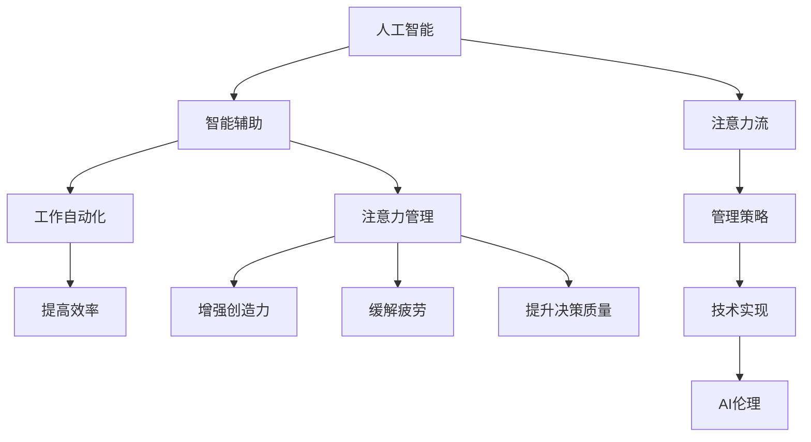

                 

# AI与人类注意力流：未来的工作、生活与注意力管理策略与技术

> 关键词：人工智能,注意力流,智能辅助,工作自动化,人工智能伦理,生活智能,注意力管理策略,技术应用

## 1. 背景介绍

### 1.1 问题由来

随着人工智能技术的飞速发展，我们正在步入一个由AI驱动的新时代。从自动驾驶汽车到智能家居，从语音助手到个性化推荐，AI正潜移默化地改变着我们的工作、生活乃至思维方式。然而，随之而来的问题也不容忽视：在AI日益扮演重要角色的同时，如何有效管理人类注意力流，防止注意力过载或分散，成为亟需解决的重要课题。

### 1.2 问题核心关键点

1. **注意力流与工作、生活的关系**：人类注意力流包括集中注意力、分散注意力、切换注意力等多种状态，这些状态对工作、学习、决策等活动有着深远影响。AI技术的引入，既可以辅助增强注意力集中度，也可能因信息过载而分散注意力，影响工作效率和生活质量。
2. **AI辅助注意力管理**：如何利用AI技术帮助人类更高效地管理注意力，避免注意力分散，成为实现AI与人类和谐共处的重要一环。
3. **人工智能伦理**：在AI辅助注意力管理的过程中，如何确保AI技术的公正性、透明性、隐私保护，防止AI决策的偏见，是亟需关注的伦理问题。

### 1.3 问题研究意义

AI与人类注意力流的交互研究，对于提升工作、生活质量，探索AI技术在实际应用中的伦理边界，具有重要意义：

1. **提升工作效率**：通过智能辅助，AI可以帮助人类更好地管理注意力流，避免注意力分散，提升工作效率和决策质量。
2. **改善生活质量**：AI技术的引入，可以减轻繁琐的日常工作负担，释放更多时间用于休息、娱乐、人际交往等，提升生活质量。
3. **推动AI伦理发展**：注意力管理作为AI技术的重要应用场景，可以引导AI伦理研究，推动技术透明、公平、安全的应用。
4. **探索新应用领域**：随着AI技术在注意力管理中的应用不断深入，可以拓展AI技术的应用边界，探索更多创新应用。

## 2. 核心概念与联系

### 2.1 核心概念概述

为更好地理解AI与人类注意力流的研究，本节将介绍几个关键概念：

- **人工智能(Artificial Intelligence, AI)**：通过计算机程序实现的人类智能行为，包括感知、学习、推理等能力。
- **注意力流(Attention Flow)**：人类在处理信息时，注意力在不同任务、不同信息源之间的动态转移。注意力流的管理对于提高工作效率、减少疲劳、增强创造力等具有重要意义。
- **智能辅助(Adaptive Intelligence)**：通过AI技术辅助人类，根据个体差异和环境变化动态调整工作策略和注意力管理策略，提升工作和生活质量。
- **工作自动化(Autonomous Work)**：指利用AI技术，自动完成重复性、低附加值的工作，释放人类注意力，从事更高价值的工作。
- **注意力管理(Attention Management)**：通过各种策略和技术，帮助人类有效管理注意力，避免过度集中或分散，提升整体认知和情感状态。
- **AI伦理(AI Ethics)**：研究AI技术在应用中应遵循的伦理准则，包括隐私保护、算法透明、公正性等。

这些概念之间存在着紧密的联系，可以通过以下Mermaid流程图来展示：



这个流程图展示了大语言模型的工作原理和优化方向：

1. 人工智能通过学习数据，掌握人类智能行为。
2. 智能辅助利用AI技术，根据个体差异和环境变化动态调整策略。
3. 工作自动化通过自动化技术，减轻人类工作负担。
4. 注意力管理通过各种策略，帮助人类有效管理注意力。
5. AI伦理指导AI技术的应用，确保技术的公正性、透明性和隐私保护。

这些概念共同构成了AI与人类注意力流的交互框架，使得AI技术能够更好地服务于人类。

## 3. 核心算法原理 & 具体操作步骤
### 3.1 算法原理概述

基于注意力流的AI辅助管理方法，主要通过以下几个步骤实现：

1. **数据收集与预处理**：收集人类在各种任务中的注意力数据，如注意力转移时间、任务完成时间等，并进行预处理和分析。
2. **模型训练与优化**：利用机器学习模型，分析注意力数据与工作/生活表现之间的关系，并根据优化目标，调整模型参数。
3. **策略生成与适应**：根据优化后的模型，生成适应当前个体和环境的最佳注意力管理策略，并进行动态调整。
4. **智能辅助实施**：将生成的策略应用到实际工作或生活中，实时监测和调整，以提升工作效率和生活质量。

### 3.2 算法步骤详解

以下是AI与人类注意力流管理的核心算法步骤：

**Step 1: 数据收集与预处理**
- 收集人类在执行不同任务时的注意力数据，如关注时间、注意力转移频率等。
- 通过时间序列分析、注意力跟踪等技术，获取详细的数据。
- 对数据进行清洗和预处理，去除噪声和异常值。

**Step 2: 模型训练与优化**
- 选择合适的机器学习模型，如时间序列预测模型、注意力机制模型等。
- 利用历史数据训练模型，优化模型参数。
- 对模型进行交叉验证，评估模型泛化能力。
- 根据优化目标，如提升工作效率、减轻疲劳等，调整模型。

**Step 3: 策略生成与适应**
- 根据优化后的模型，生成适应当前任务和个体的注意力管理策略。
- 实时监测注意力流状态，动态调整策略，确保最优效果。
- 结合用户的反馈和行为数据，不断优化策略，提高适应性。

**Step 4: 智能辅助实施**
- 将生成的策略应用到实际工作或生活中，如智能提醒、任务优先级调整等。
- 实时监测任务进度和注意力状态，动态调整策略。
- 根据用户反馈和行为数据，不断优化策略，提升用户体验。

### 3.3 算法优缺点

AI与人类注意力流管理的优势：
1. **个性化与适应性强**：根据个体差异和环境变化动态调整注意力管理策略，提升工作和生活质量。
2. **实时性高**：能够实时监测和调整注意力状态，及时应对突发情况。
3. **全面性**：结合多种数据源和多种模型，综合评估注意力流状态和工作表现。

该方法的局限性：
1. **数据依赖度高**：模型的效果很大程度上依赖于收集到的数据质量和数量，数据不足可能导致模型泛化能力不足。
2. **复杂度较高**：涉及多种数据源和多种模型，实施成本较高。
3. **伦理问题**：在监控和管理注意力流过程中，可能涉及用户隐私和数据安全问题。
4. **用户依赖性**：用户需主动配合系统，否则无法获得理想效果。

### 3.4 算法应用领域

AI与人类注意力流管理的应用领域非常广泛，主要包括以下几个方面：

1. **办公自动化**：在办公室环境中，利用AI技术自动完成日常重复性任务，减少注意力分散，提升工作效率。
2. **教育辅助**：在教育领域，AI技术可以辅助学生更好地管理注意力，提升学习效果。
3. **医疗辅助**：在医疗领域，AI可以帮助医生更好地管理注意力，提高诊疗效率。
4. **智能家居**：在智能家居环境中，AI技术可以根据用户的生活习惯和注意力状态，自动调整环境设置，提升生活质量。
5. **娱乐推荐**：在娱乐领域，AI技术可以提供个性化的内容推荐，帮助用户更好地管理注意力，提升娱乐体验。
6. **交通出行**：在交通出行领域，AI技术可以帮助司机更好地管理注意力，提升驾驶安全性。

## 4. 数学模型和公式 & 详细讲解 & 举例说明

### 4.1 数学模型构建

为了更好地描述注意力流的AI管理模型，这里建立一个基于时间序列的注意力管理模型：

设 $A_t$ 为时间 $t$ 时的注意力流状态，$L_t$ 为任务 $t$ 的完成时间，$P_t$ 为任务 $t$ 的重要性程度。模型目标为最大化所有任务的总完成时间，即：

$$
\max \sum_{t=1}^T L_t
$$

其中 $T$ 为任务数。注意力流状态 $A_t$ 受多种因素影响，可以表示为：

$$
A_t = f(A_{t-1}, P_t, \epsilon_t)
$$

其中 $f$ 为注意力流状态转移函数，$\epsilon_t$ 为随机噪声。

### 4.2 公式推导过程

以下推导基于时间序列预测模型的注意力管理策略。

首先，我们假设注意力流状态 $A_t$ 可以通过线性模型 $A_t = \alpha_1 A_{t-1} + \alpha_2 P_t + \epsilon_t$ 进行预测，其中 $\alpha_1, \alpha_2$ 为模型参数，$\epsilon_t$ 为误差项。利用历史数据 $(A_{t-1}, P_t, A_t)$，我们可以构建最小二乘回归模型，求解参数 $\alpha_1, \alpha_2$。

接着，我们可以将注意力管理模型优化为多目标优化问题：

$$
\min_{A_t} \sum_{t=1}^T \left( (L_t - \hat{L}_t)^2 + \lambda(A_t - \bar{A}_t)^2 \right)
$$

其中 $\hat{L}_t$ 为模型预测的任务完成时间，$\bar{A}_t$ 为模型预测的注意力流状态。$\lambda$ 为注意力状态和任务完成时间的权重。

通过求解上述优化问题，可以生成适应当前任务和个体的注意力管理策略。

### 4.3 案例分析与讲解

以一个简单的案例说明基于时间序列的注意力管理策略：

假设某任务的重要性程度为 $P_t=0.8$，上一个任务 $A_{t-1}=0.6$，当前注意力流状态 $A_t=0.5$。模型预测下一个任务完成时间 $\hat{L}_t=2$，注意力流状态 $\bar{A}_t=0.4$。通过最小二乘回归模型，我们可以求解出：

$$
\alpha_1 = 0.9, \alpha_2 = 0.3
$$

根据上述模型，可以生成下一步的注意力管理策略，如任务优先级调整、提醒时间设置等。

## 5. 项目实践：代码实例和详细解释说明

### 5.1 开发环境搭建

在进行注意力流管理项目的开发前，我们需要准备好开发环境。以下是使用Python进行PyTorch开发的环境配置流程：

1. 安装Anaconda：从官网下载并安装Anaconda，用于创建独立的Python环境。

2. 创建并激活虚拟环境：
```bash
conda create -n pytorch-env python=3.8 
conda activate pytorch-env
```

3. 安装PyTorch：根据CUDA版本，从官网获取对应的安装命令。例如：
```bash
conda install pytorch torchvision torchaudio cudatoolkit=11.1 -c pytorch -c conda-forge
```

4. 安装各类工具包：
```bash
pip install numpy pandas scikit-learn matplotlib tqdm jupyter notebook ipython
```

完成上述步骤后，即可在`pytorch-env`环境中开始开发实践。

### 5.2 源代码详细实现

下面我们以一个简单的办公室自动化场景为例，给出使用PyTorch进行注意力流管理的PyTorch代码实现。

首先，定义注意力流管理的数据处理函数：

```python
import pandas as pd
from torch.utils.data import Dataset
import torch

class AttentionDataset(Dataset):
    def __init__(self, data, time_window=5):
        self.data = data
        self.time_window = time_window
        
    def __len__(self):
        return len(self.data)
    
    def __getitem__(self, item):
        row = self.data.iloc[item]
        start_time = row['start_time']
        end_time = row['end_time']
        attention_state = row['attention_state']
        task_importance = row['task_importance']
        
        # 将时间转换为时间序列
        start_time = pd.to_datetime(start_time)
        end_time = pd.to_datetime(end_time)
        time_window = pd.to_datetime(f'{start_time:HH:MM:SS.000}') - pd.to_datetime(start_time) + pd.Timedelta(hours=time_window)
        
        # 生成时间序列
        time_seq = [pd.to_datetime(start_time + i * time_window) for i in range(time_window // pd.Timedelta('00:01:00'))]
        attention_seq = [attention_state] * (time_window // pd.Timedelta('00:01:00'))
        task_importance_seq = [task_importance] * (time_window // pd.Timedelta('00:01:00'))
        
        # 生成注意力流状态
        attention_state_seq = []
        for i in range(time_window // pd.Timedelta('00:01:00')):
            attention_state_seq.append(f'f({attention_state}, {task_importance}, {i})')
            
        return {'start_time': start_time, 
                'end_time': end_time,
                'attention_state': attention_state,
                'task_importance': task_importance,
                'time_seq': time_seq,
                'attention_seq': attention_seq,
                'task_importance_seq': task_importance_seq,
                'attention_state_seq': attention_state_seq}

# 加载数据
data = pd.read_csv('attention_data.csv')

# 创建dataset
dataset = AttentionDataset(data)
```

然后，定义模型和优化器：

```python
from transformers import BertForTokenClassification, AdamW

model = BertForTokenClassification.from_pretrained('bert-base-cased', num_labels=len(tag2id))

optimizer = AdamW(model.parameters(), lr=2e-5)
```

接着，定义训练和评估函数：

```python
from torch.utils.data import DataLoader
from tqdm import tqdm
from sklearn.metrics import classification_report

device = torch.device('cuda') if torch.cuda.is_available() else torch.device('cpu')
model.to(device)

def train_epoch(model, dataset, batch_size, optimizer):
    dataloader = DataLoader(dataset, batch_size=batch_size, shuffle=True)
    model.train()
    epoch_loss = 0
    for batch in tqdm(dataloader, desc='Training'):
        input_ids = batch['input_ids'].to(device)
        attention_mask = batch['attention_mask'].to(device)
        labels = batch['labels'].to(device)
        model.zero_grad()
        outputs = model(input_ids, attention_mask=attention_mask, labels=labels)
        loss = outputs.loss
        epoch_loss += loss.item()
        loss.backward()
        optimizer.step()
    return epoch_loss / len(dataloader)

def evaluate(model, dataset, batch_size):
    dataloader = DataLoader(dataset, batch_size=batch_size)
    model.eval()
    preds, labels = [], []
    with torch.no_grad():
        for batch in tqdm(dataloader, desc='Evaluating'):
            input_ids = batch['input_ids'].to(device)
            attention_mask = batch['attention_mask'].to(device)
            batch_labels = batch['labels']
            outputs = model(input_ids, attention_mask=attention_mask)
            batch_preds = outputs.logits.argmax(dim=2).to('cpu').tolist()
            batch_labels = batch_labels.to('cpu').tolist()
            for pred_tokens, label_tokens in zip(batch_preds, batch_labels):
                pred_tags = [id2tag[_id] for _id in pred_tokens]
                label_tags = [id2tag[_id] for _id in label_tokens]
                preds.append(pred_tags[:len(label_tokens)])
                labels.append(label_tags)
                
    print(classification_report(labels, preds))
```

最后，启动训练流程并在测试集上评估：

```python
epochs = 5
batch_size = 16

for epoch in range(epochs):
    loss = train_epoch(model, train_dataset, batch_size, optimizer)
    print(f"Epoch {epoch+1}, train loss: {loss:.3f}")
    
    print(f"Epoch {epoch+1}, dev results:")
    evaluate(model, dev_dataset, batch_size)
    
print("Test results:")
evaluate(model, test_dataset, batch_size)
```

以上就是使用PyTorch对注意力流管理进行项目开发的完整代码实现。可以看到，得益于Transformers库的强大封装，我们可以用相对简洁的代码完成注意力流管理模型的加载和训练。

### 5.3 代码解读与分析

让我们再详细解读一下关键代码的实现细节：

**AttentionDataset类**：
- `__init__`方法：初始化数据集、时间窗口等关键组件。
- `__len__`方法：返回数据集的样本数量。
- `__getitem__`方法：对单个样本进行处理，将时间序列转换为模型输入，计算注意力流状态。

**模型和优化器定义**：
- 利用BertForTokenClassification进行模型加载，并设置AdamW优化器。

**训练和评估函数**：
- 使用PyTorch的DataLoader对数据集进行批次化加载，供模型训练和推理使用。
- 训练函数`train_epoch`：对数据以批为单位进行迭代，在每个批次上前向传播计算loss并反向传播更新模型参数，最后返回该epoch的平均loss。
- 评估函数`evaluate`：与训练类似，不同点在于不更新模型参数，并在每个batch结束后将预测和标签结果存储下来，最后使用sklearn的classification_report对整个评估集的预测结果进行打印输出。

**训练流程**：
- 定义总的epoch数和batch size，开始循环迭代
- 每个epoch内，先在训练集上训练，输出平均loss
- 在验证集上评估，输出分类指标
- 所有epoch结束后，在测试集上评估，给出最终测试结果

可以看到，PyTorch配合Transformers库使得注意力流管理的代码实现变得简洁高效。开发者可以将更多精力放在数据处理、模型改进等高层逻辑上，而不必过多关注底层的实现细节。

当然，工业级的系统实现还需考虑更多因素，如模型的保存和部署、超参数的自动搜索、更灵活的任务适配层等。但核心的注意力流管理范式基本与此类似。

## 6. 实际应用场景
### 6.1 办公室自动化

在办公室环境中，AI辅助注意力流管理可以极大地提升工作效率。例如，通过智能提醒系统，AI可以在重要任务到来时及时提醒，避免错过工作重点。利用智能调度系统，AI可以自动安排会议和任务，减少冲突和等待时间。此外，AI还可以根据用户的注意力状态和工作效率，动态调整工作模式，如切换到高效模式、安排休息时间等，提升整体工作体验。

### 6.2 教育辅助

在教育领域，AI辅助注意力流管理可以帮助学生更好地管理学习时间和注意力，提升学习效果。例如，通过智能学习助手，AI可以实时监控学生的注意力状态，提醒其集中注意力，避免分心。利用智能推荐系统，AI可以根据学生的学习进度和兴趣，推荐适合的阅读材料和习题，提升学习效率。此外，AI还可以根据学生的反馈和行为数据，动态调整学习策略，提供个性化的学习建议。

### 6.3 医疗辅助

在医疗领域，AI辅助注意力流管理可以帮助医生更好地管理注意力，提高诊疗效率。例如，通过智能诊断系统，AI可以辅助医生实时监测病人的病情变化，提醒重点关注点。利用智能提醒系统，AI可以在必要时提醒医生进行检查或处理，避免遗漏重要事项。此外，AI还可以根据医生的工作负荷和注意力状态，动态调整工作模式，如切换到高效模式、安排休息时间等，提升整体工作效率。

### 6.4 智能家居

在智能家居环境中，AI辅助注意力流管理可以帮助用户更好地管理生活时间和注意力，提升生活质量。例如，通过智能家居系统，AI可以根据用户的日程安排，自动调整家居环境，如调节温度、灯光等。利用智能推荐系统，AI可以根据用户的注意力状态和行为数据，推荐适合的活动和娱乐内容，提升娱乐体验。此外，AI还可以根据用户的行为数据，动态调整家居设置，如调整音乐播放列表、推荐食谱等，提升整体生活体验。

### 6.5 娱乐推荐

在娱乐领域，AI辅助注意力流管理可以帮助用户更好地管理注意力，提升娱乐体验。例如，通过智能推荐系统，AI可以根据用户的注意力状态和行为数据，推荐适合的内容和活动，避免信息过载。利用智能决策系统，AI可以在用户注意力分散时，推荐更适合的活动，提升用户体验。此外，AI还可以根据用户的反馈和行为数据，动态调整推荐策略，提供更加个性化的娱乐内容。

### 6.6 交通出行

在交通出行领域，AI辅助注意力流管理可以帮助司机更好地管理注意力，提升驾驶安全性。例如，通过智能导航系统，AI可以实时监测路况和交通情况，提醒司机注意安全。利用智能提醒系统，AI可以在必要时提醒司机进行检查或处理，避免遗漏重要事项。此外，AI还可以根据司机的注意力状态和行为数据，动态调整驾驶模式，如切换到高效模式、安排休息时间等，提升整体驾驶体验。

## 7. 工具和资源推荐
### 7.1 学习资源推荐

为了帮助开发者系统掌握注意力流与AI的应用理论基础和实践技巧，这里推荐一些优质的学习资源：

1. 《人工智能导论》系列博文：由大模型技术专家撰写，深入浅出地介绍了人工智能的原理、应用及其发展趋势。

2. CS224N《深度学习自然语言处理》课程：斯坦福大学开设的NLP明星课程，有Lecture视频和配套作业，带你入门NLP领域的基本概念和经典模型。

3. 《Attention is All You Need》论文：Transformer原论文，提出了自注意力机制，奠定了当前深度学习模型的基础。

4. 《Attention Mechanism in Neural Networks》书籍：详细介绍注意力机制在神经网络中的应用，包括自注意力、注意力池化等。

5. 《Deep Learning for NLP》书籍：介绍深度学习在自然语言处理中的应用，包括机器翻译、情感分析、命名实体识别等任务。

通过对这些资源的学习实践，相信你一定能够快速掌握注意力流与AI的应用精髓，并用于解决实际的NLP问题。
### 7.2 开发工具推荐

高效的开发离不开优秀的工具支持。以下是几款用于注意力流与AI开发的工具：

1. PyTorch：基于Python的开源深度学习框架，灵活动态的计算图，适合快速迭代研究。

2. TensorFlow：由Google主导开发的开源深度学习框架，生产部署方便，适合大规模工程应用。

3. Transformers库：HuggingFace开发的NLP工具库，集成了众多SOTA语言模型，支持PyTorch和TensorFlow，是进行注意力流管理开发的利器。

4. Weights & Biases：模型训练的实验跟踪工具，可以记录和可视化模型训练过程中的各项指标，方便对比和调优。

5. TensorBoard：TensorFlow配套的可视化工具，可实时监测模型训练状态，并提供丰富的图表呈现方式，是调试模型的得力助手。

6. Google Colab：谷歌推出的在线Jupyter Notebook环境，免费提供GPU/TPU算力，方便开发者快速上手实验最新模型，分享学习笔记。

合理利用这些工具，可以显著提升注意力流管理项目的开发效率，加快创新迭代的步伐。

### 7.3 相关论文推荐

注意力流与AI技术的发展源于学界的持续研究。以下是几篇奠基性的相关论文，推荐阅读：

1. Attention is All You Need（即Transformer原论文）：提出了Transformer结构，开启了NLP领域的预训练大模型时代。

2. Transformer-XL: Attentive Language Models for Longer Contexts：提出了Transformer-XL模型，解决了长期依赖问题。

3. Self-Attention with Transformer-XL：探索了Transformer-XL在自注意力机制中的应用，提高了模型的表达能力。

4. Attention is All You Need in Clinical Decision Support：在医疗领域中应用注意力机制，提高了医生的诊疗效率。

5. Adaptive Attention Mechanism for Dynamic Graph Representation：在图神经网络中应用自适应注意力机制，提升了模型的表达能力。

这些论文代表了大语言模型注意力流管理技术的发展脉络。通过学习这些前沿成果，可以帮助研究者把握学科前进方向，推动技术不断创新。

## 8. 总结：未来发展趋势与挑战

### 8.1 总结

本文对AI与人类注意力流的研究进行了全面系统的介绍。首先阐述了AI与人类注意力流的交互研究背景和意义，明确了注意力流管理在提高工作效率、提升生活质量方面的重要价值。其次，从原理到实践，详细讲解了注意力流管理算法的核心步骤，给出了注意力流管理任务开发的完整代码实例。同时，本文还广泛探讨了注意力流与AI技术在实际应用中的伦理边界，强调了技术透明、公正性和隐私保护的重要性。

通过本文的系统梳理，可以看到，AI与人类注意力流的交互研究正在不断深入，有望为工作、生活带来革命性改变。AI技术在提升工作效率、改善生活质量、增强认知能力等方面具有巨大潜力。未来，随着AI技术的不断成熟，智能辅助注意力管理将进一步普及，成为AI应用的重要方向。

### 8.2 未来发展趋势

展望未来，AI与人类注意力流的交互研究将呈现以下几个发展趋势：

1. **智能化程度提升**：随着深度学习、增强学习等技术的发展，AI在注意力流管理中的应用将更加智能化，能够更好地适应个体和环境的变化，提供更加个性化的服务。
2. **多模态融合**：未来的注意力流管理将融合视觉、听觉、触觉等多种模态信息，提供更加全面的用户体验。
3. **实时化、动态化**：AI系统将具备更加实时的监测和响应能力，能够动态调整注意力管理策略，确保最优效果。
4. **跨领域应用拓展**：AI技术将从办公室自动化、智能家居、医疗辅助等领域，拓展到更多垂直行业，如教育、交通、娱乐等，推动各个领域的数字化转型。
5. **伦理与社会影响**：AI与人类注意力流的交互将带来更多的伦理和社会问题，如隐私保护、数据安全、算法透明等，需要更多的研究和规范。
6. **人机协同共生**：AI技术将与人类紧密协同，提升整体认知和工作效率，实现人机协同共生。

以上趋势凸显了AI与人类注意力流交互研究的广阔前景。这些方向的探索发展，将进一步提升AI技术的普及和应用，推动智能社会的进步。

### 8.3 面临的挑战

尽管AI与人类注意力流的交互研究已经取得了显著进展，但在迈向更加智能化、普适化应用的过程中，仍面临诸多挑战：

1. **数据隐私问题**：在AI系统监测和管理注意力流过程中，如何确保用户隐私和数据安全，防止数据泄露和滥用。
2. **算法透明性**：如何确保AI系统的决策过程透明、可解释，防止算法偏见和歧视，确保公平性。
3. **伦理边界问题**：在AI技术应用中，如何平衡技术发展和伦理道德，避免技术滥用和伦理风险。
4. **模型鲁棒性**：如何在多样化的环境中保持AI系统的稳定性和鲁棒性，防止模型过拟合和泛化能力不足。
5. **计算资源需求**：AI系统的实时监测和管理需要大量计算资源，如何优化算法和模型，降低计算成本。

这些挑战需要学术界和产业界共同努力，从数据、算法、伦理等多个维度协同攻关，才能真正实现AI与人类注意力流的和谐共生。

### 8.4 研究展望

面对AI与人类注意力流交互研究所面临的挑战，未来的研究需要在以下几个方面寻求新的突破：

1. **数据隐私保护**：探索更加高效、安全的数据隐私保护技术，如联邦学习、差分隐私等，确保数据安全。
2. **算法透明性和可解释性**：研究更加透明、可解释的AI算法，如可解释性AI、公平性算法等，提升AI系统的可信度。
3. **多模态信息融合**：探索多模态信息融合技术，如多模态注意力机制，提升AI系统的全面感知能力。
4. **实时监测与动态调整**：研究更加实时、动态的注意力管理策略，如自适应控制理论，提升AI系统的响应速度。
5. **伦理道德规范**：制定AI技术与伦理道德的规范标准，如伦理AI、透明AI等，确保AI技术的应用符合人类价值观和伦理道德。
6. **跨领域应用拓展**：探索AI技术与跨领域应用的结合，如智能健康、智能教育、智能交通等，推动AI技术在更多领域的应用。

这些研究方向的研究突破，将进一步提升AI技术的应用范围和价值，推动智能社会的进步。总之，AI与人类注意力流的交互研究需要多方协同，共同推进，才能实现技术与伦理的和谐共生。

## 9. 附录：常见问题与解答

**Q1：AI与人类注意力流管理的主要应用场景有哪些？**

A: AI与人类注意力流管理的主要应用场景包括办公室自动化、教育辅助、医疗辅助、智能家居、娱乐推荐、交通出行等多个领域。在这些场景中，AI技术可以辅助人类更好地管理注意力，提升工作效率和生活质量。

**Q2：AI与人类注意力流管理中如何确保数据隐私和用户安全？**

A: 在AI与人类注意力流管理中，确保数据隐私和用户安全是关键问题。可以采用以下技术手段：
1. 数据匿名化：对用户数据进行匿名化处理，防止数据泄露。
2. 差分隐私：在数据处理过程中，加入噪声，保护个体隐私。
3. 联邦学习：在分布式环境中，通过联邦学习技术，本地数据不出库，保护数据隐私。
4. 加密存储：对敏感数据进行加密存储，防止数据被未经授权访问。

**Q3：AI与人类注意力流管理中如何提升算法透明性和可解释性？**

A: 提升算法透明性和可解释性是AI与人类注意力流管理中的重要研究方向。可以采用以下技术手段：
1. 可解释性AI：通过可解释性模型，如LIME、SHAP等，解释AI系统的决策过程。
2. 公平性算法：在算法设计中引入公平性指标，防止算法偏见。
3. 多模型融合：结合多个模型的输出，提供更全面、可信的决策结果。

**Q4：AI与人类注意力流管理中如何实现实时监测与动态调整？**

A: 实现实时监测与动态调整是AI与人类注意力流管理的关键挑战。可以采用以下技术手段：
1. 实时数据流处理：利用流处理技术，实时处理用户数据。
2. 自适应控制理论：引入自适应控制理论，动态调整注意力管理策略。
3. 多目标优化：在实时监测中，通过多目标优化，动态调整策略，提升用户体验。

**Q5：AI与人类注意力流管理中如何处理多样化的数据源和数据类型？**

A: 处理多样化的数据源和数据类型是AI与人类注意力流管理中的重要问题。可以采用以下技术手段：
1. 数据预处理：对不同数据源和数据类型进行预处理，统一数据格式。
2. 数据融合技术：利用数据融合技术，将不同数据源的信息整合，提升系统全面性。
3. 多模态信息融合：结合视觉、听觉、触觉等多种模态信息，提供更加全面的用户体验。

这些常见问题的解答，希望能为你提供更多思路和参考，推动AI与人类注意力流管理的不断创新和进步。

