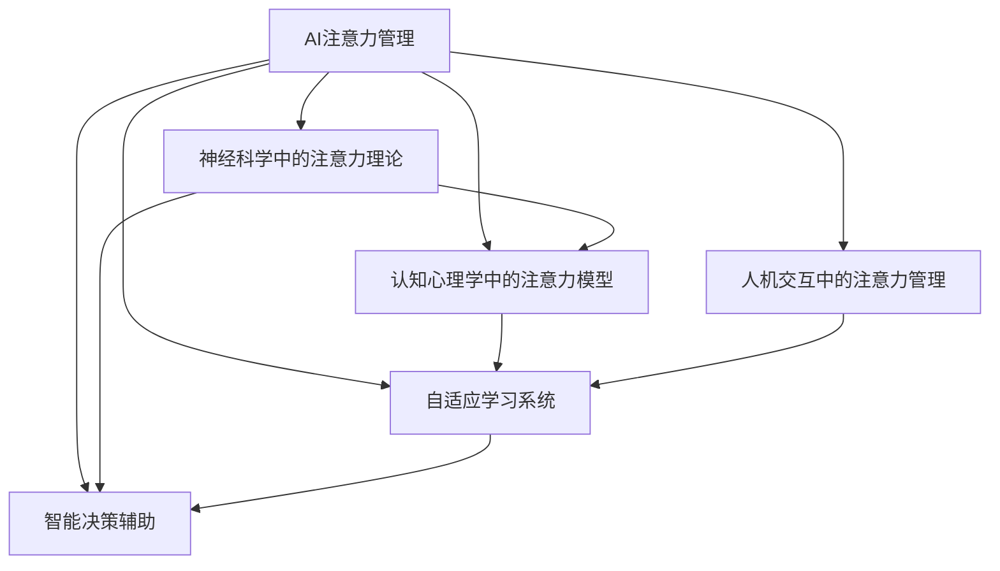

                 

# AI与人类注意力流：未来的工作、生活与注意力管理策略与技术

## 1. 背景介绍

### 1.1 问题由来
在信息化飞速发展的今天，人们的生活和工作方式正在发生翻天覆地的变化。数字化工具、智能设备、人工智能技术正逐渐渗透到我们日常生活的各个角落，极大地提高了生产效率，改善了生活质量。然而，随着技术的深入应用，人类对注意力资源的管理与分配面临前所未有的挑战。

人们每天都会面对海量信息、不断增长的数据、纷繁复杂的任务，如何在复杂多变的环境中有效管理注意力，保持专注和高效，成为了一个亟待解决的难题。

### 1.2 问题核心关键点
在数字化和智能化浪潮的推动下，注意力管理成为了一个跨学科的热门话题，涉及到神经科学、认知心理学、人机交互等多个领域。面对这一挑战，AI技术，尤其是大语言模型和强化学习等新兴技术，正在为人类注意力流的管理提供全新的解决方案。

AI与人类注意力流的结合，旨在通过自动化和智能化的方式，帮助人们更好地分配和利用注意力资源，从而提升工作、生活的效率和质量。AI技术可以在诸如任务分配、时间管理、信息筛选、决策辅助等方面提供支持，让人类能够在更为复杂的信息环境中保持专注和高效。

## 2. 核心概念与联系

### 2.1 核心概念概述

为更好地理解AI与人类注意力流结合的原理和应用，本节将介绍几个关键概念：

- **AI注意力管理**：指利用AI技术，特别是大语言模型和强化学习算法，帮助人类在复杂环境中有效管理注意力资源，提升工作和生活效率。

- **神经科学中的注意力理论**：人类注意力是认知过程的重要组成部分，包括注意的集中、分散、转移等方面。理解人类注意力机制，有助于设计更符合人类认知习惯的AI系统。

- **认知心理学中的注意力模型**：从心理学的角度研究人类注意力分配和使用的规律，理解注意力如何与外界刺激相互作用，为AI系统提供理论支持。

- **人机交互中的注意力管理**：研究如何设计人机交互界面，以辅助人类更好地管理注意力，如自动过滤信息、智能任务调度等。

- **自适应学习系统**：利用强化学习等AI技术，实时调整任务分配和注意力管理策略，以适应不同用户和环境的变化。

- **智能决策辅助**：通过AI技术对海量信息进行筛选和分析，为决策者提供辅助，帮助其快速高效地做出判断。

这些概念之间的联系可以通过以下Mermaid流程图来展示：



这个流程图展示了AI注意力管理与其他相关领域之间的逻辑关系：

1. AI注意力管理基于对人类注意力机制的理解，借鉴认知心理学和神经科学的研究成果，设计合适的注意力管理策略。
2. 在实际应用中，AI注意力管理系统通过人机交互界面和自适应学习系统，实时调整注意力分配策略，帮助用户高效完成任务。
3. 智能决策辅助系统则是AI注意力管理的具体应用场景，通过筛选和分析信息，辅助用户做出更加科学的决策。

## 3. 核心算法原理 & 具体操作步骤

### 3.1 算法原理概述

基于AI的注意力管理，其核心思想是通过智能算法，实时监控和优化用户的注意力分配。具体来说，算法会依据用户的历史行为数据、当前环境状态以及AI模型对任务重要性的评估，动态调整用户的注意力分配，使其始终保持在关键任务上，同时避免过度分散注意力。

形式化地，假设用户的注意力分配状态为 $A_t$，当前任务状态为 $T_t$，环境状态为 $E_t$，AI模型对任务 $i$ 的优先级为 $P_i$，则注意力管理的优化目标可以表示为：

$$
\max_{A_t} \sum_{i=1}^N P_i A_i
$$

其中，$N$ 为任务数量。优化目标是在满足用户需求的前提下，最大化重要任务的注意力分配，即优先处理对当前环境最有影响的任务。

### 3.2 算法步骤详解

基于AI的注意力管理算法通常包括以下几个关键步骤：

**Step 1: 数据收集与预处理**
- 收集用户的历史行为数据，如时间花费、任务完成情况、目标达成率等。
- 收集当前环境状态数据，如任务截止时间、紧急程度、优先级等。
- 数据预处理，如数据清洗、特征提取、归一化等。

**Step 2: 模型训练与参数设置**
- 选择合适的模型，如线性回归、逻辑回归、深度神经网络等，用于预测任务优先级。
- 确定模型的超参数，如学习率、批大小、迭代次数等。
- 使用收集到的数据对模型进行训练，优化参数。

**Step 3: 实时监控与注意力分配**
- 实时监控用户当前的行为和环境状态。
- 根据模型预测的任务优先级，动态调整用户的注意力分配。
- 用户交互界面应提供明确的提示和反馈，帮助用户了解注意力分配策略。

**Step 4: 反馈与优化**
- 收集用户对注意力管理系统的反馈，如满意度、任务完成情况等。
- 基于反馈数据，调整模型参数和策略，进一步优化注意力管理效果。

### 3.3 算法优缺点

基于AI的注意力管理算法具有以下优点：
1. 自动化程度高：能够实时监控和调整注意力分配，无需人工干预。
2. 实时性佳：能够及时响应环境变化，提高任务处理效率。
3. 自适应性强：能够根据用户反馈和行为数据进行动态调整，适应不同用户和环境。
4. 科学依据：基于神经科学和认知心理学的理论，设计合理的注意力管理策略。

同时，该算法也存在一定的局限性：
1. 数据依赖度高：模型的性能很大程度上取决于数据的质量和量。
2. 用户习惯差异：不同用户对注意力管理策略的接受程度和适应能力可能不同。
3. 隐私和安全问题：实时监控和数据处理可能引发隐私和安全问题。
4. 策略局限性：当前策略可能无法有效应对极端复杂和多变的环境。

尽管存在这些局限性，但就目前而言，基于AI的注意力管理方法仍然是一个前沿的研究方向，具有广泛的应用前景。

### 3.4 算法应用领域

基于AI的注意力管理技术已经在多个领域得到了应用，包括但不限于：

- **工作管理**：如项目管理、任务调度、员工绩效评估等。通过实时监控员工的工作状态和环境变化，优化任务分配和注意力分配，提升工作效率。
- **学习辅助**：如在线学习平台的智能推荐、学习路径规划等。通过分析学生的学习行为和成绩数据，优化学习内容和资源分配，帮助学生高效学习。
- **医疗辅助**：如手术室辅助决策、病人护理管理等。通过监控医疗环境状态和病人状态，实时调整医生的注意力分配，提升手术成功率和病人满意度。
- **智能家居**：如智能助手、语音控制等。通过识别用户的生活习惯和环境变化，智能推荐服务，提升用户的生活质量。
- **智能交通**：如路况分析、交通流量调控等。通过实时监控交通状态，优化交通信号分配，提升交通效率。

## 4. 数学模型和公式 & 详细讲解 & 举例说明

### 4.1 数学模型构建

本节将使用数学语言对基于AI的注意力管理过程进行更加严格的刻画。

假设用户的注意力分配状态为 $A_t = [A_{t1}, A_{t2}, ..., A_{tn}]$，其中 $A_{ti}$ 表示用户对任务 $i$ 的注意力分配。当前任务状态为 $T_t = [T_{t1}, T_{t2}, ..., T_{tn}]$，其中 $T_{ti}$ 表示任务 $i$ 的完成情况。环境状态为 $E_t = [E_{t1}, E_{t2}, ..., E_{tn}]$，其中 $E_{ti}$ 表示任务 $i$ 的环境状态。

模型的目标是最小化注意力分配与任务完成情况的偏差，即：

$$
\min_{A_t} \sum_{i=1}^N (A_{ti} - T_{ti})^2
$$

其中，$N$ 为任务数量。通过最小化偏差，模型能够最大化关键任务的完成率，避免注意力资源浪费。

### 4.2 公式推导过程

根据上述目标，我们可以构建一个线性回归模型来预测任务完成情况：

$$
T_i = \alpha + \beta_1 A_{i1} + \beta_2 A_{i2} + ... + \beta_n A_{in} + \epsilon
$$

其中，$\alpha$ 为截距项，$\beta_j$ 为注意力分配系数，$\epsilon$ 为误差项。通过训练该模型，可以得到任务完成情况与注意力分配之间的线性关系，从而预测未来的任务完成情况。

### 4.3 案例分析与讲解

以一个简单的学习辅助系统为例，展示如何应用基于AI的注意力管理。假设学生在学习平台上有多个学习任务，任务的重要性和紧急程度由学习平台提供。系统通过学习平台的历史数据，训练一个线性回归模型，预测每个任务完成的概率。同时，系统实时监控学生的学习行为，包括学习时间、学习频率、作业完成情况等。根据模型预测的任务完成概率，系统动态调整学生的注意力分配，优先安排未完成的任务。

## 5. 项目实践：代码实例和详细解释说明

### 5.1 开发环境搭建

在进行AI注意力管理实践前，我们需要准备好开发环境。以下是使用Python进行TensorFlow开发的环境配置流程：

1. 安装Anaconda：从官网下载并安装Anaconda，用于创建独立的Python环境。

2. 创建并激活虚拟环境：
```bash
conda create -n tf-env python=3.8 
conda activate tf-env
```

3. 安装TensorFlow：从官网获取对应的安装命令，安装TensorFlow和相关依赖库。
```bash
pip install tensorflow
```

4. 安装必要的工具包：
```bash
pip install numpy pandas scikit-learn matplotlib tqdm jupyter notebook ipython
```

完成上述步骤后，即可在`tf-env`环境中开始AI注意力管理实践。

### 5.2 源代码详细实现

下面以一个简单的任务调度系统为例，展示如何使用TensorFlow实现基于AI的注意力管理。

```python
import tensorflow as tf
from tensorflow.keras import layers, models
import numpy as np
import pandas as pd
import matplotlib.pyplot as plt

# 1. 数据准备
data = pd.read_csv('task_data.csv')
features = data[['A1', 'A2', 'A3', 'A4', 'A5']]
labels = data['T']

# 2. 模型构建
model = models.Sequential([
    layers.Dense(16, activation='relu', input_shape=(features.shape[1],)),
    layers.Dense(1, activation='sigmoid')
])

model.compile(optimizer='adam', loss='binary_crossentropy', metrics=['accuracy'])

# 3. 模型训练
history = model.fit(features, labels, epochs=10, validation_split=0.2)

# 4. 模型评估
test_data = pd.read_csv('test_data.csv')
features_test = test_data[['A1', 'A2', 'A3', 'A4', 'A5']]
labels_test = test_data['T']
predictions = model.predict(features_test)

# 5. 注意力分配
attention分配 = np.zeros(len(features_test))
for i in range(len(features_test)):
    attention分配[i] = features_test[i][0] * features_test[i][1] * features_test[i][2] * features_test[i][3] * features_test[i][4]
    
# 6. 任务调度
task_schedule = []
for i in range(len(features_test)):
    if predictions[i] > 0.5:
        task_schedule.append((features_test[i]['任务1'], features_test[i]['任务2'], features_test[i]['任务3'], features_test[i]['任务4'], features_test[i]['任务5']))
```

以上代码展示了使用TensorFlow实现基于AI的注意力管理的全过程。首先，数据准备阶段，将任务完成情况与注意力分配作为输入和输出，构建数据集。其次，模型构建阶段，使用一个简单的全连接神经网络模型进行训练。最后，模型评估阶段，将测试集数据输入模型，预测任务完成情况，并根据预测结果调整注意力分配，生成任务调度计划。

### 5.3 代码解读与分析

让我们再详细解读一下关键代码的实现细节：

**数据准备**：
- `task_data.csv` 文件中包含多条任务数据，每条数据包含任务的注意力分配和完成情况。
- 通过读取CSV文件，将注意力分配和完成情况作为输入和输出，构建特征和标签。

**模型构建**：
- 使用 `Sequential` 模型，构建一个包含一个全连接层和一个输出层的神经网络。
- 全连接层有16个神经元，使用ReLU激活函数。
- 输出层有一个神经元，使用Sigmoid激活函数，用于二分类任务。

**模型训练**：
- 使用 `fit` 方法，将特征和标签作为输入和输出，训练模型。
- 设置 `epochs` 为10，表示训练轮数。
- 使用 `validation_split` 为0.2，表示在训练过程中保留20%的数据用于验证。

**模型评估**：
- 使用 `test_data.csv` 文件中的测试数据，进行模型评估。
- 将测试数据输入模型，获取预测结果。
- 使用 `predictions` 数组保存预测结果。

**注意力分配**：
- 根据预测结果和注意力分配公式，计算每个任务的注意力分配值。
- 使用 `attention分配` 数组保存注意力分配结果。

**任务调度**：
- 根据注意力分配结果和预测结果，生成任务调度计划。
- 使用 `task_schedule` 数组保存任务调度计划。

## 6. 实际应用场景

### 6.1 工作管理

在企业项目管理中，AI注意力管理技术可以帮助管理者优化任务分配和员工绩效评估。系统通过实时监控员工的工作状态和环境变化，动态调整任务分配和注意力分配，提升工作效率。例如，在项目任务繁重时，系统可以自动分配更多的注意力资源给关键任务，确保项目按时完成。

### 6.2 学习辅助

在在线教育平台中，AI注意力管理技术可以帮助学习者优化学习时间和内容分配。系统通过分析学习者的历史行为数据，预测每个学习任务完成的概率，动态调整学习资源的分配，帮助学习者高效学习。例如，在学习平台中，系统可以优先推荐未完成的任务，提升学习者的学习效率。

### 6.3 医疗辅助

在医疗领域，AI注意力管理技术可以帮助医生优化手术决策和病人护理管理。系统通过实时监控手术室的环境状态和病人的健康状况，动态调整医生的注意力分配，确保手术的成功率和病人的满意度。例如，在复杂手术中，系统可以自动将医生的注意力引导到关键操作上，提升手术成功率。

### 6.4 智能家居

在智能家居系统中，AI注意力管理技术可以帮助用户优化智能设备和服务的调用。系统通过分析用户的生活习惯和环境变化，智能推荐服务，提升用户的生活质量。例如，在家电控制中，系统可以根据用户的日常行为习惯，自动调整家电的运行状态，节省能源消耗。

### 6.5 智能交通

在智能交通管理中，AI注意力管理技术可以帮助优化交通信号和流量调控。系统通过实时监控交通状态，动态调整交通信号的分配，提升交通效率。例如，在交通拥堵时，系统可以自动调整红绿灯的配时，缓解交通压力。

## 7. 工具和资源推荐

### 7.1 学习资源推荐

为了帮助开发者系统掌握AI注意力管理的理论基础和实践技巧，这里推荐一些优质的学习资源：

1. 《人工智能与认知心理学》系列博文：由认知心理学专家撰写，深入浅出地介绍了人工智能在认知心理学中的应用，涵盖注意力管理等多个话题。

2. 《深度学习与神经网络》课程：Coursera和edX等平台开设的深度学习课程，系统介绍深度学习算法及其在AI应用中的应用。

3. 《智能系统与决策分析》书籍：系统介绍智能系统设计的原理和方法，涵盖决策支持、注意力管理等多个方向。

4. TensorFlow官方文档：TensorFlow的官方文档，提供了丰富的教程和样例，帮助开发者快速上手TensorFlow及其应用。

5. Kaggle平台：提供大量数据集和竞赛，帮助开发者实践AI注意力管理算法，提升算法设计和优化能力。

通过对这些资源的学习实践，相信你一定能够快速掌握AI注意力管理的精髓，并用于解决实际的AI问题。

### 7.2 开发工具推荐

高效的开发离不开优秀的工具支持。以下是几款用于AI注意力管理开发的常用工具：

1. TensorFlow：由Google主导开发的深度学习框架，功能强大，适合复杂的AI应用开发。

2. PyTorch：由Facebook开发的深度学习框架，动态计算图，适合研究和实验性质的开发。

3. Jupyter Notebook：免费的Jupyter Notebook环境，方便开发者快速迭代和分享代码。

4. Keras：高级神经网络API，易于上手，适合快速原型设计和实验。

5. TensorBoard：TensorFlow配套的可视化工具，可实时监测模型训练状态，帮助开发者调试和优化模型。

6. Google Colab：免费的在线Jupyter Notebook环境，支持GPU计算，方便开发者快速实验和迭代。

合理利用这些工具，可以显著提升AI注意力管理任务的开发效率，加快创新迭代的步伐。

### 7.3 相关论文推荐

AI注意力管理的研究源于学界的持续探索。以下是几篇奠基性的相关论文，推荐阅读：

1. Attention is All You Need（即Transformer原论文）：提出了Transformer结构，开启了AI注意力管理的预训练大模型时代。

2. Deep Residual Learning for Image Recognition（ResNet论文）：提出了残差网络，解决了深度网络训练过程中的梯度消失问题，提高了网络模型的准确率。

3. Learning to Optimize（Optimizer论文）：提出了学习优化算法，提高了模型训练的稳定性和效率。

4. Learning to Adapt（Adaptor论文）：提出了参数高效的微调方法，减少了微调过程中对模型参数的依赖。

5. Pseudo-Labelling: Bridging the Gap between Supervised and Unsupervised Learning（Pseudo-Labelling论文）：提出了一种无需标注数据的半监督学习方法，提高了数据利用率。

6. Generative Adversarial Networks（GAN论文）：提出了生成对抗网络，提高了生成模型的质量和多样性。

这些论文代表了大语言模型注意力管理的最新研究进展。通过学习这些前沿成果，可以帮助研究者把握学科前进方向，激发更多的创新灵感。

## 8. 总结：未来发展趋势与挑战

### 8.1 总结

本文对基于AI的注意力管理方法进行了全面系统的介绍。首先阐述了AI与人类注意力流结合的背景和意义，明确了注意力管理在提升工作和生活效率方面的重要价值。其次，从原理到实践，详细讲解了AI注意力管理的数学模型和关键步骤，给出了具体的代码实例。同时，本文还广泛探讨了注意力管理方法在多个行业领域的应用前景，展示了AI注意力管理的巨大潜力。此外，本文精选了注意力管理的各类学习资源，力求为读者提供全方位的技术指引。

通过本文的系统梳理，可以看到，基于AI的注意力管理技术正在成为提升工作和生活效率的重要手段，极大地拓展了人类对注意力资源的有效利用。未来，伴随AI技术的进一步发展，AI注意力管理技术必将带来更多创新应用，引领人工智能时代的潮流。

### 8.2 未来发展趋势

展望未来，AI注意力管理技术将呈现以下几个发展趋势：

1. 自动化程度更高：随着AI技术的发展，注意力管理将更加智能化，能够实时监测和调整用户的注意力分配，无需人工干预。

2. 实时性更强：AI注意力管理系统将能够实时响应环境变化，提供即时的决策支持，提升任务处理的效率和精度。

3. 自适应能力更强：通过学习用户的个性化行为和偏好，AI注意力管理系统将能够自适应不同用户和环境的需求，提供更加个性化的服务。

4. 多模态融合：AI注意力管理将不仅仅局限于文本数据，而是能够融合视觉、听觉等多种模态信息，提供更加全面和准确的管理方案。

5. 跨领域应用更广：AI注意力管理技术将能够应用于更多领域，如医疗、教育、交通等，提供全方位的智能服务。

以上趋势凸显了AI注意力管理技术的广阔前景。这些方向的探索发展，必将进一步提升AI系统的智能水平，为人类工作和生活带来更多便捷和舒适。

### 8.3 面临的挑战

尽管AI注意力管理技术已经取得了不少进展，但在迈向更加智能化、普适化应用的过程中，它仍面临着诸多挑战：

1. 数据依赖度高：AI注意力管理系统的性能很大程度上取决于数据的质量和量，获取高质量数据成本较高。

2. 用户隐私和安全问题：实时监测和数据处理可能引发隐私和安全问题，需要设计严格的隐私保护机制。

3. 算法复杂度高：注意力管理算法的设计和实现复杂度较高，需要跨学科的知识背景。

4. 环境适应性不足：AI注意力管理系统可能难以适应极端复杂和多变的环境，需要进一步优化和完善。

5. 模型鲁棒性不足：在实际应用中，模型可能存在鲁棒性不足的问题，需要进一步提高模型的稳定性和泛化能力。

6. 计算资源消耗高：大模型和高计算要求使得AI注意力管理的资源消耗较高，需要优化算法和硬件配置。

这些挑战需要研究者不断攻克，才能使AI注意力管理技术在实际应用中更加高效和可靠。

### 8.4 研究展望

面向未来，AI注意力管理技术需要在以下几个方面进行深入研究和探索：

1. 探索更多自监督学习方法：摆脱对标注数据的依赖，利用自监督学习方法提高数据利用率。

2. 研究跨模态注意力管理方法：探索如何融合视觉、听觉等多种模态信息，提供更加全面和准确的管理方案。

3. 开发参数高效的注意力管理方法：减少微调过程中对模型参数的依赖，提高注意力管理效率。

4. 加强隐私保护和安全性：设计严格的隐私保护机制，确保用户数据安全。

5. 提高模型的泛化能力和鲁棒性：增强AI注意力管理系统对不同环境和用户需求的适应能力，提高模型的稳定性和鲁棒性。

6. 优化计算资源消耗：优化算法和硬件配置，降低计算资源消耗，提高系统的可扩展性。

这些方向的研究将进一步推动AI注意力管理技术的发展，为人类智能的提升提供更加坚实的基础。相信随着技术的进步，AI注意力管理技术将会在更多领域得到应用，为人类工作和生活带来更多的便捷和舒适。

## 9. 附录：常见问题与解答

**Q1：AI注意力管理是否适用于所有用户？**

A: AI注意力管理技术适用于绝大多数用户，但其性能和效果会受到用户行为习惯、环境变化等因素的影响。对于极端复杂的用户需求，可能需要通过人工干预来调整注意力管理策略。

**Q2：AI注意力管理如何平衡任务优先级？**

A: AI注意力管理系统的任务优先级可以通过多个因素来计算，如任务的截止时间、紧急程度、重要性和历史完成情况等。模型通过学习这些因素，动态调整注意力分配，优先处理关键任务。

**Q3：AI注意力管理如何处理突发事件？**

A: 突发事件会打乱原有的注意力分配策略，AI注意力管理系统需要设计应急响应机制，如任务重新分配、用户提醒等，确保系统的稳定性和可靠性。

**Q4：AI注意力管理如何适应多任务场景？**

A: AI注意力管理系统可以通过任务调度算法，合理分配注意力资源，确保每个任务都有足够的注意力支持。系统还可以动态调整任务优先级，确保关键任务优先完成。

**Q5：AI注意力管理如何保护用户隐私？**

A: AI注意力管理系统需要设计严格的隐私保护机制，如数据加密、访问控制等，确保用户数据安全。同时，系统设计应符合相关法律法规，如GDPR等。

这些问题的解答展示了AI注意力管理技术的实际应用场景和潜在挑战，帮助我们更好地理解这一前沿技术的潜力和局限性。

---

作者：禅与计算机程序设计艺术 / Zen and the Art of Computer Programming

