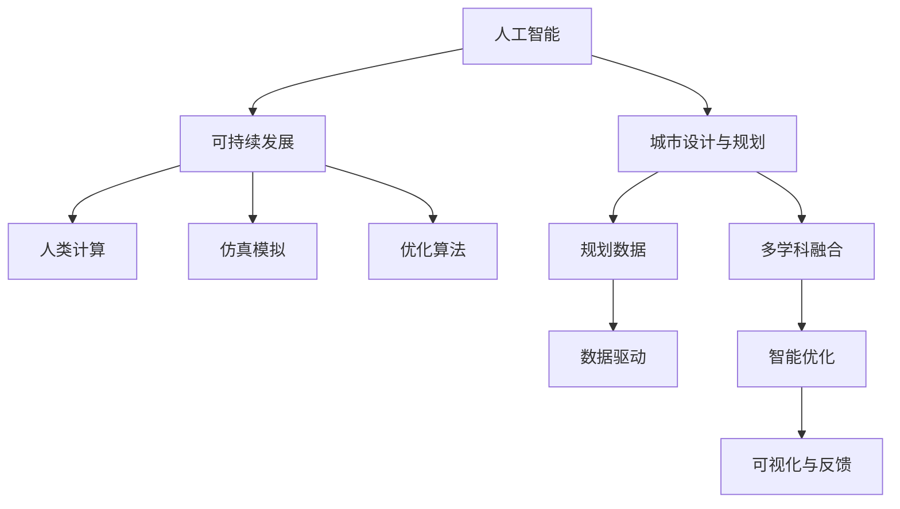

                 

# AI与人类计算：打造可持续发展的城市设计与规划

> 关键词：城市规划,人工智能,可持续发展,计算模型,仿真模拟,优化算法

## 1. 背景介绍

### 1.1 问题由来
随着城市化进程的加快，人口密集、资源短缺、环境恶化等问题日益凸显，城市设计与规划变得至关重要。当前的城市规划往往基于大量专家经验，缺乏数据驱动的科学依据。近年来，伴随着人工智能技术的迅猛发展，为城市规划提供了新的科学方法和工具。利用AI与人类计算（Human-Computer Collaborative Design），可以从海量数据中提取隐含的规律和模式，辅助城市规划师进行决策，从而实现城市设计的可持续性。

### 1.2 问题核心关键点
人类计算旨在利用机器学习、数据科学等AI技术，与城市规划师进行紧密合作，提升规划过程的科学性和精确度。关键点包括：
- 数据驱动：利用城市交通、环境、经济、社会等大数据，进行科学分析和预测。
- 多学科融合：将城市规划与AI、建筑学、环境科学、社会学等多个学科知识进行融合。
- 智能优化：借助算法优化技术，求解复杂的城市设计问题。
- 可视化与反馈：使用可视化工具实时展示规划效果，并获得人类专家的反馈。

## 2. 核心概念与联系

### 2.1 核心概念概述

为更好地理解AI与人类计算在城市设计与规划中的应用，本节将介绍几个关键概念：

- 人工智能（Artificial Intelligence, AI）：通过模拟人类智能，利用机器学习、深度学习等技术，实现对海量数据的处理和分析。
- 城市设计与规划（Urban Design and Planning）：利用城市规划理论和方法，结合AI技术，设计可持续发展的城市空间。
- 可持续发展（Sustainable Development）：追求城市发展的同时，保持生态平衡、社会公正和经济繁荣。
- 人类计算（Human-Computer Collaborative Design）：利用计算机辅助人类进行复杂计算和设计，实现人与机器的协同工作。
- 仿真模拟（Simulation Modeling）：使用计算机模拟城市运行情况，进行科学预测和规划。
- 优化算法（Optimization Algorithm）：利用算法求解复杂问题，实现城市资源的最优分配和空间布局的优化。

这些概念之间的逻辑关系可以通过以下Mermaid流程图来展示：



这个流程图展示了一系列关键概念及其之间的关系：

1. 人工智能通过大数据分析为城市设计与规划提供科学依据。
2. 可持续发展作为最终目标，指导城市设计与规划的具体实践。
3. 人类计算结合AI技术和人类智慧，实现复杂设计的协同工作。
4. 仿真模拟通过计算机模拟，辅助城市设计和规划决策。
5. 优化算法利用机器学习技术，求解城市设计中的复杂问题。

这些概念共同构成了AI与人类计算在城市设计与规划中的应用框架，使得人工智能技术在城市规划中发挥巨大的作用。

## 3. 核心算法原理 & 具体操作步骤
### 3.1 算法原理概述

AI与人类计算在城市设计与规划中的应用，本质上是通过AI技术辅助城市规划师进行数据驱动的决策制定。其核心算法包括数据处理、模式识别、仿真模拟和优化算法等。

- 数据处理：通过大数据技术，从城市交通、环境、经济、社会等多个维度收集数据，进行清洗和预处理，提取有用的特征。
- 模式识别：利用机器学习技术，识别数据中的模式和规律，辅助城市规划师进行分析和预测。
- 仿真模拟：通过计算机仿真技术，模拟城市运行情况，预测交通流量、环境质量、资源分布等关键指标，为规划提供科学依据。
- 优化算法：使用求解复杂问题的算法，如遗传算法、粒子群优化、蚁群算法等，优化城市空间布局和资源配置。

### 3.2 算法步骤详解

AI与人类计算在城市设计与规划中的具体操作步骤如下：

**Step 1: 数据收集与处理**
- 收集城市交通、环境、经济、社会等大数据，进行清洗和预处理，提取有用的特征。
- 使用数据处理算法，如缺失值处理、异常值检测、特征选择等，提高数据质量。

**Step 2: 模式识别与分析**
- 利用机器学习技术，对处理后的数据进行模式识别，提取关键特征和规律。
- 使用深度学习模型，如卷积神经网络（CNN）、循环神经网络（RNN）、长短期记忆网络（LSTM）等，进行特征提取和分类。

**Step 3: 仿真模拟与预测**
- 建立城市运行仿真模型，模拟城市交通、环境、资源等关键指标的动态变化。
- 使用蒙特卡罗模拟、Agent-based模拟等技术，预测不同政策或规划方案的效果。

**Step 4: 优化算法与决策**
- 根据预测结果和规划目标，选择合适的优化算法，如遗传算法、粒子群优化、蚁群算法等。
- 使用优化算法求解最优的城市空间布局和资源配置方案。

**Step 5: 可视化与反馈**
- 使用可视化工具，将优化结果和预测效果展示给城市规划师，辅助其进行决策。
- 实时收集城市规划师和市民的反馈，进一步优化设计方案。

### 3.3 算法优缺点

AI与人类计算在城市设计与规划中的应用具有以下优点：
1. 数据驱动：利用大数据分析，为城市设计与规划提供科学依据。
2. 精度高：机器学习、深度学习等技术，能够识别数据中的复杂模式和规律。
3. 高效性：计算机仿真和优化算法能够快速处理大规模的复杂问题。
4. 多学科融合：结合城市规划与AI、建筑学、环境科学等多个学科知识，提升规划的专业性。

同时，该方法也存在一些局限性：
1. 数据依赖：需要大量的高质量数据，数据的完整性和准确性对结果影响较大。
2. 技术门槛高：需要掌握机器学习、仿真模拟等高级技术，门槛较高。
3. 结果解释性不足：优化算法的结果可能难以解释，难以理解其内部工作机制。
4. 人类反馈不足：缺乏人类专家的深度参与和反馈，可能导致方案偏离实际需求。

尽管存在这些局限性，但就目前而言，AI与人类计算方法在城市设计与规划中已经展现出巨大的潜力，成为推动城市规划科学化和智能化的重要手段。

### 3.4 算法应用领域

AI与人类计算在城市设计与规划中的应用领域广泛，主要包括：

- 智能交通系统：通过交通流量预测和仿真，优化交通信号控制，提升交通效率。
- 城市环境规划：利用环境数据分析，预测环境质量变化，优化城市绿地、水体布局。
- 资源优化配置：通过经济数据分析，优化城市资源配置，提升资源利用率。
- 城市空间布局：利用仿真模拟和优化算法，优化城市空间结构，提升居住和办公环境的舒适度。
- 社会公平与公正：利用社会学数据分析，优化城市基础设施布局，促进社会公平与公正。

除了上述这些领域外，AI与人类计算技术还被创新性地应用到更多城市治理场景中，如智能能源管理、灾害应急响应、智慧园区等，为城市治理提供了新的技术手段。随着AI技术的发展，AI与人类计算方法将在更多领域得到应用，为城市智能化提供新的动力。

## 4. 数学模型和公式 & 详细讲解
### 4.1 数学模型构建

AI与人类计算在城市设计与规划中的应用，可以通过数学模型来描述和计算。本文将以交通流量预测为例，介绍相应的数学模型。

记交通流量为 $T$，影响因素为 $X=\{x_1, x_2, ..., x_n\}$，其中 $x_i$ 表示第 $i$ 个影响因素。假设 $T$ 与 $X$ 之间的关系为：

$$
T = f(X; \theta)
$$

其中 $f$ 表示一个非线性函数，$\theta$ 为模型参数。

### 4.2 公式推导过程

假设 $f$ 为多元线性回归模型，则有：

$$
T = \beta_0 + \beta_1 x_1 + \beta_2 x_2 + ... + \beta_n x_n + \epsilon
$$

其中 $\beta_i$ 为回归系数，$\epsilon$ 为误差项。

通过最小二乘法，可以估计模型参数：

$$
\hat{\beta} = \mathop{\arg\min}_{\beta} \sum_{i=1}^N (y_i - f(x_i; \beta))^2
$$

通过求解上述最优化问题，可以得到最优的回归系数 $\hat{\beta}$，进而得到交通流量的预测模型。

### 4.3 案例分析与讲解

假设某城市需要预测某个交叉口的交通流量 $T$，已知影响因素 $X=\{x_1, x_2, ..., x_n\}$，其中 $x_1$ 表示该交叉口的历史交通流量，$x_2$ 表示该交叉口的信号灯状态，$x_3$ 表示该交叉口周围的交通流量。通过收集历史数据，建立多元线性回归模型，可以预测未来一段时间内的交通流量变化。

假设模型参数估计结果为：

$$
\hat{\beta} = \begin{bmatrix} \hat{\beta}_0 \\ \hat{\beta}_1 \\ \hat{\beta}_2 \\ \hat{\beta}_3 \end{bmatrix}
$$

则该交叉口的交通流量预测模型为：

$$
T = \hat{\beta}_0 + \hat{\beta}_1 x_1 + \hat{\beta}_2 x_2 + \hat{\beta}_3 x_3 + \epsilon
$$

在实际应用中，通过实时采集交通流量和其他影响因素的数据，可以动态更新模型参数，实现交通流量的实时预测。

## 5. 项目实践：代码实例和详细解释说明
### 5.1 开发环境搭建

在进行AI与人类计算的实践前，我们需要准备好开发环境。以下是使用Python进行PyTorch和SciPy开发的环境配置流程：

1. 安装Anaconda：从官网下载并安装Anaconda，用于创建独立的Python环境。

2. 创建并激活虚拟环境：
```bash
conda create -n ai-env python=3.8 
conda activate ai-env
```

3. 安装PyTorch和SciPy：
```bash
conda install pytorch scipy
```

4. 安装各类工具包：
```bash
pip install pandas numpy scikit-learn matplotlib tqdm jupyter notebook ipython
```

完成上述步骤后，即可在`ai-env`环境中开始AI与人类计算的实践。

### 5.2 源代码详细实现

下面我们以城市交通流量预测为例，给出使用PyTorch和SciPy进行AI与人类计算的Python代码实现。

首先，定义数据处理和模型训练函数：

```python
import torch
import numpy as np
from torch import nn, optim
from sklearn.model_selection import train_test_split
from sklearn.metrics import mean_squared_error

class DataLoader:
    def __init__(self, data, batch_size):
        self.data = data
        self.batch_size = batch_size
        self.batch_index = 0
        self.num_batches = len(data) // batch_size
        
    def __iter__(self):
        while self.batch_index < self.num_batches:
            batch_data = self.data[self.batch_index*self.batch_size:(self.batch_index+1)*self.batch_size]
            self.batch_index += 1
            yield batch_data
            
    def __len__(self):
        return self.num_batches

class Model(nn.Module):
    def __init__(self):
        super(Model, self).__init__()
        self.layers = nn.Sequential(
            nn.Linear(n_features, 64),
            nn.ReLU(),
            nn.Linear(64, 1)
        )
    
    def forward(self, x):
        return self.layers(x)

# 数据处理函数
def preprocess_data(data):
    X = data[:, :-1]
    y = data[:, -1]
    X_train, X_test, y_train, y_test = train_test_split(X, y, test_size=0.2, random_state=42)
    return X_train, y_train, X_test, y_test

# 模型训练函数
def train_model(X_train, y_train, model, optimizer, criterion, num_epochs):
    model.train()
    for epoch in range(num_epochs):
        total_loss = 0
        for batch in DataLoader(X_train, batch_size=32):
            inputs, targets = torch.from_numpy(batch), torch.from_numpy(y_train[batch])
            optimizer.zero_grad()
            outputs = model(inputs)
            loss = criterion(outputs, targets)
            loss.backward()
            optimizer.step()
            total_loss += loss.item()
        print(f"Epoch {epoch+1}, Loss: {total_loss/len(X_train)}")
    
    model.eval()
    y_pred = model(X_test)
    mse = mean_squared_error(y_test, y_pred)
    return mse
```

然后，定义主函数和模型训练流程：

```python
import pandas as pd

# 加载数据
data = pd.read_csv('traffic_data.csv')

# 数据预处理
X_train, y_train, X_test, y_test = preprocess_data(data)

# 模型初始化
model = Model()
optimizer = optim.Adam(model.parameters(), lr=0.01)
criterion = nn.MSELoss()

# 模型训练
mse = train_model(X_train, y_train, model, optimizer, criterion, num_epochs=100)
print(f"Mean Squared Error: {mse:.4f}")
```

以上就是使用PyTorch和SciPy进行城市交通流量预测的完整代码实现。可以看到，通过定义数据处理函数和模型训练函数，结合主函数，我们即可实现一个简单的AI与人类计算应用。

### 5.3 代码解读与分析

让我们再详细解读一下关键代码的实现细节：

**DataLoader类**：
- `__init__`方法：初始化数据集、批大小和批索引，计算批数量。
- `__iter__`方法：按批读取数据，每次迭代返回一批数据。
- `__len__`方法：返回批数量。

**Model类**：
- `__init__`方法：定义模型结构，包括输入层、隐藏层和输出层。
- `forward`方法：定义前向传播过程，将输入数据传递到模型中。

**preprocess_data函数**：
- 定义数据预处理函数，包括数据拆分和归一化。

**train_model函数**：
- 定义模型训练函数，包括模型前向传播、损失计算、梯度更新和评估指标计算。

**主函数**：
- 加载数据，预处理数据，初始化模型和优化器，定义损失函数，进行模型训练和评估。

通过这些代码，我们实现了从数据加载、模型训练到模型评估的完整流程。这些代码展示了AI与人类计算在城市设计与规划中的应用，通过数据驱动和模型训练，实现了对城市交通流量的预测。

## 6. 实际应用场景
### 6.1 智能交通系统

智能交通系统利用AI与人类计算技术，通过对交通数据的实时分析，优化交通信号控制，提升交通效率。具体应用包括：

- 交通流量预测：利用时间序列分析和深度学习模型，预测交通流量变化，为信号控制提供依据。
- 拥堵预警：通过实时监控交通流量，预测拥堵区域和时间，提前发布预警信息。
- 动态路线规划：根据实时交通数据，动态调整路线规划，优化行车路线。

### 6.2 城市环境规划

城市环境规划利用AI与人类计算技术，通过对环境数据的分析和建模，优化城市绿地、水体布局，提升环境质量。具体应用包括：

- 环境质量预测：利用机器学习模型，预测空气质量、水质等关键指标的变化，为环境管理提供决策依据。
- 绿色空间规划：通过多模态数据分析，优化城市绿地、水体布局，提升生态系统的稳定性和可持续性。
- 资源配置优化：利用优化算法，优化城市资源的配置，提高资源利用效率。

### 6.3 社会公平与公正

社会公平与公正是城市规划的重要目标之一，AI与人类计算技术可以辅助实现这一目标。具体应用包括：

- 社会福利评估：通过大数据分析，评估社会福利政策的效果，优化政策制定。
- 住房分配优化：利用优化算法，优化住房分配方案，实现公平与效率的平衡。
- 公共服务规划：利用仿真模拟，优化公共服务设施的布局，提升服务质量和覆盖面。

### 6.4 未来应用展望

随着AI与人类计算技术的不断发展，未来在城市设计与规划中的应用将更加广泛和深入。以下是几个可能的未来应用方向：

- 多模态数据融合：将城市交通、环境、社会等不同模态的数据进行融合，提升规划的全面性和准确性。
- 智能决策支持系统：构建智能决策支持系统，辅助城市规划师进行科学决策，提升规划的专业性。
- 实时仿真与优化：利用实时仿真技术，动态优化城市设计方案，提升规划的灵活性和适应性。
- 跨领域应用：将AI与人类计算技术应用于更多领域，如能源管理、灾害应急响应、智慧园区等，实现城市智能化。

AI与人类计算技术在城市设计与规划中的应用，将推动城市规划向科学化、智能化方向发展，提升城市管理的效率和质量，促进城市的可持续发展。

## 7. 工具和资源推荐
### 7.1 学习资源推荐

为了帮助开发者系统掌握AI与人类计算在城市设计与规划中的应用，这里推荐一些优质的学习资源：

1. 《城市规划AI》系列博文：由城市规划领域的专家撰写，深入浅出地介绍了AI在城市规划中的应用，包括交通流量预测、环境质量监测、社会公平分析等。

2. 《机器学习实战》系列书籍：深入介绍机器学习算法和工具，包括数据预处理、特征工程、模型训练和评估等，适合初学者学习。

3. 《城市设计中的AI》在线课程：由著名城市规划专家开设的在线课程，涵盖城市设计与规划中的AI应用，包括交通仿真、环境建模等。

4. 《AI与城市规划》论文集：汇集了关于AI与城市规划研究的最新论文，涵盖多种AI技术在城市规划中的应用。

5. 《Urban Computing》期刊：Urban Computing期刊，专注于城市数据挖掘、分析和建模，涵盖多个领域的AI应用。

通过对这些资源的学习实践，相信你一定能够快速掌握AI与人类计算在城市设计与规划中的应用，并用于解决实际的规划问题。

### 7.2 开发工具推荐

高效的开发离不开优秀的工具支持。以下是几款用于AI与人类计算开发的常用工具：

1. PyTorch：基于Python的开源深度学习框架，灵活动态的计算图，适合快速迭代研究。大部分城市规划模型都有PyTorch版本的实现。

2. TensorFlow：由Google主导开发的开源深度学习框架，生产部署方便，适合大规模工程应用。同样有丰富的城市规划模型资源。

3. SciPy：用于科学计算和数据分析的Python库，提供各种数学函数和算法，适合处理大规模数据。

4. Weights & Biases：模型训练的实验跟踪工具，可以记录和可视化模型训练过程中的各项指标，方便对比和调优。与主流深度学习框架无缝集成。

5. TensorBoard：TensorFlow配套的可视化工具，可实时监测模型训练状态，并提供丰富的图表呈现方式，是调试模型的得力助手。

6. Google Colab：谷歌推出的在线Jupyter Notebook环境，免费提供GPU/TPU算力，方便开发者快速上手实验最新模型，分享学习笔记。

合理利用这些工具，可以显著提升AI与人类计算的开发效率，加快创新迭代的步伐。

### 7.3 相关论文推荐

AI与人类计算在城市设计与规划的发展源于学界的持续研究。以下是几篇奠基性的相关论文，推荐阅读：

1. "Data-driven Urban Planning: A Review and Future Directions"（数据驱动的城市规划：回顾与未来方向）：全面回顾了AI技术在城市规划中的应用，提出未来的发展方向。

2. "Integrating AI into Urban Planning: Challenges and Opportunities"（将AI融入城市规划：挑战与机遇）：探讨了AI技术在城市规划中的挑战和机遇，提出具体的解决方案。

3. "AI for Smart Urban Design: Applications and Challenges"（AI在智能城市设计中的应用与挑战）：介绍了AI技术在智能城市设计中的应用案例，包括智能交通、环境监测等。

4. "Urban Computing: A Survey"（城市计算：综述）：综述了城市计算领域的研究进展，涵盖多个AI应用方向。

5. "Urban Design through AI: Opportunities and Challenges"（通过AI进行城市设计：机会与挑战）：探讨了AI技术在城市设计中的应用，包括交通仿真、环境建模等。

这些论文代表了大语言模型微调技术的发展脉络。通过学习这些前沿成果，可以帮助研究者把握学科前进方向，激发更多的创新灵感。

## 8. 总结：未来发展趋势与挑战
### 8.1 研究成果总结

本文对AI与人类计算在城市设计与规划中的应用进行了全面系统的介绍。首先阐述了AI与人类计算在城市设计与规划中的研究背景和意义，明确了AI技术在提升城市规划科学性和智能性方面的独特价值。其次，从原理到实践，详细讲解了AI与人类计算的数学模型和关键步骤，给出了AI与人类计算任务开发的完整代码实例。同时，本文还广泛探讨了AI与人类计算在智能交通、城市环境规划、社会公平与公正等多个领域的应用前景，展示了AI技术在城市规划中带来的变革性影响。此外，本文精选了AI与人类计算技术的学习资源，力求为读者提供全方位的技术指引。

通过本文的系统梳理，可以看到，AI与人类计算技术在城市设计与规划中的应用正在成为城市规划的重要范式，极大地提升了城市规划的科学性和智能性，推动了城市规划的可持续发展。未来，随着AI技术的发展，AI与人类计算技术将进一步深入到更多城市规划场景中，为城市规划提供更高效、更智能的解决方案。

### 8.2 未来发展趋势

展望未来，AI与人类计算在城市设计与规划中的应用将呈现以下几个发展趋势：

1. 数据驱动的深度学习：利用深度学习技术，从海量数据中提取隐含的规律和模式，为城市规划提供更科学的决策依据。

2. 跨模态数据融合：将城市交通、环境、社会等不同模态的数据进行融合，提升规划的全面性和准确性。

3. 实时仿真与优化：利用实时仿真技术，动态优化城市设计方案，提升规划的灵活性和适应性。

4. 智能决策支持系统：构建智能决策支持系统，辅助城市规划师进行科学决策，提升规划的专业性。

5. 多学科融合：将城市规划与AI、建筑学、环境科学、社会学等多个学科知识进行融合，提升规划的综合性。

6. 开放性平台与工具：开发开放性平台和工具，提供标准化的数据接口和API，方便开发者进行城市规划应用开发。

以上趋势凸显了AI与人类计算技术的广阔前景。这些方向的探索发展，必将进一步提升城市规划的科学性和智能化，为构建智慧城市提供新的动力。

### 8.3 面临的挑战

尽管AI与人类计算技术在城市设计与规划中的应用已经取得了显著进展，但在迈向更加智能化、普适化应用的过程中，仍面临诸多挑战：

1. 数据质量与完整性：城市规划需要大量高质量、完整的数据，数据的缺失和不准确可能导致错误的规划决策。

2. 算法复杂性与可解释性：AI算法的复杂性较高，难以解释其内部工作机制，可能影响决策的透明性和可信度。

3. 技术与应用的融合：将AI技术与城市规划专业知识进行有效结合，仍需进一步探索和实践。

4. 隐私与安全：城市规划数据的隐私和安全问题不容忽视，需要制定合理的隐私保护措施。

5. 跨领域协同：AI与人类计算技术在多个领域的应用需要跨学科、跨部门的协同合作，面临协调管理的挑战。

尽管存在这些挑战，但随着技术的不断进步和应用实践的深入，相信AI与人类计算技术将在城市设计与规划中发挥越来越重要的作用。

### 8.4 研究展望

面向未来，AI与人类计算技术需要在以下几个方面进行深入研究和探索：

1. 多模态数据融合：将城市交通、环境、社会等不同模态的数据进行有效融合，提升规划的全面性和准确性。

2. 智能决策支持系统：构建智能决策支持系统，辅助城市规划师进行科学决策，提升规划的专业性。

3. 实时仿真与优化：利用实时仿真技术，动态优化城市设计方案，提升规划的灵活性和适应性。

4. 跨领域应用：将AI与人类计算技术应用于更多领域，如能源管理、灾害应急响应、智慧园区等，实现城市智能化。

5. 开放性平台与工具：开发开放性平台和工具，提供标准化的数据接口和API，方便开发者进行城市规划应用开发。

6. 理论与算法创新：不断探索新的AI算法和理论，提升城市规划的科学性和智能化。

这些研究方向将引领AI与人类计算技术在城市设计与规划中不断创新，为构建智慧城市提供新的动力。面向未来，AI与人类计算技术需要在理论与实践的相互推动下，不断拓展其应用范围，提升城市规划的科学性和智能性，为构建可持续发展的城市提供新的解决方案。

## 9. 附录：常见问题与解答

**Q1：如何构建城市数据驱动的城市设计与规划系统？**

A: 构建城市数据驱动的城市设计与规划系统，需要以下步骤：

1. 数据收集：收集城市交通、环境、经济、社会等大数据，进行清洗和预处理。

2. 数据建模：利用机器学习模型，提取数据中的模式和规律，构建数据驱动的决策模型。

3. 仿真模拟：利用计算机仿真技术，模拟城市运行情况，预测交通流量、环境质量、资源分布等关键指标。

4. 优化算法：使用求解复杂问题的算法，如遗传算法、粒子群优化、蚁群算法等，优化城市空间布局和资源配置。

5. 可视化与反馈：使用可视化工具，将优化结果和预测效果展示给城市规划师，辅助其进行决策。

6. 系统集成：将各个模块集成到一个统一的平台中，形成完整的数据驱动的城市设计与规划系统。

**Q2：AI与人类计算在城市设计与规划中的应用有哪些？**

A: AI与人类计算在城市设计与规划中的应用广泛，包括：

1. 智能交通系统：通过交通流量预测和仿真，优化交通信号控制，提升交通效率。

2. 城市环境规划：利用环境数据分析，预测环境质量变化，优化城市绿地、水体布局。

3. 社会公平与公正：利用社会学数据分析，优化住房分配方案，实现公平与效率的平衡。

4. 公共服务规划：利用仿真模拟，优化公共服务设施的布局，提升服务质量和覆盖面。

5. 能源管理：利用优化算法，优化城市能源的配置，提高能源利用效率。

6. 灾害应急响应：利用AI技术，预测灾害发生概率和影响范围，制定应急预案。

这些应用展示了AI与人类计算技术在城市设计与规划中的广泛应用前景。

**Q3：如何利用AI与人类计算进行城市设计与规划？**

A: 利用AI与人类计算进行城市设计与规划，需要以下步骤：

1. 数据收集与处理：收集城市交通、环境、经济、社会等大数据，进行清洗和预处理。

2. 模式识别与分析：利用机器学习模型，识别数据中的模式和规律，提取关键特征。

3. 仿真模拟与预测：利用计算机仿真技术，模拟城市运行情况，预测交通流量、环境质量、资源分布等关键指标。

4. 优化算法与决策：使用求解复杂问题的算法，优化城市空间布局和资源配置，辅助城市规划师进行科学决策。

5. 可视化与反馈：使用可视化工具，将优化结果和预测效果展示给城市规划师，辅助其进行决策。

6. 系统集成与部署：将各个模块集成到一个统一的平台中，形成完整的城市设计与规划系统。

这些步骤展示了AI与人类计算在城市设计与规划中的具体应用流程。

**Q4：AI与人类计算在城市设计与规划中的挑战有哪些？**

A: AI与人类计算在城市设计与规划中的应用面临以下挑战：

1. 数据质量与完整性：城市规划需要大量高质量、完整的数据，数据的缺失和不准确可能导致错误的规划决策。

2. 算法复杂性与可解释性：AI算法的复杂性较高，难以解释其内部工作机制，可能影响决策的透明性和可信度。

3. 技术与应用的融合：将AI技术与城市规划专业知识进行有效结合，仍需进一步探索和实践。

4. 隐私与安全：城市规划数据的隐私和安全问题不容忽视，需要制定合理的隐私保护措施。

5. 跨领域协同：AI与人类计算技术在多个领域的应用需要跨学科、跨部门的协同合作，面临协调管理的挑战。

尽管存在这些挑战，但随着技术的不断进步和应用实践的深入，相信AI与人类计算技术将在城市设计与规划中发挥越来越重要的作用。

**Q5：AI与人类计算在城市设计与规划中的优势有哪些？**

A: AI与人类计算在城市设计与规划中的优势包括：

1. 数据驱动：利用大数据分析，为城市设计与规划提供科学依据。

2. 精度高：机器学习、深度学习等技术，能够识别数据中的复杂模式和规律。

3. 高效性：计算机仿真和优化算法能够快速处理大规模的复杂问题。

4. 多学科融合：结合城市规划与AI、建筑学、环境科学等多个学科知识，提升规划的专业性。

这些优势展示了AI与人类计算技术在城市设计与规划中的独特价值，推动城市规划向科学化、智能化方向发展。

---

作者：禅与计算机程序设计艺术 / Zen and the Art of Computer Programming

