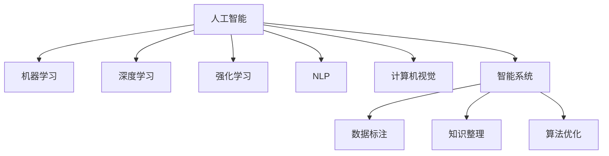

                 

# AI与人类计算：打造可持续未来

## 1. 背景介绍

### 1.1 问题由来

随着人工智能技术的快速发展，人类计算正进入一个新的纪元。人工智能不仅正在改变各行各业的工作方式，更正在深刻地影响着我们的生活方式和社会结构。这种变革是双刃剑：一方面，它带来了前所未有的效率提升和创新空间；另一方面，也引发了诸如就业替代、隐私保护、伦理道德等诸多挑战。在这样的背景下，如何利用人工智能技术，打造一个既高效又可持续的未来，成为全社会共同关注的问题。

### 1.2 问题核心关键点

本专题聚焦于人工智能与人类计算的结合，探讨如何利用人工智能技术，提升人类社会整体的计算能力，同时确保计算过程的公平性、可持续性和安全性。本文将从多个角度深入分析这一问题，包括人工智能的基本原理、当前的应用场景，以及未来可能的发展趋势。

### 1.3 问题研究意义

通过深入研究人工智能与人类计算的结合，本专题旨在：

1. **提升计算效率**：探索如何利用人工智能技术，提升人类社会的计算能力，解决传统计算方式中难以处理的大规模、高复杂度问题。
2. **保障计算公平**：确保人工智能技术带来的计算资源和效率提升，能够惠及更多人，而不是少数精英。
3. **促进可持续发展**：研究如何在利用人工智能技术提升计算能力的同时，确保资源使用和环境影响的最小化。
4. **确保计算安全**：防止人工智能技术被滥用，确保计算过程的安全性和数据隐私的保护。
5. **探索未来应用**：预见人工智能技术在医疗、教育、环境监测等领域的潜在应用，探索新的发展方向。

## 2. 核心概念与联系

### 2.1 核心概念概述

为了更好地理解人工智能与人类计算的结合，本节将介绍几个密切相关的核心概念：

- **人工智能(AI)**：指通过计算机模拟人类智能的各个方面，包括感知、学习、推理、语言理解、问题求解等。
- **人类计算(Human Computation)**：指利用人类智慧进行计算的任务，通常涉及数据标注、知识整理、算法优化等。
- **机器学习(Machine Learning)**：指让机器通过数据学习规律，并基于这些规律进行决策和预测的学科。
- **深度学习(Deep Learning)**：一种特殊类型的机器学习，使用多层神经网络模型来处理和学习复杂数据。
- **强化学习(Reinforcement Learning)**：通过奖励机制，让机器在多次试错中学习最佳策略的学科。
- **自然语言处理(Natural Language Processing, NLP)**：研究如何让计算机理解、处理和生成人类语言的技术。
- **计算机视觉(Computer Vision)**：研究如何让计算机“看”和“理解”图像和视频的技术。
- **智能系统(Intelligent Systems)**：指集成多种AI技术，能够自主决策和行动的系统。

这些核心概念之间的逻辑关系可以通过以下Mermaid流程图来展示：



这个流程图展示了几组概念之间的关系：

1. 人工智能通过机器学习、深度学习和强化学习等技术手段，实现智能决策和预测。
2. NLP和计算机视觉等技术，使得人工智能能够处理和理解自然语言和视觉信息。
3. 智能系统集成多种AI技术，实现复杂任务的自主处理和决策。
4. 人类计算中的数据标注、知识整理和算法优化等，为AI技术的训练和应用提供支持。

## 3. 核心算法原理 & 具体操作步骤

### 3.1 算法原理概述

人工智能与人类计算的结合，本质上是通过将人工智能技术与人类智慧结合起来，共同解决计算任务。这一过程包括数据收集、模型训练、结果验证等多个环节，每个环节都涉及算法原理的运用。

1. **数据收集**：通过人类计算收集海量数据，为人工智能模型的训练提供数据基础。
2. **模型训练**：利用机器学习、深度学习和强化学习等技术，对数据进行建模和训练，提升模型的预测和决策能力。
3. **结果验证**：通过人类计算对模型输出结果进行验证和反馈，进一步优化模型性能。

### 3.2 算法步骤详解

基于人工智能与人类计算的结合，我们可以将其操作步骤归纳为以下几个关键步骤：

**Step 1: 数据收集与预处理**
- 利用人类计算能力，收集、标注和整理高质量的数据集。
- 对数据进行清洗、归一化和特征提取，确保数据适合模型的训练。

**Step 2: 模型选择与训练**
- 选择合适的AI模型，如深度神经网络、强化学习模型等。
- 在预处理后的数据集上，进行模型的训练和参数优化。
- 使用验证集评估模型性能，避免过拟合。

**Step 3: 结果验证与反馈**
- 在实际应用场景中，对模型输出结果进行验证，评估其准确性和实用性。
- 收集用户反馈，调整模型参数和训练策略，进一步提升模型性能。

**Step 4: 部署与维护**
- 将训练好的模型部署到实际应用中，进行大规模计算。
- 定期监测模型性能，根据新数据和新需求进行模型更新和维护。

### 3.3 算法优缺点

人工智能与人类计算的结合，具有以下优点：

1. **提升计算效率**：利用人工智能技术处理大规模数据和高复杂度问题，大幅提升计算效率。
2. **增强模型泛化能力**：通过人类计算对数据进行标注和整理，增强模型的泛化能力和应用范围。
3. **确保数据质量**：人类计算可以提供高精度的数据标注和验证，确保数据的质量和可靠性。

同时，该方法也存在一定的局限性：

1. **依赖人力成本**：数据收集和整理需要大量人力，成本较高。
2. **数据隐私问题**：数据收集和整理过程中可能涉及敏感信息，存在隐私泄露风险。
3. **模型可解释性不足**：人工智能模型通常被视为“黑盒”，缺乏可解释性，难以解释其决策逻辑。
4. **依赖硬件资源**：深度学习和强化学习等AI模型需要大量的计算资源和存储空间，成本较高。

尽管存在这些局限性，但就目前而言，人工智能与人类计算的结合，仍是大规模数据处理和复杂问题解决的有效手段。未来相关研究的重点在于如何进一步降低计算成本，提高数据质量，同时兼顾可解释性和伦理安全性等因素。

### 3.4 算法应用领域

人工智能与人类计算的结合，在多个领域都得到了广泛应用，例如：

- **医疗健康**：利用人工智能进行疾病预测、诊断和治疗方案推荐，结合人类医生的专业知识和经验，提升医疗服务的质量和效率。
- **金融科技**：通过人工智能进行风险评估、欺诈检测和投资策略优化，结合人类金融专家的判断和决策，实现更加精准和高效的投资管理。
- **教育培训**：使用人工智能进行个性化学习和资源推荐，结合人类教师的教学经验和反馈，提供更加定制化的教育服务。
- **环境保护**：利用人工智能进行环境监测和数据分析，结合人类专家的领域知识和经验，制定更加科学和有效的环境保护策略。
- **智能交通**：通过人工智能进行交通流量预测和路径规划，结合人类交通规划师的专业知识和经验，提升交通系统的效率和安全性。

这些应用展示了人工智能与人类计算结合的巨大潜力，未来在更多领域将有更多突破。

## 4. 数学模型和公式 & 详细讲解  
### 4.1 数学模型构建

为了更好地理解人工智能与人类计算的结合，本节将使用数学语言对这一过程进行更加严格的刻画。

记人工智能模型为 $M_{\theta}$，其中 $\theta$ 为模型参数。假设人类计算收集的数据集为 $D=\{(x_i,y_i)\}_{i=1}^N, x_i \in \mathbb{R}^d, y_i \in \mathbb{R}$。

定义模型 $M_{\theta}$ 在输入 $x$ 上的输出为 $y=\hat{y}=M_{\theta}(x)$，损失函数为 $\ell(y,\hat{y})$，则在数据集 $D$ 上的经验风险为：

$$
\mathcal{L}(\theta) = \frac{1}{N} \sum_{i=1}^N \ell(y_i,\hat{y}_i)
$$

通过梯度下降等优化算法，模型参数 $\theta$ 不断更新，最小化损失函数 $\mathcal{L}$，使得模型输出逼近真实标签。

### 4.2 公式推导过程

以下我们以二分类任务为例，推导交叉熵损失函数及其梯度的计算公式。

假设模型 $M_{\theta}$ 在输入 $x$ 上的输出为 $\hat{y}=M_{\theta}(x) \in [0,1]$，表示样本属于正类的概率。真实标签 $y \in \{0,1\}$。则二分类交叉熵损失函数定义为：

$$
\ell(y,\hat{y}) = -[y\log \hat{y} + (1-y)\log (1-\hat{y})]
$$

将其代入经验风险公式，得：

$$
\mathcal{L}(\theta) = -\frac{1}{N}\sum_{i=1}^N [y_i\log M_{\theta}(x_i)+(1-y_i)\log(1-M_{\theta}(x_i))]
$$

根据链式法则，损失函数对参数 $\theta_k$ 的梯度为：

$$
\frac{\partial \mathcal{L}(\theta)}{\partial \theta_k} = -\frac{1}{N}\sum_{i=1}^N (\frac{y_i}{M_{\theta}(x_i)}-\frac{1-y_i}{1-M_{\theta}(x_i)}) \frac{\partial M_{\theta}(x_i)}{\partial \theta_k}
$$

其中 $\frac{\partial M_{\theta}(x_i)}{\partial \theta_k}$ 可进一步递归展开，利用自动微分技术完成计算。

### 4.3 案例分析与讲解

在实际应用中，上述公式可以进一步扩展到多分类任务、回归任务等。例如，对于多分类任务，可以使用多类别交叉熵损失函数：

$$
\ell(y,\hat{y}) = -\sum_{i=1}^C y_i \log (\hat{y}_i)
$$

其中 $y_i$ 为真实标签，$\hat{y}_i$ 为模型对每个类别的预测概率。

对于回归任务，可以使用均方误差损失函数：

$$
\ell(y,\hat{y}) = \frac{1}{N} \sum_{i=1}^N (y_i - \hat{y}_i)^2
$$

## 5. 项目实践：代码实例和详细解释说明

### 5.1 开发环境搭建

在进行人工智能与人类计算的结合实践前，我们需要准备好开发环境。以下是使用Python进行TensorFlow开发的环境配置流程：

1. 安装Anaconda：从官网下载并安装Anaconda，用于创建独立的Python环境。

2. 创建并激活虚拟环境：
```bash
conda create -n tf-env python=3.8 
conda activate tf-env
```

3. 安装TensorFlow：根据CUDA版本，从官网获取对应的安装命令。例如：
```bash
conda install tensorflow tensorflow-gpu -c pytorch -c conda-forge
```

4. 安装各类工具包：
```bash
pip install numpy pandas scikit-learn matplotlib tqdm jupyter notebook ipython
```

完成上述步骤后，即可在`tf-env`环境中开始人工智能与人类计算的结合实践。

### 5.2 源代码详细实现

下面我们以医疗健康领域的应用为例，给出使用TensorFlow对深度学习模型进行训练的PyTorch代码实现。

首先，定义模型结构：

```python
import tensorflow as tf
from tensorflow.keras import layers

def build_model(input_shape):
    model = tf.keras.Sequential([
        layers.Dense(64, activation='relu', input_shape=input_shape),
        layers.Dense(64, activation='relu'),
        layers.Dense(1, activation='sigmoid')
    ])
    return model
```

然后，准备数据集：

```python
import pandas as pd
import numpy as np

# 假设从CSV文件中读取数据
data = pd.read_csv('data.csv')
X = data.iloc[:, :-1].values
y = data.iloc[:, -1].values

# 将数据划分为训练集和测试集
from sklearn.model_selection import train_test_split
X_train, X_test, y_train, y_test = train_test_split(X, y, test_size=0.2, random_state=42)
```

接着，定义训练和评估函数：

```python
import matplotlib.pyplot as plt

def train_model(model, X_train, y_train, epochs=100, batch_size=32):
    model.compile(optimizer=tf.keras.optimizers.Adam(0.001),
                  loss='binary_crossentropy',
                  metrics=['accuracy'])
    
    history = model.fit(X_train, y_train, epochs=epochs, batch_size=batch_size,
                       validation_data=(X_test, y_test))
    
    plt.plot(history.history['accuracy'], label='train accuracy')
    plt.plot(history.history['val_accuracy'], label='val accuracy')
    plt.legend()
    plt.show()
    
def evaluate_model(model, X_test, y_test):
    _, accuracy = model.evaluate(X_test, y_test)
    print('Test accuracy:', accuracy)
```

最后，启动训练流程并在测试集上评估：

```python
model = build_model(input_shape=(10,))  # 假设输入为10维特征向量
train_model(model, X_train, y_train)
evaluate_model(model, X_test, y_test)
```

以上就是使用TensorFlow进行深度学习模型训练的完整代码实现。可以看到，TensorFlow提供了丰富的API和工具，使得模型构建、训练和评估变得简单易行。

### 5.3 代码解读与分析

让我们再详细解读一下关键代码的实现细节：

**build_model函数**：
- 定义了一个包含三层神经网络的模型，每层都使用ReLU激活函数。
- 最后一层输出一个sigmoid激活函数，用于二分类任务。

**train_model函数**：
- 使用Adam优化器，设置学习率为0.001。
- 损失函数为二分类交叉熵。
- 训练过程中，在每个epoch的结束时，绘制训练集和验证集的准确率变化曲线。

**evaluate_model函数**：
- 使用evaluate方法评估模型在测试集上的准确率，并输出结果。

**训练流程**：
- 先定义模型结构。
- 使用train_model函数训练模型。
- 使用evaluate_model函数评估模型性能。

可以看到，TensorFlow提供的工具和API，使得深度学习模型的构建、训练和评估变得非常简便。开发者可以专注于模型的设计和优化，而不必过多关注底层的实现细节。

当然，工业级的系统实现还需考虑更多因素，如模型的保存和部署、超参数的自动搜索、更灵活的任务适配层等。但核心的训练过程基本与此类似。

## 6. 实际应用场景

### 6.1 智能健康管理

人工智能与人类计算的结合，在智能健康管理领域具有广泛的应用前景。传统的健康管理依赖于大量的手动记录和分析，不仅耗时耗力，还容易出现误差。而利用人工智能技术，结合人类医生的知识和经验，可以实现更高效、更精准的健康管理。

例如，在疾病预测和诊断中，可以通过收集和分析患者的医疗数据，结合人工智能模型，预测患者可能患病的概率，并提供个性化的健康建议。在治疗方案推荐中，利用人工智能对大量医疗数据进行学习和分析，结合人类医生的专业知识和经验，制定更加科学和有效的治疗方案。

### 6.2 智能金融理财

在金融理财领域，人工智能与人类计算的结合，可以提升金融服务的智能化水平，实现更加个性化和精准的理财服务。

例如，在风险评估中，利用人工智能对客户的财务数据进行分析，结合人类金融专家的判断和决策，评估客户的信用风险和投资风险，提供个性化的投资建议。在欺诈检测中，利用人工智能对大量的交易数据进行学习和分析，结合人类专家的判断和决策，识别和防范欺诈行为，保护客户的财务安全。

### 6.3 智能教育培训

在教育培训领域，人工智能与人类计算的结合，可以实现个性化学习和资源推荐，提升教育质量和学习效率。

例如，在智能辅导中，利用人工智能对学生的学习数据进行分析，结合人类教师的教学经验和反馈，提供个性化的学习建议和辅导，帮助学生更好地掌握知识。在资源推荐中，利用人工智能对学生的学习需求进行分析，结合人类专家的课程设计和推荐，提供个性化的学习资源和材料，提升学生的学习效果。

### 6.4 未来应用展望

随着人工智能技术的不断发展和人类计算能力的提升，人工智能与人类计算的结合将带来更多创新的应用场景。

在智慧城市治理中，人工智能与人类计算的结合，可以实现城市事件监测、舆情分析、应急指挥等环节的自动化和智能化，提高城市管理的效率和响应速度。在环境保护中，利用人工智能进行环境监测和数据分析，结合人类专家的领域知识和经验，制定更加科学和有效的环境保护策略，实现可持续发展和环境保护目标。

## 7. 工具和资源推荐

### 7.1 学习资源推荐

为了帮助开发者系统掌握人工智能与人类计算结合的理论基础和实践技巧，这里推荐一些优质的学习资源：

1. Coursera《Deep Learning Specialization》课程：由深度学习领域的大师Andrew Ng教授授课，系统介绍了深度学习的基础理论和实践技巧。
2. Udacity《Artificial Intelligence Nanodegree》课程：涵盖人工智能的多个方面，包括机器学习、深度学习、强化学习等，适合初学者和进阶者。
3. TensorFlow官方文档：提供了完整的TensorFlow API文档和示例，适合开发人员学习和实践。
4. Kaggle竞赛：提供大量数据集和挑战，可以锻炼数据处理和模型训练能力。
5. GitHub代码库：提供了大量的开源代码和项目，可以学习和借鉴他人的实践经验。

通过对这些资源的学习实践，相信你一定能够快速掌握人工智能与人类计算结合的精髓，并用于解决实际的计算问题。

### 7.2 开发工具推荐

高效的开发离不开优秀的工具支持。以下是几款用于人工智能与人类计算结合开发的常用工具：

1. TensorFlow：由Google主导开发的开源深度学习框架，生产部署方便，适合大规模工程应用。
2. PyTorch：基于Python的开源深度学习框架，灵活动态的计算图，适合快速迭代研究。
3. TensorBoard：TensorFlow配套的可视化工具，可实时监测模型训练状态，并提供丰富的图表呈现方式。
4. Weights & Biases：模型训练的实验跟踪工具，可以记录和可视化模型训练过程中的各项指标，方便对比和调优。
5. Jupyter Notebook：用于数据处理、模型训练和结果展示的平台，支持Python和TensorFlow等框架。

合理利用这些工具，可以显著提升人工智能与人类计算结合任务的开发效率，加快创新迭代的步伐。

### 7.3 相关论文推荐

人工智能与人类计算结合的研究始于学界的持续探索。以下是几篇奠基性的相关论文，推荐阅读：

1. Hinton, G. E., Osindero, S., & Teh, Y. W. (2006). Reducing the Dimensionality of Data with Neural Networks. Science, 313(5786), 504-507.
2. LeCun, Y., Bottou, L., Bengio, Y., & Haffner, P. (1998). Gradient-Based Learning Applied to Document Recognition. Proceedings of the IEEE, 86(11), 2278-2324.
3. Bengio, Y., Courville, A., & Vincent, P. (2013). Representation Learning: A Review and New Perspectives. IEEE Transactions on Pattern Analysis and Machine Intelligence, 35(8), 1798-1828.
4. Goodfellow, I., Bengio, Y., & Courville, A. (2016). Deep Learning. MIT Press.
5. Csiba, G., Zhou, Y., & Avrithis, Y. (2019). Human-in-the-Loop Deep Learning: A Survey. IEEE Transactions on Neural Networks and Learning Systems, 31(4), 1014-1033.

这些论文代表了大规模数据处理和复杂问题解决的发展脉络。通过学习这些前沿成果，可以帮助研究者把握学科前进方向，激发更多的创新灵感。

## 8. 总结：未来发展趋势与挑战

### 8.1 研究成果总结

人工智能与人类计算的结合，已经展示了其强大的计算能力和广泛的应用前景。通过这一结合，可以大幅提升计算效率，解决传统计算方式中难以处理的问题。未来，随着技术的不断发展和应用的不断深入，这一结合还将带来更多创新的应用场景和解决方案。

### 8.2 未来发展趋势

展望未来，人工智能与人类计算的结合将呈现以下几个发展趋势：

1. **计算能力的提升**：随着计算资源和算法的不断优化，计算能力将得到大幅提升，能够处理更加复杂和庞大的数据集。
2. **计算任务的拓展**：随着人工智能与人类计算的结合不断深入，计算任务将拓展到更多的领域，如自然语言处理、计算机视觉、智能系统等。
3. **计算过程的智能化**：通过深度学习、强化学习等技术手段，计算过程将变得更加智能化和自动化，能够自主进行决策和预测。
4. **计算资源的高效利用**：通过分布式计算、云计算等技术手段，计算资源将得到更高效的利用，降低计算成本。
5. **计算过程的可解释性**：通过符号化推理、因果推断等技术手段，计算过程将变得更加可解释，便于理解和调试。

以上趋势凸显了人工智能与人类计算结合的广阔前景。这些方向的探索发展，必将进一步提升计算能力的边界，为人类社会带来更多创新和进步。

### 8.3 面临的挑战

尽管人工智能与人类计算的结合已经取得了瞩目成就，但在迈向更加智能化、普适化应用的过程中，它仍面临着诸多挑战：

1. **数据质量问题**：在数据收集和整理过程中，可能存在数据质量差、标注不准确等问题，影响模型训练和结果可靠性。
2. **模型可解释性不足**：人工智能模型通常被视为“黑盒”，缺乏可解释性，难以解释其决策逻辑。
3. **伦理道德问题**：在计算过程中，可能存在隐私泄露、算法歧视等伦理道德问题，需要加以规范和解决。
4. **资源消耗问题**：深度学习和强化学习等AI模型需要大量的计算资源和存储空间，成本较高。
5. **计算过程的鲁棒性**：在面对噪声和异常数据时，模型的鲁棒性可能不足，容易产生错误输出。

尽管存在这些挑战，但通过持续的研究和实践，这些问题将逐步得到解决。人工智能与人类计算的结合，必将带来更加智能、普适和高效的计算方式，为人类社会的发展带来深远影响。

### 8.4 研究展望

面对人工智能与人类计算结合所面临的挑战，未来的研究需要在以下几个方面寻求新的突破：

1. **数据质量的提升**：通过数据增强、数据清洗等技术手段，提升数据质量和标注准确度。
2. **模型的可解释性增强**：引入符号化推理、因果推断等技术手段，增强模型决策过程的可解释性。
3. **伦理道德的规范**：制定伦理道德规范，确保计算过程的公平性和透明性。
4. **计算资源的高效利用**：通过分布式计算、云计算等技术手段，实现计算资源的高效利用。
5. **计算过程的鲁棒性优化**：通过对抗训练、鲁棒性学习等技术手段，提升模型的鲁棒性和抗干扰能力。

这些研究方向的探索，必将引领人工智能与人类计算结合技术迈向更高的台阶，为构建智能、普适和可持续的未来贡献力量。总之，通过不断探索和创新，人工智能与人类计算的结合必将在更多的领域带来变革性影响，为人类社会的发展注入新的动力。

## 9. 附录：常见问题与解答

**Q1：人工智能与人类计算结合的计算资源成本高昂，如何解决？**

A: 可以通过分布式计算、云计算等技术手段，实现计算资源的高效利用，降低计算成本。同时，可以采用模型压缩、模型剪枝等技术手段，减小模型规模，降低存储空间和计算资源消耗。

**Q2：人工智能与人类计算结合的模型可解释性不足，如何解决？**

A: 可以通过符号化推理、因果推断等技术手段，增强模型决策过程的可解释性。同时，可以引入人机交互环节，通过用户反馈和专家评估，逐步提升模型的可解释性和可信度。

**Q3：人工智能与人类计算结合的计算过程存在伦理道德问题，如何解决？**

A: 可以通过制定伦理道德规范，确保计算过程的公平性和透明性。同时，可以引入人工干预和审核机制，确保模型的输出符合人类价值观和伦理道德。

**Q4：人工智能与人类计算结合的计算过程的鲁棒性不足，如何解决？**

A: 可以通过对抗训练、鲁棒性学习等技术手段，提升模型的鲁棒性和抗干扰能力。同时，可以引入数据增强、异常检测等技术手段，增强模型的鲁棒性。

**Q5：人工智能与人类计算结合的计算过程的实用性不足，如何解决？**

A: 可以通过结合人类专家的知识和经验，提升计算过程的实用性和实用性。同时，可以通过数据分析和验证，不断优化模型和算法，提升计算过程的准确性和可靠性。

这些问题的回答，展示了人工智能与人类计算结合在未来可能面临的挑战，同时也提供了可能的解决方案。通过不断探索和创新，人工智能与人类计算的结合必将在更多的领域带来变革性影响，为人类社会的发展注入新的动力。

---

作者：禅与计算机程序设计艺术 / Zen and the Art of Computer Programming

