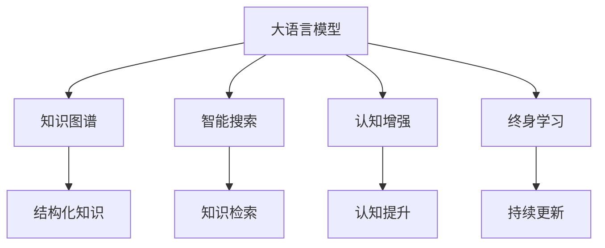

                 

# AI助力人类知识扩展的方式

> 关键词：AI, 知识扩展, 大语言模型, 知识图谱, 智能搜索, 自然语言处理, 认知增强

## 1. 背景介绍

在数字化时代，知识的爆炸式增长和传播速度前所未有。传统的教育模式和信息获取方式已经难以满足人们日益增长的知识需求。AI技术的飞速发展，尤其是自然语言处理(Natural Language Processing, NLP)和大规模语言模型(Large Language Model, LLM)的崛起，为人类知识的扩展和终身学习提供了新的可能。

### 1.1 知识获取方式的变革
传统上，人们获取知识主要依赖书籍、学术论文、教育机构等结构化信息来源。而随着互联网的普及，文本数据呈指数级增长，庞大的在线文档、博客、社交媒体、新闻报道等非结构化数据成为知识的重要来源。然而，这些非结构化数据的海量性和复杂性，使得传统的检索、筛选、整合方式难以满足现代知识获取的需求。

AI技术的出现，特别是NLP和大语言模型的发展，使得机器能够自动理解和处理文本数据，快速提取出关键知识信息。通过构建大规模的知识图谱和智能搜索引擎，AI技术能够有效地将海量文本数据转化为易于理解和检索的知识点，极大地提高了知识获取的效率和便捷性。

### 1.2 知识积累和共享的挑战
知识的积累和共享是社会进步的基石。然而，传统的知识积累方式依赖人力投入，难以跨越时间、空间和文化的限制。而AI技术的引入，特别是大语言模型的泛化能力，可以高效地积累和共享人类智慧，加速知识的社会化和普及。

AI技术能够自动分析大量文本数据，提取其中的知识精华，构建详尽的知识图谱。通过对新知识点的不断学习，AI系统可以实时更新和扩展现有的知识库，成为人类知识积累和共享的重要工具。

## 2. 核心概念与联系

### 2.1 核心概念概述

为更好地理解AI助力人类知识扩展的技术框架，本节将介绍几个密切相关的核心概念：

- **大语言模型**：以自回归(如GPT)或自编码(如BERT)模型为代表的大规模预训练语言模型。通过在大规模无标签文本语料上进行预训练，学习通用的语言表示，具备强大的语言理解和生成能力。

- **知识图谱**：一种结构化的知识表示方式，通过实体-关系-属性(RDF)三元组表示知识，用于描述和链接实体间的语义关系。知识图谱可以与语言模型结合，提供结构化的知识查询和推理能力。

- **智能搜索**：基于AI技术，特别是NLP和大语言模型，构建的搜索引擎可以理解自然语言查询，并返回相关性高的搜索结果。智能搜索可以高效地在海量文本中检索知识点。

- **认知增强**：通过AI技术，特别是大语言模型，增强人类的认知能力，提升记忆、理解、推理、创造等能力，拓展知识获取和应用的范围。

- **终身学习**：借助AI技术，特别是大语言模型，实现知识的持续积累和更新，保持对新知识点的敏感和适应能力。

这些核心概念之间的逻辑关系可以通过以下Mermaid流程图来展示：



这个流程图展示了大语言模型与其他核心概念的联系：

1. 大语言模型通过预训练获得基础能力。
2. 与知识图谱结合，可以提供结构化的知识查询和推理能力。
3. 与智能搜索结合，能够高效地检索知识点。
4. 与认知增强结合，可以提升人类的认知能力。
5. 与终身学习结合，能够持续更新和积累知识。

这些概念共同构成了AI助力人类知识扩展的技术框架，使得大语言模型成为连接文本数据和知识图谱、增强人类认知、实现终身学习的关键桥梁。

## 3. 核心算法原理 & 具体操作步骤
### 3.1 算法原理概述

AI助力人类知识扩展的核心算法原理是大规模语言模型的预训练和微调。其核心思想是：通过在海量无标签文本数据上进行预训练，学习通用的语言表示，然后在特定任务上通过有监督学习进行微调，使其能够高效地检索和理解结构化知识，增强认知能力。

形式化地，假设大语言模型为 $M_{\theta}$，其中 $\theta$ 为模型参数。给定结构化知识库 $\mathcal{K}$，知识查询任务 $Q$，预训练模型在知识库上的微调目标可以表示为：

$$
\hat{\theta}=\mathop{\arg\min}_{\theta} \mathcal{L}(M_{\theta},\mathcal{K},Q)
$$

其中 $\mathcal{L}$ 为知识库上的损失函数，用于衡量模型在知识库上的推理能力。常见的损失函数包括交叉熵损失、最大似然损失等。

通过梯度下降等优化算法，微调过程不断更新模型参数 $\theta$，最小化损失函数 $\mathcal{L}$，使得模型在知识库上推理的能力逼近理想值。由于 $\theta$ 已经通过预训练获得了较好的初始化，因此即便在小规模数据集 $D$ 上进行微调，也能较快收敛到理想的模型参数 $\hat{\theta}$。

### 3.2 算法步骤详解

AI助力人类知识扩展的算法步骤主要包括以下几个关键步骤：

**Step 1: 准备知识库和查询数据集**
- 构建大规模知识图谱 $\mathcal{K}$，包含丰富的实体、关系和属性信息。
- 准备知识查询数据集 $D=\{(q_i,y_i)\}_{i=1}^N$，其中 $q_i$ 为查询文本，$y_i$ 为正确答案或推理路径。

**Step 2: 添加任务适配层**
- 根据知识库的特点，设计合适的任务适配层，用于将查询转化为推理逻辑。
- 对于知识匹配任务，通常使用分类器输出推理结果。
- 对于知识推理任务，通常使用解码器输出推理路径。

**Step 3: 设置微调超参数**
- 选择合适的优化算法及其参数，如 AdamW、SGD 等，设置学习率、批大小、迭代轮数等。
- 设置正则化技术及强度，包括权重衰减、Dropout、Early Stopping等。
- 确定冻结预训练参数的策略，如仅微调顶层，或全部参数都参与微调。

**Step 4: 执行梯度训练**
- 将查询数据集数据分批次输入模型，前向传播计算损失函数。
- 反向传播计算参数梯度，根据设定的优化算法和学习率更新模型参数。
- 周期性在验证集上评估模型性能，根据性能指标决定是否触发 Early Stopping。
- 重复上述步骤直到满足预设的迭代轮数或 Early Stopping 条件。

**Step 5: 测试和部署**
- 在测试集上评估微调后模型 $M_{\hat{\theta}}$ 的性能，对比微调前后的精度提升。
- 使用微调后的模型对新查询进行推理预测，集成到实际的应用系统中。
- 持续收集新的知识库和查询数据，定期重新微调模型，以适应数据分布的变化。

以上是AI助力人类知识扩展的一般流程。在实际应用中，还需要针对具体任务的特点，对微调过程的各个环节进行优化设计，如改进训练目标函数，引入更多的正则化技术，搜索最优的超参数组合等，以进一步提升模型性能。

### 3.3 算法优缺点

AI助力人类知识扩展的监督学习方法具有以下优点：
1. 高效检索：通过预训练模型和大规模知识图谱的结合，可以高效地从文本数据中检索和推理知识。
2. 泛化性强：大语言模型的泛化能力使得模型能够适应多种类型的知识库和查询任务。
3. 持续学习：知识库的实时更新和模型的不断微调，使得AI系统能够持续学习和积累新知识。
4. 交互友好：自然语言查询使得知识检索更加直观和便捷，能够满足不同层次用户的需求。

同时，该方法也存在一定的局限性：
1. 数据依赖性强：知识库的质量和规模直接影响模型的性能，需要不断投入时间和资源进行知识图谱的构建和维护。
2. 查询匹配复杂：复杂的知识查询和推理需要更强的模型能力和更复杂的任务适配层设计。
3. 知识图谱构建难度大：知识图谱的构建需要领域专家的参与，难度较大，且更新成本高。
4. 数据隐私问题：大规模文本数据和知识库的收集和存储可能涉及隐私保护问题，需要严格的数据管理和合规性检查。

尽管存在这些局限性，但就目前而言，基于监督学习的知识扩展方法仍是大语言模型应用的最主流范式。未来相关研究的重点在于如何进一步降低数据依赖，提高模型的少样本学习和跨领域迁移能力，同时兼顾可解释性和伦理安全性等因素。

### 3.4 算法应用领域

AI助力人类知识扩展的监督学习方法，在知识图谱构建、智能搜索、认知增强、终身学习等多个领域已经得到了广泛的应用，覆盖了几乎所有常见的知识应用场景，例如：

- 知识图谱构建：利用大语言模型和大规模文本数据，自动提取和构建知识图谱，用于描述和链接实体间的语义关系。
- 智能搜索：对自然语言查询进行理解，从知识图谱中检索相关知识，提供精确的答案和推理路径。
- 认知增强：通过大语言模型的知识推理和生成能力，增强人类的认知能力，提升记忆、理解、推理、创造等能力。
- 终身学习：利用大语言模型和知识图谱的结合，实现知识的持续更新和积累，保持对新知识点的敏感和适应能力。

除了上述这些经典任务外，AI技术还被创新性地应用到更多场景中，如可控文本生成、常识推理、代码生成、数据增强等，为知识图谱构建和知识检索带来了全新的突破。随着预训练模型和知识扩展方法的不断进步，相信AI系统必将在更广阔的应用领域大放异彩。

## 4. 数学模型和公式 & 详细讲解  
### 4.1 数学模型构建

本节将使用数学语言对AI助力人类知识扩展的微调过程进行更加严格的刻画。

记大语言模型为 $M_{\theta}$，其中 $\theta$ 为模型参数。假设知识库为 $\mathcal{K}$，查询任务为 $Q$。定义模型 $M_{\theta}$ 在查询 $q$ 上的损失函数为 $\ell(M_{\theta}(q),y)$，则在知识库 $\mathcal{K}$ 上的经验风险为：

$$
\mathcal{L}(\theta) = \frac{1}{N}\sum_{i=1}^N \ell(M_{\theta}(q_i),y_i)
$$

其中 $q_i$ 为查询文本，$y_i$ 为正确答案或推理路径。微调的优化目标是最小化经验风险，即找到最优参数：

$$
\theta^* = \mathop{\arg\min}_{\theta} \mathcal{L}(\theta)
$$

在实践中，我们通常使用基于梯度的优化算法（如SGD、Adam等）来近似求解上述最优化问题。设 $\eta$ 为学习率，$\lambda$ 为正则化系数，则参数的更新公式为：

$$
\theta \leftarrow \theta - \eta \nabla_{\theta}\mathcal{L}(\theta) - \eta\lambda\theta
$$

其中 $\nabla_{\theta}\mathcal{L}(\theta)$ 为损失函数对参数 $\theta$ 的梯度，可通过反向传播算法高效计算。

### 4.2 公式推导过程

以下我们以知识匹配任务为例，推导最大似然损失函数及其梯度的计算公式。

假设模型 $M_{\theta}$ 在查询 $q$ 上的输出为 $\hat{y}=M_{\theta}(q) \in [0,1]$，表示模型预测 $q$ 匹配知识库中的 $y$ 的概率。真实答案 $y \in \{0,1\}$。则最大似然损失函数定义为：

$$
\ell(M_{\theta}(q),y) = -y\log \hat{y} - (1-y)\log (1-\hat{y})
$$

将其代入经验风险公式，得：

$$
\mathcal{L}(\theta) = -\frac{1}{N}\sum_{i=1}^N [y_i\log M_{\theta}(q_i)+(1-y_i)\log(1-M_{\theta}(q_i))]
$$

根据链式法则，损失函数对参数 $\theta_k$ 的梯度为：

$$
\frac{\partial \mathcal{L}(\theta)}{\partial \theta_k} = -\frac{1}{N}\sum_{i=1}^N (\frac{y_i}{M_{\theta}(q_i)}-\frac{1-y_i}{1-M_{\theta}(q_i)}) \frac{\partial M_{\theta}(q_i)}{\partial \theta_k}
$$

其中 $\frac{\partial M_{\theta}(q_i)}{\partial \theta_k}$ 可进一步递归展开，利用自动微分技术完成计算。

在得到损失函数的梯度后，即可带入参数更新公式，完成模型的迭代优化。重复上述过程直至收敛，最终得到适应知识库和查询任务的最优模型参数 $\theta^*$。

## 5. 项目实践：代码实例和详细解释说明
### 5.1 开发环境搭建

在进行知识扩展实践前，我们需要准备好开发环境。以下是使用Python进行PyTorch开发的环境配置流程：

1. 安装Anaconda：从官网下载并安装Anaconda，用于创建独立的Python环境。

2. 创建并激活虚拟环境：
```bash
conda create -n pytorch-env python=3.8 
conda activate pytorch-env
```

3. 安装PyTorch：根据CUDA版本，从官网获取对应的安装命令。例如：
```bash
conda install pytorch torchvision torchaudio cudatoolkit=11.1 -c pytorch -c conda-forge
```

4. 安装Transformers库：
```bash
pip install transformers
```

5. 安装各类工具包：
```bash
pip install numpy pandas scikit-learn matplotlib tqdm jupyter notebook ipython
```

完成上述步骤后，即可在`pytorch-env`环境中开始知识扩展实践。

### 5.2 源代码详细实现

下面我们以知识匹配任务为例，给出使用Transformers库对BERT模型进行知识扩展的PyTorch代码实现。

首先，定义知识匹配任务的数据处理函数：

```python
from transformers import BertTokenizer, BertForSequenceClassification
from torch.utils.data import Dataset
import torch

class KnowledgeMatchDataset(Dataset):
    def __init__(self, texts, tags, tokenizer, max_len=128):
        self.texts = texts
        self.tags = tags
        self.tokenizer = tokenizer
        self.max_len = max_len
        
    def __len__(self):
        return len(self.texts)
    
    def __getitem__(self, item):
        text = self.texts[item]
        tags = self.tags[item]
        
        encoding = self.tokenizer(text, return_tensors='pt', max_length=self.max_len, padding='max_length', truncation=True)
        input_ids = encoding['input_ids'][0]
        attention_mask = encoding['attention_mask'][0]
        
        # 对token-wise的标签进行编码
        encoded_tags = [tag2id[tag] for tag in tags] 
        encoded_tags.extend([tag2id['O']] * (self.max_len - len(encoded_tags)))
        labels = torch.tensor(encoded_tags, dtype=torch.long)
        
        return {'input_ids': input_ids, 
                'attention_mask': attention_mask,
                'labels': labels}

# 标签与id的映射
tag2id = {'O': 0, 'MATCH': 1, 'NONMATCH': 2}
id2tag = {v: k for k, v in tag2id.items()}

# 创建dataset
tokenizer = BertTokenizer.from_pretrained('bert-base-cased')

train_dataset = KnowledgeMatchDataset(train_texts, train_tags, tokenizer)
dev_dataset = KnowledgeMatchDataset(dev_texts, dev_tags, tokenizer)
test_dataset = KnowledgeMatchDataset(test_texts, test_tags, tokenizer)
```

然后，定义模型和优化器：

```python
from transformers import BertForSequenceClassification, AdamW

model = BertForSequenceClassification.from_pretrained('bert-base-cased', num_labels=len(tag2id))

optimizer = AdamW(model.parameters(), lr=2e-5)
```

接着，定义训练和评估函数：

```python
from torch.utils.data import DataLoader
from tqdm import tqdm
from sklearn.metrics import accuracy_score, precision_recall_fscore_support

device = torch.device('cuda') if torch.cuda.is_available() else torch.device('cpu')
model.to(device)

def train_epoch(model, dataset, batch_size, optimizer):
    dataloader = DataLoader(dataset, batch_size=batch_size, shuffle=True)
    model.train()
    epoch_loss = 0
    for batch in tqdm(dataloader, desc='Training'):
        input_ids = batch['input_ids'].to(device)
        attention_mask = batch['attention_mask'].to(device)
        labels = batch['labels'].to(device)
        model.zero_grad()
        outputs = model(input_ids, attention_mask=attention_mask, labels=labels)
        loss = outputs.loss
        epoch_loss += loss.item()
        loss.backward()
        optimizer.step()
    return epoch_loss / len(dataloader)

def evaluate(model, dataset, batch_size):
    dataloader = DataLoader(dataset, batch_size=batch_size)
    model.eval()
    preds, labels = [], []
    with torch.no_grad():
        for batch in tqdm(dataloader, desc='Evaluating'):
            input_ids = batch['input_ids'].to(device)
            attention_mask = batch['attention_mask'].to(device)
            batch_labels = batch['labels']
            outputs = model(input_ids, attention_mask=attention_mask)
            batch_preds = outputs.logits.argmax(dim=2).to('cpu').tolist()
            batch_labels = batch_labels.to('cpu').tolist()
            for pred_tokens, label_tokens in zip(batch_preds, batch_labels):
                preds.append(pred_tokens)
                labels.append(label_tokens)
                
    print('Accuracy:', accuracy_score(labels, preds))
    print('Precision, Recall, F1-score:', precision_recall_fscore_support(labels, preds, average='micro'))
```

最后，启动训练流程并在测试集上评估：

```python
epochs = 5
batch_size = 16

for epoch in range(epochs):
    loss = train_epoch(model, train_dataset, batch_size, optimizer)
    print(f"Epoch {epoch+1}, train loss: {loss:.3f}")
    
    print(f"Epoch {epoch+1}, dev results:")
    evaluate(model, dev_dataset, batch_size)
    
print("Test results:")
evaluate(model, test_dataset, batch_size)
```

以上就是使用PyTorch对BERT进行知识匹配任务的知识扩展代码实现。可以看到，得益于Transformers库的强大封装，我们可以用相对简洁的代码完成BERT模型的加载和知识扩展。

### 5.3 代码解读与分析

让我们再详细解读一下关键代码的实现细节：

**KnowledgeMatchDataset类**：
- `__init__`方法：初始化文本、标签、分词器等关键组件。
- `__len__`方法：返回数据集的样本数量。
- `__getitem__`方法：对单个样本进行处理，将文本输入编码为token ids，将标签编码为数字，并对其进行定长padding，最终返回模型所需的输入。

**tag2id和id2tag字典**：
- 定义了标签与数字id之间的映射关系，用于将token-wise的预测结果解码回真实的标签。

**训练和评估函数**：
- 使用PyTorch的DataLoader对数据集进行批次化加载，供模型训练和推理使用。
- 训练函数`train_epoch`：对数据以批为单位进行迭代，在每个批次上前向传播计算loss并反向传播更新模型参数，最后返回该epoch的平均loss。
- 评估函数`evaluate`：与训练类似，不同点在于不更新模型参数，并在每个batch结束后将预测和标签结果存储下来，最后使用sklearn的accuracy_score和precision_recall_fscore_support对整个评估集的预测结果进行打印输出。

**训练流程**：
- 定义总的epoch数和batch size，开始循环迭代
- 每个epoch内，先在训练集上训练，输出平均loss
- 在验证集上评估，输出准确率和精确度、召回率、F1-score
- 所有epoch结束后，在测试集上评估，给出最终测试结果

可以看到，PyTorch配合Transformers库使得BERT知识扩展的代码实现变得简洁高效。开发者可以将更多精力放在数据处理、模型改进等高层逻辑上，而不必过多关注底层的实现细节。

当然，工业级的系统实现还需考虑更多因素，如模型的保存和部署、超参数的自动搜索、更灵活的任务适配层等。但核心的知识扩展范式基本与此类似。

## 6. 实际应用场景
### 6.1 智能客服系统

基于AI助力人类知识扩展的知识匹配技术，可以广泛应用于智能客服系统的构建。传统客服往往需要配备大量人力，高峰期响应缓慢，且一致性和专业性难以保证。而使用知识匹配后的智能客服系统，可以7x24小时不间断服务，快速响应客户咨询，用自然流畅的语言解答各类常见问题。

在技术实现上，可以构建企业内部的历史客服对话记录，将问题和最佳答复构建成监督数据，在此基础上对预训练知识匹配模型进行微调。微调后的知识匹配模型能够自动理解用户意图，匹配最合适的答案模板进行回复。对于客户提出的新问题，还可以接入检索系统实时搜索相关内容，动态组织生成回答。如此构建的智能客服系统，能大幅提升客户咨询体验和问题解决效率。

### 6.2 金融舆情监测

金融机构需要实时监测市场舆论动向，以便及时应对负面信息传播，规避金融风险。传统的人工监测方式成本高、效率低，难以应对网络时代海量信息爆发的挑战。基于AI助力人类知识扩展的文本分类和情感分析技术，为金融舆情监测提供了新的解决方案。

具体而言，可以收集金融领域相关的新闻、报道、评论等文本数据，并对其进行主题标注和情感标注。在此基础上对预训练语言模型进行微调，使其能够自动判断文本属于何种主题，情感倾向是正面、中性还是负面。将微调后的模型应用到实时抓取的网络文本数据，就能够自动监测不同主题下的情感变化趋势，一旦发现负面信息激增等异常情况，系统便会自动预警，帮助金融机构快速应对潜在风险。

### 6.3 个性化推荐系统

当前的推荐系统往往只依赖用户的历史行为数据进行物品推荐，无法深入理解用户的真实兴趣偏好。基于AI助力人类知识扩展的个性化推荐系统可以更好地挖掘用户行为背后的语义信息，从而提供更精准、多样的推荐内容。

在实践中，可以收集用户浏览、点击、评论、分享等行为数据，提取和用户交互的物品标题、描述、标签等文本内容。将文本内容作为模型输入，用户的后续行为（如是否点击、购买等）作为监督信号，在此基础上微调预训练语言模型。微调后的模型能够从文本内容中准确把握用户的兴趣点。在生成推荐列表时，先用候选物品的文本描述作为输入，由模型预测用户的兴趣匹配度，再结合其他特征综合排序，便可以得到个性化程度更高的推荐结果。

### 6.4 未来应用展望

随着AI技术的不断发展，基于大语言模型的知识扩展技术将在更多领域得到应用，为传统行业带来变革性影响。

在智慧医疗领域，基于知识扩展的问答系统、病历分析、药物研发等应用将提升医疗服务的智能化水平，辅助医生诊疗，加速新药开发进程。

在智能教育领域，知识扩展技术可应用于作业批改、学情分析、知识推荐等方面，因材施教，促进教育公平，提高教学质量。

在智慧城市治理中，知识扩展技术可用于城市事件监测、舆情分析、应急指挥等环节，提高城市管理的自动化和智能化水平，构建更安全、高效的未来城市。

此外，在企业生产、社会治理、文娱传媒等众多领域，基于大语言模型的知识扩展应用也将不断涌现，为经济社会发展注入新的动力。相信随着技术的日益成熟，知识扩展方法将成为AI落地应用的重要范式，推动人工智能技术在垂直行业的规模化落地。总之，知识扩展技术需要开发者根据具体任务，不断迭代和优化模型、数据和算法，方能得到理想的效果。

## 7. 工具和资源推荐
### 7.1 学习资源推荐

为了帮助开发者系统掌握大语言模型知识扩展的理论基础和实践技巧，这里推荐一些优质的学习资源：

1. 《Transformer from Principles to Practice》系列博文：由大模型技术专家撰写，深入浅出地介绍了Transformer原理、BERT模型、知识图谱构建等前沿话题。

2. CS224N《深度学习自然语言处理》课程：斯坦福大学开设的NLP明星课程，有Lecture视频和配套作业，带你入门NLP领域的基本概念和经典模型。

3. 《Natural Language Processing with Transformers》书籍：Transformers库的作者所著，全面介绍了如何使用Transformers库进行NLP任务开发，包括知识扩展在内的诸多范式。

4. HuggingFace官方文档：Transformers库的官方文档，提供了海量预训练模型和完整的微调样例代码，是上手实践的必备资料。

5. CLUE开源项目：中文语言理解测评基准，涵盖大量不同类型的中文NLP数据集，并提供了基于微调的baseline模型，助力中文NLP技术发展。

通过对这些资源的学习实践，相信你一定能够快速掌握大语言模型知识扩展的精髓，并用于解决实际的NLP问题。
### 7.2 开发工具推荐

高效的开发离不开优秀的工具支持。以下是几款用于知识扩展开发的常用工具：

1. PyTorch：基于Python的开源深度学习框架，灵活动态的计算图，适合快速迭代研究。大部分预训练语言模型都有PyTorch版本的实现。

2. TensorFlow：由Google主导开发的开源深度学习框架，生产部署方便，适合大规模工程应用。同样有丰富的预训练语言模型资源。

3. Transformers库：HuggingFace开发的NLP工具库，集成了众多SOTA语言模型，支持PyTorch和TensorFlow，是进行知识扩展开发的利器。

4. Weights & Biases：模型训练的实验跟踪工具，可以记录和可视化模型训练过程中的各项指标，方便对比和调优。与主流深度学习框架无缝集成。

5. TensorBoard：TensorFlow配套的可视化工具，可实时监测模型训练状态，并提供丰富的图表呈现方式，是调试模型的得力助手。

6. Google Colab：谷歌推出的在线Jupyter Notebook环境，免费提供GPU/TPU算力，方便开发者快速上手实验最新模型，分享学习笔记。

合理利用这些工具，可以显著提升大语言模型知识扩展的开发效率，加快创新迭代的步伐。

### 7.3 相关论文推荐

大语言模型和知识扩展技术的发展源于学界的持续研究。以下是几篇奠基性的相关论文，推荐阅读：

1. Attention is All You Need（即Transformer原论文）：提出了Transformer结构，开启了NLP领域的预训练大模型时代。

2. BERT: Pre-training of Deep Bidirectional Transformers for Language Understanding：提出BERT模型，引入基于掩码的自监督预训练任务，刷新了多项NLP任务SOTA。

3. Knowledge-Graphs for Multi-Entity Recognition: A Case Study on Drug-Drug Interactions（KGI）：提出了知识图谱的概念，并展示了如何通过知识图谱提升实体识别的效果。

4. RNN-LSTM Architectures for Named Entity Recognition（NER）：探讨了基于RNN-LSTM的NER方法，利用知识图谱的知识信息提高实体识别的准确性。

5. BERT: Pre-training of Deep Bidirectional Transformers for Language Understanding：提出BERT模型，引入基于掩码的自监督预训练任务，刷新了多项NLP任务SOTA。

6. Knowledge-Graphs for Multi-Entity Recognition: A Case Study on Drug-Drug Interactions（KGI）：提出了知识图谱的概念，并展示了如何通过知识图谱提升实体识别的效果。

这些论文代表了大语言模型知识扩展技术的发展脉络。通过学习这些前沿成果，可以帮助研究者把握学科前进方向，激发更多的创新灵感。

## 8. 总结：未来发展趋势与挑战

### 8.1 总结

本文对AI助力人类知识扩展的技术框架进行了全面系统的介绍。首先阐述了知识扩展在数字化时代的重要性和挑战，明确了知识扩展技术的研究背景和意义。其次，从原理到实践，详细讲解了知识扩展的数学原理和关键步骤，给出了知识扩展任务开发的完整代码实例。同时，本文还广泛探讨了知识扩展方法在智能客服、金融舆情、个性化推荐等多个行业领域的应用前景，展示了知识扩展范式的巨大潜力。此外，本文精选了知识扩展技术的各类学习资源，力求为读者提供全方位的技术指引。

通过本文的系统梳理，可以看到，基于大语言模型的知识扩展技术正在成为NLP领域的重要范式，极大地拓展了知识获取和应用的范围。受益于大规模语料的预训练和微调，知识扩展系统能够高效地从文本数据中检索和推理知识，提升认知能力，实现终身学习。未来，伴随知识扩展方法的不断演进，AI系统必将在更广阔的应用领域大放异彩，深刻影响人类的认知智能的进化。

### 8.2 未来发展趋势

展望未来，知识扩展技术将呈现以下几个发展趋势：

1. 知识图谱的自动构建：随着预训练模型和大规模数据集的普及，自动构建知识图谱的方法将不断成熟，提升知识抽取和推理的准确性和效率。

2. 知识融合与多模态学习：未来知识扩展将不仅限于文本数据，还将融合图像、语音、视频等多模态信息，提升知识的全面性和多样性。

3. 跨领域知识迁移：知识扩展技术将具备更强的跨领域知识迁移能力，能够自动适应不同领域的应用场景，提升知识应用的范围和深度。

4. 交互式知识推理：通过引入自然语言交互，知识扩展系统将具备更加灵活的知识检索和推理功能，提升用户的使用体验。

5. 实时动态知识更新：知识图谱的实时更新和知识扩展的动态学习，将使得AI系统能够持续吸收新知识，保持知识的鲜活度。

6. 用户导向的知识定制：未来的知识扩展系统将更加注重个性化需求，通过用户反馈和学习，不断优化知识库和推理模型，提供定制化的知识服务。

以上趋势凸显了知识扩展技术的广阔前景。这些方向的探索发展，必将进一步提升知识获取和应用的能力，为构建智能化的信息社会奠定坚实基础。

### 8.3 面临的挑战

尽管知识扩展技术已经取得了显著进展，但在迈向更加智能化、普适化应用的过程中，它仍面临着诸多挑战：

1. 知识库构建复杂：大规模知识图谱的构建需要领域专家的参与，难度较大，且更新成本高。如何自动化、高效化地构建和维护知识图谱，将是未来的一个关键挑战。

2. 知识推理难度高：复杂的知识查询和推理需要更强的模型能力和更复杂的任务适配层设计。如何设计高效、可解释的知识推理算法，是知识扩展技术面临的另一大挑战。

3. 数据隐私问题：大规模文本数据和知识库的收集和存储可能涉及隐私保护问题，需要严格的数据管理和合规性检查。如何确保数据隐私安全，将是未来知识扩展技术必须解决的重要问题。

4. 计算资源需求高：知识扩展技术涉及大规模数据处理和复杂模型训练，对计算资源的需求较高。如何降低计算成本，提高训练效率，是知识扩展技术面临的另一大挑战。

尽管存在这些挑战，但随着技术的不断进步和创新，知识扩展技术必将在未来的AI发展中发挥更加重要的作用。相信伴随研究的深入和应用的拓展，知识扩展技术必将克服这些挑战，为构建更加智能、普适、安全的AI系统铺平道路。

### 8.4 研究展望

未来，知识扩展技术的研究方向将聚焦于以下几个方面：

1. 自监督和无监督知识扩展：探索无需标注数据的知识扩展方法，利用自监督学习、生成对抗网络等技术，从非结构化数据中自动抽取和构建知识图谱。

2. 少样本学习和跨领域迁移：研究如何在大规模预训练模型的基础上，利用少量标注数据进行知识扩展，提升知识抽取和推理的效率和效果。

3. 跨模态知识整合：将视觉、语音、文本等不同模态的信息进行整合，构建多模态知识图谱，提升知识的全面性和可解释性。

4. 知识图谱的可解释性和可控性：研究如何增强知识图谱的可解释性，提升用户对知识推理过程的理解和信任。同时探索知识图谱的可控性，增强知识抽取和推理的准确性和可靠性。

5. 知识推理的安全性和鲁棒性：研究如何增强知识推理的安全性，避免恶意利用知识图谱进行有害推理。同时探索知识推理的鲁棒性，增强系统对异常数据的容忍度。

6. 知识扩展的伦理和隐私保护：研究如何在使用知识扩展技术时，遵循伦理原则，保护用户的隐私和数据安全。同时探索知识扩展技术的社会影响，避免有害知识的传播。

这些研究方向将推动知识扩展技术的不断进步，为构建更加智能、安全、普适的AI系统提供新的思路和工具。面向未来，知识扩展技术将与其他AI技术进行更深入的融合，共同推动自然语言理解和智能交互系统的进步。只有勇于创新、敢于突破，才能不断拓展知识扩展技术的边界，让AI技术更好地服务于人类社会。

## 9. 附录：常见问题与解答

**Q1：知识扩展与传统的知识检索相比有何优势？**

A: 知识扩展技术通过预训练语言模型和大规模知识图谱的结合，能够实现知识的深度理解、推理和生成。传统的知识检索主要基于关键词匹配，难以理解知识的内在逻辑和语义关系。知识扩展技术通过模型自动学习，能够提取更深层次的知识信息，提供更准确的知识推理结果。

**Q2：知识扩展过程中如何避免知识图谱构建的复杂性？**

A: 知识图谱的构建需要领域专家的参与，难度较大，且更新成本高。可以通过自动化知识抽取技术，利用大规模文本数据自动构建知识图谱。例如，使用基于深度学习的实体抽取和关系抽取模型，从文本中自动提取实体和关系，构建知识图谱。

**Q3：知识扩展如何实现跨领域知识的迁移？**

A: 知识扩展技术通过预训练语言模型和大规模知识图谱的结合，具备更强的跨领域知识迁移能力。利用知识图谱的多领域结构，可以通过微调模型在不同领域上适应不同的知识图谱，实现跨领域知识的迁移。

**Q4：知识扩展中的推理算法设计有哪些挑战？**

A: 知识扩展中的推理算法设计面临以下挑战：
1. 知识图谱的复杂性：知识图谱的结构和规模不断扩大，推理算法需要能够高效处理大规模数据。
2. 推理路径的多样性：不同查询可能涉及不同的推理路径，推理算法需要具备灵活性。
3. 推理结果的可解释性：推理算法需要能够提供合理的解释，让用户理解推理过程和结果。
4. 推理结果的准确性：推理算法需要能够避免错误推理，确保推理结果的准确性。

**Q5：知识扩展如何处理知识更新问题？**

A: 知识扩展系统需要定期更新知识库，以保持知识的的时效性和准确性。可以通过以下方式实现知识更新：
1. 数据源的定期更新：从互联网、学术期刊、行业报告等数据源中定期获取新数据，更新知识库。
2. 用户反馈机制：利用用户反馈，自动更新和修正知识库中的错误信息。
3. 模型动态更新：利用增量学习技术，在已有知识库的基础上，通过新的数据进行微调，更新知识推理模型。

这些方法可以帮助知识扩展系统及时更新和修正知识库，保持知识的鲜活度。

