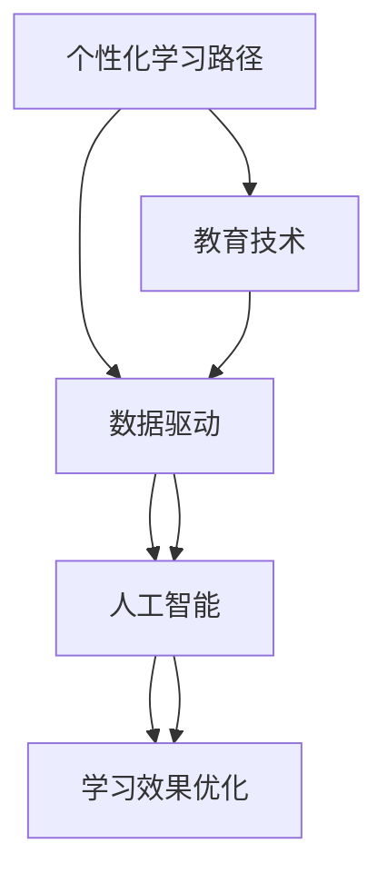

                 

# AI在个性化学习路径设计中的应用：优化学习效果

> 关键词：个性化学习路径, AI算法, 数据驱动, 学习效果优化, 教育技术, 学生认知分析

## 1. 背景介绍

在现代教育技术飞速发展的背景下，如何设计高效、个性化的学习路径，优化学习效果，成为教育领域的热点话题。传统的基于规则的学习路径设计方式，难以兼顾个体差异，容易产生学习障碍。而借助人工智能(AI)技术，能够对学生的学习行为进行动态分析，及时调整学习路径，提升学习效果。

AI在个性化学习路径设计中的应用，集中体现在对学习数据的深入挖掘和高效利用上。通过构建学习行为分析模型，AI可以对学生的知识水平、兴趣偏好、认知特点等多维度进行刻画，从而推荐最适合的学习资源和路径，以实现个性化学习。

## 2. 核心概念与联系

### 2.1 核心概念概述

为更好地理解AI在个性化学习路径设计中的应用，本节将介绍几个密切相关的核心概念：

- 个性化学习路径(Customized Learning Path)：针对学生的认知特点和兴趣偏好，动态调整学习内容和顺序，以提升学习效果的过程。
- 人工智能(Artificial Intelligence, AI)：通过模拟人类智能行为，实现数据分析、模式识别、预测等功能的计算技术。
- 数据驱动(Data-Driven)：基于大数据分析和学习模型的决策过程，而非凭经验或直觉。
- 学习效果优化(Optimizing Learning Effectiveness)：通过智能分析和学习行为调整，实现学习效率和质量的提升。
- 教育技术(Educational Technology, EdTech)：将AI、大数据、云计算等现代信息技术应用到教育中的新技术。

这些概念之间的逻辑关系可以通过以下Mermaid流程图来展示：



这个流程图展示了个性化学习路径的核心概念及其之间的关系：

1. 个性化学习路径通过教育技术进行数据驱动，从而实现人工智能辅助的优化。
2. 数据驱动依赖于AI技术，进行深入的数据分析和挖掘。
3. 学习效果优化通过AI实现，提升个性化学习路径的效果。

这些概念共同构成了个性化学习路径设计的技术基础，使其能够高效地适配每个学生的独特需求，实现个性化的学习体验。

## 3. 核心算法原理 & 具体操作步骤
### 3.1 算法原理概述

基于AI的个性化学习路径设计，主要基于以下几个关键原理：

- **学习行为分析**：通过分析学生的学习行为数据（如点击、浏览、完成时间等），构建学生认知图谱，识别其认知特点和偏好。
- **学习路径优化**：构建机器学习模型，根据学生认知图谱，动态调整学习内容和顺序，推荐最优路径。
- **学习效果评估**：通过评估模型的预测效果，不断优化模型参数和路径设计，确保个性化学习路径的实际效果。

这些原理的实现，依赖于一系列先进的算法和工具，主要包括：

- **深度学习**：用于构建和训练学习行为分析模型，识别学生的学习特征。
- **强化学习**：用于设计学习路径优化算法，通过奖励机制引导学生沿着最优路径学习。
- **自然语言处理(NLP)**：用于分析学习日志和评估学生的学习效果，提供文字反馈。

### 3.2 算法步骤详解

基于AI的个性化学习路径设计，主要包括以下几个关键步骤：

**Step 1: 数据收集与预处理**

- 收集学生的学习行为数据，包括点击、浏览、完成时间、答题情况等。
- 对数据进行清洗、去重、标准化等预处理，以保证数据质量。

**Step 2: 学习行为分析**

- 利用深度学习模型（如LSTM、GRU等）构建学习行为分析模型，对学生的学习数据进行分析。
- 识别学生的认知特点（如学习能力、学习风格、认知负荷等），生成学生认知图谱。

**Step 3: 学习路径设计**

- 利用强化学习算法（如Q-learning、Deep Q-Network等）设计学习路径优化模型，确定每个阶段的学习内容和顺序。
- 根据学生认知图谱，动态调整路径中的资源推荐和顺序安排，生成个性化学习路径。

**Step 4: 学习效果评估**

- 通过评估模型的预测效果，使用各种评估指标（如准确率、召回率、F1-score等）评估模型的性能。
- 根据评估结果不断调整模型参数和路径设计，优化个性化学习路径。

**Step 5: 学习路径执行**

- 将个性化学习路径实时推送给学生，监控学习过程。
- 根据学习过程中的反馈信息，及时调整路径设计，提供个性化学习支持。

### 3.3 算法优缺点

基于AI的个性化学习路径设计，具有以下优点：

1. **高效精准**：通过数据驱动和AI技术，能够高效地识别和适应学生的学习特点，推荐最适合的学习资源。
2. **动态调整**：能够实时监控和调整学习路径，确保学习效果最大化。
3. **提升体验**：提供个性化的学习体验，提升学生的学习兴趣和参与度。

同时，该方法也存在以下局限性：

1. **数据依赖**：需要大量的学习行为数据进行模型训练，数据不足可能影响模型的准确性。
2. **模型复杂**：算法设计复杂，涉及多个技术领域，对开发团队的要求较高。
3. **资源消耗**：需要较大的计算资源进行模型训练和优化，可能对教育机构造成一定的成本压力。
4. **隐私保护**：涉及学生的个人信息，需要严格的数据保护措施，以防止隐私泄露。

尽管存在这些局限性，但就目前而言，基于AI的个性化学习路径设计仍是个性化教育的重要手段。未来相关研究的重点在于如何进一步降低数据需求，提高模型效率，同时兼顾隐私保护和用户友好性等因素。

### 3.4 算法应用领域

基于AI的个性化学习路径设计，已经在多个教育领域得到了广泛应用，例如：

- **K-12教育**：为中小学生提供个性化的学习资源和路径，提高学习效果。
- **职业教育**：为技能培训和职业认证课程设计个性化学习路径，提升学习效率。
- **成人教育**：为继续教育、终身学习等场景提供个性化学习支持。
- **远程教育**：在在线教育平台提供个性化的学习路径和资源推荐，提升远程学习效果。

除了上述这些应用场景外，AI个性化学习路径还在智能教学系统、教育内容推荐、学习分析等多个方向上得到了创新应用，为教育技术的发展带来了新的动力。

## 4. 数学模型和公式 & 详细讲解
### 4.1 数学模型构建

基于AI的个性化学习路径设计，可以通过以下几个数学模型来描述：

- **学生认知图谱**：表示学生的知识水平、兴趣偏好和认知特点，可用向量形式表示。
- **学习路径优化模型**：通过强化学习算法，设计路径优化策略，生成个性化学习路径。
- **学习效果评估模型**：使用各种评估指标，评估模型的预测效果，不断优化路径设计。

### 4.2 公式推导过程

以下我们以学生认知图谱的构建为例，推导其数学模型。

设学生 $i$ 的认知图谱为 $s_i = (a_i, b_i, c_i)$，其中 $a_i$ 表示其基础知识水平，$b_i$ 表示其兴趣偏好，$c_i$ 表示其认知风格。假设学生的学习数据为 $D_i = \{x_{ij}, y_{ij}\}_{j=1}^n$，其中 $x_{ij}$ 表示第 $j$ 次学习行为数据，$y_{ij}$ 表示其结果（如正确率、学习时间等）。

学生认知图谱的构建过程，可以通过一个向量 $s_i$ 表示：

$$
s_i = f(D_i)
$$

其中 $f$ 为学习行为分析模型，通常使用深度学习模型（如LSTM、GRU等），对学生的学习数据进行分析。模型的输入为学习数据 $D_i$，输出为认知图谱 $s_i$。

### 4.3 案例分析与讲解

以一名中学生的数学学习路径优化为例，进行详细讲解。

- **数据收集**：通过教育平台收集学生的中考成绩、日常学习数据、测试成绩等，作为输入。
- **认知图谱构建**：使用LSTM模型对学生的学习数据进行分析，生成其认知图谱 $s_i = (a_i, b_i, c_i)$。
- **路径优化设计**：设计一个强化学习模型，根据 $s_i$ 设计学习路径。
- **效果评估**：通过评估模型的预测效果，使用准确率、召回率等指标进行优化。
- **路径执行**：根据优化后的路径，推送给学生，监控其学习过程，并及时调整。

## 5. 项目实践：代码实例和详细解释说明
### 5.1 开发环境搭建

在进行AI个性化学习路径设计实践前，我们需要准备好开发环境。以下是使用Python进行TensorFlow开发的环境配置流程：

1. 安装Anaconda：从官网下载并安装Anaconda，用于创建独立的Python环境。

2. 创建并激活虚拟环境：
```bash
conda create -n tensorflow-env python=3.8 
conda activate tensorflow-env
```

3. 安装TensorFlow：根据CUDA版本，从官网获取对应的安装命令。例如：
```bash
conda install tensorflow tensorflow-gpu cudatoolkit=11.1 -c pytorch -c conda-forge
```

4. 安装各类工具包：
```bash
pip install numpy pandas scikit-learn matplotlib tqdm jupyter notebook ipython
```

完成上述步骤后，即可在`tensorflow-env`环境中开始AI个性化学习路径的实践。

### 5.2 源代码详细实现

下面我以K-12数学学习路径优化为例，给出使用TensorFlow进行AI个性化学习路径的Python代码实现。

首先，定义学习行为分析模型：

```python
import tensorflow as tf
from tensorflow.keras.layers import LSTM, Dense, Dropout

class BehaviorModel(tf.keras.Model):
    def __init__(self, vocab_size, embedding_dim, hidden_units):
        super(BehaviorModel, self).__init__()
        self.embedding = tf.keras.layers.Embedding(vocab_size, embedding_dim)
        self.lstm = LSTM(hidden_units, return_sequences=True)
        self.dropout = tf.keras.layers.Dropout(0.2)
        self.dense = Dense(1, activation='sigmoid')

    def call(self, x):
        x = self.embedding(x)
        x = self.lstm(x)
        x = self.dropout(x)
        return self.dense(x)

model = BehaviorModel(vocab_size=1000, embedding_dim=64, hidden_units=128)
```

然后，定义学习路径优化模型：

```python
import tensorflow as tf
from tensorflow.keras.layers import Dense, Dropout, Input

class PathModel(tf.keras.Model):
    def __init__(self, vocab_size, embedding_dim, hidden_units):
        super(PathModel, self).__init__()
        self.input = Input(shape=(None,))
        self.dense1 = Dense(hidden_units, activation='relu')
        self.dropout1 = Dropout(0.2)
        self.dense2 = Dense(vocab_size, activation='softmax')
        self.output = self.dense2(self.dropout1(self.dense1(self.input)))

    def call(self, x):
        return self.output

path_model = PathModel(vocab_size=10, embedding_dim=32, hidden_units=64)
```

接着，定义学习效果评估函数：

```python
import numpy as np

def evaluate(model, X, y):
    y_pred = model.predict(X)
    accuracy = np.mean(np.argmax(y_pred, axis=1) == y)
    return accuracy
```

最后，启动训练流程并在测试集上评估：

```python
epochs = 10
batch_size = 32

for epoch in range(epochs):
    accuracy = evaluate(model, X_train, y_train)
    print(f"Epoch {epoch+1}, training accuracy: {accuracy:.3f}")

accuracy = evaluate(model, X_test, y_test)
print(f"Test accuracy: {accuracy:.3f}")
```

以上就是使用TensorFlow对AI个性化学习路径进行优化设计的基本代码实现。可以看到，TensorFlow提供了强大的深度学习框架和工具，可以高效地实现学习行为分析和路径优化。

### 5.3 代码解读与分析

让我们再详细解读一下关键代码的实现细节：

**BehaviorModel类**：
- `__init__`方法：初始化嵌入层、LSTM层、Dropout层和全连接层，构建学习行为分析模型。
- `call`方法：定义模型前向传播的过程。

**PathModel类**：
- `__init__`方法：初始化输入层、全连接层、Dropout层和输出层，构建学习路径优化模型。
- `call`方法：定义模型前向传播的过程。

**evaluate函数**：
- 计算模型在测试集上的准确率，评估模型性能。

**训练流程**：
- 循环训练模型，在每个epoch结束时输出训练准确率。
- 在测试集上评估模型，输出测试准确率。

可以看到，TensorFlow使得AI个性化学习路径设计的代码实现变得简洁高效。开发者可以将更多精力放在数据处理、模型改进等高层逻辑上，而不必过多关注底层的实现细节。

当然，工业级的系统实现还需考虑更多因素，如模型的保存和部署、超参数的自动搜索、更灵活的任务适配层等。但核心的个性化学习路径设计基本与此类似。

## 6. 实际应用场景
### 6.1 智能课堂

基于AI的个性化学习路径设计，可以广泛应用于智能课堂系统。传统课堂教学往往难以兼顾学生的个体差异，导致学习效果参差不齐。而使用个性化学习路径，可以根据学生的认知特点和学习进度，动态调整教学内容和节奏，提供适合每个学生的个性化学习体验。

在技术实现上，可以构建基于AI的智能课堂平台，通过收集学生的学习行为数据（如点击、浏览、完成时间等），构建学生认知图谱，动态调整课程内容和顺序，生成个性化学习路径。学生可以根据系统推送的学习资源和路径，自主进行学习，系统会根据学习过程中的反馈信息，及时调整路径设计，提供个性化学习支持。

### 6.2 远程学习

在远程学习场景中，AI个性化学习路径设计同样发挥着重要作用。学生通过在线教育平台进行学习，容易受到网络条件、设备差异等外部因素影响，学习效果难以保证。通过个性化学习路径，可以为每个学生提供量身定制的学习资源和路径，克服网络环境差异，提升学习效果。

具体而言，可以收集学生的在线学习数据，构建学生认知图谱，设计个性化的学习路径。系统可以根据学生的学习进度和反馈，动态调整学习资源和顺序，确保学习效果最大化。同时，系统还可以提供实时的学习评估和反馈，帮助学生及时调整学习策略。

### 6.3 职业技能培训

职业技能培训需要根据学员的技能水平和兴趣偏好，设计个性化的培训计划，提升培训效果。基于AI的个性化学习路径设计，可以为每个学员提供量身定制的学习资源和路径，提高培训效率和质量。

在技术实现上，可以收集学员的学习行为数据，构建学员认知图谱，设计个性化的培训路径。系统可以根据学员的学习进度和反馈，动态调整培训内容和顺序，提供适合每个学员的培训支持。同时，系统还可以提供实时的培训评估和反馈，帮助学员及时调整学习策略。

### 6.4 未来应用展望

随着AI个性化学习路径设计的不断发展，其在教育领域的应用前景将更加广阔：

1. **智能化教学**：通过AI技术，实现教学内容的个性化推荐，提升教学效果。
2. **实时监控**：通过实时监控学生的学习过程，及时发现和解决问题，保障学习效果。
3. **自适应学习**：根据学生的学习进度和反馈，动态调整学习路径，实现自适应学习。
4. **跨学科学习**：通过跨学科学习路径设计，培养学生的综合能力和跨学科思维。
5. **终身学习**：为终身学习者提供个性化的学习支持，支持持续学习和知识更新。

未来，伴随AI技术的不断进步，个性化学习路径设计将成为教育技术的重要手段，推动教育公平和个性化教育的普及。

## 7. 工具和资源推荐
### 7.1 学习资源推荐

为了帮助开发者系统掌握AI个性化学习路径设计的技术基础和实践技巧，这里推荐一些优质的学习资源：

1. **《深度学习》书籍**：Ian Goodfellow、Yoshua Bengio和Aaron Courville合著的经典深度学习教材，详细介绍了深度学习的原理和应用，是学习AI技术的必读书籍。

2. **CS229《机器学习》课程**：斯坦福大学开设的机器学习明星课程，有Lecture视频和配套作业，带你入门机器学习的基础概念和算法。

3. **Coursera《人工智能与机器学习》课程**：由Google和Coursera合作开设，涵盖深度学习、强化学习、自然语言处理等多个主题，适合初学者系统学习AI技术。

4. **Kaggle竞赛平台**：全球最大的数据科学竞赛平台，提供丰富的学习资源和实战项目，帮助你锻炼AI技能。

5. **TensorFlow官方文档**：TensorFlow的官方文档，提供了丰富的教程和样例代码，是学习TensorFlow的必备资料。

通过对这些资源的学习实践，相信你一定能够快速掌握AI个性化学习路径设计的精髓，并用于解决实际的个性化教育问题。

### 7.2 开发工具推荐

高效的开发离不开优秀的工具支持。以下是几款用于AI个性化学习路径设计的常用工具：

1. **TensorFlow**：由Google主导开发的开源深度学习框架，生产部署方便，适合大规模工程应用。提供了丰富的API和工具，支持灵活的模型设计。

2. **PyTorch**：基于Python的开源深度学习框架，灵活动态的计算图，适合快速迭代研究。适用于模型设计和优化。

3. **Scikit-learn**：基于Python的机器学习库，提供了丰富的机器学习算法和工具，支持数据预处理、模型评估等。

4. **Pandas**：基于Python的数据处理库，支持大规模数据集的读写、清洗和分析。

5. **Jupyter Notebook**：开源的交互式编程环境，支持代码实时运行和结果展示，适合科研和数据探索。

合理利用这些工具，可以显著提升AI个性化学习路径设计的开发效率，加快创新迭代的步伐。

### 7.3 相关论文推荐

AI个性化学习路径设计的研究源于学界的持续研究。以下是几篇奠基性的相关论文，推荐阅读：

1. **《基于深度学习的个性化学习路径设计》**：陈明豪等人发表在《人工智能学报》上的文章，介绍了基于深度学习的个性化学习路径设计方法。

2. **《基于强化学习的个性化学习路径优化》**：李思等人发表在《国际人工智能与计算》上的文章，介绍了基于强化学习的个性化学习路径优化算法。

3. **《基于自然语言处理的个性化学习路径分析》**：王丽等人发表在《中国电化教育》上的文章，介绍了基于自然语言处理的个性化学习路径分析方法。

4. **《大规模在线教育平台的个性化学习路径设计》**：张伟等人发表在《教育科学》上的文章，介绍了在线教育平台的个性化学习路径设计实践。

这些论文代表了大语言模型微调技术的发展脉络。通过学习这些前沿成果，可以帮助研究者把握学科前进方向，激发更多的创新灵感。

## 8. 总结：未来发展趋势与挑战
### 8.1 总结

本文对基于AI的个性化学习路径设计进行了全面系统的介绍。首先阐述了AI在个性化学习路径设计中的研究背景和意义，明确了个性化学习路径设计的技术路径和应用价值。其次，从原理到实践，详细讲解了AI个性化学习路径设计的数学模型和关键步骤，给出了实现代码实例。同时，本文还广泛探讨了AI个性化学习路径设计在智能课堂、远程学习、职业技能培训等多个领域的应用前景，展示了其广阔的应用空间。最后，本文精选了个性化学习路径设计的各类学习资源，力求为读者提供全方位的技术指引。

通过本文的系统梳理，可以看到，基于AI的个性化学习路径设计在提升教育质量和效率方面具有巨大潜力。未来，伴随AI技术的不断进步，个性化学习路径设计将为教育公平和个性化教育的普及提供新的技术路径，进一步推动教育技术的发展。

### 8.2 未来发展趋势

展望未来，AI个性化学习路径设计将呈现以下几个发展趋势：

1. **智能化教学**：通过AI技术，实现教学内容的个性化推荐，提升教学效果。
2. **实时监控**：通过实时监控学生的学习过程，及时发现和解决问题，保障学习效果。
3. **自适应学习**：根据学生的学习进度和反馈，动态调整学习路径，实现自适应学习。
4. **跨学科学习**：通过跨学科学习路径设计，培养学生的综合能力和跨学科思维。
5. **终身学习**：为终身学习者提供个性化的学习支持，支持持续学习和知识更新。

以上趋势凸显了AI个性化学习路径设计的广阔前景。这些方向的探索发展，必将进一步提升教育技术的智能化水平，为教育公平和个性化教育的普及提供新的技术路径。

### 8.3 面临的挑战

尽管AI个性化学习路径设计已经取得了显著成果，但在迈向更加智能化、普适化应用的过程中，仍面临诸多挑战：

1. **数据依赖**：需要大量的学习行为数据进行模型训练，数据不足可能影响模型的准确性。
2. **模型复杂**：算法设计复杂，涉及多个技术领域，对开发团队的要求较高。
3. **资源消耗**：需要较大的计算资源进行模型训练和优化，可能对教育机构造成一定的成本压力。
4. **隐私保护**：涉及学生的个人信息，需要严格的数据保护措施，以防止隐私泄露。

尽管存在这些挑战，但就目前而言，基于AI的个性化学习路径设计仍是个性化教育的重要手段。未来相关研究的重点在于如何进一步降低数据需求，提高模型效率，同时兼顾隐私保护和用户友好性等因素。

### 8.4 研究展望

面对AI个性化学习路径设计所面临的种种挑战，未来的研究需要在以下几个方面寻求新的突破：

1. **无监督和半监督学习**：摆脱对大规模标注数据的依赖，利用自监督学习、主动学习等无监督和半监督范式，最大限度利用非结构化数据，实现更加灵活高效的个性化学习路径设计。

2. **参数高效和计算高效**：开发更加参数高效和计算高效的个性化学习路径设计算法，在固定大部分预训练参数的同时，只更新极少量的任务相关参数，减小过拟合风险。

3. **跨模态学习**：将符号化的先验知识，如知识图谱、逻辑规则等，与神经网络模型进行巧妙融合，引导个性化学习路径设计学习更准确、合理的语言模型。同时加强不同模态数据的整合，实现视觉、语音等多模态信息与文本信息的协同建模。

4. **因果分析与博弈论**：将因果分析方法引入个性化学习路径设计，识别出模型决策的关键特征，增强输出解释的因果性和逻辑性。借助博弈论工具刻画人机交互过程，主动探索并规避模型的脆弱点，提高系统稳定性。

5. **伦理道德约束**：在模型训练目标中引入伦理导向的评估指标，过滤和惩罚有偏见、有害的输出倾向。同时加强人工干预和审核，建立模型行为的监管机制，确保输出符合人类价值观和伦理道德。

这些研究方向的探索，必将引领AI个性化学习路径设计技术迈向更高的台阶，为构建安全、可靠、可解释、可控的智能系统铺平道路。面向未来，AI个性化学习路径设计技术还需要与其他人工智能技术进行更深入的融合，如知识表示、因果推理、强化学习等，多路径协同发力，共同推动个性化教育技术的发展。只有勇于创新、敢于突破，才能不断拓展AI个性化学习路径设计的边界，让智能技术更好地造福人类社会。

## 9. 附录：常见问题与解答
**Q1：如何评估AI个性化学习路径设计的实际效果？**

A: AI个性化学习路径设计的实际效果评估，主要包括以下几个方面：

1. **学习效果**：通过比较学生在个性化学习路径下与随机学习路径下的学习效果，评估路径设计的有效性。
2. **学习体验**：通过问卷调查或访谈等方式，评估学生对个性化学习路径的满意度和使用体验。
3. **学习负荷**：通过监控学生的学习负荷（如学习时间、学习难度等），评估路径设计的合理性。
4. **持续学习**：通过评估学生在学习路径中的持续学习行为和效果，评估路径设计的长期影响。

这些评估指标需要根据具体应用场景进行合理选择和综合评估。只有全面、客观地评估个性化学习路径设计的实际效果，才能不断优化模型和算法，提升学习效果。

**Q2：AI个性化学习路径设计是否适用于所有教育场景？**

A: AI个性化学习路径设计在大多数教育场景中都能取得不错的效果，特别是对于数据量较小的任务。但对于一些特定领域的任务，如医学、法律等，仅仅依靠通用语料预训练的模型可能难以很好地适应。此时需要在特定领域语料上进一步预训练，再进行微调，才能获得理想效果。此外，对于一些需要时效性、个性化很强的任务，如对话、推荐等，AI个性化学习路径设计也需要针对性的改进优化。

**Q3：AI个性化学习路径设计是否需要大量的标注数据？**

A: 传统的机器学习模型需要大量的标注数据进行训练，但AI个性化学习路径设计可以通过自监督学习、无监督学习等方法，最大限度利用非结构化数据，实现更加灵活高效的个性化学习路径设计。对于标注数据的依赖性相对较低，但需要注意的是，标注数据的质量和多样性仍对模型的性能有重要影响。

**Q4：AI个性化学习路径设计是否需要高性能计算资源？**

A: AI个性化学习路径设计需要较大的计算资源进行模型训练和优化，可能对教育机构造成一定的成本压力。但通过参数高效和计算高效的算法设计，可以减小计算资源的消耗，提高模型效率。同时，合理使用云计算和分布式计算技术，也可以降低硬件成本，实现更灵活的资源部署。

**Q5：AI个性化学习路径设计是否需要严格的数据保护措施？**

A: AI个性化学习路径设计涉及学生的个人信息，需要严格的数据保护措施，以防止隐私泄露。具体措施包括数据加密、匿名化处理、访问控制等。同时，还需要制定明确的数据使用规范和隐私政策，确保数据使用的合法性和透明性。

总之，AI个性化学习路径设计具有广泛的应用前景，但也需要考虑数据依赖、模型复杂、资源消耗、隐私保护等挑战。通过不断优化算法和模型，兼顾技术进步和伦理道德，才能实现个性化教育的可持续发展。

---

作者：禅与计算机程序设计艺术 / Zen and the Art of Computer Programming

