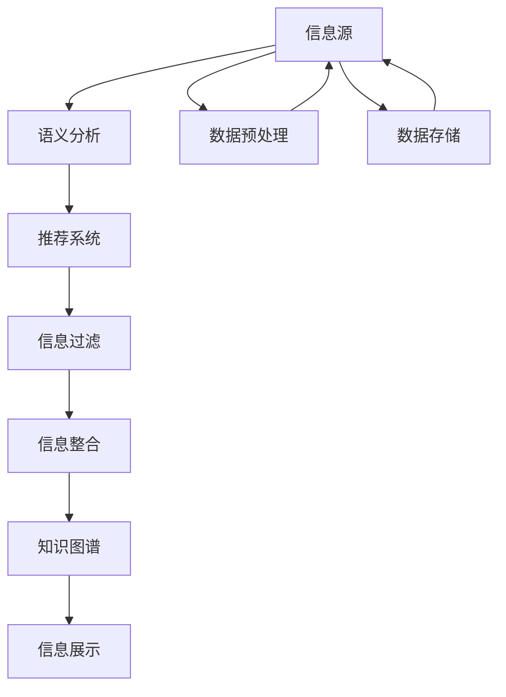

                 

# AI在信息过滤和整合中的作用

## 1. 背景介绍

在信息爆炸的时代，如何有效地过滤和整合海量信息，成为一项重要的技术挑战。传统的基于规则和关键词匹配的信息过滤方式，无法应对信息的多样性和复杂性。近年来，随着人工智能（AI）技术的发展，特别是自然语言处理（NLP）和机器学习（ML）技术的进步，AI在信息过滤和整合中扮演了越来越重要的角色。AI技术能够自动识别文本中的关键信息，进行语义分析，从而筛选出最相关的信息，提供个性化推荐和整合。

## 2. 核心概念与联系

### 2.1 核心概念概述

为更好地理解AI在信息过滤和整合中的作用，本节将介绍几个关键概念：

- 人工智能（Artificial Intelligence, AI）：一种模拟人类智能的技术，包括学习、推理、自然语言处理等。
- 自然语言处理（Natural Language Processing, NLP）：一种AI子领域，专注于使计算机理解和处理人类语言。
- 机器学习（Machine Learning, ML）：一种AI技术，通过算法让计算机自动学习和优化，以实现特定任务。
- 信息过滤（Information Filtering）：从大量信息中筛选出最相关、最有用的信息，以降低用户获取信息的成本。
- 信息整合（Information Integration）：将不同来源的信息进行综合，生成更加全面、准确的信息。
- 语义分析（Semantic Analysis）：一种NLP技术，分析文本的含义，提取关键信息。
- 推荐系统（Recommendation System）：基于用户历史行为和偏好，推荐最相关的信息或产品。
- 知识图谱（Knowledge Graph）：一种表示知识的网络结构，用于存储和查询实体及实体之间的关系。

这些概念通过语义分析、推荐系统和知识图谱等技术手段相联系，共同构成了AI在信息过滤和整合中的基础。

### 2.2 核心概念原理和架构的 Mermaid 流程图



这个流程图展示了AI在信息过滤和整合中的核心技术链路。从信息源出发，首先通过语义分析提取关键信息，然后利用推荐系统筛选信息，通过信息过滤进一步提高相关性，将整合后的信息展示给用户，最终构建知识图谱存储和检索信息。数据预处理和存储是整个流程的基础，保障数据的质量和高效检索。

## 3. 核心算法原理 & 具体操作步骤

### 3.1 算法原理概述

AI在信息过滤和整合中的关键算法包括语义分析、推荐系统和知识图谱。以下将详细介绍这些算法的原理和操作步骤。

### 3.2 算法步骤详解

#### 3.2.1 语义分析

语义分析是AI信息过滤和整合的基础，用于理解文本的含义，提取关键信息。具体步骤如下：

1. 分词：将文本分解成词汇单元，是语义分析的第一步。分词方法包括基于规则的分词和基于统计的分词。
2. 词性标注：确定每个词汇的词性（如名词、动词等），以便更好地理解文本。
3. 命名实体识别：识别文本中的人名、地名、组织名等实体，提取重要信息。
4. 句法分析：分析文本的句法结构，理解句子之间的关系和逻辑。
5. 语义理解：结合上下文，理解词汇和句子在语义层面的含义，提取关键信息。

#### 3.2.2 推荐系统

推荐系统通过分析用户的历史行为和偏好，推荐最相关的信息。推荐算法包括基于内容的推荐和协同过滤推荐。

1. 基于内容的推荐：根据物品的属性和用户的历史行为，推荐类似物品。例如，用户喜欢电影A，推荐其他相似电影。
2. 协同过滤推荐：根据用户和物品的相似度，推荐其他用户喜欢的物品。例如，用户A和用户B喜欢相似物品，推荐用户B喜欢的物品给用户A。

#### 3.2.3 信息过滤

信息过滤通过去除无关信息，提高相关性。常见的信息过滤算法包括基于规则的过滤和基于机器学习的过滤。

1. 基于规则的过滤：根据预定义的规则，过滤掉不符合规则的信息。例如，过滤垃圾邮件，屏蔽关键词。
2. 基于机器学习的过滤：通过训练分类器，识别并过滤掉垃圾信息。例如，使用朴素贝叶斯、支持向量机等算法进行垃圾邮件分类。

#### 3.2.4 信息整合

信息整合将不同来源的信息进行综合，生成更加全面、准确的信息。具体步骤如下：

1. 数据集成：将不同来源的数据进行合并，消除重复数据。
2. 数据清洗：去除噪声数据，修正错误数据。
3. 数据融合：将不同数据源的数据进行综合，生成新的信息。
4. 数据可视：通过可视化工具，展示整合后的信息，帮助用户理解和分析。

### 3.3 算法优缺点

#### 3.3.1 优点

1. 自动化程度高：AI算法能够自动处理大量信息，降低人工成本。
2. 准确度高：AI算法能够精确识别和提取关键信息，提高信息过滤和整合的准确性。
3. 动态适应：AI算法能够根据用户行为和数据变化进行动态调整，提供个性化的信息服务。
4. 可扩展性强：AI算法可以轻松扩展到多种信息源和多种信息类型，适应复杂的信息环境。

#### 3.3.2 缺点

1. 对数据质量要求高：AI算法的效果依赖于数据质量，需要高质量的标注数据和特征提取。
2. 模型复杂度高：AI算法通常需要复杂的模型和大量的计算资源，特别是深度学习模型。
3. 透明度低：AI算法的内部工作机制和决策过程较为复杂，难以理解和解释。
4. 数据隐私问题：AI算法需要收集和处理大量用户数据，存在隐私泄露风险。

### 3.4 算法应用领域

AI在信息过滤和整合中的应用领域非常广泛，以下是几个典型场景：

1. 新闻推荐：根据用户的历史阅读记录和兴趣爱好，推荐相关新闻文章。
2. 金融投资：分析股票、基金等金融信息，预测市场走势，提供投资建议。
3. 社交网络：根据用户的行为和关系，推荐好友、话题和内容。
4. 医疗健康：分析病历、药物等信息，提供个性化的诊疗建议。
5. 电子商务：根据用户的历史购买记录和浏览行为，推荐商品。

## 4. 数学模型和公式 & 详细讲解 & 举例说明

### 4.1 数学模型构建

信息过滤和整合的数学模型主要基于统计学习和深度学习。以下将以新闻推荐为例，介绍信息过滤的数学模型构建。

设新闻数据集为 $D=\{(x_i, y_i)\}_{i=1}^N$，其中 $x_i$ 为新闻文本，$y_i$ 为标签（如体育、科技等）。模型的目标是最小化交叉熵损失函数：

$$
\min_{\theta} \frac{1}{N}\sum_{i=1}^N \ell(x_i, y_i; \theta)
$$

其中 $\theta$ 为模型参数，$\ell(x_i, y_i; \theta)$ 为交叉熵损失函数，表示模型在新闻 $x_i$ 上的预测概率分布与真实标签 $y_i$ 之间的差异。

### 4.2 公式推导过程

设模型的特征提取函数为 $h(x_i; \theta)$，输出层的参数为 $\beta$，则模型的预测概率分布为：

$$
p(y_i|x_i; \theta) = \text{softmax}(\beta \cdot h(x_i; \theta))
$$

交叉熵损失函数为：

$$
\ell(x_i, y_i; \theta) = -\log p(y_i|x_i; \theta) = -y_i \log p(y_i|x_i; \theta) - (1-y_i) \log (1-p(y_i|x_i; \theta))
$$

将新闻文本 $x_i$ 分解成词汇单元，使用预训练的词向量表示每个词汇。例如，使用BERT模型进行预训练，将新闻文本 $x_i$ 编码成向量 $x_i^{\text{emb}}$。

### 4.3 案例分析与讲解

假设有一篇新闻：

> 科技公司发布新产品，采用最新AI技术，有望彻底改变传统医疗行业。

通过语义分析，可以提取出关键信息：科技公司、新产品、AI技术、医疗行业。将这些信息输入到推荐系统中，根据用户的历史阅读记录和兴趣，筛选出相关新闻，推荐给用户。

## 5. 项目实践：代码实例和详细解释说明

### 5.1 开发环境搭建

开发环境需要支持深度学习框架（如TensorFlow、PyTorch等）和自然语言处理库（如NLTK、SpaCy等）。以下以PyTorch为例，介绍开发环境搭建步骤：

1. 安装Anaconda：从官网下载并安装Anaconda，用于创建独立的Python环境。
2. 创建并激活虚拟环境：
```bash
conda create -n pytorch-env python=3.8 
conda activate pytorch-env
```

3. 安装PyTorch：根据CUDA版本，从官网获取对应的安装命令。例如：
```bash
conda install pytorch torchvision torchaudio cudatoolkit=11.1 -c pytorch -c conda-forge
```

4. 安装NLTK：
```bash
pip install nltk
```

5. 安装SpaCy：
```bash
pip install spacy
```

### 5.2 源代码详细实现

以下是使用PyTorch和NLTK实现新闻推荐系统的代码：

```python
import torch
import torch.nn as nn
import torch.optim as optim
from torch.utils.data import DataLoader
from nltk.tokenize import word_tokenize
from nltk.corpus import stopwords
from sklearn.feature_extraction.text import TfidfVectorizer
from sklearn.metrics import accuracy_score

# 定义模型结构
class NewsClassifier(nn.Module):
    def __init__(self, vocab_size, embed_size, hidden_size, num_classes):
        super(NewsClassifier, self).__init__()
        self.embedding = nn.Embedding(vocab_size, embed_size)
        self.rnn = nn.LSTM(embed_size, hidden_size)
        self.fc = nn.Linear(hidden_size, num_classes)
    
    def forward(self, x):
        embedded = self.embedding(x)
        output, (hidden, cell) = self.rnn(embedded)
        logits = self.fc(hidden[-1])
        return logits

# 训练函数
def train(model, train_loader, device, optimizer, epoch):
    model.train()
    total_loss = 0
    for batch in train_loader:
        inputs, labels = batch
        inputs, labels = inputs.to(device), labels.to(device)
        optimizer.zero_grad()
        outputs = model(inputs)
        loss = nn.CrossEntropyLoss()(outputs, labels)
        loss.backward()
        optimizer.step()
        total_loss += loss.item()
    return total_loss / len(train_loader)

# 评估函数
def evaluate(model, dev_loader, device):
    model.eval()
    total_correct = 0
    total_num = 0
    for batch in dev_loader:
        inputs, labels = batch
        inputs, labels = inputs.to(device), labels.to(device)
        with torch.no_grad():
            outputs = model(inputs)
            _, predicted = torch.max(outputs, 1)
            total_correct += (predicted == labels).sum().item()
            total_num += labels.size(0)
    return accuracy_score(labels.cpu().numpy(), predicted.cpu().numpy())

# 数据预处理
def preprocess(text):
    tokens = word_tokenize(text.lower())
    tokens = [word for word in tokens if word.isalnum()]
    stop_words = set(stopwords.words('english'))
    tokens = [word for word in tokens if word not in stop_words]
    return ' '.join(tokens)

# 数据集加载
train_data = ...
dev_data = ...
test_data = ...

train_dataset = ...
dev_dataset = ...
test_dataset = ...

train_loader = ...
dev_loader = ...
test_loader = ...

# 模型训练
model = NewsClassifier(vocab_size=10000, embed_size=100, hidden_size=128, num_classes=10)
optimizer = optim.Adam(model.parameters(), lr=0.01)

device = torch.device('cuda' if torch.cuda.is_available() else 'cpu')
model.to(device)

for epoch in range(10):
    train_loss = train(model, train_loader, device, optimizer, epoch)
    dev_acc = evaluate(model, dev_loader, device)
    print(f"Epoch {epoch+1}, train loss: {train_loss:.3f}, dev acc: {dev_acc:.3f}")

# 模型测试
test_acc = evaluate(model, test_loader, device)
print(f"Test acc: {test_acc:.3f}")
```

### 5.3 代码解读与分析

代码中定义了一个基于LSTM的分类模型，用于对新闻进行分类。使用PyTorch框架，实现了模型的定义、训练和评估。NLTK库用于文本预处理，去除停用词和标点符号。TfidfVectorizer库用于将文本转换为词向量，供模型训练使用。

## 6. 实际应用场景

### 6.1 智能客服系统

智能客服系统利用AI技术，实现自动解答用户问题。通过语义分析，理解用户意图，提取关键信息，选择合适的回答。推荐系统可以根据用户的历史行为和偏好，推荐最相关的回答。

### 6.2 金融投资

金融投资领域利用AI技术，分析新闻和市场数据，预测股票走势，提供投资建议。语义分析从新闻中提取关键信息，推荐系统推荐相关文章，知识图谱存储金融实体和关系。

### 6.3 社交网络

社交网络利用AI技术，推荐好友和话题，丰富用户的内容体验。语义分析从用户行为中提取兴趣点，推荐系统推荐相关内容，知识图谱存储用户和实体之间的关系。

### 6.4 医疗健康

医疗健康领域利用AI技术，分析病历和药物信息，提供个性化的诊疗建议。语义分析从病历中提取关键信息，推荐系统推荐相关文章，知识图谱存储医疗实体和关系。

## 7. 工具和资源推荐

### 7.1 学习资源推荐

1. 《深度学习》书籍：Ian Goodfellow所著，详细介绍了深度学习的基本概念和算法。
2. 《自然语言处理综论》书籍：Daniel Jurafsky和James H. Martin所著，介绍了自然语言处理的理论和实践。
3. 斯坦福CS224N课程：自然语言处理课程，包含深度学习在NLP中的应用。
4. 深度学习框架文档：如PyTorch、TensorFlow等框架的官方文档，提供丰富的API和教程。
5. Kaggle：机器学习和数据科学竞赛平台，提供大量的数据集和模型竞赛。

### 7.2 开发工具推荐

1. Jupyter Notebook：交互式编程环境，方便代码调试和数据可视化。
2. TensorBoard：模型训练和调试工具，提供可视化展示。
3. PyTorch Lightning：轻量级深度学习框架，简化模型训练流程。
4. NLTK和SpaCy：自然语言处理库，提供丰富的文本处理功能。
5. Google Colab：在线编程环境，支持GPU计算。

### 7.3 相关论文推荐

1. Attention is All You Need：Transformer模型，奠定了深度学习在NLP中的应用基础。
2. BERT: Pre-training of Deep Bidirectional Transformers for Language Understanding：BERT模型，提升了NLP任务的性能。
3. Capsule Networks：Capsule网络，提升了深度学习在图像处理中的应用。
4. GANs and Variational Autoencoders for Natural Language Processing：生成对抗网络和变分自编码器，提升了NLP任务的生成能力。
5. Knowledge Graphs and Semantic Web：知识图谱，提供了结构化知识的管理和查询。

## 8. 总结：未来发展趋势与挑战

### 8.1 未来发展趋势

未来，AI在信息过滤和整合中的应用将更加广泛和深入。以下是几个发展趋势：

1. 多模态信息融合：结合文本、图像、视频等多种信息源，提供更全面的信息服务。
2. 深度学习应用：深度学习模型将不断优化，提升信息过滤和整合的精度和速度。
3. 个性化推荐：根据用户行为和兴趣，提供更加个性化的信息服务。
4. 知识图谱应用：知识图谱技术将不断发展，提供更加准确的信息整合和检索。
5. 跨领域应用：AI技术将在更多领域得到应用，如医疗、金融、教育等。

### 8.2 面临的挑战

虽然AI在信息过滤和整合中的应用取得了显著进展，但仍面临一些挑战：

1. 数据质量和隐私：高质量的数据和用户隐私保护是AI应用的基础，数据质量和隐私问题需要持续关注。
2. 模型复杂度：深度学习模型需要大量的计算资源，模型复杂度较高。
3. 透明度和可解释性：AI算法的内部工作机制和决策过程较为复杂，难以理解和解释。
4. 跨领域应用：AI技术在跨领域应用时，需要考虑领域知识的融合和迁移。

### 8.3 研究展望

未来的研究需要在以下几个方向取得新的突破：

1. 多模态信息融合：如何更好地结合不同模态的信息，提升信息融合的效果。
2. 知识图谱应用：如何构建更高效、更全面的知识图谱，提供更好的信息检索和整合。
3. 个性化推荐：如何根据用户行为和兴趣，提供更加个性化的信息服务。
4. 跨领域应用：如何在不同领域中应用AI技术，提供更加普适的信息服务。

## 9. 附录：常见问题与解答

**Q1：AI在信息过滤和整合中面临哪些挑战？**

A: AI在信息过滤和整合中面临的主要挑战包括数据质量和隐私问题、模型复杂度、透明度和可解释性、跨领域应用等。高质量的数据和用户隐私保护是AI应用的基础，模型复杂度较高，透明度和可解释性较差，跨领域应用需要考虑领域知识的融合和迁移。

**Q2：AI在信息过滤和整合中如何提升性能？**

A: 提升AI在信息过滤和整合中的性能，可以从以下几个方面入手：
1. 数据预处理：使用自然语言处理库对文本进行预处理，提取关键信息。
2. 模型优化：使用深度学习模型，优化模型结构和超参数，提升过滤和整合的效果。
3. 知识图谱：构建知识图谱，存储和查询实体之间的关系，提升信息检索和整合的准确性。
4. 个性化推荐：根据用户行为和兴趣，提供个性化的信息服务，提升用户满意度。

**Q3：AI在信息过滤和整合中的优缺点是什么？**

A: AI在信息过滤和整合中的优点包括自动化程度高、准确度高、动态适应、可扩展性强等。缺点包括对数据质量要求高、模型复杂度高、透明度低、数据隐私问题等。高质量的数据和用户隐私保护是AI应用的基础，模型复杂度较高，透明度和可解释性较差，跨领域应用需要考虑领域知识的融合和迁移。

**Q4：AI在信息过滤和整合中的应用场景有哪些？**

A: AI在信息过滤和整合中的应用场景包括智能客服系统、金融投资、社交网络、医疗健康等。通过语义分析、推荐系统和知识图谱等技术手段，AI能够提供高效、个性化的信息服务，提升用户体验和决策效率。

---

作者：禅与计算机程序设计艺术 / Zen and the Art of Computer Programming

