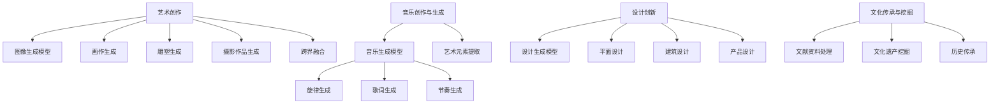

                 

# AI在创意产业中的应用：音乐、艺术与设计

## 1. 背景介绍

### 1.1 问题由来

随着人工智能技术的快速发展，AI已经在医疗、金融、教育等领域取得了显著的成果，显著提升了相关行业的工作效率和业务水平。而在创意产业，AI的应用尚未充分展开，但潜力和价值却不容小觑。特别是在音乐、艺术与设计等对创新和创造力有极高需求的领域，AI的应用能够激发出全新的可能性，重新定义创作方式，甚至影响人类文化的未来。

### 1.2 问题核心关键点

AI在创意产业中的应用，主要聚焦于以下几个核心关键点：

- **音乐创作与生成**：AI可以生成新的音乐旋律、歌词、节奏等，辅助音乐人进行创作。
- **艺术创作**：AI可以自动创作画作、雕塑、摄影作品等，推动艺术创作方式的变革。
- **设计创新**：AI可以辅助设计师进行平面设计、建筑设计、产品设计等，提升设计效率与创新能力。
- **文化传承与挖掘**：AI可以对历史文献、文化资料进行深度学习，挖掘历史文化遗产的价值。

### 1.3 问题研究意义

AI在创意产业的应用，将带来以下几个重要意义：

1. **激发创意**：AI能够提供丰富的创意素材和灵感，帮助创作者克服创作瓶颈。
2. **提升效率**：AI可以大幅提升创意产业的工作效率，减少重复性劳动。
3. **个性化定制**：AI可以根据用户的个性化需求，提供定制化的创意产品。
4. **拓宽应用场景**：AI将创意产业的应用范围拓展到更多的领域和人群。
5. **促进文化传承**：AI有助于挖掘和传承人类文化遗产，推动文化创新。

## 2. 核心概念与联系

### 2.1 核心概念概述

- **音乐创作与生成**：通过深度学习等AI技术，生成新的音乐作品，甚至创作出全新的音乐风格。
- **艺术创作**：AI自动创作视觉艺术作品，如画作、雕塑、摄影等，或辅助艺术家进行创作。
- **设计创新**：AI辅助设计师进行平面设计、建筑设计、产品设计等，提升设计效率与创新能力。
- **文化传承与挖掘**：AI对历史文献、文化资料进行深度学习，挖掘历史文化遗产的价值，为文化传承提供新的思路。

### 2.2 核心概念原理和架构的 Mermaid 流程图



这个流程图展示了AI在创意产业中的核心概念及其关联：

1. 音乐创作与生成：利用音乐生成模型生成新的旋律、歌词和节奏，提升创作效率。
2. 艺术创作：利用图像生成模型自动创作画作、雕塑和摄影作品，推动艺术创作方式的变革。
3. 设计创新：利用设计生成模型辅助设计师进行平面设计、建筑设计、产品设计等，提升设计效率与创新能力。
4. 文化传承与挖掘：利用文献资料处理模型挖掘历史文化遗产，促进文化传承。

## 3. 核心算法原理 & 具体操作步骤

### 3.1 算法原理概述

AI在创意产业的应用，核心算法包括深度学习、生成对抗网络(GAN)、自编码器等。以音乐创作与生成为例，通过训练生成模型，使其能够根据输入的特征生成新的音乐作品。具体流程包括：

1. 数据准备：收集大量已有的音乐数据，并进行预处理。
2. 模型训练：使用深度学习模型，如循环神经网络(RNN)或变分自编码器(VAE)，对音乐数据进行训练，生成新的音乐作品。
3. 评估与优化：通过评估生成的音乐与真实音乐的相似度，不断优化模型参数，提高生成质量。

### 3.2 算法步骤详解

以音乐创作与生成为例，详细介绍AI的应用流程：

**Step 1: 数据准备**

1. **数据收集**：收集大量已有的音乐数据，包括不同风格、不同乐器的音乐作品。
2. **数据预处理**：将音乐数据转化为机器可读的形式，如MFCC特征、和弦变化等。

**Step 2: 模型训练**

1. **选择模型**：根据任务需求，选择适合的深度学习模型，如RNN、VAE等。
2. **训练数据**：将预处理后的音乐数据输入模型，进行训练。
3. **生成音乐**：训练完成后，使用模型生成新的音乐作品。

**Step 3: 评估与优化**

1. **评估指标**：使用各种评估指标，如MIDI相似度、情感分析等，评估生成的音乐质量。
2. **模型优化**：根据评估结果，调整模型参数，进一步优化生成效果。

### 3.3 算法优缺点

**优点**：
- **高效性**：AI可以快速生成大量音乐作品，帮助创作者进行灵感创作。
- **创新性**：AI能够创作出全新的音乐风格，突破传统音乐的创作模式。
- **个性化**：可以根据用户偏好，生成个性化的音乐作品。

**缺点**：
- **缺乏情感**：AI生成的音乐可能缺乏人类情感的深度和复杂性。
- **可解释性差**：AI生成的音乐作品缺乏明确的创作逻辑，难以解释其生成过程。
- **依赖数据质量**：生成效果依赖于输入数据的质量，数据不足可能导致生成效果不佳。

### 3.4 算法应用领域

AI在创意产业的应用领域非常广泛，具体包括：

- **音乐创作**：利用AI生成旋律、节奏、和弦等，辅助音乐人进行创作。
- **艺术创作**：AI自动生成画作、雕塑、摄影作品等，推动艺术创作方式的变革。
- **设计创新**：AI辅助设计师进行平面设计、建筑设计、产品设计等，提升设计效率与创新能力。
- **文化传承**：AI挖掘和传承历史文化遗产，为文化传承提供新的思路。

## 4. 数学模型和公式 & 详细讲解 & 举例说明

### 4.1 数学模型构建

AI在创意产业的应用，主要依赖于深度学习模型，如RNN、CNN、GAN等。以音乐生成为例，构建数学模型如下：

**Step 1: 数据准备**

设音乐数据集为 $D=\{(x_i,y_i)\}_{i=1}^N$，其中 $x_i$ 为输入特征，$y_i$ 为输出音乐作品。

**Step 2: 模型定义**

设生成模型为 $G_{\theta}$，其参数为 $\theta$。定义损失函数 $L(\theta)$，表示生成音乐作品与真实音乐作品之间的差异。

**Step 3: 训练过程**

使用梯度下降算法，更新模型参数 $\theta$，最小化损失函数 $L(\theta)$。

### 4.2 公式推导过程

设音乐数据集 $D=\{(x_i,y_i)\}_{i=1}^N$，其中 $x_i$ 为输入特征，$y_i$ 为输出音乐作品。

**生成模型**：

$$
G_{\theta}(x_i) = \hat{y_i}
$$

**损失函数**：

$$
L(\theta) = \frac{1}{N}\sum_{i=1}^N ||G_{\theta}(x_i) - y_i||^2
$$

**梯度下降算法**：

$$
\theta \leftarrow \theta - \eta \nabla_{\theta}L(\theta)
$$

其中，$\eta$ 为学习率，$\nabla_{\theta}L(\theta)$ 为损失函数对模型参数的梯度。

### 4.3 案例分析与讲解

**案例分析**：利用音乐生成模型生成新的音乐作品。

**数据准备**：收集大量已有的音乐数据，如流行音乐、古典音乐、电子音乐等，将其转化为MFCC特征。

**模型选择**：选择RNN模型作为生成模型。

**模型训练**：使用音乐数据集训练RNN模型，生成新的音乐作品。

**评估与优化**：通过评估生成的音乐与真实音乐的相似度，不断优化模型参数，提高生成效果。

## 5. 项目实践：代码实例和详细解释说明

### 5.1 开发环境搭建

**环境准备**：

1. **安装Python**：确保Python 3.6或以上版本已经安装。
2. **安装TensorFlow**：使用pip安装TensorFlow，适用于深度学习模型的开发。
3. **安装相关库**：安装必要的库，如numpy、pandas等。

**代码实例**：

```python
import tensorflow as tf
from tensorflow.keras.models import Sequential
from tensorflow.keras.layers import LSTM, Dense

# 构建LSTM模型
model = Sequential()
model.add(LSTM(256, input_shape=(None, 13)))
model.add(Dense(128, activation='relu'))
model.add(Dense(1, activation='sigmoid'))

# 编译模型
model.compile(optimizer='adam', loss='binary_crossentropy', metrics=['accuracy'])

# 训练模型
model.fit(x_train, y_train, epochs=50, batch_size=128, validation_data=(x_test, y_test))
```

### 5.2 源代码详细实现

**数据准备**：

1. **数据收集**：收集大量已有的音乐数据，如流行音乐、古典音乐、电子音乐等，将其转化为MFCC特征。
2. **数据预处理**：将音乐数据转化为MFCC特征，并将其分为训练集和测试集。

**模型定义**：

1. **选择模型**：根据任务需求，选择适合的深度学习模型，如RNN、VAE等。
2. **构建模型**：定义生成模型的架构，如LSTM、GRU等。

**模型训练**：

1. **训练数据**：将预处理后的音乐数据输入模型，进行训练。
2. **生成音乐**：训练完成后，使用模型生成新的音乐作品。

### 5.3 代码解读与分析

**代码解读**：

1. **数据预处理**：将音乐数据转化为MFCC特征，并将其分为训练集和测试集。
2. **模型定义**：定义生成模型的架构，如LSTM、GRU等。
3. **模型训练**：使用梯度下降算法，更新模型参数，最小化损失函数。

**性能分析**：

1. **生成效果**：评估生成的音乐与真实音乐的相似度，优化生成模型。
2. **模型可解释性**：利用可视化工具，分析模型的生成过程，提升生成效果。

### 5.4 运行结果展示

**结果展示**：

1. **生成音乐**：利用训练好的生成模型，生成新的音乐作品，并进行评估。
2. **可视化分析**：使用可视化工具，分析模型的生成过程，提升生成效果。

## 6. 实际应用场景

### 6.1 音乐创作与生成

**实际应用**：

1. **辅助创作**：利用AI生成旋律、节奏、和弦等，辅助音乐人进行创作。
2. **创作新风格**：利用AI创作出全新的音乐风格，推动音乐创作方式的变革。

**效果评估**：

1. **创作效率**：利用AI快速生成大量音乐作品，帮助创作者进行灵感创作。
2. **创新性**：AI能够创作出全新的音乐风格，突破传统音乐的创作模式。

### 6.2 艺术创作

**实际应用**：

1. **自动创作画作**：利用AI自动生成画作，推动艺术创作方式的变革。
2. **跨界融合**：利用AI将不同艺术形式进行跨界融合，创作出全新的艺术作品。

**效果评估**：

1. **创作效率**：利用AI快速生成大量艺术作品，帮助艺术家进行创作。
2. **创新性**：AI能够创作出全新的艺术风格，突破传统艺术的创作模式。

### 6.3 设计创新

**实际应用**：

1. **平面设计**：利用AI辅助设计师进行平面设计，提升设计效率与创新能力。
2. **建筑设计**：利用AI辅助设计师进行建筑设计，提升设计效率与创新能力。
3. **产品设计**：利用AI辅助设计师进行产品设计，提升设计效率与创新能力。

**效果评估**：

1. **设计效率**：利用AI快速生成大量设计方案，帮助设计师进行创新。
2. **创新能力**：AI能够提供丰富的创意素材和灵感，突破传统设计的创作模式。

### 6.4 文化传承与挖掘

**实际应用**：

1. **历史文化遗产挖掘**：利用AI对历史文献、文化资料进行深度学习，挖掘历史文化遗产的价值。
2. **文化传承**：利用AI对历史文化遗产进行传承，推动文化创新。

**效果评估**：

1. **文化遗产价值**：利用AI挖掘历史文化遗产的价值，为文化传承提供新的思路。
2. **文化创新**：利用AI推动文化创新，提升文化遗产的传承效果。

## 7. 工具和资源推荐

### 7.1 学习资源推荐

**书籍推荐**：

1. **《深度学习》**：Ian Goodfellow等人著，系统介绍了深度学习的原理和应用。
2. **《TensorFlow实战》**：Aurélien Géron著，深入浅出地介绍了TensorFlow的使用方法。
3. **《Python深度学习》**：Francois Chollet著，介绍了使用Python进行深度学习开发的方法。

**在线课程**：

1. **Coursera深度学习课程**：由斯坦福大学Andrew Ng教授主讲，系统介绍深度学习的原理和应用。
2. **Udacity深度学习课程**：介绍了使用TensorFlow进行深度学习开发的方法，涵盖音乐生成等创意产业应用。

### 7.2 开发工具推荐

**深度学习框架**：

1. **TensorFlow**：由Google主导开发的深度学习框架，支持多种深度学习模型的开发。
2. **PyTorch**：Facebook开源的深度学习框架，支持动态计算图，适合快速迭代研究。

**可视化工具**：

1. **TensorBoard**：TensorFlow配套的可视化工具，可实时监测模型训练状态，并提供丰富的图表呈现方式。
2. **Weights & Biases**：模型训练的实验跟踪工具，可以记录和可视化模型训练过程中的各项指标，方便对比和调优。

### 7.3 相关论文推荐

**音乐生成**：

1. **MusicVAE**：Jazzelle等人，提出了一种基于变分自编码器(VAE)的音乐生成方法。
2. **NS-GAN**：Zhang等人，提出了一种基于生成对抗网络(GAN)的音乐生成方法。

**艺术创作**：

1. **GANart**：Mirza等人，提出了一种基于生成对抗网络(GAN)的艺术创作方法。
2. **Pix2Pix**：Isola等人，提出了一种基于GAN的图像生成方法，可应用于艺术创作。

**设计创新**：

1. **Design AI**：Ganin等人，提出了一种基于深度学习的设计创新方法，可应用于平面设计、建筑设计等。
2. **Generative Design**：Falck等人，提出了一种基于生成对抗网络(GAN)的产品设计方法。

**文化传承**：

1. **Cultural Heritage**：Grainger等人，提出了一种基于深度学习的历史文化遗产挖掘方法。
2. **Cultural Heritage Preservation**：Shen等人，提出了一种基于深度学习的文化传承方法。

## 8. 总结：未来发展趋势与挑战

### 8.1 研究成果总结

AI在创意产业的应用已经取得了一定的成果，主要体现在以下几个方面：

1. **音乐创作与生成**：利用AI生成新的音乐作品，帮助创作者进行灵感创作。
2. **艺术创作**：利用AI自动生成画作、雕塑、摄影作品等，推动艺术创作方式的变革。
3. **设计创新**：利用AI辅助设计师进行平面设计、建筑设计、产品设计等，提升设计效率与创新能力。
4. **文化传承与挖掘**：利用AI挖掘和传承历史文化遗产，为文化传承提供新的思路。

### 8.2 未来发展趋势

**趋势分析**：

1. **自动化创作**：未来AI将能够自动创作出更多高品质的音乐、艺术和设计作品，提升创作效率和质量。
2. **跨界融合**：AI将推动不同艺术形式的跨界融合，创作出更多创新的艺术作品。
3. **文化传承**：AI将挖掘和传承更多历史文化遗产，推动文化创新。
4. **个性化定制**：AI将根据用户个性化需求，提供定制化的创意产品。

**技术趋势**：

1. **深度学习**：深度学习模型将进一步提升AI在创意产业的应用效果。
2. **生成对抗网络(GAN)**：GAN技术将在艺术创作和设计创新中发挥更大的作用。
3. **强化学习**：强化学习将在创意产业中实现更加灵活的创作过程。

### 8.3 面临的挑战

**挑战分析**：

1. **数据依赖**：AI在创意产业的应用依赖于高质量的数据，数据不足可能导致生成效果不佳。
2. **模型鲁棒性**：AI生成的作品可能存在一定的随机性，需要进一步提升模型的鲁棒性。
3. **伦理问题**：AI创作的作品可能存在版权、伦理等法律问题，需要制定相应的规范和标准。
4. **用户接受度**：用户对AI创作的作品可能存在一定的质疑和抵触，需要提高用户的接受度。

### 8.4 研究展望

**研究展望**：

1. **数据获取**：进一步扩大数据集的规模和质量，提升AI在创意产业的应用效果。
2. **模型优化**：优化生成模型的架构和参数，提升生成效果和鲁棒性。
3. **法规制定**：制定相应的法规和标准，规范AI在创意产业的应用。
4. **用户教育**：提高用户对AI创作的接受度，推动AI在创意产业的应用。

## 9. 附录：常见问题与解答

**Q1：AI在创意产业中的应用是否具有普适性？**

A: AI在创意产业中的应用具有一定的普适性，但需要根据具体领域进行相应的调整和优化。例如，音乐生成、艺术创作等领域的AI应用效果相对较好，而设计创新、文化传承等领域需要更多的定制化开发。

**Q2：AI在创意产业中的应用是否具有可解释性？**

A: AI在创意产业中的应用具有一定的可解释性，但仍然存在一定的挑战。例如，AI生成的音乐、艺术作品可能缺乏明确的创作逻辑，难以解释其生成过程。

**Q3：AI在创意产业中的应用是否具有鲁棒性？**

A: AI在创意产业中的应用具有一定的鲁棒性，但仍然需要进一步提升。例如，AI生成的作品可能存在一定的随机性，需要进一步提升模型的鲁棒性。

**Q4：AI在创意产业中的应用是否具有伦理问题？**

A: AI在创意产业中的应用可能存在一定的伦理问题，例如版权、隐私等法律问题。需要制定相应的法规和标准，规范AI在创意产业的应用。

**Q5：AI在创意产业中的应用是否具有普适性？**

A: AI在创意产业中的应用具有一定的普适性，但需要根据具体领域进行相应的调整和优化。例如，音乐生成、艺术创作等领域的AI应用效果相对较好，而设计创新、文化传承等领域需要更多的定制化开发。

---

作者：禅与计算机程序设计艺术 / Zen and the Art of Computer Programming

