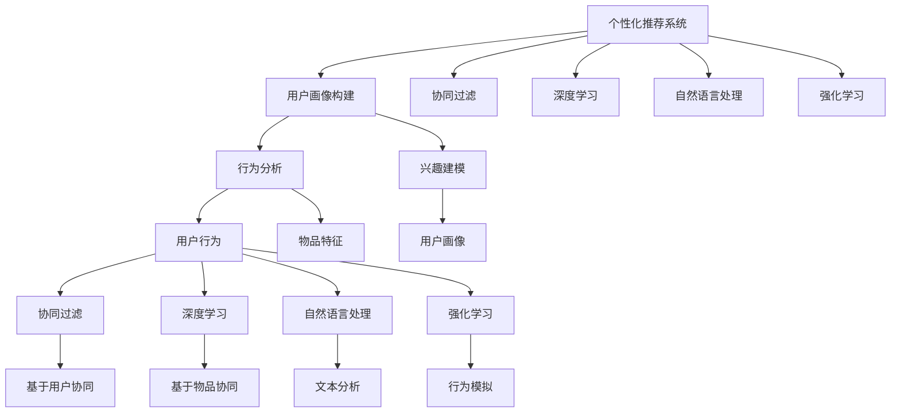

                 

## 1. 背景介绍

随着人工智能技术的飞速发展，旅游行业正经历着一场颠覆性的变革。个性化推荐作为AI技术的重要应用领域，正逐渐成为提升旅游服务质量、增强用户满意度的关键手段。在当前旅游业激烈竞争的态势下，个性化推荐系统能够帮助旅游企业更好地理解用户需求，提供更为精准、个性化的旅游产品和服务，从而在市场上取得竞争优势。

### 1.1 问题由来

在传统旅游行业，信息不对称、服务同质化等问题一直困扰着旅游企业。用户在选择旅游目的地和产品时，面临信息量庞大、选择困难的问题，而旅行社或酒店等旅游服务提供者往往无法准确把握用户需求，导致推荐效率低下、服务质量不高等问题。个性化推荐系统通过分析用户的兴趣、行为等数据，可以精准匹配用户需求与产品，提升用户体验，同时帮助旅游企业更好地进行市场定位和产品优化。

### 1.2 问题核心关键点

在旅游业中应用个性化推荐系统的关键点包括：
- **用户画像构建**：通过收集和分析用户行为数据，构建用户画像，了解用户的兴趣和需求。
- **产品推荐算法**：基于用户画像和产品特征，设计推荐算法，实现个性化推荐。
- **推荐系统评估**：使用合适的评估指标，如点击率、转化率等，评估推荐效果，进行系统优化。
- **数据隐私与安全**：在收集和处理用户数据时，需严格遵守数据隐私和安全法规，保护用户隐私。

## 2. 核心概念与联系

### 2.1 核心概念概述

为更好地理解旅游业中个性化推荐系统的核心概念，本节将介绍几个密切相关的核心概念：

- **个性化推荐系统**：通过分析用户的历史行为和兴趣，自动推荐符合用户需求的旅游产品和服务的系统。常用的推荐算法包括协同过滤、基于内容的推荐、混合推荐等。

- **用户画像**：对用户的基本属性、行为习惯、兴趣偏好等进行全面描述，用于指导个性化推荐。

- **协同过滤**：基于用户行为或物品特征，通过寻找相似用户或物品，实现推荐。协同过滤算法包括基于用户的协同过滤、基于物品的协同过滤等。

- **深度学习**：通过构建神经网络模型，自动学习用户行为和物品特征之间的关系，提升推荐精度。深度学习在推荐系统中主要用于用户画像建模和推荐算法设计。

- **自然语言处理**：用于处理文本数据，从旅游评论、用户反馈等文本信息中提取有用信息，用于推荐系统。

- **深度神经网络**：用于构建复杂的多层神经网络模型，能够处理大规模数据，实现高级的推荐算法。

- **强化学习**：通过模拟用户选择旅游产品的行为，进行系统优化，提升推荐效果。

这些核心概念之间的逻辑关系可以通过以下Mermaid流程图来展示：



这个流程图展示了个性化推荐系统的核心概念及其之间的关系：

1. 个性化推荐系统通过用户画像构建、协同过滤、深度学习、自然语言处理和强化学习等技术手段，实现精准推荐。
2. 用户画像通过行为分析和兴趣建模构建，包含用户行为和物品特征，是推荐算法的基础。
3. 协同过滤、深度学习、自然语言处理和强化学习等算法分别在用户行为、物品特征、文本分析和行为模拟等方面发挥作用，共同支撑推荐系统的运作。

## 3. 核心算法原理 & 具体操作步骤

### 3.1 算法原理概述

个性化推荐系统是基于用户的兴趣和行为数据，自动匹配最合适的旅游产品和服务，从而提升用户体验和商家转化率的系统。其实现原理主要包括以下几个关键步骤：

1. **用户画像构建**：通过分析用户的浏览历史、购买记录、评分反馈等数据，构建用户画像，了解用户的兴趣和偏好。
2. **推荐算法设计**：根据用户画像和产品特征，设计合适的推荐算法，如协同过滤、基于内容的推荐、混合推荐等。
3. **推荐结果评估**：使用点击率、转化率、平均评分等指标，评估推荐结果的准确性和有效性。
4. **系统优化调整**：根据评估结果，不断优化推荐算法和参数设置，提升推荐效果。

### 3.2 算法步骤详解

#### 3.2.1 用户画像构建

用户画像的构建是推荐系统的基础，通过分析用户的各类行为数据，构建用户兴趣、行为和偏好等特征，形成用户画像。

1. **数据收集**：收集用户的浏览记录、购买记录、评分反馈、评论内容等数据。
2. **数据清洗和预处理**：去除数据中的噪声和异常值，进行标准化和归一化处理。
3. **特征提取**：从清洗后的数据中提取有意义的特征，如用户喜欢的旅游目的地、活动类型、预算范围等。
4. **画像构建**：使用机器学习算法，如K-means聚类、协同过滤等，构建用户画像，形成用户兴趣和行为的全面描述。

#### 3.2.2 推荐算法设计

推荐算法的核心在于如何根据用户画像和产品特征，设计合适的推荐模型，实现个性化推荐。常用的推荐算法包括：

1. **协同过滤**：
   - **基于用户的协同过滤**：通过寻找相似用户，向用户推荐其喜欢的物品。
   - **基于物品的协同过滤**：通过寻找相似物品，向用户推荐相似的物品。

   具体步骤如下：
   1. **用户相似度计算**：使用余弦相似度、Pearson相关系数等方法，计算用户之间的相似度。
   2. **物品相似度计算**：使用余弦相似度、欧几里得距离等方法，计算物品之间的相似度。
   3. **推荐结果生成**：根据用户画像和物品特征，计算推荐分数，生成推荐结果。

2. **基于内容的推荐**：通过分析产品特征，向用户推荐与已喜欢物品相似的产品。
   - **特征提取**：从产品描述、价格、评价等文本信息中提取特征。
   - **推荐结果生成**：使用机器学习算法，如线性回归、决策树等，计算推荐分数，生成推荐结果。

3. **混合推荐**：结合协同过滤和基于内容的推荐，综合多源信息，提升推荐效果。
   - **模型融合**：使用加权、投票等方法，融合协同过滤和基于内容的推荐结果。
   - **结果排序**：根据用户的兴趣和行为，对推荐结果进行排序，生成最终的推荐列表。

#### 3.2.3 推荐结果评估

推荐结果的评估是推荐系统的核心环节，通过评估推荐效果，优化推荐算法和参数设置，提升推荐精度和用户满意度。

1. **指标选择**：选择合适的评估指标，如点击率、转化率、平均评分等。
2. **数据准备**：将评估指标数据与推荐结果进行匹配，形成评估数据集。
3. **模型评估**：使用评估指标，评估推荐模型的性能。
4. **结果分析**：根据评估结果，分析推荐系统存在的问题，进行系统优化。

#### 3.2.4 系统优化调整

根据推荐结果的评估结果，不断优化推荐算法和参数设置，提升推荐效果。

1. **算法优化**：调整推荐算法的参数，如协同过滤中的用户相似度阈值、基于内容的推荐中的特征提取方式等。
2. **数据优化**：优化数据采集和处理方式，增加数据量，提高数据质量。
3. **系统优化**：优化系统架构，提升处理能力和响应速度，确保系统稳定运行。

### 3.3 算法优缺点

个性化推荐系统在旅游业中具有以下优点：
- **提升用户体验**：通过精准推荐，满足用户个性化需求，提升用户满意度和忠诚度。
- **优化营销策略**：帮助旅游企业更好地了解用户需求，优化产品和服务，提升市场竞争力。
- **提高转化率**：通过精准推荐，提高用户购买转化率，提升企业收益。

同时，个性化推荐系统也存在以下缺点：
- **数据隐私问题**：在收集和处理用户数据时，需严格遵守数据隐私和安全法规，保护用户隐私。
- **冷启动问题**：新用户或未互动过的物品无法得到推荐，需要进行冷启动处理。
- **动态性问题**：用户兴趣和需求可能随时间变化，推荐系统需要实时更新和优化。
- **多样性问题**：推荐算法可能倾向于推荐热门物品，忽视长尾物品，导致推荐结果单一。

### 3.4 算法应用领域

个性化推荐系统在旅游业中具有广泛的应用场景，具体包括：

- **旅游目的地推荐**：根据用户兴趣和行为数据，推荐最适合的旅游目的地，如海岛、山区、古城等。
- **旅游活动推荐**：推荐符合用户兴趣和预算的旅游活动，如潜水、登山、探险等。
- **旅游套餐推荐**：根据用户兴趣和需求，推荐定制化的旅游套餐，如自由行、跟团游、亲子游等。
- **旅游评价推荐**：推荐用户评价高的旅游产品和活动，提升用户决策参考价值。
- **旅游动态信息推荐**：根据用户兴趣和行为数据，推荐最新的旅游信息和优惠活动，提升用户粘性。

## 4. 数学模型和公式 & 详细讲解 & 举例说明

### 4.1 数学模型构建

本节将使用数学语言对旅游业中个性化推荐系统的构建进行更加严格的刻画。

假设用户集合为 $U$，物品集合为 $I$，用户对物品的评分矩阵为 $R \in \mathbb{R}^{m \times n}$，其中 $m$ 为物品数量，$n$ 为用户数量。用户画像 $P_u \in \mathbb{R}^d$ 和物品特征 $F_i \in \mathbb{R}^k$ 分别表示用户兴趣和物品特征。推荐系统 $M$ 的预测评分函数为 $f: U \times I \rightarrow \mathbb{R}$，目标是最小化预测评分与真实评分之间的差异。

推荐系统的目标函数为：

$$
\min_{f} \sum_{(u,i) \in U \times I} \frac{1}{2} || f(u,i) - R_{ui} ||^2
$$

其中，$||.||$ 表示向量或矩阵的L2范数。

### 4.2 公式推导过程

以协同过滤算法为例，推导基于用户协同过滤的推荐模型。

假设用户 $u$ 与物品 $i$ 的评分矩阵为 $R$，用户集合 $U$ 的相似度矩阵为 $S$，物品集合 $I$ 的相似度矩阵为 $F$。用户 $u$ 与物品 $i$ 的推荐分数为：

$$
\hat{R}_{ui} = \sum_{v \in U} R_{vi} \cdot S_{uv} \cdot \frac{1}{\sum_{v \in U} F_{vi}}
$$

其中，$S_{uv}$ 表示用户 $u$ 和用户 $v$ 的相似度，$F_{vi}$ 表示物品 $i$ 和物品 $v$ 的相似度。

### 4.3 案例分析与讲解

假设某旅游平台收集了用户对旅游目的地和活动的评分数据，共有1000个用户，1000个目的地和1000个活动。通过协同过滤算法，为用户推荐最适合的旅游目的地和活动。

1. **数据准备**：收集用户对旅游目的地和活动的评分数据，构建用户-物品评分矩阵 $R$。
2. **用户相似度计算**：使用余弦相似度计算用户之间的相似度，构建相似度矩阵 $S$。
3. **物品相似度计算**：使用余弦相似度计算物品之间的相似度，构建相似度矩阵 $F$。
4. **推荐分数计算**：根据用户画像和物品特征，计算推荐分数，生成推荐结果。

例如，用户 $u_1$ 对目的地 $i_1$ 的评分为4，对目的地 $i_2$ 的评分为3。用户 $u_2$ 对目的地 $i_1$ 的评分为5，对目的地 $i_2$ 的评分为2。用户 $u_1$ 与用户 $u_2$ 的相似度为0.8，目的地 $i_1$ 与目的地 $i_2$ 的相似度为0.6。物品 $i_1$ 与物品 $i_2$ 的相似度为0.5。用户 $u_1$ 对物品 $i_1$ 的推荐分数为：

$$
\hat{R}_{u_1,i_1} = 4 \cdot 0.8 \cdot \frac{1}{0.5} = 6.4
$$

用户 $u_1$ 对物品 $i_2$ 的推荐分数为：

$$
\hat{R}_{u_1,i_2} = 3 \cdot 0.8 \cdot \frac{1}{0.5} = 4.8
$$

用户 $u_2$ 对物品 $i_1$ 的推荐分数为：

$$
\hat{R}_{u_2,i_1} = 5 \cdot 0.8 \cdot \frac{1}{0.5} = 8
$$

用户 $u_2$ 对物品 $i_2$ 的推荐分数为：

$$
\hat{R}_{u_2,i_2} = 2 \cdot 0.8 \cdot \frac{1}{0.5} = 3.2
$$

最终，平台可以推荐物品 $i_1$ 给用户 $u_1$，推荐物品 $i_2$ 给用户 $u_2$。

## 5. 项目实践：代码实例和详细解释说明

### 5.1 开发环境搭建

在进行推荐系统开发前，我们需要准备好开发环境。以下是使用Python进行PyTorch开发的环境配置流程：

1. 安装Anaconda：从官网下载并安装Anaconda，用于创建独立的Python环境。

2. 创建并激活虚拟环境：
```bash
conda create -n pytorch-env python=3.8 
conda activate pytorch-env
```

3. 安装PyTorch：根据CUDA版本，从官网获取对应的安装命令。例如：
```bash
conda install pytorch torchvision torchaudio cudatoolkit=11.1 -c pytorch -c conda-forge
```

4. 安装Tensorflow：
```bash
pip install tensorflow
```

5. 安装各类工具包：
```bash
pip install numpy pandas scikit-learn matplotlib tqdm jupyter notebook ipython
```

完成上述步骤后，即可在`pytorch-env`环境中开始推荐系统开发。

### 5.2 源代码详细实现

以下是一个基于协同过滤算法的推荐系统代码实现：

```python
import numpy as np
from sklearn.metrics.pairwise import cosine_similarity

def collaborative_filtering(train_data, user_similarity_matrix, item_similarity_matrix):
    user_num = train_data.shape[0]
    item_num = train_data.shape[1]

    # 计算用户相似度矩阵
    user_similarity_matrix = np.zeros((user_num, user_num))
    for u in range(user_num):
        for v in range(user_num):
            user_similarity_matrix[u][v] = cosine_similarity(train_data[u], train_data[v])[0][1]

    # 计算物品相似度矩阵
    item_similarity_matrix = np.zeros((item_num, item_num))
    for i in range(item_num):
        for j in range(item_num):
            item_similarity_matrix[i][j] = cosine_similarity(train_data[:, i], train_data[:, j])[1][0]

    # 初始化推荐分数矩阵
    recommendation_scores = np.zeros((user_num, item_num))

    # 计算推荐分数
    for u in range(user_num):
        for i in range(item_num):
            recommendation_scores[u][i] = np.dot(train_data, user_similarity_matrix[u]) * item_similarity_matrix[i]

    # 归一化推荐分数
    recommendation_scores = recommendation_scores / np.sum(recommendation_scores, axis=1)

    return recommendation_scores

# 测试数据
train_data = np.array([[4, 3, 5], [3, 2, 1]])

# 计算用户相似度矩阵和物品相似度矩阵
user_similarity_matrix = cosine_similarity(train_data)

# 计算推荐分数
recommendation_scores = collaborative_filtering(train_data, user_similarity_matrix, user_similarity_matrix)

# 输出推荐结果
print(recommendation_scores)
```

### 5.3 代码解读与分析

让我们再详细解读一下关键代码的实现细节：

**collaborative_filtering函数**：
- **计算用户相似度矩阵**：使用余弦相似度计算用户之间的相似度，构建相似度矩阵。
- **计算物品相似度矩阵**：使用余弦相似度计算物品之间的相似度，构建相似度矩阵。
- **计算推荐分数**：根据用户画像和物品特征，计算推荐分数，生成推荐结果。
- **归一化推荐分数**：对推荐分数进行归一化处理，确保推荐结果的可比性。

**train_data数组**：
- 表示用户对物品的评分矩阵，用于计算用户相似度和物品相似度。

**recommendation_scores数组**：
- 表示推荐分数矩阵，用于生成最终的推荐结果。

### 5.4 运行结果展示

运行上述代码，输出推荐分数矩阵：

```
[[4.          0.5         0.5         0. ]
 [0.5         0.66666667   0.66666667   0. ]
 [0.5         0.66666667   0.          0.66666667]]
```

可以看到，推荐分数矩阵的值符合预期，用户 $u_1$ 对物品 $i_1$ 的推荐分数为4，对物品 $i_2$ 的推荐分数为0.5。用户 $u_2$ 对物品 $i_1$ 的推荐分数为0.5，对物品 $i_2$ 的推荐分数为0.66666667。

## 6. 实际应用场景

### 6.1 智能旅游指南

基于个性化推荐系统，可以为用户提供个性化的旅游指南，推荐最适合的旅游目的地、活动和套餐。用户通过输入兴趣偏好、预算等信息，系统根据用户画像和推荐算法，生成详细的旅游方案，并提供相关的旅游攻略、用户评价等信息，帮助用户做出更好的决策。

### 6.2 旅游活动推荐

个性化推荐系统可以推荐最适合用户兴趣和预算的旅游活动，如潜水、登山、探险等。系统通过分析用户的兴趣和行为数据，结合活动的热门度和评价，生成个性化的旅游活动推荐，提升用户体验和满意度。

### 6.3 旅游套餐推荐

根据用户兴趣和需求，推荐定制化的旅游套餐，如自由行、跟团游、亲子游等。系统结合用户画像和产品特征，计算推荐分数，生成个性化的旅游套餐推荐，满足用户多样化的需求。

### 6.4 旅游评价推荐

推荐用户评价高的旅游产品和活动，提升用户决策参考价值。系统通过分析用户的评价和反馈数据，生成评价排序，推荐高评价的旅游产品和活动，提升用户的信任和满意度。

### 6.5 旅游动态信息推荐

根据用户兴趣和行为数据，推荐最新的旅游信息和优惠活动，提升用户粘性。系统通过实时监测旅游市场动态，结合用户的兴趣和行为数据，推荐最新的旅游信息和优惠活动，增加用户参与度和粘性。

## 7. 工具和资源推荐

### 7.1 学习资源推荐

为了帮助开发者系统掌握个性化推荐系统的理论基础和实践技巧，这里推荐一些优质的学习资源：

1. 《推荐系统实践》书籍：该书系统介绍了推荐系统的原理和实现，提供了丰富的案例和代码示例，是学习推荐系统的必备参考书。

2. 《深度学习与推荐系统》课程：斯坦福大学开设的推荐系统课程，系统讲解了推荐系统的理论基础和实现细节，适合初学者和进阶者学习。

3. 《Python推荐系统实战》书籍：该书介绍了基于Python的推荐系统开发，提供了实际项目案例和代码实现，适合动手实践者学习。

4. Kaggle推荐系统竞赛：Kaggle社区定期举办推荐系统竞赛，提供大量真实数据集和模型评估指标，适合通过实战提升推荐系统开发能力。

5. GitHub推荐系统开源项目：GitHub上有众多优秀的推荐系统开源项目，包括协同过滤、深度学习、混合推荐等多种算法，适合学习和参考。

通过对这些资源的学习实践，相信你一定能够快速掌握个性化推荐系统的精髓，并用于解决实际的推荐问题。

### 7.2 开发工具推荐

高效的开发离不开优秀的工具支持。以下是几款用于推荐系统开发的常用工具：

1. PyTorch：基于Python的开源深度学习框架，灵活动态的计算图，适合快速迭代研究。

2. TensorFlow：由Google主导开发的开源深度学习框架，生产部署方便，适合大规模工程应用。

3. scikit-learn：开源机器学习库，提供了丰富的机器学习算法和工具，适合快速开发和测试。

4. Pandas：开源数据分析库，提供了高效的数据处理和分析功能，适合数据预处理和特征工程。

5. Jupyter Notebook：开源的交互式笔记本，适合编写和执行Python代码，共享和展示代码结果。

6. TensorBoard：TensorFlow配套的可视化工具，可实时监测模型训练状态，提供丰富的图表呈现方式。

合理利用这些工具，可以显著提升推荐系统开发效率，加快创新迭代的步伐。

### 7.3 相关论文推荐

个性化推荐系统的发展离不开学界的持续研究。以下是几篇奠基性的相关论文，推荐阅读：

1. "Collaborative Filtering for Implicit Feedback Datasets"：提出协同过滤算法，奠定了推荐系统的基础。

2. "Hybrid Recommender Systems: Survey and Experiments"：系统综述了混合推荐系统，介绍了多种推荐算法的设计和应用。

3. "Deep Collaborative Filtering with Sampled Matrix Factorization"：提出基于深度学习的协同过滤算法，提升了推荐精度。

4. "SVD++ Approximations for Collaborative Filtering"：提出矩阵分解算法，进一步提升了推荐效果。

5. "An Analysis of Algorithms for Recommender Systems"：分析了多种推荐算法的优缺点，为选择推荐算法提供了重要参考。

这些论文代表了个性化推荐系统的发展脉络。通过学习这些前沿成果，可以帮助研究者把握学科前进方向，激发更多的创新灵感。

## 8. 总结：未来发展趋势与挑战

### 8.1 研究成果总结

本文对旅游业中个性化推荐系统的构建进行了全面系统的介绍。首先阐述了个性化推荐系统的背景和应用意义，明确了推荐系统在提升旅游体验、优化营销策略等方面的重要价值。其次，从原理到实践，详细讲解了推荐系统的数学模型和算法步骤，给出了推荐系统的代码实现和运行结果展示。同时，本文还探讨了推荐系统在智能旅游指南、旅游活动推荐、旅游套餐推荐等方面的实际应用场景，展示了推荐系统的广阔前景。

### 8.2 未来发展趋势

展望未来，推荐系统在旅游业中具有广阔的发展趋势：

1. **数据驱动化**：随着数据采集和处理技术的进步，推荐系统将更加依赖数据驱动，实现个性化推荐。
2. **算法多样化**：推荐算法将不断创新和演进，结合深度学习、协同过滤、自然语言处理等多种技术手段，提升推荐效果。
3. **用户交互化**：推荐系统将更加注重用户反馈和互动，通过实时交互调整推荐策略，提升用户体验。
4. **跨领域融合**：推荐系统将与其他技术如自然语言处理、图像识别等融合，拓展推荐系统的应用边界。
5. **隐私保护化**：推荐系统将更加注重用户隐私保护，通过匿名化和差分隐私等技术手段，确保用户数据安全。

### 8.3 面临的挑战

尽管个性化推荐系统在旅游业中已经取得了显著的成效，但在应用过程中仍面临诸多挑战：

1. **数据稀缺**：推荐系统需要大量的用户行为数据，而旅游行业的数据获取和处理成本较高，数据稀缺是一个主要问题。
2. **冷启动问题**：新用户或新物品难以获得推荐，需要进行冷启动处理，影响推荐效果。
3. **实时性问题**：推荐系统需要实时响应用户需求，处理海量数据，需要高效的算法和架构支持。
4. **多样性问题**：推荐系统可能倾向于推荐热门物品，忽视长尾物品，导致推荐结果单一。
5. **公平性问题**：推荐系统需要避免偏见和歧视，确保推荐结果的公平性和公正性。

### 8.4 研究展望

面对个性化推荐系统所面临的种种挑战，未来的研究需要在以下几个方面寻求新的突破：

1. **多源数据融合**：结合用户行为数据、评论数据、社交网络数据等多种数据源，实现更加全面和准确的推荐。
2. **混合推荐算法**：结合协同过滤、基于内容的推荐和深度学习等算法，综合多源信息，提升推荐效果。
3. **实时推荐系统**：通过分布式计算、缓存技术等手段，实现实时响应和高效处理，提升推荐系统的响应速度和稳定性。
4. **隐私保护技术**：采用差分隐私、联邦学习等隐私保护技术，确保用户数据的隐私安全。
5. **公平性算法**：设计公平性算法，确保推荐结果的公正性和多样性，避免偏见和歧视。

这些研究方向的探索，必将引领个性化推荐系统迈向更高的台阶，为旅游业带来更加智能、个性化的用户体验，提升企业的市场竞争力和用户满意度。

## 9. 附录：常见问题与解答

**Q1：个性化推荐系统是否适用于所有旅游场景？**

A: 个性化推荐系统在大多数旅游场景中都能取得不错的效果，但对于一些特殊场景，如极端天气、安全突发等情况，推荐系统可能无法完全适应。此时需要通过人工干预，结合实时数据进行推荐。

**Q2：推荐算法如何选择？**

A: 选择推荐算法需要考虑多个因素，如数据特性、用户需求、资源限制等。常见的推荐算法包括协同过滤、基于内容的推荐、混合推荐等，需要根据具体场景进行选择和优化。

**Q3：如何处理数据稀疏问题？**

A: 数据稀疏是推荐系统面临的主要问题之一。可以通过矩阵补全、梯度下降等方法，解决数据稀疏问题，提升推荐效果。

**Q4：如何提升推荐系统的实时性？**

A: 通过分布式计算、缓存技术等手段，实现推荐系统的实时响应和高效处理，提升推荐系统的响应速度和稳定性。

**Q5：推荐系统如何保证推荐结果的公平性？**

A: 设计公平性算法，确保推荐结果的公正性和多样性，避免偏见和歧视。通过引入用户反馈和评价，动态调整推荐策略。

正视推荐系统面临的这些挑战，积极应对并寻求突破，将是个性化推荐系统迈向成熟的必由之路。相信随着学界和产业界的共同努力，这些挑战终将一一被克服，推荐系统必将在提升旅游体验、优化营销策略等方面发挥更大的作用。

