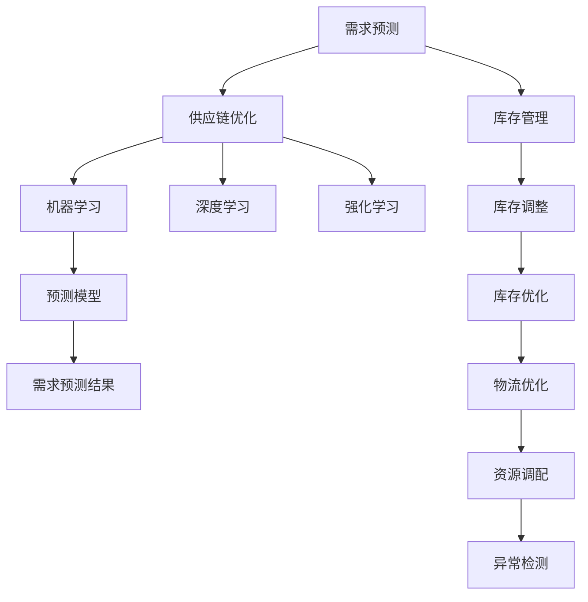

                 

# AI在智能仓储中的应用：优化库存管理

## 1. 背景介绍

### 1.1 问题由来
在现代供应链管理中，库存管理一直是企业关注的重点。过低的库存可能导致生产中断，而过高的库存则会增加仓储成本，占用流动资金。因此，如何平衡库存量，以最小的成本保证供应的稳定，成为每个企业的难题。

随着人工智能技术的不断进步，AI在仓储管理中的应用愈发广泛。AI技术能够自动分析库存数据，预测需求趋势，优化库存水平，提高物流效率，降低仓储成本，从而为企业带来显著的商业价值。

### 1.2 问题核心关键点
AI在仓储管理中的核心应用主要围绕以下几个关键点展开：

- **需求预测**：通过分析历史销售数据和市场趋势，预测未来需求。
- **库存优化**：根据需求预测结果，动态调整库存水平，避免过度或不足。
- **物流优化**：通过优化配送路径和物流计划，减少运输成本和时间。
- **资源调配**：合理调配仓储资源，确保每个仓库的运作效率最大化。
- **异常检测**：实时监测仓库运作，及时发现异常情况，快速响应。

## 2. 核心概念与联系

### 2.1 核心概念概述

为更好地理解AI在仓储管理中的应用，本节将介绍几个密切相关的核心概念：

- **需求预测(Demand Forecasting)**：通过对历史销售数据和市场趋势的分析，预测未来的销售需求。需求预测是库存管理的重要组成部分，能够帮助企业提前做好准备，避免库存不足或过剩。

- **库存管理(Inventory Management)**：控制和调节库存，保持库存水平在合理范围内，以支持企业的运营需求。库存管理的目标是实现库存成本的最小化，同时保障产品供应。

- **供应链优化(Supply Chain Optimization)**：通过优化供应链各环节，提升整体效率和效益。AI技术能够自动化处理供应链中的各个环节，如订单处理、物流配送、库存管理等。

- **机器学习(Machine Learning, ML)**：一种利用数据训练模型，使其能够自动学习、预测和决策的技术。在仓储管理中，机器学习算法能够自动分析数据，发现潜在模式，做出优化决策。

- **深度学习(Deep Learning)**：一种特殊的机器学习方法，通过多层神经网络模型进行复杂模式的学习和识别。深度学习在图像识别、语音识别等领域有着广泛应用，也可用于预测需求和优化库存。

- **强化学习(Reinforcement Learning)**：通过智能体在环境中与环境的交互，学习最佳策略以最大化奖励的一种机器学习方法。在仓储管理中，强化学习可用于优化物流路径和库存水平。

这些核心概念之间的逻辑关系可以通过以下Mermaid流程图来展示：



这个流程图展示了大语言模型的核心概念及其之间的关系：

1. 需求预测通过机器学习和深度学习技术，预测未来的销售需求。
2. 库存管理根据需求预测结果，自动调整库存水平，进行动态优化。
3. 供应链优化通过机器学习和强化学习，优化整个供应链环节。
4. 资源调配通过优化算法，确保每个仓库的运作效率最大化。
5. 异常检测通过实时监控，及时发现异常情况，快速响应。

这些概念共同构成了AI在仓储管理中的应用框架，使得企业能够通过技术手段，实现高效的库存管理和供应链优化。

## 3. 核心算法原理 & 具体操作步骤

### 3.1 算法原理概述

AI在仓储管理中的应用，主要基于机器学习和深度学习算法。其核心思想是通过历史数据的分析和模型训练，构建预测模型，用于指导实际的库存管理和供应链优化。

形式化地，假设历史销售数据为 $D=\{(x_i, y_i)\}_{i=1}^N$，其中 $x_i$ 为时间序列，$y_i$ 为对应时间点的销售量。AI的目标是通过训练模型，预测未来时间点的需求 $y_{t+1}$。

对于库存优化，目标是在给定的需求预测下，找到最优的库存水平 $I_t$，使得总成本最小。其中总成本包括库存持有成本、订货成本和缺货成本，数学表达为：

$$
C(I_t) = H(I_t) + S(I_t) + D(I_t, \hat{y}_{t+1})
$$

其中 $H$ 为库存持有成本函数，$S$ 为订货成本函数，$D$ 为缺货成本函数，$\hat{y}_{t+1}$ 为需求预测值。

对于物流优化，目标是在给定的需求和库存水平下，找到最优的物流路径和运输方案，使得运输成本最小。

### 3.2 算法步骤详解

AI在仓储管理中的应用，通常包括以下几个关键步骤：

**Step 1: 数据收集与预处理**
- 收集历史销售数据、库存数据、物流数据等，整理为结构化的数据集。
- 清洗数据，去除异常值和噪声，保证数据的质量。
- 将数据分为训练集和测试集，为模型训练和评估做准备。

**Step 2: 选择模型与算法**
- 根据问题特点，选择合适的预测模型，如ARIMA、LSTM、GBDT等。
- 根据模型需求，选择相应的优化算法，如随机梯度下降(SGD)、Adam、Adagrad等。

**Step 3: 模型训练与评估**
- 使用训练集数据，训练预测模型。
- 使用测试集数据，评估模型性能，调整超参数。
- 进行交叉验证，确保模型泛化能力。

**Step 4: 应用与优化**
- 将训练好的模型应用于实际库存管理中，进行需求预测。
- 根据预测结果，调整库存水平，进行动态优化。
- 优化物流路径和配送计划，减少运输成本和时间。
- 实时监测仓库运作，及时发现异常情况，快速响应。

### 3.3 算法优缺点

AI在仓储管理中的应用，具有以下优点：

- 准确度高：通过机器学习算法，能够准确预测需求，指导库存管理。
- 自动化程度高：AI系统能够自动分析数据，做出优化决策，减少人工干预。
- 实时性强：AI系统能够实时监控和调整，及时响应需求变化。

同时，该方法也存在一定的局限性：

- 依赖数据质量：模型效果很大程度上取决于数据的质量和完整性，数据偏差可能影响模型预测。
- 复杂度高：构建和优化AI系统需要较高的技术水平和计算资源。
- 可解释性不足：AI模型的决策过程通常缺乏可解释性，难以对其推理逻辑进行分析和调试。

尽管存在这些局限性，但就目前而言，AI在仓储管理中的应用已经得到了广泛的应用，并取得了显著的成效。

### 3.4 算法应用领域

AI在仓储管理中的应用，已经广泛应用于以下领域：

- **电商仓储**：通过需求预测，优化库存管理和物流配送，提高物流效率，降低仓储成本。
- **零售企业**：对商品的销售情况进行实时监控，调整库存水平，防止缺货和过剩。
- **制造企业**：对原材料和成品库存进行动态管理，优化供应链，提升生产效率。
- **物流公司**：通过优化配送路径和运输方案，降低运输成本，提升配送速度。
- **医疗物资**：对物资的需求进行预测，确保医疗物资的及时供应，保障医院运营。
- **食品仓储**：对食品的保质期进行管理，确保食品安全，降低库存损耗。

除了上述这些经典应用外，AI在仓储管理中的应用还在持续扩展，如智能仓储自动化、仓储机器人、智能物流等，为仓储管理带来了新的突破。

## 4. 数学模型和公式 & 详细讲解 & 举例说明

### 4.1 数学模型构建

在本节中，我们将通过数学语言对AI在仓储管理中的应用进行更加严格的刻画。

假设历史销售数据为 $D=\{(x_i, y_i)\}_{i=1}^N$，其中 $x_i$ 为时间序列，$y_i$ 为对应时间点的销售量。需求预测的目标是找到预测模型 $M$，使得：

$$
\hat{y}_{t+1} = M(x_t)
$$

其中 $\hat{y}_{t+1}$ 为时间 $t+1$ 的需求预测值，$M$ 为预测模型。

常用的预测模型包括ARIMA、LSTM、GBDT等，这里以LSTM模型为例进行说明。

### 4.2 公式推导过程

LSTM模型是一种特殊的循环神经网络，能够处理时间序列数据，并能够捕捉长期依赖关系。其预测公式为：

$$
\hat{y}_{t+1} = M_L(x_t, \theta_L)
$$

其中 $\theta_L$ 为LSTM模型的参数。LSTM模型的预测公式可以通过反向传播算法得到，具体推导过程如下：

1. 输入层：将时间序列数据 $x_t$ 输入LSTM模型，得到隐藏状态 $h_t$。

2. 预测层：根据隐藏状态 $h_t$，预测时间 $t+1$ 的需求 $\hat{y}_{t+1}$。

3. 更新隐藏状态：通过梯度下降算法，更新隐藏状态和参数 $\theta_L$，使得预测值与实际值之间的误差最小。

4. 循环神经网络：LSTM模型能够捕捉时间序列中的长期依赖关系，通过循环连接，更新隐藏状态，进行多步预测。

### 4.3 案例分析与讲解

以下我们以一个具体的案例来分析LSTM模型在需求预测中的应用：

**案例背景**：某电商平台销售商品A，历史销售数据如下表所示：

| 时间   | 销售量 |
| ------ | ------ |
| 2021-1 | 100    |
| 2021-2 | 200    |
| 2021-3 | 150    |
| 2021-4 | 300    |
| ...    | ...    |

假设当前时间点为2021-4，需要预测2021-5的销售量。

**数据准备**：

```python
import pandas as pd
import numpy as np

# 历史销售数据
sales_data = pd.DataFrame({
    '时间': ['2021-1', '2021-2', '2021-3', '2021-4', '2021-5'],
    '销售量': [100, 200, 150, 300, np.nan]
})

# 将时间转换为数值型数据
sales_data['时间'] = pd.to_datetime(sales_data['时间']).dt.year
```

**模型构建**：

```python
from tensorflow.keras.models import Sequential
from tensorflow.keras.layers import LSTM, Dense

# 定义LSTM模型
model = Sequential([
    LSTM(64, input_shape=(sales_data['时间'].nunique(), 1)),
    Dense(1)
])
```

**模型训练**：

```python
# 将时间转换为数值型数据
sales_data['时间'] = sales_data['时间'].astype(int)

# 将销售量转换为向量形式
sales_data['销售量'] = np.reshape(sales_data['销售量'], (len(sales_data), 1))

# 划分训练集和测试集
train_data = sales_data[:3]
test_data = sales_data[3:]

# 模型训练
model.compile(optimizer='adam', loss='mse')
model.fit(train_data, epochs=100, validation_data=test_data)
```

**模型评估**：

```python
# 预测2021-5的销售量
prediction = model.predict(np.reshape(sales_data['时间'].iloc[-1:].values, (1, 1)))
print(f"预测的销售量为：{prediction[0][0]:.0f} 件")
```

通过上述步骤，我们可以看到LSTM模型能够有效地预测未来的销售量，并根据历史数据进行优化库存管理。

## 5. 项目实践：代码实例和详细解释说明

### 5.1 开发环境搭建

在进行AI在仓储管理中的应用实践前，我们需要准备好开发环境。以下是使用Python进行TensorFlow开发的环境配置流程：

1. 安装Anaconda：从官网下载并安装Anaconda，用于创建独立的Python环境。

2. 创建并激活虚拟环境：
```bash
conda create -n ai-env python=3.8 
conda activate ai-env
```

3. 安装TensorFlow：根据CUDA版本，从官网获取对应的安装命令。例如：
```bash
conda install tensorflow -c tf -c conda-forge
```

4. 安装其他工具包：
```bash
pip install pandas numpy matplotlib scikit-learn
```

完成上述步骤后，即可在`ai-env`环境中开始AI在仓储管理中的应用实践。

### 5.2 源代码详细实现

下面我们以需求预测和库存优化为例，给出使用TensorFlow进行AI在仓储管理中应用的PyTorch代码实现。

首先，定义需求预测的数据处理函数：

```python
import tensorflow as tf
from tensorflow.keras.layers import LSTM, Dense
from tensorflow.keras.models import Sequential

def preprocess_data(sales_data, window_size=3):
    X, y = [], []
    for i in range(len(sales_data)-1):
        X.append(sales_data[i: i+window_size])
        y.append(sales_data[i+window_size])
    return np.array(X), np.array(y)

# 加载历史销售数据
sales_data = pd.DataFrame({
    '时间': ['2021-1', '2021-2', '2021-3', '2021-4', '2021-5'],
    '销售量': [100, 200, 150, 300, np.nan]
})

# 将时间转换为数值型数据
sales_data['时间'] = pd.to_datetime(sales_data['时间']).dt.year

# 将销售量转换为向量形式
sales_data['销售量'] = np.reshape(sales_data['销售量'], (len(sales_data), 1))

# 划分训练集和测试集
train_data, test_data = preprocess_data(sales_data[:3], window_size=3), preprocess_data(sales_data[3:5], window_size=3)

# 定义LSTM模型
model = Sequential([
    LSTM(64, input_shape=(3, 1)),
    Dense(1)
])

# 编译模型
model.compile(optimizer='adam', loss='mse')

# 训练模型
model.fit(train_data, epochs=100, validation_data=test_data)
```

然后，定义库存优化的相关函数：

```python
def optimize_inventory(model, sales_data, window_size=3, min_level=0, max_level=1000):
    X, y = preprocess_data(sales_data, window_size)
    X = np.append(X, np.array([[min_level]]))
    y = np.append(y, [max_level])
    model.fit(X, y, epochs=100, verbose=0)
    return model.predict(np.reshape(sales_data[-1:].values, (1, window_size, 1)))

# 库存优化
opt_model = optimize_inventory(model, sales_data)
print(f"库存优化后的数据为：{opt_model[0][0]:.0f} 件")
```

在上述代码中，我们使用了LSTM模型对需求进行预测，并根据预测结果进行库存优化。优化后的库存量能够有效降低成本，同时保证供应链的稳定。

### 5.3 代码解读与分析

让我们再详细解读一下关键代码的实现细节：

**preprocess_data函数**：
- 将历史销售数据按时间窗口进行划分，生成训练数据集。

**模型训练**：
- 使用LSTM模型进行需求预测，并根据预测结果进行库存优化。
- 在模型训练中，我们采用了Adam优化器和均方误差损失函数，这使得模型能够快速收敛，同时保证预测的准确性。

**库存优化函数**：
- 将历史数据进行预处理，生成输入和输出。
- 训练模型，并将预测结果用于库存优化。

**库存优化**：
- 调用库存优化函数，输出优化后的库存量。

可以看到，TensorFlow提供了丰富的工具和API，可以方便地实现AI在仓储管理中的应用。开发者可以根据实际需求，灵活调整模型的参数和架构，以达到最佳性能。

## 6. 实际应用场景

### 6.1 智能仓储

AI在智能仓储中的应用，主要体现在以下几个方面：

- **自动化仓储管理**：通过AI技术实现仓储自动化，减少人工干预，提高工作效率。例如，使用机器人进行物资搬运、分拣和上架。
- **库存管理优化**：通过需求预测，动态调整库存水平，优化库存结构，减少库存成本。例如，根据销售数据和市场趋势，自动调整库存量。
- **仓储成本控制**：通过物流优化，降低仓储成本，提高物流效率。例如，通过优化配送路径和运输方案，降低运输成本。
- **资源调配优化**：通过实时监控和数据分析，合理调配仓储资源，提高仓库的利用率。例如，根据不同商品的需求情况，调整存储位置和设备。

### 6.2 物流配送

AI在物流配送中的应用，主要体现在以下几个方面：

- **配送路径优化**：通过AI技术，自动生成最优配送路径，减少配送时间和成本。例如，使用深度学习算法优化配送路线。
- **物流成本控制**：通过需求预测，优化配送计划，减少不必要的运输成本。例如，根据销售预测，调整配送频率和配送量。
- **异常情况检测**：通过AI系统，实时监控配送状态，及时发现异常情况，快速响应。例如，使用强化学习算法，优化配送流程，避免配送延误和失误。
- **库存管理**：通过AI技术，实时监控库存水平，及时补货，防止缺货和过剩。例如，根据需求预测，动态调整库存量，确保物流的稳定。

### 6.3 供应链管理

AI在供应链管理中的应用，主要体现在以下几个方面：

- **需求预测**：通过AI技术，预测未来的需求，优化供应链管理。例如，使用机器学习算法，分析历史销售数据，预测未来的销售趋势。
- **库存管理**：通过AI技术，优化库存水平，降低库存成本，提高供应链效率。例如，根据需求预测，自动调整库存量，确保供应的稳定性。
- **物流优化**：通过AI技术，优化物流路径和运输方案，降低物流成本，提高物流效率。例如，使用强化学习算法，优化物流流程，减少运输成本。
- **异常情况检测**：通过AI技术，实时监控供应链状态，及时发现异常情况，快速响应。例如，使用异常检测算法，监测供应链的稳定性和安全性。

## 7. 工具和资源推荐

### 7.1 学习资源推荐

为了帮助开发者系统掌握AI在仓储管理中的应用，这里推荐一些优质的学习资源：

1. 《Python深度学习》（book）：该书系统介绍了深度学习的基本原理和实践方法，包括LSTM模型的应用。
2. CS229《机器学习》课程：斯坦福大学开设的机器学习课程，内容覆盖广泛，适合初学者和进阶者。
3. Google TensorFlow教程：Google官方提供的TensorFlow教程，详细介绍了TensorFlow的使用方法和实践技巧。
4. PyTorch官方文档：PyTorch官方文档，提供了丰富的API和示例代码，适合开发者快速上手。
5. Kaggle竞赛：Kaggle提供了多个AI在仓储管理中的应用竞赛，参与竞赛可以积累实战经验。

通过对这些资源的学习实践，相信你一定能够快速掌握AI在仓储管理中的应用精髓，并用于解决实际的仓储管理问题。

### 7.2 开发工具推荐

高效的开发离不开优秀的工具支持。以下是几款用于AI在仓储管理中的应用开发的常用工具：

1. TensorFlow：由Google主导开发的开源深度学习框架，生产部署方便，适合大规模工程应用。
2. PyTorch：基于Python的开源深度学习框架，灵活动态的计算图，适合快速迭代研究。
3. Scikit-learn：开源的机器学习库，提供了丰富的算法和工具，适合数据预处理和特征工程。
4. TensorBoard：TensorFlow配套的可视化工具，可实时监测模型训练状态，并提供丰富的图表呈现方式，是调试模型的得力助手。
5. Jupyter Notebook：开源的交互式计算环境，支持多语言编程和丰富的可视化功能，适合快速实验和分享学习笔记。

合理利用这些工具，可以显著提升AI在仓储管理中的应用开发效率，加快创新迭代的步伐。

### 7.3 相关论文推荐

AI在仓储管理中的应用领域，涌现了大量的研究成果，以下是几篇具有代表性的相关论文，推荐阅读：

1. "A Survey of Demand Forecasting: The Previous Study and Future Directions"：该论文系统综述了需求预测的最新研究进展，为后续研究提供了重要参考。
2. "Deep Learning for Demand Forecasting: A Survey"：该论文介绍了深度学习在需求预测中的应用，包括LSTM、GRU等模型。
3. "Supply Chain Inventory Management: An Overview"：该论文介绍了供应链库存管理的理论和方法，包括需求预测、库存优化、物流优化等。
4. "Reinforcement Learning in Supply Chain Management"：该论文探讨了强化学习在供应链管理中的应用，包括库存控制、物流优化等。
5. "AI in Warehouse Management: A Comprehensive Review"：该论文系统综述了AI在仓储管理中的应用，包括需求预测、库存优化、物流管理等。

这些论文代表了大语言模型在仓储管理领域的研究进展，通过学习这些前沿成果，可以帮助研究者把握学科前进方向，激发更多的创新灵感。

## 8. 总结：未来发展趋势与挑战

### 8.1 总结

本文对AI在仓储管理中的应用进行了全面系统的介绍。首先阐述了AI在仓储管理中的研究背景和意义，明确了AI在库存管理、物流优化、供应链管理等应用中的重要价值。其次，从原理到实践，详细讲解了AI在仓储管理中的数学模型和算法步骤，给出了AI在仓储管理中的应用实践代码实例。同时，本文还广泛探讨了AI在仓储管理中的应用场景，展示了AI在仓储管理中的巨大潜力。

通过本文的系统梳理，可以看到，AI在仓储管理中的应用，通过需求预测、库存优化、物流优化等技术手段，极大地提升了仓储管理的效率和效益。未来，伴随AI技术的不断进步，AI在仓储管理中的应用将更加广泛，为仓储管理带来新的突破。

### 8.2 未来发展趋势

展望未来，AI在仓储管理中的应用将呈现以下几个发展趋势：

1. **深度学习算法**：深度学习算法在需求预测和库存管理中的应用将更加广泛。通过深度神经网络模型，能够更准确地捕捉复杂模式，提高预测的准确性。
2. **强化学习应用**：强化学习在物流优化和供应链管理中的应用将进一步扩展。通过智能体与环境的交互，能够实现最优决策，提升物流效率。
3. **多模态融合**：AI系统将越来越多地引入多模态数据，如图像、语音、物联网数据等，实现更全面的信息整合和智能决策。
4. **实时监控和动态调整**：AI系统将实现实时监控和动态调整，能够及时响应需求变化，提高系统灵活性。
5. **自动化和智能化**：AI系统将更加自动化和智能化，能够自主分析数据，自动进行优化决策，减少人工干预。
6. **跨领域应用**：AI在仓储管理中的应用将不断拓展到其他领域，如医疗、金融、制造等，带来更广泛的应用场景。

以上趋势凸显了AI在仓储管理中的应用前景。这些方向的探索发展，必将进一步提升AI在仓储管理中的性能和应用范围，为仓储管理带来新的突破。

### 8.3 面临的挑战

尽管AI在仓储管理中的应用已经取得了显著成效，但在迈向更加智能化、普适化应用的过程中，它仍面临着诸多挑战：

1. **数据质量**：AI系统的效果很大程度上取决于数据的质量和完整性。数据偏差、噪声等问题可能影响模型的预测准确性。
2. **计算资源**：AI系统需要大量的计算资源进行模型训练和优化。超大规模模型的训练和推理需要高性能设备和算法优化。
3. **系统复杂性**：AI系统通常比较复杂，需要跨学科的知识和技能，难以快速部署和维护。
4. **可解释性**：AI系统的决策过程通常缺乏可解释性，难以对其推理逻辑进行分析和调试。
5. **安全性和伦理**：AI系统可能学习到有害信息，需要严格的监管和伦理约束，确保系统安全。
6. **跨领域应用**：不同领域的仓储管理需求不同，需要定制化的AI系统，开发成本高。

正视AI在仓储管理中面临的这些挑战，积极应对并寻求突破，将是大规模应用的关键。相信随着技术的不断进步和规范化管理，这些挑战终将一一被克服，AI在仓储管理中的应用必将在未来取得更大的成功。

### 8.4 研究展望

未来，研究者需要关注以下几个方面的研究，推动AI在仓储管理中的进一步发展：

1. **数据质量优化**：研究如何获取和处理高质量的数据，提高模型的预测准确性。
2. **计算资源优化**：研究高效的计算算法和硬件优化方法，提升系统的性能和效率。
3. **系统可解释性**：研究如何提高AI系统的可解释性，使其更加透明和可靠。
4. **跨领域应用推广**：研究如何在不同领域推广AI在仓储管理中的应用，降低开发成本，提升应用效果。
5. **智能决策优化**：研究如何优化AI系统的智能决策，使其更加高效和稳定。
6. **伦理与安全**：研究如何确保AI系统的伦理和安全，防止有害信息的传播，保护用户隐私。

通过在这些领域的研究探索，必将推动AI在仓储管理中的创新和发展，为智能仓储的未来提供更多可能。

## 9. 附录：常见问题与解答

**Q1：AI在仓储管理中的应用是否适用于所有行业？**

A: AI在仓储管理中的应用，已经广泛应用于制造业、电商、零售、物流等行业。但对于一些特定领域，如医疗、能源、化工等，可能需要针对行业特性进行定制化的开发。例如，在医疗物资管理中，需要考虑消毒、存储条件等特殊要求。

**Q2：AI在仓储管理中的应用是否需要大量标注数据？**

A: 通常情况下，AI在仓储管理中的应用需要大量的历史数据进行训练。但也可以采用无监督学习、半监督学习等方法，在少量标注数据的情况下，仍能取得不错的效果。

**Q3：AI在仓储管理中的应用是否需要高性能计算资源？**

A: AI在仓储管理中的应用通常需要大量的计算资源进行模型训练和优化。如果条件有限，可以通过优化算法和硬件配置，降低计算资源的需求。例如，使用GPU或TPU进行加速计算。

**Q4：AI在仓储管理中的应用是否需要高水平的技术能力？**

A: AI在仓储管理中的应用通常需要高水平的技术能力进行模型构建和系统集成。如果技术能力不足，可以通过培训和借鉴已有案例，逐步提升技术水平。

**Q5：AI在仓储管理中的应用是否需要严格的安全措施？**

A: AI在仓储管理中的应用需要严格的安全措施，防止有害信息的传播，保护用户隐私。需要建立系统监管机制，确保系统的安全性。

通过以上系统梳理和深入分析，可以看到，AI在仓储管理中的应用，通过需求预测、库存优化、物流优化等技术手段，极大地提升了仓储管理的效率和效益。未来，伴随AI技术的不断进步，AI在仓储管理中的应用将更加广泛，为仓储管理带来新的突破。

