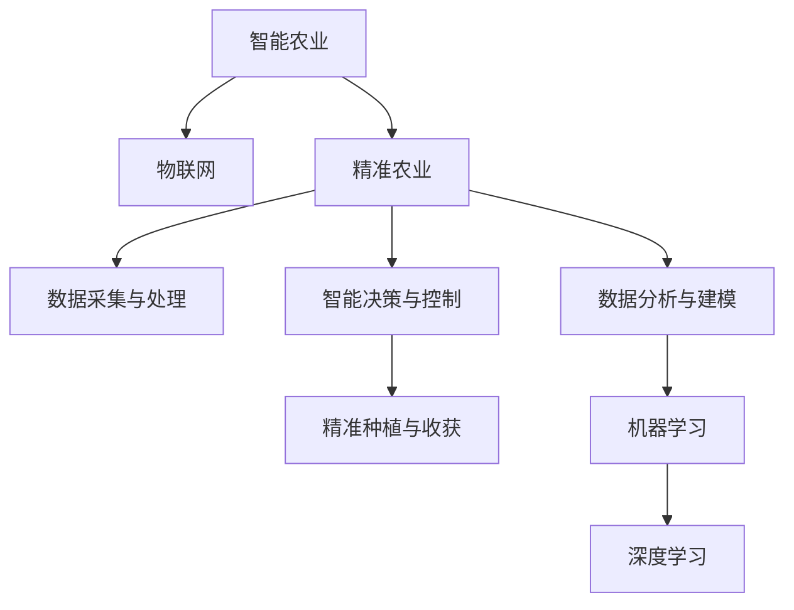

                 

# AI在智能农业中的角色：精准种植与收获

## 1. 背景介绍

### 1.1 问题由来
农业是人类赖以生存和发展的基础，传统农业生产方式主要以经验为主，难以适应快速变化的市场需求和环境挑战。随着人工智能技术的快速发展，尤其是大数据、云计算、物联网等新兴技术在农业领域的应用，智能农业成为现代农业发展的重要方向。

智能农业通过集成传感器、监控设备、遥感卫星、无人机、机器人和其他先进技术，对农作物生长状态进行实时监测、数据分析和智能化管理，实现精准种植和自动化管理，从而提高农业生产效率和农产品品质。

### 1.2 问题核心关键点
智能农业的核心在于利用人工智能技术，对海量农业数据进行高效处理和深度学习，从而指导精准种植和收获。主要包括以下几个方面：

- **数据采集与处理**：实时采集农田环境数据，包括温度、湿度、光照、土壤含水量等，并进行清洗和标准化。
- **数据分析与建模**：利用机器学习算法，建立作物生长模型，预测作物生长趋势和病虫害风险。
- **智能决策与控制**：根据分析结果，实时调整灌溉、施肥、施肥、喷药等农业生产操作，实现自动化精准管理。
- **精准种植与收获**：通过AI算法优化种植策略，提高产量和质量，减少资源浪费。

### 1.3 问题研究意义
智能农业的AI应用具有重要意义：

1. **提升生产效率**：智能农业可以显著提高农业生产效率，降低人力和物资成本，增加收益。
2. **提高资源利用率**：AI技术能够优化水、肥、药等资源的利用，减少浪费，提高环境友好性。
3. **促进可持续发展**：智能农业通过精确管理和科学决策，能够有效应对气候变化和资源短缺等问题，促进农业可持续发展。
4. **推动农业现代化**：AI技术的广泛应用，有助于实现农业生产的机械化、智能化和自动化，推动农业现代化进程。

## 2. 核心概念与联系

### 2.1 核心概念概述

为更好地理解AI在智能农业中的应用，本节将介绍几个密切相关的核心概念：

- **人工智能(AI)**：一种模拟人类智能行为的技术，包括机器学习、深度学习、自然语言处理、计算机视觉等。
- **智能农业**：结合现代信息技术，实现农业生产的智能化管理，提升生产效率和资源利用率。
- **精准农业**：利用高科技手段，实现对农田环境的精确监测和智能化管理，提升农业生产效率和资源利用率。
- **物联网(IoT)**：通过传感器和网络技术，实现设备和数据的互联互通，形成实时监测和控制网络。
- **机器学习**：通过算法让机器从数据中学习规律，并应用到新数据中进行预测和决策。
- **深度学习**：一种机器学习技术，通过多层神经网络模拟人脑的思维过程，实现更高级别的特征提取和决策。

这些核心概念之间的逻辑关系可以通过以下Mermaid流程图来展示：



这个流程图展示了大规模智能农业的核心概念及其之间的关系：

1. 智能农业通过物联网技术实现对农田环境的实时监测和数据采集。
2. 数据经过清洗和标准化后，利用机器学习和深度学习算法进行分析和建模。
3. 基于模型预测结果，智能决策系统进行自动化精准管理。
4. 通过精准农业技术，实现精准种植与收获，提高产量和质量。

这些概念共同构成了智能农业的核心框架，使其能够高效地实现农业生产的智能化和精准化。

## 3. 核心算法原理 & 具体操作步骤
### 3.1 算法原理概述

AI在智能农业中的核心算法包括机器学习、深度学习和优化算法。以深度学习为例，其基本原理是通过多层神经网络对数据进行特征提取和模式识别，最终输出预测结果。具体步骤如下：

1. **数据收集与处理**：采集农田环境数据，包括温度、湿度、光照、土壤含水量等，并进行清洗和标准化。
2. **特征提取**：利用深度学习算法，对采集数据进行特征提取和特征选择，得到更重要的特征表示。
3. **模型训练**：利用训练数据集，训练深度学习模型，通过反向传播算法更新模型参数，最小化预测误差。
4. **模型验证与优化**：在验证数据集上评估模型性能，根据评估结果调整模型参数，优化模型预测准确度。
5. **模型应用**：将训练好的模型应用于实际农业生产中，进行精准管理与决策。

### 3.2 算法步骤详解

以深度学习算法为例，具体步骤包括：

1. **数据准备**：
   - 采集农田环境数据，包括温度、湿度、光照、土壤含水量等。
   - 将数据进行清洗和标准化，处理缺失值和异常值。
   - 将数据分为训练集、验证集和测试集。

2. **模型选择与构建**：
   - 选择深度学习模型，如卷积神经网络(CNN)、循环神经网络(RNN)、长短期记忆网络(LSTM)等。
   - 构建模型架构，包括输入层、隐藏层、输出层等。
   - 设置模型超参数，如学习率、批大小、迭代轮数等。

3. **模型训练**：
   - 使用训练数据集，对模型进行训练，通过反向传播算法更新模型参数。
   - 在每个epoch结束时，使用验证集评估模型性能。
   - 根据评估结果调整学习率、正则化参数等超参数。
   - 重复训练过程，直到模型收敛或达到预设的迭代轮数。

4. **模型评估与优化**：
   - 使用测试数据集评估模型性能，计算准确率、召回率、F1-score等指标。
   - 分析模型预测结果与实际结果的差异，找出误分类原因。
   - 对模型进行微调或重新训练，优化模型性能。

5. **模型应用**：
   - 将训练好的模型应用于实际农业生产中。
   - 实时监测农田环境数据，输入模型进行预测和决策。
   - 根据模型预测结果，调整灌溉、施肥、施肥、喷药等农业生产操作。

### 3.3 算法优缺点

AI在智能农业中具有以下优点：

1. **高效精准**：AI算法能够高效地处理大量农业数据，准确预测作物生长趋势和病虫害风险，实现精准管理。
2. **自动化**：通过自动化的决策和控制，减少人力和时间成本，提高农业生产效率。
3. **适应性强**：AI算法能够适应不同地区和作物的生长条件，灵活应用到多种农业场景。
4. **提升资源利用率**：通过优化水、肥、药等资源的利用，减少浪费，提高环境友好性。

同时，AI在智能农业中也存在一些缺点：

1. **数据质量要求高**：AI算法对数据质量要求高，需要高质量、全面和时效性的农业数据支持。
2. **模型复杂度高**：深度学习模型结构复杂，训练和推理过程消耗大量计算资源。
3. **成本高**：传感器、监控设备等硬件设施成本较高，技术实施和维护需要专业知识和资源。
4. **技术壁垒**：需要具备一定的技术积累和专业技能，对农业从业者要求较高。

### 3.4 算法应用领域

AI在智能农业中的应用广泛，具体包括：

1. **精准农业**：利用AI技术，对农田环境进行实时监测和数据分析，实现精准种植和自动化管理。
2. **农业机器人**：通过AI算法，控制农业机器人进行播种、施肥、喷药等操作，提高生产效率。
3. **智能灌溉系统**：利用AI算法，根据作物生长状态和环境数据，智能调整灌溉策略，提高水资源利用率。
4. **病虫害预测与防治**：利用AI算法，预测病虫害爆发趋势，指导防治决策，减少病虫害损失。
5. **农业无人机**：利用AI算法，控制无人机进行农田巡查、病虫害检测和精准喷洒，提高作业效率和精准度。
6. **农业气象预测**：利用AI算法，预测气象变化趋势，指导农业生产调整和灾害预警。

这些应用领域展示了AI在智能农业中的广泛适用性，有助于推动农业生产的智能化和现代化。

## 4. 数学模型和公式 & 详细讲解 & 举例说明

### 4.1 数学模型构建

为了更系统地理解AI在智能农业中的应用，本节将详细讲解AI算法在农业生产中的数学模型构建。

假设农田环境数据集为 $D=\{(x_i,y_i)\}_{i=1}^N$，其中 $x_i=(x_{i1},x_{i2},...,x_{iK})$ 表示第 $i$ 个样本的特征向量，$y_i$ 表示对应的标签（如病害状态）。

构建深度学习模型的数学模型为：

$$
\hat{y}=f(\theta,x)=\text{softmax}(W\cdot x+b)
$$

其中 $f$ 为神经网络模型，$W$ 为模型参数矩阵，$b$ 为偏置向量，$\theta$ 为模型参数，$x$ 为输入特征向量，$y$ 为预测标签。

模型的损失函数通常为交叉熵损失函数，其形式为：

$$
\mathcal{L}(\theta)=\frac{1}{N}\sum_{i=1}^N -y_i\log\hat{y}_i
$$

模型的优化目标为最小化损失函数 $\mathcal{L}(\theta)$。

### 4.2 公式推导过程

以二分类问题为例，利用交叉熵损失函数推导模型的优化目标。

首先，定义模型的输出为 $\hat{y}_i=[\hat{y}_{i1},\hat{y}_{i2}]$，其中 $\hat{y}_{i1}$ 表示样本 $x_i$ 属于正类的概率。

则交叉熵损失函数为：

$$
\mathcal{L}(\theta)=\frac{1}{N}\sum_{i=1}^N[-y_i\log\hat{y}_{i1}-(1-y_i)\log(1-\hat{y}_{i1})]
$$

根据链式法则，损失函数对参数 $\theta$ 的梯度为：

$$
\frac{\partial\mathcal{L}(\theta)}{\partial\theta}=-\frac{1}{N}\sum_{i=1}^N(y_i-\hat{y}_{i1})\frac{\partial\hat{y}_{i1}}{\partial\theta}
$$

其中 $\frac{\partial\hat{y}_{i1}}{\partial\theta}=\frac{\partial}{\partial\theta}(W\cdot x_i+b)_{1}$。

通过反向传播算法，不断更新模型参数 $\theta$，最小化损失函数 $\mathcal{L}(\theta)$，最终得到最优模型参数 $\hat{\theta}$。

### 4.3 案例分析与讲解

以深度学习在智能灌溉系统中的应用为例，详细讲解AI算法在实际农业生产中的应用。

假设智能灌溉系统需要根据农田环境数据，自动调整灌溉策略。系统采集的农田环境数据包括温度、湿度、光照、土壤含水量等，通过传感器实时传入系统。

系统首先对数据进行预处理和特征提取，构建深度学习模型，如卷积神经网络(CNN)，对农田环境数据进行特征提取和特征选择。

然后，利用训练数据集，对模型进行训练，通过反向传播算法更新模型参数，最小化预测误差。模型预测结果表示农田是否需要灌溉。

最后，根据模型预测结果，智能灌溉系统自动调整灌溉策略，优化水资源利用率，实现精准灌溉。

## 5. 项目实践：代码实例和详细解释说明

### 5.1 开发环境搭建

在进行AI在智能农业中的应用开发前，需要准备好开发环境。以下是使用Python进行TensorFlow开发的环境配置流程：

1. 安装Anaconda：从官网下载并安装Anaconda，用于创建独立的Python环境。

2. 创建并激活虚拟环境：
```bash
conda create -n ai-env python=3.8 
conda activate ai-env
```

3. 安装TensorFlow：根据CUDA版本，从官网获取对应的安装命令。例如：
```bash
conda install tensorflow==2.6 -c conda-forge
```

4. 安装PyTorch：
```bash
conda install torch torchvision torchaudio -c pytorch
```

5. 安装各类工具包：
```bash
pip install numpy pandas scikit-learn matplotlib tqdm jupyter notebook ipython
```

完成上述步骤后，即可在`ai-env`环境中开始AI在智能农业中的应用开发。

### 5.2 源代码详细实现

下面以智能灌溉系统为例，给出使用TensorFlow进行深度学习模型构建的PyTorch代码实现。

首先，定义农田环境数据的处理函数：

```python
import tensorflow as tf
from tensorflow.keras.layers import Input, Dense, Dropout, Conv2D, MaxPooling2D, Flatten
from tensorflow.keras.models import Model

def process_data(data, labels):
    features = []
    for x, y in zip(data, labels):
        # 数据预处理
        x = preprocess(x)
        features.append(x)
    features = tf.stack(features)
    labels = tf.stack(labels)
    return features, labels
```

然后，定义深度学习模型：

```python
def build_model():
    input_layer = Input(shape=(None, None, 3))
    x = Conv2D(32, 3, activation='relu')(input_layer)
    x = MaxPooling2D(2)(x)
    x = Conv2D(64, 3, activation='relu')(x)
    x = MaxPooling2D(2)(x)
    x = Flatten()(x)
    x = Dense(256, activation='relu')(x)
    x = Dropout(0.5)(x)
    output_layer = Dense(1, activation='sigmoid')(x)
    model = Model(inputs=input_layer, outputs=output_layer)
    return model
```

接着，定义模型训练函数：

```python
def train_model(model, data, labels, epochs=10, batch_size=32):
    model.compile(optimizer='adam', loss='binary_crossentropy', metrics=['accuracy'])
    model.fit(data, labels, epochs=epochs, batch_size=batch_size, validation_split=0.2)
```

最后，启动训练流程：

```python
data = ...
labels = ...
model = build_model()
train_model(model, data, labels)
```

以上就是使用TensorFlow进行深度学习模型构建和训练的完整代码实现。可以看到，TensorFlow提供了丰富的深度学习组件，可以快速构建和训练深度学习模型，实现智能灌溉系统的智能决策和控制。

### 5.3 代码解读与分析

让我们再详细解读一下关键代码的实现细节：

**process_data函数**：
- 将农田环境数据和标签进行处理，预处理数据并进行标准化。
- 将数据集分割为特征和标签两部分。

**build_model函数**：
- 定义深度学习模型架构，包括输入层、卷积层、池化层、全连接层和输出层。
- 设置模型超参数，如卷积核大小、激活函数、池化大小、全连接层神经元数等。

**train_model函数**：
- 定义模型编译参数，包括优化器、损失函数、评估指标等。
- 使用训练数据集对模型进行训练，设置训练轮数和批次大小。
- 在每个epoch结束时，评估模型在验证集上的性能。

通过这些代码，可以构建一个简单的智能灌溉系统，利用深度学习算法对农田环境数据进行特征提取和模型预测，实现自动化的精准灌溉。

## 6. 实际应用场景

### 6.1 智能灌溉系统

智能灌溉系统是AI在智能农业中最重要的应用之一。传统的灌溉方式依赖人工经验，难以适应复杂多变的农田环境，导致水资源浪费严重。

智能灌溉系统通过实时监测农田环境数据，构建深度学习模型，实现对灌溉策略的自动化决策。系统可以根据实时环境数据，智能调整灌溉量和灌溉频率，优化水资源利用率，提高作物产量和品质。

### 6.2 病虫害预测与防治

农业生产中，病虫害是主要威胁之一。传统的病虫害防治依赖人工经验，难以全面覆盖农田。AI算法可以通过分析历史病虫害数据，构建预测模型，提前识别病虫害爆发趋势，指导防治决策。

智能农业系统采集农田环境数据，利用机器学习算法，建立病虫害预测模型。模型可以预测病虫害的发生时间和范围，指导农民及时采取防治措施，减少病虫害损失。

### 6.3 农业机器人

农业机器人是AI在智能农业中的另一大应用方向。传统农业机械化程度低，劳动强度大，难以满足现代化农业生产需求。

智能农业机器人通过AI算法，实现自主导航、自动采摘、自动播种等功能，提高农业生产效率和自动化程度。例如，利用深度学习算法，机器人可以识别农作物和果实，自动定位采摘位置，提升采摘效率和准确度。

### 6.4 未来应用展望

随着AI技术的不断发展，智能农业将在未来展现出更加广泛的应用前景：

1. **智慧农场**：通过物联网技术，将农田环境数据与云计算平台结合，实现对整个农场的智能化管理。智慧农场可以实现实时监控、智能决策、精准管理，大幅提升农业生产效率和资源利用率。
2. **无人驾驶农机**：利用AI算法，实现无人驾驶农机的自动化操作，提高农业机械化水平。无人驾驶农机可以通过实时环境感知和路径规划，自动完成播种、施肥、喷药等操作。
3. **精准农业**：利用AI算法，实现对农田环境和作物生长状态的实时监测和分析，实现精准种植和精准管理。精准农业可以大幅提高作物产量和品质，减少资源浪费。
4. **农业气象预测**：利用AI算法，预测农业气象变化趋势，指导农业生产调整和灾害预警。智能气象预测系统可以提供精准的气象数据，帮助农民制定合理的种植和收获计划。

这些应用场景展示了AI在智能农业中的巨大潜力和广泛应用，未来AI技术将在农业生产中扮演更加重要的角色。

## 7. 工具和资源推荐
### 7.1 学习资源推荐

为了帮助开发者系统掌握AI在智能农业中的应用，这里推荐一些优质的学习资源：

1. TensorFlow官方文档：TensorFlow的官方文档提供了完整的深度学习组件和API文档，是深度学习开发的基础。
2. PyTorch官方文档：PyTorch的官方文档提供了丰富的深度学习组件和教程，是深度学习开发的重要参考。
3. Udacity深度学习课程：Udacity提供的深度学习课程，由Google、Coursera等知名机构合作开发，系统讲解深度学习算法和应用。
4. Coursera深度学习专项课程：Coursera提供的深度学习专项课程，由Andrew Ng等知名专家讲授，涵盖深度学习基础知识和应用实践。
5. Kaggle深度学习竞赛：Kaggle提供的深度学习竞赛，可以实战练习深度学习算法和模型优化。

通过对这些资源的学习实践，相信你一定能够快速掌握AI在智能农业中的应用，并用于解决实际的农业问题。

### 7.2 开发工具推荐

高效的开发离不开优秀的工具支持。以下是几款用于AI在智能农业中应用的常用工具：

1. TensorFlow：由Google主导开发的深度学习框架，生产部署方便，适合大规模工程应用。
2. PyTorch：基于Python的开源深度学习框架，灵活动态，适合快速迭代研究。
3. Jupyter Notebook：开源的交互式开发环境，支持代码编写、数据可视化、代码共享等。
4. Anaconda：开源的Python发行版，提供丰富的科学计算和数据分析工具，支持虚拟环境管理。
5. TensorBoard：TensorFlow配套的可视化工具，可以实时监测模型训练状态，并提供丰富的图表呈现方式。

合理利用这些工具，可以显著提升AI在智能农业中的应用开发效率，加快创新迭代的步伐。

### 7.3 相关论文推荐

AI在智能农业中的应用源于学界的持续研究。以下是几篇奠基性的相关论文，推荐阅读：

1. Deep Learning in Agricultural Robotics：利用深度学习算法，实现农业机器人的自主导航和操作。
2. Crop Monitoring Using a Low-Cost Drone and Convolutional Neural Networks：利用无人机和深度学习算法，监测作物生长状态，识别病害趋势。
3. Predictive Analytics for Crop Yield Using Deep Learning Models：利用深度学习模型，预测作物产量，优化种植策略。
4. Sparse Agricultural Robot Navigation with Imagery Data and Deep Learning：利用深度学习算法，实现农业机器人的自主导航和路径规划。
5. Deep Learning-Based Plant Disease Detection and Classification：利用深度学习算法，实现作物病害的自动检测和分类。

这些论文代表了大规模智能农业的研究方向，通过学习这些前沿成果，可以帮助研究者把握学科前进方向，激发更多的创新灵感。

## 8. 总结：未来发展趋势与挑战

### 8.1 总结

本文对AI在智能农业中的应用进行了全面系统的介绍。首先阐述了AI在智能农业中的研究背景和意义，明确了AI技术在智能农业中的重要地位和应用方向。其次，从原理到实践，详细讲解了深度学习算法在智能灌溉系统、病虫害预测与防治、农业机器人等实际应用中的具体实现。同时，本文还广泛探讨了AI在智能农业中的广泛应用前景，展示了AI技术在农业生产中的巨大潜力和广阔前景。

通过本文的系统梳理，可以看到，AI在智能农业中的应用正在快速发展，为农业生产带来了颠覆性的变革。未来，随着AI技术的不断进步和应用，智能农业必将在全球范围内迎来新的发展机遇，推动农业现代化进程。

### 8.2 未来发展趋势

展望未来，AI在智能农业中的应用将呈现以下几个发展趋势：

1. **自动化程度提升**：智能农业系统将实现更高级别的自动化操作，如无人驾驶农机、智能灌溉系统等，大幅提高农业生产效率和资源利用率。
2. **数据驱动决策**：智能农业系统将更加依赖数据驱动的决策，通过深度学习算法分析大量农田数据，实现精准种植和智能管理。
3. **跨领域融合**：AI技术将与其他技术进行更深入的融合，如物联网、云计算、区块链等，形成更加智能化的农业生态系统。
4. **智能化农具普及**：智能农具将逐渐普及，提升农业机械化水平，实现精准农业、智能农业的广泛应用。
5. **可持续发展**：智能农业系统将更加注重环境保护和资源利用，通过精准管理和智能决策，实现农业生产的可持续发展。

这些趋势展示了AI在智能农业中的广阔前景，未来AI技术将在农业生产中扮演更加重要的角色，推动农业现代化进程。

### 8.3 面临的挑战

尽管AI在智能农业中的应用取得了瞩目成就，但在迈向更加智能化、普适化应用的过程中，仍面临诸多挑战：

1. **数据质量瓶颈**：智能农业系统依赖大量的农田环境数据，数据质量对模型性能至关重要。但目前农田数据采集和处理技术尚不成熟，难以获取高质量、全面和时效性的数据。
2. **模型复杂度高**：深度学习模型结构复杂，训练和推理过程消耗大量计算资源。硬件设施成本较高，技术实施和维护需要专业知识和资源。
3. **技术壁垒高**：智能农业系统需要具备一定的技术积累和专业技能，对农业从业者要求较高。缺乏专业的技术支持和管理经验，难以有效运行智能农业系统。
4. **资源利用率低**：智能农业系统的广泛应用，需要大量的传感器、监控设备等硬件设施，资源利用率较低，投资回报率不高。

这些挑战需要各方共同努力，推动智能农业技术的不断进步和应用普及。未来，随着技术不断成熟和推广，智能农业必将在全球范围内迎来新的发展机遇，推动农业现代化进程。

### 8.4 研究展望

面对智能农业中的各种挑战，未来的研究需要在以下几个方面寻求新的突破：

1. **数据采集与处理**：探索更加高效、全面、低成本的数据采集与处理技术，提高数据质量，降低技术实施成本。
2. **模型优化与迁移学习**：开发更加高效、轻量级的深度学习模型，通过迁移学习技术，降低对高精度、高计算资源的需求。
3. **智能化农具**：开发更加智能、灵活的农业机器人、智能灌溉系统等农具，提升农业机械化水平，实现精准农业、智能农业的广泛应用。
4. **跨领域融合**：推动AI技术与其他技术进行更深入的融合，如物联网、云计算、区块链等，形成更加智能化的农业生态系统。
5. **可持续发展**：注重环境保护和资源利用，通过精准管理和智能决策，实现农业生产的可持续发展。

这些研究方向将引领智能农业技术迈向更高的台阶，为构建安全、可靠、可解释、可控的智能农业系统铺平道路。面向未来，智能农业技术还需要与其他技术进行更深入的融合，多路径协同发力，共同推动农业现代化进程。

## 9. 附录：常见问题与解答

**Q1：智能农业系统中使用的深度学习模型是否需要在大规模数据上进行预训练？**

A: 是的，智能农业系统中使用的深度学习模型通常需要在大规模数据上进行预训练，以获取更广泛的特征表示和更强的泛化能力。预训练可以提高模型的通用性和鲁棒性，降低对特定数据集的依赖，提升模型在实际应用中的表现。

**Q2：智能农业系统中的深度学习模型是否可以迁移学习？**

A: 是的，深度学习模型可以通过迁移学习技术，在少量标注数据上进行微调，提升模型在特定任务上的性能。例如，可以利用预训练的深度学习模型在特定的农作物病害检测任务上进行微调，提高模型的识别准确率和泛化能力。

**Q3：智能农业系统中如何处理农田环境数据的质量问题？**

A: 农田环境数据的质量对智能农业系统的性能至关重要。数据采集和处理过程中，需要注意以下问题：

1. 数据采集设备的精度和稳定性，确保数据准确可靠。
2. 数据清洗和标准化，处理缺失值和异常值，减少噪音干扰。
3. 数据标注和注释，提供标注数据的详细说明，帮助模型更好地理解数据。

**Q4：智能农业系统中如何实现跨领域融合？**

A: 智能农业系统可以通过以下方式实现跨领域融合：

1. 利用物联网技术，将农田环境数据与其他数据源（如气象数据、气候数据等）结合，形成更全面的数据集。
2. 利用云计算平台，提供高效的数据存储和处理能力，实现跨领域数据共享和协同分析。
3. 利用区块链技术，保障数据安全和隐私，实现跨领域数据透明和可信共享。
4. 利用自然语言处理技术，实现人机交互和智能决策，提升用户体验和系统可操作性。

**Q5：智能农业系统中的深度学习模型如何进行优化？**

A: 深度学习模型优化可以从以下几个方面进行：

1. 数据增强：通过数据扩充和增强，提高模型泛化能力和鲁棒性。
2. 正则化技术：如L2正则、Dropout、早停等，防止过拟合。
3. 模型压缩：通过模型剪枝、量化等技术，降低模型复杂度和计算资源消耗。
4. 迁移学习：通过在大规模数据上预训练模型，然后在特定任务上进行微调，提高模型效果和泛化能力。
5. 多模型集成：通过集成多个模型的预测结果，提高模型鲁棒性和准确度。

通过这些优化方法，可以显著提高智能农业系统中深度学习模型的性能和可靠性。

这些研究方向的探索，必将引领智能农业技术迈向更高的台阶，为构建安全、可靠、可解释、可控的智能农业系统铺平道路。面向未来，智能农业技术还需要与其他技术进行更深入的融合，多路径协同发力，共同推动农业现代化进程。总之，智能农业技术需要在数据、算法、工程、业务等多个维度进行全面优化，方能真正实现农业生产的智能化和现代化。

