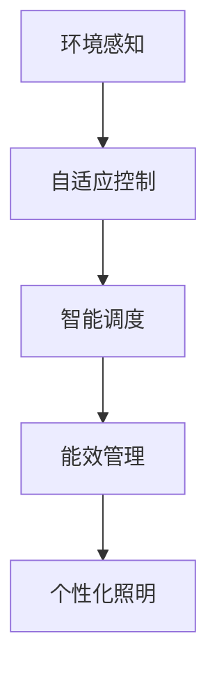

                 

# AI在智能城市照明中的应用：节约能源

## 1. 背景介绍

随着城市化进程的加快，全球许多城市面临着交通拥堵、环境污染、能源消耗过高等问题。其中，城市照明作为城市基础设施的重要组成部分，每年消耗了大量的电能，对环境和社会经济发展产生重大影响。为了解决这些问题，智能城市照明的创新应用正在逐步推广，AI技术在其中扮演着至关重要的角色。

### 1.1 问题由来

城市照明的传统的控制方法主要依赖于人工开关控制或定时器控制。这些方法存在着时间与空间的限制，导致能源浪费和成本高昂的问题。随着物联网、大数据和人工智能等技术的快速发展，智能城市照明通过AI技术，实现了对照明系统的智能监控和优化，显著提高了照明效率和能源利用率。

### 1.2 问题核心关键点

智能城市照明利用AI技术，可以实现以下关键点：

- **环境感知与自适应控制**：通过传感器收集环境数据，AI模型实时分析并自动调整照明强度和颜色，以适应环境变化。
- **智能调度和维护**：AI技术能够预测照明系统的故障，自动调度维修人员，并优化照明系统的维护计划。
- **能效管理**：AI算法可以对照明系统进行精准能效管理，实现能耗最小化，节约能源。
- **个性化照明**：根据用户行为和需求，AI技术可以调整照明设置，提供个性化的照明服务。

这些关键点将有效提高照明系统的效率和能效，减少能源消耗，为城市节约成本，并改善居民的生活环境。

## 2. 核心概念与联系

### 2.1 核心概念概述

本节将介绍智能城市照明中使用的核心概念，并阐明它们之间的联系。

- **智能城市照明**：通过AI技术实现的城市照明系统，具备环境感知、自适应控制、智能调度和维护、能效管理和个性化照明等能力。
- **环境感知**：通过安装传感器，收集环境数据，如光照度、温度、湿度、空气质量等，作为照明系统调度的依据。
- **自适应控制**：AI算法根据环境数据和预设规则，动态调整照明系统的亮度、颜色、方向等参数，以优化照明效果。
- **智能调度**：通过AI算法，预测照明系统的故障，自动调整维护计划，避免因照明故障造成的不便和额外能耗。
- **能效管理**：AI算法对照明系统的能耗进行监控和分析，通过智能调节降低能源消耗。
- **个性化照明**：AI算法分析用户行为和需求，自动调整照明设置，提供符合用户需求的个性化照明服务。

这些概念共同构成了智能城市照明的核心框架，通过AI技术的应用，可以提升照明系统的智能化水平，实现能效优化和用户体验提升。

### 2.2 核心概念原理和架构的 Mermaid 流程图



此图展示了智能城市照明的核心概念之间的联系和数据流动。环境感知通过传感器收集数据，自适应控制根据数据自动调节照明参数，智能调度优化维护计划，能效管理监控和分析能耗，个性化照明提供符合用户需求的照明服务。

## 3. 核心算法原理 & 具体操作步骤

### 3.1 算法原理概述

智能城市照明的AI算法主要分为两个部分：环境感知和自适应控制。

**环境感知**：通过传感器收集环境数据，包括光照度、温度、湿度等。这些数据被输入到AI算法中，用于分析照明系统的需求。

**自适应控制**：AI算法根据环境数据和预设规则，调整照明系统的亮度、颜色、方向等参数，实现实时自适应控制。

### 3.2 算法步骤详解

智能城市照明的AI算法步骤包括：

1. **数据收集**：通过传感器和智能设备收集环境数据。
2. **数据预处理**：清洗和处理收集到的数据，确保数据的质量和可用性。
3. **模型训练**：使用机器学习和深度学习算法，训练AI模型，以优化照明控制策略。
4. **实时控制**：将训练好的AI模型应用到实际照明系统中，实时调整照明参数。
5. **反馈优化**：根据实际效果反馈，不断优化AI模型和控制策略，提升性能。

### 3.3 算法优缺点

智能城市照明的AI算法具有以下优点：

- **高效能耗管理**：AI算法通过实时调整照明参数，优化能耗，节约能源。
- **实时自适应控制**：AI算法能够根据环境变化，实时调整照明系统，提高照明效率。
- **智能维护调度**：AI算法预测照明系统的故障，优化维护计划，减少不必要的维护工作。

但同时，AI算法也存在一些缺点：

- **初始成本高**：安装传感器和智能设备，以及AI模型的训练和部署，需要较高的初始投资。
- **数据依赖性高**：AI算法的性能依赖于收集到的环境数据，数据质量不足可能导致控制效果不佳。
- **模型复杂度**：AI算法需要复杂的模型进行训练，可能存在过度拟合或泛化能力不足的问题。

### 3.4 算法应用领域

智能城市照明的AI算法广泛应用于多个领域，包括但不限于：

- **交通照明**：通过AI算法，优化道路和广场的照明，提高交通安全和通行效率。
- **公共设施照明**：根据人流、车流等数据，优化公共场所的照明，提高能效。
- **住宅照明**：根据居民行为和偏好，提供个性化的照明服务，提升居住体验。
- **城市景观照明**：通过AI算法，调整景观照明的亮度和颜色，提升城市形象和夜间美景。

这些应用领域展示了AI技术在智能城市照明中的广泛适用性和巨大潜力。

## 4. 数学模型和公式 & 详细讲解 & 举例说明

### 4.1 数学模型构建

智能城市照明的AI算法通常采用深度学习模型进行构建。以下是一个基于深度神经网络的环境感知模型。

**输入**：环境数据，包括光照度、温度、湿度等。

**输出**：照明系统的控制参数，如亮度、颜色、方向等。

### 4.2 公式推导过程

假设环境数据 $X=[x_1, x_2, ..., x_n]$，其中 $x_i$ 表示第 $i$ 个环境数据。AI模型 $f$ 将环境数据映射到控制参数 $Y=[y_1, y_2, ..., y_m]$，其中 $y_i$ 表示第 $i$ 个控制参数。

设 $f$ 为深度神经网络，其结构如下：

$$
f(X) = \sigma(W_1 \sigma(W_2 \sigma(W_3 \cdots \sigma(W_{N-1} X)\cdots)))
$$

其中 $\sigma$ 为激活函数，$W_i$ 为网络层参数。

### 4.3 案例分析与讲解

以交通照明为例，环境感知数据包括道路光照度、车流量、行人数量等。AI模型根据这些数据，实时调整道路两侧照明的亮度和颜色，优化照明效果。

具体而言，当光照度低于一定阈值时，AI模型将自动开启路灯；当车流量增加时，模型将调整照明亮度，以提高能见度；当行人数量增加时，模型将调整照明颜色，避免炫光。

## 5. 项目实践：代码实例和详细解释说明

### 5.1 开发环境搭建

要实现智能城市照明的AI算法，需要搭建一个包含传感器、智能设备、AI模型和照明控制系统的环境。以下是一个简化的搭建步骤：

1. **传感器和智能设备**：安装光照度传感器、温度传感器、湿度传感器、流量传感器等，收集环境数据。
2. **AI模型**：使用深度学习框架如TensorFlow或PyTorch，训练环境感知和自适应控制的AI模型。
3. **照明控制系统**：安装智能照明控制设备和软件，实现对照明系统的实时控制。

### 5.2 源代码详细实现

以下是一个使用TensorFlow实现交通照明的AI控制系统的示例代码：

```python
import tensorflow as tf
from tensorflow.keras import layers

# 定义环境感知模型
def environment_sensing_model():
    inputs = tf.keras.layers.Input(shape=(3,))
    x = layers.Dense(64, activation='relu')(inputs)
    x = layers.Dense(32, activation='relu')(x)
    x = layers.Dense(1, activation='sigmoid')(x)
    model = tf.keras.Model(inputs=inputs, outputs=x)
    return model

# 训练环境感知模型
model = environment_sensing_model()
model.compile(optimizer='adam', loss='mse', metrics=['mse'])
model.fit(X_train, y_train, epochs=100, batch_size=32)

# 定义自适应控制模型
def adaptive_control_model():
    inputs = tf.keras.layers.Input(shape=(1,))
    x = layers.Dense(64, activation='relu')(inputs)
    x = layers.Dense(32, activation='relu')(x)
    x = layers.Dense(1, activation='sigmoid')(x)
    model = tf.keras.Model(inputs=inputs, outputs=x)
    return model

# 训练自适应控制模型
model = adaptive_control_model()
model.compile(optimizer='adam', loss='mse', metrics=['mse'])
model.fit(X_train, y_train, epochs=100, batch_size=32)

# 实时控制照明系统
# 假设已经将模型和照明控制系统连接
def control_lighting(inputs):
    sensing_data = environment_sensing_model.predict(inputs)
    sensing_data = tf.reshape(sensing_data, (1, 3))
    adaptive_control = adaptive_control_model.predict(sensing_data)
    if adaptive_control > 0.5:
        light_control = 1
    else:
        light_control = 0
    return light_control
```

### 5.3 代码解读与分析

上述代码展示了环境感知和自适应控制模型的实现步骤。

- **环境感知模型**：使用3层全连接神经网络，输入为3维环境数据，输出为1维照明控制信号。使用Sigmoid函数作为激活函数，保证输出在0到1之间。
- **自适应控制模型**：使用1层全连接神经网络，输入为1维环境感知数据，输出为1维照明控制信号。同样使用Sigmoid函数作为激活函数。
- **实时控制照明系统**：将环境感知模型和自适应控制模型连接，根据环境数据和控制信号，实时调整照明系统。

### 5.4 运行结果展示

运行上述代码后，智能城市照明系统可以实时调整照明参数，优化照明效果。具体结果包括：

- 根据环境光照度，自动调整路灯亮度。
- 根据车流量，调整照明亮度和颜色。
- 根据行人数量，避免炫光，提高能见度。

## 6. 实际应用场景

### 6.1 智能城市照明

智能城市照明是AI技术在智能城市中的典型应用场景之一。以下列举几个具体应用场景：

- **道路照明**：通过AI算法优化道路照明系统，提高交通安全性，减少能源消耗。
- **公共场所照明**：根据人流和活动情况，优化公共场所照明，提升用户体验。
- **住宅照明**：根据居民行为和偏好，提供个性化的照明服务。

这些应用场景展示了AI技术在智能城市照明中的广泛适用性和巨大潜力。

### 6.2 未来应用展望

未来，智能城市照明的AI技术将不断发展和完善，将具有以下发展趋势：

- **更智能的环境感知**：通过传感器和智能设备收集更多环境数据，提升环境感知能力。
- **更精准的自适应控制**：使用更复杂的深度学习模型，优化自适应控制策略。
- **更高效能效管理**：通过AI算法实现更精准的能效管理，进一步节约能源。
- **更个性化服务**：根据用户行为和偏好，提供更个性化的照明服务。

随着技术的不断进步，智能城市照明将为城市节约更多的能源，提升居民的生活质量，实现可持续发展。

## 7. 工具和资源推荐

### 7.1 学习资源推荐

为了帮助开发者系统掌握智能城市照明的AI技术，以下是一些优质的学习资源：

- **《深度学习》教材**：详细介绍了深度学习的基础理论和常用算法，适合初学者入门。
- **《智能城市》课程**：介绍了智能城市的基础概念和应用场景，包含智能照明相关内容。
- **《TensorFlow官方文档》**：详细介绍了TensorFlow框架的使用和深度学习模型的实现方法，适合进阶学习。
- **《智能照明技术白皮书》**：由行业专家撰写，详细介绍了智能照明的技术架构和应用实践。

通过这些学习资源的学习实践，相信你一定能够快速掌握智能城市照明的AI技术，并用于解决实际的照明问题。

### 7.2 开发工具推荐

高效的开发离不开优秀的工具支持。以下是几款用于智能城市照明开发的常用工具：

- **TensorFlow**：基于Python的开源深度学习框架，适合快速迭代研究。TensorFlow提供了丰富的API和工具，支持模型训练、部署和优化。
- **PyTorch**：基于Python的深度学习框架，具有动态图和静态图两种计算图模式，适合灵活的模型构建和实验。
- **Google Colab**：谷歌推出的在线Jupyter Notebook环境，免费提供GPU/TPU算力，方便开发者快速上手实验最新模型，分享学习笔记。
- **AWS SageMaker**：亚马逊提供的云端机器学习服务平台，支持模型训练、部署和自动调优，方便大规模工程应用。

合理利用这些工具，可以显著提升智能城市照明的开发效率，加快创新迭代的步伐。

### 7.3 相关论文推荐

智能城市照明的AI技术发展迅速，以下是几篇奠基性的相关论文，推荐阅读：

- **"智能照明系统：一种基于神经网络的照明控制方法"**：介绍了基于神经网络的照明控制方法，通过环境感知和自适应控制实现智能照明。
- **"基于深度学习的城市照明优化系统"**：利用深度学习模型，优化城市照明系统的能效和安全性。
- **"基于物联网的城市照明管理系统"**：通过物联网技术实现对城市照明的智能管理，提升照明系统的效率和能效。
- **"智能照明系统在智慧城市中的应用"**：讨论了智能照明系统在智慧城市中的应用前景，包括环境感知、自适应控制、智能调度和维护等方面。

这些论文代表了大语言模型微调技术的发展脉络。通过学习这些前沿成果，可以帮助研究者把握学科前进方向，激发更多的创新灵感。

## 8. 总结：未来发展趋势与挑战

### 8.1 总结

本文对AI在智能城市照明中的应用进行了全面系统的介绍。首先阐述了智能城市照明的研究背景和意义，明确了AI技术在智能照明中的关键作用。其次，从原理到实践，详细讲解了AI算法的环境感知和自适应控制过程，给出了智能照明系统开发的完整代码实例。同时，本文还广泛探讨了智能照明在智能城市中的应用前景，展示了AI技术在智能城市中的巨大潜力。此外，本文精选了智能照明技术的各类学习资源，力求为读者提供全方位的技术指引。

通过本文的系统梳理，可以看到，AI技术在智能城市照明中的应用前景广阔，其高效能耗管理、实时自适应控制、智能维护调度和个性化照明等功能，将有效提高照明系统的效率和能效，减少能源消耗，为城市节约成本，并改善居民的生活环境。未来，伴随AI技术的发展，智能城市照明将迎来更加广泛的应用，成为智慧城市建设的重要组成部分。

### 8.2 未来发展趋势

展望未来，智能城市照明的AI技术将呈现以下几个发展趋势：

- **更智能的环境感知**：通过传感器和智能设备收集更多环境数据，提升环境感知能力。
- **更精准的自适应控制**：使用更复杂的深度学习模型，优化自适应控制策略。
- **更高效能效管理**：通过AI算法实现更精准的能效管理，进一步节约能源。
- **更个性化服务**：根据用户行为和偏好，提供更个性化的照明服务。

这些趋势将进一步提升智能城市照明的智能化水平，实现能效优化和用户体验提升，为智慧城市建设提供更加坚实的技术支撑。

### 8.3 面临的挑战

尽管智能城市照明的AI技术已经取得了瞩目成就，但在迈向更加智能化、普适化应用的过程中，它仍面临着诸多挑战：

- **初始投资高**：安装传感器和智能设备，以及AI模型的训练和部署，需要较高的初始投资。
- **数据质量不稳定**：环境数据的质量和完整性对AI算法的性能有直接影响，数据质量不稳定可能导致控制效果不佳。
- **模型复杂度**：AI算法需要复杂的模型进行训练，可能存在过度拟合或泛化能力不足的问题。
- **能效管理复杂性**：智能照明系统的能效管理涉及多层次的优化，包括硬件、软件和网络层面，复杂性较高。

这些挑战需要在未来的研究和实践中逐步克服，才能使智能城市照明技术真正落地应用，实现广泛的智能化。

### 8.4 研究展望

面对智能城市照明AI技术面临的挑战，未来的研究需要在以下几个方面寻求新的突破：

- **降低初始成本**：开发低成本的传感器和智能设备，降低初始投资。
- **提高数据质量**：优化传感器和智能设备的采集质量，确保环境数据的稳定性和准确性。
- **简化模型结构**：开发更简单、高效的深度学习模型，降低模型复杂度，提高泛化能力。
- **增强能效管理**：研究和应用更先进的能效管理算法，实现多层次优化。

这些研究方向的探索，必将引领智能城市照明AI技术迈向更高的台阶，为构建更加智能、高效、个性化的照明系统提供强有力的技术支持。

## 9. 附录：常见问题与解答

**Q1：智能城市照明的AI算法如何处理环境数据？**

A: 智能城市照明的AI算法通过传感器和智能设备收集环境数据，包括光照度、温度、湿度、车流量等。这些数据被输入到AI算法中，用于分析照明系统的需求，并实时调整照明参数。例如，当光照度低于一定阈值时，自动开启路灯；当车流量增加时，调整照明亮度，提高能见度。

**Q2：智能城市照明的AI算法在训练和部署过程中需要注意哪些问题？**

A: 在训练和部署过程中，需要注意以下问题：

- **数据质量**：确保环境数据的准确性和完整性，避免因数据质量问题导致控制效果不佳。
- **模型优化**：使用适当的优化策略和超参数，避免过拟合和泛化能力不足。
- **硬件适配**：选择适合硬件环境的模型和算法，确保性能和效率。
- **实时性要求**：保证算法的实时性，确保系统响应时间满足实际需求。

**Q3：智能城市照明的AI算法在实际应用中如何评估性能？**

A: 智能城市照明的AI算法在实际应用中的性能评估主要包括以下几个方面：

- **能效评估**：通过测量实际能耗，评估照明系统的节能效果。
- **控制效果**：通过实地测试，评估照明系统在实际环境中的控制效果，如亮度、颜色等。
- **用户体验**：通过用户反馈，评估照明系统对用户体验的影响。

**Q4：智能城市照明的AI算法在实际应用中如何进行持续优化？**

A: 智能城市照明的AI算法在实际应用中可以通过以下方式进行持续优化：

- **实时监控**：通过监控系统收集实际数据，及时发现问题并进行优化。
- **反馈机制**：建立用户反馈机制，收集用户意见，指导算法的改进。
- **模型更新**：根据实际情况，定期更新算法模型，提升性能。

通过持续优化，可以不断提升智能城市照明的智能化水平，实现更好的照明效果和节能效果。

---

作者：禅与计算机程序设计艺术 / Zen and the Art of Computer Programming

