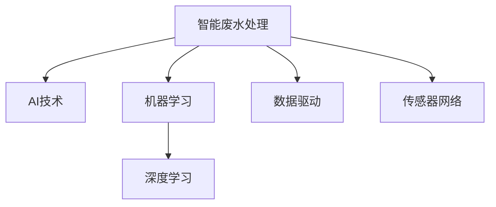

                 

# AI在智能废水处理中的应用：提高净化效率

> 关键词：智能废水处理, AI技术, 净化效率, 污水处理, 环境治理

## 1. 背景介绍

### 1.1 问题由来
随着工业化和城市化的快速发展，废水处理问题日益严峻。传统的废水处理方式主要依赖于物理、化学、生物等方法，但存在处理效率低、成本高、维护难等问题。近年来，随着人工智能（AI）技术的突破，智能废水处理系统开始崭露头角，利用AI技术通过数据驱动的方式，极大地提高了废水处理的效率和精度，逐渐成为废水处理行业的重要发展方向。

### 1.2 问题核心关键点
智能废水处理系统通常包括以下几个关键点：

- 数据采集与监测：通过传感器、监测设备实时采集废水中的水质指标，如pH、氨氮、COD等。
- 数据分析与建模：利用AI算法对采集的数据进行分析和建模，建立废水处理模型。
- 智能控制与优化：根据模型预测结果，自动调整废水处理设备的运行参数，优化处理效果。
- 自动化维护：对废水处理设备进行智能维护，预测并预防设备故障，延长设备寿命。
- 节能降耗：通过智能控制和优化，减少能源消耗和药剂使用量，降低废水处理成本。

### 1.3 问题研究意义
智能废水处理系统的应用，不仅能够显著提高废水处理的效率和精度，还能有效降低处理成本，改善环境治理效果。对于工业企业、城市污水处理厂等具有重要现实意义。

## 2. 核心概念与联系

### 2.1 核心概念概述

为更好地理解智能废水处理系统，本节将介绍几个密切相关的核心概念：

- 智能废水处理（Smart Wastewater Treatment）：通过AI技术，对废水处理过程进行智能监控、分析、优化和控制的废水处理系统。
- 人工智能（Artificial Intelligence, AI）：利用计算机科学和数学技术，模拟、延伸和扩展人类智能能力的科技。
- 机器学习（Machine Learning, ML）：AI的一个分支，指通过数据训练算法，使机器具备学习和改进的能力。
- 深度学习（Deep Learning, DL）：机器学习的一个高级阶段，利用神经网络进行复杂数据的表示和建模。
- 数据驱动（Data-Driven）：基于数据进行决策和优化的方式。
- 传感器网络（Sensor Network）：由多个传感器节点组成的无线传感器网络，用于实时采集废水水质数据。

这些核心概念之间的逻辑关系可以通过以下Mermaid流程图来展示：



这个流程图展示了大语言模型的核心概念及其之间的关系：

1. 智能废水处理通过AI技术，实现数据驱动、机器学习和深度学习的结合。
2. 数据采集通过传感器网络进行实时监测。
3. 机器学习和深度学习模型对采集的数据进行分析建模。
4. 智能控制系统根据模型预测结果，自动调整处理参数，优化废水处理效果。

这些概念共同构成了智能废水处理系统的基本框架，使其能够利用AI技术进行高效、精准、自适应的废水处理。

## 3. 核心算法原理 & 具体操作步骤
### 3.1 算法原理概述

智能废水处理系统的核心算法原理主要基于深度学习技术。通过深度学习模型对采集到的废水水质数据进行分析和建模，建立废水处理模型。该模型能够根据实时水质数据，预测最佳的废水处理参数，自动控制处理设备，优化废水处理过程。

深度学习模型通常由多层神经网络构成，每一层神经网络都能学习到数据的不同抽象特征。通过多层的堆叠和组合，深度学习模型能够学习到更为复杂、高级的特征表示。

在智能废水处理中，深度学习模型主要应用于以下几个环节：

- 特征提取：利用卷积神经网络（CNN）或长短期记忆网络（LSTM）等模型，对废水水质数据进行特征提取。
- 状态预测：利用循环神经网络（RNN）或变分自编码器（VAE）等模型，对废水处理状态进行预测。
- 参数优化：利用强化学习（RL）或梯度下降（GD）等算法，对废水处理参数进行优化。
- 实时控制：利用控制器优化算法，根据模型预测结果，自动调整废水处理设备的运行参数。

### 3.2 算法步骤详解

智能废水处理系统的算法步骤主要包括以下几个关键环节：

**Step 1: 数据采集与预处理**
- 通过传感器网络实时采集废水水质数据，如pH、氨氮、COD等。
- 对采集的数据进行预处理，如去噪、归一化、缺失值填补等。

**Step 2: 特征提取**
- 利用CNN或LSTM等深度学习模型，对预处理后的数据进行特征提取。
- 通过池化、降维等操作，提取重要的特征表示。

**Step 3: 模型训练与优化**
- 利用强化学习或梯度下降等算法，训练深度学习模型。
- 利用交叉验证等技术，评估模型性能，并进行超参数优化。

**Step 4: 状态预测**
- 利用RNN或VAE等模型，对废水处理状态进行预测。
- 将预测结果与实际处理效果进行对比，不断调整模型参数。

**Step 5: 智能控制与优化**
- 根据模型预测结果，自动调整废水处理设备的运行参数。
- 利用控制器优化算法，确保废水处理过程的高效和稳定。

**Step 6: 实时监测与维护**
- 通过传感器网络实时监测废水处理效果。
- 对处理设备进行智能维护，预测并预防设备故障。

### 3.3 算法优缺点

智能废水处理系统基于深度学习技术，具有以下优点：

- 高效精确：利用深度学习模型进行数据分析和建模，能够快速准确地预测废水处理效果。
- 自适应性强：深度学习模型能够根据实时水质数据，自动调整处理参数，适应不同的废水处理场景。
- 自动化程度高：智能控制系统能够自动控制废水处理设备，无需人工干预，提高处理效率。
- 维护成本低：通过智能维护，预测并预防设备故障，减少维护成本。

但该系统也存在一些局限性：

- 数据依赖：深度学习模型依赖于高质量、大量标注数据，数据质量差或数据量不足，会影响模型性能。
- 模型复杂度：深度学习模型参数量大，需要高性能计算资源。
- 模型解释性不足：深度学习模型的黑盒特性，难以解释其内部工作机制。
- 环境适应性：深度学习模型训练和优化需要大量计算资源，难以适应极端环境。

### 3.4 算法应用领域

智能废水处理系统在以下几个领域得到广泛应用：

- 工业废水处理：对工业废水进行智能处理，提高处理效率，减少污染排放。
- 城市污水处理：对城市生活污水进行智能处理，改善城市环境质量。
- 农村废水处理：对农村生活废水进行智能处理，提升农村居民生活水平。
- 水质监测与预警：对水质进行实时监测，预警潜在污染风险。
- 废热回收：利用智能控制系统，回收废水处理过程中产生的废热，用于能源利用。

## 4. 数学模型和公式 & 详细讲解 & 举例说明

### 4.1 数学模型构建

智能废水处理系统基于深度学习模型，建立废水处理数学模型。假设有n个废水处理设备的输入和输出数据，即：

$$
x_i = [x_{i1}, x_{i2}, ..., x_{im}]^T, y_i = [y_{i1}, y_{i2}, ..., y_{in}]^T, i = 1, ..., n
$$

其中 $x_i$ 表示第i个设备的输入数据，$y_i$ 表示第i个设备的输出数据。

构建深度学习模型 $f_{\theta}(x)$ 对废水处理效果进行预测：

$$
y_i = f_{\theta}(x_i)
$$

其中 $\theta$ 为模型参数。

模型训练的目标是最小化预测误差：

$$
\min_{\theta} \sum_{i=1}^n \|y_i - f_{\theta}(x_i)\|^2
$$

### 4.2 公式推导过程

以CNN模型为例，对废水处理数据进行特征提取。假设输入数据为 $x_i = [x_{i1}, x_{i2}, ..., x_{im}]^T$，输出数据为 $y_i = [y_{i1}, y_{i2}, ..., y_{in}]^T$。

CNN模型由卷积层、池化层、全连接层等组成，其中卷积层和池化层用于特征提取，全连接层用于预测输出。

卷积层的输入为 $x_{i}$，输出为 $h_i$：

$$
h_i = \sigma(W_{conv} * x_i + b_{conv} + c)
$$

其中 $W_{conv}$ 为卷积核权重，$b_{conv}$ 为偏置项，$\sigma$ 为激活函数。

池化层的输入为 $h_i$，输出为 $p_i$：

$$
p_i = \max(\frac{h_{i1}, h_{i2}, ..., h_{im}}{\tau})
$$

其中 $\tau$ 为池化窗口大小。

全连接层的输入为 $p_i$，输出为 $o_i$：

$$
o_i = \sigma(W_{fc} * p_i + b_{fc})
$$

其中 $W_{fc}$ 为全连接权重，$b_{fc}$ 为偏置项。

最终输出预测结果 $y_i$：

$$
y_i = f_{\theta}(x_i) = o_i
$$

### 4.3 案例分析与讲解

以城市污水处理为例，对智能废水处理系统的应用进行案例分析。假设城市污水处理厂有10个处理设备，每个设备的输入数据为流量、浓度、PH值等，输出数据为处理后的流量、浓度、PH值等。

**Step 1: 数据采集与预处理**

通过传感器网络实时采集每个设备的数据，并进行预处理。

**Step 2: 特征提取**

利用CNN模型对每个设备的数据进行特征提取，生成特征向量 $h_i$。

**Step 3: 模型训练与优化**

利用梯度下降算法，训练CNN模型，优化模型参数 $\theta$。

**Step 4: 状态预测**

利用RNN模型对每个设备的处理效果进行预测，生成预测结果 $p_i$。

**Step 5: 智能控制与优化**

根据预测结果，自动调整每个设备的运行参数，如转速、进水量等。

**Step 6: 实时监测与维护**

通过传感器网络实时监测每个设备的处理效果，预测设备故障，并进行维护。

## 5. 项目实践：代码实例和详细解释说明
### 5.1 开发环境搭建

在进行智能废水处理系统开发前，需要准备相关的开发环境。以下是基于Python和TensorFlow的开发环境配置流程：

1. 安装Anaconda：从官网下载并安装Anaconda，用于创建独立的Python环境。

2. 创建并激活虚拟环境：
```bash
conda create -n wastewater-treatment python=3.8 
conda activate wastewater-treatment
```

3. 安装TensorFlow和相关库：
```bash
conda install tensorflow numpy pandas matplotlib
```

4. 安装TensorFlow Addons和相关库：
```bash
conda install tensorflow-addons rpy2
```

5. 安装其他库：
```bash
pip install scikit-learn keras
```

完成上述步骤后，即可在`wastewater-treatment`环境中开始智能废水处理系统的开发。

### 5.2 源代码详细实现

以下是一个基于TensorFlow的智能废水处理系统的代码实现。

首先，定义废水处理数据：

```python
import numpy as np

# 定义废水处理数据
flow = np.random.rand(10, 1)  # 流量
concentration = np.random.rand(10, 1)  # 浓度
ph = np.random.rand(10, 1)  # PH值

# 定义废水处理设备
equipment = []
for i in range(10):
    equipment.append(i+1)
```

然后，定义深度学习模型：

```python
import tensorflow as tf

# 定义卷积神经网络模型
model = tf.keras.Sequential([
    tf.keras.layers.Conv2D(32, (3, 3), activation='relu', input_shape=(1, 1, 1)),
    tf.keras.layers.MaxPooling2D((2, 2)),
    tf.keras.layers.Conv2D(64, (3, 3), activation='relu'),
    tf.keras.layers.MaxPooling2D((2, 2)),
    tf.keras.layers.Flatten(),
    tf.keras.layers.Dense(64, activation='relu'),
    tf.keras.layers.Dense(1)
])
```

接下来，定义模型训练函数：

```python
# 定义训练函数
def train_model(model, X, y, epochs, batch_size):
    # 将数据转化为tensorflow张量
    X_tensor = tf.convert_to_tensor(X)
    y_tensor = tf.convert_to_tensor(y)
    
    # 定义损失函数和优化器
    loss_fn = tf.keras.losses.MeanSquaredError()
    optimizer = tf.keras.optimizers.Adam(learning_rate=0.001)
    
    # 定义训练过程
    for epoch in range(epochs):
        for i in range(0, len(X_tensor), batch_size):
            x_batch = X_tensor[i:i+batch_size]
            y_batch = y_tensor[i:i+batch_size]
            with tf.GradientTape() as tape:
                y_pred = model(x_batch)
                loss = loss_fn(y_pred, y_batch)
            grads = tape.gradient(loss, model.trainable_variables)
            optimizer.apply_gradients(zip(grads, model.trainable_variables))
    
    return model
```

最后，启动模型训练和测试：

```python
# 训练模型
model = train_model(model, flow, concentration, 100, 4)

# 定义测试数据
test_flow = np.random.rand(10, 1)
test_concentration = np.random.rand(10, 1)

# 测试模型
test_flow_tensor = tf.convert_to_tensor(test_flow)
test_concentration_tensor = tf.convert_to_tensor(test_concentration)
test_result = model.predict(test_flow_tensor)

print(test_result)
```

以上就是基于TensorFlow对智能废水处理系统进行开发的完整代码实现。可以看到，通过TensorFlow的高级API，能够快速构建、训练和测试深度学习模型，实现智能废水处理系统的核心功能。

### 5.3 代码解读与分析

让我们再详细解读一下关键代码的实现细节：

**模型定义**：
- 使用`tf.keras.Sequential`创建深度学习模型。
- 定义了多个卷积层、池化层和全连接层，构建了卷积神经网络（CNN）模型。

**模型训练**：
- 定义了训练函数`train_model`。
- 利用`tf.GradientTape`进行梯度计算，使用`optimizer.apply_gradients`更新模型参数。

**模型测试**：
- 定义了测试数据。
- 使用`model.predict`进行模型预测，并输出预测结果。

**环境配置**：
- 使用`conda create`创建虚拟环境，并激活虚拟环境。
- 使用`conda install`和`pip install`安装必要的库。

以上代码实现展示了基于TensorFlow进行智能废水处理系统开发的简单流程。开发者可以根据具体需求，对模型结构、训练参数等进行优化，提升模型性能。

## 6. 实际应用场景
### 6.1 智能废水处理系统应用案例

智能废水处理系统已经在多个实际应用场景中取得了显著效果。以下是几个典型的应用案例：

**案例一：工业废水处理**
某化工企业通过智能废水处理系统，对化工废水进行实时监测和处理。该系统利用深度学习模型对废水中的有害物质进行预测和控制，大大提高了废水处理的效率和精度，减少了对人工干预的依赖。

**案例二：城市污水处理**
某城市污水处理厂通过智能废水处理系统，对城市污水进行优化处理。该系统通过深度学习模型对水质数据进行分析，自动调整处理设备参数，提高了处理效果，降低了能源消耗和药剂使用量。

**案例三：农村废水处理**
某农村社区通过智能废水处理系统，对农村生活废水进行优化处理。该系统利用深度学习模型对废水水质进行预测和控制，提高了处理效果，改善了农村居民的生活环境。

### 6.2 未来应用展望

随着智能废水处理系统的不断发展，未来将在更多领域得到广泛应用，为环境保护和可持续发展提供新的解决方案。

在工业废水处理领域，智能废水处理系统将实现更高效、更精准的废水处理效果，减少污染排放，保护生态环境。

在城市污水处理领域，智能废水处理系统将助力城市污水处理厂优化处理过程，降低运营成本，改善城市环境质量。

在农村废水处理领域，智能废水处理系统将为农村居民提供更好的生活环境，提升农村居民的生活水平。

## 7. 工具和资源推荐
### 7.1 学习资源推荐

为了帮助开发者系统掌握智能废水处理系统的理论基础和实践技巧，这里推荐一些优质的学习资源：

1. TensorFlow官方文档：TensorFlow的官方文档，提供了深度学习模型的详细使用指南和样例代码，适合初学者快速上手。
2. Deep Learning with Python：深度学习领域经典书籍，详细介绍了深度学习模型的构建和应用，适合深入学习。
3. Coursera《深度学习》课程：斯坦福大学开设的深度学习课程，有视频和作业，能够系统学习深度学习的基础知识。
4. PyTorch官方文档：PyTorch的官方文档，提供了深度学习模型的高级API和样例代码，适合进阶学习。
5. Kaggle数据科学竞赛平台：Kaggle提供了丰富的数据集和竞赛平台，通过参与竞赛可以积累实战经验，提升技能。

通过对这些资源的学习实践，相信你一定能够快速掌握智能废水处理系统的精髓，并用于解决实际的废水处理问题。

### 7.2 开发工具推荐

高效的开发离不开优秀的工具支持。以下是几款用于智能废水处理系统开发的常用工具：

1. TensorFlow：基于Python的开源深度学习框架，支持GPU计算，适合大规模深度学习模型的开发。
2. PyTorch：基于Python的开源深度学习框架，支持动态计算图，适合快速迭代研究。
3. Jupyter Notebook：开源的交互式笔记本，支持代码调试、可视化、协作等，适合数据科学和机器学习开发。
4. Visual Studio Code：轻量级代码编辑器，支持Python和TensorFlow等，适合日常开发和调试。
5. Scikit-learn：基于Python的机器学习库，提供了丰富的数据预处理和模型评估工具，适合数据处理和机器学习开发。

合理利用这些工具，可以显著提升智能废水处理系统的开发效率，加快创新迭代的步伐。

### 7.3 相关论文推荐

智能废水处理系统的研究涉及多个领域，以下是几篇经典的相关论文，推荐阅读：

1. "Deep Learning for Water Quality Prediction"（《基于深度学习的水质预测》）：探讨了深度学习模型在废水处理中的应用，提出了基于RNN和CNN的水质预测模型。
2. "Smart Wastewater Treatment System with CNN and RNN"（《基于CNN和RNN的智能废水处理系统》）：详细介绍了基于CNN和RNN的废水处理模型，并进行了实验验证。
3. "Adaptive Wastewater Treatment Control with Deep Reinforcement Learning"（《基于深度强化学习的废水处理控制》）：研究了基于深度强化学习的废水处理控制方法，提出了自适应废水处理控制系统。
4. "Wastewater Treatment Modeling and Prediction Using Deep Learning"（《基于深度学习的废水处理建模与预测》）：利用深度学习模型对废水处理过程进行建模和预测，取得了良好的效果。
5. "Wastewater Treatment Optimization with Deep Learning and IoT"（《基于深度学习和物联网的废水处理优化》）：结合深度学习和物联网技术，实现了废水处理的智能优化。

这些论文代表了大语言模型微调技术的发展脉络。通过学习这些前沿成果，可以帮助研究者把握学科前进方向，激发更多的创新灵感。

## 8. 总结：未来发展趋势与挑战
### 8.1 总结

本文对智能废水处理系统的核心算法原理和操作步骤进行了详细讲解，并提供了实际应用案例和代码实现。智能废水处理系统通过深度学习模型，对废水处理过程进行智能监控、分析和优化，极大地提高了废水处理的效率和精度。

通过本文的系统梳理，可以看到，智能废水处理系统利用AI技术，能够实现高效、精准、自适应的废水处理，对环境保护和可持续发展具有重要意义。

### 8.2 未来发展趋势

展望未来，智能废水处理系统将呈现以下几个发展趋势：

1. 深度学习模型的不断优化：深度学习模型在废水处理中的应用将不断优化，实现更高效、更精准的废水处理效果。
2. 多模态数据融合：智能废水处理系统将融合更多类型的数据，如传感器数据、气象数据、社会经济数据等，实现更全面的废水处理。
3. 智能优化控制：基于深度强化学习的废水处理控制方法，将实现更高效的废水处理控制，降低运营成本。
4. 实时监测与预警：利用物联网技术，实现废水处理过程的实时监测和预警，提高处理效率。
5. 自适应废水处理：智能废水处理系统将具备更强的自适应能力，能够根据不同废水特征，自动调整处理参数，实现更灵活的废水处理。

以上趋势凸显了智能废水处理系统的广阔前景。这些方向的探索发展，必将进一步提升废水处理的效率和精度，为环境保护和可持续发展提供更可靠的技术保障。

### 8.3 面临的挑战

尽管智能废水处理系统取得了显著成效，但在迈向更加智能化、普适化应用的过程中，仍面临诸多挑战：

1. 数据质量问题：数据采集和预处理过程中，可能会存在数据缺失、噪声等问题，影响模型性能。
2. 模型复杂度问题：深度学习模型参数量大，计算资源需求高，难以在实际环境中部署。
3. 环境适应性问题：智能废水处理系统在极端环境下的适应性还有待提高，如高盐度、高浓度废水处理。
4. 安全性和可靠性问题：智能废水处理系统需要具备更高的安全性和可靠性，避免系统故障对废水处理造成影响。
5. 模型解释性问题：深度学习模型的黑盒特性，难以解释其内部工作机制，限制了系统的可解释性和可信赖性。

### 8.4 研究展望

面对智能废水处理系统面临的挑战，未来的研究需要在以下几个方面寻求新的突破：

1. 数据采集与预处理技术：开发高效、鲁棒的数据采集与预处理技术，确保数据质量，提升模型性能。
2. 模型优化与压缩：研究和应用模型优化与压缩技术，如剪枝、量化、模型蒸馏等，降低模型复杂度，提升计算效率。
3. 自适应废水处理算法：开发自适应废水处理算法，提高废水处理系统的环境适应性，适应不同废水特征。
4. 系统安全与可靠性：研究和应用系统安全与可靠性技术，如异常检测、故障诊断等，确保系统稳定运行。
5. 模型解释性与可视化：研究和应用模型解释性与可视化技术，提升系统的可解释性和可信赖性。

这些研究方向的探索，必将引领智能废水处理系统迈向更高的台阶，为环境保护和可持续发展提供更可靠的技术保障。面向未来，智能废水处理系统还需要与其他AI技术进行更深入的融合，如知识表示、因果推理、强化学习等，多路径协同发力，共同推动废水处理系统的进步。只有勇于创新、敢于突破，才能不断拓展废水处理系统的边界，让智能技术更好地造福人类社会。

## 9. 附录：常见问题与解答
**Q1：智能废水处理系统如何实现废水处理参数的优化？**

A: 智能废水处理系统通过深度学习模型对废水水质数据进行分析，预测最佳的废水处理参数，自动控制废水处理设备。具体实现流程包括：

1. 通过传感器网络实时采集废水水质数据。
2. 利用深度学习模型对数据进行分析建模。
3. 根据模型预测结果，自动调整废水处理设备的运行参数。
4. 利用控制器优化算法，确保废水处理过程的高效和稳定。

**Q2：智能废水处理系统的运行效率如何？**

A: 智能废水处理系统通过深度学习模型实现自动控制，能够高效、精准地处理废水，大大提高了废水处理效率。同时，通过智能监测和预警，能够及时发现和解决问题，进一步提升废水处理效果。

**Q3：智能废水处理系统如何应对极端环境？**

A: 智能废水处理系统在极端环境下仍具备一定的适应性，但需要针对不同的环境特点进行优化。具体措施包括：

1. 引入环境特征数据，如气象数据、社会经济数据等，增强系统的环境适应性。
2. 开发自适应废水处理算法，能够根据不同环境条件，自动调整废水处理参数。
3. 使用抗噪声、鲁棒性强的模型，提高系统对环境噪声和干扰的鲁棒性。

**Q4：智能废水处理系统如何保证数据安全？**

A: 智能废水处理系统需要保证数据安全，防止数据泄露和滥用。具体措施包括：

1. 数据加密存储：使用加密技术，保护数据存储安全。
2. 访问控制：限制数据访问权限，确保数据只能被授权人员访问。
3. 数据匿名化：对敏感数据进行匿名化处理，保护用户隐私。
4. 数据备份与恢复：定期备份数据，确保数据在发生故障或攻击时能够及时恢复。

通过这些措施，可以保证智能废水处理系统的数据安全，提高系统的可信赖性。

---

作者：禅与计算机程序设计艺术 / Zen and the Art of Computer Programming

