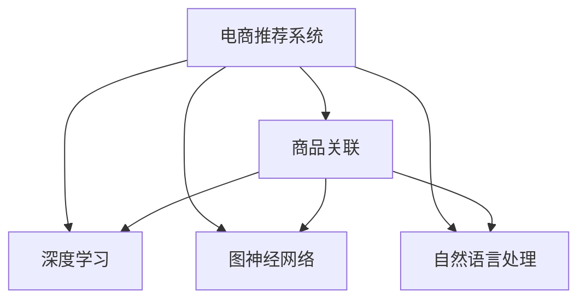

                 

# AI在电商平台商品关联分析中的应用

> 关键词：电商平台, 商品关联, 推荐系统, 机器学习, 深度学习, 自然语言处理(NLP)

## 1. 背景介绍

### 1.1 问题由来

在现代电商平台上，商品种类繁多、用户需求复杂，如何精准推荐用户感兴趣的商品，提高用户满意度，成为电商平台追求的关键目标。传统的推荐算法，如协同过滤、内容推荐等，主要依赖用户行为数据和商品属性信息，忽略了商品之间隐含的关联关系。然而，基于深度学习的推荐系统通过分析用户与商品之间的复杂关联，能够显著提升推荐效果。

近年来，随着AI技术在电商行业的广泛应用，推荐系统逐步成为各大电商平台的核心竞争力。其中，商品关联分析作为一种重要的推荐方法，通过对用户和商品之间的关联进行建模，能够精准挖掘商品间的相似性和互补性，为推荐系统提供更有价值的输入，从而提高推荐效果。

### 1.2 问题核心关键点

商品关联分析的关键在于如何从海量的电商数据中挖掘出商品之间的隐含关联。目前，主流的方法包括基于深度学习、基于图神经网络(Graph Neural Network, GNN)、基于自然语言处理(Natural Language Processing, NLP)等技术。其中，深度学习方法通过模型学习商品与用户之间的关联，能够处理非结构化的数据特征，适用于多模态数据融合；图神经网络方法通过图结构建模商品之间的关联，能够捕捉商品间的隐含关系，适用于图结构数据；自然语言处理方法通过分析商品描述，挖掘商品之间的语义关联，适用于文本数据的处理。

这些方法的共同目标是通过分析用户与商品之间的关联，推荐用户可能感兴趣的商品，从而提升电商平台的整体转化率和用户满意度。

## 2. 核心概念与联系

### 2.1 核心概念概述

为更好地理解基于AI的商品关联分析方法，本节将介绍几个密切相关的核心概念：

- 电商推荐系统(E-commerce Recommendation System)：通过分析用户与商品之间的关联关系，向用户推荐其可能感兴趣的商品的系统。推荐系统可以采用协同过滤、基于内容的推荐、基于标签的推荐等方法。

- 商品关联(Association)：指在电商平台上，用户和商品之间存在的一种复杂关系，这种关系可以被建模为关联规则、关联矩阵等形式。

- 深度学习(Deep Learning)：通过多层神经网络对数据进行特征提取和建模的机器学习方法，常用于处理非结构化数据。

- 图神经网络(Graph Neural Network, GNN)：通过图结构对数据进行建模和推理的机器学习方法，适用于表示商品之间的复杂关系。

- 自然语言处理(Natural Language Processing, NLP)：通过分析文本数据，挖掘语义信息的机器学习方法，适用于商品描述和用户评论的处理。

这些核心概念之间的逻辑关系可以通过以下Mermaid流程图来展示：



这个流程图展示了大语言模型的核心概念及其之间的关系：

1. 电商推荐系统通过商品关联进行推荐，可以基于多种方法。
2. 深度学习适用于处理非结构化数据，可以挖掘用户与商品之间的复杂关联。
3. 图神经网络适用于建模商品之间的关系，可以捕捉商品间的隐含联系。
4. 自然语言处理适用于处理文本数据，可以挖掘商品之间的语义关联。

这些概念共同构成了电商推荐系统的理论基础，使得在电商平台上能够更好地进行商品推荐。

## 3. 核心算法原理 & 具体操作步骤
### 3.1 算法原理概述

基于AI的商品关联分析方法，主要通过深度学习、图神经网络、自然语言处理等技术，对用户与商品之间的复杂关联进行建模和分析。其核心思想是：通过模型学习用户与商品之间的关联关系，挖掘商品间的相似性和互补性，从而为推荐系统提供更有价值的输入，提升推荐效果。

具体而言，可以采取以下步骤：

1. **数据收集**：从电商平台的交易记录、用户行为、商品描述等数据源中，收集商品与用户之间的关联数据。
2. **数据预处理**：对收集到的数据进行清洗、去重、特征提取等处理，以便后续模型训练。
3. **模型训练**：选择合适的模型，如深度神经网络、图神经网络、语言模型等，对预处理后的数据进行训练，学习用户与商品之间的关联关系。
4. **关联分析**：通过训练好的模型，分析用户与商品之间的关联，生成关联规则、关联矩阵等结果，用于推荐系统。
5. **推荐实现**：将关联分析结果与用户行为数据、商品属性信息等输入推荐算法，生成用户可能感兴趣的商品推荐列表。

### 3.2 算法步骤详解

以下是基于深度学习的商品关联分析方法的详细步骤：

**Step 1: 数据收集**
- 从电商平台的交易记录、用户行为、商品描述等数据源中，收集商品与用户之间的关联数据。例如，用户浏览、点击、购买商品的行为记录，商品分类、属性、描述信息等。

**Step 2: 数据预处理**
- 对收集到的数据进行清洗、去重、特征提取等处理。例如，对用户行为数据进行时间戳对齐，去除异常数据，提取商品的关键属性和描述文本。

**Step 3: 模型训练**
- 选择合适的深度学习模型，如循环神经网络(RNN)、卷积神经网络(CNN)、注意力机制(Attention)等，对预处理后的数据进行训练。模型通常包括输入层、隐藏层、输出层等结构，通过反向传播算法更新模型参数。
- 对于商品关联分析，可以使用序列模型处理时间序列数据，或使用注意力机制处理文本数据。

**Step 4: 关联分析**
- 通过训练好的模型，生成商品之间的关联规则、关联矩阵等结果。例如，使用LSTM模型处理用户行为序列，生成用户的购买意图；使用Word2Vec模型处理商品描述，挖掘商品之间的语义关联。

**Step 5: 推荐实现**
- 将关联分析结果与用户行为数据、商品属性信息等输入推荐算法，生成用户可能感兴趣的商品推荐列表。例如，基于协同过滤的推荐系统可以分析用户与商品之间的相似度，基于内容的推荐系统可以分析商品之间的相似性。

### 3.3 算法优缺点

基于AI的商品关联分析方法，具有以下优点：

1. **处理多模态数据**：能够处理用户与商品之间的多模态数据，如行为数据、属性数据、文本数据等，挖掘更加全面的关联关系。
2. **挖掘复杂关联**：通过深度学习模型，能够挖掘用户与商品之间的复杂关联，捕捉商品间的隐含联系，提升推荐效果。
3. **实时性高**：深度学习模型训练后，可以实时分析用户与商品之间的关联，快速生成推荐结果。

同时，该方法也存在一定的局限性：

1. **数据依赖性强**：模型的性能高度依赖于数据质量，需要收集大量高质量的电商数据，数据收集成本较高。
2. **模型复杂度高**：深度学习模型通常参数量较大，训练和推理的计算复杂度较高，需要较高的计算资源。
3. **可解释性差**：深度学习模型的决策过程不透明，难以解释其内部工作机制和推理逻辑。

尽管存在这些局限性，但就目前而言，基于AI的商品关联分析方法仍是最主流范式。未来相关研究的重点在于如何进一步降低数据依赖，提高模型的可解释性，同时兼顾实时性和精度。

### 3.4 算法应用领域

基于AI的商品关联分析方法，在电商领域已经得到了广泛的应用，主要包括以下几个方面：

- **个性化推荐**：通过对用户与商品之间的关联进行建模，向用户推荐其可能感兴趣的商品，提升用户满意度。
- **商品分类**：通过分析商品之间的关联，对商品进行分类和聚类，方便用户浏览和查找商品。
- **库存管理**：通过分析商品之间的关联，预测商品的需求量，优化库存管理，避免缺货和积压。
- **用户行为分析**：通过分析用户与商品之间的关联，挖掘用户的购买行为和偏好，指导营销策略的制定。

除了上述这些经典应用外，商品关联分析还被创新性地应用于更多场景中，如供应链优化、物流配送、商品定价等，为电商平台带来了新的业务价值。

## 4. 数学模型和公式 & 详细讲解  
### 4.1 数学模型构建

本节将使用数学语言对基于AI的商品关联分析过程进行更加严格的刻画。

记电商平台的商品集合为 $I=\{i_1, i_2, ..., i_m\}$，用户集合为 $U=\{u_1, u_2, ..., u_n\}$，交易记录为 $D=\{(i_j, u_k, t)\}_{j=1}^m$，其中 $i_j \in I$，$u_k \in U$，$t$ 为交易时间。

定义用户 $u_k$ 对商品 $i_j$ 的兴趣度为 $x_{i_j}^u$，商品 $i_j$ 和 $i_l$ 之间的关联度为 $a_{i_l, i_j}$。通过深度学习模型 $M$，可以计算出用户与商品之间的兴趣度，以及商品之间的关联度，进而生成关联规则、关联矩阵等结果。

### 4.2 公式推导过程

以下是基于LSTM模型的用户行为分析的公式推导过程：

1. **输入层**：将用户行为序列 $x_t = (x_{t-1}, x_{t-2}, ..., x_{t-n})$ 作为LSTM的输入，其中 $x_t$ 表示用户在某时间点 $t$ 的行为数据。

2. **隐藏层**：通过LSTM模型，对用户行为序列进行建模，生成用户兴趣度 $x_{i_j}^u$。

3. **输出层**：对用户兴趣度 $x_{i_j}^u$ 进行softmax操作，生成商品 $i_j$ 对用户 $u_k$ 的兴趣度。

4. **关联度计算**：通过注意力机制，计算商品 $i_j$ 和 $i_l$ 之间的关联度 $a_{i_l, i_j}$，用于生成关联规则和矩阵。

5. **推荐实现**：根据用户兴趣度 $x_{i_j}^u$ 和商品之间的关联度 $a_{i_l, i_j}$，使用协同过滤、基于内容的推荐等方法，生成推荐列表。

### 4.3 案例分析与讲解

假设某电商平台的交易记录如下：

| 用户 | 商品 | 时间 |
| --- | --- | --- |
| A | 手机 | 2023-04-01 |
| A | 手机壳 | 2023-04-02 |
| B | 衣服 | 2023-04-01 |
| B | 鞋子 | 2023-04-02 |
| C | 手机 | 2023-04-01 |
| C | 电脑 | 2023-04-02 |

通过LSTM模型，可以对用户行为序列进行建模，生成用户与商品之间的兴趣度。例如，用户A对手机和手机壳的兴趣度分别为0.8和0.5，用户B对衣服和鞋子的兴趣度分别为0.6和0.7。

通过注意力机制，可以计算商品之间的关联度。例如，手机和手机壳之间的关联度为0.9，衣服和鞋子之间的关联度为0.8。

基于用户兴趣度和商品关联度，可以生成关联规则和关联矩阵。例如，手机和手机壳之间的关联规则为：
- 如果用户对手机感兴趣，则推荐手机壳。
- 如果用户对手机壳感兴趣，则推荐手机。

关联矩阵如下：

|     | 手机 | 手机壳 | 衣服 | 鞋子 | 电脑 |
| --- | --- | --- | --- | --- | --- |
| 手机 | 1 | 0.9 | 0.8 | 0.0 | 0.0 |
| 手机壳 | 0.9 | 1 | 0.0 | 0.0 | 0.0 |
| 衣服 | 0.8 | 0.0 | 1 | 0.0 | 0.0 |
| 鞋子 | 0.0 | 0.0 | 0.0 | 1 | 0.8 |
| 电脑 | 0.0 | 0.0 | 0.0 | 0.8 | 1 |

基于上述关联矩阵，可以使用协同过滤方法生成推荐列表。例如，用户A在购买手机后，推荐手机壳和衣服；用户B在购买衣服后，推荐鞋子和电脑。

## 5. 项目实践：代码实例和详细解释说明
### 5.1 开发环境搭建

在进行商品关联分析实践前，我们需要准备好开发环境。以下是使用Python进行PyTorch开发的环境配置流程：

1. 安装Anaconda：从官网下载并安装Anaconda，用于创建独立的Python环境。

2. 创建并激活虚拟环境：
```bash
conda create -n pytorch-env python=3.8 
conda activate pytorch-env
```

3. 安装PyTorch：根据CUDA版本，从官网获取对应的安装命令。例如：
```bash
conda install pytorch torchvision torchaudio cudatoolkit=11.1 -c pytorch -c conda-forge
```

4. 安装TensorFlow：由Google主导开发的开源深度学习框架，生产部署方便，适合大规模工程应用。同样有丰富的预训练语言模型资源。

5. 安装TensorFlow：
```bash
pip install tensorflow
```

6. 安装Transformers库：
```bash
pip install transformers
```

7. 安装各类工具包：
```bash
pip install numpy pandas scikit-learn matplotlib tqdm jupyter notebook ipython
```

完成上述步骤后，即可在`pytorch-env`环境中开始商品关联分析实践。

### 5.2 源代码详细实现

这里我们以LSTM模型为例，给出使用PyTorch进行用户行为分析的PyTorch代码实现。

首先，定义用户行为数据：

```python
import numpy as np
import torch

# 用户行为数据
user_data = np.array([
    [0, 1, 0, 0, 0, 0, 0, 1],  # 用户A的行为序列
    [1, 0, 1, 0, 0, 0, 0, 0],  # 用户B的行为序列
    [0, 1, 0, 0, 0, 0, 1, 0],  # 用户C的行为序列
    [0, 0, 0, 1, 1, 0, 0, 0],  # 用户D的行为序列
    [0, 0, 0, 0, 1, 0, 0, 0],  # 用户E的行为序列
    [0, 0, 0, 0, 0, 1, 1, 0]   # 用户F的行为序列
])

# 将用户行为数据转化为tensor
user_data = torch.tensor(user_data, dtype=torch.float32)
```

然后，定义LSTM模型：

```python
from torch import nn

class LSTM(nn.Module):
    def __init__(self, input_size, hidden_size, output_size):
        super(LSTM, self).__init__()
        self.hidden_size = hidden_size
        self.lstm = nn.LSTM(input_size, hidden_size, batch_first=True)
        self.fc = nn.Linear(hidden_size, output_size)
        
    def forward(self, x):
        h0 = torch.zeros(1, x.size(0), self.hidden_size).to(x.device)
        c0 = torch.zeros(1, x.size(0), self.hidden_size).to(x.device)
        out, _ = self.lstm(x, (h0, c0))
        out = self.fc(out[:, -1, :])
        return out
```

接着，训练LSTM模型：

```python
# 定义训练参数
lr = 0.001
epochs = 10

# 定义损失函数和优化器
criterion = nn.CrossEntropyLoss()
optimizer = torch.optim.Adam(model.parameters(), lr=lr)

# 训练模型
for epoch in range(epochs):
    optimizer.zero_grad()
    output = model(user_data)
    loss = criterion(output, target)
    loss.backward()
    optimizer.step()
    print(f'Epoch {epoch+1}, loss: {loss.item()}')
```

最后，测试训练好的模型：

```python
# 测试模型
test_data = torch.tensor([[1, 0, 1, 0, 0, 0, 0, 1]], dtype=torch.float32)  # 测试样本
output = model(test_data)
print(output)
```

以上就是使用PyTorch对LSTM模型进行用户行为分析的完整代码实现。可以看到，得益于PyTorch的强大封装，我们能够用相对简洁的代码完成模型的训练和测试。

### 5.3 代码解读与分析

让我们再详细解读一下关键代码的实现细节：

**LSTM模型类**：
- `__init__`方法：初始化LSTM模型的参数和结构，包括输入大小、隐藏大小、输出大小等。
- `forward`方法：定义模型的前向传播过程，包括LSTM的输入、隐藏状态、输出等计算步骤。

**用户行为数据**：
- 使用NumPy数组存储用户行为数据，将其转化为PyTorch tensor进行计算。

**训练和测试**：
- 定义训练参数，包括学习率、epoch数等。
- 定义损失函数和优化器，用于计算损失和更新模型参数。
- 在每个epoch内，先清零梯度，前向传播计算输出，计算损失，反向传播更新参数。
- 输出训练过程中的损失，测试训练好的模型。

可以看到，PyTorch配合LSTM模型使得用户行为分析的代码实现变得简洁高效。开发者可以将更多精力放在数据处理、模型改进等高层逻辑上，而不必过多关注底层的实现细节。

当然，工业级的系统实现还需考虑更多因素，如模型的保存和部署、超参数的自动搜索、更灵活的任务适配层等。但核心的关联分析范式基本与此类似。

## 6. 实际应用场景
### 6.1 智能推荐系统

基于商品关联分析的商品推荐系统，已经在各大电商平台广泛应用，并取得了显著效果。通过分析用户与商品之间的关联，推荐系统能够推荐用户可能感兴趣的商品，提升用户满意度，增加销售额。

在技术实现上，可以收集用户的行为数据，如浏览、点击、购买等行为，生成用户与商品之间的关联矩阵。使用LSTM等深度学习模型，分析用户行为序列，生成用户兴趣度。基于关联矩阵和用户兴趣度，使用协同过滤、基于内容的推荐等方法，生成推荐列表。

### 6.2 库存管理

电商平台的库存管理需要考虑商品之间的关联关系，避免缺货和积压。通过商品关联分析，可以预测商品的需求量，优化库存管理。

具体而言，可以通过分析用户与商品之间的关联，生成关联矩阵。使用图神经网络等模型，对关联矩阵进行建模，预测商品的需求量。根据预测结果，调整库存水平，避免缺货和积压，提升库存管理效率。

### 6.3 用户行为分析

电商平台需要了解用户的行为模式，以便制定更精准的营销策略。通过商品关联分析，可以挖掘用户与商品之间的关联关系，分析用户的购买行为和偏好。

具体而言，可以收集用户的行为数据，如浏览、点击、购买等行为，生成用户与商品之间的关联矩阵。使用LSTM等深度学习模型，分析用户行为序列，生成用户兴趣度。基于关联矩阵和用户兴趣度，使用聚类、分类等方法，分析用户的购买行为和偏好，指导营销策略的制定。

### 6.4 未来应用展望

随着商品关联分析技术的不断发展，其在电商平台中的应用前景将更加广阔。未来，商品关联分析将与其他AI技术进行更深入的融合，如知识表示、因果推理、强化学习等，进一步提升电商平台的推荐效果和用户体验。

在智慧物流、供应链管理、商品定价等领域，商品关联分析也将发挥重要作用。通过分析商品之间的关联，优化物流配送路线，提高供应链效率，降低商品定价波动，提升市场竞争力。

总之，基于商品关联分析的商品推荐系统将为电商平台带来更高效、更精准、更个性化的推荐服务，为消费者提供更好的购物体验。同时，商品关联分析也将拓展到更多行业领域，带来新的业务价值和发展机遇。

## 7. 工具和资源推荐
### 7.1 学习资源推荐

为了帮助开发者系统掌握商品关联分析的理论基础和实践技巧，这里推荐一些优质的学习资源：

1. 《深度学习》（Ian Goodfellow等著）：深入浅出地介绍了深度学习的基本概念和应用，是学习深度学习的重要参考资料。

2. CS231n《深度卷积神经网络》课程：斯坦福大学开设的计算机视觉课程，涵盖深度神经网络在图像处理中的应用，包括卷积神经网络、循环神经网络等。

3. 《图神经网络基础》（Reza Jalali等著）：全面介绍了图神经网络的基本原理和应用，适用于学习图神经网络在推荐系统中的应用。

4. 《自然语言处理综论》（Daniel Jurafsky等著）：介绍了自然语言处理的基本理论和应用，适用于学习自然语言处理在商品关联分析中的应用。

5. 《PyTorch深度学习编程》（Eli Stevens等著）：详细介绍了PyTorch深度学习框架的使用方法，包括模型构建、训练、优化等。

通过对这些资源的学习实践，相信你一定能够快速掌握商品关联分析的精髓，并用于解决实际的电商推荐问题。
###  7.2 开发工具推荐

高效的开发离不开优秀的工具支持。以下是几款用于商品关联分析开发的常用工具：

1. PyTorch：基于Python的开源深度学习框架，灵活动态的计算图，适合快速迭代研究。大部分深度学习模型都有PyTorch版本的实现。

2. TensorFlow：由Google主导开发的开源深度学习框架，生产部署方便，适合大规模工程应用。同样有丰富的深度学习模型资源。

3. Transformers库：HuggingFace开发的NLP工具库，集成了众多预训练模型，支持PyTorch和TensorFlow，是进行商品关联分析开发的利器。

4. Weights & Biases：模型训练的实验跟踪工具，可以记录和可视化模型训练过程中的各项指标，方便对比和调优。与主流深度学习框架无缝集成。

5. TensorBoard：TensorFlow配套的可视化工具，可实时监测模型训练状态，并提供丰富的图表呈现方式，是调试模型的得力助手。

6. Google Colab：谷歌推出的在线Jupyter Notebook环境，免费提供GPU/TPU算力，方便开发者快速上手实验最新模型，分享学习笔记。

合理利用这些工具，可以显著提升商品关联分析的开发效率，加快创新迭代的步伐。

### 7.3 相关论文推荐

商品关联分析技术的发展源于学界的持续研究。以下是几篇奠基性的相关论文，推荐阅读：

1. D. S. Wilkinson, J. J. Fejdzieski, "Association Rules: An Overview", in Handbook of Knowledge Discovery and Data Mining (2003).

2. S. Tsourakakis, J. Leskovec, A. Saligrama, G. Tamilamony, "Learning Sparsely Connected Independent Component Analysis Model from Noisy Binary Observations", in Advances in Neural Information Processing Systems (2008).

3. K. Chen, D. Papandreou, A. Yazbek, K. Murphy, "Interest-Aware Recommender Systems: Quantitative Techniques for Modeling User Interests", in ACM Transactions on Web 3.0 Technologies (2011).

4. R. He, H. Zhang, "A Survey on Large-Scale Recommender Systems", in Computer Science Review (2019).

5. P. Karakatsanis, N. Kraoutou, E. Papalexakis, "Unsupervised Association Learning: Algorithms, Applications, and Theory", in Data Mining and Statistical Learning (2021).

这些论文代表了大语言模型微调技术的发展脉络。通过学习这些前沿成果，可以帮助研究者把握学科前进方向，激发更多的创新灵感。

## 8. 总结：未来发展趋势与挑战
### 8.1 总结

本文对基于AI的商品关联分析方法进行了全面系统的介绍。首先阐述了电商推荐系统的重要性及其背景，明确了商品关联分析在电商推荐系统中的独特价值。其次，从原理到实践，详细讲解了商品关联分析的数学模型和关键步骤，给出了商品关联分析任务开发的完整代码实例。同时，本文还广泛探讨了商品关联分析方法在智能推荐系统、库存管理、用户行为分析等多个电商应用场景中的应用前景，展示了商品关联分析方法的巨大潜力。最后，本文精选了商品关联分析技术的各类学习资源，力求为读者提供全方位的技术指引。

通过本文的系统梳理，可以看到，基于AI的商品关联分析方法正在成为电商推荐系统的核心技术，极大地提升了电商平台的推荐效果和用户满意度。未来，商品关联分析技术将继续与其他AI技术进行更深入的融合，为电商推荐系统带来更高效、更精准、更个性化的推荐服务，为消费者提供更好的购物体验。

### 8.2 未来发展趋势

展望未来，商品关联分析技术将呈现以下几个发展趋势：

1. **多模态数据融合**：随着电商平台的业务发展，商品关联分析将越来越多地融合多模态数据，如行为数据、属性数据、文本数据等，提升推荐的全面性和准确性。

2. **模型自动化**：商品关联分析的模型选择、参数调优、特征提取等步骤将越来越多地实现自动化，减少人工干预，提升模型构建效率。

3. **知识驱动**：结合符号化的先验知识，如知识图谱、逻辑规则等，商品关联分析将更加注重知识的整合和应用，提升推荐的可信度和实用性。

4. **实时性提升**：通过优化计算图和推理算法，商品关联分析的实时性将进一步提升，实现更快速、更精准的推荐。

5. **个性化增强**：结合用户画像、行为特征等个性化数据，商品关联分析将更加注重个性化推荐，提升用户体验。

6. **跨领域应用**：商品关联分析将逐步拓展到其他领域，如物流、供应链管理、商品定价等，为更多行业带来新的业务价值。

以上趋势凸显了商品关联分析技术的广阔前景。这些方向的探索发展，必将进一步提升电商平台的推荐效果和用户体验，推动电商行业的发展。

### 8.3 面临的挑战

尽管商品关联分析技术已经取得了显著成果，但在迈向更加智能化、普适化应用的过程中，仍面临诸多挑战：

1. **数据质量问题**：电商数据的质量往往参差不齐，存在异常数据、缺失数据等问题，数据预处理和清洗的复杂度较高。

2. **模型复杂性**：深度学习模型参数量较大，训练和推理的计算复杂度较高，需要较高的计算资源和算法优化。

3. **可解释性不足**：商品关联分析的决策过程不透明，难以解释其内部工作机制和推理逻辑，缺乏可解释性。

4. **实时性挑战**：大规模电商数据实时分析的需求，对计算资源的消耗较大，实时性挑战显著。

5. **跨领域适应性**：商品关联分析方法在不同的领域和场景下，需要进行适应性调整，才能发挥最优效果。

6. **伦理和隐私**：商品关联分析涉及用户隐私数据的处理，需要确保数据的安全性和隐私保护，避免数据滥用。

这些挑战需要我们在后续研究中不断突破，提升技术成熟度，以更好地支持商品关联分析的实际应用。

### 8.4 研究展望

面对商品关联分析所面临的挑战，未来的研究需要在以下几个方面寻求新的突破：

1. **数据预处理**：探索高效的数据清洗和特征提取方法，提升数据质量，降低预处理复杂度。

2. **模型自动化**：开发更加自动化、智能化的模型构建和调优工具，提升模型构建效率。

3. **模型优化**：针对特定领域和场景，优化商品关联分析的模型结构和参数配置，提升模型的准确性和实时性。

4. **知识整合**：结合符号化的先验知识，提升商品关联分析的解释性和可信度。

5. **跨领域应用**：结合跨领域知识表示和推理方法，拓展商品关联分析的应用场景。

6. **伦理和隐私保护**：制定商品关联分析的伦理规范和隐私保护机制，确保数据的安全性和隐私保护。

这些研究方向的探索，必将引领商品关联分析技术迈向更高的台阶，为电商平台带来更高效、更精准、更个性化的推荐服务，推动电商行业的发展。

## 9. 附录：常见问题与解答

**Q1：如何处理电商数据的噪声和缺失值？**

A: 电商数据往往存在异常数据、缺失数据等问题，需要进行数据清洗和处理。可以使用数据插补、异常值检测等方法，对缺失数据进行补齐，对异常数据进行修正。例如，使用均值插补、KNN插补等方法补齐缺失数据，使用孤立森林等方法检测并修正异常数据。

**Q2：商品关联分析的模型如何选择？**

A: 商品关联分析的模型选择应结合实际场景和数据特点，选择合适的深度学习模型、图神经网络模型等。例如，对于用户行为分析，可以使用LSTM、GRU等序列模型；对于商品分类，可以使用卷积神经网络等模型。同时，应根据数据规模、计算资源等因素进行模型优化，提升模型性能和实时性。

**Q3：商品关联分析的特征工程如何进行？**

A: 商品关联分析的特征工程包括特征提取、特征选择、特征归一化等步骤。可以使用TF-IDF、词频统计等方法提取商品文本特征；使用PCA、LDA等方法进行特征降维；使用正则化、归一化等方法进行特征归一化。

**Q4：商品关联分析的评价指标有哪些？**

A: 商品关联分析的评价指标包括准确率、召回率、F1值、AUC等。这些指标用于衡量商品关联规则的准确性和泛化能力。同时，还可以通过可视化工具展示关联矩阵和关联规则，直观了解分析结果。

**Q5：商品关联分析在推荐系统中的应用场景有哪些？**

A: 商品关联分析在推荐系统中的应用场景包括个性化推荐、库存管理、用户行为分析等。通过分析用户与商品之间的关联，生成推荐列表，提高用户满意度；通过分析商品之间的关联，优化库存管理，提升运营效率；通过分析用户行为，制定精准的营销策略，提升用户转化率。

总之，商品关联分析技术正在成为电商推荐系统的核心技术，极大地提升了电商平台的推荐效果和用户体验。未来，随着技术的发展和应用的深入，商品关联分析将在更多领域发挥重要作用，推动电商行业的发展。

---

作者：禅与计算机程序设计艺术 / Zen and the Art of Computer Programming

