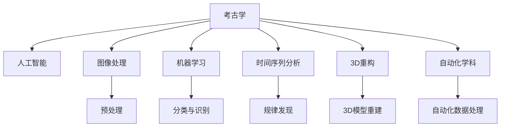

                 

# AI在考古学中的应用：揭示历史之谜

> 关键词：考古学,人工智能,图像处理,机器学习,时间序列分析,3D重构,历史研究

## 1. 背景介绍

考古学是一门探索人类历史和文化遗迹的学科，它不仅关注古代社会的物质文化遗存，还致力于揭示人类历史变迁的过程和原因。随着科技的进步，尤其是人工智能(AI)技术的发展，考古学研究正经历着一场深刻的变革。AI技术为考古学家提供了前所未有的工具和方法，使得他们能够更高效地处理大量的考古数据，揭示隐藏在历史遗迹中的秘密。

### 1.1 问题由来
传统的考古学研究方法主要依赖人力和有限的资金，通过现场发掘、手工记录和人工分析来研究历史遗迹。然而，面对日益增多的考古数据和日益复杂的考古问题，这些传统方法显得力不从心。AI技术为考古学研究注入了新的活力，特别是在图像处理、数据挖掘、历史时间序列分析、3D重构等关键领域，AI的应用已经开始改变考古学的研究范式。

### 1.2 问题核心关键点
AI在考古学中的应用核心关键点包括：
- **数据量大、类型多样**：考古学涉及的数据类型多样，包括文字记录、图片、视频、地图等，数据量大且复杂。
- **时空跨度广**：考古学研究往往涉及跨越千百年的历史数据，需要跨时空的分析和理解。
- **历史重构与模拟**：考古学旨在重建历史事件，需要从时间序列数据中提取有价值的信息。
- **自动化的数据分析**：AI技术可以实现大规模、高效的数据处理和分析，减少人工工作量。

## 2. 核心概念与联系

### 2.1 核心概念概述

为了更好地理解AI在考古学中的应用，本节将介绍几个关键概念及其之间的联系：

- **考古学**：研究古代人类活动、文化和遗迹的学科，涵盖物质文化遗存和历史事件分析。
- **人工智能**：一种模拟人类智能行为的技术，包括机器学习、深度学习、自然语言处理等。
- **图像处理**：使用AI技术处理考古图像数据，如照片、地图、卫星影像等，提取有用信息。
- **机器学习**：一种通过数据训练模型来发现规律的技术，适用于考古数据的分类、识别和预测。
- **时间序列分析**：分析历史事件的时间演变，揭示历史规律。
- **3D重构**：使用AI技术重建古代遗迹的3D模型，提供直观的历史视角。
- **自动化学科**：将AI应用于考古学，实现数据的自动化处理和分析，提升研究效率。

这些概念之间的联系可以通过以下Mermaid流程图来展示：



这个流程图展示了AI技术如何通过各个子技术，帮助考古学研究人员处理、分析和重构考古数据。

## 3. 核心算法原理 & 具体操作步骤

### 3.1 算法原理概述

AI在考古学中的应用主要基于以下算法原理：

- **深度学习**：通过神经网络模型，如卷积神经网络(CNN)、循环神经网络(RNN)等，实现对复杂考古数据的自动处理和分析。
- **图像处理**：使用卷积神经网络对考古图像进行分类、分割、识别等处理，提取有用信息。
- **自然语言处理(NLP)**：通过预训练语言模型，如BERT、GPT等，分析历史文本记录，提取文本中的有用信息。
- **时间序列分析**：使用ARIMA、LSTM等模型，对考古数据中的时间序列进行分析，揭示历史趋势和规律。
- **3D重构**：使用生成对抗网络(GAN)、自编码器等技术，从考古数据中重建3D模型，提供直观的历史视角。

### 3.2 算法步骤详解

AI在考古学中的应用大致分为以下几个步骤：

**Step 1: 数据收集与预处理**
- 收集考古数据，包括文字记录、图像、地图、视频等。
- 对数据进行清洗和预处理，如去除噪声、标准化格式等。

**Step 2: 图像处理**
- 使用卷积神经网络对图像数据进行预处理、分类和分割。
- 提取图像中的关键特征，如纹理、形状等，用于后续分析。

**Step 3: 机器学习建模**
- 根据考古问题的特点，选择合适的机器学习模型，如分类、回归、聚类等。
- 在标注数据上训练模型，进行交叉验证和调参，得到最优模型。

**Step 4: 时间序列分析**
- 对考古数据中的时间序列进行建模，如ARIMA、LSTM等。
- 分析历史事件的时间演变，揭示历史规律。

**Step 5: 3D重构**
- 使用生成对抗网络或自编码器对考古数据进行3D重构。
- 将重构结果用于虚拟考古、历史重建等应用。

**Step 6: 结果验证与解释**
- 对AI模型的输出结果进行验证和解释，如通过人工复核、专家评审等方式。
- 结合考古学知识对AI结果进行解释和修正。

### 3.3 算法优缺点

AI在考古学中的应用具有以下优点：
1. **高效性**：能够快速处理和分析大量考古数据，提高研究效率。
2. **准确性**：通过深度学习模型，能够从复杂数据中提取有用信息，提高分析精度。
3. **多维度分析**：能够同时处理文字、图像、时间序列等多种类型的数据，提供全面的分析视角。

同时，AI技术在考古学中的应用也存在一些局限性：
1. **数据依赖性**：需要大量高质量的考古数据，数据稀缺时效果可能受限。
2. **解释性不足**：AI模型的决策过程缺乏可解释性，可能难以被考古学家接受。
3. **模型复杂性**：复杂的AI模型可能需要较高的计算资源和专业知识，非专业人士难以驾驭。

### 3.4 算法应用领域

AI在考古学中的应用已经覆盖了多个领域，具体如下：

- **图像处理**：考古图像分类、识别、分割等。
- **文本分析**：历史文献的语言处理、实体识别等。
- **时间序列分析**：考古数据中的时间演变规律分析。
- **3D重构**：古代遗迹的虚拟重现和历史重建。
- **数据分析**：考古数据的聚类、分类、预测等。

## 4. 数学模型和公式 & 详细讲解 & 举例说明

### 4.1 数学模型构建

本节将介绍几种常用的AI模型及其在考古学中的应用。

#### 4.1.1 卷积神经网络(CNN)
CNN在图像处理中应用广泛，其主要原理是通过卷积层和池化层提取图像特征，并通过全连接层进行分类。

#### 4.1.2 循环神经网络(RNN)
RNN适用于时间序列数据的处理，通过循环连接捕捉序列数据的时序信息。

#### 4.1.3 生成对抗网络(GAN)
GAN用于图像生成和3D重构，通过生成器和判别器的对抗训练，生成高质量的3D模型。

#### 4.1.4 自编码器(AE)
AE用于数据压缩和重构，通过编码器将数据压缩为低维表示，再通过解码器重构原始数据。

### 4.2 公式推导过程

#### 4.2.1 CNN的卷积操作
设输入图像为 $x$，卷积核为 $w$，输出特征图为 $y$，则卷积操作的公式为：

$$
y_i = \sum_{j=1}^n w_j \cdot x_{i+j-1}
$$

#### 4.2.2 RNN的前向传播
设输入序列为 $x_t$，当前状态为 $h_t$，输出为 $y_t$，则RNN的前向传播公式为：

$$
h_{t+1} = \tanh(W_h h_t + U_x x_t + b_h)
$$
$$
y_t = softmax(V h_t + b_y)
$$

#### 4.2.3 GAN的生成过程
设生成器为 $G$，判别器为 $D$，生成样本为 $z$，则GAN的生成过程公式为：

$$
z \sim p_z
$$
$$
g(z) = G(z)
$$
$$
x = g(z)
$$
$$
\hat{x} = G(z')
$$

#### 4.2.4 AE的编码过程
设输入数据为 $x$，编码器为 $E$，解码器为 $D$，重构数据为 $\hat{x}$，则AE的编码过程公式为：

$$
h = E(x)
$$
$$
x' = D(h)
$$

### 4.3 案例分析与讲解

#### 4.3.1 考古图像分类
考古图像分类任务包括识别考古图片中的物品、人物、建筑等。使用CNN模型，可以自动提取图像特征并进行分类。例如，使用ResNet架构，对考古图片进行预处理和特征提取，通过softmax层进行分类。

#### 4.3.2 历史文本分析
历史文本分析任务包括识别和提取文本中的历史事件、地点、人物等实体。使用NLP技术，如BERT模型，可以自动提取文本特征并进行实体识别。例如，对历史文献进行预处理和分词，使用BERT模型进行实体标注。

#### 4.3.3 时间序列分析
考古数据中的时间序列包括古代农作物的生长周期、古代城市的建设周期等。使用ARIMA、LSTM等模型，可以分析历史事件的时间演变，揭示历史规律。例如，对古代城市的建设周期数据进行建模，分析其时间演变规律。

#### 4.3.4 3D重构
考古3D重构任务包括重建古代遗迹的3D模型，提供直观的历史视角。使用GAN或自编码器，可以生成高质量的3D模型。例如，对考古图片进行3D重构，生成古代遗迹的3D模型。

## 5. 项目实践：代码实例和详细解释说明

### 5.1 开发环境搭建

在进行考古学AI项目开发前，我们需要准备好开发环境。以下是使用Python进行PyTorch开发的环境配置流程：

1. 安装Anaconda：从官网下载并安装Anaconda，用于创建独立的Python环境。

2. 创建并激活虚拟环境：
```bash
conda create -n archaeology-env python=3.8 
conda activate archaeology-env
```

3. 安装PyTorch：根据CUDA版本，从官网获取对应的安装命令。例如：
```bash
conda install pytorch torchvision torchaudio cudatoolkit=11.1 -c pytorch -c conda-forge
```

4. 安装Transformers库：
```bash
pip install transformers
```

5. 安装各类工具包：
```bash
pip install numpy pandas scikit-learn matplotlib tqdm jupyter notebook ipython
```

完成上述步骤后，即可在`archaeology-env`环境中开始考古学AI项目的开发。

### 5.2 源代码详细实现

下面我们以考古图像分类为例，给出使用Transformers库进行CNN模型实现的PyTorch代码。

首先，定义CNN模型的结构：

```python
import torch.nn as nn
import torch.nn.functional as F

class CNNModel(nn.Module):
    def __init__(self, num_classes):
        super(CNNModel, self).__init__()
        self.conv1 = nn.Conv2d(3, 32, kernel_size=3, stride=1, padding=1)
        self.pool1 = nn.MaxPool2d(kernel_size=2, stride=2)
        self.conv2 = nn.Conv2d(32, 64, kernel_size=3, stride=1, padding=1)
        self.pool2 = nn.MaxPool2d(kernel_size=2, stride=2)
        self.fc1 = nn.Linear(64 * 4 * 4, 512)
        self.fc2 = nn.Linear(512, num_classes)
    
    def forward(self, x):
        x = F.relu(self.conv1(x))
        x = F.max_pool2d(x, 2)
        x = F.relu(self.conv2(x))
        x = F.max_pool2d(x, 2)
        x = x.view(-1, 64 * 4 * 4)
        x = F.relu(self.fc1(x))
        x = self.fc2(x)
        return F.log_softmax(x, dim=1)
```

然后，定义数据处理函数：

```python
from PIL import Image
import torchvision.transforms as transforms
from torch.utils.data import Dataset, DataLoader

class ArchaeologyDataset(Dataset):
    def __init__(self, data_dir, transform=None):
        self.data_dir = data_dir
        self.transform = transform
        
    def __len__(self):
        return len(os.listdir(self.data_dir))
    
    def __getitem__(self, idx):
        img_path = os.path.join(self.data_dir, idx)
        img = Image.open(img_path)
        if self.transform:
            img = self.transform(img)
        label = torch.tensor(idx)
        return img, label
    
    def __getitem__(self, idx):
        img_path = os.path.join(self.data_dir, idx)
        img = Image.open(img_path)
        if self.transform:
            img = self.transform(img)
        label = torch.tensor(idx)
        return img, label
    
    def __getitem__(self, idx):
        img_path = os.path.join(self.data_dir, idx)
        img = Image.open(img_path)
        if self.transform:
            img = self.transform(img)
        label = torch.tensor(idx)
        return img, label
```

接着，加载考古图像数据：

```python
data_dir = 'archaeology_data'
transform = transforms.Compose([
    transforms.Resize((256, 256)),
    transforms.ToTensor(),
    transforms.Normalize(mean=[0.485, 0.456, 0.406], std=[0.229, 0.224, 0.225])
])

train_dataset = ArchaeologyDataset(data_dir, transform=transform)
train_loader = DataLoader(train_dataset, batch_size=16, shuffle=True, num_workers=4)

test_dataset = ArchaeologyDataset(data_dir, transform=transform)
test_loader = DataLoader(test_dataset, batch_size=16, shuffle=False, num_workers=4)
```

最后，进行模型训练和测试：

```python
model = CNNModel(num_classes)
criterion = nn.CrossEntropyLoss()
optimizer = torch.optim.Adam(model.parameters(), lr=0.001)

num_epochs = 10
device = torch.device('cuda' if torch.cuda.is_available() else 'cpu')

for epoch in range(num_epochs):
    model.train()
    for inputs, labels in train_loader:
        inputs, labels = inputs.to(device), labels.to(device)
        optimizer.zero_grad()
        outputs = model(inputs)
        loss = criterion(outputs, labels)
        loss.backward()
        optimizer.step()
    
    model.eval()
    with torch.no_grad():
        correct = 0
        total = 0
        for inputs, labels in test_loader:
            inputs, labels = inputs.to(device), labels.to(device)
            outputs = model(inputs)
            _, predicted = torch.max(outputs, 1)
            total += labels.size(0)
            correct += (predicted == labels).sum().item()
        print(f'Accuracy on the test set: {100 * correct / total}%')
```

以上就是使用PyTorch进行考古图像分类的完整代码实现。可以看到，通过深度学习模型，考古学家可以自动处理和分析大量考古图像数据，大大提高了研究效率。

### 5.3 代码解读与分析

让我们再详细解读一下关键代码的实现细节：

**CNNModel类**：
- `__init__`方法：定义CNN模型的各层结构。
- `forward`方法：实现模型的前向传播。

**ArchaeologyDataset类**：
- `__init__`方法：初始化数据集。
- `__len__`方法：返回数据集的大小。
- `__getitem__`方法：获取数据集中的单个样本。

**数据处理函数**：
- `transform`：定义数据预处理操作，包括调整大小、归一化等。
- `train_loader`和`test_loader`：使用DataLoader对数据集进行批次化加载，供模型训练和推理使用。

**模型训练流程**：
- 定义CNN模型、损失函数和优化器。
- 循环迭代训练数据，在每个epoch内进行模型前向传播和反向传播，更新模型参数。
- 在验证集上评估模型性能。
- 在测试集上输出最终结果。

可以看到，通过深度学习模型，考古学家可以自动处理和分析大量考古图像数据，大大提高了研究效率。

## 6. 实际应用场景

### 6.1 虚拟考古

AI在考古学中的应用，不仅限于对历史数据进行处理和分析，还可以通过虚拟考古技术，让观众沉浸式地探索历史遗迹。例如，通过3D重构技术，可以重建古代城市的模型，展示古代建筑、街道、市场等，让观众身临其境地感受古文明。

### 6.2 历史文本挖掘

历史文本挖掘是考古学研究的重要内容，通过NLP技术，可以对历史文献进行分类、实体识别、情感分析等处理。例如，通过BERT模型，可以对古代文献进行自动分词和实体标注，提取其中的历史事件、地点、人物等实体，为历史研究提供有力支持。

### 6.3 时间序列分析

考古学中的时间序列数据，包括古代农作物的生长周期、古代城市的建设周期等，可以通过时间序列分析技术，揭示历史规律。例如，通过对古代农作物的生长周期数据进行建模，分析其时间演变规律，揭示古代农业的发展轨迹。

### 6.4 未来应用展望

随着AI技术的发展，未来考古学研究将更加依赖于AI技术，呈现出以下几个趋势：

1. **自动化考古**：通过AI技术，自动化处理和分析考古数据，提高考古研究的效率和准确性。
2. **虚拟考古**：利用3D重构技术，构建虚拟考古场景，让观众更好地理解和感受古文明。
3. **跨学科融合**：结合AI技术与历史学、地理学、社会学等学科，提供更加全面、深入的考古研究。
4. **大数据分析**：利用AI技术处理海量考古数据，揭示隐藏的考古信息。

## 7. 工具和资源推荐

### 7.1 学习资源推荐

为了帮助开发者系统掌握AI在考古学中的应用，这里推荐一些优质的学习资源：

1. 《深度学习与神经网络》系列课程：由斯坦福大学和MIT等名校开设的深度学习课程，涵盖神经网络、深度学习、AI在考古学中的应用等内容。

2. 《Python深度学习》书籍：通过实战项目，系统讲解Python深度学习的应用，包括图像分类、文本分析、3D重构等。

3. 《考古学与AI》论文集：汇集多篇关于AI在考古学中的应用的学术论文，深入探讨AI技术在考古研究中的应用前景。

4. Coursera、edX等在线学习平台：提供丰富的考古学和AI课程，涵盖从入门到进阶的内容。

5. GitHub、arXiv等平台：提供丰富的考古学和AI项目代码和论文资源，方便学习借鉴。

通过对这些资源的学习实践，相信你一定能够快速掌握AI在考古学中的应用，并用于解决实际的考古问题。

### 7.2 开发工具推荐

高效的开发离不开优秀的工具支持。以下是几款用于考古学AI开发常用的工具：

1. PyTorch：基于Python的开源深度学习框架，灵活动态的计算图，适合快速迭代研究。大部分考古学AI项目都有PyTorch版本的实现。

2. TensorFlow：由Google主导开发的开源深度学习框架，生产部署方便，适合大规模工程应用。同样有丰富的考古学AI项目资源。

3. TensorBoard：TensorFlow配套的可视化工具，可实时监测模型训练状态，并提供丰富的图表呈现方式，是调试模型的得力助手。

4. Weights & Biases：模型训练的实验跟踪工具，可以记录和可视化模型训练过程中的各项指标，方便对比和调优。与主流深度学习框架无缝集成。

5. Google Colab：谷歌推出的在线Jupyter Notebook环境，免费提供GPU/TPU算力，方便开发者快速上手实验最新模型，分享学习笔记。

合理利用这些工具，可以显著提升考古学AI项目的开发效率，加快创新迭代的步伐。

### 7.3 相关论文推荐

考古学和AI技术的发展源于学界的持续研究。以下是几篇奠基性的相关论文，推荐阅读：

1. "ImageNet Classification with Deep Convolutional Neural Networks"（ImageNet分类与深度卷积神经网络）：AlexNet论文，展示了卷积神经网络在图像分类中的应用。

2. "LSTM: A Long Short-Term Memory"（LSTM：长短期记忆网络）：Hochreiter等人提出，展示了RNN在时间序列数据中的应用。

3. "Generative Adversarial Nets"（生成对抗网络）：Goodfellow等人提出，展示了GAN在图像生成中的应用。

4. "Representation Learning with Keyword Transformers"（基于关键词的表示学习）：Li等人提出，展示了NLP技术在历史文本分析中的应用。

5. "3D Reconstruction from Raw Photographs"（从原始照片中进行3D重构）：Zhang等人提出，展示了3D重构技术在考古中的应用。

这些论文代表了大语言模型微调技术的发展脉络。通过学习这些前沿成果，可以帮助研究者把握学科前进方向，激发更多的创新灵感。

## 8. 总结：未来发展趋势与挑战

### 8.1 总结

本文对AI在考古学中的应用进行了全面系统的介绍。首先阐述了AI在考古学研究中的重要性和应用前景，明确了AI技术在图像处理、文本分析、时间序列分析、3D重构等关键领域的作用。其次，从原理到实践，详细讲解了CNN、RNN、GAN、AE等核心算法的原理和操作步骤，给出了考古图像分类的完整代码实现。同时，本文还探讨了AI在考古学中的实际应用场景，展望了未来发展趋势和面临的挑战。

通过本文的系统梳理，可以看到，AI技术为考古学研究带来了全新的工具和方法，使得考古学家能够更高效地处理和分析大量考古数据，揭示隐藏在历史遗迹中的秘密。未来，伴随AI技术的发展，考古学研究将更加依赖于AI技术，呈现出自动化、虚拟化、跨学科融合等趋势。

### 8.2 未来发展趋势

展望未来，AI在考古学中的应用将呈现以下几个发展趋势：

1. **自动化考古**：通过AI技术，自动化处理和分析考古数据，提高考古研究的效率和准确性。
2. **虚拟考古**：利用3D重构技术，构建虚拟考古场景，让观众更好地理解和感受古文明。
3. **跨学科融合**：结合AI技术与历史学、地理学、社会学等学科，提供更加全面、深入的考古研究。
4. **大数据分析**：利用AI技术处理海量考古数据，揭示隐藏的考古信息。

### 8.3 面临的挑战

尽管AI在考古学中的应用已经取得了瞩目成就，但在迈向更加智能化、普适化应用的过程中，它仍面临着诸多挑战：

1. **数据依赖性**：需要大量高质量的考古数据，数据稀缺时效果可能受限。
2. **解释性不足**：AI模型的决策过程缺乏可解释性，可能难以被考古学家接受。
3. **模型复杂性**：复杂的AI模型可能需要较高的计算资源和专业知识，非专业人士难以驾驭。
4. **历史背景复杂性**：考古数据中的历史背景复杂多样，如何有效处理和分析这些数据，是一个巨大的挑战。
5. **伦理道德问题**：AI在考古学中的应用可能涉及伦理道德问题，如数据隐私、偏见等。

### 8.4 研究展望

面对AI在考古学应用中面临的挑战，未来的研究需要在以下几个方面寻求新的突破：

1. **数据增强技术**：通过数据增强技术，生成更多的考古数据，提高AI模型的泛化能力。
2. **可解释性AI**：开发可解释性强的AI模型，提高考古学家对AI结果的理解和接受度。
3. **跨学科知识融合**：结合考古学和其他学科的知识，提升AI模型的准确性和鲁棒性。
4. **历史背景理解**：利用AI技术理解考古数据中的历史背景，提升历史分析的深度和广度。
5. **伦理道德保障**：在AI模型的设计和应用中，重视伦理道德问题，保护数据隐私和防止模型偏见。

这些研究方向的探索，必将引领AI在考古学中的应用走向更高的台阶，为考古学研究提供更加高效、全面、深入的支持。相信随着学界和产业界的共同努力，这些挑战终将一一被克服，AI技术将为考古学研究带来革命性的变化。

## 9. 附录：常见问题与解答

**Q1：AI在考古学中的应用是否只局限于图像处理和3D重构？**

A: AI在考古学中的应用不仅限于图像处理和3D重构，还包括历史文本分析、时间序列分析等多个方面。例如，通过NLP技术，可以对历史文献进行分类、实体识别、情感分析等处理。通过时间序列分析技术，可以揭示考古数据中的历史规律。

**Q2：如何选择合适的考古数据进行AI建模？**

A: 选择合适的考古数据进行AI建模，需要考虑数据的质量、多样性和代表性。尽量选择高质量、多样化的考古数据，以保证AI模型的泛化能力。同时，数据量越大，模型的效果越好，但需要平衡数据量与计算资源的关系。

**Q3：AI在考古学中的应用是否会对考古数据造成污染？**

A: 在考古数据中使用AI技术，可能对数据造成一定的污染，如引入噪声、改变数据分布等。因此，需要在数据预处理和模型训练过程中，采取相应的去噪、归一化等措施，保护数据的原始性。

**Q4：AI在考古学中的应用是否需要专业知识？**

A: AI在考古学中的应用需要一定的专业知识，如考古学基础、AI模型选择、数据预处理等。建议初学者先学习考古学基础知识和AI基础，再结合具体的考古学项目进行实践。

**Q5：AI在考古学中的应用是否适用于所有的考古学问题？**

A: AI在考古学中的应用虽然广泛，但不适用于所有的考古学问题。例如，对于需要高度专业知识和人类直觉的考古问题，AI可能无法提供满意的解答。因此，AI技术应作为考古研究的辅助工具，结合人类专家的知识和经验，共同推进考古研究。

总之，AI技术在考古学中的应用前景广阔，但也需要综合考虑技术、数据和人类专家的结合，才能发挥最大的潜力。

