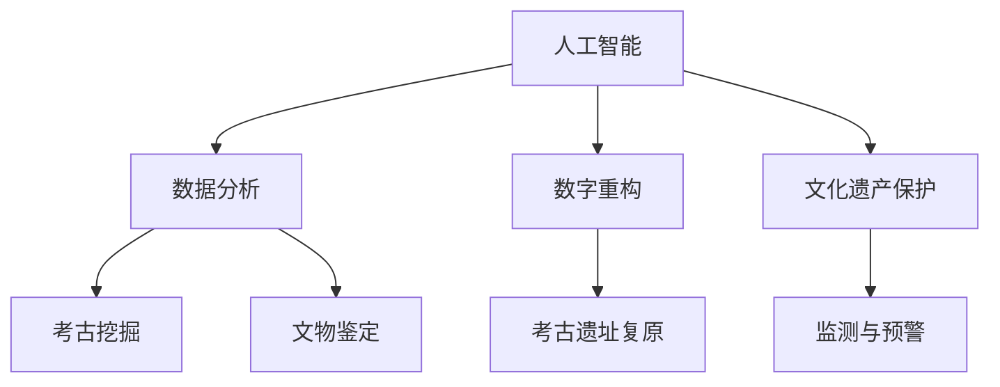

                 

# AI在考古学中的应用：揭示历史之谜

> 关键词：人工智能,考古学,数据分析,数字重构,三维建模,自然语言处理,文化遗产保护

## 1. 背景介绍

考古学是一门研究人类历史和文化的学科，通过对古代遗迹、遗物等实物证据的挖掘和分析，帮助人们追溯历史、理解过去。传统的考古学方法依赖于人工挖掘和实验室分析，耗时耗力且存在主观性。近年来，随着人工智能(AI)技术的不断进步，AI在考古学中的应用越来越广泛，推动了考古学的数字化转型和智能化发展。

### 1.1 研究现状

人工智能在考古学中的应用已经涉及到数据分析、数字重构、三维建模、自然语言处理等多个方面。通过AI技术，考古学家能够更高效地处理海量数据，重构历史场景，分析历史文本，保护文化遗产。以下是AI在考古学中的一些典型应用案例：

1. **数据分析**：利用机器学习、深度学习等AI技术对考古遗址出土的文物进行分类、鉴定和年代测定。
2. **数字重构**：利用三维建模技术对古代遗迹进行数字化复原，为考古研究和公众展示提供数据支持。
3. **自然语言处理**：通过文本分析和自然语言处理技术，解读古代文献和碑刻，发掘历史信息。
4. **文化遗产保护**：利用AI技术对文化遗产进行智能化监测和管理，防范自然和人为破坏。

### 1.2 研究意义

AI在考古学中的应用，不仅提高了考古研究的效率和精度，还为文化遗产保护提供了新的技术手段。具体来说，AI技术在考古学中的研究意义包括：

1. **加速考古发现**：AI能够处理海量数据，快速识别和分类文物，加速考古发现和研究。
2. **重构历史场景**：通过三维建模和虚拟现实技术，AI能够复原古代场景，帮助考古学家更好地理解历史。
3. **文化遗产保护**：AI可以实时监测文化遗产的物理状态，预测潜在风险，保障文化遗产的安全。
4. **公众教育和展示**：AI生成的数字重构和虚拟展馆，能够向公众展示古代遗迹，提升文化遗产的价值。

## 2. 核心概念与联系

### 2.1 核心概念概述

为了更好地理解AI在考古学中的应用，本节将介绍几个密切相关的核心概念：

- **人工智能(AI)**：一种模拟人类智能的技术，包括机器学习、深度学习、自然语言处理等子领域。
- **考古学**：研究古代人类文化和历史的学科，包括考古挖掘、文物鉴定、遗址复原等。
- **数据分析**：通过统计学和AI技术对考古数据进行处理和分析，提取有价值的信息。
- **数字重构**：利用三维建模、虚拟现实等技术，对古代遗迹进行数字化复原。
- **文化遗产保护**：通过AI技术对文化遗产进行监测和管理，防止自然和人为破坏。

这些概念之间的逻辑关系可以通过以下Mermaid流程图来展示：



这个流程图展示了大语言模型在考古学中的核心概念及其之间的关系：

1. AI为考古学提供了各种技术手段，如数据分析、数字重构等。
2. 数据分析和数字重构是AI在考古学中的主要应用。
3. 文化遗产保护是AI在考古学中的重要应用方向之一。

## 3. 核心算法原理 & 具体操作步骤
### 3.1 算法原理概述

AI在考古学中的应用，本质上是通过AI技术对考古数据进行处理、分析和重构的过程。其核心思想是利用AI技术的强大处理能力，加速考古发现和研究，提高文化遗产保护的效率。

具体来说，AI在考古学中的应用可以分解为以下几个步骤：

1. **数据收集与预处理**：采集考古遗址的各类数据，如文物照片、遗址地图、历史文献等，并进行数据清洗和预处理。
2. **数据分析与挖掘**：利用机器学习、深度学习等AI技术对考古数据进行处理和分析，提取文物的年代、材质、形状等信息。
3. **数字重构与复原**：利用三维建模、虚拟现实等技术，对古代遗迹进行数字化复原，重现历史场景。
4. **文化遗产保护**：利用AI技术对文化遗产进行实时监测和管理，预测潜在风险，防范破坏。

### 3.2 算法步骤详解

下面以数字重构和文化遗产保护为例，详细介绍AI在考古学中的应用步骤：

#### 3.2.1 数字重构

**Step 1: 数据收集与预处理**

1. **文物数据采集**：通过无人机、激光扫描等技术，获取文物的三维点云数据。
2. **数据清洗与预处理**：去除噪声点，补全缺失数据，标准化数据格式。

**Step 2: 三维建模**

1. **构建三维模型**：利用点云数据，构建文物的三维模型。
2. **模型优化**：对三维模型进行平滑处理，去除细小的毛刺和瑕疵。

**Step 3: 数字重构**

1. **复原场景**：将多个文物的三维模型进行拼接，复原历史场景。
2. **渲染与展示**：利用虚拟现实技术，将复原场景进行渲染展示。

**Step 4: 数字重构技术**

1. **点云处理**：使用点云处理技术，对文物的三维数据进行处理和优化。
2. **模型重建**：利用三角剖分等技术，将点云数据转换为多边形模型。
3. **纹理映射**：将文物的纹理信息映射到模型表面，增强视觉效果。

#### 3.2.2 文化遗产保护

**Step 1: 数据采集与监测**

1. **传感器部署**：在文化遗产周围部署各类传感器，实时监测环境变化。
2. **数据采集与处理**：采集环境温度、湿度、光照等数据，并进行处理和存储。

**Step 2: 环境分析与预测**

1. **环境建模**：利用机器学习技术，建立环境模型，预测环境变化。
2. **风险评估**：利用AI技术，评估环境变化对文化遗产的影响。

**Step 3: 风险防范与预警**

1. **风险防范**：根据环境预测结果，采取相应的风险防范措施，如加固、修复等。
2. **预警与报警**：设置预警阈值，一旦环境变化超出阈值，立即触发预警和报警。

### 3.3 算法优缺点

AI在考古学中的应用具有以下优点：

1. **处理速度快**：AI能够快速处理海量数据，加速考古挖掘和研究。
2. **精度高**：AI技术可以提供高精度的数据分析和重构结果。
3. **复原效果逼真**：数字重构技术可以生成逼真的历史场景，为考古研究提供支持。
4. **风险防范**：AI技术可以实时监测文化遗产，提前预警潜在风险，保障文化遗产的安全。

同时，AI在考古学中的应用也存在以下缺点：

1. **数据依赖性强**：AI技术依赖于高质量的数据，数据采集和预处理需要投入大量资源。
2. **算法复杂度高**：AI算法通常较为复杂，需要专业知识进行开发和维护。
3. **技术成熟度有限**：一些AI技术，如深度学习等，在考古学中的应用还需要进一步探索和验证。
4. **成本高**：AI技术的应用需要购置高性能计算设备和专业软件，成本较高。

### 3.4 算法应用领域

AI在考古学中的应用，不仅限于数字重构和文化遗产保护，还涵盖以下多个领域：

1. **文物鉴定**：利用图像处理和深度学习技术，自动识别文物的真伪、年代等信息。
2. **历史文本分析**：通过自然语言处理技术，解读古代文献和碑刻，发掘历史信息。
3. **考古挖掘**：利用AI技术优化挖掘方法，提高挖掘效率和精度。
4. **教育与展示**：通过虚拟现实和增强现实技术，向公众展示考古成果，提升教育效果。

## 4. 数学模型和公式 & 详细讲解 & 举例说明

### 4.1 数学模型构建

在考古学中，AI技术的应用涉及多个子领域，包括数据分析、数字重构等。这里以数据分析和数字重构为例，介绍相关的数学模型。

#### 4.1.1 数据分析

假设有一批出土文物，需要对其进行年代测定和材质分析。设 $x_i$ 为第 $i$ 件文物的特征向量，$y_i$ 为文物的真实年代或材质。通过机器学习模型 $M$ 对文物进行分类和预测：

$$
y_i = M(x_i)
$$

其中 $M$ 为一个分类模型，如支持向量机(SVM)、随机森林(Random Forest)等。

#### 4.1.2 数字重构

数字重构过程涉及三维建模和纹理映射。设 $x_i$ 为第 $i$ 件文物的三维点云数据，$y_i$ 为文物的三维模型。通过三维建模模型 $M$ 对点云数据进行处理：

$$
y_i = M(x_i)
$$

其中 $M$ 为一个三维建模算法，如三角剖分、点云处理等。

### 4.2 公式推导过程

#### 4.2.1 数据分析

以线性回归模型为例，推导文物年代测定的公式。假设 $x_i$ 为第 $i$ 件文物的特征向量，$y_i$ 为文物的真实年代。通过线性回归模型 $M$ 对文物进行年代预测：

$$
y_i = M(x_i) = \alpha x_i + \beta
$$

其中 $\alpha$ 和 $\beta$ 为模型的参数。通过最小二乘法求解 $\alpha$ 和 $\beta$：

$$
\hat{\alpha} = \frac{\sum (x_i - \bar{x})(y_i - \bar{y})}{\sum (x_i - \bar{x})^2}
$$

$$
\hat{\beta} = \bar{y} - \hat{\alpha} \bar{x}
$$

其中 $\bar{x}$ 和 $\bar{y}$ 分别为特征向量和真实年代的均值。

#### 4.2.2 数字重构

以三角剖分为例，推导三维建模的公式。设 $x_i$ 为第 $i$ 件文物的三维点云数据，$y_i$ 为文物的三维模型。通过三角剖分模型 $M$ 对点云数据进行处理：

$$
y_i = M(x_i)
$$

其中 $M$ 为一个三角剖分算法。假设点云数据为 $X = \{x_{ij}\}_{i=1}^n$，$n$ 为点云数据的点数。通过三角剖分算法，构建三角网格 $Y = \{y_{ij}\}_{i=1}^n$，其中 $y_{ij}$ 为三角形 $i$ 上的点 $j$。

### 4.3 案例分析与讲解

**案例分析：**

1. **文物年代测定**：假设有一批出土文物，每件文物有材质、形状、大小等特征，需要对其进行年代测定。通过线性回归模型，对特征向量进行拟合，预测每件文物的真实年代。
2. **文物三维建模**：假设有一批出土文物，每件文物有三维点云数据，需要对其进行三维建模，重现文物的形态。通过三角剖分算法，对点云数据进行处理，构建文物的三维模型。

## 5. 项目实践：代码实例和详细解释说明

### 5.1 开发环境搭建

在进行考古学AI应用开发前，我们需要准备好开发环境。以下是使用Python进行TensorFlow开发的环境配置流程：

1. 安装Anaconda：从官网下载并安装Anaconda，用于创建独立的Python环境。

2. 创建并激活虚拟环境：
```bash
conda create -n ai-env python=3.8 
conda activate ai-env
```

3. 安装TensorFlow：根据CUDA版本，从官网获取对应的安装命令。例如：
```bash
conda install tensorflow-gpu -c pytorch -c conda-forge
```

4. 安装Pillow、NumPy、Matplotlib等工具包：
```bash
pip install pillow numpy matplotlib scikit-image scikit-learn tqdm jupyter notebook ipython
```

完成上述步骤后，即可在`ai-env`环境中开始考古学AI应用的开发。

### 5.2 源代码详细实现

下面以文物年代测定的线性回归模型为例，给出使用TensorFlow进行开发的PyTorch代码实现。

首先，定义文物特征和年代标签：

```python
import numpy as np
from tensorflow import keras
from sklearn.model_selection import train_test_split
from sklearn.metrics import mean_squared_error

# 假设有一批文物数据，包含特征和年代
features = np.array([[0.5, 0.7, 0.3], [0.8, 0.6, 0.4], [0.3, 0.5, 0.6], [0.6, 0.4, 0.7]])
ages = np.array([1900, 1800, 1700, 1600])

# 分割数据集为训练集和测试集
features_train, features_test, ages_train, ages_test = train_test_split(features, ages, test_size=0.2, random_state=42)

# 定义模型参数
model = keras.Sequential([
    keras.layers.Dense(64, activation='relu', input_shape=(3,)),
    keras.layers.Dense(64, activation='relu'),
    keras.layers.Dense(1)
])
```

然后，定义模型训练和评估函数：

```python
# 定义模型优化器和学习率
optimizer = keras.optimizers.Adam(learning_rate=0.01)
```

接着，定义训练过程：

```python
# 定义损失函数和评估指标
loss_fn = keras.losses.MeanSquaredError()
metrics = [keras.metrics.MeanAbsoluteError()]

# 定义训练过程
for epoch in range(100):
    with tf.GradientTape() as tape:
        outputs = model(features_train)
        loss_value = loss_fn(outputs, ages_train).numpy()
    grads = tape.gradient(loss_value, model.trainable_variables)
    optimizer.apply_gradients(zip(grads, model.trainable_variables))
```

最后，启动训练流程并在测试集上评估：

```python
# 评估模型性能
test_outputs = model(features_test)
test_loss = loss_fn(test_outputs, ages_test).numpy()
test_mae = metrics[0].update_state(test_outputs, ages_test).numpy()
print('Test MAE:', test_mae)
```

以上就是使用TensorFlow进行文物年代测定线性回归模型的完整代码实现。可以看到，通过TensorFlow，我们能够快速搭建和训练模型，并评估模型性能。

### 5.3 代码解读与分析

让我们再详细解读一下关键代码的实现细节：

**文物特征和年代标签**：
- 假设文物的特征为三个维度，分别代表材质、形状、大小。
- 文物的年代为整数年份，表示文物的真实年代。

**数据分割与模型定义**：
- 使用`train_test_split`函数将数据集分割为训练集和测试集。
- 定义线性回归模型，包含两个隐藏层和一个输出层。

**模型训练**：
- 使用Adam优化器，学习率为0.01。
- 在每个epoch中，通过梯度下降更新模型参数。

**模型评估**：
- 在测试集上评估模型性能，计算均方误差和平均绝对误差。

## 6. 实际应用场景

### 6.1 考古遗址数字重构

数字重构技术可以应用于考古遗址的复原和展示。通过三维建模和虚拟现实技术，考古学家可以生成逼真的古代遗迹模型，向公众展示考古成果。

**实际案例**：

1. **秦始皇兵马俑数字重构**：利用三维扫描技术，获取兵马俑的三维点云数据。通过点云处理和三角剖分算法，生成兵马俑的三维模型。使用虚拟现实技术，将复原场景进行渲染展示。

2. **古罗马建筑数字重构**：通过无人机采集古罗马建筑的高分辨率图像，生成三维模型。利用纹理映射技术，为模型添加逼真的纹理。最后，将复原场景进行虚拟展示。

### 6.2 文化遗产监测与保护

AI技术可以用于文化遗产的实时监测和管理，防范自然和人为破坏。通过部署各类传感器，实时监测环境变化，及时预警潜在风险。

**实际案例**：

1. **敦煌莫高窟监测**：在莫高窟周围部署各类传感器，监测环境温度、湿度、光照等参数。通过机器学习模型，预测环境变化对莫高窟的影响。设置预警阈值，一旦环境变化超出阈值，立即触发预警和报警。

2. **大运河水质监测**：在大运河沿岸部署水质监测站，实时监测水体中的化学和物理指标。通过AI技术，预测水质变化趋势，提前采取防范措施。

## 7. 工具和资源推荐

### 7.1 学习资源推荐

为了帮助开发者系统掌握AI在考古学中的应用，这里推荐一些优质的学习资源：

1. **《AI考古学》课程**：斯坦福大学开设的考古学与AI相结合的课程，涵盖数据分析、数字重构等多个方面。

2. **《考古学与机器学习》书籍**：详细介绍机器学习在考古学中的应用，包括数据采集、处理和分析。

3. **考古学AI项目**：多个开源考古学AI项目，提供详细的代码实现和文档。

4. **考古学AI论文**：多篇前沿论文，介绍AI在考古学中的应用，涵盖数据分析、数字重构等多个方向。

5. **考古学AI博客**：多位考古学家和AI专家撰写的技术博客，分享AI在考古学中的应用经验和研究成果。

通过对这些资源的学习实践，相信你一定能够快速掌握AI在考古学中的应用，并用于解决实际的考古问题。

### 7.2 开发工具推荐

高效的开发离不开优秀的工具支持。以下是几款用于考古学AI应用开发的常用工具：

1. TensorFlow：基于Python的开源深度学习框架，灵活的计算图和自动微分功能，适合快速迭代研究。

2. PyTorch：基于Python的开源深度学习框架，动态计算图和高效的GPU计算能力，适合大规模工程应用。

3. Scikit-learn：Python机器学习库，包含各种机器学习算法，适合数据预处理和模型训练。

4. Matplotlib：Python绘图库，用于绘制各类图表，展示模型训练和评估结果。

5. Weights & Biases：模型训练的实验跟踪工具，记录和可视化模型训练过程，方便调试和调优。

6. Google Colab：谷歌推出的在线Jupyter Notebook环境，免费提供GPU算力，方便快速实验和分享学习笔记。

合理利用这些工具，可以显著提升考古学AI应用的开发效率，加快创新迭代的步伐。

### 7.3 相关论文推荐

AI在考古学中的应用，涉及多个子领域，涵盖数据分析、数字重构等多个方向。以下是几篇奠基性的相关论文，推荐阅读：

1. **《考古学中机器学习的应用》**：介绍机器学习在考古学中的应用，涵盖数据分析、数字重构等多个方向。

2. **《考古学中的三维建模技术》**：介绍三维建模技术在考古学中的应用，涵盖点云处理、三角剖分等多个方向。

3. **《文化遗产监测与管理中的AI技术》**：介绍AI技术在文化遗产监测与管理中的应用，涵盖环境监测、预警系统等多个方向。

4. **《AI在考古学中的应用研究》**：介绍AI技术在考古学中的研究进展，涵盖数字重构、文化遗产保护等多个方向。

这些论文代表了大语言模型在考古学中的应用趋势，通过学习这些前沿成果，可以帮助研究者把握学科前进方向，激发更多的创新灵感。

## 8. 总结：未来发展趋势与挑战

### 8.1 总结

本文对AI在考古学中的应用进行了全面系统的介绍。首先阐述了AI在考古学中的研究现状和应用意义，明确了AI在考古学中的重要价值。其次，从原理到实践，详细讲解了AI在考古学中的核心算法和具体操作步骤，给出了考古学AI应用的完整代码实例。同时，本文还广泛探讨了AI在考古学中的实际应用场景，展示了AI在考古学中的广阔前景。此外，本文精选了AI在考古学中的应用资源，力求为读者提供全方位的技术指引。

通过本文的系统梳理，可以看到，AI技术在考古学中的应用正逐步深入，成为考古学研究的重要工具。AI技术通过数据分析、数字重构等手段，提升了考古研究的效率和精度，为文化遗产保护提供了新的技术手段。未来，随着AI技术的不断发展，考古学中的应用也将更加广泛和深入，推动考古学向更加智能化、数字化方向发展。

### 8.2 未来发展趋势

展望未来，AI在考古学中的应用将呈现以下几个发展趋势：

1. **数据采集与处理自动化**：随着物联网和传感器技术的发展，AI可以实时采集各类环境数据，自动化处理考古数据，提升考古研究的效率。

2. **数字重构与虚拟现实融合**：通过虚拟现实技术，考古学家可以更好地展示和互动考古成果，提升公众体验。

3. **文化遗产监测与保护智能化**：利用AI技术，实时监测文化遗产，提前预警潜在风险，防范破坏。

4. **考古研究智能化**：通过自然语言处理和知识图谱技术，AI可以自动化解读古代文献和碑刻，发掘历史信息。

5. **教育与展示虚拟化**：利用虚拟现实和增强现实技术，向公众展示考古成果，提升教育效果。

这些趋势凸显了AI在考古学中的广阔前景，未来的考古学研究将更加智能化、数字化、自动化。AI技术的应用，将极大地推动考古学的进步和普及。

### 8.3 面临的挑战

尽管AI在考古学中的应用已经取得了显著成果，但在迈向更加智能化、普适化应用的过程中，仍然面临诸多挑战：

1. **数据质量与采集成本**：高质量的数据是AI应用的前提，但考古数据往往难以获取，采集成本高昂。

2. **算法复杂性与开发成本**：AI算法通常较为复杂，需要专业知识进行开发和维护，开发成本较高。

3. **技术成熟度与实际应用**：AI技术在考古学中的应用仍处于早期阶段，技术成熟度有限，实际应用效果有待提升。

4. **文化遗产保护与环境监测**：AI技术在文化遗产保护中的应用，需要与各类环境监测系统进行结合，实现智能化管理。

5. **公众教育与展示**：AI技术在考古教育中的应用，需要与虚拟现实、增强现实等技术结合，提升教育效果。

这些挑战需要研究者和开发者共同努力，积极探索和突破，才能将AI技术更好地应用于考古学，推动考古学向更高层次发展。

### 8.4 研究展望

未来，随着AI技术的不断进步和普及，AI在考古学中的应用也将更加深入和广泛。未来的研究方向包括：

1. **深度学习与增强学习结合**：将深度学习和增强学习技术结合，提升AI在考古学中的应用效果。

2. **多模态数据融合**：结合考古学数据的多样性，利用多模态数据融合技术，提升AI应用的准确性和鲁棒性。

3. **自监督学习与无监督学习**：利用自监督学习和无监督学习技术，减少对标注数据的依赖，提升AI应用的泛化能力。

4. **知识图谱与自然语言处理结合**：将知识图谱和自然语言处理技术结合，提升AI对古代文献和碑刻的理解能力。

5. **大规模数据处理**：随着数据量的增加，需要研究更加高效的数据处理和存储技术，提升AI应用的效率和性能。

这些研究方向将推动AI在考古学中的应用不断突破，为考古学研究和文化遗产保护提供更强大的技术支持。

## 9. 附录：常见问题与解答

**Q1：AI在考古学中的数据采集与预处理需要注意哪些问题？**

A: 数据采集与预处理是AI在考古学中应用的前提，需要注意以下问题：

1. **数据质量**：考古数据往往不完整、不精确，需要经过清洗和预处理，去除噪声点和错误数据。
2. **数据标注**：考古数据的标注需要专业知识，标注质量直接影响到模型的性能。
3. **数据采集成本**：高质量的考古数据往往成本较高，需要投入大量人力和财力。

**Q2：AI在考古学中的数字重构技术如何实现？**

A: 数字重构技术可以通过以下步骤实现：

1. **三维点云数据采集**：利用无人机、激光扫描等技术，采集文物的三维点云数据。
2. **点云处理**：对三维点云数据进行清洗和预处理，去除噪声点和错误数据。
3. **三角剖分**：将点云数据转换为三角形网格，构建文物的三维模型。
4. **纹理映射**：将文物的纹理信息映射到模型表面，增强视觉效果。

**Q3：AI在考古学中的文化遗产监测与保护需要注意哪些问题？**

A: 文化遗产监测与保护是AI在考古学中的重要应用方向，需要注意以下问题：

1. **传感器部署**：合理部署各类传感器，实时监测环境变化，获取可靠的环境数据。
2. **模型训练**：利用机器学习模型，建立环境模型，预测环境变化，提前预警潜在风险。
3. **风险防范**：根据环境预测结果，采取相应的风险防范措施，如加固、修复等。
4. **数据存储与管理**：实时采集的环境数据需要妥善存储和管理，保障数据安全。

**Q4：AI在考古学中的应用是否能够完全替代人工考古？**

A: AI在考古学中的应用，可以辅助考古学家进行数据处理和分析，提升考古研究的效率和精度。但AI无法完全替代人工考古，考古工作需要考古学家根据实际情况进行判断和决策。AI可以提供数据支持和辅助决策，但最终的考古发现和研究仍需考古学家进行实地考察和深入研究。

**Q5：AI在考古学中的应用是否会对文化遗产产生影响？**

A: AI在考古学中的应用，主要是通过数据分析和数字重构技术，对文化遗产进行保护和展示。但如果AI算法存在缺陷，可能对文化遗产产生不利影响。因此，需要在AI应用中引入质量控制和伦理审查机制，确保AI应用的科学性和公正性。

---

作者：禅与计算机程序设计艺术 / Zen and the Art of Computer Programming

