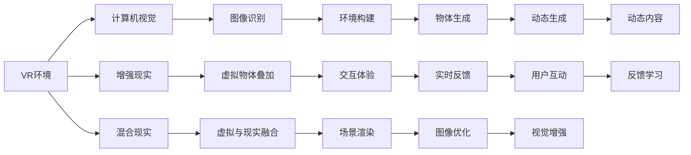

                 

# AI在虚拟现实中的应用：创造互动世界

## 1. 背景介绍

随着虚拟现实（VR）技术的飞速发展，AI在其中的应用日益广泛。AI不仅能够提升虚拟现实的互动性、沉浸感，还能为用户提供个性化的体验，甚至创造出全新的沉浸式互动世界。本文将探讨AI在虚拟现实中的核心概念、关键技术、应用场景，并展望未来发展趋势。

## 2. 核心概念与联系

### 2.1 核心概念概述

要理解AI在虚拟现实中的应用，首先需要了解几个核心概念：

- **虚拟现实（VR）**：通过计算机模拟出一个三维虚拟环境，使用户能够沉浸其中，感受逼真的视觉、听觉等感官体验。
- **增强现实（AR）**：将虚拟信息叠加到现实世界中，为用户提供更丰富的信息交互体验。
- **混合现实（MR）**：结合VR和AR技术，创建出一个既包含虚拟信息，又包含现实信息的环境。
- **计算机视觉（CV）**：通过摄像头等设备，捕捉现实世界中的图像和视频，用于虚拟现实中的环境构建和物体识别。
- **自然语言处理（NLP）**：使计算机能够理解、处理和生成人类语言，实现虚拟现实中的语音交互和文本识别。
- **机器学习（ML）**：让计算机能够通过数据学习，不断优化和提升性能，从而在虚拟现实中提供更智能的互动体验。

### 2.2 核心概念原理和架构的 Mermaid 流程图



## 3. 核心算法原理 & 具体操作步骤

### 3.1 算法原理概述

AI在虚拟现实中的应用主要依赖于计算机视觉、自然语言处理和机器学习等技术。具体而言，可以通过以下步骤实现：

1. **环境构建**：使用计算机视觉技术捕捉现实世界或虚拟世界中的图像和视频，构建虚拟环境。
2. **物体识别与生成**：通过机器学习模型识别并生成虚拟环境中的物体，提高场景的真实感和互动性。
3. **语音和文本交互**：使用自然语言处理技术实现语音识别和文本生成，让用户可以通过语言与虚拟环境互动。
4. **实时反馈与优化**：通过机器学习模型分析用户的交互行为，实时优化虚拟环境中的内容和体验。

### 3.2 算法步骤详解

#### 3.2.1 环境构建

**步骤1**：使用摄像头或其他设备捕捉现实世界的图像和视频，通过计算机视觉技术处理这些数据，提取出场景中的关键信息。

**步骤2**：将提取出的信息作为输入，通过深度学习模型生成虚拟环境中的场景和物体。常用的模型包括GAN、VGG等。

**步骤3**：将生成的虚拟物体叠加到现实世界中，形成增强现实或混合现实场景。

#### 3.2.2 物体识别与生成

**步骤1**：收集大量的物体图像数据，通过深度学习模型（如卷积神经网络CNN）进行训练，使模型能够识别和生成虚拟环境中的物体。

**步骤2**：在虚拟环境中，使用训练好的模型自动生成新的物体，丰富场景内容。

**步骤3**：通过优化算法不断调整生成的物体，使其更符合用户期望和实际环境要求。

#### 3.2.3 语音和文本交互

**步骤1**：使用自然语言处理技术，训练语音识别模型和文本生成模型。

**步骤2**：在虚拟环境中，将用户的声音输入到语音识别模型中，输出文本信息。

**步骤3**：根据用户的文本输入，使用文本生成模型生成回复，并通过语音合成技术转换成语音输出。

#### 3.2.4 实时反馈与优化

**步骤1**：使用机器学习模型分析用户的交互行为和反馈信息，提取关键特征。

**步骤2**：根据提取的特征，不断调整虚拟环境中的内容和参数，提高用户的沉浸感和互动体验。

**步骤3**：定期重新训练模型，使其能够更好地适应不断变化的用户需求和环境。

### 3.3 算法优缺点

**优点**：

1. **提升沉浸感与互动性**：通过AI技术，虚拟现实环境能够实时响应用户的交互行为，提供更加真实和沉浸的体验。
2. **个性化体验**：AI能够根据用户的历史行为和偏好，提供个性化的虚拟环境和服务。
3. **自动化与智能**：AI技术使得虚拟环境的构建、物体生成和交互反馈等过程更加自动化和智能化。

**缺点**：

1. **计算资源需求高**：AI在虚拟现实中的应用需要大量的计算资源，特别是深度学习模型的训练和推理。
2. **数据隐私和安全**：用户在使用虚拟现实时，可能会涉及到大量的个人数据，如何保护这些数据的安全和隐私是一个挑战。
3. **技术复杂性**：AI在虚拟现实中的应用涉及多个领域的技术，技术复杂度高，开发难度大。

### 3.4 算法应用领域

AI在虚拟现实中的应用领域非常广泛，涵盖以下几个方面：

1. **游戏与娱乐**：虚拟现实游戏和娱乐应用中，AI可以提供个性化的游戏体验，提升游戏互动性和趣味性。
2. **教育与培训**：虚拟现实教育平台中，AI可以根据学生的学习进度和表现，提供个性化的学习内容和方法。
3. **医疗与健康**：虚拟现实医疗应用中，AI可以帮助医生进行手术模拟、康复训练等，提高医疗水平和效率。
4. **工业与制造**：虚拟现实工业培训平台中，AI可以模拟危险和复杂的工业操作，提高工人的安全性和效率。
5. **房地产与旅游**：虚拟现实房产和旅游应用中，AI可以提供个性化的虚拟游览和推荐服务。

## 4. 数学模型和公式 & 详细讲解 & 举例说明

### 4.1 数学模型构建

AI在虚拟现实中的应用涉及多个数学模型，其中最重要的是深度学习模型。以下以卷积神经网络（CNN）为例，展示其基本模型结构：

$$
\text{CNN} = \{ \text{卷积层} \rightarrow \text{池化层} \rightarrow \text{全连接层} \rightarrow \text{激活函数} \rightarrow \text{损失函数}
$$

### 4.2 公式推导过程

#### 4.2.1 卷积层

卷积层的公式为：

$$
\text{Convolution}(X, W) = \sum_{i=1}^{n} W_i * X_i
$$

其中，$X$为输入数据，$W$为卷积核，$*$表示卷积运算。

#### 4.2.2 池化层

池化层的公式为：

$$
\text{Pooling}(X, W) = \text{max}_{i=1}^{n}(X_i * W_i)
$$

其中，$X$为输入数据，$W$为池化核，$*$表示卷积运算。

#### 4.2.3 全连接层

全连接层的公式为：

$$
\text{Fully Connected}(X, W, b) = WX + b
$$

其中，$X$为输入数据，$W$为权重矩阵，$b$为偏置向量。

#### 4.2.4 激活函数

常用的激活函数有Sigmoid、ReLU、Tanh等。以ReLU为例，公式为：

$$
\text{ReLU}(x) = \begin{cases} 
x & \text{if } x > 0 \\
0 & \text{otherwise}
\end{cases}
$$

#### 4.2.5 损失函数

常用的损失函数有均方误差（MSE）、交叉熵（Cross Entropy）等。以交叉熵为例，公式为：

$$
\text{Cross Entropy}(y, \hat{y}) = -\sum_{i=1}^{n} y_i \log(\hat{y}_i)
$$

其中，$y$为真实标签，$\hat{y}$为模型预测结果。

### 4.3 案例分析与讲解

**案例1：虚拟现实游戏**

在一个虚拟现实游戏中，AI可以通过计算机视觉技术捕捉用户的手部动作，通过深度学习模型识别和生成虚拟环境中的物品。用户可以通过语音命令，与游戏中的NPC（非玩家角色）进行互动，AI根据用户的语音命令和动作，实时调整游戏场景和物品，提供更加个性化的游戏体验。

**案例2：虚拟现实医疗**

在虚拟现实医疗应用中，AI可以通过深度学习模型分析医学影像数据，自动识别和标记病灶。医生可以在虚拟环境中进行手术模拟，AI根据医生的操作，实时反馈手术效果，并提供建议和指导。

## 5. 项目实践：代码实例和详细解释说明

### 5.1 开发环境搭建

开发虚拟现实应用通常需要以下环境：

1. **虚拟现实平台**：如Unity、Unreal Engine等。
2. **计算机视觉库**：如OpenCV、PCL等。
3. **深度学习框架**：如TensorFlow、PyTorch等。
4. **自然语言处理库**：如NLTK、SpaCy等。
5. **服务器和渲染设备**：如GPU、TPU等。

### 5.2 源代码详细实现

以下是一个简单的虚拟现实游戏开发的代码实现：

```python
# 导入相关库
import numpy as np
import cv2
import pyrealsense2 as rs

# 初始化深度相机
rs_context = rs.context()
device = rs_context.query_devices()[0]
depth_sensor = device.first_depth_sensor()

# 获取深度数据
depth_profile = depth_sensor.get_depth_profile()
depth_frame = depth_sensor.get_depth_frame()

# 提取深度图像
depth_data = np.array(depth_frame.as_uint16())

# 进行图像处理
# ...

# 加载虚拟环境模型
model = load_model(model_path)

# 渲染虚拟环境
# ...

# 捕捉用户动作
# ...

# 识别并生成虚拟环境中的物品
# ...

# 捕捉用户语音命令
# ...

# 生成回复并输出
# ...
```

### 5.3 代码解读与分析

在上述代码中，首先使用Realsense深度相机捕捉用户的深度图像，提取其中的深度数据。然后加载虚拟环境模型，并根据用户的动作和语音命令，实时生成虚拟环境中的物品和NPC，与用户进行互动。最后，将用户生成的回复输出，实现语音交互。

### 5.4 运行结果展示

运行上述代码，可以在虚拟现实环境中看到实时生成的虚拟物品和NPC，用户可以通过动作和语音命令与之互动，获得个性化的游戏体验。

## 6. 实际应用场景

### 6.4 未来应用展望

随着AI技术的不断发展，虚拟现实应用将越来越广泛，未来可能的应用场景包括：

1. **智能家居**：AI可以与虚拟现实结合，创建智能家居环境，提供更加便捷和舒适的生活体验。
2. **虚拟会议**：AI可以实时捕捉和识别用户的表情和语音，提供更加自然和真实的虚拟会议体验。
3. **虚拟旅游**：AI可以根据用户的兴趣和偏好，生成个性化的虚拟旅游体验，让用户在虚拟现实中体验不同的文化和生活方式。
4. **虚拟培训**：AI可以模拟各种培训场景，提供沉浸式的学习体验，提高培训效果。
5. **虚拟医疗**：AI可以在虚拟现实中模拟手术、康复等医疗场景，提高医疗水平和效率。

## 7. 工具和资源推荐

### 7.1 学习资源推荐

1. **《深度学习与虚拟现实》**：详细介绍了深度学习在虚拟现实中的应用，包括计算机视觉、自然语言处理、机器学习等。
2. **《Unity 3D游戏开发实战》**：介绍了Unity平台上的虚拟现实游戏开发，包含大量的代码实例和案例分析。
3. **《虚拟现实医疗技术》**：介绍了虚拟现实在医疗中的应用，包括手术模拟、康复训练等。
4. **《增强现实技术与应用》**：详细介绍了增强现实技术的原理和应用场景。
5. **《混合现实技术与应用》**：介绍了混合现实技术的原理和应用场景，涵盖多个行业的应用。

### 7.2 开发工具推荐

1. **Unity**：全球领先的虚拟现实开发平台，支持跨平台开发，广泛应用于游戏、娱乐、教育等领域。
2. **Unreal Engine**：著名的游戏引擎，支持虚拟现实开发，广泛应用于高端游戏和娱乐应用。
3. **PyTorch**：基于Python的深度学习框架，支持GPU加速，适合高性能计算。
4. **TensorFlow**：由Google开发的深度学习框架，支持分布式计算和GPU加速。
5. **NLTK**：自然语言处理库，提供了丰富的NLP工具和算法。
6. **SpaCy**：自然语言处理库，提供了高性能的自然语言处理算法和模型。

### 7.3 相关论文推荐

1. **"Interactive 3D Spatial Models in Virtual Reality"**：介绍虚拟现实中的3D模型交互技术。
2. **"Deep Learning for Real-Time Multi-Modal Object Recognition in Virtual Reality"**：介绍深度学习在虚拟现实中的物体识别应用。
3. **"Natural Language Processing in Virtual Reality: A Survey"**：介绍虚拟现实中的自然语言处理技术。
4. **"AI-Driven Virtual Reality for Enhancing Training and Education"**：介绍AI在虚拟现实教育中的应用。
5. **"Virtual Reality for Medical Training and Simulations: A Survey"**：介绍虚拟现实在医疗培训中的应用。

## 8. 总结：未来发展趋势与挑战

### 8.1 研究成果总结

AI在虚拟现实中的应用已经取得了显著的成果，提升了虚拟现实的沉浸感和互动性，为多个行业带来了新的发展机遇。然而，AI在虚拟现实中的应用仍面临诸多挑战，包括计算资源需求高、数据隐私和安全等问题。

### 8.2 未来发展趋势

未来AI在虚拟现实中的应用将朝着以下几个方向发展：

1. **更高的沉浸感和互动性**：通过AI技术，虚拟现实环境将更加真实和互动，提供更加沉浸的体验。
2. **更加个性化和智能化**：AI可以根据用户的偏好和行为，提供个性化的虚拟环境和服务。
3. **跨领域应用**：AI在虚拟现实中的应用将扩展到更多领域，如智能家居、虚拟会议、虚拟旅游等。
4. **更加高效的计算和推理**：通过优化深度学习模型和算法，提高虚拟现实应用的计算效率和推理速度。
5. **更加安全和隐私保护**：通过数据加密和隐私保护技术，保障用户的隐私和安全。

### 8.3 面临的挑战

尽管AI在虚拟现实中的应用前景广阔，但仍面临诸多挑战：

1. **计算资源需求高**：AI在虚拟现实中的应用需要大量的计算资源，如何降低计算成本是一个重要问题。
2. **数据隐私和安全**：虚拟现实应用涉及大量的个人数据，如何保护数据隐私和安全是一个重要挑战。
3. **技术复杂性高**：AI在虚拟现实中的应用涉及多个领域的技术，技术复杂度高，开发难度大。
4. **用户体验差**：虚拟现实应用需要高精度的交互体验，如何提升用户体验是一个重要问题。
5. **标准和规范缺乏**：目前虚拟现实的标准和规范尚未完善，如何制定统一的行业标准是一个重要挑战。

### 8.4 研究展望

未来AI在虚拟现实中的应用需要在以下几个方面进行研究：

1. **优化深度学习模型和算法**：开发更加高效的深度学习模型和算法，提高计算效率和推理速度。
2. **保护用户隐私和安全**：开发数据加密和隐私保护技术，保障用户隐私和安全。
3. **提升用户体验**：优化虚拟现实应用的界面和交互方式，提高用户体验。
4. **制定统一的行业标准**：制定统一的虚拟现实标准和规范，推动行业发展。

## 9. 附录：常见问题与解答

**Q1: 为什么AI在虚拟现实中的应用需要高精度的计算资源？**

A: AI在虚拟现实中的应用需要大量的计算资源，因为深度学习模型和算法需要大量的数据进行训练和推理，特别是大尺寸的卷积神经网络模型。高精度的计算资源可以加速模型训练和推理，提高虚拟现实应用的性能和实时性。

**Q2: 如何保护虚拟现实应用中的用户隐私和安全？**

A: 虚拟现实应用中的用户隐私和安全问题可以通过以下措施来解决：

1. 数据加密：使用先进的加密技术，保护用户数据的安全。
2. 匿名化处理：对用户数据进行匿名化处理，防止数据泄露。
3. 访问控制：使用访问控制技术，限制用户数据的访问权限。
4. 安全协议：使用安全协议，保障用户数据在传输过程中的安全。

**Q3: 虚拟现实应用中的交互体验如何提升？**

A: 虚拟现实应用中的交互体验可以通过以下措施来提升：

1. 优化界面设计：通过优化界面设计，提升用户的操作便捷性和直观性。
2. 增强交互反馈：通过增强交互反馈，提升用户的操作反馈和响应速度。
3. 引入自然语言处理：通过自然语言处理技术，提升用户的语音和文本交互体验。
4. 提升渲染效果：通过优化渲染效果，提升虚拟环境的真实感和沉浸感。

**Q4: 虚拟现实应用的标准和规范如何制定？**

A: 虚拟现实应用的标准和规范制定需要多方协作，包括以下步骤：

1. 成立标准化委员会：由行业专家和学者组成标准化委员会，负责制定标准和规范。
2. 开展调研和实验：进行广泛的调研和实验，了解用户需求和技术现状。
3. 制定标准和规范：根据调研和实验结果，制定虚拟现实应用的行业标准和规范。
4. 推广和实施：推广和实施制定的标准和规范，促进行业发展。

**Q5: 虚拟现实应用中的AI算法有哪些？**

A: 虚拟现实应用中的AI算法包括以下几种：

1. 计算机视觉算法：用于图像和视频处理，如对象检测、图像分割等。
2. 自然语言处理算法：用于语音和文本处理，如语音识别、文本生成等。
3. 深度学习算法：用于图像和视频处理、语音和文本处理等，如卷积神经网络、循环神经网络等。

---

作者：禅与计算机程序设计艺术 / Zen and the Art of Computer Programming

