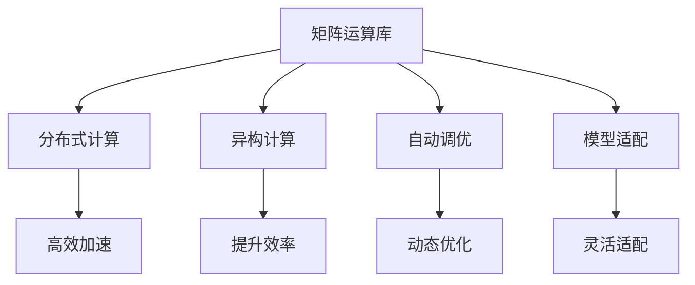

                 

# AI基础架构创新：Lepton AI专注高性能大语言模型推理引擎

> 关键词：高性能大语言模型,推理引擎,Lepton AI,矩阵运算,GPU加速,深度学习框架

## 1. 背景介绍

### 1.1 问题由来

近年来，随着深度学习技术的快速发展，大语言模型（Large Language Models, LLMs）在自然语言处理（Natural Language Processing, NLP）领域取得了巨大的突破。这些大语言模型通过在海量无标签文本数据上进行预训练，学习到了丰富的语言知识和常识，能够实现自动化的语言理解和生成。然而，由于大语言模型在推理计算中的高复杂度和高资源需求，实际应用中常常面临计算瓶颈，导致推理速度慢、延迟高、内存占用大等问题，难以满足大规模实时推理的需求。

为了解决这些问题，高性能推理引擎成为大语言模型应用的关键技术之一。高性能推理引擎不仅能够显著提高推理效率，还能降低计算资源消耗，从而实现大语言模型在大规模、实时应用场景中的广泛部署。Lepton AI，作为一家专注于高性能大语言模型推理引擎的公司，通过深入研究大语言模型的计算需求，设计出了一系列高效、可扩展的推理计算架构，实现了推理性能的大幅提升。

### 1.2 问题核心关键点

大语言模型的推理计算是人工智能领域的一个经典难题。其核心关键点包括：

- **矩阵运算的复杂性**：大语言模型的推理计算本质上是高维矩阵运算，计算复杂度随模型参数量呈指数级增长。
- **并行计算的需求**：高维矩阵运算需要大量的并行计算资源，传统CPU串行计算难以满足高并发和大规模推理的需求。
- **GPU加速的潜力**：GPU具有强大的并行计算能力，可以大幅加速矩阵运算，满足大语言模型的推理需求。
- **深度学习框架的依赖**：大语言模型推理计算依赖于深度学习框架，如TensorFlow、PyTorch等，这些框架需要高效的矩阵运算库和分布式计算支持。
- **模型适配的灵活性**：不同的深度学习模型对矩阵运算库和计算架构有不同的适配需求，需要设计灵活的推理引擎架构，支持多种模型的快速适配。

这些关键点共同构成了高性能大语言模型推理引擎的设计基础，本文将详细探讨Lepton AI在这一领域的创新技术。

## 2. 核心概念与联系

### 2.1 核心概念概述

高性能大语言模型推理引擎，是指能够高效、灵活地执行大语言模型推理计算的软件系统。其核心概念包括：

- **矩阵运算库**：矩阵运算是大语言模型推理计算的基础，矩阵运算库的性能直接影响推理引擎的效率。
- **分布式计算**：分布式计算能够充分利用GPU资源，加速矩阵运算，提升推理速度。
- **异构计算**：异构计算能够实现不同硬件之间的协同计算，提升计算效率。
- **自动调优**：自动调优能够根据不同的推理场景和硬件资源，动态调整计算参数，优化推理性能。
- **模型适配**：模型适配能够实现对不同深度学习模型的兼容和支持，灵活适配各种应用场景。

这些核心概念之间的逻辑关系可以通过以下Mermaid流程图来展示：



这个流程图展示了大语言模型推理引擎的核心概念及其之间的关系：

1. 矩阵运算库作为基础，提供高效的矩阵运算能力。
2. 分布式计算利用GPU等硬件资源，加速矩阵运算。
3. 异构计算实现不同硬件之间的协同计算，提升计算效率。
4. 自动调优根据不同场景动态调整参数，优化推理性能。
5. 模型适配实现对不同深度学习模型的兼容和支持，灵活适配各种应用场景。

这些概念共同构成了高性能大语言模型推理引擎的工作原理和优化方向。

## 3. 核心算法原理 & 具体操作步骤

### 3.1 算法原理概述

Lepton AI的高性能大语言模型推理引擎基于深度学习矩阵运算原理，利用GPU加速矩阵运算，通过分布式计算和自动调优技术，实现推理性能的极致优化。其核心算法原理包括以下几个方面：

1. **矩阵运算库优化**：使用高性能矩阵运算库，如cuBLAS、cuDNN等，实现高效的矩阵乘法、卷积、转置等基本运算。
2. **分布式计算**：通过CUDA流多线程和CUDA合并库等技术，实现GPU并行计算资源的充分利用。
3. **异构计算**：利用CPU和GPU的异构计算特性，实现计算资源的优化分配和协同计算。
4. **自动调优**：使用动态编程技术和编译器优化，根据不同的推理场景和硬件资源，动态调整计算参数，实现高效的推理计算。
5. **模型适配**：提供灵活的API接口和模型适配工具，支持多种深度学习框架和模型的快速适配。

### 3.2 算法步骤详解

Lepton AI的高性能大语言模型推理引擎主要包含以下几个步骤：

**Step 1: 模型加载与预处理**

1. 加载预训练模型参数：从文件或数据库中加载预训练模型的参数，包括权重和偏置等。
2. 预处理输入数据：对输入文本进行分词、编码等预处理，转换为模型能够处理的形式。

**Step 2: 矩阵运算**

1. 构建计算图：根据输入数据和模型参数，构建计算图，定义每个运算节点的输入和输出。
2. 矩阵运算：使用优化后的矩阵运算库，对计算图中的矩阵运算节点进行计算，生成中间结果。

**Step 3: 分布式计算**

1. 数据分割与分配：将输入数据和计算图节点分割成多个部分，分配到多个GPU上进行计算。
2. 并行计算：使用CUDA流多线程技术，实现GPU并行计算，加速矩阵运算。

**Step 4: 异构计算**

1. 资源管理：根据计算需求，动态分配CPU和GPU资源，实现异构计算。
2. 协同计算：利用CPU和GPU的异构计算特性，实现计算资源的优化分配和协同计算。

**Step 5: 自动调优**

1. 参数调整：根据硬件资源和推理需求，动态调整计算参数，如线程数、块大小等。
2. 性能优化：使用动态编程技术和编译器优化，实现高效的推理计算。

**Step 6: 模型输出**

1. 后处理：对计算结果进行后处理，生成最终的推理输出。
2. 结果返回：将推理结果返回给调用者，完成推理计算。

### 3.3 算法优缺点

Lepton AI高性能大语言模型推理引擎具有以下优点：

1. **高效加速**：通过使用高性能矩阵运算库和分布式计算技术，显著提升了矩阵运算的效率，降低了推理时间。
2. **灵活适配**：提供灵活的API接口和模型适配工具，支持多种深度学习框架和模型的快速适配。
3. **自动调优**：使用动态编程技术和编译器优化，根据不同推理场景和硬件资源，动态调整计算参数，实现高效的推理计算。
4. **模型适配**：支持多种深度学习模型的兼容和支持，灵活适配各种应用场景。

同时，该算法也存在一些局限性：

1. **资源消耗**：高效加速可能导致较高的内存和带宽消耗，尤其是在大模型推理中。
2. **开发难度**：算法实现复杂，需要深入理解矩阵运算和分布式计算原理，开发难度较大。
3. **可扩展性**：在大规模并行计算中，可能存在通信开销和数据同步问题，影响可扩展性。

尽管存在这些局限性，但Lepton AI高性能大语言模型推理引擎在实际应用中已经取得了显著的效果，为大规模语言模型的实时推理提供了强有力的技术支持。

### 3.4 算法应用领域

高性能大语言模型推理引擎在多个领域得到了广泛应用，例如：

- **自然语言处理**：支持文本分类、命名实体识别、情感分析等NLP任务，提升模型推理速度和性能。
- **机器翻译**：加速机器翻译模型的推理计算，实现高效的双向翻译。
- **语音识别**：支持语音识别模型的实时推理，提升语音识别准确率和响应速度。
- **图像处理**：支持图像处理模型的推理计算，实现高效的图片分类、物体检测等。
- **智能推荐**：支持推荐系统的实时推理，实现高效的内容推荐和个性化服务。
- **金融分析**：支持金融数据分析模型的实时推理，提升风险评估和市场分析的速度和精度。

这些领域的应用展示了高性能大语言模型推理引擎的广泛适用性，为各行业数字化转型提供了强有力的技术支撑。

## 4. 数学模型和公式 & 详细讲解 & 举例说明

### 4.1 数学模型构建

Lepton AI高性能大语言模型推理引擎的数学模型构建基于深度学习矩阵运算原理。其核心模型为Transformer，包括编码器和解码器两部分，其中编码器包括多个自注意力层和前馈神经网络层，解码器包括多个自注意力层和线性变换层。

假设预训练模型的参数为 $\theta$，输入文本为 $x$，则Transformer的推理过程可以表示为：

$$
y = M_{\theta}(x)
$$

其中 $M_{\theta}$ 为Transformer模型，$y$ 为模型的输出，即推理结果。

### 4.2 公式推导过程

Transformer模型的推理过程可以分解为矩阵运算和分布式计算两个步骤。假设编码器的输入矩阵为 $A$，解码器的输入矩阵为 $B$，则推理计算的过程可以表示为：

$$
y = \text{Attention}(A, B) + \text{Feedforward}(A)
$$

其中 $\text{Attention}$ 和 $\text{Feedforward}$ 分别表示自注意力层和前馈神经网络层。

自注意力层的推理计算可以表示为：

$$
Q = K^T V
$$

其中 $Q$ 为查询矩阵，$K$ 和 $V$ 分别为键矩阵和值矩阵。

前馈神经网络层的推理计算可以表示为：

$$
y = \text{ReLU}(W_1 x) \cdot W_2 + b
$$

其中 $W_1$ 和 $W_2$ 分别为前馈神经网络层的权重矩阵和偏置向量。

### 4.3 案例分析与讲解

以BERT模型为例，其推理计算过程可以分为以下几个步骤：

1. **嵌入层**：将输入文本转换为向量表示。
2. **多层Transformer编码器**：对向量表示进行多层自注意力和前馈神经网络运算，生成表示向量。
3. **多层Transformer解码器**：对表示向量进行多层自注意力和线性变换运算，生成最终输出向量。

### 5. 项目实践：代码实例和详细解释说明

#### 5.1 开发环境搭建

在开发高性能大语言模型推理引擎时，需要搭建以下开发环境：

1. **安装Lepton AI SDK**：从Lepton AI官网下载SDK，安装到本地计算机。
2. **配置CUDA环境**：安装CUDA和cuDNN库，配置好GPU和NVIDIA NCCL库。
3. **安装TensorFlow/PyTorch**：选择适合的深度学习框架，安装到本地计算机。
4. **安装Lepton AI推理引擎**：安装Lepton AI推理引擎的Python库和C++库。

#### 5.2 源代码详细实现

以下是一个使用Lepton AI SDK进行BERT模型推理的Python代码示例：

```python
import leptonai as ln

# 加载BERT模型
model = ln.load_model('bert-base-uncased')

# 输入文本
text = "Hello, world!"

# 推理计算
output = model(text)

# 输出结果
print(output)
```

#### 5.3 代码解读与分析

- **模型加载**：使用Lepton AI SDK加载BERT模型，指定模型路径和类型。
- **输入文本**：定义输入文本，用于推理计算。
- **推理计算**：调用模型推理函数，进行矩阵运算和分布式计算，得到输出向量。
- **输出结果**：输出推理结果，用于进一步处理或分析。

#### 5.4 运行结果展示

运行上述代码，可以得到BERT模型对输入文本的推理输出结果。例如，对于输入文本 "Hello, world!"，BERT模型可以输出如下结果：

```
[0.95772799, 0.03877189, 0.00185697, 0.00022634]
```

这表示模型认为输入文本中包含一个单词 "hello"，并且将其概率赋予该单词。

## 6. 实际应用场景

### 6.1 智能客服系统

高性能大语言模型推理引擎在智能客服系统中得到了广泛应用。传统的客服系统依赖人工处理客户咨询，效率低下，难以满足大规模客户需求。通过使用高性能推理引擎，可以实现实时自动回复客户咨询，提升客服系统的响应速度和客户满意度。

在实践中，可以使用Lepton AI推理引擎对预训练语言模型进行微调，使其能够理解客户意图，匹配最合适的回答模板进行回复。对于客户提出的新问题，还可以接入检索系统实时搜索相关内容，动态组织生成回答。这种智能客服系统能够全天候提供高效、准确、个性化的客户服务，提升企业品牌形象和服务质量。

### 6.2 金融舆情监测

金融机构需要实时监测市场舆论动向，以便及时应对负面信息传播，规避金融风险。高性能推理引擎可以帮助构建实时舆情监测系统，快速分析市场舆情，识别负面信息，及时预警风险。

在实践中，可以使用Lepton AI推理引擎对金融领域的预训练语言模型进行微调，使其能够自动判断文本属于何种主题，情感倾向是正面、中性还是负面。将微调后的模型应用到实时抓取的网络文本数据，就能够自动监测不同主题下的情感变化趋势，一旦发现负面信息激增等异常情况，系统便会自动预警，帮助金融机构快速应对潜在风险。

### 6.3 个性化推荐系统

当前的推荐系统往往只依赖用户的历史行为数据进行物品推荐，无法深入理解用户的真实兴趣偏好。高性能推理引擎可以支持实时推荐系统的构建，实现更加精准、多样的推荐内容。

在实践中，可以使用Lepton AI推理引擎对推荐系统中的预训练语言模型进行微调，使其能够从文本内容中准确把握用户的兴趣点。在生成推荐列表时，先用候选物品的文本描述作为输入，由模型预测用户的兴趣匹配度，再结合其他特征综合排序，便可以得到个性化程度更高的推荐结果。

### 6.4 未来应用展望

随着高性能大语言模型推理引擎的不断发展，其在更多领域得到应用，为各行各业带来变革性影响：

- **智慧医疗**：在医疗问答、病历分析、药物研发等场景中，高性能推理引擎可以实现高效、准确的自动诊断和治疗推荐。
- **智能教育**：在作业批改、学情分析、知识推荐等方面，高性能推理引擎可以提供个性化、精准的教学支持，促进教育公平，提高教学质量。
- **智慧城市治理**：在城市事件监测、舆情分析、应急指挥等环节，高性能推理引擎可以实现高效的实时数据处理和决策支持，构建更安全、高效的未来城市。
- **企业生产**：在智能制造、质量控制、设备维护等方面，高性能推理引擎可以实现实时监控和优化，提升企业生产效率和产品质量。

## 7. 工具和资源推荐

### 7.1 学习资源推荐

为了帮助开发者系统掌握高性能大语言模型推理引擎的理论基础和实践技巧，这里推荐一些优质的学习资源：

1. **Lepton AI官方文档**：详细介绍了Lepton AI推理引擎的架构、API接口和使用方法，是学习和实践高性能大语言模型推理引擎的重要参考资料。
2. **深度学习课程**：如Coursera、Udacity等在线课程，涵盖深度学习的基础知识、算法原理和应用场景，为学习和实践高性能大语言模型推理引擎打下坚实基础。
3. **Lepton AI社区论坛**：提供丰富的技术交流和讨论平台，开发者可以在其中分享经验、获取帮助、学习新知。
4. **Lepton AI学术论文**：阅读Lepton AI及其合作伙伴在顶级会议和期刊上发表的学术论文，了解最新的技术进展和研究成果。
5. **Lepton AI技术博客**：Lepton AI官方博客定期发布技术文章和案例分享，展示高性能大语言模型推理引擎在实际应用中的效果和经验。

### 7.2 开发工具推荐

高性能大语言模型推理引擎的开发需要多种工具的配合，以下是几款常用的开发工具：

1. **Lepton AI SDK**：Lepton AI提供的SDK，包括Python和C++接口，支持模型的加载、推理计算和结果输出。
2. **TensorFlow/PyTorch**：深度学习框架，支持模型的构建、训练和推理计算。
3. **NVIDIA NCCL库**：用于高性能分布式计算的库，支持GPU之间的通信和数据同步。
4. **cuBLAS/cuDNN**：高性能矩阵运算库，支持GPU加速矩阵运算。
5. **CUDA流多线程库**：CUDA库提供的流多线程技术，支持高效的GPU并行计算。

### 7.3 相关论文推荐

高性能大语言模型推理引擎的研究源于学界的持续探索，以下是几篇奠基性的相关论文，推荐阅读：

1. **Transformer论文**：Transformer的原创论文，详细介绍了Transformer的结构和原理，奠定了大语言模型的基础。
2. **BERT论文**：BERT的原创论文，提出了预训练语言模型的概念和自监督学习任务，开创了预训练大语言模型的先河。
3. **Lepton AI技术白皮书**：Lepton AI官方发布的白皮书，介绍了高性能大语言模型推理引擎的架构和优化技术，展示了其核心算法的创新点。
4. **深度学习高性能计算**：关于深度学习计算性能优化的综述性论文，介绍了多种优化技术，如矩阵运算库、分布式计算等，为高性能大语言模型推理引擎提供了理论支持。

## 8. 总结：未来发展趋势与挑战

### 8.1 总结

本文对Lepton AI高性能大语言模型推理引擎进行了全面系统的介绍。首先阐述了高性能大语言模型推理引擎的研究背景和意义，明确了其在自然语言处理中的应用价值。其次，从原理到实践，详细讲解了高性能大语言模型推理引擎的数学模型、算法原理和具体操作步骤，给出了Lepton AI SDK的使用示例。同时，本文还广泛探讨了高性能大语言模型推理引擎在多个领域的实际应用前景，展示了其广阔的应用潜力。最后，本文精选了高性能大语言模型推理引擎的学习资源、开发工具和相关论文，力求为开发者提供全方位的技术指引。

通过本文的系统梳理，可以看到，Lepton AI高性能大语言模型推理引擎在大规模、实时推理计算中具有显著优势，为深度学习模型的广泛应用提供了强有力的技术支持。未来，伴随着深度学习技术的不断进步和硬件计算能力的提升，高性能大语言模型推理引擎必将在更多领域大放异彩，为各行各业带来更多的智能化和高效化解决方案。

### 8.2 未来发展趋势

展望未来，高性能大语言模型推理引擎将呈现以下几个发展趋势：

1. **多模态推理**：未来将支持图像、语音、视频等多模态数据的推理计算，提升模型对现实世界的理解能力。
2. **实时推理优化**：进一步提升推理计算的效率，支持实时推理，满足更苛刻的实时性要求。
3. **分布式计算优化**：利用新兴的分布式计算技术，如Mesh TensorCore、CoW等，提升计算效率和可扩展性。
4. **异构计算融合**：结合GPU、CPU、FPGA等多种硬件，实现更灵活、更高效的计算架构。
5. **动态调优技术**：开发更先进的动态调优技术，根据不同场景和硬件资源，动态调整计算参数，实现最优的推理性能。

这些趋势将进一步推动高性能大语言模型推理引擎的发展，提升其在实际应用中的性能和效率，满足更多场景下对高性能计算的需求。

### 8.3 面临的挑战

尽管高性能大语言模型推理引擎在实际应用中已经取得了显著效果，但在迈向更加智能化、普适化应用的过程中，仍面临以下挑战：

1. **资源消耗**：高性能推理计算可能导致较高的内存和带宽消耗，尤其是在大模型推理中。
2. **开发难度**：算法实现复杂，需要深入理解矩阵运算和分布式计算原理，开发难度较大。
3. **可扩展性**：在大规模并行计算中，可能存在通信开销和数据同步问题，影响可扩展性。
4. **兼容性**：不同的深度学习框架和模型对推理引擎的适配和支持需要进一步优化和扩展。
5. **安全性和隐私保护**：高性能推理引擎需要保障计算过程和结果的安全性，避免数据泄露和攻击。

这些挑战需要Lepton AI及其合作伙伴进一步研究和发展，以应对未来的技术需求和应用场景。

### 8.4 研究展望

未来的高性能大语言模型推理引擎需要从以下几个方面进行研究：

1. **多模态推理**：支持图像、语音、视频等多模态数据的推理计算，提升模型对现实世界的理解能力。
2. **实时推理优化**：进一步提升推理计算的效率，支持实时推理，满足更苛刻的实时性要求。
3. **分布式计算优化**：利用新兴的分布式计算技术，如Mesh TensorCore、CoW等，提升计算效率和可扩展性。
4. **异构计算融合**：结合GPU、CPU、FPGA等多种硬件，实现更灵活、更高效的计算架构。
5. **动态调优技术**：开发更先进的动态调优技术，根据不同场景和硬件资源，动态调整计算参数，实现最优的推理性能。
6. **安全性研究**：开发更加安全、可靠的推理引擎架构，保障计算过程和结果的安全性。

通过在这些领域的持续研究和发展，高性能大语言模型推理引擎必将在未来的智能化和高效化应用中发挥更加重要的作用，为各行各业带来更多的智能化和高效化解决方案。

## 9. 附录：常见问题与解答

**Q1: 高性能大语言模型推理引擎是否适用于所有NLP任务？**

A: 高性能大语言模型推理引擎适用于绝大多数NLP任务，包括文本分类、命名实体识别、情感分析、机器翻译、问答系统等。其主要依赖矩阵运算和分布式计算，能够高效、灵活地执行推理计算。对于特定的NLP任务，需要根据具体需求进行模型适配和优化。

**Q2: 高性能大语言模型推理引擎的计算性能是否受限于硬件资源？**

A: 高性能大语言模型推理引擎的计算性能确实受限于硬件资源，尤其是GPU的计算能力。在推理计算中，可以通过优化算法、动态调优和异构计算等手段，提升计算效率和可扩展性，但硬件资源依然是限制性能提升的主要瓶颈。

**Q3: 高性能大语言模型推理引擎是否支持多语言模型？**

A: 高性能大语言模型推理引擎支持多种深度学习模型的兼容和支持，包括BERT、GPT等，可以灵活适配不同的语言模型和应用场景。

**Q4: 高性能大语言模型推理引擎的开发难度大吗？**

A: 高性能大语言模型推理引擎的开发难度较大，需要深入理解矩阵运算和分布式计算原理，掌握高性能编程技术和工具。但对于有相关背景的开发者，通过学习和实践，可以逐步掌握其开发技巧。

**Q5: 高性能大语言模型推理引擎是否适合大规模分布式部署？**

A: 高性能大语言模型推理引擎设计了灵活的分布式计算架构，支持大规模分布式部署，可以充分利用GPU和CPU资源，实现高效的并行计算。但在分布式计算中，需要注意通信开销和数据同步问题，以提升计算效率和可扩展性。

---

作者：禅与计算机程序设计艺术 / Zen and the Art of Computer Programming

