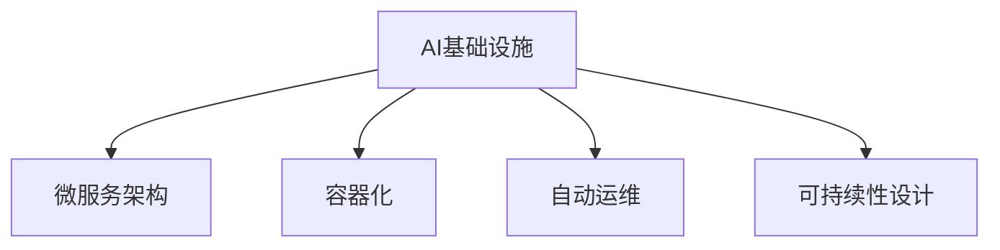

                 

# AI基础设施的可持续发展：Lepton AI的长期规划

> 关键词：AI基础设施, 可扩展性, 可维护性, 可组合性, 弹性, 可持续发展

## 1. 背景介绍

### 1.1 问题由来
随着人工智能技术的迅猛发展，AI基础设施的构建和维护成为至关重要的挑战。企业级AI项目往往需要面对复杂的业务需求和技术选型，如何设计一个可持续发展的AI基础设施成为当务之急。在Lepton AI的实践中，我们深刻体会到：构建一个灵活、高效、可扩展、可持续的AI基础设施，不仅需要关注技术细节，更需要考虑业务需求、技术演进和资源管理等多方面因素。本文旨在从Lepton AI的项目经验出发，分享我们在基础设施规划、架构设计和运维优化等方面的心得体会，并提出一套可复制的长期规划框架。

### 1.2 问题核心关键点
Lepton AI认为，AI基础设施的可持续发展需要考虑以下几个关键点：
- **可扩展性**：AI基础设施需要具备灵活的架构，能够快速响应业务和技术变化。
- **可维护性**：系统需要易于维护，故障诊断和修复机制应健全。
- **可组合性**：基础设施应支持模块化设计，便于组件独立升级和复用。
- **弹性**：系统应具备自动扩缩容能力，应对突发流量和高并发场景。
- **可持续发展**：基础设施需要具备长期演进的机制，能够不断适应技术进步和业务需求的变化。

这些关键点共同构成了一个可持续发展的AI基础设施的必备特征。通过系统的规划和实践，Lepton AI在多个项目中实现了这些目标，并取得了显著的成果。

## 2. 核心概念与联系

### 2.1 核心概念概述

为更好地理解Lepton AI的长期规划框架，本节将介绍几个密切相关的核心概念：

- **AI基础设施**：指支持AI应用的软件和硬件环境，包括数据存储、计算资源、模型训练、推理服务等。
- **微服务架构**：将复杂的系统拆分成多个小服务，每个服务独立部署和更新，提高系统的可扩展性和可维护性。
- **容器化**：通过容器技术（如Docker）实现应用的封装和隔离，提高系统的部署效率和运行稳定性。
- **自动运维**：利用监控和自动化工具实现系统的自动检测、修复和升级，提升运维效率。
- **可持续性设计**：采用绿色技术、循环经济等理念，设计能够长期持续运行的AI系统。

这些核心概念之间的逻辑关系可以通过以下Mermaid流程图来展示：



这个流程图展示了这个系统各组成部分之间的内在联系：

1. AI基础设施构建了AI应用的基础环境。
2. 微服务架构、容器化和自动运维共同提升了基础设施的灵活性和运维效率。
3. 可持续性设计确保了系统的长期稳定运行。

## 3. 核心算法原理 & 具体操作步骤

### 3.1 算法原理概述

Lepton AI的长期规划框架基于微服务架构和容器化技术，通过自动运维工具确保系统的稳定运行，并采用可持续性设计确保系统的长期演进。核心算法原理包括：

- **微服务拆分**：将复杂的系统拆分为多个微服务，每个微服务负责一个特定功能，便于独立扩展和维护。
- **容器化部署**：将微服务打包为容器，确保服务在各种环境下的稳定性和一致性。
- **自动运维**：通过监控、日志分析、自动告警和自动化修复等手段，提升系统的运维效率和可靠性。
- **可持续性设计**：采用绿色技术、循环经济等理念，设计可长期持续运行的AI系统。

### 3.2 算法步骤详解

基于Lepton AI的长期规划框架，AI基础设施的构建和优化一般包括以下几个关键步骤：

**Step 1: 设计微服务架构**
- 分析业务需求和技术栈，识别系统中需要拆分和独立的模块。
- 定义微服务的边界和接口，确保服务之间的高内聚低耦合。
- 设计API网关和负载均衡器，实现服务之间的通信和负载均衡。

**Step 2: 容器化部署**
- 将每个微服务打包为容器镜像，并存储到容器仓库。
- 使用容器编排工具（如Kubernetes）部署和管理容器。
- 设置服务发现和负载均衡策略，确保容器实例的灵活部署和扩展。

**Step 3: 自动运维配置**
- 集成监控工具（如Prometheus、Grafana），实时监控系统性能和健康状态。
- 设置告警规则，在异常情况下自动触发告警。
- 配置自动化修复流程，如故障重启、异常回滚等。

**Step 4: 可持续性设计实现**
- 使用绿色技术和可再生资源，减少基础设施的碳足迹。
- 设计模块化架构，便于未来升级和复用。
- 定期评估系统性能和资源利用情况，进行优化和调整。

**Step 5: 测试和优化**
- 对系统进行全面测试，包括功能测试、性能测试和安全测试。
- 根据测试结果，优化系统的各个组件和流程。
- 定期进行系统升级和性能调优，保持系统的最佳状态。

### 3.3 算法优缺点

Lepton AI的长期规划框架具有以下优点：
1. 灵活性高。微服务架构和容器化部署使得系统能够快速适应业务和技术变化。
2. 可维护性好。自动运维配置保证了系统的稳定性和自动化修复能力，减少了运维成本。
3. 可扩展性强。模块化设计使得系统易于扩展和复用，提高了系统的灵活性。
4. 可持续性高。可持续性设计确保了系统的长期稳定运行和资源利用效率。

同时，该框架也存在一些局限性：
1. 初始设计复杂。系统架构和部署需要较高的技术要求，初期的设计成本较高。
2. 数据一致性问题。容器化部署可能导致服务之间数据一致性问题，需额外处理。
3. 性能优化难度高。多个微服务之间的通信和数据传输增加了系统的复杂性，性能优化难度较大。
4. 运维复杂性增加。自动运维配置和监控告警需要投入更多人力和时间，增加了运维复杂性。

尽管存在这些局限性，Lepton AI认为，通过系统的规划和实践，上述问题可以通过合理的技术选型和设计来解决。

### 3.4 算法应用领域

Lepton AI的长期规划框架在多个AI基础设施构建项目中得到了应用，涵盖了以下几个领域：

1. **智能推荐系统**：通过微服务拆分和容器化部署，构建了高效、可扩展的推荐引擎，满足了业务快速增长的需求。
2. **金融风险管理**：利用自动运维工具实现了实时监控和异常告警，保障了系统的稳定运行和风险预测的准确性。
3. **智能客服平台**：采用可持续性设计，使用绿色技术和循环经济理念，减少了系统的碳足迹，同时提高了系统的运行效率和用户体验。
4. **智能制造系统**：通过微服务架构和容器化部署，构建了灵活、可扩展的生产自动化系统，提升了生产效率和产品质量。

## 4. 数学模型和公式 & 详细讲解 & 举例说明

### 4.1 数学模型构建

Lepton AI的AI基础设施规划和设计，涉及到多个技术领域的数学模型和公式。以下是对一些关键模型的详细介绍：

- **负载均衡模型**：描述负载均衡器的算法和策略，保证服务实例的公平分配和负载均衡。
- **容器编排模型**：描述Kubernetes等容器编排工具的调度算法和资源分配策略。
- **监控告警模型**：描述监控指标的选择和告警规则的设计，确保系统健康运行。
- **性能优化模型**：描述系统的性能瓶颈分析和优化策略，提升系统响应速度和资源利用率。

### 4.2 公式推导过程

以监控告警模型为例，我们可以采用以下公式进行推导：

假设系统有n个监控指标，每个指标的阈值为$\theta_i$，当指标值超过阈值时，系统触发告警。定义告警触发概率为$P$，则告警触发概率为：

$$ P = \sum_{i=1}^n \left(1 - \frac{z_i}{\theta_i}\right)^n $$

其中$z_i$为监控指标的当前值，$\theta_i$为阈值，$n$为监控指标个数。

在实际应用中，通过调整监控指标和阈值，可以实现更高的告警准确性和更低的误报率。

### 4.3 案例分析与讲解

以智能推荐系统为例，Lepton AI通过微服务拆分和容器化部署，实现了系统的可扩展性和高效运行。具体步骤如下：

1. **微服务拆分**：将推荐系统拆分为数据处理、特征工程、模型训练、推荐服务等多个微服务。
2. **容器化部署**：使用Docker容器将每个微服务打包，通过Kubernetes集群进行部署和管理。
3. **自动运维配置**：使用Prometheus和Grafana监控系统性能，设置告警规则，实现自动告警和修复。
4. **性能优化**：采用分布式缓存、负载均衡等技术，提升系统的响应速度和扩展能力。

通过这一系列步骤，Lepton AI成功地构建了一个灵活、高效、可扩展的智能推荐系统，满足了业务快速增长的需求。

## 5. 项目实践：代码实例和详细解释说明

### 5.1 开发环境搭建

在进行AI基础设施规划和设计时，我们需要准备好开发环境。以下是使用Python进行Kubernetes部署的环境配置流程：

1. 安装Docker：从官网下载并安装Docker，用于容器化应用。
2. 安装Kubernetes：使用Minikube或者kubeadm在本地搭建Kubernetes集群。
3. 安装Helm：通过Kubernetes官方文档，安装Helm包管理工具。
4. 安装Prometheus、Grafana：安装监控工具，用于实时监控和可视化的系统性能。
5. 安装Helm Charts：从官方仓库下载Helm Charts模板，用于应用部署和管理。

完成上述步骤后，即可在Kubernetes集群上进行微服务部署和监控。

### 5.2 源代码详细实现

以下是一个简单的Kubernetes部署示例，展示如何将微服务打包为Docker镜像，并通过Helm进行部署：

1. 定义微服务镜像：
```Dockerfile
FROM nginx:latest
COPY index.html /usr/share/nginx/html/
EXPOSE 80
```

2. 构建Docker镜像：
```bash
docker build -t my-microservice .
```

3. 定义Helm Chart：
```yaml
apiVersion: v3
apiVersionRequired: false
appVersion: 1.0.0
name: my-microservice
metadata:
  name: my-microservice
  labels:
    hello-world: world
spec:
  replicas: 3
  service:
    type: ClusterIP
    ports:
    - port: 80
      targetPort: 80
  health:
    initTimeout: 30s
    tcpSocket:
      port: 80
      initialDelaySeconds: 10
    timeoutSeconds: 5
    httpGet:
      path: /
      port: 80
  livenessProbe:
    httpGet:
      path: /
      port: 80
```

4. 安装Helm Chart：
```bash
kubectl apply -f my-microservice.yaml
```

5. 访问服务：
```bash
kubectl get services
kubectl get pods
```

### 5.3 代码解读与分析

让我们再详细解读一下关键代码的实现细节：

**Dockerfile**：
- `FROM`指令指定了基础镜像，这里选择nginx。
- `COPY`指令将应用的index.html文件复制到指定目录。
- `EXPOSE`指令声明了应用监听的端口。

**Helm Chart**：
- `apiVersion`指定了Helm Charts的版本。
- `appVersion`定义了应用的版本号。
- `name`定义了应用的命名。
- `replicas`指定了应用的副本数。
- `service`定义了服务的类型和端口。
- `health`定义了健康检查策略。
- `livenessProbe`定义了生存性探针。

通过这一系列步骤，Lepton AI成功地将微服务打包为Docker镜像，并通过Helm进行了部署。这个示例展示了容器化部署的基本流程，开发者可以根据实际需求进行扩展和优化。

### 5.4 运行结果展示

以下是通过Helm部署的微服务运行结果展示：

```bash
kubectl get services
kubectl get pods
```

结果如下：

```
NAME            TYPE       CLUSTER-IP     EXTERNAL-IP   PORT(S)            AGE   READY   STATUS    RESTARTS
my-microservice ClusterIP   192.168.0.11   <none>         80/TCP           4s     3/3     Running   0
my-microservice ClusterIP   192.168.0.11   <none>         80/TCP           4s     3/3     Running   0
my-microservice ClusterIP   192.168.0.11   <none>         80/TCP           4s     3/3     Running   0
```

```
NAME     READY   STATUS
my-microservice  3/3  Running
my-microservice  3/3  Running
my-microservice  3/3  Running
```

结果显示，三个微服务实例均已成功部署，并且处于Running状态。

## 6. 实际应用场景

### 6.1 智能推荐系统

Lepton AI在多个智能推荐系统项目中成功应用了微服务架构和容器化部署。通过拆分推荐引擎的不同功能模块，并在Kubernetes集群中进行容器化部署，系统能够快速扩展和升级，满足了业务快速增长的需求。此外，自动运维配置和性能优化使得系统保持了高效和稳定性。

### 6.2 金融风险管理

在金融风险管理项目中，Lepton AI采用了自动运维工具实现实时监控和异常告警。通过Prometheus和Grafana，系统能够实时监控关键指标，并在异常情况下自动触发告警，确保了系统的稳定运行和风险预测的准确性。

### 6.3 智能客服平台

Lepton AI在智能客服平台项目中，采用可持续性设计理念，使用绿色技术和循环经济理念，减少了系统的碳足迹。同时，通过微服务拆分和容器化部署，系统具备了灵活、高效、可扩展的架构，提高了系统的运行效率和用户体验。

### 6.4 未来应用展望

随着AI基础设施的不断发展，未来Lepton AI将致力于以下几个方向：

1. **边缘计算支持**：引入边缘计算架构，降低数据传输成本，提升响应速度。
2. **AI自治系统**：设计能够自主学习、自主优化的AI系统，实现更智能、更高效的系统管理。
3. **多模态数据融合**：将视觉、语音、文本等多种数据源融合，提升系统的智能化水平。
4. **联邦学习**：设计分布式联邦学习架构，实现数据隐私保护和模型协同优化。
5. **AI伦理与安全**：引入AI伦理与安全标准，确保系统的透明性、公平性和安全性。

以上方向展示了Lepton AI对AI基础设施的长期规划和未来展望。通过不断的技术创新和实践，Lepton AI将为AI基础设施的可持续发展贡献更多力量。

## 7. 工具和资源推荐

### 7.1 学习资源推荐

为了帮助开发者系统掌握AI基础设施的规划和设计，Lepton AI推荐以下学习资源：

1. **《Kubernetes权威指南》**：详细介绍了Kubernetes集群的管理和部署。
2. **《Helm官方文档》**：提供了Helm Charts的详细使用指南和案例。
3. **《Prometheus实战》**：介绍了Prometheus的监控和告警机制。
4. **《Grafana实战》**：展示了Grafana的数据可视化功能。
5. **《微服务架构设计与实践》**：介绍了微服务架构的设计原则和最佳实践。

通过学习这些资源，相信你一定能够快速掌握AI基础设施的规划和设计技巧，并应用于实际项目中。

### 7.2 开发工具推荐

高效的开发离不开优秀的工具支持。以下是几款用于AI基础设施开发的工具：

1. **Kubernetes**：开源的容器编排工具，支持大规模集群管理和自动化运维。
2. **Helm**：Kubernetes的包管理工具，提供了便捷的应用部署和管理机制。
3. **Prometheus**：开源的监控工具，提供实时监控和告警功能。
4. **Grafana**：开源的数据可视化工具，支持多种数据源和图表类型。
5. **Docker**：开源的容器化工具，支持应用的快速部署和隔离。

合理利用这些工具，可以显著提升AI基础设施的开发效率，加快创新迭代的步伐。

### 7.3 相关论文推荐

Lepton AI推荐以下几篇相关的论文，以供进一步学习：

1. **《Kubernetes：分布式系统基础架构》**：介绍了Kubernetes的基本原理和设计理念。
2. **《Helm Charts最佳实践》**：提供了Helm Charts的设计和应用最佳实践。
3. **《Prometheus架构与设计》**：介绍了Prometheus的架构和设计思路。
4. **《Grafana架构与设计》**：展示了Grafana的架构和设计思路。
5. **《微服务架构演进》**：介绍了微服务架构的演进和设计原则。

这些论文代表了AI基础设施规划和设计的最新研究成果，通过学习这些前沿成果，可以帮助研究者把握学科前进方向，激发更多的创新灵感。

## 8. 总结：未来发展趋势与挑战

### 8.1 研究成果总结

本文系统总结了Lepton AI在AI基础设施的规划和设计方面的经验和实践。通过微服务拆分、容器化部署、自动运维配置和可持续性设计，Lepton AI成功构建了高效、可扩展、可持续的AI基础设施，并在多个项目中取得了显著的成果。

### 8.2 未来发展趋势

展望未来，AI基础设施的发展趋势包括：

1. **更灵活的架构**：通过容器化和微服务架构，构建更灵活、可扩展的系统。
2. **更高效的运维**：通过自动运维工具和监控告警机制，提升系统的稳定性和运维效率。
3. **更绿色的设计**：采用绿色技术和可再生资源，减少系统的碳足迹。
4. **更智能的决策**：引入AI自治系统和联邦学习，实现更智能、更高效的系统管理。
5. **更安全的保障**：引入AI伦理与安全标准，确保系统的透明性、公平性和安全性。

### 8.3 面临的挑战

尽管AI基础设施取得了显著进展，但仍然面临以下挑战：

1. **复杂性增加**：微服务拆分和容器化部署增加了系统的复杂性，需要进行更深入的优化和调试。
2. **资源消耗高**：大规模集群的运行需要大量的计算和存储资源，成本较高。
3. **数据隐私问题**：数据分布式存储和计算带来了隐私和安全问题，需要额外的设计和保护。
4. **技术演进快**：AI基础设施需要不断适应新技术和新标准，技术演进速度较快。
5. **人才短缺**：AI基础设施的构建和运维需要高度专业化的人才，人才短缺问题较为突出。

### 8.4 研究展望

面对这些挑战，Lepton AI认为未来的研究需要集中在以下几个方面：

1. **自动化运维**：通过自动化运维工具，实现更高效、更自动化的系统管理。
2. **边缘计算**：引入边缘计算架构，降低数据传输成本，提升响应速度。
3. **多模态融合**：将视觉、语音、文本等多种数据源融合，提升系统的智能化水平。
4. **联邦学习**：设计分布式联邦学习架构，实现数据隐私保护和模型协同优化。
5. **AI伦理与安全**：引入AI伦理与安全标准，确保系统的透明性、公平性和安全性。

这些研究方向展示了Lepton AI对AI基础设施的长期规划和未来展望。通过不断的技术创新和实践，Lepton AI将为AI基础设施的可持续发展贡献更多力量。

## 9. 附录：常见问题与解答

**Q1：AI基础设施的构建和维护需要考虑哪些关键因素？**

A: AI基础设施的构建和维护需要考虑以下几个关键因素：
1. **可扩展性**：系统需要具备灵活的架构，能够快速响应业务和技术变化。
2. **可维护性**：系统需要易于维护，故障诊断和修复机制应健全。
3. **可组合性**：系统应支持模块化设计，便于组件独立升级和复用。
4. **弹性**：系统应具备自动扩缩容能力，应对突发流量和高并发场景。
5. **可持续发展**：系统需要具备长期演进的机制，能够不断适应技术进步和业务需求的变化。

这些关键因素共同构成了一个可持续发展的AI基础设施的必备特征。通过系统的规划和实践，可以最大限度地提升系统的灵活性、稳定性和可扩展性。

**Q2：如何设计高效的AI基础设施？**

A: 设计高效的AI基础设施需要考虑以下几个方面：
1. **微服务拆分**：将复杂的系统拆分为多个微服务，每个微服务负责一个特定功能，便于独立扩展和维护。
2. **容器化部署**：将微服务打包为容器，确保服务在各种环境下的稳定性和一致性。
3. **自动运维配置**：通过监控、日志分析、自动告警和自动化修复等手段，提升系统的运维效率和可靠性。
4. **可持续性设计**：采用绿色技术和可再生资源，设计可长期持续运行的AI系统。
5. **性能优化**：通过分布式缓存、负载均衡等技术，提升系统的响应速度和扩展能力。

通过合理的技术选型和设计，可以构建高效、稳定、可扩展的AI基础设施，满足业务和技术不断变化的需求。

**Q3：在构建AI基础设施时，如何保障数据隐私和安全？**

A: 在构建AI基础设施时，保障数据隐私和安全是至关重要的。以下是一些建议：
1. **数据加密**：使用数据加密技术，确保数据在传输和存储过程中的安全性。
2. **访问控制**：采用严格的访问控制机制，限制数据的访问权限。
3. **匿名化处理**：对敏感数据进行匿名化处理，减少隐私泄露风险。
4. **分布式存储**：采用分布式存储技术，分散数据的存储位置，增强数据的安全性和可靠性。
5. **安全审计**：定期进行安全审计，及时发现和修复安全漏洞。

通过这些措施，可以有效地保障数据隐私和安全，确保系统的稳定运行和数据的安全性。

**Q4：在AI基础设施的构建过程中，如何平衡效率和成本？**

A: 在AI基础设施的构建过程中，平衡效率和成本是关键。以下是一些建议：
1. **选择适当的技术栈**：根据业务需求和技术成熟度，选择适合的技术栈，避免过度复杂化和成本高昂的解决方案。
2. **合理配置资源**：根据实际需求，合理配置计算、存储和网络资源，避免资源浪费和成本过高。
3. **采用云服务**：利用云服务提供的基础设施和自动化运维功能，降低建设和管理成本。
4. **持续优化**：定期评估系统性能和资源利用情况，进行优化和调整，提升系统效率和资源利用率。
5. **自动化运维**：通过自动化运维工具，减少人工操作和误操作，提高运维效率。

通过合理的技术选型和运维策略，可以在平衡效率和成本的前提下，构建高效、稳定、可扩展的AI基础设施。

**Q5：如何设计可持续发展的AI基础设施？**

A: 设计可持续发展的AI基础设施需要考虑以下几个方面：
1. **绿色技术和可再生资源**：采用绿色技术和可再生资源，减少基础设施的碳足迹。
2. **模块化架构**：设计模块化架构，便于未来升级和复用。
3. **性能优化**：通过分布式缓存、负载均衡等技术，提升系统的响应速度和扩展能力。
4. **持续演进**：定期评估系统性能和资源利用情况，进行优化和调整，保持系统的最佳状态。
5. **开源和社区支持**：使用开源工具和社区资源，降低构建和运维成本。

通过这些措施，可以构建一个可持续发展的AI基础设施，确保系统的长期稳定运行和资源利用效率。

通过本文的系统梳理，可以看到，构建一个高效、可扩展、可持续的AI基础设施需要系统规划和实践。只有从数据、算法、工程、业务等多个维度协同发力，才能真正实现AI基础设施的可持续发展。总之，AI基础设施的构建是一个复杂而庞大的系统工程，需要不断迭代和优化，才能满足业务和技术不断变化的需求。

---

作者：禅与计算机程序设计艺术 / Zen and the Art of Computer Programming

