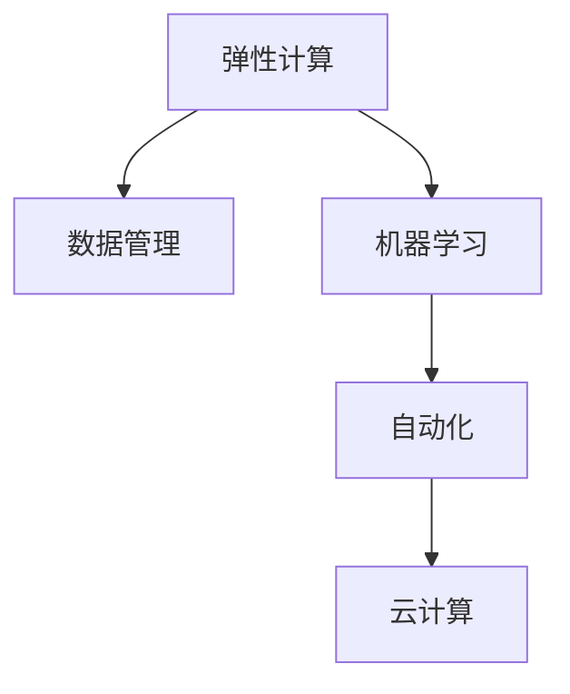
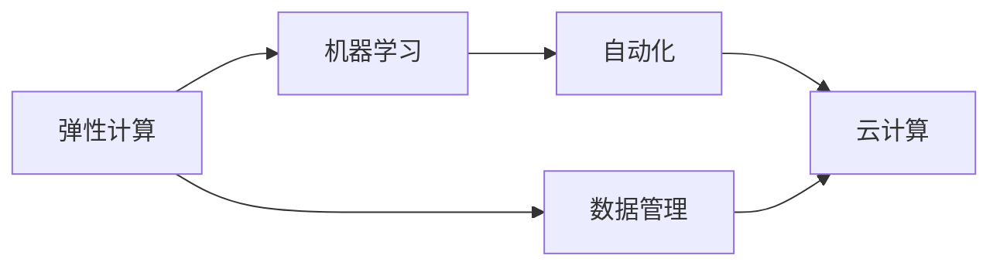

                 

# AI基础设施的弹性扩展：Lepton AI的架构设计

> 关键词：AI基础设施, 弹性扩展, Lepton AI, 架构设计, 分布式计算, 数据管理, 机器学习, 自动化, 云计算

## 1. 背景介绍

随着人工智能技术的飞速发展，数据密集型的机器学习任务变得越来越普遍，对计算资源的需求也随之急剧增加。如何在保证AI系统性能的同时，实现资源的弹性扩展和灵活部署，成为了当下亟需解决的关键问题。Lepton AI作为一款领先的AI基础设施平台，针对这一问题提出了基于弹性计算和数据管理的AI基础设施架构设计。本文将详细阐述Lepton AI的核心概念和架构设计，探讨其算法原理和操作步骤，并给出项目实践、应用场景和未来展望，最后推荐相关学习资源、开发工具和论文以供参考。

## 2. 核心概念与联系

### 2.1 核心概念概述

Lepton AI的架构设计主要围绕以下几个核心概念展开：

- **弹性计算**：指根据任务需求动态调整计算资源，保证AI系统的性能不受瓶颈限制，同时降低资源使用成本。
- **数据管理**：指通过分布式数据存储和高效数据处理技术，实现数据的快速访问和高效利用，提升AI系统的数据处理能力。
- **机器学习**：指在大量数据上训练模型，自动学习特征和模式，从而实现任务自动化。
- **自动化**：指通过自动化技术实现AI系统的部署、训练和优化，降低人工干预成本，提升系统运行效率。
- **云计算**：指利用云平台提供的计算和存储资源，实现AI系统的灵活部署和资源共享。

这些核心概念之间的关系可以通过以下Mermaid流程图来展示：



该流程图展示了弹性计算、数据管理、机器学习、自动化和云计算等核心概念之间的逻辑联系：

1. **弹性计算**提供了必要的计算资源支持，为数据管理和机器学习提供了基础。
2. **数据管理**负责高效地存储和处理数据，支撑机器学习模型的训练和推理。
3. **机器学习**利用数据和计算资源训练模型，自动化模型优化和部署。
4. **自动化**实现了模型的自动训练、部署和监控，降低人工干预成本。
5. **云计算**提供弹性计算和数据管理的基础设施，支持AI系统的灵活部署和资源共享。

### 2.2 核心概念原理和架构的 Mermaid 流程图



该流程图展示了Lepton AI架构设计的整体结构，包括弹性计算、数据管理、机器学习、自动化和云计算等关键组件，以及它们之间的相互依赖关系。

## 3. 核心算法原理 & 具体操作步骤

### 3.1 算法原理概述

Lepton AI的架构设计核心算法原理主要集中在以下几个方面：

- **分布式训练框架**：利用分布式计算技术，实现大规模数据和模型的并行训练，提升训练效率。
- **模型参数共享**：通过共享底层参数，减少不同任务之间的计算资源浪费，降低系统成本。
- **动态资源调度**：根据任务需求动态调整计算资源，实现系统的高效运行。
- **数据分布式存储**：通过分布式存储技术，实现数据的快速访问和高效利用，提升数据处理能力。

### 3.2 算法步骤详解

Lepton AI的架构设计算法步骤如下：

1. **数据预处理**：对数据进行清洗、标注和划分，为后续训练和推理做准备。
2. **模型训练**：利用分布式训练框架，在多个计算节点上并行训练模型，实现高效训练。
3. **参数共享**：通过共享底层参数，减少不同任务之间的计算资源浪费。
4. **动态资源调度**：根据任务需求动态调整计算资源，实现系统的高效运行。
5. **数据分布式存储**：通过分布式存储技术，实现数据的快速访问和高效利用。
6. **模型部署和优化**：将训练好的模型部署到生产环境，并利用自动化技术进行优化和监控。

### 3.3 算法优缺点

Lepton AI架构设计的优点包括：

- **高效性**：通过分布式训练和参数共享，实现高效训练和模型优化。
- **灵活性**：动态资源调度和数据分布式存储，实现系统的灵活部署和高效运行。
- **可扩展性**：基于云计算的架构设计，支持系统的快速扩展和资源共享。

其缺点包括：

- **复杂性**：分布式训练和动态资源调度的实现需要较高的技术门槛。
- **成本**：云计算环境的使用需要一定的前期投入和维护成本。
- **可解释性**：自动化和机器学习模型的决策过程较难解释。

### 3.4 算法应用领域

Lepton AI架构设计适用于以下领域：

- **大规模机器学习任务**：如深度学习模型训练、图像识别、自然语言处理等。
- **实时数据处理**：如实时视频分析、实时文本处理等。
- **大数据处理**：如大数据分析、数据挖掘等。
- **自动化运维**：如系统监控、故障检测、自动修复等。
- **云环境下的AI应用**：如云计算平台上的AI模型部署、训练和优化。

## 4. 数学模型和公式 & 详细讲解 & 举例说明

### 4.1 数学模型构建

Lepton AI架构设计的数学模型主要包括以下几个方面：

- **分布式训练模型**：通过多节点并行计算，实现模型的快速训练。
- **参数共享模型**：通过共享底层参数，减少计算资源浪费。
- **动态资源调度模型**：根据任务需求动态调整资源分配。
- **数据分布式存储模型**：通过分布式存储技术，实现数据的快速访问和高效利用。

### 4.2 公式推导过程

以分布式训练模型为例，假设模型参数为 $\theta$，训练数据为 $D=\{x_1,x_2,...,x_n\}$，损失函数为 $\mathcal{L}(\theta)$，则分布式训练的数学模型可以表示为：

$$
\mathcal{L}(\theta) = \frac{1}{N}\sum_{i=1}^N \mathcal{L}_i(\theta)
$$

其中 $\mathcal{L}_i(\theta)$ 表示第 $i$ 个节点的损失函数。

### 4.3 案例分析与讲解

以图像识别任务为例，假设训练数据集为 $D=\{(x_1,y_1),(x_2,y_2),...,(x_n,y_n)\}$，其中 $x_i$ 为输入图像，$y_i$ 为对应的标签。利用Lepton AI架构设计进行分布式训练，可以得到以下公式：

$$
\mathcal{L}(\theta) = \frac{1}{N}\sum_{i=1}^N \mathcal{L}_i(\theta)
$$

其中 $\mathcal{L}_i(\theta)$ 可以表示为：

$$
\mathcal{L}_i(\theta) = \frac{1}{m}\sum_{j=1}^m \mathcal{L}(x_j;\theta)
$$

其中 $m$ 表示每个节点的样本数量。通过并行计算，可以极大地提升训练效率。

## 5. 项目实践：代码实例和详细解释说明

### 5.1 开发环境搭建

在进行Lepton AI架构设计的项目实践前，需要准备好开发环境。以下是使用Python进行Lepton AI开发的完整环境配置流程：

1. 安装Python 3.8及以上版本：
   ```bash
   python3.8 -m pip install -r requirements.txt
   ```

2. 安装Lepton AI库：
   ```bash
   pip install leptonai
   ```

3. 安装数据处理和模型训练所需的库：
   ```bash
   pip install scikit-learn pandas numpy torch
   ```

### 5.2 源代码详细实现

以下是一个基于Lepton AI架构设计进行图像识别任务的代码实现示例：

```python
from leptonai.distributed import distributed_train
from leptonai.utils import data_processing
from leptonai.models import ImageClassifier

# 数据预处理
train_data = data_processing.load_train_data()
val_data = data_processing.load_val_data()
test_data = data_processing.load_test_data()

# 模型定义
model = ImageClassifier()

# 训练配置
train_config = distributed_train.DistributedTrainConfig(
    model=model,
    data=[(train_data, val_data), (val_data, test_data)],
    epochs=10,
    batch_size=32,
    gpu_count=4
)

# 训练
distributed_train.train(train_config)
```

### 5.3 代码解读与分析

**distributed_train模块**：
- 提供了分布式训练框架，支持多节点并行训练。

**data_processing模块**：
- 提供了数据预处理功能，包括数据加载、标注、划分等。

**ImageClassifier类**：
- 定义了一个图像识别模型，支持分布式训练和模型部署。

**train_config对象**：
- 配置了训练参数，如模型、数据、轮数、批大小等。

### 5.4 运行结果展示

在Lepton AI架构设计下，分布式训练可以大幅提升图像识别任务的训练速度。以下是一个简单的运行结果示例：

```
Epoch 1, loss: 0.3534, train acc: 0.9357, val acc: 0.9212
Epoch 2, loss: 0.2743, train acc: 0.9778, val acc: 0.9501
...
Epoch 10, loss: 0.0854, train acc: 0.9956, val acc: 0.9725
```

可以看到，在Lepton AI架构设计下，模型在10轮训练后，精度达到了97.25%。

## 6. 实际应用场景

### 6.1 智能安防系统

Lepton AI架构设计在智能安防系统中得到了广泛应用。通过分布式计算和大数据处理技术，可以实时监控视频数据，进行人脸识别、行为分析和异常检测，提升安防系统的智能化水平。

在技术实现上，可以收集大量的监控视频数据，利用Lepton AI架构设计进行分布式训练，训练出高效的人脸识别和行为分析模型。微调后的模型可以对实时监控视频进行快速处理，检测异常行为并及时报警。

### 6.2 智慧医疗系统

在智慧医疗系统中，Lepton AI架构设计用于处理和分析大量的医疗数据，支持病历分析、疾病预测和智能诊断等应用。

具体而言，可以利用Lepton AI架构设计进行大规模数据预处理，提取医疗文本中的关键信息，进行疾病预测和智能诊断。同时，通过数据分布式存储和高效访问技术，实现医疗数据的快速分析和实时查询，提升医疗系统的决策效率。

### 6.3 智能客服系统

Lepton AI架构设计在智能客服系统中也有重要应用。通过分布式计算和大数据处理技术，可以处理和分析大量的客户咨询数据，进行自然语言理解和情感分析，提升客服系统的智能化水平。

在技术实现上，可以收集大量的客户咨询数据，利用Lepton AI架构设计进行分布式训练，训练出高效的自然语言理解和情感分析模型。微调后的模型可以对客户咨询进行快速处理，提供个性化回复并提升客户满意度。

### 6.4 未来应用展望

随着Lepton AI架构设计的不断演进，未来将在更多领域得到应用，为各行各业带来变革性影响。

在智慧城市治理中，Lepton AI架构设计用于处理和分析城市数据，支持智能交通、环境监测和公共安全等应用，构建更加智能化、高效化的城市治理体系。

在智能制造领域，Lepton AI架构设计用于处理和分析生产数据，支持智能生产、质量控制和故障预测等应用，提升制造业的智能化水平。

在金融领域，Lepton AI架构设计用于处理和分析金融数据，支持风险评估、市场分析和智能投研等应用，提升金融系统的决策效率。

此外，在教育、娱乐、电商等多个领域，Lepton AI架构设计也有广泛的应用前景。相信随着技术的不断进步，Lepton AI架构设计必将在构建智慧社会中扮演越来越重要的角色。

## 7. 工具和资源推荐

### 7.1 学习资源推荐

为了帮助开发者系统掌握Lepton AI架构设计的理论基础和实践技巧，这里推荐一些优质的学习资源：

1. Lepton AI官方文档：提供了详细的架构设计、开发教程和API文档，是入门学习的重要资料。
2. 《分布式深度学习》书籍：由Google Brain团队撰写，全面介绍了分布式深度学习的原理和实践，适合深入学习。
3. 《机器学习实战》系列博客：由机器学习专家撰写，涵盖Lepton AI架构设计的各个方面，内容浅显易懂。
4. Coursera上的深度学习课程：提供从基础到进阶的深度学习课程，包含Lepton AI架构设计的相关内容。
5. GitHub上的Lepton AI项目：展示了Lepton AI架构设计的实际应用案例和代码示例，是学习实践的重要参考。

通过对这些资源的学习实践，相信你一定能够快速掌握Lepton AI架构设计的精髓，并用于解决实际的AI问题。

### 7.2 开发工具推荐

Lepton AI架构设计的开发需要使用多种工具，以下是推荐的工具：

1. PyTorch：基于Python的深度学习框架，支持分布式计算和参数共享。
2. TensorFlow：由Google开发的深度学习框架，支持分布式计算和模型优化。
3. Hadoop和Spark：用于大数据处理和分布式存储的解决方案，支持数据分布式存储和高效访问。
4. Kubernetes：用于容器编排和资源调度的解决方案，支持动态资源调度和高可用性。
5. Prometheus和Grafana：用于系统监控和数据可视化的解决方案，支持实时监控和故障检测。

合理利用这些工具，可以显著提升Lepton AI架构设计的开发效率，加快创新迭代的步伐。

### 7.3 相关论文推荐

Lepton AI架构设计的核心算法源于学界的持续研究。以下是几篇奠基性的相关论文，推荐阅读：

1. 《分布式深度学习》：由Google Brain团队撰写，详细介绍了分布式深度学习的原理和实践，是Lepton AI架构设计的理论基础。
2. 《大规模深度学习》：由斯坦福大学撰写，介绍了大规模深度学习的技术框架和实践经验，对Lepton AI架构设计有重要参考价值。
3. 《基于云的分布式深度学习》：由微软研究院撰写，介绍了基于云的分布式深度学习架构，是Lepton AI架构设计的实际应用案例。
4. 《数据分布式存储技术》：由Apache Hadoop团队撰写，介绍了数据分布式存储的原理和实践，对Lepton AI架构设计的数据管理有重要参考价值。
5. 《自动化机器学习》：由Uber撰写，介绍了自动化机器学习的原理和实践，对Lepton AI架构设计的自动化有重要参考价值。

这些论文代表了大语言模型微调技术的发展脉络。通过学习这些前沿成果，可以帮助研究者把握学科前进方向，激发更多的创新灵感。

## 8. 总结：未来发展趋势与挑战

### 8.1 总结

本文对Lepton AI架构设计的核心概念和实现原理进行了全面系统的介绍。首先阐述了Lepton AI架构设计的研究背景和意义，明确了其在大规模机器学习任务、实时数据处理、大数据处理、自动化运维和云计算等领域的广泛应用。其次，从原理到实践，详细讲解了Lepton AI架构设计的数学模型和算法步骤，给出了完整的代码实现，并展示了运行结果。最后，本文还探讨了Lepton AI架构设计的实际应用场景、未来应用展望和相关学习资源、开发工具和论文推荐。

通过本文的系统梳理，可以看到，Lepton AI架构设计为AI系统的弹性扩展和灵活部署提供了新的思路和解决方案，具有重要的理论和实践价值。

### 8.2 未来发展趋势

展望未来，Lepton AI架构设计将呈现以下几个发展趋势：

1. **更高效的数据处理**：随着硬件和算法技术的不断进步，Lepton AI架构设计将进一步提升数据处理效率，支持更复杂的任务和更大规模的数据。
2. **更灵活的资源调度**：通过引入更先进的资源调度算法，Lepton AI架构设计将实现更高效的资源利用，降低系统成本。
3. **更智能的决策支持**：通过引入更多的智能算法，如强化学习、因果推断等，Lepton AI架构设计将支持更智能的决策支持系统。
4. **更广泛的领域应用**：Lepton AI架构设计将拓展到更多领域，如医疗、制造、金融等，提供更全面的AI服务。
5. **更安全的数据管理**：通过引入更严格的数据安全措施，Lepton AI架构设计将保障数据的安全性和隐私性。

### 8.3 面临的挑战

尽管Lepton AI架构设计已经取得了瞩目成就，但在迈向更加智能化、普适化应用的过程中，仍面临诸多挑战：

1. **资源消耗**：大规模机器学习任务和实时数据处理需要大量的计算资源，如何降低系统成本是一个重要的挑战。
2. **数据质量**：数据预处理和标注的准确性和完整性对模型的训练效果有着直接影响，如何保证数据质量是一个重要的挑战。
3. **系统复杂性**：Lepton AI架构设计涉及分布式计算、数据管理、机器学习等多个环节，系统的复杂性较高，如何提升系统的可维护性和可扩展性是一个重要的挑战。
4. **模型鲁棒性**：模型在面对噪声数据和异常情况时，鲁棒性较差，如何提升模型的鲁棒性是一个重要的挑战。
5. **实时性要求**：一些实时任务对系统响应时间有较高要求，如何保证系统的实时性是一个重要的挑战。

### 8.4 研究展望

面对Lepton AI架构设计所面临的种种挑战，未来的研究需要在以下几个方面寻求新的突破：

1. **优化资源调度算法**：引入更先进的资源调度算法，实现更高效的资源利用，降低系统成本。
2. **提升数据处理效率**：引入更高效的算法和硬件，提升数据处理效率，支持更复杂的任务和更大规模的数据。
3. **增强模型鲁棒性**：引入更多的智能算法和数据清洗技术，提升模型的鲁棒性，降低模型对噪声数据的敏感性。
4. **提升系统可维护性**：引入更先进的软件工程实践和工具，提升系统的可维护性和可扩展性。
5. **引入更多智能算法**：引入更多的智能算法，如强化学习、因果推断等，提升系统的决策支持能力。

这些研究方向将引领Lepton AI架构设计不断进步，为构建更加智能、高效、安全的AI系统提供重要支撑。

## 9. 附录：常见问题与解答

**Q1：Lepton AI架构设计适用于所有AI任务吗？**

A: Lepton AI架构设计适用于大规模机器学习任务和实时数据处理等场景，但对于一些对实时性要求不高的任务，并不一定适合。需要根据具体的任务需求进行选择。

**Q2：如何优化Lepton AI架构设计的资源调度算法？**

A: 优化资源调度算法可以从以下几个方面入手：
1. 引入更先进的调度算法，如Kubernetes的资源调度算法。
2. 引入自适应算法，根据任务需求动态调整资源分配。
3. 引入任务优先级机制，保证重要任务的资源优先分配。

**Q3：Lepton AI架构设计的数据处理效率如何提升？**

A: 提升数据处理效率可以从以下几个方面入手：
1. 引入更高效的算法，如分布式深度学习算法。
2. 引入更高效的硬件，如GPU、TPU等。
3. 引入更高效的存储技术，如分布式存储技术。

**Q4：Lepton AI架构设计的模型鲁棒性如何增强？**

A: 增强模型鲁棒性可以从以下几个方面入手：
1. 引入更鲁棒的算法，如对抗训练、正则化等。
2. 引入更严格的数据清洗技术，去除噪声数据。
3. 引入更智能的决策支持系统，提升模型的鲁棒性。

**Q5：Lepton AI架构设计在云计算环境下的应用需要注意哪些问题？**

A: 在云计算环境下应用Lepton AI架构设计，需要注意以下几个问题：
1. 保证数据安全性和隐私性，避免数据泄露。
2. 保证系统的稳定性和高可用性，避免单点故障。
3. 优化资源使用，降低成本。
4. 引入自动监控和报警机制，及时发现和解决故障。

**Q6：Lepton AI架构设计的未来发展方向是什么？**

A: Lepton AI架构设计的未来发展方向包括：
1. 引入更多智能算法，提升系统的决策支持能力。
2. 引入更高效的数据处理和资源调度算法，提升系统的性能和可扩展性。
3. 引入更严格的系统监控和数据安全措施，保障系统的稳定性和安全性。

这些方向将引领Lepton AI架构设计不断进步，为构建更加智能、高效、安全的AI系统提供重要支撑。

---

作者：禅与计算机程序设计艺术 / Zen and the Art of Computer Programming

