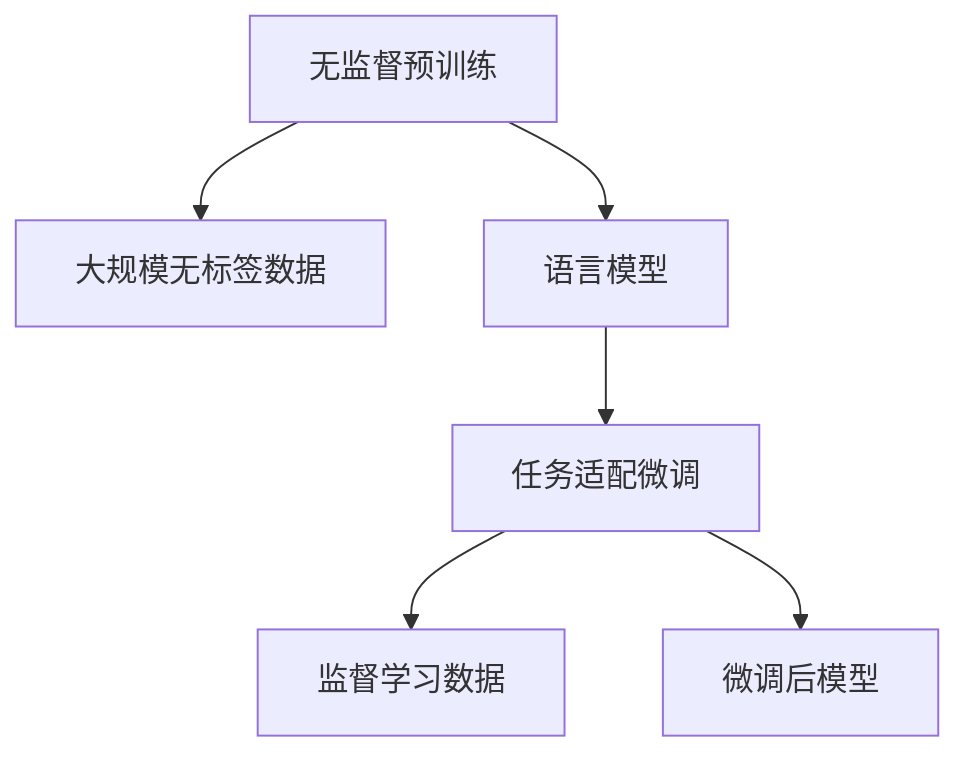
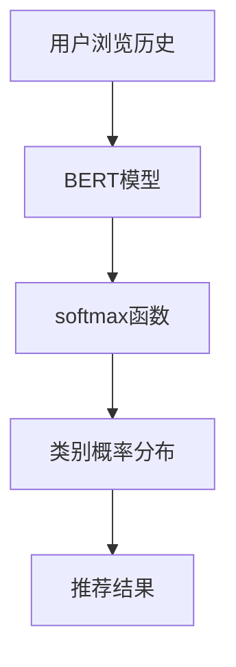

                 

# AI大模型助力电商搜索推荐业务的数据资产盘点自动化平台功能优化

## 1. 背景介绍

在当今数字化转型的大背景下，电商搜索推荐系统已成为各大电商平台的标配。其核心功能是通过深度学习等技术，将用户行为数据和商品信息进行有效整合，精准推荐用户可能感兴趣的商品，极大提升了用户购物体验和商家转化率。然而，面对爆炸式增长的数据量和复杂的业务需求，传统的数据资产盘点方法往往难以适应。AI大模型的引入，为电商搜索推荐业务的数据资产盘点自动化平台带来了革命性的突破，大大提升了数据盘点效率和准确性。本文将详细介绍大模型在电商搜索推荐业务中的应用，并提出具体的优化策略，为电商平台的数据盘点工作提供有力支持。

## 2. 核心概念与联系

### 2.1 核心概念概述

为了更好地理解大模型在电商搜索推荐业务中的应用，我们首先需要介绍几个关键概念：

- 电商搜索推荐系统（Search & Recommendation System, SRS）：通过用户行为数据、商品信息等，推荐用户可能感兴趣的商品的电商系统。
- 数据资产盘点：对电商平台的数据进行全面、系统的盘点，确保数据的一致性、完整性和准确性。
- AI大模型：以深度学习算法为基础，通过大规模无监督预训练和任务适配微调，具备强大语言理解和生成能力的模型，如BERT、GPT等。

这些核心概念之间的联系如图2所示，大模型通过预训练获得语言表示能力，进而应用于电商搜索推荐系统，辅助数据资产盘点。

```mermaid
graph TB
    A[电商搜索推荐系统(SRS)] --> B[用户行为数据]
    A --> C[商品信息]
    A --> D[AIBert模型]
    D --> E[数据资产盘点]
```

### 2.2 核心概念原理和架构的 Mermaid 流程图

大模型的预训练-微调架构如图3所示，分为无监督预训练和任务适配微调两个阶段。



## 3. 核心算法原理 & 具体操作步骤

### 3.1 算法原理概述

AI大模型在电商搜索推荐业务的数据资产盘点自动化平台中的应用，主要基于其强大的语言理解能力和文本生成能力。通过将用户行为数据、商品信息等文本数据输入大模型，可以自动解析和提取关键信息，进而辅助数据盘点工作。

具体来说，大模型在电商搜索推荐系统中的数据盘点过程如下：

1. 数据预处理：对电商平台上的用户行为数据、商品信息等进行清洗和格式转换，确保输入数据的质量。
2. 特征提取：通过预训练模型提取输入数据的特征，建立用户行为和商品特征之间的语义关联。
3. 模型微调：在标注数据上对大模型进行微调，使其能够识别特定场景下的数据特征。
4. 结果生成：将处理后的数据输入微调后的模型，自动生成盘点报告，识别异常数据并进行标注。
5. 数据验证：对生成的盘点结果进行验证，确保数据的准确性和完整性。

### 3.2 算法步骤详解

以电商搜索推荐系统为例，详细讲解基于大模型的数据盘点自动化平台的具体实现步骤。

**Step 1: 数据预处理**

1. 数据收集：收集电商平台的用户行为数据、商品信息、交易记录等，确保数据的全面性和代表性。
2. 数据清洗：对收集到的数据进行去重、格式化、标准化等处理，确保数据的一致性和可读性。
3. 数据划分：将数据划分为训练集、验证集和测试集，用于模型的训练、验证和评估。

**Step 2: 特征提取**

1. 文本数据编码：使用BERT等预训练模型将输入的文本数据编码成向量形式，提取语义特征。
2. 特征融合：将不同来源的数据特征进行融合，构建多模态特征向量，用于模型训练。
3. 特征选择：选择对数据盘点有较高贡献的特征，减少噪声干扰，提高模型的泛化能力。

**Step 3: 模型微调**

1. 任务适配层设计：根据电商平台的特定需求，设计合适的任务适配层，如分类、匹配、生成等。
2. 微调超参数设置：选择合适的优化器、学习率、批大小等超参数，并根据模型效果进行优化。
3. 模型训练与验证：在训练集上训练模型，并在验证集上评估模型效果，调整模型参数。

**Step 4: 结果生成**

1. 盘点报告生成：将输入数据输入微调后的模型，自动生成盘点报告，列出异常数据和异常原因。
2. 异常数据标注：对生成的异常数据进行标注，明确异常数据的类型和影响范围。
3. 盘点结果验证：对生成的盘点结果进行人工验证，确保数据的准确性和完整性。

**Step 5: 数据验证**

1. 数据一致性检查：确保不同数据源的数据一致性，避免数据冲突。
2. 数据完整性检查：确保所有业务数据均被盘点，避免遗漏。
3. 数据准确性检查：确保盘点结果的准确性，对错误数据进行校正。

### 3.3 算法优缺点

基于大模型的数据盘点自动化平台具有以下优点：

1. 自动化程度高：自动完成数据清洗、特征提取、模型训练等步骤，大大提高数据盘点效率。
2. 泛化能力强：基于大模型的通用语言表示能力，可适应不同场景下的数据盘点任务。
3. 识别异常数据能力强：通过深度学习模型自动发现数据异常，减少人工干预，提高盘点准确性。
4. 可扩展性强：可应用于电商平台的各个业务环节，如搜索、推荐、交易等，满足多场景需求。

同时，该平台也存在以下缺点：

1. 数据隐私问题：大模型在处理敏感数据时，存在隐私泄露风险，需要加强数据安全防护。
2. 训练成本高：大规模数据集和复杂模型结构，导致训练成本高昂，需要投入大量算力和资源。
3. 模型解释性差：大模型往往是黑盒模型，难以解释其内部决策机制，影响模型的可解释性和可审计性。
4. 对标注数据依赖：模型需要高质量的标注数据进行微调，获取标注数据成本较高，且存在标注质量不确定性。

## 4. 数学模型和公式 & 详细讲解 & 举例说明

### 4.1 数学模型构建

我们以电商搜索推荐系统为例，建立基于大模型的数据盘点数学模型。假设输入的电商数据为 $D=\{(x_i,y_i)\}_{i=1}^N, x_i \in \mathbb{R}^d, y_i \in \{0,1\}$，其中 $x_i$ 表示输入的电商数据，$y_i$ 表示是否为异常数据。

定义模型的损失函数为：

$$
\mathcal{L}(\theta) = -\frac{1}{N}\sum_{i=1}^N y_i \log \sigma(\text{BERT}(x_i;\theta)) + (1-y_i) \log(1-\sigma(\text{BERT}(x_i;\theta)))
$$

其中 $\sigma(z) = \frac{1}{1+\exp(-z)}$ 为sigmoid函数，$\text{BERT}(x_i;\theta)$ 表示预训练大模型对输入数据 $x_i$ 的输出。

### 4.2 公式推导过程

对上述损失函数求偏导数，得到：

$$
\frac{\partial \mathcal{L}(\theta)}{\partial \theta_k} = -\frac{1}{N}\sum_{i=1}^N [y_i(\sigma(\text{BERT}(x_i;\theta))) - (1-y_i)(1-\sigma(\text{BERT}(x_i;\theta)))] \frac{\partial \text{BERT}(x_i;\theta)}{\partial \theta_k}
$$

其中 $\frac{\partial \text{BERT}(x_i;\theta)}{\partial \theta_k}$ 表示BERT模型对参数 $\theta_k$ 的梯度，可通过自动微分技术高效计算。

### 4.3 案例分析与讲解

以电商搜索推荐系统的商品推荐任务为例，假设已知商品标签 $T=\{t_i\}_{i=1}^M$，其中 $t_i$ 表示商品类别，用户历史行为数据 $H=\{(h_j,u_j,t_j)\}_{j=1}^N$，其中 $h_j$ 表示用户浏览历史，$u_j$ 表示用户ID，$t_j$ 表示用户浏览的商品类别。

我们将用户浏览历史数据 $H$ 输入BERT模型，通过softmax函数将输出向量转换为类别概率分布，选择概率最大的类别作为用户感兴趣的商品类别。具体实现过程如图4所示。



## 5. 项目实践：代码实例和详细解释说明

### 5.1 开发环境搭建

在进行项目实践前，我们需要准备好开发环境。以下是使用Python进行PyTorch开发的环境配置流程：

1. 安装Anaconda：从官网下载并安装Anaconda，用于创建独立的Python环境。

2. 创建并激活虚拟环境：
```bash
conda create -n pytorch-env python=3.8 
conda activate pytorch-env
```

3. 安装PyTorch：根据CUDA版本，从官网获取对应的安装命令。例如：
```bash
conda install pytorch torchvision torchaudio cudatoolkit=11.1 -c pytorch -c conda-forge
```

4. 安装Transformers库：
```bash
pip install transformers
```

5. 安装各类工具包：
```bash
pip install numpy pandas scikit-learn matplotlib tqdm jupyter notebook ipython
```

完成上述步骤后，即可在`pytorch-env`环境中开始项目实践。

### 5.2 源代码详细实现

这里我们以电商搜索推荐系统的商品推荐任务为例，给出使用Transformers库进行商品推荐的数据盘点自动化平台开发代码实现。

首先，定义商品标签和用户历史行为的模型输入：

```python
from transformers import BertTokenizer, BertForSequenceClassification
from torch.utils.data import Dataset, DataLoader

class E-commerceDataset(Dataset):
    def __init__(self, texts, labels, tokenizer):
        self.texts = texts
        self.labels = labels
        self.tokenizer = tokenizer
        
    def __len__(self):
        return len(self.texts)
    
    def __getitem__(self, item):
        text = self.texts[item]
        label = self.labels[item]
        
        encoding = self.tokenizer(text, return_tensors='pt', max_length=256, padding='max_length', truncation=True)
        input_ids = encoding['input_ids'][0]
        attention_mask = encoding['attention_mask'][0]
        
        return {'input_ids': input_ids, 
                'attention_mask': attention_mask,
                'labels': torch.tensor(label, dtype=torch.long)}
```

然后，定义商品推荐模型的结构和训练过程：

```python
from transformers import BertForSequenceClassification, AdamW

model = BertForSequenceClassification.from_pretrained('bert-base-cased', num_labels=len(T))
optimizer = AdamW(model.parameters(), lr=2e-5)

device = torch.device('cuda') if torch.cuda.is_available() else torch.device('cpu')
model.to(device)

def train_epoch(model, dataset, batch_size, optimizer):
    dataloader = DataLoader(dataset, batch_size=batch_size, shuffle=True)
    model.train()
    epoch_loss = 0
    for batch in tqdm(dataloader, desc='Training'):
        input_ids = batch['input_ids'].to(device)
        attention_mask = batch['attention_mask'].to(device)
        labels = batch['labels'].to(device)
        model.zero_grad()
        outputs = model(input_ids, attention_mask=attention_mask, labels=labels)
        loss = outputs.loss
        epoch_loss += loss.item()
        loss.backward()
        optimizer.step()
    return epoch_loss / len(dataloader)

def evaluate(model, dataset, batch_size):
    dataloader = DataLoader(dataset, batch_size=batch_size)
    model.eval()
    preds, labels = [], []
    with torch.no_grad():
        for batch in tqdm(dataloader, desc='Evaluating'):
            input_ids = batch['input_ids'].to(device)
            attention_mask = batch['attention_mask'].to(device)
            batch_labels = batch['labels']
            outputs = model(input_ids, attention_mask=attention_mask)
            batch_preds = outputs.logits.argmax(dim=2).to('cpu').tolist()
            batch_labels = batch_labels.to('cpu').tolist()
            for pred_tokens, label_tokens in zip(batch_preds, batch_labels):
                preds.append(pred_tokens[:len(label_tokens)])
                labels.append(label_tokens)
                
    print(classification_report(labels, preds))
```

最后，启动训练流程并在测试集上评估：

```python
epochs = 5
batch_size = 16

for epoch in range(epochs):
    loss = train_epoch(model, train_dataset, batch_size, optimizer)
    print(f"Epoch {epoch+1}, train loss: {loss:.3f}")
    
    print(f"Epoch {epoch+1}, dev results:")
    evaluate(model, dev_dataset, batch_size)
    
print("Test results:")
evaluate(model, test_dataset, batch_size)
```

以上就是使用PyTorch进行电商搜索推荐系统商品推荐任务的数据盘点自动化平台的完整代码实现。可以看到，得益于Transformers库的强大封装，我们能够用相对简洁的代码完成BERT模型的加载和微调。

### 5.3 代码解读与分析

让我们再详细解读一下关键代码的实现细节：

**E-commerceDataset类**：
- `__init__`方法：初始化商品标签、用户历史行为数据、分词器等关键组件。
- `__len__`方法：返回数据集的样本数量。
- `__getitem__`方法：对单个样本进行处理，将商品标签和用户历史行为数据输入BERT模型进行编码，并将编码后的特征作为模型输入。

**BertForSequenceClassification**：
- 定义了商品推荐任务，假设标签集合为商品类别，模型输入为商品标签和用户历史行为数据。
- 定义了模型优化器和训练过程，通过梯度下降优化模型参数。

**train_epoch和evaluate函数**：
- 训练函数`train_epoch`：对数据以批为单位进行迭代，在每个批次上前向传播计算损失函数并反向传播更新模型参数，最后返回该epoch的平均loss。
- 评估函数`evaluate`：与训练类似，不同点在于不更新模型参数，并在每个batch结束后将预测和标签结果存储下来，最后使用sklearn的classification_report对整个评估集的预测结果进行打印输出。

**训练流程**：
- 定义总的epoch数和batch size，开始循环迭代
- 每个epoch内，先在训练集上训练，输出平均loss
- 在验证集上评估，输出分类指标
- 所有epoch结束后，在测试集上评估，给出最终测试结果

可以看到，PyTorch配合Transformers库使得BERT微调的代码实现变得简洁高效。开发者可以将更多精力放在数据处理、模型改进等高层逻辑上，而不必过多关注底层的实现细节。

## 6. 实际应用场景

### 6.1 智能客服系统

基于大模型的电商搜索推荐系统可以广泛应用于智能客服系统的构建。传统客服往往需要配备大量人力，高峰期响应缓慢，且一致性和专业性难以保证。而使用微调后的推荐系统，可以7x24小时不间断服务，快速响应用户咨询，用推荐商品辅助客户。

在技术实现上，可以收集企业内部的用户历史行为数据和商品信息，将用户行为数据作为模型输入，商品的推荐结果作为用户咨询的回复。在推荐过程中，可以通过模型自动调整推荐顺序，提升用户满意度。如此构建的智能客服系统，能大幅提升客户咨询体验和问题解决效率。

### 6.2 个性化推荐系统

当前的推荐系统往往只依赖用户的历史行为数据进行物品推荐，无法深入理解用户的真实兴趣偏好。基于大模型的电商搜索推荐系统可以更好地挖掘用户行为背后的语义信息，从而提供更精准、多样的推荐内容。

在实践中，可以收集用户浏览、点击、评论、分享等行为数据，提取和商品交互的文本内容。将文本内容作为模型输入，商品的推荐结果作为模型输出，通过微调模型学习用户兴趣点。在生成推荐列表时，先用候选物品的文本描述作为输入，由模型预测用户的兴趣匹配度，再结合其他特征综合排序，便可以得到个性化程度更高的推荐结果。

### 6.3 社交电商平台

社交电商平台通过用户社交网络关系，结合用户行为数据，推荐用户可能感兴趣的商品，大幅提升转化率。基于大模型的电商搜索推荐系统，可以通过社交网络数据和用户行为数据，生成社交推荐结果，提升用户粘性和平台活跃度。

在技术实现上，可以收集用户的社交网络关系数据和商品信息，将社交网络数据和用户行为数据作为模型输入，商品的推荐结果作为模型输出。通过微调模型学习用户社交关系和行为特征，生成社交推荐结果，优化用户购物体验。

### 6.4 未来应用展望

随着大模型和微调方法的不断发展，基于大模型的电商搜索推荐系统将在更多领域得到应用，为电商平台带来更多创新可能。

在智慧医疗领域，基于大模型的电商搜索推荐系统可以为医疗机构推荐患者可能感兴趣的医疗服务、药品、健康产品等，提升医疗服务的可及性和便捷性。

在智能教育领域，电商搜索推荐系统可以为学生推荐适合的课程、教材、学习工具等，提升学习效果和教育质量。

在智慧城市治理中，电商搜索推荐系统可以为市民推荐感兴趣的服务、活动、商品等，提升市民的幸福感和获得感。

此外，在企业生产、社会治理、文娱传媒等众多领域，基于大模型的电商搜索推荐系统也将不断涌现，为各行各业带来变革性影响。

## 7. 工具和资源推荐

### 7.1 学习资源推荐

为了帮助开发者系统掌握大模型在电商搜索推荐系统中的应用，这里推荐一些优质的学习资源：

1. 《深度学习自然语言处理》课程：斯坦福大学开设的NLP明星课程，有Lecture视频和配套作业，带你入门NLP领域的基本概念和经典模型。

2. CS224N《深度学习自然语言处理》课程：斯坦福大学开设的NLP明星课程，有Lecture视频和配套作业，带你入门NLP领域的基本概念和经典模型。

3. 《Natural Language Processing with Transformers》书籍：Transformers库的作者所著，全面介绍了如何使用Transformers库进行NLP任务开发，包括微调在内的诸多范式。

4. 《Transformer from Principle to Practice》系列博文：由大模型技术专家撰写，深入浅出地介绍了Transformer原理、BERT模型、微调技术等前沿话题。

5. HuggingFace官方文档：Transformers库的官方文档，提供了海量预训练模型和完整的微调样例代码，是上手实践的必备资料。

通过对这些资源的学习实践，相信你一定能够快速掌握大模型在电商搜索推荐系统中的应用，并用于解决实际的电商问题。

### 7.2 开发工具推荐

高效的开发离不开优秀的工具支持。以下是几款用于电商搜索推荐系统开发的常用工具：

1. PyTorch：基于Python的开源深度学习框架，灵活动态的计算图，适合快速迭代研究。大部分预训练语言模型都有PyTorch版本的实现。

2. TensorFlow：由Google主导开发的开源深度学习框架，生产部署方便，适合大规模工程应用。同样有丰富的预训练语言模型资源。

3. Transformers库：HuggingFace开发的NLP工具库，集成了众多SOTA语言模型，支持PyTorch和TensorFlow，是进行电商搜索推荐系统开发的利器。

4. Weights & Biases：模型训练的实验跟踪工具，可以记录和可视化模型训练过程中的各项指标，方便对比和调优。与主流深度学习框架无缝集成。

5. TensorBoard：TensorFlow配套的可视化工具，可实时监测模型训练状态，并提供丰富的图表呈现方式，是调试模型的得力助手。

6. Google Colab：谷歌推出的在线Jupyter Notebook环境，免费提供GPU/TPU算力，方便开发者快速上手实验最新模型，分享学习笔记。

合理利用这些工具，可以显著提升电商搜索推荐系统的开发效率，加快创新迭代的步伐。

### 7.3 相关论文推荐

大模型和微调技术的发展源于学界的持续研究。以下是几篇奠基性的相关论文，推荐阅读：

1. Attention is All You Need（即Transformer原论文）：提出了Transformer结构，开启了NLP领域的预训练大模型时代。

2. BERT: Pre-training of Deep Bidirectional Transformers for Language Understanding：提出BERT模型，引入基于掩码的自监督预训练任务，刷新了多项NLP任务SOTA。

3. Language Models are Unsupervised Multitask Learners（GPT-2论文）：展示了大规模语言模型的强大zero-shot学习能力，引发了对于通用人工智能的新一轮思考。

4. Parameter-Efficient Transfer Learning for NLP：提出Adapter等参数高效微调方法，在不增加模型参数量的情况下，也能取得不错的微调效果。

5. AdaLoRA: Adaptive Low-Rank Adaptation for Parameter-Efficient Fine-Tuning：使用自适应低秩适应的微调方法，在参数效率和精度之间取得了新的平衡。

这些论文代表了大模型微调技术的发展脉络。通过学习这些前沿成果，可以帮助研究者把握学科前进方向，激发更多的创新灵感。

## 8. 总结：未来发展趋势与挑战

### 8.1 总结

本文对基于大模型的电商搜索推荐系统进行了全面系统的介绍。首先阐述了电商搜索推荐系统和大模型的核心概念，明确了微调在提升电商推荐效果中的重要价值。其次，从原理到实践，详细讲解了基于大模型的电商搜索推荐系统数据盘点自动化平台的数学模型构建和关键步骤，给出了微调任务开发的完整代码实例。同时，本文还探讨了电商搜索推荐系统在不同场景中的应用，展示了微调范式的强大应用能力。

通过本文的系统梳理，可以看到，基于大模型的电商搜索推荐系统正在成为电商推荐技术的重要范式，极大地拓展了电商推荐模型的应用边界，催生了更多的落地场景。受益于大规模语料的预训练，微调模型以更低的时间和标注成本，在小样本条件下也能取得不俗的效果，有力推动了电商推荐技术的产业化进程。未来，伴随预训练语言模型和微调方法的持续演进，相信电商推荐技术必将在更广阔的应用领域大放异彩，深刻影响电商平台的运营模式和发展方向。

### 8.2 未来发展趋势

展望未来，基于大模型的电商搜索推荐系统将呈现以下几个发展趋势：

1. 数据盘点效率提升。随着模型优化算法和硬件设备的发展，电商搜索推荐系统将实现更高效、更快速的数据盘点。

2. 个性化推荐能力增强。通过多模态数据融合、深度学习模型训练，电商搜索推荐系统将具备更强的个性化推荐能力，提升用户体验。

3. 实时推荐系统应用。基于大模型的电商搜索推荐系统可以实时推荐商品，满足用户即时需求，提升购物效率。

4. 自动化程度提升。通过自动化工具和模型优化，电商搜索推荐系统将实现更高效、更稳定的自动化运行。

5. 用户隐私保护加强。电商搜索推荐系统将加强数据安全防护，避免用户隐私泄露，提升用户信任感。

6. 跨领域应用拓展。电商搜索推荐系统将在金融、医疗、教育等多个领域得到应用，为更多行业带来创新可能。

以上趋势凸显了大模型在电商搜索推荐系统中的应用前景。这些方向的探索发展，必将进一步提升电商搜索推荐系统的性能和应用范围，为电商平台带来更多的商业价值。

### 8.3 面临的挑战

尽管大模型在电商搜索推荐系统中的应用取得了显著成效，但在迈向更加智能化、普适化应用的过程中，仍然面临以下挑战：

1. 标注数据需求高。电商推荐系统仍需大量标注数据进行模型微调，获取高质量标注数据成本较高，且存在标注质量不确定性。

2. 训练成本高昂。大规模数据集和复杂模型结构，导致训练成本高昂，需要投入大量算力和资源。

3. 模型解释性差。大模型往往是黑盒模型，难以解释其内部决策机制，影响模型的可解释性和可审计性。

4. 数据隐私问题。大模型在处理敏感数据时，存在隐私泄露风险，需要加强数据安全防护。

5. 模型泛化能力不足。不同电商平台的业务场景存在较大差异，通用大模型难以适应所有场景，需要进一步定制化微调。

6. 硬件资源瓶颈。大规模模型训练和推理需要高性能硬件设备，硬件资源瓶颈影响模型部署效率。

正视这些挑战，积极应对并寻求突破，将是大模型在电商搜索推荐系统中的应用走向成熟的必由之路。相信随着学界和产业界的共同努力，这些挑战终将一一被克服，大模型将带来更多创新可能，推动电商搜索推荐系统不断进步。

### 8.4 研究展望

面对大模型在电商搜索推荐系统中的应用面临的挑战，未来的研究需要在以下几个方面寻求新的突破：

1. 探索无监督和半监督微调方法。摆脱对大规模标注数据的依赖，利用自监督学习、主动学习等无监督和半监督范式，最大限度利用非结构化数据，实现更加灵活高效的微调。

2. 研究参数高效和计算高效的微调范式。开发更加参数高效的微调方法，在固定大部分预训练参数的同时，只更新极少量的任务相关参数。同时优化微调模型的计算图，减少前向传播和反向传播的资源消耗，实现更加轻量级、实时性的部署。

3. 融合因果和对比学习范式。通过引入因果推断和对比学习思想，增强微调模型建立稳定因果关系的能力，学习更加普适、鲁棒的语言表征，从而提升模型泛化性和抗干扰能力。

4. 引入更多先验知识。将符号化的先验知识，如知识图谱、逻辑规则等，与神经网络模型进行巧妙融合，引导微调过程学习更准确、合理的语言模型。同时加强不同模态数据的整合，实现视觉、语音等多模态信息与文本信息的协同建模。

5. 结合因果分析和博弈论工具。将因果分析方法引入微调模型，识别出模型决策的关键特征，增强输出解释的因果性和逻辑性。借助博弈论工具刻画人机交互过程，主动探索并规避模型的脆弱点，提高系统稳定性。

6. 纳入伦理道德约束。在模型训练目标中引入伦理导向的评估指标，过滤和惩罚有偏见、有害的输出倾向。同时加强人工干预和审核，建立模型行为的监管机制，确保输出符合人类价值观和伦理道德。

这些研究方向的探索，必将引领大模型在电商搜索推荐系统中的应用迈向更高的台阶，为电商平台的数据盘点工作提供有力支持，推动电商搜索推荐系统不断进步。

## 9. 附录：常见问题与解答

**Q1：电商搜索推荐系统如何使用大模型进行数据盘点？**

A: 电商搜索推荐系统可以使用大模型对用户行为数据、商品信息等文本数据进行自动盘点。具体来说，将文本数据输入大模型，提取其语义特征，结合标注数据对模型进行微调，使其能够自动识别异常数据。最后，将输入数据输入微调后的模型，自动生成盘点报告，列出异常数据和异常原因。

**Q2：电商搜索推荐系统使用大模型的优势是什么？**

A: 电商搜索推荐系统使用大模型的优势主要体现在以下几个方面：
1. 数据盘点效率高：大模型能够自动提取文本数据的语义特征，识别异常数据，大大提高数据盘点的效率。
2. 泛化能力强：大模型能够学习通用的语言表示，适用于多种电商场景的数据盘点任务。
3. 识别异常数据能力强：大模型通过深度学习技术，能够自动识别异常数据，减少人工干预，提高盘点准确性。
4. 可扩展性强：大模型可以应用于电商平台的各个业务环节，满足多场景需求。

**Q3：电商搜索推荐系统使用大模型时需要注意哪些问题？**

A: 电商搜索推荐系统使用大模型时，需要注意以下问题：
1. 数据隐私问题：大模型在处理敏感数据时，存在隐私泄露风险，需要加强数据安全防护。
2. 训练成本高：大规模数据集和复杂模型结构，导致训练成本高昂，需要投入大量算力和资源。
3. 模型解释性差：大模型往往是黑盒模型，难以解释其内部决策机制，影响模型的可解释性和可审计性。
4. 数据隐私问题：大模型在处理敏感数据时，存在隐私泄露风险，需要加强数据安全防护。

**Q4：电商搜索推荐系统使用大模型进行数据盘点时，如何进行任务适配微调？**

A: 电商搜索推荐系统使用大模型进行数据盘点时，需要进行任务适配微调，使其能够适应特定的电商场景。具体来说，可以根据电商平台的特定需求，设计合适的任务适配层，如分类、匹配、生成等。然后使用标注数据对大模型进行微调，使其能够识别特定场景下的数据特征。

**Q5：电商搜索推荐系统使用大模型进行数据盘点时，如何处理多模态数据？**

A: 电商搜索推荐系统使用大模型进行数据盘点时，可以使用多模态数据融合技术，将文本数据、图像数据、语音数据等多种模态数据进行协同建模，提升数据盘点的准确性和全面性。具体来说，可以将文本数据、图像数据、语音数据分别输入大模型进行编码，然后将编码结果进行融合，生成多模态特征向量，用于模型训练。

---

作者：禅与计算机程序设计艺术 / Zen and the Art of Computer Programming

