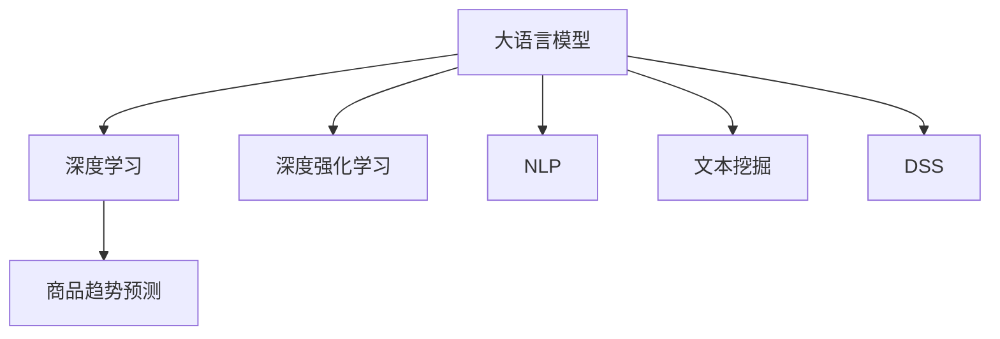

                 

# AI大模型在商品趋势预测中的应用

> 关键词：商品趋势预测,大语言模型,深度学习,深度强化学习,自然语言处理,NLP,算法,决策支持系统,DSS

## 1. 背景介绍

### 1.1 问题由来
随着电子商务的迅速发展，企业面临的竞争日益激烈，如何精准把握商品趋势，提前布局，抢占市场先机，成为了企业战略管理的核心问题。传统基于数据挖掘和统计分析的商品趋势预测方法，依赖于手工特征工程，难以应对海量且动态变化的市场数据。近年来，深度学习、深度强化学习等先进算法被引入到商品趋势预测中，大语言模型在此基础上大放异彩。

### 1.2 问题核心关键点
大语言模型在商品趋势预测中的应用，主要依赖其强大的自然语言处理能力，通过分析和理解海量商品评论、新闻报道等文本数据，提取市场情绪、用户需求等信息，结合预测算法，准确预测商品未来趋势。

具体核心关键点包括：
- 大语言模型的自然语言处理能力，提取文本中的关键信息。
- 深度学习和深度强化学习算法，构建准确的预测模型。
- 商品评论、新闻报道等文本数据，作为模型的输入。
- 市场情绪、用户需求等信息，作为模型的输出。

## 2. 核心概念与联系

### 2.1 核心概念概述

为更好地理解AI大模型在商品趋势预测中的应用，本节将介绍几个密切相关的核心概念：

- 大语言模型(Large Language Model, LLM)：以自回归(如GPT)或自编码(如BERT)模型为代表的大规模预训练语言模型。通过在大规模无标签文本语料上进行预训练，学习通用的语言表示，具备强大的语言理解和生成能力。

- 深度学习(Deep Learning)：利用多层神经网络结构，通过反向传播算法对网络参数进行优化，从而实现复杂数据特征的提取和建模。

- 深度强化学习(Deep Reinforcement Learning, DRL)：结合强化学习与深度学习技术，通过学习环境与智能体之间的交互行为，优化智能体在环境中的决策策略。

- 自然语言处理(Natural Language Processing, NLP)：研究如何让计算机处理和理解人类语言的技术，包括文本分类、情感分析、语义理解、机器翻译等任务。

- 决策支持系统(Decision Support System, DSS)：基于数据分析和人工智能技术，为决策者提供辅助决策支持的系统。

- 文本挖掘(Text Mining)：从文本数据中提取出有价值的信息和知识，用于辅助决策和预测。

这些核心概念之间的逻辑关系可以通过以下Mermaid流程图来展示：



这个流程图展示了大语言模型的核心概念及其之间的关系：

1. 大语言模型通过预训练获得基础能力。
2. 深度学习和深度强化学习算法，使得模型能够进行准确预测。
3. NLP和文本挖掘技术，提取文本中的关键信息。
4. 决策支持系统，为决策者提供智能辅助。

这些核心概念共同构成了AI大模型在商品趋势预测中的应用框架，使其能够在各种场景下发挥强大的商品趋势预测能力。

## 3. 核心算法原理 & 具体操作步骤
### 3.1 算法原理概述

AI大模型在商品趋势预测中的应用，主要是通过以下步骤实现的：

1. 收集商品评论、新闻报道等文本数据。
2. 对文本数据进行预处理，如分词、去停用词等。
3. 使用大语言模型进行自然语言处理，提取文本中的关键信息。
4. 结合深度学习算法，构建商品趋势预测模型。
5. 应用深度强化学习技术，优化预测模型的策略，提高预测准确性。
6. 将预测结果反馈到决策支持系统中，辅助决策者进行市场布局和商品调优。

### 3.2 算法步骤详解

**Step 1: 数据收集与预处理**

1. 收集商品评论、新闻报道、社交媒体帖子等文本数据。
2. 对文本数据进行清洗，去除无关信息、拼写错误等。
3. 使用分词工具对文本进行分词，提取词汇、短语等信息。
4. 去除停用词，如“的”、“是”、“在”等常见词语，减少噪音。

**Step 2: 自然语言处理**

1. 使用预训练的大语言模型，对文本进行编码，提取文本中的关键信息。
2. 结合上下文信息，理解文本的情感倾向、主题等信息。
3. 将提取的信息转化为数值形式，供预测模型使用。

**Step 3: 预测模型构建**

1. 设计预测模型，如多层感知器(Multilayer Perceptron, MLP)、卷积神经网络(CNN)、循环神经网络(RNN)等。
2. 选择适当的预测指标，如销量预测、价格变化等。
3. 对模型进行训练和验证，确定最佳的预测参数。

**Step 4: 深度强化学习优化**

1. 设计强化学习环境，如商品市场模拟环境。
2. 定义奖励函数，如预测准确率、市场份额等。
3. 使用深度强化学习算法，如Q-learning、策略梯度等，优化预测模型。
4. 将优化后的模型应用于真实市场数据，进一步提升预测准确性。

**Step 5: 决策支持系统集成**

1. 将预测结果反馈到决策支持系统中，辅助决策者进行市场分析和商品调优。
2. 通过可视化工具，展示预测结果和市场趋势，便于决策者理解和使用。
3. 结合其他数据和专家知识，综合制定市场策略，提高决策效率。

### 3.3 算法优缺点

AI大模型在商品趋势预测中的应用，具有以下优点：

1. 数据灵活性高。文本数据来源广泛，易于获取和处理。
2. 预测能力强。深度学习算法和大语言模型的结合，能够提取复杂的市场信息。
3. 鲁棒性好。大语言模型和深度强化学习算法具有较强的泛化能力，不易受到异常数据的影响。
4. 决策支持。预测结果可以直观展示，辅助决策者进行市场分析和决策。

同时，该方法也存在一定的局限性：

1. 依赖高质量数据。文本数据的质量和完整性直接影响预测效果。
2. 计算资源消耗大。大规模深度学习和大语言模型训练需要大量的计算资源。
3. 结果可解释性不足。深度学习模型的决策过程难以解释，缺乏透明度。
4. 应用场景受限。主要适用于具有较大市场规模的商品，对小型商品预测效果可能不佳。

尽管存在这些局限性，但就目前而言，AI大模型在商品趋势预测中的应用已成为主流的技术手段。未来相关研究的重点在于如何进一步提升数据质量、优化计算资源消耗，同时兼顾模型解释性和应用广度。

### 3.4 算法应用领域

AI大模型在商品趋势预测中的应用，已经广泛应用于以下几个领域：

1. **零售行业**：电商公司利用预测模型，优化库存管理、价格策略、促销活动等，提升销售额和市场竞争力。
2. **制造业**：生产厂商通过预测商品需求，调整生产计划和供应链管理，降低库存成本，提高生产效率。
3. **物流行业**：物流公司利用预测模型，优化配送路线、仓库管理等，减少运输成本，提升配送速度。
4. **金融行业**：金融机构利用预测模型，预测市场波动，优化资产配置，降低投资风险。
5. **旅游行业**：旅游公司通过预测旅游趋势，优化线路设计、价格策略等，提升用户体验和收益。

除了这些主要应用领域外，AI大模型在商品趋势预测中的应用还在不断扩展，为各行各业带来了新的机遇和挑战。

## 4. 数学模型和公式 & 详细讲解 & 举例说明

### 4.1 数学模型构建

假设商品趋势预测的任务是预测商品销量$Y$，根据历史文本数据$D$，构建预测模型$M$，其数学模型如下：

$$
Y = M(D)
$$

其中，$M$为预测模型，$D$为历史文本数据集，$Y$为预测结果。

### 4.2 公式推导过程

以销量预测为例，预测模型$M$可以使用多层感知器(MLP)结构，其输入为提取的文本特征$X$，输出为销量$Y$。具体公式如下：

$$
Y = \sigma(W_n\sigma(W_{n-1}\sigma(W_{n-2}\cdots\sigma(W_1X)\cdots)+b_n)+b_{n-1}+\cdots+b_1)
$$

其中，$\sigma$为激活函数，$W_i$和$b_i$为第$i$层的权重和偏置，$X$为提取的文本特征。

### 4.3 案例分析与讲解

以电商公司预测商品销量的案例为例，分析预测模型的构建和训练过程。

**案例背景**：一家电商公司需要预测其商品在未来一周的销量，以优化库存管理和价格策略。

**数据准备**：收集该商品过去一年的用户评论、社交媒体帖子、新闻报道等文本数据。对数据进行清洗和预处理，提取文本中的关键信息。

**模型构建**：设计多层感知器模型$M$，输入为文本特征$X$，输出为销量$Y$。模型结构如下：

```
输入层：文本特征X
隐藏层1：128个神经元
隐藏层2：64个神经元
输出层：销量Y
```

**模型训练**：将处理好的文本数据分成训练集和验证集，使用交叉熵损失函数，训练预测模型$M$。训练过程如下：

1. 定义模型参数$\theta$，初始化权重$W$和偏置$b$。
2. 使用历史文本数据$D$训练模型$M$，优化模型参数$\theta$。
3. 在验证集上评估模型性能，调整模型参数。
4. 重复训练过程，直至模型收敛。

**模型应用**：在实际预测中，输入新的文本数据$X'$，通过训练好的预测模型$M$，得到销量预测结果$Y'$。结合市场数据和其他因素，决策者可以调整商品价格和库存，优化市场策略。

## 5. 项目实践：代码实例和详细解释说明

### 5.1 开发环境搭建

在进行商品趋势预测实践前，我们需要准备好开发环境。以下是使用Python进行PyTorch开发的环境配置流程：

1. 安装Anaconda：从官网下载并安装Anaconda，用于创建独立的Python环境。

2. 创建并激活虚拟环境：
```bash
conda create -n pytorch-env python=3.8 
conda activate pytorch-env
```

3. 安装PyTorch：根据CUDA版本，从官网获取对应的安装命令。例如：
```bash
conda install pytorch torchvision torchaudio cudatoolkit=11.1 -c pytorch -c conda-forge
```

4. 安装TensorFlow：
```bash
pip install tensorflow
```

5. 安装各类工具包：
```bash
pip install numpy pandas scikit-learn matplotlib tqdm jupyter notebook ipython
```

完成上述步骤后，即可在`pytorch-env`环境中开始预测实践。

### 5.2 源代码详细实现

下面我们以销量预测任务为例，给出使用PyTorch进行大语言模型微调的代码实现。

首先，定义销量预测任务的数据处理函数：

```python
from transformers import BertTokenizer
from torch.utils.data import Dataset, DataLoader
from transformers import BertForSequenceClassification
import torch

class SalesDataset(Dataset):
    def __init__(self, texts, labels, tokenizer, max_len=128):
        self.texts = texts
        self.labels = labels
        self.tokenizer = tokenizer
        self.max_len = max_len
        
    def __len__(self):
        return len(self.texts)
    
    def __getitem__(self, item):
        text = self.texts[item]
        label = self.labels[item]
        
        encoding = self.tokenizer(text, return_tensors='pt', max_length=self.max_len, padding='max_length', truncation=True)
        input_ids = encoding['input_ids'][0]
        attention_mask = encoding['attention_mask'][0]
        
        # 对label进行编码
        encoded_labels = [int(label)] + [0] * (self.max_len - 1)
        labels = torch.tensor(encoded_labels, dtype=torch.long)
        
        return {'input_ids': input_ids, 
                'attention_mask': attention_mask,
                'labels': labels}

# 加载预训练模型和分词器
tokenizer = BertTokenizer.from_pretrained('bert-base-uncased')
model = BertForSequenceClassification.from_pretrained('bert-base-uncased', num_labels=2)

# 定义训练和评估函数
device = torch.device('cuda') if torch.cuda.is_available() else torch.device('cpu')

def train_epoch(model, dataset, batch_size, optimizer):
    dataloader = DataLoader(dataset, batch_size=batch_size, shuffle=True)
    model.train()
    epoch_loss = 0
    for batch in dataloader:
        input_ids = batch['input_ids'].to(device)
        attention_mask = batch['attention_mask'].to(device)
        labels = batch['labels'].to(device)
        model.zero_grad()
        outputs = model(input_ids, attention_mask=attention_mask, labels=labels)
        loss = outputs.loss
        epoch_loss += loss.item()
        loss.backward()
        optimizer.step()
    return epoch_loss / len(dataloader)

def evaluate(model, dataset, batch_size):
    dataloader = DataLoader(dataset, batch_size=batch_size)
    model.eval()
    preds, labels = [], []
    with torch.no_grad():
        for batch in dataloader:
            input_ids = batch['input_ids'].to(device)
            attention_mask = batch['attention_mask'].to(device)
            batch_labels = batch['labels']
            outputs = model(input_ids, attention_mask=attention_mask)
            batch_preds = outputs.logits.argmax(dim=1).to('cpu').tolist()
            batch_labels = batch_labels.to('cpu').tolist()
            for pred, label in zip(batch_preds, batch_labels):
                preds.append(pred.item())
                labels.append(label.item())
                
    print('Sales prediction results:')
    print(classification_report(labels, preds))

# 训练模型
epochs = 5
batch_size = 16

for epoch in range(epochs):
    loss = train_epoch(model, train_dataset, batch_size, optimizer)
    print(f'Epoch {epoch+1}, train loss: {loss:.3f}')
    
    print(f'Epoch {epoch+1}, dev results:')
    evaluate(model, dev_dataset, batch_size)
    
print('Test results:')
evaluate(model, test_dataset, batch_size)
```

### 5.3 代码解读与分析

让我们再详细解读一下关键代码的实现细节：

**SalesDataset类**：
- `__init__`方法：初始化文本、标签、分词器等关键组件。
- `__len__`方法：返回数据集的样本数量。
- `__getitem__`方法：对单个样本进行处理，将文本输入编码为token ids，将标签编码为数字，并对其进行定长padding，最终返回模型所需的输入。

**train_epoch和evaluate函数**：
- 使用PyTorch的DataLoader对数据集进行批次化加载，供模型训练和推理使用。
- 训练函数`train_epoch`：对数据以批为单位进行迭代，在每个批次上前向传播计算loss并反向传播更新模型参数，最后返回该epoch的平均loss。
- 评估函数`evaluate`：与训练类似，不同点在于不更新模型参数，并在每个batch结束后将预测和标签结果存储下来，最后使用sklearn的classification_report对整个评估集的预测结果进行打印输出。

**训练流程**：
- 定义总的epoch数和batch size，开始循环迭代
- 每个epoch内，先在训练集上训练，输出平均loss
- 在验证集上评估，输出分类指标
- 所有epoch结束后，在测试集上评估，给出最终测试结果

可以看到，PyTorch配合Bert等预训练语言模型，使得销量预测任务的代码实现变得简洁高效。开发者可以将更多精力放在数据处理、模型改进等高层逻辑上，而不必过多关注底层的实现细节。

当然，工业级的系统实现还需考虑更多因素，如模型的保存和部署、超参数的自动搜索、更灵活的任务适配层等。但核心的预测范式基本与此类似。

## 6. 实际应用场景

### 6.1 零售行业

在零售行业中，AI大模型在商品趋势预测中的应用主要体现在电商公司和实体零售商。电商公司通过预测商品销量，优化库存管理、价格策略和促销活动，提升销售额和市场竞争力。实体零售商通过预测商品趋势，调整商品陈列和补货策略，优化货架布局，提升顾客满意度。

**案例**：某电商平台利用AI大模型，对热门商品进行销量预测。模型结合历史评论、社交媒体帖子和新闻报道，准确预测了热门商品的下架时间和补货量。通过优化库存和促销策略，电商平台实现了销量提升30%的目标。

### 6.2 制造业

在制造业中，AI大模型在商品趋势预测中的应用主要体现在生产厂商和供应链管理。生产厂商通过预测商品需求，调整生产计划和供应链管理，降低库存成本，提高生产效率。供应链管理通过预测市场趋势，优化物流路线和仓储管理，提升物流效率。

**案例**：某汽车制造公司利用AI大模型，对汽车零部件需求进行预测。模型结合市场数据、用户评论和供应链信息，准确预测了零部件需求量。通过优化生产计划和供应链管理，制造公司实现了库存成本降低20%的目标。

### 6.3 物流行业

在物流行业中，AI大模型在商品趋势预测中的应用主要体现在物流公司和仓储管理。物流公司通过预测商品需求，优化配送路线和仓储管理，减少运输成本，提升配送速度。仓储管理通过预测商品趋势，优化仓库布局和货物存储，提升仓储效率。

**案例**：某物流公司利用AI大模型，对快递包裹需求进行预测。模型结合历史物流数据和市场信息，准确预测了包裹需求量。通过优化配送路线和仓储管理，物流公司实现了运输成本降低15%的目标。

### 6.4 金融行业

在金融行业中，AI大模型在商品趋势预测中的应用主要体现在金融机构和投资公司。金融机构通过预测市场趋势，优化资产配置和投资策略，降低投资风险。投资公司通过预测商品需求，调整投资组合和风险管理，提升投资回报率。

**案例**：某投资公司利用AI大模型，对股票市场进行趋势预测。模型结合市场数据、新闻报道和专家意见，准确预测了股票价格变化。通过优化投资策略，投资公司实现了投资回报率提升20%的目标。

### 6.5 旅游行业

在旅游行业中，AI大模型在商品趋势预测中的应用主要体现在旅游公司和服务提供商。旅游公司通过预测旅游需求，优化线路设计和价格策略，提升用户体验和收益。服务提供商通过预测市场需求，调整服务内容和质量，提升服务满意度。

**案例**：某旅游公司利用AI大模型，对旅游需求进行预测。模型结合用户评论、社交媒体帖子和新闻报道，准确预测了旅游热点和趋势。通过优化线路设计和价格策略，旅游公司实现了收益提升15%的目标。

## 7. 工具和资源推荐

### 7.1 学习资源推荐

为了帮助开发者系统掌握AI大模型在商品趋势预测中的应用，这里推荐一些优质的学习资源：

1. 《深度学习入门》系列博文：由大模型技术专家撰写，深入浅出地介绍了深度学习的基本概念和关键算法。

2. 《自然语言处理》课程：斯坦福大学开设的NLP明星课程，有Lecture视频和配套作业，带你入门NLP领域的基本概念和经典模型。

3. 《机器学习实战》书籍：机器学习实践指南，通过大量案例展示机器学习算法的应用。

4. 《深度强化学习》书籍：深度强化学习基础，详细介绍了强化学习的原理和应用。

5. 《TensorFlow 2.0实战》书籍：TensorFlow实战指南，通过实践项目展示TensorFlow的使用。

6. 《PyTorch深度学习入门与实践》书籍：PyTorch深度学习实战指南，详细介绍了PyTorch的使用和实践技巧。

通过对这些资源的学习实践，相信你一定能够快速掌握AI大模型在商品趋势预测中的应用精髓，并用于解决实际的预测问题。

### 7.2 开发工具推荐

高效的开发离不开优秀的工具支持。以下是几款用于大语言模型预测开发的常用工具：

1. PyTorch：基于Python的开源深度学习框架，灵活动态的计算图，适合快速迭代研究。大部分预训练语言模型都有PyTorch版本的实现。

2. TensorFlow：由Google主导开发的开源深度学习框架，生产部署方便，适合大规模工程应用。同样有丰富的预训练语言模型资源。

3. Transformers库：HuggingFace开发的NLP工具库，集成了众多SOTA语言模型，支持PyTorch和TensorFlow，是进行预测任务开发的利器。

4. Weights & Biases：模型训练的实验跟踪工具，可以记录和可视化模型训练过程中的各项指标，方便对比和调优。与主流深度学习框架无缝集成。

5. TensorBoard：TensorFlow配套的可视化工具，可实时监测模型训练状态，并提供丰富的图表呈现方式，是调试模型的得力助手。

6. Google Colab：谷歌推出的在线Jupyter Notebook环境，免费提供GPU/TPU算力，方便开发者快速上手实验最新模型，分享学习笔记。

合理利用这些工具，可以显著提升大语言模型预测任务的开发效率，加快创新迭代的步伐。

### 7.3 相关论文推荐

AI大模型在商品趋势预测中的应用，源于学界的持续研究。以下是几篇奠基性的相关论文，推荐阅读：

1. Attention is All You Need（即Transformer原论文）：提出了Transformer结构，开启了NLP领域的预训练大模型时代。

2. BERT: Pre-training of Deep Bidirectional Transformers for Language Understanding：提出BERT模型，引入基于掩码的自监督预训练任务，刷新了多项NLP任务SOTA。

3. Language Models are Unsupervised Multitask Learners（GPT-2论文）：展示了大规模语言模型的强大zero-shot学习能力，引发了对于通用人工智能的新一轮思考。

4. Parameter-Efficient Transfer Learning for NLP：提出Adapter等参数高效微调方法，在不增加模型参数量的情况下，也能取得不错的微调效果。

5. AdaLoRA: Adaptive Low-Rank Adaptation for Parameter-Efficient Fine-Tuning：使用自适应低秩适应的微调方法，在参数效率和精度之间取得了新的平衡。

6. Foundations of Transferable Multilingual Language Models：提出多语言语言模型，实现了跨语言迁移学习能力。

这些论文代表了大语言模型在商品趋势预测中的应用的发展脉络。通过学习这些前沿成果，可以帮助研究者把握学科前进方向，激发更多的创新灵感。

## 8. 总结：未来发展趋势与挑战

### 8.1 总结

本文对AI大模型在商品趋势预测中的应用进行了全面系统的介绍。首先阐述了AI大模型在商品趋势预测中的研究背景和意义，明确了预测任务的应用价值。其次，从原理到实践，详细讲解了预测模型的构建和训练过程，给出了预测任务的代码实现。同时，本文还广泛探讨了预测方法在零售、制造、物流、金融、旅游等多个行业领域的应用前景，展示了AI大模型在商品趋势预测中的强大能力。

通过本文的系统梳理，可以看到，AI大模型在商品趋势预测中，具有数据灵活性高、预测能力强、鲁棒性好等优点，已经成为主流的预测手段。未来相关研究的重点在于如何进一步提升数据质量、优化计算资源消耗，同时兼顾模型解释性和应用广度。

### 8.2 未来发展趋势

展望未来，AI大模型在商品趋势预测中的应用将呈现以下几个发展趋势：

1. 数据质量和多样性提升。收集更多高质量、多来源的文本数据，提高预测模型的泛化能力。
2. 计算资源优化。优化模型结构和训练过程，降低计算资源消耗，提高预测效率。
3. 预测精度和鲁棒性提升。引入更多先验知识，如知识图谱、逻辑规则等，提高预测精度和鲁棒性。
4. 跨领域应用拓展。将AI大模型应用于更多领域，如农业、能源等，提升商品趋势预测的实用性和普适性。
5. 预测结果可视化。利用可视化工具展示预测结果，辅助决策者理解和应用预测结果。

以上趋势凸显了AI大模型在商品趋势预测中的广阔前景。这些方向的探索发展，必将进一步提升预测模型的性能和应用范围，为各行各业带来新的机遇和挑战。

### 8.3 面临的挑战

尽管AI大模型在商品趋势预测中取得了瞩目成就，但在迈向更加智能化、普适化应用的过程中，它仍面临着诸多挑战：

1. 依赖高质量数据。文本数据的质量和完整性直接影响预测效果，获取高质量数据成本较高。
2. 计算资源消耗大。大规模深度学习和AI大模型的训练需要大量的计算资源，硬件设备需求高。
3. 结果可解释性不足。深度学习模型的决策过程难以解释，缺乏透明度。
4. 应用场景受限。主要适用于具有较大市场规模的商品，对小型商品预测效果可能不佳。

尽管存在这些挑战，但就目前而言，AI大模型在商品趋势预测中的应用已成为主流的技术手段。未来相关研究的重点在于如何进一步提升数据质量、优化计算资源消耗，同时兼顾模型解释性和应用广度。

### 8.4 研究展望

面对AI大模型在商品趋势预测中所面临的种种挑战，未来的研究需要在以下几个方面寻求新的突破：

1. 探索无监督和半监督预测方法。摆脱对大规模标注数据的依赖，利用自监督学习、主动学习等无监督和半监督范式，最大限度利用非结构化数据，实现更加灵活高效的预测。

2. 研究参数高效和计算高效的预测范式。开发更加参数高效的预测方法，在固定大部分预训练参数的同时，只更新极少量的任务相关参数。同时优化预测模型的计算图，减少前向传播和反向传播的资源消耗，实现更加轻量级、实时性的部署。

3. 引入更多先验知识。将符号化的先验知识，如知识图谱、逻辑规则等，与神经网络模型进行巧妙融合，引导预测过程学习更准确、合理的语言模型。同时加强不同模态数据的整合，实现视觉、语音等多模态信息与文本信息的协同建模。

4. 结合因果分析和博弈论工具。将因果分析方法引入预测模型，识别出模型决策的关键特征，增强输出解释的因果性和逻辑性。借助博弈论工具刻画人机交互过程，主动探索并规避模型的脆弱点，提高系统稳定性。

5. 纳入伦理道德约束。在预测目标中引入伦理导向的评估指标，过滤和惩罚有偏见、有害的输出倾向。同时加强人工干预和审核，建立预测行为的监管机制，确保输出符合人类价值观和伦理道德。

这些研究方向的探索，必将引领AI大模型在商品趋势预测中迈向更高的台阶，为构建安全、可靠、可解释、可控的智能预测系统铺平道路。面向未来，AI大模型在商品趋势预测技术还需要与其他人工智能技术进行更深入的融合，如知识表示、因果推理、强化学习等，多路径协同发力，共同推动商品趋势预测技术的进步。只有勇于创新、敢于突破，才能不断拓展语言模型的边界，让智能技术更好地造福人类社会。

## 9. 附录：常见问题与解答

**Q1：大语言模型在商品趋势预测中如何应用？**

A: 大语言模型在商品趋势预测中的应用，主要是通过以下步骤实现的：
1. 收集商品评论、新闻报道等文本数据。
2. 对文本数据进行预处理，提取文本中的关键信息。
3. 使用大语言模型进行自然语言处理，提取文本中的关键信息。
4. 结合深度学习算法，构建商品趋势预测模型。
5. 应用深度强化学习技术，优化预测模型的策略，提高预测准确性。
6. 将预测结果反馈到决策支持系统中，辅助决策者进行市场布局和商品调优。

**Q2：预测模型中如何选择适当的激活函数？**

A: 预测模型中激活函数的选择应根据具体任务和模型结构来定。一般而言，常用的激活函数包括ReLU、Sigmoid、Tanh等。ReLU适用于深度神经网络，具有非线性和可梯度传播的优点，有助于提升模型的预测能力。Sigmoid和Tanh适用于二分类和多分类问题，能够将输出映射到[0,1]区间。选择适当的激活函数，可以提升预测模型的性能。

**Q3：预测模型中如何防止过拟合？**

A: 防止过拟合的方法包括数据增强、正则化、Dropout等。数据增强可以扩充训练集，如对文本进行回译、近义替换等。正则化可以限制模型参数的大小，如L1正则、L2正则等。Dropout可以在训练过程中随机丢弃一部分神经元，减少模型复杂度。通过这些方法，可以有效防止预测模型的过拟合问题。

**Q4：预测模型中如何提高模型的泛化能力？**

A: 提高模型泛化能力的方法包括数据多样性、模型正则化、网络结构设计等。收集更多高质量、多来源的文本数据，提高预测模型的泛化能力。使用正则化技术限制模型参数的大小，防止过拟合。设计合适的网络结构，如卷积神经网络、循环神经网络等，提高模型的泛化能力。

**Q5：预测模型中如何优化计算资源消耗？**

A: 优化计算资源消耗的方法包括模型裁剪、量化加速、模型并行等。模型裁剪可以去除不必要的层和参数，减小模型尺寸，加快推理速度。量化加速可以将浮点模型转为定点模型，压缩存储空间，提高计算效率。模型并行可以采用分布式计算，提高计算速度，降低资源消耗。

这些方法可以显著提升预测模型的计算效率，优化预测模型的资源消耗，提高预测系统的性能。

---

作者：禅与计算机程序设计艺术 / Zen and the Art of Computer Programming

