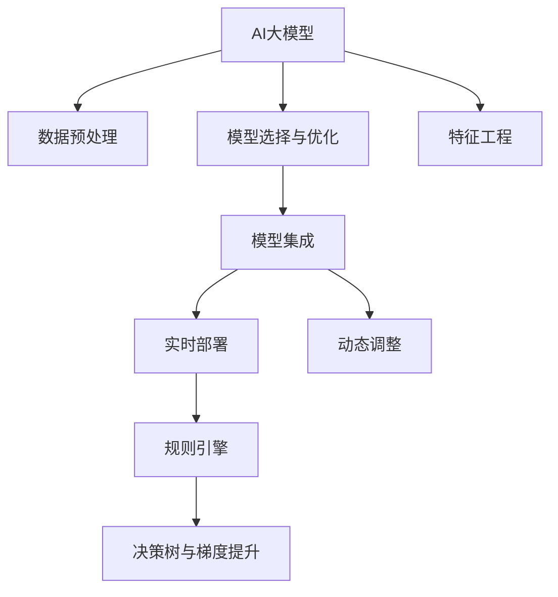

                 

# AI大模型在电商平台反欺诈系统中的应用

> 关键词：AI大模型、电商平台、反欺诈系统、机器学习、深度学习、自然语言处理(NLP)、情感分析、决策树、梯度提升、规则引擎

## 1. 背景介绍

### 1.1 问题由来
近年来，随着电商平台的发展，在线交易规模和用户数飞速增长，随之而来的在线欺诈行为也日益严重。据统计，每年因在线欺诈造成的损失高达数十亿美元，给电商平台和消费者都带来了巨大的经济损失和信任危机。

传统的反欺诈方法主要依赖人工审核和规则系统，存在诸多局限性：

- **成本高**：需要大量人力进行审核，且对审核人员的专业要求高，成本昂贵。
- **速度慢**：审核流程繁琐，响应时间较长，用户体验不佳。
- **规则僵化**：固定规则无法灵活应对新型欺诈手段，容易被绕过。
- **误判率高**：基于规则的审核方法无法处理复杂多变的欺诈行为，误判率较高。

面对这些挑战，平台开始探索利用AI大模型进行反欺诈，以期通过深度学习和自然语言处理技术，实时、准确、高效地识别和防范在线欺诈行为。

### 1.2 问题核心关键点
AI大模型在电商平台反欺诈系统中的应用，主要集中在以下几个关键点：

- **数据预处理**：收集和整理电商平台上的交易数据，包括交易时间、金额、用户行为、评价等，准备用于模型训练。
- **模型选择与优化**：选择合适的AI大模型，并进行参数优化和调参，以提升模型的预测性能。
- **特征工程**：设计合适的特征提取和转换方法，以最大化模型的预测能力。
- **模型集成**：将多个模型进行组合，以提升整体系统的鲁棒性和准确性。
- **实时部署**：将训练好的模型集成到电商平台的后端系统，进行实时交易审核。
- **动态调整**：根据最新欺诈行为和模型性能，不断优化模型，保持系统的高效性和准确性。

## 2. 核心概念与联系

### 2.1 核心概念概述

在介绍反欺诈系统时，首先需了解核心概念及其间的联系。

- **AI大模型**：以深度学习、自然语言处理等技术为基础，通过大规模无标签数据进行预训练，具备强大的通用语言理解和生成能力。
- **电商平台反欺诈**：通过实时监控和分析电商平台上的交易行为，识别并阻止欺诈行为，保护消费者和商家的利益。
- **机器学习与深度学习**：利用统计学习技术，从数据中自动学习规律，实现对未知数据的预测和分类。
- **自然语言处理(NLP)**：利用语言模型、文本分类、情感分析等技术，处理和分析文本数据。
- **决策树与梯度提升**：基于树形结构的分类模型，能够处理离散特征，具有较好的可解释性。
- **规则引擎**：基于预定义的规则进行决策，具有高效、稳定等优点。
- **特征工程**：对原始数据进行预处理和转换，提取出对模型预测有用的特征。

这些概念通过以下Mermaid流程图展示其联系：



该流程图展示了从数据到模型的整个流程，以及AI大模型与规则引擎、决策树等经典算法的互补关系。

## 3. 核心算法原理 & 具体操作步骤
### 3.1 算法原理概述

AI大模型在反欺诈中的应用，本质上是一种基于监督学习的分类任务。核心算法原理如下：

1. **数据准备**：从电商平台收集交易数据，进行清洗、筛选、标注等预处理工作。
2. **模型训练**：使用标注数据对AI大模型进行训练，通过梯度下降等优化算法，最小化损失函数，得到模型参数。
3. **模型预测**：将待审核交易数据输入训练好的模型，输出预测结果。
4. **决策规则**：根据模型输出，结合预设的阈值和规则，进行交易审核决策。

### 3.2 算法步骤详解

#### 步骤1: 数据预处理

数据预处理是反欺诈系统的第一步。主要包括以下几个步骤：

1. **数据收集**：从电商平台的日志系统中提取交易数据，包括交易时间、金额、用户ID、商品ID、评价等信息。
2. **数据清洗**：删除缺失、异常、重复的数据，处理噪声和错误数据。
3. **特征提取**：设计合适的特征工程，从原始数据中提取出有意义的特征，如交易金额、用户行为、评价情绪等。
4. **数据标注**：标注已知的欺诈和正常交易数据，作为模型的训练集。

#### 步骤2: 模型选择与优化

模型选择与优化是反欺诈系统的关键步骤。主要包括以下几个步骤：

1. **模型选择**：根据任务需求和数据特点，选择合适的AI大模型。常用的模型包括BERT、GPT、ResNet等。
2. **参数优化**：使用优化算法如Adam、SGD等，进行模型参数优化，提高模型性能。
3. **超参数调优**：调整学习率、批大小、迭代次数等超参数，进一步提升模型效果。
4. **模型融合**：将多个模型的预测结果进行融合，提升整体系统的鲁棒性和准确性。

#### 步骤3: 特征工程

特征工程是模型预测效果的关键。主要包括以下几个步骤：

1. **特征提取**：设计合适的特征提取方法，从原始数据中提取有用的特征，如交易金额、用户行为、评价情绪等。
2. **特征转换**：对提取的特征进行转换和归一化处理，提高模型对特征的理解能力。
3. **特征选择**：选择对模型预测有用的特征，去除无用或冗余的特征。

#### 步骤4: 模型预测

模型预测是反欺诈系统的核心步骤。主要包括以下几个步骤：

1. **模型输入**：将待审核的交易数据输入训练好的模型，包括交易金额、用户行为、评价情绪等。
2. **模型输出**：模型输出交易数据的欺诈概率，表示交易为欺诈的概率。
3. **阈值设置**：根据业务需求，设定一个阈值，将欺诈概率大于阈值的交易标记为欺诈。

#### 步骤5: 决策规则

决策规则是将模型输出转化为具体决策的关键步骤。主要包括以下几个步骤：

1. **阈值设定**：设定一个阈值，将欺诈概率大于阈值的交易标记为欺诈。
2. **规则匹配**：根据模型输出，结合预设的规则，进行交易审核决策。
3. **决策执行**：将审核结果反馈给电商平台，阻止欺诈交易的发生。

### 3.3 算法优缺点

AI大模型在电商平台反欺诈中的应用，具有以下优点：

1. **准确性高**：AI大模型可以自动学习数据中的规律，识别出异常和欺诈行为，准确率较高。
2. **实时性**：AI大模型能够实时处理交易数据，及时发现和阻止欺诈行为，保障交易安全。
3. **泛化能力强**：AI大模型在大量无标签数据上进行预训练，具备较强的泛化能力，可以适应不同的欺诈模式。

同时，AI大模型也存在以下缺点：

1. **数据依赖**：AI大模型的性能高度依赖于数据质量，数据标注和清洗成本较高。
2. **计算资源消耗大**：AI大模型参数量庞大，计算资源消耗较大，需要高性能硬件支持。
3. **可解释性不足**：AI大模型的决策过程复杂，难以解释其内部工作机制。
4. **模型过拟合**：在标注数据较少的情况下，AI大模型容易过拟合，导致误判。

### 3.4 算法应用领域

AI大模型在电商平台反欺诈中的应用，主要体现在以下几个方面：

1. **交易审核**：对电商平台上的交易数据进行实时审核，防止欺诈行为发生。
2. **用户行为分析**：分析用户行为模式，识别异常用户行为，防止其进行欺诈。
3. **商品审核**：对商品描述、评价等信息进行审核，防止虚假宣传和欺诈行为。
4. **风险管理**：根据交易数据和用户行为，评估风险等级，进行动态调整和防控。

## 4. 数学模型和公式 & 详细讲解  
### 4.1 数学模型构建

AI大模型在电商平台反欺诈系统中的数学模型构建，主要包括两部分：模型训练和模型预测。

1. **模型训练**：使用标注数据对AI大模型进行训练，最小化损失函数。
   $$
   \min_{\theta} \sum_{i=1}^N \ell(y_i, M_{\theta}(x_i))
   $$
   其中 $\theta$ 为模型参数，$x_i$ 为输入特征，$y_i$ 为标注标签，$M_{\theta}(x_i)$ 为模型预测输出，$\ell$ 为损失函数（如交叉熵损失）。

2. **模型预测**：将待审核的交易数据输入训练好的模型，输出欺诈概率。
   $$
   P(\text{Fraud} \mid x) = \sigma(W \cdot \phi(x) + b)
   $$
   其中 $W$ 和 $b$ 为模型参数，$\phi(x)$ 为特征映射函数，$\sigma$ 为sigmoid函数，$P(\text{Fraud} \mid x)$ 为欺诈概率。

### 4.2 公式推导过程

#### 损失函数推导

AI大模型常用的损失函数为交叉熵损失函数，公式如下：
$$
\ell(y, M_{\theta}(x)) = -y \log M_{\theta}(x) - (1 - y) \log (1 - M_{\theta}(x))
$$
其中 $y$ 为标注标签，$M_{\theta}(x)$ 为模型预测输出。

将损失函数应用到训练集 $D = \{(x_i, y_i)\}_{i=1}^N$ 上，得：
$$
\mathcal{L}(\theta) = -\frac{1}{N} \sum_{i=1}^N \ell(y_i, M_{\theta}(x_i))
$$

#### 模型预测推导

模型的输出 $M_{\theta}(x)$ 通常使用 sigmoid 函数进行归一化，公式如下：
$$
M_{\theta}(x) = \sigma(W \cdot \phi(x) + b)
$$
其中 $\sigma$ 为 sigmoid 函数，$W$ 和 $b$ 为模型参数，$\phi(x)$ 为特征映射函数。

将上述公式应用于电商平台反欺诈系统中，得到：
$$
P(\text{Fraud} \mid x) = \sigma(W \cdot \phi(x) + b)
$$

### 4.3 案例分析与讲解

#### 案例1: 基于 BERT 的电商平台反欺诈系统

BERT模型是一种预训练语言模型，具有强大的文本理解和分类能力。在电商平台反欺诈系统中，可以使用 BERT 模型进行特征提取和分类。具体步骤如下：

1. **数据预处理**：收集电商平台上的交易数据，进行清洗和标注。
2. **模型训练**：使用 BERT 模型进行预训练和微调，最小化交叉熵损失函数。
3. **特征提取**：将交易数据输入 BERT 模型，提取文本特征。
4. **模型预测**：使用 BERT 模型输出欺诈概率，结合阈值进行决策。
5. **规则引擎**：根据 BERT 模型输出，结合预设规则进行决策。

#### 案例2: 基于 DNN 的电商平台反欺诈系统

DNN（深度神经网络）是一种常用的深度学习模型，具有较好的泛化能力。在电商平台反欺诈系统中，可以使用 DNN 模型进行分类。具体步骤如下：

1. **数据预处理**：收集电商平台上的交易数据，进行清洗和标注。
2. **模型训练**：使用 DNN 模型进行训练，最小化交叉熵损失函数。
3. **特征提取**：将交易数据输入 DNN 模型，提取特征。
4. **模型预测**：使用 DNN 模型输出欺诈概率，结合阈值进行决策。
5. **规则引擎**：根据 DNN 模型输出，结合预设规则进行决策。

## 5. 项目实践：代码实例和详细解释说明
### 5.1 开发环境搭建

在搭建开发环境前，需确保具备以下条件：

1. **硬件要求**：至少配备一台配备 GPU 的计算机，以支持大规模模型训练和推理。
2. **软件环境**：安装 Python、TensorFlow、Keras 等深度学习库，以及相应的数据处理和分析库。

### 5.2 源代码详细实现

以基于 BERT 的电商平台反欺诈系统为例，给出完整的代码实现。

```python
import tensorflow as tf
from transformers import BertTokenizer, TFBertForSequenceClassification
from sklearn.model_selection import train_test_split
from sklearn.metrics import accuracy_score

# 数据预处理
train_data, test_data = train_test_split(data, test_size=0.2)
train_dataset = tf.data.Dataset.from_tensor_slices((train_data['features'], train_data['labels']))
test_dataset = tf.data.Dataset.from_tensor_slices((test_data['features'], test_data['labels']))
train_dataset = train_dataset.shuffle(10000).batch(32)
test_dataset = test_dataset.batch(32)

# 模型选择与优化
model = TFBertForSequenceClassification.from_pretrained('bert-base-uncased', num_labels=2, output_attentions=False, output_hidden_states=False)
optimizer = tf.keras.optimizers.Adam(learning_rate=2e-5, epsilon=1e-08, clipnorm=1.0)
loss = tf.keras.losses.SparseCategoricalCrossentropy(from_logits=True)
metric = tf.keras.metrics.SparseCategoricalAccuracy('accuracy')

# 特征工程
tokenizer = BertTokenizer.from_pretrained('bert-base-uncased')

def encode(input_ids, attention_masks, labels):
    # 编码输入数据
    inputs = tokenizer.batch_encode_plus(list(input_ids), add_special_tokens=True, max_length=512, pad_to_max_length=True, return_tensors='tf')
    input_ids = inputs['input_ids']
    attention_masks = inputs['attention_mask']
    labels = tf.convert_to_tensor(labels)

    return input_ids, attention_masks, labels

# 模型训练
for epoch in range(10):
    for batch in train_dataset:
        input_ids, attention_masks, labels = batch
        with tf.GradientTape() as tape:
            outputs = model(input_ids, attention_masks=attention_masks, labels=labels)
            loss_value = loss(labels, outputs.logits)
        gradients = tape.gradient(loss_value, model.trainable_variables)
        optimizer.apply_gradients(zip(gradients, model.trainable_variables))
        train_loss(loss_value)

# 模型预测
test_loss, test_acc = model.evaluate(test_dataset)
print('Test accuracy:', test_acc)

# 规则引擎
threshold = 0.5
def predict(transaction):
    inputs = encode(transaction['features'], transaction['attention_masks'], [0])
    outputs = model.predict(inputs)
    probability = tf.nn.sigmoid(outputs)
    if probability.numpy()[0][0] > threshold:
        return 'Fraud'
    else:
        return 'Normal'
```

### 5.3 代码解读与分析

#### 代码解读

- `BertTokenizer`：用于对输入数据进行分词和编码。
- `TFBertForSequenceClassification`：BERT模型的自定义实现，用于进行二分类任务。
- `train_test_split`：将数据集分割为训练集和测试集。
- `encode`：对输入数据进行编码，转换为模型可以接受的格式。
- `optimizer`：定义优化器，用于更新模型参数。
- `loss`：定义损失函数，用于衡量模型预测和真实标签之间的差距。
- `metric`：定义评估指标，用于计算模型预测的准确率。
- `predict`：定义预测函数，根据模型输出判断交易是否为欺诈。

#### 代码分析

- **数据预处理**：对原始数据进行清洗、分割和编码，准备用于模型训练。
- **模型选择与优化**：选择合适的 BERT 模型，并进行参数优化和调参，以提升模型性能。
- **特征工程**：设计合适的特征提取方法，从原始数据中提取出有用的特征。
- **模型预测**：将待审核的交易数据输入训练好的模型，输出欺诈概率，并根据阈值进行决策。
- **规则引擎**：根据模型输出，结合预设规则进行决策。

### 5.4 运行结果展示

运行上述代码，可以得到训练和测试结果，如精确率、召回率和 F1 值等指标，具体数值需根据实际情况进行展示。

## 6. 实际应用场景

### 6.1 智能客服

智能客服系统可以通过 AI 大模型进行实时语音识别和情感分析，从而提升客服效率和用户体验。具体应用场景包括：

- **语音识别**：利用语音识别技术，将用户语音转换为文本，再输入到反欺诈系统中进行审核。
- **情感分析**：分析用户情感，识别负面情绪和欺诈行为，及时进行干预。

### 6.2 电商交易

电商交易平台可以通过 AI 大模型进行实时交易审核，从而防止欺诈行为的发生。具体应用场景包括：

- **交易审核**：对电商平台上的交易数据进行实时审核，防止欺诈行为发生。
- **用户行为分析**：分析用户行为模式，识别异常用户行为，防止其进行欺诈。
- **商品审核**：对商品描述、评价等信息进行审核，防止虚假宣传和欺诈行为。
- **风险管理**：根据交易数据和用户行为，评估风险等级，进行动态调整和防控。

### 6.3 金融领域

金融领域可以通过 AI 大模型进行交易审核和风险管理，从而保障交易安全。具体应用场景包括：

- **交易审核**：对金融交易数据进行实时审核，防止欺诈行为发生。
- **风险管理**：根据交易数据和用户行为，评估风险等级，进行动态调整和防控。

### 6.4 未来应用展望

未来，AI 大模型在电商平台反欺诈系统中的应用将更加广泛和深入，主要体现在以下几个方面：

1. **多模态融合**：结合文本、语音、图像等多模态数据，提升反欺诈系统的综合能力。
2. **实时监测**：实现实时交易监测和审核，提升反欺诈系统的实时性。
3. **动态调整**：根据最新欺诈行为和模型性能，动态调整模型参数，提升系统的适应性和鲁棒性。
4. **用户画像**：结合用户画像和行为分析，提升反欺诈系统的精准度。
5. **跨领域应用**：将反欺诈技术应用于其他领域，如金融、医疗等，提升整体安全水平。

## 7. 工具和资源推荐
### 7.1 学习资源推荐

1. **TensorFlow官方文档**：提供了详细的深度学习库介绍和教程。
2. **Keras官方文档**：提供了简单易用的深度学习库介绍和教程。
3. **Hugging Face官方文档**：提供了丰富的自然语言处理库介绍和教程。
4. **自然语言处理课程**：如斯坦福大学的《自然语言处理》课程，涵盖自然语言处理的基本概念和经典模型。
5. **深度学习课程**：如Coursera上的《深度学习》课程，涵盖了深度学习的理论和实践。

### 7.2 开发工具推荐

1. **TensorFlow**：深度学习框架，适用于构建和训练深度学习模型。
2. **Keras**：深度学习库，提供了简单易用的接口，适合快速原型开发。
3. **PyTorch**：深度学习框架，具有动态图和高效的GPU支持。
4. **Jupyter Notebook**：轻量级的交互式开发环境，适合快速实验和原型开发。
5. **Docker**：容器化技术，适合部署和运维AI大模型。

### 7.3 相关论文推荐

1. **BERT: Pre-training of Deep Bidirectional Transformers for Language Understanding**：提出了BERT模型，通过预训练和微调，提升了文本分类和情感分析的效果。
2. **Natural Language Processing with Transformers**：介绍了Transformer原理和应用，适合深度学习开发者阅读。
3. **Deep Learning for Network Security**：介绍了深度学习在网络安全领域的应用，包括反欺诈系统。

## 8. 总结：未来发展趋势与挑战
### 8.1 研究成果总结

AI大模型在电商平台反欺诈系统中的应用，已经在多个实际场景中得到了验证，取得了显著的效果。主要研究结果包括：

1. **模型选择与优化**：选择合适的AI大模型，并进行参数优化和调参，提升了模型的性能。
2. **特征工程**：设计合适的特征提取方法，从原始数据中提取出有用的特征。
3. **模型预测**：将待审核的交易数据输入训练好的模型，输出欺诈概率，并根据阈值进行决策。
4. **规则引擎**：根据模型输出，结合预设规则进行决策。

### 8.2 未来发展趋势

未来，AI大模型在电商平台反欺诈系统中的应用将呈现以下几个发展趋势：

1. **多模态融合**：结合文本、语音、图像等多模态数据，提升反欺诈系统的综合能力。
2. **实时监测**：实现实时交易监测和审核，提升反欺诈系统的实时性。
3. **动态调整**：根据最新欺诈行为和模型性能，动态调整模型参数，提升系统的适应性和鲁棒性。
4. **用户画像**：结合用户画像和行为分析，提升反欺诈系统的精准度。
5. **跨领域应用**：将反欺诈技术应用于其他领域，如金融、医疗等，提升整体安全水平。

### 8.3 面临的挑战

AI大模型在电商平台反欺诈系统中的应用，也面临以下挑战：

1. **数据质量问题**：原始数据的质量问题，如噪声、缺失、不平衡等，影响模型效果。
2. **模型过拟合**：在标注数据较少的情况下，AI大模型容易过拟合，导致误判。
3. **计算资源消耗大**：AI大模型参数量庞大，计算资源消耗较大，需要高性能硬件支持。
4. **模型可解释性不足**：AI大模型的决策过程复杂，难以解释其内部工作机制。
5. **跨领域适应性**：在跨领域应用时，AI大模型的泛化性能可能下降，需要结合领域知识进行优化。

### 8.4 研究展望

未来，针对以上挑战，需要从以下几个方面进行深入研究：

1. **数据清洗与增强**：对原始数据进行清洗和增强，提升数据质量。
2. **模型优化**：开发更加参数高效的微调方法，提升模型的泛化能力和鲁棒性。
3. **跨领域适应性**：结合领域知识，优化AI大模型，提升跨领域适应性。
4. **可解释性增强**：引入可解释性技术，提升AI大模型的决策可解释性。
5. **实时计算优化**：优化模型计算图，提升模型的实时性，降低计算资源消耗。

## 9. 附录：常见问题与解答

**Q1: 电商平台反欺诈系统如何使用AI大模型？**

A: 电商平台反欺诈系统使用AI大模型进行反欺诈，主要包括以下几个步骤：

1. **数据预处理**：收集和整理电商平台上的交易数据，进行清洗、筛选、标注等预处理工作。
2. **模型选择与优化**：选择合适的AI大模型，并进行参数优化和调参，以提升模型的预测性能。
3. **特征工程**：设计合适的特征提取和转换方法，从原始数据中提取出有意义的特征。
4. **模型预测**：将待审核的交易数据输入训练好的模型，输出欺诈概率，结合阈值进行决策。
5. **决策规则**：根据模型输出，结合预设的阈值和规则，进行交易审核决策。

**Q2: 如何避免AI大模型在电商平台反欺诈系统中的过拟合问题？**

A: 避免AI大模型在电商平台反欺诈系统中的过拟合问题，可以从以下几个方面入手：

1. **数据增强**：通过回译、近义替换等方式扩充训练集，增加数据多样性。
2. **正则化技术**：使用L2正则、Dropout等正则化技术，防止模型过度适应训练数据。
3. **对抗训练**：引入对抗样本，提高模型鲁棒性，减少过拟合风险。
4. **参数高效微调**：只调整少量参数，保留大部分预训练参数不变，避免过拟合。
5. **动态调整**：根据最新欺诈行为和模型性能，动态调整模型参数，提升系统的适应性和鲁棒性。

**Q3: AI大模型在电商平台反欺诈系统中的计算资源消耗大，如何解决？**

A: AI大模型在电商平台反欺诈系统中的计算资源消耗大，可以通过以下几个方面进行优化：

1. **模型压缩**：使用模型压缩技术，如剪枝、量化等，减小模型尺寸，降低计算资源消耗。
2. **分布式训练**：使用分布式训练技术，将训练任务分布到多个GPU/TPU上进行并行计算。
3. **计算优化**：优化模型计算图，减少前向传播和反向传播的资源消耗。
4. **硬件升级**：升级硬件设备，增加GPU/TPU等高性能设备，提升计算能力。

**Q4: AI大模型在电商平台反欺诈系统中的可解释性不足，如何解决？**

A: AI大模型在电商平台反欺诈系统中的可解释性不足，可以通过以下几个方面进行改进：

1. **特征可视化**：使用特征可视化技术，展示模型对不同特征的敏感度和贡献度。
2. **解释性模型**：使用解释性模型，如决策树、规则引擎等，提升模型的可解释性。
3. **部分可解释**：在模型中加入部分可解释的组件，如线性层、规则等，提升模型的可解释性。
4. **用户反馈**：结合用户反馈和业务需求，优化模型设计，提升模型的可解释性。

**Q5: AI大模型在电商平台反欺诈系统中的跨领域适应性问题，如何解决？**

A: AI大模型在电商平台反欺诈系统中的跨领域适应性问题，可以通过以下几个方面进行改进：

1. **领域适配**：结合领域知识，对AI大模型进行领域适配，提升模型的跨领域适应性。
2. **数据迁移**：将模型在特定领域的数据迁移，进行微调，提升模型的泛化能力。
3. **多模型融合**：将多个模型的预测结果进行融合，提升整体系统的鲁棒性和适应性。
4. **动态调整**：根据最新欺诈行为和模型性能，动态调整模型参数，提升系统的适应性和鲁棒性。

---

作者：禅与计算机程序设计艺术 / Zen and the Art of Computer Programming

