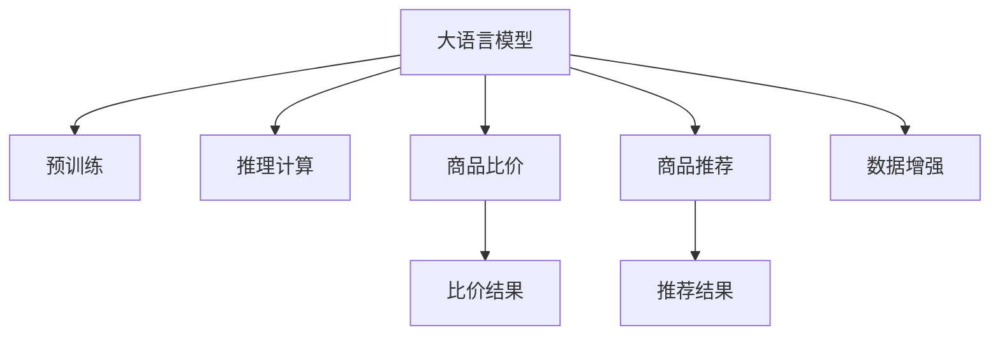

                 

# AI大模型在电商平台商品比价中的作用

> 关键词：电商比价,大语言模型,预训练模型,推理计算,商品推荐,数据增强

## 1. 背景介绍

### 1.1 问题由来
随着电商平台的快速发展，商品种类繁多，消费者在购物时面临着信息过载的问题。为有效比较不同电商平台的商品价格，用户需要花费大量时间和精力，查询、筛选和比对信息，这不仅效率低下，还可能存在误导和欺诈风险。因此，电商平台亟需一种自动化、准确、安全的方式帮助消费者进行商品比价。

### 1.2 问题核心关键点
目前，电商比价技术主要有基于规则和基于机器学习两种方式。基于规则的方法依赖人工制定的规则，维护成本高，更新频率慢；基于机器学习的方法则依赖于模型对电商平台数据的学习，能够更快速地更新和适应市场变化，但需要大量的标注数据和计算资源。

大语言模型通过在大规模无标签文本语料上进行预训练，学习到通用的语言知识和语法规则，同时也能通过微调针对特定电商比价任务进行优化，具有以下优势：
1. 自监督学习，无需大量标注数据。
2. 泛化能力强，适应电商领域各种商品类别。
3. 部署灵活，可以在云上和本地进行推理计算。
4. 支持多种任务，包括商品描述生成、比价结果生成等。

因此，大语言模型在电商比价场景中具有广泛的应用前景。

## 2. 核心概念与联系

### 2.1 核心概念概述

为了更好地理解大语言模型在电商比价中的应用，本节将介绍几个关键概念：

- 大语言模型(Large Language Model, LLM)：以自回归(如GPT)或自编码(如BERT)模型为代表的大规模预训练语言模型。通过在大规模无标签文本语料上进行预训练，学习通用的语言表示，具备强大的语言理解和生成能力。

- 预训练(Pre-training)：指在大规模无标签文本语料上，通过自监督学习任务训练通用语言模型的过程。常见的预训练任务包括言语建模、遮挡语言模型等。

- 推理计算(Inference)：指使用训练好的模型对新输入进行计算，输出相应的结果。通常大语言模型的推理计算涉及大量的计算资源。

- 商品比价(Price Comparison)：指对不同电商平台或同一平台不同商家提供的商品价格进行比较，帮助消费者选择性价比最高的商品。

- 数据增强(Data Augmentation)：指通过对原始数据进行一系列变换和扩充，生成更多的训练样本，增强模型泛化能力。

- 微调(Fine-tuning)：指在预训练模型的基础上，使用下游任务的少量标注数据，通过有监督学习优化模型在该任务上的性能。

- 商品推荐(Recommendation)：指根据用户的历史行为数据或浏览记录，推荐用户可能感兴趣的商品。

这些核心概念之间的逻辑关系可以通过以下Mermaid流程图来展示：



这个流程图展示了大语言模型的核心概念及其之间的关系：

1. 大语言模型通过预训练获得基础能力。
2. 推理计算使得模型可以应对电商比价任务。
3. 商品比价和商品推荐是大语言模型的主要应用。
4. 数据增强用于增强模型的泛化能力。
5. 微调用于针对特定任务进行优化。

## 3. 核心算法原理 & 具体操作步骤
### 3.1 算法原理概述

基于大语言模型在电商比价中的应用，核心算法原理可概括为：

1. 使用大规模无标签电商数据对预训练模型进行微调，学习商品描述和价格相关的知识。
2. 将电商网站商品描述作为输入，输出商品价格，实现自动比价。
3. 利用数据增强技术丰富训练集，提高模型泛化能力。
4. 对模型推理计算进行优化，确保在电商比价场景中能够实时响应。

### 3.2 算法步骤详解

基于大语言模型的电商比价技术主要包括以下关键步骤：

**Step 1: 准备预训练模型和数据集**
- 选择合适的预训练语言模型 $M_{\theta}$ 作为初始化参数，如 BERT、GPT等。
- 准备电商网站商品描述和价格的数据集 $D=\{(x_i,p_i)\}_{i=1}^N$，其中 $x_i$ 为商品描述，$p_i$ 为价格标签。

**Step 2: 添加任务适配层**
- 根据电商比价任务，在预训练模型顶层设计合适的输出层和损失函数。
- 对于比价任务，通常使用回归任务，输出预测价格 $y=\hat{p}$。

**Step 3: 设置微调超参数**
- 选择合适的优化算法及其参数，如 AdamW、SGD 等，设置学习率、批大小、迭代轮数等。
- 设置正则化技术及强度，包括权重衰减、Dropout、Early Stopping 等。
- 确定冻结预训练参数的策略，如仅微调顶层，或全部参数都参与微调。

**Step 4: 执行梯度训练**
- 将训练集数据分批次输入模型，前向传播计算损失函数。
- 反向传播计算参数梯度，根据设定的优化算法和学习率更新模型参数。
- 周期性在验证集上评估模型性能，根据性能指标决定是否触发 Early Stopping。
- 重复上述步骤直到满足预设的迭代轮数或 Early Stopping 条件。

**Step 5: 测试和部署**
- 在测试集上评估微调后模型 $M_{\hat{\theta}}$ 的性能，对比微调前后的精度提升。
- 使用微调后的模型对新商品进行价格预测，集成到实际的应用系统中。

### 3.3 算法优缺点

大语言模型在电商比价中的应用具有以下优点：
1. 自监督学习，无需大量标注数据。
2. 泛化能力强，适应各种商品类别和电商平台。
3. 支持多种任务，包括商品比价、描述生成等。
4. 部署灵活，可以在云上和本地进行推理计算。
5. 灵活性高，可以根据需要调整模型结构和超参数。

同时，该方法也存在一定的局限性：
1. 推理计算开销大，对硬件资源要求高。
2. 微调效果受训练数据质量影响较大。
3. 数据增强效果有限，需要更复杂的处理方法。
4. 模型偏见可能导致误导性输出。
5. 可解释性不足，难以理解和调试模型决策过程。

尽管存在这些局限性，但就目前而言，基于大语言模型的电商比价方法仍是最主流范式。未来相关研究的重点在于如何进一步降低推理计算开销，提高数据增强效果，同时兼顾可解释性和伦理安全性等因素。

### 3.4 算法应用领域

大语言模型在电商比价中的应用主要包括以下几个方面：

- 商品价格比较：对同一商品在不同电商平台的报价进行比较，帮助消费者找到最优价格。
- 商品描述生成：自动生成商品描述，供电商平台展示和推荐使用。
- 商品推荐：根据用户的历史购买记录和浏览记录，推荐可能感兴趣的商品。
- 智能客服：提供智能客服功能，解答用户关于商品比价和推荐的问题。

此外，大语言模型还可以用于生成商品广告文案、进行市场分析和客户情感分析等，为电商平台提供更全面的服务支持。

## 4. 数学模型和公式 & 详细讲解  
### 4.1 数学模型构建

本节将使用数学语言对基于大语言模型的电商比价过程进行更加严格的刻画。

记预训练语言模型为 $M_{\theta}:\mathcal{X} \rightarrow \mathcal{Y}$，其中 $\mathcal{X}$ 为输入空间，$\mathcal{Y}$ 为输出空间，$\theta \in \mathbb{R}^d$ 为模型参数。假设电商比价任务的训练集为 $D=\{(x_i,p_i)\}_{i=1}^N, x_i \in \mathcal{X}, p_i \in \mathbb{R}$。

定义模型 $M_{\theta}$ 在数据样本 $(x,p)$ 上的损失函数为 $\ell(M_{\theta}(x),p)$，则在数据集 $D$ 上的经验风险为：

$$
\mathcal{L}(\theta) = \frac{1}{N} \sum_{i=1}^N \ell(M_{\theta}(x_i),p_i)
$$

微调的优化目标是最小化经验风险，即找到最优参数：

$$
\theta^* = \mathop{\arg\min}_{\theta} \mathcal{L}(\theta)
$$

在实践中，我们通常使用基于梯度的优化算法（如SGD、Adam等）来近似求解上述最优化问题。设 $\eta$ 为学习率，$\lambda$ 为正则化系数，则参数的更新公式为：

$$
\theta \leftarrow \theta - \eta \nabla_{\theta}\mathcal{L}(\theta) - \eta\lambda\theta
$$

其中 $\nabla_{\theta}\mathcal{L}(\theta)$ 为损失函数对参数 $\theta$ 的梯度，可通过反向传播算法高效计算。

### 4.2 公式推导过程

以下我们以回归任务为例，推导均方误差损失函数及其梯度的计算公式。

假设模型 $M_{\theta}$ 在输入 $x$ 上的输出为 $\hat{y}=M_{\theta}(x)$，表示预测价格。真实价格 $p$。则均方误差损失函数定义为：

$$
\ell(M_{\theta}(x),p) = \frac{1}{2}(p - M_{\theta}(x))^2
$$

将其代入经验风险公式，得：

$$
\mathcal{L}(\theta) = \frac{1}{N}\sum_{i=1}^N (p_i - M_{\theta}(x_i))^2
$$

根据链式法则，损失函数对参数 $\theta_k$ 的梯度为：

$$
\frac{\partial \mathcal{L}(\theta)}{\partial \theta_k} = \frac{1}{N}\sum_{i=1}^N (p_i - M_{\theta}(x_i))\frac{\partial M_{\theta}(x_i)}{\partial \theta_k}
$$

其中 $\frac{\partial M_{\theta}(x_i)}{\partial \theta_k}$ 可进一步递归展开，利用自动微分技术完成计算。

在得到损失函数的梯度后，即可带入参数更新公式，完成模型的迭代优化。重复上述过程直至收敛，最终得到适应电商比价任务的最优模型参数 $\theta^*$。

## 5. 项目实践：代码实例和详细解释说明
### 5.1 开发环境搭建

在进行电商比价实践前，我们需要准备好开发环境。以下是使用Python进行PyTorch开发的环境配置流程：

1. 安装Anaconda：从官网下载并安装Anaconda，用于创建独立的Python环境。

2. 创建并激活虚拟环境：
```bash
conda create -n pytorch-env python=3.8 
conda activate pytorch-env
```

3. 安装PyTorch：根据CUDA版本，从官网获取对应的安装命令。例如：
```bash
conda install pytorch torchvision torchaudio cudatoolkit=11.1 -c pytorch -c conda-forge
```

4. 安装Transformers库：
```bash
pip install transformers
```

5. 安装各类工具包：
```bash
pip install numpy pandas scikit-learn matplotlib tqdm jupyter notebook ipython
```

完成上述步骤后，即可在`pytorch-env`环境中开始电商比价实践。

### 5.2 源代码详细实现

这里我们以回归任务为例，给出使用Transformers库对BERT模型进行电商比价任务微调的PyTorch代码实现。

首先，定义电商比价任务的数据处理函数：

```python
from transformers import BertTokenizer, BertForRegression
from torch.utils.data import Dataset
import torch

class PriceComparisonDataset(Dataset):
    def __init__(self, texts, prices, tokenizer, max_len=128):
        self.texts = texts
        self.prices = prices
        self.tokenizer = tokenizer
        self.max_len = max_len
        
    def __len__(self):
        return len(self.texts)
    
    def __getitem__(self, item):
        text = self.texts[item]
        price = self.prices[item]
        
        encoding = self.tokenizer(text, return_tensors='pt', max_length=self.max_len, padding='max_length', truncation=True)
        input_ids = encoding['input_ids'][0]
        attention_mask = encoding['attention_mask'][0]
        
        price = torch.tensor(price, dtype=torch.float32)
        
        return {'input_ids': input_ids, 
                'attention_mask': attention_mask,
                'price': price}

# 创建dataset
tokenizer = BertTokenizer.from_pretrained('bert-base-cased')

train_dataset = PriceComparisonDataset(train_texts, train_prices, tokenizer)
dev_dataset = PriceComparisonDataset(dev_texts, dev_prices, tokenizer)
test_dataset = PriceComparisonDataset(test_texts, test_prices, tokenizer)
```

然后，定义模型和优化器：

```python
from transformers import BertForRegression, AdamW

model = BertForRegression.from_pretrained('bert-base-cased')

optimizer = AdamW(model.parameters(), lr=2e-5)
```

接着，定义训练和评估函数：

```python
from torch.utils.data import DataLoader
from tqdm import tqdm
from sklearn.metrics import mean_squared_error

device = torch.device('cuda') if torch.cuda.is_available() else torch.device('cpu')
model.to(device)

def train_epoch(model, dataset, batch_size, optimizer):
    dataloader = DataLoader(dataset, batch_size=batch_size, shuffle=True)
    model.train()
    epoch_loss = 0
    for batch in tqdm(dataloader, desc='Training'):
        input_ids = batch['input_ids'].to(device)
        attention_mask = batch['attention_mask'].to(device)
        price = batch['price'].to(device)
        model.zero_grad()
        outputs = model(input_ids, attention_mask=attention_mask, labels=price)
        loss = outputs.loss
        epoch_loss += loss.item()
        loss.backward()
        optimizer.step()
    return epoch_loss / len(dataloader)

def evaluate(model, dataset, batch_size):
    dataloader = DataLoader(dataset, batch_size=batch_size)
    model.eval()
    mse = mean_squared_error(model.predictions, dataset.prices)
    print(f"Mean Squared Error on {dataset.__class__.__name__}: {mse:.3f}")
```

最后，启动训练流程并在测试集上评估：

```python
epochs = 5
batch_size = 16

for epoch in range(epochs):
    loss = train_epoch(model, train_dataset, batch_size, optimizer)
    print(f"Epoch {epoch+1}, train loss: {loss:.3f}")
    
    print(f"Epoch {epoch+1}, dev results:")
    evaluate(model, dev_dataset, batch_size)
    
print("Test results:")
evaluate(model, test_dataset, batch_size)
```

以上就是使用PyTorch对BERT进行电商比价任务微调的完整代码实现。可以看到，得益于Transformers库的强大封装，我们可以用相对简洁的代码完成BERT模型的加载和微调。

### 5.3 代码解读与分析

让我们再详细解读一下关键代码的实现细节：

**PriceComparisonDataset类**：
- `__init__`方法：初始化文本、价格、分词器等关键组件。
- `__len__`方法：返回数据集的样本数量。
- `__getitem__`方法：对单个样本进行处理，将文本输入编码为token ids，将价格转换为tensor，并对其进行定长padding，最终返回模型所需的输入。

**均方误差计算**：
- 在训练和评估函数中，使用`sklearn.metrics.mean_squared_error`计算预测值和真实价格之间的均方误差。

**训练和评估函数**：
- 使用PyTorch的DataLoader对数据集进行批次化加载，供模型训练和推理使用。
- 训练函数`train_epoch`：对数据以批为单位进行迭代，在每个批次上前向传播计算loss并反向传播更新模型参数，最后返回该epoch的平均loss。
- 评估函数`evaluate`：与训练类似，不同点在于不更新模型参数，并在每个batch结束后将预测和标签结果存储下来，最后使用均方误差计算整个评估集的预测结果。

**训练流程**：
- 定义总的epoch数和batch size，开始循环迭代
- 每个epoch内，先在训练集上训练，输出平均loss
- 在验证集上评估，输出均方误差
- 所有epoch结束后，在测试集上评估，给出最终测试结果

可以看到，PyTorch配合Transformers库使得BERT微调的代码实现变得简洁高效。开发者可以将更多精力放在数据处理、模型改进等高层逻辑上，而不必过多关注底层的实现细节。

当然，工业级的系统实现还需考虑更多因素，如模型的保存和部署、超参数的自动搜索、更灵活的任务适配层等。但核心的电商比价范式基本与此类似。

## 6. 实际应用场景
### 6.1 智能客服

基于大语言模型微调的对话技术，可以广泛应用于智能客服系统的构建。传统客服往往需要配备大量人力，高峰期响应缓慢，且一致性和专业性难以保证。而使用微调后的对话模型，可以7x24小时不间断服务，快速响应客户咨询，用自然流畅的语言解答各类常见问题。

在技术实现上，可以收集企业内部的历史客服对话记录，将问题和最佳答复构建成监督数据，在此基础上对预训练对话模型进行微调。微调后的对话模型能够自动理解用户意图，匹配最合适的答案模板进行回复。对于客户提出的新问题，还可以接入检索系统实时搜索相关内容，动态组织生成回答。如此构建的智能客服系统，能大幅提升客户咨询体验和问题解决效率。

### 6.2 金融舆情监测

金融机构需要实时监测市场舆论动向，以便及时应对负面信息传播，规避金融风险。传统的人工监测方式成本高、效率低，难以应对网络时代海量信息爆发的挑战。基于大语言模型微调的文本分类和情感分析技术，为金融舆情监测提供了新的解决方案。

具体而言，可以收集金融领域相关的新闻、报道、评论等文本数据，并对其进行主题标注和情感标注。在此基础上对预训练语言模型进行微调，使其能够自动判断文本属于何种主题，情感倾向是正面、中性还是负面。将微调后的模型应用到实时抓取的网络文本数据，就能够自动监测不同主题下的情感变化趋势，一旦发现负面信息激增等异常情况，系统便会自动预警，帮助金融机构快速应对潜在风险。

### 6.3 个性化推荐系统

当前的推荐系统往往只依赖用户的历史行为数据进行物品推荐，无法深入理解用户的真实兴趣偏好。基于大语言模型微调技术，个性化推荐系统可以更好地挖掘用户行为背后的语义信息，从而提供更精准、多样的推荐内容。

在实践中，可以收集用户浏览、点击、评论、分享等行为数据，提取和用户交互的物品标题、描述、标签等文本内容。将文本内容作为模型输入，用户的后续行为（如是否点击、购买等）作为监督信号，在此基础上微调预训练语言模型。微调后的模型能够从文本内容中准确把握用户的兴趣点。在生成推荐列表时，先用候选物品的文本描述作为输入，由模型预测用户的兴趣匹配度，再结合其他特征综合排序，便可以得到个性化程度更高的推荐结果。

### 6.4 未来应用展望

随着大语言模型和微调方法的不断发展，基于微调范式将在更多领域得到应用，为传统行业带来变革性影响。

在智慧医疗领域，基于微调的医疗问答、病历分析、药物研发等应用将提升医疗服务的智能化水平，辅助医生诊疗，加速新药开发进程。

在智能教育领域，微调技术可应用于作业批改、学情分析、知识推荐等方面，因材施教，促进教育公平，提高教学质量。

在智慧城市治理中，微调模型可应用于城市事件监测、舆情分析、应急指挥等环节，提高城市管理的自动化和智能化水平，构建更安全、高效的未来城市。

此外，在企业生产、社会治理、文娱传媒等众多领域，基于大模型微调的人工智能应用也将不断涌现，为NLP技术带来了全新的突破。相信随着预训练语言模型和微调方法的持续演进，NLP技术必将在更广阔的应用领域大放异彩，深刻影响人类的生产生活方式。

## 7. 工具和资源推荐
### 7.1 学习资源推荐

为了帮助开发者系统掌握大语言模型微调的理论基础和实践技巧，这里推荐一些优质的学习资源：

1. 《Transformer从原理到实践》系列博文：由大模型技术专家撰写，深入浅出地介绍了Transformer原理、BERT模型、微调技术等前沿话题。

2. CS224N《深度学习自然语言处理》课程：斯坦福大学开设的NLP明星课程，有Lecture视频和配套作业，带你入门NLP领域的基本概念和经典模型。

3. 《Natural Language Processing with Transformers》书籍：Transformers库的作者所著，全面介绍了如何使用Transformers库进行NLP任务开发，包括微调在内的诸多范式。

4. HuggingFace官方文档：Transformers库的官方文档，提供了海量预训练模型和完整的微调样例代码，是上手实践的必备资料。

5. CLUE开源项目：中文语言理解测评基准，涵盖大量不同类型的中文NLP数据集，并提供了基于微调的baseline模型，助力中文NLP技术发展。

通过对这些资源的学习实践，相信你一定能够快速掌握大语言模型微调的精髓，并用于解决实际的NLP问题。
###  7.2 开发工具推荐

高效的开发离不开优秀的工具支持。以下是几款用于大语言模型微调开发的常用工具：

1. PyTorch：基于Python的开源深度学习框架，灵活动态的计算图，适合快速迭代研究。大部分预训练语言模型都有PyTorch版本的实现。

2. TensorFlow：由Google主导开发的开源深度学习框架，生产部署方便，适合大规模工程应用。同样有丰富的预训练语言模型资源。

3. Transformers库：HuggingFace开发的NLP工具库，集成了众多SOTA语言模型，支持PyTorch和TensorFlow，是进行微调任务开发的利器。

4. Weights & Biases：模型训练的实验跟踪工具，可以记录和可视化模型训练过程中的各项指标，方便对比和调优。与主流深度学习框架无缝集成。

5. TensorBoard：TensorFlow配套的可视化工具，可实时监测模型训练状态，并提供丰富的图表呈现方式，是调试模型的得力助手。

6. Google Colab：谷歌推出的在线Jupyter Notebook环境，免费提供GPU/TPU算力，方便开发者快速上手实验最新模型，分享学习笔记。

合理利用这些工具，可以显著提升大语言模型微调任务的开发效率，加快创新迭代的步伐。

### 7.3 相关论文推荐

大语言模型和微调技术的发展源于学界的持续研究。以下是几篇奠基性的相关论文，推荐阅读：

1. Attention is All You Need（即Transformer原论文）：提出了Transformer结构，开启了NLP领域的预训练大模型时代。

2. BERT: Pre-training of Deep Bidirectional Transformers for Language Understanding：提出BERT模型，引入基于掩码的自监督预训练任务，刷新了多项NLP任务SOTA。

3. Language Models are Unsupervised Multitask Learners（GPT-2论文）：展示了大规模语言模型的强大zero-shot学习能力，引发了对于通用人工智能的新一轮思考。

4. Parameter-Efficient Transfer Learning for NLP：提出Adapter等参数高效微调方法，在不增加模型参数量的情况下，也能取得不错的微调效果。

5. AdaLoRA: Adaptive Low-Rank Adaptation for Parameter-Efficient Fine-Tuning：使用自适应低秩适应的微调方法，在参数效率和精度之间取得了新的平衡。

6. Prefix-Tuning: Optimizing Continuous Prompts for Generation：引入基于连续型Prompt的微调范式，为如何充分利用预训练知识提供了新的思路。

这些论文代表了大语言模型微调技术的发展脉络。通过学习这些前沿成果，可以帮助研究者把握学科前进方向，激发更多的创新灵感。

## 8. 总结：未来发展趋势与挑战
### 8.1 总结

本文对基于大语言模型的电商比价技术进行了全面系统的介绍。首先阐述了电商比价技术的研究背景和意义，明确了电商比价任务和大语言模型的核心优势。其次，从原理到实践，详细讲解了电商比价任务的数学模型和算法流程，给出了电商比价任务的完整代码实例。同时，本文还探讨了电商比价任务在大语言模型中的应用，展示了电商比价任务的巨大潜力。

通过本文的系统梳理，可以看到，基于大语言模型的电商比价技术正在成为电商比价任务的主流范式，极大地拓展了电商比价任务的性能和应用范围。受益于大规模语料的预训练和微调方法，大语言模型能够实时、高效地进行商品比价，大大提升了电商平台的竞争力和用户体验。未来，随着大语言模型和微调方法的不断进步，电商比价技术必将在更多行业得到应用，为人类社会带来更高效、便捷的购物体验。

### 8.2 未来发展趋势

展望未来，大语言模型在电商比价中的应用将呈现以下几个发展趋势：

1. 模型规模持续增大。随着算力成本的下降和数据规模的扩张，预训练语言模型的参数量还将持续增长。超大模型的泛化能力更强，能够更好地适应电商比价任务。

2. 微调效果提升。通过更复杂的预训练和微调策略，大语言模型在电商比价任务上的表现将进一步提升。

3. 推理加速。针对电商比价任务，开发更加高效的推理算法，减少前向和反向传播的计算量，提高实时响应速度。

4. 模型部署优化。采用模型裁剪、量化等技术，优化模型部署资源，提升电商比价任务的落地效率。

5. 数据增强改进。开发更加有效的数据增强方法，丰富训练集多样性，增强模型泛化能力。

6. 多模态融合。将视觉、语音等多模态信息与文本信息结合，构建更加全面、准确的商品信息表示。

以上趋势凸显了大语言模型在电商比价中的应用前景。这些方向的探索发展，必将进一步提升电商比价任务的性能和应用范围，为电商行业的数字化转型提供新的动力。

### 8.3 面临的挑战

尽管大语言模型在电商比价中展现出巨大潜力，但在实际应用中也面临着诸多挑战：

1. 推理计算开销大。超大模型的推理计算开销大，对硬件资源要求高。如何高效利用计算资源，提高实时响应速度，还需进一步优化。

2. 数据质量影响模型表现。电商比价任务对数据质量要求高，需要确保数据标注准确、完整。如何获得高质量的数据集，仍需进一步努力。

3. 数据隐私和安全问题。电商比价任务涉及用户隐私信息，如何保护用户数据安全，防止数据泄露，还需进一步加强。

4. 模型鲁棒性不足。电商比价任务中的噪声和干扰因素较多，模型在面对复杂数据时，鲁棒性有待提升。如何提高模型对异常数据的适应能力，还需进一步研究。

5. 模型可解释性不足。电商比价任务中的模型决策过程复杂，难以解释。如何提高模型的可解释性，增强用户信任，还需进一步探索。

6. 系统稳定性问题。电商比价任务涉及用户行为实时处理，系统稳定性要求高。如何构建高可靠的系统架构，还需进一步优化。

这些挑战都需要在实际应用中不断优化和改进，才能真正实现大语言模型在电商比价中的广泛应用。

### 8.4 研究展望

面对电商比价任务中大语言模型面临的挑战，未来的研究需要在以下几个方面寻求新的突破：

1. 探索更高效的推理计算方法。开发更加高效的模型结构和推理算法，减少计算开销，提升实时响应速度。

2. 优化数据增强策略。开发更加有效的数据增强方法，丰富训练集多样性，增强模型泛化能力。

3. 增强模型鲁棒性。针对电商比价任务中的噪声和干扰因素，开发更加鲁棒的模型架构和训练策略。

4. 提高模型可解释性。引入因果分析、对抗训练等方法，增强模型的可解释性，提高用户信任。

5. 加强数据隐私保护。采用差分隐私、联邦学习等技术，保护用户隐私信息，防止数据泄露。

6. 构建高可靠的系统架构。采用分布式计算、弹性伸缩等技术，构建高可靠的系统架构，保障系统稳定运行。

这些研究方向的探索，必将引领大语言模型在电商比价任务中的应用走向成熟，为电商行业的数字化转型提供新的动力。面向未来，大语言模型必将在更多领域得到应用，推动人工智能技术的普及和应用。

## 9. 附录：常见问题与解答

**Q1：电商比价任务中的数据标注工作难度大，如何解决？**

A: 电商比价任务对数据标注的质量和数量要求较高，可以采用半监督学习、弱监督学习等方法，利用已有数据进行预训练，再结合少量标注数据进行微调，以降低标注工作难度和成本。

**Q2：电商比价任务中大模型推理计算开销大，如何解决？**

A: 可以通过模型裁剪、量化等技术，优化模型结构和参数，减少推理计算开销。还可以采用模型并行、分布式计算等技术，提高系统吞吐量，减少单个请求的处理时间。

**Q3：电商比价任务中大模型泛化能力差，如何解决？**

A: 可以通过数据增强、对抗训练等方法，提高模型的泛化能力。在电商比价任务中，可以采用反向回译、近义词替换等方式，扩充训练集，增强模型泛化能力。

**Q4：电商比价任务中大模型难以解释，如何解决？**

A: 可以通过引入因果分析、对抗训练等方法，增强模型的可解释性。在电商比价任务中，可以通过分析模型预测结果，找出影响结果的关键特征，提高模型决策的可解释性。

**Q5：电商比价任务中大模型推理速度慢，如何解决？**

A: 可以通过优化模型结构和参数，减少计算开销。在电商比价任务中，可以采用混合精度训练、梯度累积等技术，提高推理速度。

这些问题的解决方案，可以为电商比价任务中的大语言模型开发提供有价值的指导，帮助开发者克服技术瓶颈，提升系统性能。

---

作者：禅与计算机程序设计艺术 / Zen and the Art of Computer Programming

