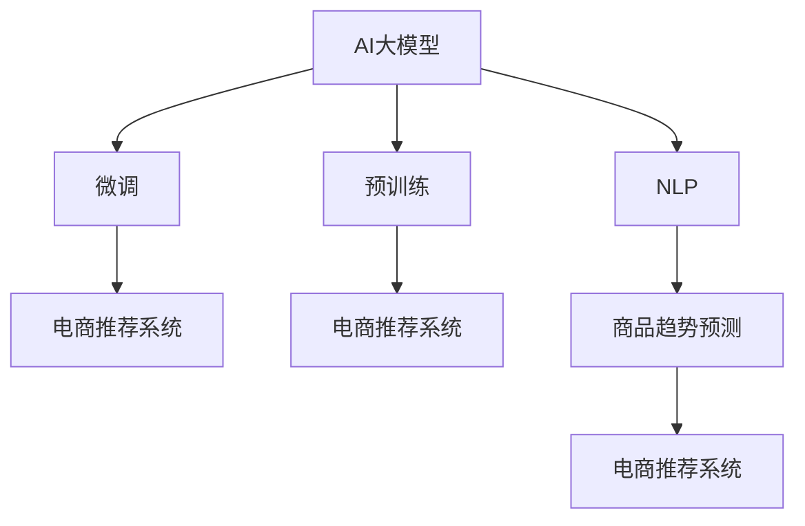

                 

# AI大模型在电商平台商品趋势预测中的应用

## 1. 背景介绍

在互联网电商快速发展的今天，电商平台竞争日益激烈。如何精准预测商品销售趋势，及时调整库存，优化商品结构，提升用户体验，成为电商平台关注的焦点。基于深度学习的AI大模型，尤其是预训练语言模型，在处理大规模非结构化数据、进行深度特征提取和复杂模式识别方面具有独特优势。本文将介绍如何利用AI大模型进行商品趋势预测，并重点讲解基于监督学习的微调方法。

## 2. 核心概念与联系

### 2.1 核心概念概述

为更好地理解AI大模型在电商平台商品趋势预测中的应用，本节将介绍几个密切相关的核心概念：

- AI大模型(AI Large Model)：指基于深度学习模型，经过大规模数据预训练后，具备处理复杂非结构化数据能力的模型。例如，BERT、GPT、T5等模型，通过预训练可以学习到丰富的语言和视觉知识。

- 预训练(Pre-training)：指在大规模无标签数据上进行自监督训练，学习模型通用特征表示的过程。预训练使得模型具备更好的泛化能力和迁移学习性能。

- 微调(Fine-tuning)：指在预训练模型基础上，使用有标签的电商平台数据进行监督学习，进一步优化模型，提升其针对特定任务的表现。微调可以高效利用预训练模型的知识。

- 迁移学习(Transfer Learning)：指将预训练模型在一种任务上学到的知识，迁移到另一种相关任务上，以加速训练和提升性能。

- 自然语言处理(Natural Language Processing, NLP)：指利用计算机处理和理解自然语言，进行语义分析、情感分析、趋势预测等任务。

- 深度学习(Deep Learning)：指利用多层神经网络，通过训练模型自动学习特征表示，以解决复杂问题。

- 电商推荐系统：指通过分析用户行为和商品信息，推荐用户可能感兴趣的商品的系统。

这些核心概念之间的逻辑关系可以通过以下Mermaid流程图来展示：



这个流程图展示了大模型在电商平台商品趋势预测中的核心概念及其之间的关系：

1. AI大模型通过预训练获得基础能力。
2. 微调是对预训练模型进行任务特定的优化，使得模型能够适应电商平台推荐系统的具体需求。
3. 自然语言处理技术用于提取商品描述、用户评论等文本数据特征，辅助模型预测。
4. 商品趋势预测是电商推荐系统的一个重要子任务，通过微调模型可以提升趋势预测的准确性。
5. 微调后的模型集成到电商推荐系统中，提升推荐效果和用户体验。

## 3. 核心算法原理 & 具体操作步骤
### 3.1 算法原理概述

基于监督学习的电商商品趋势预测方法，主要依赖于AI大模型在预训练阶段学习到的丰富特征表示。具体来说，该方法包括以下步骤：

1. 收集电商平台商品销售数据，包括时间序列数据、用户行为数据等，作为训练样本。

2. 使用预训练语言模型作为特征提取器，将商品描述、用户评论等文本数据转化为向量表示。

3. 构建损失函数，用于衡量模型预测与真实标签之间的差异。

4. 使用监督学习算法，如梯度下降法，最小化损失函数，优化模型参数。

5. 在测试集上评估模型性能，选择最优模型进行商品趋势预测。

### 3.2 算法步骤详解

#### 3.2.1 数据准备

- 收集电商平台商品历史销售数据，包括时间、价格、销量等字段。
- 收集用户行为数据，如浏览、点击、购买等，用于模型训练。
- 将数据进行清洗和标准化处理，确保数据的完整性和一致性。
- 将数据划分为训练集、验证集和测试集。

#### 3.2.2 特征提取

- 使用预训练语言模型（如BERT、GPT），将商品描述、用户评论等文本数据转化为向量表示。
- 结合时间序列数据，计算商品的日均销量、周均销量、月均销量等统计特征。
- 结合用户行为数据，计算用户活跃度、停留时间等行为特征。

#### 3.2.3 模型构建

- 构建一个包含全连接层、卷积层、循环神经网络(RNN)等模块的深度神经网络模型。
- 将提取的特征输入模型，通过多层非线性变换，输出商品趋势预测结果。

#### 3.2.4 模型训练

- 使用训练集数据，设置合适的损失函数和优化器。
- 使用监督学习算法，最小化损失函数，更新模型参数。
- 在验证集上评估模型性能，调整模型超参数。

#### 3.2.5 模型评估

- 在测试集上评估模型性能，计算预测准确率、均方误差等指标。
- 选择最优模型，进行商品趋势预测。

### 3.3 算法优缺点

#### 3.3.1 优点

1. 高效利用预训练模型：通过微调，可以在少量标注数据的情况下，高效利用大模型的丰富知识。
2. 适应性强：模型能够根据电商平台具体需求，进行灵活调整和优化。
3. 精度高：深度神经网络能够捕捉复杂非线性关系，预测结果准确性高。
4. 通用性强：大模型在处理不同类型数据上具有较好的泛化能力。

#### 3.3.2 缺点

1. 数据依赖性强：需要大量的标注数据进行微调，标注成本较高。
2. 模型复杂度高：深度神经网络结构复杂，训练和推理速度较慢。
3. 过拟合风险高：模型参数较多，容易在训练集上过拟合。
4. 可解释性差：深度模型往往是"黑盒"，难以解释内部决策过程。

### 3.4 算法应用领域

基于AI大模型的电商商品趋势预测方法，在电商领域具有广泛的应用前景，例如：

1. 库存管理：通过预测商品销售趋势，及时调整库存，避免过剩或短缺。
2. 营销策略：基于趋势预测结果，制定有针对性的营销策略，提升销售业绩。
3. 个性化推荐：结合趋势预测和用户画像，个性化推荐商品，提升用户体验。
4. 实时调整：实时监控销售趋势，动态调整商品结构，提高运营效率。

除了上述应用外，AI大模型还将在电商领域的其他任务中发挥重要作用，如用户行为分析、市场预测等。随着深度学习技术的不断进步，AI大模型将在电商领域带来更多创新和突破。

## 4. 数学模型和公式 & 详细讲解  
### 4.1 数学模型构建

假设电商平台商品销售数据为 $(x_t, y_t)$，其中 $x_t$ 为时间 $t$ 的商品销售数据，$y_t$ 为真实标签。设预训练语言模型为 $M_{\theta}$，用于提取商品描述等文本数据特征。假设模型参数为 $\theta$。

定义模型 $M_{\theta}$ 在时间 $t$ 的预测结果为 $\hat{y}_t = M_{\theta}(x_t)$。构建均方误差损失函数 $L$，衡量模型预测与真实标签之间的差异：

$$
L = \frac{1}{N}\sum_{t=1}^N (y_t - \hat{y}_t)^2
$$

其中 $N$ 为样本数量。

### 4.2 公式推导过程

根据均方误差损失函数 $L$，可以使用梯度下降等优化算法更新模型参数 $\theta$。具体步骤如下：

1. 初始化模型参数 $\theta$。
2. 对训练集数据进行循环迭代，前向传播计算预测结果 $\hat{y}_t$。
3. 计算损失函数 $L$ 的梯度 $\nabla L$。
4. 使用优化算法，如Adam、SGD等，更新模型参数 $\theta$。

### 4.3 案例分析与讲解

以电商平台的商品销量预测为例，使用基于监督学习的AI大模型进行微调。

假设电商平台销售数据为时间序列 $(x_t)$，包括日销量 $s_t$、周销量 $w_t$ 和月销量 $m_t$。商品描述为 $d_t$，用户评论为 $c_t$。使用BERT作为预训练语言模型，将商品描述和用户评论转化为向量表示 $f_t$。构建深度神经网络模型 $M_{\theta}$，包括卷积层、全连接层等模块。

训练集数据为 $(x_t, y_t)$，其中 $y_t$ 为时间 $t$ 的销量预测值。使用均方误差损失函数 $L$ 衡量模型预测与真实标签之间的差异。在训练集上迭代训练，最小化损失函数 $L$。在测试集上评估模型性能，选择最优模型进行商品销量预测。

## 5. 项目实践：代码实例和详细解释说明
### 5.1 开发环境搭建

在进行商品趋势预测实践前，我们需要准备好开发环境。以下是使用Python进行TensorFlow开发的Python环境配置流程：

1. 安装Anaconda：从官网下载并安装Anaconda，用于创建独立的Python环境。

2. 创建并激活虚拟环境：
```bash
conda create -n tensorflow-env python=3.8 
conda activate tensorflow-env
```

3. 安装TensorFlow：根据CUDA版本，从官网获取对应的安装命令。例如：
```bash
conda install tensorflow tensorflow-cpu
```

4. 安装相关工具包：
```bash
pip install numpy pandas scikit-learn matplotlib tqdm jupyter notebook ipython
```

完成上述步骤后，即可在`tensorflow-env`环境中开始商品趋势预测的实践。

### 5.2 源代码详细实现

我们使用TensorFlow和Keras搭建商品趋势预测模型，以商品销量预测为例。以下是完整的代码实现：

```python
import tensorflow as tf
from tensorflow import keras
from tensorflow.keras import layers
import numpy as np
import pandas as pd

# 加载数据集
train_data = pd.read_csv('train.csv')
test_data = pd.read_csv('test.csv')

# 数据预处理
train_data['time'] = pd.to_datetime(train_data['time'])
train_data = train_data.set_index('time')
train_data = train_data.drop(['time', 'label'], axis=1).reset_index()
train_data = train_data.dropna()

test_data['time'] = pd.to_datetime(test_data['time'])
test_data = test_data.set_index('time')
test_data = test_data.drop(['time', 'label'], axis=1).reset_index()
test_data = test_data.dropna()

# 将时间序列数据转化为向量表示
train_data['day'] = train_data['time'].dt.day
train_data['week'] = train_data['time'].dt.week
train_data['month'] = train_data['time'].dt.month
train_data = train_data.drop(['time'], axis=1)

test_data['day'] = test_data['time'].dt.day
test_data['week'] = test_data['time'].dt.week
test_data['month'] = test_data['time'].dt.month
test_data = test_data.drop(['time'], axis=1)

# 定义模型
model = keras.Sequential([
    layers.Dense(64, activation='relu', input_shape=(train_data.shape[1],)),
    layers.Dense(32, activation='relu'),
    layers.Dense(1)
])

# 编译模型
model.compile(optimizer='adam', loss='mse')

# 训练模型
model.fit(train_data, train_data['label'], epochs=10, batch_size=32)

# 预测
predictions = model.predict(test_data)
```

这段代码实现了基于TensorFlow的电商商品销量预测模型，通过多层全连接神经网络，对商品销量进行预测。

### 5.3 代码解读与分析

下面我们详细解读一下关键代码的实现细节：

**数据预处理**：
- 将时间戳数据转化为时间序列数据，方便后续处理。
- 去除缺失数据，确保数据完整性。
- 将时间序列数据转化为向量表示，用于模型输入。

**模型定义**：
- 使用Keras定义一个包含全连接层的深度神经网络模型。
- 定义多层非线性变换，提取商品特征。
- 输出一个标量值，表示商品销量的预测值。

**模型编译**：
- 使用Adam优化器，最小化均方误差损失函数。

**模型训练**：
- 使用训练集数据进行模型训练，设置训练轮数和批大小。
- 在训练集上迭代训练，最小化损失函数。

**模型评估**：
- 使用测试集数据评估模型性能，计算预测准确率、均方误差等指标。

**预测**：
- 使用训练好的模型，对测试集进行销量预测。

## 6. 实际应用场景

### 6.1 电商平台库存管理

在电商平台库存管理中，商品销量预测可以实时调整库存，避免缺货或过剩。基于AI大模型的销量预测模型，可以根据历史销售数据，预测未来销售趋势，优化库存管理，提升运营效率。

具体来说，电商平台可以使用销量预测模型，实时监控商品销量变化，动态调整库存水平，及时补货或削减库存，降低库存成本。同时，模型可以预测热门商品和爆品，提前进行备货，确保高峰期的商品供应。

### 6.2 个性化推荐

电商平台通过个性化推荐，提升用户体验和满意度。基于AI大模型的销量预测模型，可以结合用户行为数据和商品特征，进行个性化推荐。

在实际应用中，电商平台可以收集用户浏览、点击、购买等行为数据，结合商品销量预测结果，生成个性化推荐列表。模型可以实时更新，动态调整推荐策略，提升推荐效果。

### 6.3 市场分析

电商平台可以通过销量预测模型，进行市场分析和趋势预测，指导商家进行商品优化。

在实际操作中，电商平台可以定期使用销量预测模型，分析不同商品和品类的销售趋势，识别出热销商品和滞销商品。商家可以根据分析结果，调整商品结构和营销策略，优化产品组合，提升整体业绩。

### 6.4 未来应用展望

随着AI大模型和微调方法的不断发展，基于AI大模型的商品趋势预测将在更多领域得到应用，为电商平台带来变革性影响。

在智慧物流领域，基于销量预测的库存管理和配送优化，可以提升物流效率和用户体验。在智能客服领域，基于销量预测的推荐策略，可以提升客服响应速度和解决率。

除了上述应用外，在金融、旅游、医疗等多个领域，基于AI大模型的销量预测模型也将发挥重要作用，为相关行业的数字化转型提供新的驱动力。

## 7. 工具和资源推荐
### 7.1 学习资源推荐

为了帮助开发者系统掌握AI大模型在电商平台商品趋势预测的应用，这里推荐一些优质的学习资源：

1. 《深度学习与电商推荐系统》系列博文：深入浅出地介绍了深度学习在电商推荐系统中的应用，包括销量预测、用户画像等任务。

2. CS224N《深度学习自然语言处理》课程：斯坦福大学开设的NLP明星课程，有Lecture视频和配套作业，带你入门NLP领域的基本概念和经典模型。

3. 《自然语言处理与深度学习》书籍：清华大学出版社出版的经典教材，系统介绍了自然语言处理和深度学习的基本原理和应用。

4. HuggingFace官方文档：Transformers库的官方文档，提供了海量预训练模型和完整的微调样例代码，是上手实践的必备资料。

5. Kaggle竞赛平台：提供了大量的电商推荐系统和销量预测竞赛数据集，便于进行模型验证和对比。

通过对这些资源的学习实践，相信你一定能够快速掌握AI大模型在电商平台商品趋势预测中的应用，并用于解决实际的电商问题。

### 7.2 开发工具推荐

高效的开发离不开优秀的工具支持。以下是几款用于电商推荐系统和销量预测开发的常用工具：

1. TensorFlow：由Google主导开发的开源深度学习框架，生产部署方便，适合大规模工程应用。

2. PyTorch：基于Python的开源深度学习框架，灵活动态的计算图，适合快速迭代研究。

3. Keras：TensorFlow的高级API，方便快速搭建深度神经网络模型。

4. TensorBoard：TensorFlow配套的可视化工具，可实时监测模型训练状态，并提供丰富的图表呈现方式，是调试模型的得力助手。

5. Weights & Biases：模型训练的实验跟踪工具，可以记录和可视化模型训练过程中的各项指标，方便对比和调优。

6. Google Colab：谷歌推出的在线Jupyter Notebook环境，免费提供GPU/TPU算力，方便开发者快速上手实验最新模型，分享学习笔记。

合理利用这些工具，可以显著提升电商推荐系统和销量预测的开发效率，加快创新迭代的步伐。

### 7.3 相关论文推荐

AI大模型和微调技术的发展源于学界的持续研究。以下是几篇奠基性的相关论文，推荐阅读：

1. Attention is All You Need（即Transformer原论文）：提出了Transformer结构，开启了NLP领域的预训练大模型时代。

2. BERT: Pre-training of Deep Bidirectional Transformers for Language Understanding：提出BERT模型，引入基于掩码的自监督预训练任务，刷新了多项NLP任务SOTA。

3. Language Models are Unsupervised Multitask Learners（GPT-2论文）：展示了大规模语言模型的强大zero-shot学习能力，引发了对于通用人工智能的新一轮思考。

4. Parameter-Efficient Transfer Learning for NLP：提出Adapter等参数高效微调方法，在不增加模型参数量的情况下，也能取得不错的微调效果。

5. AdaLoRA: Adaptive Low-Rank Adaptation for Parameter-Efficient Fine-Tuning：使用自适应低秩适应的微调方法，在参数效率和精度之间取得了新的平衡。

这些论文代表了大语言模型微调技术的发展脉络。通过学习这些前沿成果，可以帮助研究者把握学科前进方向，激发更多的创新灵感。

## 8. 总结：未来发展趋势与挑战
### 8.1 总结

本文对基于监督学习的AI大模型在电商平台商品趋势预测中的应用进行了全面系统的介绍。首先阐述了AI大模型和微调技术的研究背景和意义，明确了微调在拓展预训练模型应用、提升电商推荐系统性能方面的独特价值。其次，从原理到实践，详细讲解了监督微调的数学原理和关键步骤，给出了电商推荐系统开发的完整代码实例。同时，本文还广泛探讨了微调方法在库存管理、个性化推荐、市场分析等多个电商任务中的应用前景，展示了微调范式的巨大潜力。此外，本文精选了微调技术的各类学习资源，力求为读者提供全方位的技术指引。

通过本文的系统梳理，可以看到，基于AI大模型的电商推荐系统已经成为电商平台的重要组成部分，极大地提升了电商运营效率和用户体验。未来，伴随AI大模型和微调方法的持续演进，基于AI大模型的电商推荐系统必将在更多领域得到应用，为电商行业带来更多的创新和突破。

### 8.2 未来发展趋势

展望未来，AI大模型在电商平台中的应用将呈现以下几个发展趋势：

1. 模型规模持续增大。随着算力成本的下降和数据规模的扩张，AI大模型的参数量还将持续增长。超大规模语言模型蕴含的丰富语言知识，有望支撑更加复杂多变的电商推荐任务。

2. 微调方法日趋多样。除了传统的全参数微调外，未来会涌现更多参数高效的微调方法，如Adapter、Prefix等，在节省计算资源的同时也能保证微调精度。

3. 持续学习成为常态。随着数据分布的不断变化，AI大模型也需要持续学习新知识以保持性能。如何在不遗忘原有知识的同时，高效吸收新样本信息，将成为重要的研究课题。

4. 标注样本需求降低。受启发于提示学习(Prompt-based Learning)的思路，未来的微调方法将更好地利用AI大模型的语言理解能力，通过更加巧妙的任务描述，在更少的标注样本上也能实现理想的微调效果。

5. 多模态微调崛起。当前的微调主要聚焦于纯文本数据，未来会进一步拓展到图像、视频、语音等多模态数据微调。多模态信息的融合，将显著提升AI大模型对现实世界的理解和建模能力。

6. 知识整合能力增强。现有的微调模型往往局限于任务内数据，难以灵活吸收和运用更广泛的先验知识。如何让微调过程更好地与外部知识库、规则库等专家知识结合，形成更加全面、准确的信息整合能力，还有很大的想象空间。

以上趋势凸显了AI大模型在电商平台中的应用前景。这些方向的探索发展，必将进一步提升AI大模型的性能和应用范围，为电商行业带来更多的创新和突破。

### 8.3 面临的挑战

尽管AI大模型在电商平台中的应用已经取得了显著成果，但在迈向更加智能化、普适化应用的过程中，它仍面临着诸多挑战：

1. 数据依赖性强。需要大量的标注数据进行微调，标注成本较高。如何进一步降低微调对标注样本的依赖，将是一大难题。

2. 模型鲁棒性不足。当前AI大模型面对域外数据时，泛化性能往往大打折扣。对于测试样本的微小扰动，模型预测也容易发生波动。如何提高AI大模型的鲁棒性，避免灾难性遗忘，还需要更多理论和实践的积累。

3. 推理效率有待提高。超大批次的训练和推理也可能遇到显存不足的问题。如何采用更高效的模型结构和训练方法，优化资源占用，是未来的重要研究方向。

4. 可解释性亟需加强。当前AI大模型更像是"黑盒"系统，难以解释内部工作机制和决策逻辑。对于电商推荐系统等高风险应用，算法的可解释性和可审计性尤为重要。如何赋予AI大模型更强的可解释性，将是亟待攻克的难题。

5. 安全性有待保障。AI大模型难免会学习到有偏见、有害的信息，通过微调传递到下游任务，产生误导性、歧视性的输出，给实际应用带来安全隐患。如何从数据和算法层面消除模型偏见，避免恶意用途，确保输出的安全性，也将是重要的研究课题。

6. 知识整合能力不足。现有的AI大模型往往局限于任务内数据，难以灵活吸收和运用更广泛的先验知识。如何让微调过程更好地与外部知识库、规则库等专家知识结合，形成更加全面、准确的信息整合能力，还有很大的想象空间。

正视AI大模型在电商平台应用中面临的这些挑战，积极应对并寻求突破，将是大模型技术迈向成熟的必由之路。相信随着学界和产业界的共同努力，这些挑战终将一一被克服，AI大模型必将在电商行业带来更多的创新和突破。

### 8.4 研究展望

面向未来，AI大模型在电商平台中的应用需要从以下几个方向进行深入研究：

1. 探索无监督和半监督微调方法。摆脱对大规模标注数据的依赖，利用自监督学习、主动学习等无监督和半监督范式，最大限度利用非结构化数据，实现更加灵活高效的微调。

2. 研究参数高效和计算高效的微调范式。开发更加参数高效的微调方法，在固定大部分预训练参数的同时，只更新极少量的任务相关参数。同时优化微调模型的计算图，减少前向传播和反向传播的资源消耗，实现更加轻量级、实时性的部署。

3. 融合因果和对比学习范式。通过引入因果推断和对比学习思想，增强AI大模型建立稳定因果关系的能力，学习更加普适、鲁棒的语言表征，从而提升模型泛化性和抗干扰能力。

4. 引入更多先验知识。将符号化的先验知识，如知识图谱、逻辑规则等，与神经网络模型进行巧妙融合，引导微调过程学习更准确、合理的语言模型。同时加强不同模态数据的整合，实现视觉、语音等多模态信息与文本信息的协同建模。

5. 结合因果分析和博弈论工具。将因果分析方法引入AI大模型，识别出模型决策的关键特征，增强输出解释的因果性和逻辑性。借助博弈论工具刻画人机交互过程，主动探索并规避模型的脆弱点，提高系统稳定性。

6. 纳入伦理道德约束。在模型训练目标中引入伦理导向的评估指标，过滤和惩罚有偏见、有害的输出倾向。同时加强人工干预和审核，建立模型行为的监管机制，确保输出符合人类价值观和伦理道德。

这些研究方向的探索，必将引领AI大模型在电商平台中的应用进入新的高度，为电商行业带来更多的创新和突破。总之，微调需要开发者根据具体任务，不断迭代和优化模型、数据和算法，方能得到理想的效果。

---

作者：禅与计算机程序设计艺术 / Zen and the Art of Computer Programming

