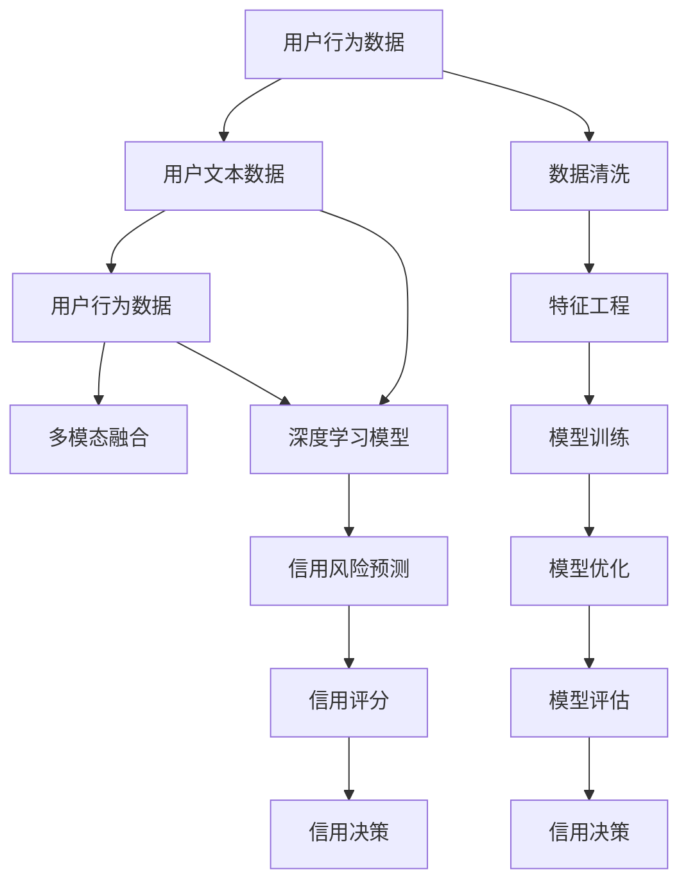

                 

# AI大模型在电商平台用户信用评估中的作用

> 关键词：AI大模型, 用户信用评估, 电商平台, 深度学习, 机器学习, 模型优化, 信用评分, 决策树, 多模态融合, 信用风险管理

## 1. 背景介绍

随着互联网经济的蓬勃发展，电商平台已成为人们日常生活中不可或缺的一部分。用户在电商平台上的行为数据庞杂多样，从浏览记录、购买历史、评价反馈到社交互动，这些数据对于理解用户的行为习惯和信用风险具有重要的参考价值。利用人工智能技术，特别是大模型技术，可以对这些海量数据进行深度分析，实现对用户信用评估的自动化、精确化和动态化管理。

传统的用户信用评估方法依赖于固定的规则和特征工程，存在计算量大、灵活性差、容易过时等问题。相比之下，基于深度学习的大模型在处理非结构化数据、进行特征学习和关联分析方面具有明显优势，能够为电商平台的用户信用评估提供更为科学和精准的支持。

## 2. 核心概念与联系

### 2.1 核心概念概述

在用户信用评估中，大模型主要用于以下关键任务：

- **用户行为分析**：通过分析用户的历史行为数据，理解用户的偏好、兴趣和支付能力。
- **信用风险预测**：基于用户的行为数据，预测用户未来可能发生的违约风险。
- **多模态融合**：综合利用用户文本数据、行为数据、社交数据等多种信息源，提高信用评估的准确性和全面性。
- **模型优化与评估**：使用大模型对评估模型进行持续优化，以适应用户行为变化和新场景的挑战。

### 2.2 核心概念原理和架构的 Mermaid 流程图



该图展示了从用户行为数据到信用决策的全流程：

- 用户行为数据经过数据清洗和特征工程后，输入到深度学习模型中进行训练和优化。
- 多模态融合模块将文本数据、行为数据等多种信息源进行联合分析，提高预测精度。
- 深度学习模型进行信用风险预测，生成信用评分。
- 最终，根据信用评分进行信用决策。

## 3. 核心算法原理 & 具体操作步骤

### 3.1 算法原理概述

基于深度学习的大模型在用户信用评估中主要采用监督学习的方法。其核心思想是通过分析用户的历史数据，训练一个预测模型，用以评估用户的未来行为和信用风险。具体的流程包括数据准备、模型训练、多模态融合、信用评分生成和信用决策制定。

### 3.2 算法步骤详解

#### 3.2.1 数据准备

- **数据收集**：从电商平台收集用户的历史浏览记录、购买历史、评价反馈、社交互动等数据。
- **数据清洗**：去除缺失值、异常值和噪声，确保数据质量。
- **特征工程**：提取和构造有意义的特征，如用户行为频次、购买金额、评价情感等。

#### 3.2.2 模型训练

- **模型选择**：选择合适的深度学习模型，如卷积神经网络(CNN)、循环神经网络(RNN)、Transformer等。
- **数据划分**：将数据集分为训练集、验证集和测试集。
- **模型训练**：使用训练集训练模型，通过反向传播更新模型参数。
- **模型优化**：应用正则化、Dropout、早停等技术，避免过拟合。

#### 3.2.3 多模态融合

- **数据整合**：将用户文本数据、行为数据、社交数据等进行整合。
- **特征提取**：分别对不同模态的数据进行特征提取，如使用BERT对文本数据进行编码。
- **联合分析**：使用深度学习方法，如注意力机制、融合网络等，将不同模态的数据进行联合分析。

#### 3.2.4 信用评分生成

- **模型预测**：使用训练好的深度学习模型对新用户数据进行预测，生成信用评分。
- **评分映射**：将预测结果映射到信用评分区间，如AAA到D等级别。

#### 3.2.5 信用决策制定

- **决策规则**：根据设定的信用评分阈值，制定用户的信用决策，如是否授信、授信额度等。
- **决策优化**：定期对模型进行评估和优化，适应用户行为的变化和新场景。

### 3.3 算法优缺点

#### 3.3.1 优点

- **自动化程度高**：大模型能够自动处理大量非结构化数据，减少了人工干预的复杂度。
- **预测精度高**：深度学习模型能够从数据中自动提取高阶特征，提高了预测的准确性。
- **适应性强**：模型能够动态更新，适应用户行为的变化和新场景的挑战。

#### 3.3.2 缺点

- **数据依赖性强**：模型效果依赖于高质量的数据，数据获取和清洗成本高。
- **计算资源需求大**：大模型训练和推理需要大量的计算资源和存储空间。
- **可解释性差**：深度学习模型的黑盒特性，使得其决策过程难以解释和调试。

### 3.4 算法应用领域

大模型在电商平台用户信用评估中的应用领域广泛，包括但不限于：

- **贷款审批**：对申请贷款的用户进行信用评分，辅助贷款审批。
- **信用卡授信**：评估新申请信用卡用户的信用风险，决定是否授信和授信额度。
- **会员资格**：根据用户的信用评分，决定是否给予会员资格和享受的优惠等级。
- **交易风控**：实时监控交易行为，识别和防范潜在欺诈和风险。

## 4. 数学模型和公式 & 详细讲解 & 举例说明

### 4.1 数学模型构建

用户信用评估的数学模型通常包括特征工程、模型训练、多模态融合和信用评分生成等步骤。

#### 4.1.1 特征工程

设用户的行为数据为 $\mathbf{x} = (x_1, x_2, ..., x_n)$，其中 $x_i$ 表示第 $i$ 个行为特征。将用户的行为数据转换为数值型特征，例如使用one-hot编码或离散化处理。

#### 4.1.2 模型训练

选择深度学习模型 $M$ 进行训练，训练集为 $\mathcal{D}=\{(\mathbf{x}_i, y_i)\}_{i=1}^N$，其中 $y_i$ 为用户的信用评分。模型训练的目标是最小化损失函数 $L$：

$$
L = \frac{1}{N}\sum_{i=1}^N (y_i - M(\mathbf{x}_i))^2
$$

使用梯度下降等优化算法，更新模型参数 $\theta$：

$$
\theta \leftarrow \theta - \eta \nabla_{\theta}L
$$

其中 $\eta$ 为学习率。

#### 4.1.3 多模态融合

设用户文本数据为 $\mathbf{t}$，行为数据为 $\mathbf{b}$，社交数据为 $\mathbf{s}$。使用BERT等预训练语言模型对文本数据进行编码，得到文本特征 $f_t = BERT(\mathbf{t})$。将行为数据和社交数据分别转换为数值型特征 $f_b$ 和 $f_s$。通过注意力机制将不同模态的数据进行融合，得到融合特征 $f_{joint}$：

$$
f_{joint} = \alpha f_t + \beta f_b + \gamma f_s
$$

其中 $\alpha, \beta, \gamma$ 为注意力权重，可以使用softmax函数计算。

#### 4.1.4 信用评分生成

使用融合特征 $f_{joint}$ 输入到深度学习模型 $M$，生成信用评分 $y$：

$$
y = M(f_{joint})
$$

### 4.2 公式推导过程

以信用风险预测为例，展示信用评分的生成过程。

设用户行为数据为 $\mathbf{x} = (x_1, x_2, ..., x_n)$，使用深度学习模型 $M$ 进行训练，得到模型参数 $\theta$。模型的输出为信用评分 $y$：

$$
y = M(\mathbf{x}; \theta)
$$

对于新的用户行为数据 $\mathbf{x_{new}}$，使用训练好的模型进行预测：

$$
\hat{y} = M(\mathbf{x_{new}}; \theta)
$$

将预测结果映射到信用评分区间，如AAA到D等级别。

### 4.3 案例分析与讲解

以电商平台用户信用评估为例，分析大模型在该场景中的应用。

**案例背景**：
假设某电商平台有20万注册用户，每用户有50个行为记录，每个记录包含浏览、点击、购买、评价等行为。利用深度学习模型对用户进行信用评分，辅助审批、授信、风控等决策。

**数据准备**：
收集用户的浏览记录、购买记录、评价记录等数据，进行数据清洗和特征提取。例如，将浏览记录转换为向量表示，计算每个用户的平均购买金额、平均评价情感等特征。

**模型训练**：
使用深度学习模型，如Transformer或BERT，对特征进行训练。使用交叉熵损失函数进行模型训练，设置合适的学习率、批大小、迭代轮数等超参数。

**多模态融合**：
将文本数据、行为数据进行融合，使用BERT对文本数据进行编码，然后与其他模态数据结合，通过注意力机制进行融合。

**信用评分生成**：
将融合特征输入到深度学习模型，生成信用评分。使用softmax函数将评分映射到AAA到D等级别。

**信用决策制定**：
根据信用评分阈值，制定用户的信用决策。例如，评分高于90分的用户给予授信，评分低于70分的用户不予授信。

## 5. 项目实践：代码实例和详细解释说明

### 5.1 开发环境搭建

**环境准备**：

- 安装Python 3.8及以上版本。
- 安装PyTorch、TensorFlow、scikit-learn等深度学习库。
- 安装BERT、Transformer等预训练语言模型。

**环境配置**：

```bash
conda create -n ecommerce python=3.8
conda activate ecommerce
pip install torch torchvision torchaudio transformers sklearn
```

### 5.2 源代码详细实现

以下是一个使用BERT模型进行用户信用评估的Python代码示例：

```python
import torch
import torch.nn as nn
import torch.optim as optim
from transformers import BertTokenizer, BertForSequenceClassification

class CreditScoringModel(nn.Module):
    def __init__(self, num_labels):
        super(CreditScoringModel, self).__init__()
        self.bert = BertForSequenceClassification.from_pretrained('bert-base-uncased', num_labels=num_labels)
        
    def forward(self, input_ids, attention_mask, labels=None):
        outputs = self.bert(input_ids, attention_mask=attention_mask)
        pooled_output = outputs.pooler_output
        logits = torch.nn.functional.linear(pooled_output, num_labels)
        if labels is not None:
            loss_fct = nn.CrossEntropyLoss()
            loss = loss_fct(logits, labels)
            return loss
        return logits

# 数据准备
train_data = ... # 训练数据集
test_data = ... # 测试数据集

# 模型训练
model = CreditScoringModel(num_labels=4)
optimizer = optim.Adam(model.parameters(), lr=0.001)
tokenizer = BertTokenizer.from_pretrained('bert-base-uncased')
training_steps = len(train_data) // batch_size
for step in range(training_steps):
    input_ids = ...
    attention_mask = ...
    labels = ...
    loss = model(input_ids, attention_mask, labels).mean()
    loss.backward()
    optimizer.step()
    optimizer.zero_grad()

# 模型评估
eval_data = ... # 评估数据集
model.eval()
with torch.no_grad():
    input_ids = ...
    attention_mask = ...
    logits = model(input_ids, attention_mask)
    labels = ...
    loss = nn.CrossEntropyLoss()(logits, labels)
    print(loss)
```

### 5.3 代码解读与分析

**CreditScoringModel类**：
- `__init__`方法：初始化模型，加载BERT模型和优化器。
- `forward`方法：定义模型前向传播过程，输入为输入序列、注意力掩码和标签。

**数据准备**：
- 数据集包含训练集、验证集和测试集。每个样本包含用户的行为数据和文本数据。
- 使用BERT分词器对文本数据进行编码，转换为输入序列和注意力掩码。

**模型训练**：
- 使用Adam优化器训练模型，每个批次包含输入序列、注意力掩码和标签。
- 计算损失函数，并根据梯度更新模型参数。

**模型评估**：
- 使用评估数据集对模型进行测试，计算损失函数。
- 使用softmax函数将输出映射到信用评分区间。

### 5.4 运行结果展示

运行代码后，可以得到训练过程中的损失曲线和模型在测试集上的表现。例如，可以使用TensorBoard记录训练过程，可视化损失曲线和精度曲线：

```bash
tensorboard --logdir=logs
```

## 6. 实际应用场景

### 6.1 电商贷款审批

电商平台可以基于用户信用评分进行贷款审批，提高审批效率和风险控制。对于信用评分较高的用户，平台可以给予更宽松的贷款条件，如更长的还款期限、更低的利率等。

### 6.2 信用卡授信

在用户申请信用卡时，电商平台可以基于其信用评分决定是否授信和授信额度。信用评分较高的用户可以享受更优惠的信用卡产品，如更高的信用额度、更低的年费等。

### 6.3 会员资格

电商平台可以根据用户信用评分决定是否给予会员资格以及会员等级。信用评分较高的用户可以享受更多特权，如积分翻倍、免费试用等。

### 6.4 交易风控

电商平台可以实时监控用户交易行为，识别异常交易行为和潜在欺诈行为。对于高风险交易，可以触发预警机制，进行进一步核实和处理。

### 6.5 信用评分动态调整

电商平台可以根据用户行为数据和市场变化，动态调整信用评分阈值，适应用户行为的变化和新场景的挑战。

## 7. 工具和资源推荐

### 7.1 学习资源推荐

- **《深度学习与自然语言处理》**：清华大学出版社，提供深度学习和大模型的基础知识和实践技巧。
- **Coursera深度学习课程**：由斯坦福大学等知名学府提供的深度学习课程，涵盖深度学习、自然语言处理等多个领域。
- **Kaggle竞赛**：参加Kaggle的信用评分竞赛，通过实际比赛项目积累经验。

### 7.2 开发工具推荐

- **PyTorch**：灵活易用的深度学习框架，支持GPU加速和分布式训练。
- **TensorFlow**：广泛应用的深度学习框架，支持多种硬件和分布式训练。
- **BERT**：由Google开发的预训练语言模型，广泛应用于NLP任务中。
- **TensorBoard**：可视化工具，帮助监控模型训练和推理过程。

### 7.3 相关论文推荐

- **《Attention is All You Need》**：Google论文，介绍Transformer结构，开创深度学习新纪元。
- **《BERT: Pre-training of Deep Bidirectional Transformers for Language Understanding》**：Google论文，提出BERT模型，开创预训练语言模型新纪元。
- **《Credit Scoring with Deep Learning Models》**：使用深度学习模型进行信用评分的研究论文，提供详细的模型构建和优化方法。

## 8. 总结：未来发展趋势与挑战

### 8.1 研究成果总结

基于大模型的用户信用评估技术，已经在电商平台得到广泛应用，并在多个实际场景中取得了显著成效。该技术通过深度学习模型，自动提取高阶特征，融合多模态信息，生成精准的信用评分，辅助电商平台进行用户审批、授信、风控等决策。未来，随着大模型技术的不断发展，用户信用评估技术将更加智能化、自动化和精确化。

### 8.2 未来发展趋势

- **多模态融合**：未来将更多地融合用户文本数据、行为数据、社交数据等，提高信用评分的准确性和全面性。
- **跨平台协同**：不同电商平台之间的用户数据将进行整合，实现跨平台的信用评估和共享。
- **实时动态更新**：随着用户行为数据的不断积累，信用评分将进行实时动态更新，以适应用户行为变化和新场景的挑战。

### 8.3 面临的挑战

- **数据隐私和安全**：用户行为数据涉及隐私，需要严格的保护措施。
- **模型鲁棒性**：模型需要具备良好的鲁棒性，能够适应不同类型的数据和场景。
- **计算资源需求**：大模型训练和推理需要大量计算资源，如何降低资源消耗是一个重要挑战。
- **模型可解释性**：深度学习模型的黑盒特性，使得其决策过程难以解释和调试。

### 8.4 研究展望

- **可解释性增强**：开发可解释性更高的深度学习模型，提高决策过程的透明度和可信度。
- **多模态融合优化**：探索更好的多模态融合方法，提高融合特征的质量和稳定性。
- **实时信用评分**：实现实时动态更新信用评分，提高信用评估的及时性和精准性。
- **跨平台协同**：探索跨平台的信用评估和共享机制，实现更全面的用户画像和信用管理。

## 9. 附录：常见问题与解答

**Q1: 电商平台如何获取高质量的信用数据？**

A: 电商平台可以通过与银行、征信机构合作，获取用户的金融数据和信用记录。同时，电商平台自身的数据也可以作为补充，如订单信息、浏览记录等。需要注意的是，数据隐私和安全是首要考虑因素，平台需采取严格的保护措施。

**Q2: 如何保证用户信用评分的准确性和公平性？**

A: 平台需要定期对模型进行评估和优化，确保模型的准确性和公平性。同时，引入人工审核机制，对模型输出进行人工校验和调整。

**Q3: 电商平台应该如何进行风险管理？**

A: 电商平台可以根据信用评分设定不同等级的授信门槛，对高风险用户进行特殊监控和预警。同时，结合多模态数据和实时监控，及时识别和防范欺诈行为和信用风险。

**Q4: 大模型在用户信用评估中的局限性有哪些？**

A: 大模型需要大量的计算资源和存储空间，训练和推理效率较低。此外，模型的黑盒特性使得其决策过程难以解释和调试，存在一定的局限性。

总之，大模型在电商平台用户信用评估中的应用前景广阔，但同时也面临着数据隐私、模型鲁棒性、计算资源和可解释性等多方面的挑战。未来，需要通过技术创新和实践积累，不断优化大模型，提升信用评估的准确性和可解释性，为电商平台提供更加智能化、高效化和安全化的信用管理服务。

