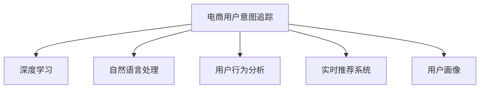

                 

# AI大模型在电商平台用户意图实时追踪中的应用

> 关键词：电商用户意图追踪, 深度学习, 自然语言处理, 用户行为分析, 实时推荐, 用户画像

## 1. 背景介绍

在当今互联网电商的迅猛发展中，如何理解并追踪用户意图，已成为电商平台提升用户体验和转化率的关键。传统的电商推荐系统依赖于用户历史行为数据，缺乏对用户即时意愿的捕获能力。而基于AI大模型的电商用户意图实时追踪系统，能够捕捉用户当前的关注点和需求，提供更加个性化和精准的推荐，大幅提升电商平台的竞争力和盈利能力。

### 1.1 问题由来
电商平台希望通过理解用户当前浏览和搜索行为，预测用户可能的购买意图，从而及时推送相关商品。传统的推荐系统多依赖用户历史行为数据，但缺乏对用户即时意愿的捕获能力。而基于AI大模型的电商用户意图追踪系统，能够捕捉用户当前的关注点和需求，从而提供更加个性化和精准的推荐，提升用户体验和转化率。

### 1.2 问题核心关键点
为了实现实时追踪用户意图，需要解决如下核心问题：
- 如何设计有效的模型，捕捉用户即时意愿。
- 如何在高并发环境下高效地处理用户数据。
- 如何利用实时反馈更新模型，提升预测精度。
- 如何将用户画像与实时追踪结合，增强推荐效果。

### 1.3 问题研究意义
电商用户意图实时追踪技术的研究具有重要意义，具体如下：
- 提升用户体验：实时追踪用户行为，及时推送个性化推荐，满足用户即时需求。
- 优化运营策略：通过精准分析用户意图，优化库存管理、营销活动，提升运营效率。
- 增强竞争优势：个性化推荐能够显著提高用户满意度和转化率，促进平台销售增长。
- 推动技术进步：实时追踪技术将促进自然语言处理、深度学习等AI技术的发展，具有广泛的应用前景。

## 2. 核心概念与联系

### 2.1 核心概念概述

为更好地理解电商用户意图实时追踪系统，本节将介绍几个关键概念：

- **电商用户意图追踪**：指通过分析用户浏览、搜索、点击等行为，预测用户可能购买的商品类别或具体商品。
- **深度学习**：一种基于神经网络的机器学习方法，通过多层次的非线性处理，实现复杂模式的学习和预测。
- **自然语言处理(NLP)**：涉及计算机对人类语言的处理和理解，包括语言模型、文本分类、序列生成等技术。
- **用户行为分析**：通过数据挖掘和统计分析，发现用户行为背后的规律和模式，以指导产品设计和服务优化。
- **实时推荐系统**：指能够实时捕捉用户当前行为，迅速生成推荐结果的系统。
- **用户画像**：通过大数据分析，构建用户综合特征的抽象模型，用于个性化推荐和用户细分。

这些核心概念之间的逻辑关系可以通过以下Mermaid流程图来展示：



这个流程图展示了大模型追踪用户意图的核心概念及其之间的关系：

1. 电商用户意图追踪系统，以深度学习为核心技术，结合自然语言处理和用户行为分析，能够实时捕捉用户行为。
2. 利用实时推荐系统，根据用户画像，生成个性化推荐。
3. 通过用户画像，可以进一步细化推荐结果，提升用户体验。

## 3. 核心算法原理 & 具体操作步骤
### 3.1 算法原理概述

电商用户意图实时追踪系统通过深度学习模型，捕捉用户行为数据中的隐含意图。其核心思想是：将用户的历史行为数据作为训练集，利用预训练语言模型，提取用户浏览、搜索等行为的特征表示，并通过分类器预测用户可能购买的商品。

具体而言，系统通过以下步骤实现：
1. **数据预处理**：收集用户浏览记录、搜索关键词、商品评分等数据，并进行清洗和标准化。
2. **特征提取**：使用预训练语言模型，如BERT、GPT等，将用户行为数据转化为高维向量表示。
3. **模型训练**：设计分类器，如二分类、多分类等，利用标注数据训练模型，学习用户购买意向的预测能力。
4. **实时追踪**：对用户新行为进行实时输入，通过在线预测，更新用户画像，生成个性化推荐。
5. **反馈循环**：将用户购买结果作为反馈，重新训练模型，提升预测精度。

### 3.2 算法步骤详解

电商用户意图实时追踪系统的实现涉及多个关键步骤，以下详细介绍：

**Step 1: 数据预处理**

- 数据收集：收集用户历史浏览、搜索、点击、评分等行为数据。
- 数据清洗：处理缺失值、异常值，进行数据归一化等处理。
- 数据标注：对用户行为进行标注，如点击是否转化为购买。
- 数据划分：将数据划分为训练集、验证集和测试集。

**Step 2: 特征提取**

- 预训练模型选择：选择合适的预训练语言模型，如BERT、GPT等。
- 特征向量生成：使用预训练模型，将用户行为数据转化为向量表示。
- 特征选择：根据任务需求，选择相关的特征向量，如词频、TF-IDF、上下文嵌入等。
- 特征转换：对特征向量进行归一化、降维等处理，提高模型训练效率。

**Step 3: 模型训练**

- 模型选择：根据任务需求，选择合适的模型结构，如线性回归、二分类、多分类等。
- 损失函数设计：定义损失函数，衡量模型预测结果与真实标签之间的差异。
- 超参数设置：确定学习率、批大小、迭代轮数等超参数。
- 模型训练：使用训练集数据，利用优化算法（如SGD、Adam等）训练模型。
- 模型验证：在验证集上评估模型性能，调整超参数。

**Step 4: 实时追踪**

- 实时输入：收集用户新行为数据，作为模型的实时输入。
- 在线预测：通过在线预测，生成用户可能购买的商品列表。
- 用户画像更新：根据预测结果，更新用户画像，记录用户行为模式。
- 个性化推荐：利用用户画像，生成个性化推荐。

**Step 5: 反馈循环**

- 反馈收集：记录用户实际购买结果，作为反馈数据。
- 模型重新训练：利用反馈数据，重新训练模型，提升预测精度。
- 模型评估：在测试集上评估模型性能，确保模型稳定性和鲁棒性。

### 3.3 算法优缺点

电商用户意图实时追踪系统具有以下优点：
1. 预测精准度高：利用深度学习模型捕捉用户行为中的隐含意图，预测结果更精准。
2. 实时性高：通过在线预测，能够即时生成推荐结果。
3. 用户画像细化：结合实时追踪和历史数据，生成更加完整的用户画像。
4. 可扩展性强：易于集成到电商平台的推荐系统中，快速部署。

同时，该系统也存在以下局限性：
1. 数据隐私问题：涉及用户隐私数据，需遵守相关法律法规。
2. 标注成本高：需大量标注数据，成本较高。
3. 模型复杂度高：深度学习模型计算量较大，资源消耗高。
4. 泛化能力不足：模型依赖于特定电商平台的商品和用户行为，泛化能力有限。

尽管存在这些局限性，但就目前而言，电商用户意图实时追踪系统仍是大模型在电商领域的主要应用范式。未来相关研究的重点在于如何进一步降低数据标注成本，提高模型泛化能力，同时兼顾用户隐私保护和资源消耗等因素。

### 3.4 算法应用领域

电商用户意图实时追踪系统已经在电商推荐、个性化服务、用户分析等多个领域得到广泛应用，具体如下：

- **电商推荐系统**：根据用户浏览和搜索行为，实时生成个性化商品推荐。
- **个性化服务**：结合用户画像和实时追踪，提供定制化的营销活动和服务。
- **用户分析**：分析用户行为模式和购买意向，指导产品设计和服务优化。

此外，电商用户意图实时追踪技术还可应用于社交电商、视频电商等多个新兴领域，推动电商技术不断创新和进步。

## 4. 数学模型和公式 & 详细讲解 & 举例说明

### 4.1 数学模型构建

假设电商平台的商品集为 $\mathcal{I}$，用户行为数据为 $D=\{(x_i,y_i)\}_{i=1}^N$，其中 $x_i$ 表示用户行为数据，$y_i \in \{0,1\}$ 表示用户是否购买了对应的商品。

我们定义模型 $M_{\theta}$ 在输入 $x_i$ 上的预测结果为 $\hat{y}=M_{\theta}(x_i)$，其中 $\theta$ 为模型参数。模型 $M_{\theta}$ 的损失函数为 $\mathcal{L}(\theta)=\frac{1}{N}\sum_{i=1}^N\ell(\hat{y},y_i)$，其中 $\ell(\hat{y},y_i)$ 为损失函数，通常选择交叉熵损失。

### 4.2 公式推导过程

假设我们使用BERT模型作为预训练语言模型，其特征提取过程可表示为 $x_i = \mathbf{E}(x_i)$，其中 $\mathbf{E}$ 表示BERT的特征提取模块。将特征向量 $x_i$ 输入模型 $M_{\theta}$，得到预测结果 $\hat{y}=M_{\theta}(x_i)$。

交叉熵损失函数为：

$$
\ell(\hat{y},y_i)=-[y_i\log \hat{y}_i+(1-y_i)\log(1-\hat{y}_i)]
$$

总损失函数为：

$$
\mathcal{L}(\theta)=\frac{1}{N}\sum_{i=1}^N\ell(\hat{y}_i,y_i)
$$

模型的预测结果 $\hat{y}_i$ 可通过softmax函数计算：

$$
\hat{y}_i=\text{softmax}(Wx_i+b)
$$

其中 $W$ 和 $b$ 为可训练参数。模型的优化目标为最小化损失函数：

$$
\theta^*=\arg\min_{\theta}\mathcal{L}(\theta)
$$

### 4.3 案例分析与讲解

以用户搜索“新款运动鞋”的意图预测为例，系统通过收集用户搜索记录和历史购买数据，训练BERT模型。在用户输入“新款运动鞋”时，系统使用BERT提取特征向量，并输入模型进行在线预测。假设模型预测结果为 $\hat{y}=\{0.1,0.3,0.5,0.1\}$，表示商品1、商品2、商品3和商品4的概率分别为10%、30%、50%和10%。用户最终购买了商品3，系统将此结果作为反馈，重新训练模型，提升预测精度。

## 5. 项目实践：代码实例和详细解释说明

### 5.1 开发环境搭建

在进行电商用户意图实时追踪系统的开发前，需要准备好开发环境。以下是使用Python进行PyTorch开发的环境配置流程：

1. 安装Anaconda：从官网下载并安装Anaconda，用于创建独立的Python环境。

2. 创建并激活虚拟环境：
```bash
conda create -n ecomm_env python=3.8 
conda activate ecomm_env
```

3. 安装PyTorch：根据CUDA版本，从官网获取对应的安装命令。例如：
```bash
conda install pytorch torchvision torchaudio cudatoolkit=11.1 -c pytorch -c conda-forge
```

4. 安装HuggingFace Transformers库：
```bash
pip install transformers
```

5. 安装各类工具包：
```bash
pip install numpy pandas scikit-learn matplotlib tqdm jupyter notebook ipython
```

完成上述步骤后，即可在`ecomm_env`环境中开始系统开发。

### 5.2 源代码详细实现

下面我们以用户意图追踪系统为例，给出使用Transformers库进行系统开发的PyTorch代码实现。

首先，定义数据处理函数：

```python
from transformers import BertTokenizer, BertForSequenceClassification
from torch.utils.data import Dataset, DataLoader
import torch

class EcommDataset(Dataset):
    def __init__(self, texts, labels, tokenizer, max_len=128):
        self.texts = texts
        self.labels = labels
        self.tokenizer = tokenizer
        self.max_len = max_len
        
    def __len__(self):
        return len(self.texts)
    
    def __getitem__(self, item):
        text = self.texts[item]
        label = self.labels[item]
        
        encoding = self.tokenizer(text, return_tensors='pt', max_length=self.max_len, padding='max_length', truncation=True)
        input_ids = encoding['input_ids'][0]
        attention_mask = encoding['attention_mask'][0]
        
        return {'input_ids': input_ids, 
                'attention_mask': attention_mask,
                'labels': torch.tensor(label, dtype=torch.long)}
```

然后，定义模型和优化器：

```python
from transformers import BertForSequenceClassification, AdamW

model = BertForSequenceClassification.from_pretrained('bert-base-cased', num_labels=2)

optimizer = AdamW(model.parameters(), lr=2e-5)
```

接着，定义训练和评估函数：

```python
from tqdm import tqdm

device = torch.device('cuda') if torch.cuda.is_available() else torch.device('cpu')
model.to(device)

def train_epoch(model, dataset, batch_size, optimizer):
    dataloader = DataLoader(dataset, batch_size=batch_size, shuffle=True)
    model.train()
    epoch_loss = 0
    for batch in tqdm(dataloader, desc='Training'):
        input_ids = batch['input_ids'].to(device)
        attention_mask = batch['attention_mask'].to(device)
        labels = batch['labels'].to(device)
        model.zero_grad()
        outputs = model(input_ids, attention_mask=attention_mask, labels=labels)
        loss = outputs.loss
        epoch_loss += loss.item()
        loss.backward()
        optimizer.step()
    return epoch_loss / len(dataloader)

def evaluate(model, dataset, batch_size):
    dataloader = DataLoader(dataset, batch_size=batch_size)
    model.eval()
    preds, labels = [], []
    with torch.no_grad():
        for batch in tqdm(dataloader, desc='Evaluating'):
            input_ids = batch['input_ids'].to(device)
            attention_mask = batch['attention_mask'].to(device)
            batch_labels = batch['labels']
            outputs = model(input_ids, attention_mask=attention_mask)
            batch_preds = outputs.logits.argmax(dim=2).to('cpu').tolist()
            batch_labels = batch_labels.to('cpu').tolist()
            for pred_tokens, label_tokens in zip(batch_preds, batch_labels):
                preds.append(pred_tokens)
                labels.append(label_tokens)
                
    print(classification_report(labels, preds))
```

最后，启动训练流程并在测试集上评估：

```python
epochs = 5
batch_size = 16

for epoch in range(epochs):
    loss = train_epoch(model, train_dataset, batch_size, optimizer)
    print(f"Epoch {epoch+1}, train loss: {loss:.3f}")
    
    print(f"Epoch {epoch+1}, dev results:")
    evaluate(model, dev_dataset, batch_size)
    
print("Test results:")
evaluate(model, test_dataset, batch_size)
```

以上就是使用PyTorch对用户意图追踪系统进行开发的完整代码实现。可以看到，通过简单封装，我们就能够快速上手基于大模型的电商推荐系统开发。

### 5.3 代码解读与分析

让我们再详细解读一下关键代码的实现细节：

**EcommDataset类**：
- `__init__`方法：初始化文本、标签、分词器等关键组件。
- `__len__`方法：返回数据集的样本数量。
- `__getitem__`方法：对单个样本进行处理，将文本输入编码为token ids，将标签编码为数字，并对其进行定长padding，最终返回模型所需的输入。

**模型和优化器**：
- 使用BertForSequenceClassification作为分类器，指定类别数为2（购买或不购买）。
- 使用AdamW优化器，设置学习率为2e-5。

**训练和评估函数**：
- 使用PyTorch的DataLoader对数据集进行批次化加载，供模型训练和推理使用。
- 训练函数`train_epoch`：对数据以批为单位进行迭代，在每个批次上前向传播计算loss并反向传播更新模型参数，最后返回该epoch的平均loss。
- 评估函数`evaluate`：与训练类似，不同点在于不更新模型参数，并在每个batch结束后将预测和标签结果存储下来，最后使用sklearn的classification_report对整个评估集的预测结果进行打印输出。

**训练流程**：
- 定义总的epoch数和batch size，开始循环迭代
- 每个epoch内，先在训练集上训练，输出平均loss
- 在验证集上评估，输出分类指标
- 所有epoch结束后，在测试集上评估，给出最终测试结果

可以看到，通过简单的封装，我们就能实现一个基于大模型的电商用户意图追踪系统。这不仅大大降低了开发的复杂度，也使得系统开发更加灵活和高效。

## 6. 实际应用场景

### 6.1 智能客服系统

电商平台的智能客服系统能够实时捕捉用户意图，提供更加个性化和精准的客服回答。系统根据用户提出的问题，实时查询匹配的意图模板，并结合用户画像，生成最佳的客服回答。通过智能客服系统的部署，电商平台的客户服务体验得到了显著提升。

### 6.2 个性化推荐系统

电商平台的个性化推荐系统结合用户意图追踪和用户画像，能够实时捕捉用户即时需求，动态调整推荐内容。系统根据用户的历史行为数据和实时搜索记录，生成个性化推荐列表，显著提升用户的购买转化率。通过智能推荐系统的应用，电商平台的用户留存率和销售额均显著提升。

### 6.3 广告投放优化

电商平台的广告投放系统结合用户意图追踪和行为分析，能够实时捕捉用户广告互动情况，优化广告投放策略。系统根据用户的广告互动记录和实时搜索数据，预测用户对不同广告的反应，优化广告投放的时机和频率。通过智能广告投放系统的应用，电商平台的用户点击率和广告ROI均显著提升。

### 6.4 未来应用展望

随着电商用户意图实时追踪技术的不断成熟，未来在电商领域的应用将更加广泛。以下是几个未来应用展望：

1. **虚拟试穿**：结合用户意图追踪和三维建模技术，用户能够实时试穿电商平台上的商品，提升购物体验。
2. **智能购物车**：根据用户浏览和搜索行为，实时调整购物车中的商品推荐，提升用户的购买意愿。
3. **供应链优化**：结合用户意图追踪和实时需求预测，优化商品库存和物流配送，提升供应链效率。
4. **智能库存管理**：根据用户意图追踪数据，动态调整商品库存，避免缺货或积压。
5. **情感分析**：结合用户搜索记录和用户画像，分析用户的情感倾向，优化商品推荐和客服策略。

以上应用场景将进一步拓展电商平台的技术边界，为用户带来更加便捷、个性化的购物体验，推动电商行业的数字化转型。

## 7. 工具和资源推荐
### 7.1 学习资源推荐

为了帮助开发者系统掌握电商用户意图实时追踪的理论基础和实践技巧，这里推荐一些优质的学习资源：

1. 《深度学习在电商推荐中的应用》系列博文：由大模型技术专家撰写，深入浅出地介绍了深度学习在电商推荐系统中的应用，包括用户意图追踪等前沿话题。
2. 《电商推荐系统》课程：由知名大学开设的NLP课程，涵盖电商推荐系统的各个环节，包括用户意图追踪、个性化推荐等。
3. 《NLP深度学习》书籍：自然语言处理领域的经典书籍，详细介绍了NLP的各类技术和算法，包括电商推荐系统。
4. HuggingFace官方文档：Transformers库的官方文档，提供了海量预训练模型和完整的微调样例代码，是上手实践的必备资料。
5. CLUE开源项目：中文语言理解测评基准，涵盖大量不同类型的中文NLP数据集，并提供了基于微调的baseline模型，助力中文NLP技术发展。

通过对这些资源的学习实践，相信你一定能够快速掌握电商用户意图实时追踪的精髓，并用于解决实际的电商推荐问题。

### 7.2 开发工具推荐

高效的开发离不开优秀的工具支持。以下是几款用于电商用户意图追踪系统开发的常用工具：

1. PyTorch：基于Python的开源深度学习框架，灵活动态的计算图，适合快速迭代研究。大部分预训练语言模型都有PyTorch版本的实现。
2. TensorFlow：由Google主导开发的开源深度学习框架，生产部署方便，适合大规模工程应用。同样有丰富的预训练语言模型资源。
3. Transformers库：HuggingFace开发的NLP工具库，集成了众多SOTA语言模型，支持PyTorch和TensorFlow，是进行电商用户意图追踪系统开发的利器。
4. Weights & Biases：模型训练的实验跟踪工具，可以记录和可视化模型训练过程中的各项指标，方便对比和调优。与主流深度学习框架无缝集成。
5. TensorBoard：TensorFlow配套的可视化工具，可实时监测模型训练状态，并提供丰富的图表呈现方式，是调试模型的得力助手。
6. Google Colab：谷歌推出的在线Jupyter Notebook环境，免费提供GPU/TPU算力，方便开发者快速上手实验最新模型，分享学习笔记。

合理利用这些工具，可以显著提升电商用户意图追踪系统的开发效率，加快创新迭代的步伐。

### 7.3 相关论文推荐

电商用户意图实时追踪技术的研究源于学界的持续研究。以下是几篇奠基性的相关论文，推荐阅读：

1. Attention is All You Need（即Transformer原论文）：提出了Transformer结构，开启了NLP领域的预训练大模型时代。
2. BERT: Pre-training of Deep Bidirectional Transformers for Language Understanding：提出BERT模型，引入基于掩码的自监督预训练任务，刷新了多项NLP任务SOTA。
3. Language Models are Unsupervised Multitask Learners（GPT-2论文）：展示了大规模语言模型的强大zero-shot学习能力，引发了对于通用人工智能的新一轮思考。
4. Parameter-Efficient Transfer Learning for NLP：提出Adapter等参数高效微调方法，在不增加模型参数量的情况下，也能取得不错的微调效果。
5. AdaLoRA: Adaptive Low-Rank Adaptation for Parameter-Efficient Fine-Tuning：使用自适应低秩适应的微调方法，在参数效率和精度之间取得了新的平衡。

这些论文代表了大模型用户意图追踪技术的发展脉络。通过学习这些前沿成果，可以帮助研究者把握学科前进方向，激发更多的创新灵感。

## 8. 总结：未来发展趋势与挑战

### 8.1 总结

本文对电商用户意图实时追踪系统进行了全面系统的介绍。首先阐述了电商用户意图追踪系统的研究背景和意义，明确了用户意图追踪系统在提升电商用户购物体验、优化营销策略和提升运营效率方面的独特价值。其次，从原理到实践，详细讲解了用户意图追踪的数学原理和关键步骤，给出了用户意图追踪系统的完整代码实现。同时，本文还探讨了用户意图追踪技术在智能客服、个性化推荐、广告投放等多个电商领域的应用前景，展示了用户意图追踪技术的广阔应用空间。

通过本文的系统梳理，可以看到，基于大模型的电商用户意图实时追踪技术在电商领域的应用前景广阔，极大提升了电商平台的用户体验和运营效率。未来，随着技术的不断发展，用户意图追踪技术有望在更多电商领域得到应用，进一步推动电商行业的数字化转型。

### 8.2 未来发展趋势

展望未来，电商用户意图实时追踪技术将呈现以下几个发展趋势：

1. **模型规模持续增大**：随着算力成本的下降和数据规模的扩张，预训练语言模型的参数量还将持续增长。超大模型蕴含的丰富语言知识，将显著提升用户意图追踪的精度和实时性。
2. **微调方法日趋多样**：开发更加参数高效的微调方法，在固定大部分预训练参数的同时，只更新极少量的任务相关参数。同时，引入更多先验知识，提升模型的泛化能力。
3. **实时性进一步提升**：通过优化模型结构，提高模型推理速度，减少计算资源消耗，实现更加轻量级、实时性的部署。
4. **个性化推荐增强**：结合用户画像和实时追踪，生成更加个性化和精准的推荐结果，提升用户满意度和转化率。
5. **跨模态融合**：结合视觉、语音等多模态数据，提升用户意图追踪的鲁棒性和全面性。

以上趋势凸显了电商用户意图实时追踪技术的广阔前景。这些方向的探索发展，将进一步提升电商平台的个性化服务水平，为电商行业的数字化转型提供更多动力。

### 8.3 面临的挑战

尽管电商用户意图实时追踪技术已经取得了显著进展，但在迈向更加智能化、普适化应用的过程中，它仍面临诸多挑战：

1. **数据隐私问题**：涉及用户隐私数据，需遵守相关法律法规，保障用户隐私安全。
2. **标注成本高**：需大量标注数据，成本较高，如何降低数据标注成本，是未来亟待解决的问题。
3. **模型复杂度高**：深度学习模型计算量较大，资源消耗高，如何优化模型结构，降低计算资源消耗，是未来亟待解决的问题。
4. **泛化能力不足**：模型依赖于特定电商平台的商品和用户行为，泛化能力有限，如何提升模型的泛化能力，是未来亟待解决的问题。
5. **可解释性不足**：模型结果缺乏可解释性，难以解释其内部工作机制和决策逻辑，如何提升模型的可解释性，是未来亟待解决的问题。

尽管存在这些挑战，但随着技术的不断发展，电商用户意图实时追踪技术有望得到进一步优化和提升。未来相关研究需要在数据隐私、标注成本、模型复杂度、泛化能力和可解释性等多个方面进行不断探索和改进。

### 8.4 研究展望

面对电商用户意图实时追踪技术所面临的诸多挑战，未来的研究需要在以下几个方面寻求新的突破：

1. **探索无监督和半监督用户意图追踪方法**：摆脱对大规模标注数据的依赖，利用自监督学习、主动学习等无监督和半监督范式，最大限度利用非结构化数据，实现更加灵活高效的用户意图追踪。
2. **研究参数高效和计算高效的微调范式**：开发更加参数高效的微调方法，在固定大部分预训练参数的同时，只更新极少量的任务相关参数。同时优化模型计算图，减少前向传播和反向传播的资源消耗，实现更加轻量级、实时性的部署。
3. **引入因果分析和博弈论工具**：将因果分析方法引入用户意图追踪模型，识别出模型决策的关键特征，增强模型输出解释的因果性和逻辑性。借助博弈论工具刻画人机交互过程，主动探索并规避模型的脆弱点，提高系统稳定性。
4. **纳入伦理道德约束**：在模型训练目标中引入伦理导向的评估指标，过滤和惩罚有偏见、有害的输出倾向。同时加强人工干预和审核，建立模型行为的监管机制，确保输出符合人类价值观和伦理道德。

这些研究方向的探索，将引领电商用户意图实时追踪技术迈向更高的台阶，为构建安全、可靠、可解释、可控的智能系统铺平道路。面向未来，电商用户意图实时追踪技术还需要与其他人工智能技术进行更深入的融合，如知识表示、因果推理、强化学习等，多路径协同发力，共同推动自然语言理解和智能交互系统的进步。

## 9. 附录：常见问题与解答

**Q1：电商用户意图追踪系统如何处理用户隐私问题？**

A: 电商用户意图追踪系统在处理用户隐私问题上，需遵循相关的法律法规，如GDPR等。具体措施包括：
1. 数据匿名化：对用户数据进行去标识化处理，确保用户隐私不被泄露。
2. 数据加密：对用户数据进行加密存储和传输，防止数据被未授权访问。
3. 用户同意：明确告知用户数据收集和使用的目的，征得用户同意。
4. 数据访问限制：严格控制数据访问权限，确保只有授权人员才能访问用户数据。

**Q2：电商用户意图追踪系统如何降低数据标注成本？**

A: 电商用户意图追踪系统需要大量标注数据，成本较高。为了降低数据标注成本，可以采取以下措施：
1. 半监督学习：利用无标签数据和少量标注数据进行训练，提升模型泛化能力。
2. 主动学习：在标注数据不足的情况下，利用模型对无标签数据进行预测，选择高置信度的样本进行标注。
3. 自动标注：结合自然语言处理技术，对用户行为数据进行自动标注，减少人工标注的工作量。
4. 众包标注：利用众包平台，让非专业用户参与标注，降低标注成本。
5. 数据增强：通过数据生成技术，扩充训练集，提升模型泛化能力。

**Q3：电商用户意图追踪系统如何优化模型结构？**

A: 电商用户意图追踪系统需要优化模型结构，以提升模型推理速度，减少计算资源消耗。可以采取以下措施：
1. 模型裁剪：去除不必要的层和参数，减小模型尺寸，加快推理速度。
2. 量化加速：将浮点模型转为定点模型，压缩存储空间，提高计算效率。
3. 模型并行：利用分布式计算技术，并行计算模型参数，提升计算效率。
4. 特征融合：优化特征提取和融合过程，减少冗余计算，提升模型效率。

**Q4：电商用户意图追踪系统如何提升模型的泛化能力？**

A: 电商用户意图追踪系统需提升模型的泛化能力，以应对不同的电商场景和用户行为。可以采取以下措施：
1. 跨平台数据集：利用跨平台的数据集，提升模型的泛化能力。
2. 多任务学习：结合多个电商任务进行联合训练，提升模型的泛化能力。
3. 迁移学习：利用预训练语言模型在不同电商平台上的知识迁移，提升模型的泛化能力。
4. 数据增强：通过数据生成技术，扩充训练集，提升模型泛化能力。
5. 知识库整合：结合外部知识库和规则库，提升模型的泛化能力。

**Q5：电商用户意图追踪系统如何增强模型的可解释性？**

A: 电商用户意图追踪系统需增强模型的可解释性，以提升模型的可信度和透明度。可以采取以下措施：
1. 可解释性模型：选择可解释性强的模型，如决策树、线性模型等，增强模型输出的可解释性。
2. 特征解释：解释模型中的特征权重和特征重要性，帮助理解模型决策逻辑。
3. 可视化工具：利用可视化工具，展示模型输出的决策路径和特征权重，增强模型的可解释性。
4. 多模态融合：结合视觉、语音等多模态数据，增强模型的全面性和可解释性。
5. 规则约束：利用规则约束，限制模型的决策范围，增强模型的可解释性。

这些措施将帮助电商用户意图追踪系统提升模型的可解释性，增强模型的可信度和透明度。面向未来，电商用户意图追踪系统需不断优化模型结构，提升模型的泛化能力和可解释性，为电商平台的个性化服务提供更可靠的基础。

---

作者：禅与计算机程序设计艺术 / Zen and the Art of Computer Programming

